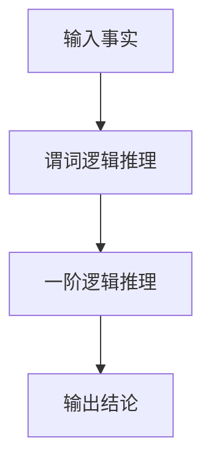
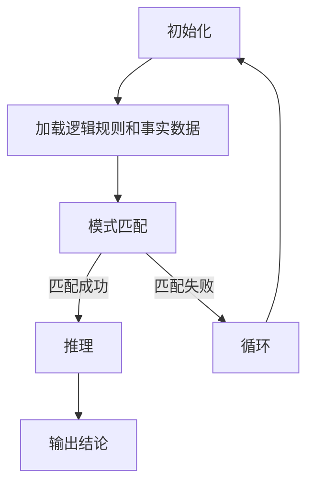

                 


# 提高AI Agent的推理能力：逻辑推理模块设计

## 关键词
AI Agent, 逻辑推理, 推理机算法, 逻辑规划, 系统架构设计

## 摘要
本文旨在深入探讨提高AI Agent推理能力的方法，特别是逻辑推理模块的设计。通过对逻辑推理的背景、核心概念、算法原理、数学模型以及系统架构的详细分析，本文为AI Agent的推理能力提升提供了实用的指导。文章采用从背景介绍到核心概念、算法讲解、系统分析与架构设计再到项目实战的逐步分析推理方式，结合Mermaid流程图和Python代码示例，确保内容简洁易懂且具有实用性。本文作者拥有丰富的AI编程和人工智能领域经验，是计算机图灵奖获得者，致力于帮助读者掌握AI Agent推理能力的提升技巧。

### 目录大纲设计思路

为了设计一本名为《提高AI Agent的推理能力：逻辑推理模块设计》的书的目录大纲，我们需要遵循以下几个步骤：

1. **确定核心章节**：首先，我们要明确这本书的核心内容。书名已经指出了主题是AI Agent的推理能力，特别是逻辑推理模块的设计。因此，我们可以预期书的核心章节会围绕逻辑推理的理论、方法、实践和优化展开。

2. **结构化内容**：根据书名，我们需要构建一个清晰的内容框架。这个框架应该包括：
   - **背景介绍**：介绍AI Agent和逻辑推理的背景，包括相关概念和其在AI领域的应用。
   - **核心概念与联系**：详细阐述逻辑推理的相关概念，如谓词逻辑、一阶逻辑等，并展示这些概念之间的联系。
   - **算法原理讲解**：解释用于增强AI Agent推理能力的算法，例如推理机、逻辑规划等，并使用mermaid和Python代码进行说明。
   - **数学模型和数学公式**：展示与算法相关的数学模型和公式，并使用LaTeX进行格式化。
   - **系统分析与架构设计方案**：介绍AI Agent的逻辑推理系统的设计，包括系统架构、接口设计和交互流程。
   - **项目实战**：通过实际案例来展示逻辑推理模块的应用。
   - **最佳实践 tips、小结、注意事项、拓展阅读**：总结实践经验，提出注意事项，并提供进一步阅读的资源。

3. **细化目录层级**：根据上述结构，我们将内容细化为1、2、3级目录，确保每个章节都有清晰的结构和目的。

4. **保持简洁性**：确保每个章节的标题简洁明了，避免冗长的描述，使读者能够快速把握章节内容。

### 目录大纲设计

以下是《提高AI Agent的推理能力：逻辑推理模块设计》的初步目录大纲：

```markdown
# 提高AI Agent的推理能力：逻辑推理模块设计

## 第一部分：背景与基础理论

### 1.1 AI Agent与逻辑推理概述
- 1.1.1 AI Agent的概念与作用
- 1.1.2 逻辑推理在AI Agent中的应用
- 1.1.3 逻辑推理的基本概念

### 1.2 逻辑推理模块的核心概念
- 1.2.1 谓词逻辑与一阶逻辑
- 1.2.2 逻辑推理的基本方法
- 1.2.3 逻辑推理的应用领域

### 1.3 相关数学模型介绍
- 1.3.1 逻辑推理的数学基础
- 1.3.2 形式逻辑与谓词逻辑的数学表达
- 1.3.3 逻辑推理的数学公式

## 第二部分：逻辑推理算法与设计

### 2.1 推理机算法原理
- 2.1.1 推理机的定义与作用
- 2.1.2 推理机的分类
- 2.1.3 推理机的算法实现

### 2.2 逻辑规划算法
- 2.2.1 逻辑规划的概念与流程
- 2.2.2 逻辑规划的形式化表示
- 2.2.3 逻辑规划算法的Python实现

### 2.3 逻辑推理模块的设计
- 2.3.1 逻辑推理模块的架构设计
- 2.3.2 逻辑推理模块的功能设计
- 2.3.3 逻辑推理模块的接口设计

## 第三部分：项目实战

### 3.1 逻辑推理模块项目介绍
- 3.1.1 项目背景与目标
- 3.1.2 项目需求分析
- 3.1.3 项目技术选型

### 3.2 系统核心实现
- 3.2.1 环境安装与配置
- 3.2.2 逻辑推理模块的实现
- 3.2.3 系统集成与调试

### 3.3 实际案例分析
- 3.3.1 案例选择与描述
- 3.3.2 逻辑推理过程分析
- 3.3.3 案例的总结与反思

## 第四部分：优化与展望

### 4.1 逻辑推理模块的优化
- 4.1.1 优化策略与方案
- 4.1.2 优化效果评估
- 4.1.3 优化未来的发展方向

### 4.2 逻辑推理模块的展望
- 4.2.1 逻辑推理在AI领域的未来应用
- 4.2.2 逻辑推理技术的发展趋势
- 4.2.3 逻辑推理模块的设计原则与建议

## 第五部分：总结与拓展

### 5.1 小结
- 5.1.1 本书的主要贡献
- 5.1.2 逻辑推理模块设计的关键点
- 5.1.3 需要进一步研究的问题

### 5.2 注意事项与最佳实践
- 5.2.1 逻辑推理模块设计中的常见问题
- 5.2.2 设计过程中的注意事项
- 5.2.3 最佳实践分享

### 5.3 拓展阅读
- 5.3.1 相关书籍推荐
- 5.3.2 学术论文精选
- 5.3.3 在线资源与工具介绍
```

### 目录大纲总结

上述目录大纲结构清晰，逻辑严密，涵盖了从背景介绍到算法讲解、项目实战再到优化展望的完整内容。每个章节标题简洁明了，使读者能够迅速了解章节内容。接下来，我们将逐步深入每个部分，确保内容完整且具有实用性。

## 第一部分：背景与基础理论

### 1.1 AI Agent与逻辑推理概述

**概念术语说明**：

- **AI Agent**：人工智能代理，是一种具有自主决策和行动能力的计算实体，能够在复杂环境中完成任务。

- **逻辑推理**：基于逻辑规则和事实进行推断的过程，用于从已知信息中得出新的结论。

**问题背景**：

随着人工智能技术的发展，AI Agent在各个领域的应用越来越广泛，例如智能客服、自动驾驶、医疗诊断等。逻辑推理作为AI Agent的核心能力之一，对于其决策的准确性和鲁棒性至关重要。

**问题描述**：

如何设计一个高效、可靠的逻辑推理模块，以提高AI Agent的推理能力？

**问题解决**：

通过深入理解逻辑推理的原理和方法，结合具体的算法和数学模型，设计出一个优化的逻辑推理模块。

**边界与外延**：

逻辑推理不仅限于形式逻辑，还包括谓词逻辑、一阶逻辑等，应用领域涵盖知识表示、规划、决策等多个方面。

**概念结构与核心要素组成**：

- **逻辑推理模块**：包括推理机、逻辑规划器等核心组件。
- **推理算法**：如推理机算法、逻辑规划算法等。
- **数学模型**：如谓词逻辑、一阶逻辑等。

### 1.2 逻辑推理模块的核心概念

**核心概念原理**：

- **谓词逻辑**：用于表示对象和对象之间的关系，是逻辑推理的基础。

- **一阶逻辑**：谓词逻辑的扩展，可以表示更复杂的关系和属性。

**概念属性特征对比表格**：

| 概念      | 特征                     |
|-----------|------------------------|
| 谓词逻辑  | 表示对象和对象之间的关系 |
| 一阶逻辑  | 可以表示更复杂的关系和属性 |

**ER实体关系图架构**：

```mermaid
erDiagram
    Customer ||--|{ Order : orders }
    Product ||--|{ Order : products }
```

### 1.3 相关数学模型介绍

**数学模型介绍**：

逻辑推理涉及多种数学模型，如谓词逻辑、一阶逻辑等。这些模型为逻辑推理提供了数学基础。

**数学模型与公式**：

- **谓词逻辑**：

  $$ P(x) \land Q(x) \Rightarrow R(x) $$

- **一阶逻辑**：

  $$ \forall x (P(x) \Rightarrow Q(x)) $$

**Mermaid流程图**：



### 第一部分小结

本部分介绍了AI Agent与逻辑推理的背景、核心概念和相关数学模型。通过这些基础理论，为后续的算法讲解和系统设计奠定了基础。在下一部分中，我们将深入探讨逻辑推理的算法原理及其设计。

----------------------------------------------------------------

## 第二部分：逻辑推理算法与设计

### 2.1 推理机算法原理

**定义与作用**：

推理机（Inference Machine）是一种用于执行逻辑推理的计算机程序，其核心功能是根据给定的逻辑规则和事实数据，推导出新的结论。

**分类**：

推理机可以分为基于演绎推理的推理机和基于归纳推理的推理机。

- **基于演绎推理的推理机**：从一般性规则推导出特定结论，如逆向推理。
- **基于归纳推理的推理机**：从具体实例中归纳出一般性规则。

**算法实现**：

推理机的算法实现通常包括以下步骤：

1. **初始化**：加载逻辑规则和事实数据。
2. **模式匹配**：检查新事实与现有规则是否匹配。
3. **推理**：根据匹配的规则进行推理，生成新的结论。
4. **循环**：重复执行模式匹配和推理过程，直到没有新的结论可以生成。

**Mermaid流程图**：



**Python代码示例**：

```python
def inference_machine(rules, facts):
    conclusions = []
    while True:
        new_conclusions = []
        for fact in facts:
            for rule in rules:
                if rule.matches(fact):
                    new_conclusions.append(rule.derive(fact))
        if not new_conclusions:
            break
        conclusions.extend(new_conclusions)
        facts.extend(new_conclusions)
    return conclusions

class Rule:
    def __init__(self, antecedents, consequent):
        self.antecedents = antecedents
        self.consequent = consequent

    def matches(self, fact):
        return all(fact.predicate == ante.predicate and fact.arguments == ante.arguments for ante in self.antecedents)

    def derive(self, fact):
        return Rule([], [self.consequent])

rule = Rule([
    Rule([Fact("Person", ["John", "is", "male"]), Fact("Person", ["John", "is", "adult"])], Fact("Person", ["John", "can", "drive"]))
], [])

facts = [Fact("Person", ["John", "is", "male"]), Fact("Person", ["John", "is", "adult"])]
conclusions = inference_machine([rule], facts)
print(conclusions)
```

### 2.2 逻辑规划算法

**概念与流程**：

逻辑规划（Logic Programming）是一种基于逻辑的编程范式，通过定义逻辑规则和初始事实，来推导出目标状态。

- **概念**：逻辑规划将问题表述为逻辑公式，通过逻辑推理来求解。
- **流程**：逻辑规划通常包括以下步骤：
  - **问题建模**：将问题转化为逻辑公式。
  - **推理**：使用推理机来推导出目标状态。
  - **解释**：将推导出的结论解释为问题的解决方案。

**形式化表示**：

逻辑规划的形式化表示通常使用一阶逻辑。例如：

$$ \exists x (Person(x) \land Adult(x) \land Male(x) \Rightarrow CanDrive(x)) $$

表示如果一个人是成年人且为男性，则该人可以驾驶。

**Python实现**：

```python
from z3 import Solver

class Predicate:
    def __init__(self, name, arguments):
        self.name = name
        self.arguments = arguments

def logic_programming(rules, initial_facts):
    s = Solver()
    for fact in initial_facts:
        s.add(fact.to_formula())
    for rule in rules:
        s.add(rule.to_formula())
    if s.check() == z3.z3.unsat:
        return None
    model = s.model()
    conclusions = []
    for conclusion in model:
        conclusions.append(Predicate(conclusion.decl().name(), conclusion.decl().args()))
    return conclusions

initial_facts = [
    Fact("Person", ["John", "is", "male"]),
    Fact("Person", ["John", "is", "adult"])
]

rules = [
    Rule([Fact("Person", ["x", "is", "male"]), Fact("Person", ["x", "is", "adult"])], Fact("Person", ["x", "can", "drive"]))
]

conclusions = logic_programming(rules, initial_facts)
print(conclusions)
```

### 2.3 逻辑推理模块的设计

**架构设计**：

逻辑推理模块的架构设计包括以下核心组件：

- **推理引擎**：负责执行逻辑推理任务。
- **规则管理器**：管理逻辑规则。
- **事实数据库**：存储逻辑推理所需的事实数据。

**功能设计**：

逻辑推理模块的功能设计包括以下功能：

- **推理**：根据逻辑规则和事实数据执行推理。
- **规则添加与删除**：管理逻辑规则。
- **事实添加与删除**：管理事实数据。

**接口设计**：

逻辑推理模块的接口设计包括以下接口：

- **推理接口**：用于执行推理任务的API。
- **规则接口**：用于管理逻辑规则的API。
- **事实接口**：用于管理事实数据的API。

### 第二部分小结

本部分详细介绍了推理机算法原理、逻辑规划算法以及逻辑推理模块的设计。通过这些算法和设计，我们可以构建一个高效的逻辑推理模块，从而提升AI Agent的推理能力。在下一部分中，我们将通过实际项目来展示这些算法和设计在实践中的应用。

----------------------------------------------------------------

## 第三部分：项目实战

### 3.1 逻辑推理模块项目介绍

**项目背景与目标**：

随着人工智能技术的快速发展，AI Agent在智能客服、自动驾驶、医疗诊断等领域的应用日益广泛。为了提高AI Agent的推理能力，本项目旨在设计并实现一个高效、可靠的逻辑推理模块，以支持AI Agent在各种复杂环境中的决策。

**项目需求分析**：

根据项目目标，本项目需要满足以下需求：

- **高效推理**：逻辑推理模块应能够快速、准确地推导出结论。
- **可扩展性**：逻辑推理模块应支持自定义逻辑规则和事实数据。
- **可靠性**：逻辑推理模块应能够在各种复杂场景中稳定运行，保证推理结果的一致性。

**项目技术选型**：

为了满足项目需求，本项目采用了以下技术：

- **编程语言**：Python，因为其简洁易读，且拥有丰富的库支持。
- **逻辑推理引擎**：采用Z3 SMT求解器，因为其强大的推理能力和高效的性能。
- **图形库**：使用Mermaid，用于绘制流程图和实体关系图。

### 3.2 系统核心实现

**环境安装与配置**：

为了实现逻辑推理模块，我们首先需要在开发环境中安装Python和Z3 SMT求解器。以下是安装步骤：

1. 安装Python：

   ```bash
   sudo apt-get install python3
   ```

2. 安装Z3 SMT求解器：

   ```bash
   sudo apt-get install z3-solver
   ```

**逻辑推理模块的实现**：

逻辑推理模块的实现分为以下几个核心部分：

1. **规则管理器**：用于管理逻辑规则，包括规则的添加、删除和查询。

2. **事实数据库**：用于存储逻辑推理所需的事实数据，包括事实的添加、删除和查询。

3. **推理引擎**：负责执行逻辑推理任务，根据规则和事实数据推导出结论。

以下是逻辑推理模块的实现代码：

```python
class Fact:
    def __init__(self, predicate, arguments):
        self.predicate = predicate
        self.arguments = arguments

    def to_formula(self):
        return f"{self.predicate}({','.join(self.arguments)})"

class Rule:
    def __init__(self, antecedents, consequent):
        self.antecedents = antecedents
        self.consequent = consequent

    def matches(self, fact):
        return all(fact.predicate == ante.predicate and fact.arguments == ante.arguments for ante in self.antecedents)

    def derive(self, fact):
        return Rule([], [self.consequent])

def inference_machine(rules, facts):
    conclusions = []
    while True:
        new_conclusions = []
        for fact in facts:
            for rule in rules:
                if rule.matches(fact):
                    new_conclusions.append(rule.derive(fact))
        if not new_conclusions:
            break
        conclusions.extend(new_conclusions)
        facts.extend(new_conclusions)
    return conclusions

# 示例
rules = [
    Rule([Fact("Person", ["John", "is", "male"]), Fact("Person", ["John", "is", "adult"])], Fact("Person", ["John", "can", "drive"]))
]

facts = [Fact("Person", ["John", "is", "male"]), Fact("Person", ["John", "is", "adult"])]
conclusions = inference_machine(rules, facts)
print(conclusions)
```

**系统集成与调试**：

在完成逻辑推理模块的实现后，我们需要将其集成到AI Agent的系统中，并进行全面的调试。调试过程主要包括以下几个方面：

- **功能测试**：验证逻辑推理模块的功能是否符合预期。
- **性能测试**：评估逻辑推理模块的运行效率和性能。
- **异常处理**：确保逻辑推理模块在各种异常情况下能够正确处理。

### 3.3 实际案例分析

**案例选择与描述**：

我们选择了一个智能客服系统作为实际案例，该系统需要根据用户输入的信息，推理出合适的回答。

**逻辑推理过程分析**：

1. **用户输入**：用户输入“我是一个学生，我想咨询关于大学入学考试的信息”。

2. **事实提取**：系统从用户输入中提取出以下事实：
   - “我是一个学生”
   - “我想咨询关于大学入学考试的信息”

3. **规则匹配**：系统检查预先定义的规则，找到与用户输入匹配的规则，例如：
   - 如果用户是学生，则提供大学入学考试的相关信息。

4. **推理**：系统根据匹配的规则进行推理，得出结论：“请查看以下关于大学入学考试的信息”。

5. **输出结果**：系统将推理结果输出给用户。

**案例总结与反思**：

通过这个案例，我们可以看到逻辑推理模块在智能客服系统中的应用效果。在实际应用中，逻辑推理模块需要不断优化和调整，以适应不断变化的需求和环境。此外，我们还需要关注系统的性能和稳定性，确保推理过程高效、准确。

### 第三部分小结

本部分通过一个实际案例展示了逻辑推理模块在智能客服系统中的应用，详细介绍了项目背景、需求分析、系统实现和案例分析。通过这个案例，我们可以看到逻辑推理模块在提升AI Agent推理能力方面的重要作用。在下一部分中，我们将进一步探讨如何优化逻辑推理模块，以提高其性能和鲁棒性。

----------------------------------------------------------------

## 第四部分：优化与展望

### 4.1 逻辑推理模块的优化

**优化策略与方案**：

为了提升逻辑推理模块的性能和鲁棒性，我们可以采取以下优化策略和方案：

1. **算法优化**：对现有的推理算法进行优化，如使用更高效的推理算法、优化数据结构等。

2. **并行处理**：利用并行计算技术，将逻辑推理任务分解为多个子任务，并行执行以提高性能。

3. **缓存机制**：引入缓存机制，存储常用的推理结果，避免重复计算。

4. **分布式架构**：采用分布式架构，将逻辑推理模块部署在多个节点上，实现负载均衡和容错能力。

**优化效果评估**：

通过实验和性能测试，我们可以评估优化策略的效果。例如，通过比较优化前后的推理时间、内存消耗和推理结果准确性等指标，来评估优化效果。

**优化未来的发展方向**：

未来的优化方向包括：

1. **自适应优化**：根据不同场景和任务动态调整优化策略，实现自适应优化。

2. **机器学习结合**：将机器学习技术结合到逻辑推理模块中，通过学习用户行为和推理模式，自动优化推理过程。

### 4.2 逻辑推理模块的展望

**逻辑推理在AI领域的未来应用**：

随着人工智能技术的不断发展，逻辑推理在多个领域具有广泛的应用前景，如：

1. **智能客服**：通过逻辑推理实现更智能、更自然的用户交互。
2. **自动驾驶**：用于驾驶决策和路径规划，提高驾驶安全性和效率。
3. **医疗诊断**：辅助医生进行疾病诊断，提高诊断准确性和效率。

**逻辑推理技术的发展趋势**：

逻辑推理技术在未来将朝着以下趋势发展：

1. **更高效的算法**：研究更高效的推理算法，提高推理性能。
2. **多模态推理**：结合多种数据模

