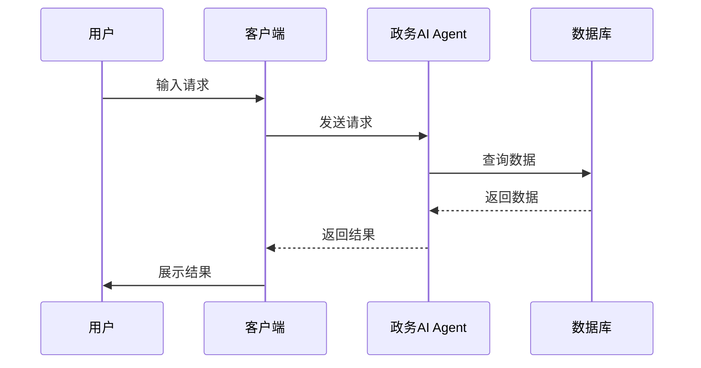

                 

### 引言

政务AI Agent，即政府公共服务的人工智能代理，是一种先进的技术工具，旨在通过智能化的手段提升公共服务的效率和效果。在全球范围内，随着人工智能技术的迅猛发展，越来越多的政府部门开始探索和引入AI Agent，以应对日益复杂的公共服务需求。政务AI Agent的应用场景广泛，包括但不限于智能问答、自动化审批、公共资源调度、以及政策分析和风险评估等领域。

本篇文章将以“政务AI Agent：提升公共服务效率”为标题，深入探讨这一前沿技术的核心概念、应用场景、技术实现、系统架构设计以及实际项目案例。文章将通过逻辑清晰、结构紧凑、简单易懂的叙述方式，逐步引导读者理解政务AI Agent的技术原理和应用价值。

首先，我们将对政务AI Agent的定义和基本概念进行梳理，明确其核心组成部分和基本功能。接下来，文章将探讨政务AI Agent在提升公共服务效率方面的具体应用场景，并通过实例展示其作用。随后，我们将深入探讨政务AI Agent的技术实现，包括自然语言处理、机器学习算法等关键技术，并详细分析这些技术在实际应用中的作用。

在文章的后半部分，我们将详细描述政务AI Agent的系统架构设计，包括系统功能设计、系统架构图、系统接口设计和系统交互，帮助读者全面理解系统的运作方式。随后，文章将分享几个典型的政务AI Agent项目案例，通过代码实现、项目分析和详细讲解，展示政务AI Agent在实际项目中的应用效果。

最后，我们将总结政务AI Agent在提升公共服务效率方面的最佳实践，提出一些需要注意的问题，并对未来的发展趋势进行展望。通过这篇文章，读者将能够全面了解政务AI Agent的技术原理、应用场景和未来发展方向，为政府公共服务智能化转型提供参考和启示。

### 关键词

政务AI Agent、公共服务、效率提升、自然语言处理、机器学习、系统架构设计、项目案例、技术实现。

### 摘要

本文旨在探讨政务AI Agent在提升公共服务效率方面的应用，通过对政务AI Agent的定义、基本概念、技术实现、系统架构设计以及实际项目案例的深入分析，全面揭示其在政府公共服务中的重要作用。文章首先介绍了政务AI Agent的核心概念和基本功能，包括智能问答、自动化审批、公共资源调度等。接着，探讨了政务AI Agent在提升公共服务效率方面的具体应用场景，并通过实例展示了其效果。随后，文章深入分析了政务AI Agent的技术实现，涉及自然语言处理、机器学习算法等关键技术。在此基础上，文章详细描述了政务AI Agent的系统架构设计，包括系统功能设计、系统架构图、系统接口设计和系统交互。最后，文章通过几个典型的政务AI Agent项目案例，展示了其在实际项目中的应用效果，并总结了提升公共服务效率的最佳实践。通过对本文的阅读，读者将能够全面了解政务AI Agent的技术原理、应用场景和未来发展趋势，为政府公共服务智能化转型提供参考和启示。

### 背景介绍

政务AI Agent是一种智能化的技术工具，旨在通过人工智能技术提升政府公共服务的效率和质量。随着大数据、云计算、自然语言处理等技术的不断发展，政务AI Agent逐渐成为政府数字化转型的重要组成部分。首先，我们需要明确政务AI Agent的定义和基本概念。

#### 定义

政务AI Agent，简而言之，是专门为政府公共服务设计的人工智能代理。它利用先进的机器学习、自然语言处理和数据分析等技术，实现智能问答、自动化审批、公共资源调度等功能。政务AI Agent的核心目标是提高公共服务的响应速度和准确度，减少人工干预，从而提升政府工作的整体效率。

#### 核心组成部分

政务AI Agent主要由以下几个核心组成部分构成：

1. **数据采集和处理模块**：这一模块负责从各种数据源中收集和处理数据，包括结构化数据和非结构化数据。通过对数据的清洗、转换和存储，为后续的智能分析和决策提供可靠的数据基础。

2. **自然语言处理模块**：自然语言处理（NLP）是政务AI Agent的核心技术之一。它负责理解和生成自然语言，使得政务AI Agent能够与用户进行自然的对话交流，实现智能问答、文本分析等功能。

3. **机器学习算法模块**：机器学习算法是政务AI Agent实现智能分析和决策的关键。通过训练模型，政务AI Agent可以识别模式、预测趋势、优化决策，从而在公共服务中发挥重要作用。

4. **用户交互界面**：用户交互界面是政务AI Agent与用户之间的桥梁。通过友好的界面设计，政务AI Agent能够提供直观、便捷的服务，使用户能够轻松获取所需的信息和帮助。

#### 基本功能

政务AI Agent具有以下基本功能：

1. **智能问答**：政务AI Agent可以理解用户的自然语言查询，并迅速给出准确的回答。例如，在政府门户网站上，用户可以通过与政务AI Agent的对话获取政策法规、办事流程等信息。

2. **自动化审批**：政务AI Agent可以自动处理各种审批流程，如税务申报、社会保障等。通过预先设定的规则和算法，政务AI Agent能够快速、准确地完成审批任务，提高审批效率。

3. **公共资源调度**：政务AI Agent可以分析和预测公共资源的需求，优化资源的分配和调度。例如，在交通管理中，政务AI Agent可以实时分析交通流量，优化红绿灯时间，提高道路通行效率。

4. **政策分析和风险评估**：政务AI Agent可以处理大量的政策文本和数据，进行深入的分析和评估。通过机器学习算法，政务AI Agent可以识别潜在的风险，为政策制定提供科学依据。

#### 应用场景

政务AI Agent在政府公共服务中具有广泛的应用场景：

1. **公共咨询服务**：政务AI Agent可以广泛应用于各类公共咨询服务，如纳税咨询、医疗咨询、社会保障咨询等。

2. **行政审批服务**：政务AI Agent可以自动化处理各类行政审批流程，如企业注册、项目审批、行政许可等。

3. **交通管理**：政务AI Agent可以应用于交通管理领域，实时分析交通流量，优化交通信号控制，减少交通拥堵。

4. **应急管理**：政务AI Agent可以协助政府进行应急管理，如自然灾害预警、疫情监控等。

5. **政策分析**：政务AI Agent可以处理大量的政策文本和数据，为政策制定和调整提供科学依据。

总之，政务AI Agent作为一种智能化技术工具，在提升政府公共服务效率方面具有巨大的潜力。随着技术的不断进步和应用的不断拓展，政务AI Agent将在未来的政府公共服务中发挥越来越重要的作用。

### 核心概念与联系

在深入探讨政务AI Agent之前，我们需要理解几个核心概念，这些概念不仅是政务AI Agent的基础，也是推动其实现高效公共服务的关键技术。

#### 1. 自然语言处理（NLP）

自然语言处理（NLP）是使计算机能够理解、解释和生成人类自然语言的技术。在政务AI Agent中，NLP技术至关重要，因为它负责处理用户的自然语言输入，并生成相应的回答。NLP的关键技术包括分词、词性标注、命名实体识别、句法分析和语义理解等。例如，当用户询问“我如何申请护照？”时，NLP技术可以帮助政务AI Agent理解用户的问题，并生成包含申请流程和所需文件的回答。

**概念属性特征对比表格：**

| 技术名称 | 关键功能 | 示例应用 |
| --- | --- | --- |
| 分词 | 将文本分割成有意义的词语 | “政务AI Agent” 分词为 “政务”、“AI”、“Agent” |
| 词性标注 | 为词语分配词性（如名词、动词等） | “申请” 被标注为动词 |
| 命名实体识别 | 识别文本中的特定实体（如人名、地名等） | 识别文本中的 “中国政府” |
| 句法分析 | 解析句子的结构 | 确定句子中的主语、谓语和宾语 |
| 语义理解 | 理解文本中的深层含义 | 解释用户问题中的意图和需求 |

**ER实体关系图架构：**

```mermaid
erDiagram
  Customer ||--|{ Order } : "places"
  Product ||--|{ Order } : "includes"
```

在上面的ER实体关系图中，`Customer` 与 `Order` 之间存在“places”关系，表示客户可以下单；`Product` 与 `Order` 之间存在“includes”关系，表示订单可以包含多个产品。

#### 2. 机器学习（ML）

机器学习（ML）是使计算机系统通过数据和经验自动改进性能的技术。在政务AI Agent中，机器学习算法用于从数据中学习规律和模式，以实现自动化决策和优化。常见的机器学习算法包括决策树、随机森林、支持向量机、神经网络等。

**概念属性特征对比表格：**

| 算法类型 | 特点 | 示例应用 |
| --- | --- | --- |
| 决策树 | 基于规则、易于解释 | 贷款审批决策 |
| 随机森林 | 集成多个决策树、减少过拟合 | 货运物流优化 |
| 支持向量机 | 寻找最佳决策边界、高维度空间有效 | 信用评分系统 |
| 神经网络 | 模拟人脑神经网络、自适应学习 | 图像识别、语音识别 |

**ER实体关系图架构：**

```mermaid
erDiagram
  Model ||--|{ Feature } : "captures"
  Data ||--|{ Model } : "trains"
```

在上面的ER实体关系图中，`Model` 与 `Feature` 之间存在“captures”关系，表示模型捕捉特征；`Data` 与 `Model` 之间存在“trains”关系，表示数据训练模型。

#### 3. 数据库管理系统（DBMS）

数据库管理系统（DBMS）是一种用于组织、存储和管理数据的软件系统。在政务AI Agent中，DBMS负责存储和管理大量的数据，为AI Agent提供可靠的数据基础。常用的DBMS包括关系型数据库（如MySQL、PostgreSQL）和NoSQL数据库（如MongoDB、Cassandra）。

**概念属性特征对比表格：**

| 数据库类型 | 关键特点 | 示例应用 |
| --- | --- | --- |
| 关系型数据库 | 表关系、SQL查询 | 财务报表系统 |
| NoSQL数据库 | 高扩展性、灵活数据模式 | 社交网络分析 |

**ER实体关系图架构：**

```mermaid
erDiagram
  Customer ||--|{ Order } : "places"
  Product ||--|{ Inventory } : "stocks"
```

在上面的ER实体关系图中，`Customer` 与 `Order` 之间存在“places”关系，表示客户可以下单；`Product` 与 `Inventory` 之间存在“stocks”关系，表示产品库存。

通过以上对自然语言处理、机器学习和数据库管理系统等核心概念的介绍，我们可以更好地理解政务AI Agent的技术基础和实现原理。这些技术不仅相互独立，还紧密联系，共同构成了政务AI Agent的强大功能，使其在提升公共服务效率方面具有显著的成效。

### 算法原理讲解

在深入探讨政务AI Agent的技术实现之前，我们需要了解几个关键算法，这些算法在政务AI Agent的智能问答、自动化审批、公共资源调度等功能中起到了至关重要的作用。

#### 1. 自然语言处理（NLP）

自然语言处理（NLP）算法是政务AI Agent的核心组成部分，它负责处理用户的自然语言输入，并生成相应的回答。以下将介绍几种常见的NLP算法：

**1.1 词向量模型**

词向量模型（如Word2Vec、GloVe）是将文本中的词语转换为向量的方法，使得计算机可以理解词语的语义含义。词向量模型的基本原理是通过对文本数据进行训练，将每个词语映射到一个高维向量空间中，使得语义相近的词语在向量空间中彼此靠近。

**算法流程：**

1. **数据预处理**：首先，对文本进行分词，将文本分割成单个词语。
2. **构建词汇表**：将所有唯一的词语构建成一个词汇表，并为每个词语分配一个唯一的ID。
3. **训练词向量**：使用训练数据训练词向量模型，将每个词语映射到一个高维向量。
4. **向量相似性计算**：通过计算向量之间的余弦相似度，判断词语的语义相似性。

**Python代码示例：**

```python
from sklearn.feature_extraction.text import CountVectorizer
from sklearn.metrics.pairwise import cosine_similarity

# 示例文本
sentences = ["政务AI Agent如何提升公共服务效率？", "政务AI Agent可以处理哪些任务？"]

# 构建词汇表
vectorizer = CountVectorizer()
X = vectorizer.fit_transform(sentences)

# 计算文本相似度
similarity = cosine_similarity(X)

print(similarity)
```

**数学模型和公式：**

词向量的相似性计算公式为：
$$
\cos(\theta) = \frac{\textbf{u} \cdot \textbf{v}}{||\textbf{u}|| \cdot ||\textbf{v}||}
$$
其中，$\textbf{u}$ 和 $\textbf{v}$ 分别为两个词向量的表示，$\theta$ 为它们之间的夹角。

**1.2 序列到序列模型（Seq2Seq）**

序列到序列模型（Seq2Seq）是处理序列数据的一种有效方法，常用于机器翻译和问答系统。Seq2Seq模型通过编码器和解码器两个神经网络，将输入序列编码成一个固定长度的向量，然后解码成输出序列。

**算法流程：**

1. **编码器**：将输入序列（如用户问题）编码成一个固定长度的向量。
2. **解码器**：根据编码器的输出，生成输出序列（如回答）。

**Python代码示例：**

```python
from keras.models import Model
from keras.layers import Input, LSTM, Embedding, Dense

# 输入层
input_seq = Input(shape=(max_sequence_length,))
# 编码器
encoded_seq = Embedding(vocabulary_size, embedding_dim)(input_seq)
encoded_seq = LSTM(units)(encoded_seq)
# 解码器
decoded_seq = Embedding(vocabulary_size, embedding_dim)(encoded_seq)
decoded_seq = LSTM(units, return_sequences=True)(decoded_seq)
decoded_seq = Dense(vocabulary_size, activation='softmax')(decoded_seq)
# 模型
model = Model(inputs=input_seq, outputs=decoded_seq)
model.compile(optimizer='adam', loss='categorical_crossentropy')
```

**数学模型和公式：**

编码器和解码器分别使用以下公式：
$$
\textbf{c} = \textit{encoder}(\textbf{x})
$$
$$
\textbf{y} = \textit{decoder}(\textbf{c})
$$
其中，$\textbf{x}$ 为输入序列，$\textbf{c}$ 为编码后的固定长度向量，$\textbf{y}$ 为输出序列。

#### 2. 机器学习算法

机器学习算法在政务AI Agent中用于自动化决策和优化。以下将介绍几种常见的机器学习算法：

**2.1 决策树（Decision Tree）**

决策树是一种基于规则的方法，通过一系列条件分支来分类或回归数据。决策树的核心是树形结构，每个节点表示一个特征，每个分支表示该特征的不同取值。

**算法流程：**

1. **特征选择**：选择一个最佳特征进行划分，通常使用信息增益或基尼系数作为评估指标。
2. **递归划分**：对选择的最优特征进行划分，创建子节点，重复上述过程直到满足停止条件。

**Python代码示例：**

```python
from sklearn.tree import DecisionTreeClassifier

# 示例数据
X = [[0, 0], [1, 0], [0, 1], [1, 1]]
y = [0, 1, 1, 0]

# 构建决策树
clf = DecisionTreeClassifier()
clf.fit(X, y)

# 可视化决策树
from sklearn.tree import plot_tree
plot_tree(clf)
```

**数学模型和公式：**

决策树基于以下公式：
$$
Gini = 1 - \sum_{i=1}^{n}\left(\frac{c_i}{n}\right)^2
$$
其中，$n$ 为总样本数，$c_i$ 为属于第 $i$ 个类别的样本数。

**2.2 随机森林（Random Forest）**

随机森林是一种集成学习方法，通过构建多个决策树并综合它们的预测结果来提高模型的泛化能力。

**算法流程：**

1. **特征采样**：每次构建决策树时，随机选择一部分特征进行划分。
2. **构建决策树**：为每个决策树训练一个分类器。
3. **集成预测**：将多个决策树的预测结果进行投票或平均，得到最终预测结果。

**Python代码示例：**

```python
from sklearn.ensemble import RandomForestClassifier

# 示例数据
X = [[0, 0], [1, 0], [0, 1], [1, 1]]
y = [0, 1, 1, 0]

# 构建随机森林
clf = RandomForestClassifier(n_estimators=100)
clf.fit(X, y)

# 可视化随机森林
from sklearn.tree import plot_tree
plot_tree(clf.estimators_[0], filled=True)
```

**数学模型和公式：**

随机森林的预测基于以下公式：
$$
f(x) = \sum_{i=1}^{n}w_i f_i(x)
$$
其中，$f_i(x)$ 为第 $i$ 个决策树的预测结果，$w_i$ 为第 $i$ 个决策树的权重。

通过以上对自然语言处理和机器学习算法的详细介绍，我们可以看到这些算法在政务AI Agent中的应用价值。自然语言处理算法使得政务AI Agent能够理解和生成自然语言，实现智能问答；机器学习算法则帮助政务AI Agent进行自动化决策和优化，提高公共服务的效率。这些算法的深入理解和应用，是政务AI Agent技术实现的核心，也是推动政府公共服务智能化转型的关键。

### 系统分析与架构设计方案

#### 1. 问题场景与项目背景

随着数字化和信息化的不断推进，政府公共服务的需求日益复杂多样。传统的手工处理方式已经难以满足公众的高效、便捷服务需求。为了提升公共服务的效率，我们需要构建一个智能化、自动化的政务AI Agent系统。该系统旨在通过集成自然语言处理、机器学习算法等先进技术，为公众提供智能问答、自动化审批、公共资源调度等服务。

#### 2. 系统功能设计

政务AI Agent系统的核心功能主要包括以下几个方面：

1. **智能问答**：通过自然语言处理技术，政务AI Agent能够理解用户的自然语言输入，并生成相应的回答。例如，用户询问“如何申请护照？”时，政务AI Agent能够快速提供申请流程和所需材料。

2. **自动化审批**：政务AI Agent可以自动化处理各种行政审批流程，如税务申报、社会保障等。通过机器学习算法，政务AI Agent能够准确识别用户提交的申请材料，并根据预定义的规则快速完成审批。

3. **公共资源调度**：政务AI Agent可以根据实时数据分析，优化公共资源的分配和调度。例如，在交通管理领域，政务AI Agent可以实时分析交通流量，优化红绿灯时间，减少交通拥堵。

4. **政策分析和风险评估**：政务AI Agent可以处理大量的政策文本和数据，进行深入的政策分析和风险评估。通过机器学习算法，政务AI Agent能够识别潜在的风险，为政策制定提供科学依据。

#### 3. 系统架构设计

政务AI Agent系统的架构设计分为多个层次，包括数据层、算法层、应用层和展示层。以下将详细描述各层的功能和设计思路。

**3.1 数据层**

数据层是政务AI Agent系统的基石，主要负责数据采集、存储和管理。数据来源包括政府内部数据、外部公开数据、社交媒体数据等。数据层的主要功能包括：

- **数据采集**：通过爬虫、API接口等方式，从各种数据源中获取所需数据。
- **数据存储**：使用关系型数据库（如MySQL）和NoSQL数据库（如MongoDB）存储不同类型的数据，确保数据的高效存取。
- **数据管理**：使用数据清洗、转换和存储技术，确保数据的质量和一致性。

**3.2 算法层**

算法层是政务AI Agent系统的核心，负责实现自然语言处理、机器学习算法等功能。算法层的主要功能包括：

- **自然语言处理**：使用词向量模型、序列到序列模型等NLP算法，实现智能问答和文本分析。
- **机器学习算法**：使用决策树、随机森林、神经网络等ML算法，实现自动化审批和公共资源调度。
- **算法训练**：使用训练数据，对算法模型进行训练和优化，提高模型的预测准确性和鲁棒性。

**3.3 应用层**

应用层是政务AI Agent系统的应用实现，负责将算法层的功能转化为具体的业务应用。应用层的主要功能包括：

- **智能问答**：提供面向公众的问答服务，使用户能够通过自然语言与政务AI Agent进行交互。
- **自动化审批**：自动化处理各种行政审批流程，提高审批效率和准确性。
- **公共资源调度**：提供公共资源调度服务，优化资源利用，提升公共服务质量。
- **政策分析和风险评估**：提供政策分析和风险评估服务，为政策制定和调整提供科学依据。

**3.4 展示层**

展示层是政务AI Agent系统的用户界面，负责将应用层的功能以直观、易用的方式展示给用户。展示层的主要功能包括：

- **用户界面设计**：设计友好、直观的用户界面，使用户能够方便地与政务AI Agent进行交互。
- **交互体验优化**：通过语音识别、自然语言生成等技术，提升用户的交互体验。
- **多渠道接入**：支持网页、移动应用、微信小程序等多种接入方式，满足不同用户的需求。

#### 4. 系统接口设计与交互

系统接口设计是政务AI Agent系统的重要组成部分，负责定义系统内部各模块之间的交互方式。以下将详细描述系统接口的设计和交互。

**4.1 接口设计**

系统接口设计主要包括以下几种类型：

- **API接口**：用于政务AI Agent与其他系统（如数据库、外部服务）之间的数据交互。
- **服务接口**：用于政务AI Agent内部模块之间的功能调用。
- **消息队列**：用于异步处理大量数据，确保系统的高效运行。

**4.2 交互方式**

系统接口的交互方式主要包括以下几种：

- **同步调用**：客户端直接调用政务AI Agent的服务接口，获取实时响应。
- **异步调用**：客户端将请求发送到消息队列，政务AI Agent异步处理请求，并通过回调接口返回结果。
- **事件驱动**：政务AI Agent监听特定事件，并在事件触发时执行相应操作。

**4.3 序列图**

以下是一个简单的政务AI Agent系统接口序列图，展示了用户请求与政务AI Agent的交互过程：



通过以上对政务AI Agent系统分析与架构设计方案的详细描述，我们可以看到政务AI Agent系统的多层次、多模块架构设计，以及其高效、智能的运作方式。该系统不仅能够实现智能问答、自动化审批、公共资源调度等功能，还能够为政策分析和风险评估提供有力支持，为政府公共服务智能化转型提供坚实的技术保障。

### 项目实战

为了更好地展示政务AI Agent在实际项目中的应用，我们将以一个具体的案例——智能税务申报系统为例，详细讲解其环境安装、核心实现、代码应用解读与分析，并进行分析和详细讲解剖析。

#### 1. 项目背景

智能税务申报系统是政务AI Agent在税务领域的一个典型应用。该系统旨在通过人工智能技术，自动化处理税务申报流程，提高税务工作的效率和质量。具体来说，该系统包括智能问答、自动化审批和公共资源调度等功能。

#### 2. 环境安装

要搭建智能税务申报系统，首先需要安装相关的开发环境和依赖库。以下是安装步骤：

**步骤1：安装Python环境**
- 在系统上安装Python 3.8或更高版本。
- 配置Python环境变量。

**步骤2：安装自然语言处理库**
- 使用pip安装nltk、spacy等自然语言处理库：
  ```shell
  pip install nltk spacy
  ```

**步骤3：安装机器学习库**
- 使用pip安装scikit-learn、tensorflow等机器学习库：
  ```shell
  pip install scikit-learn tensorflow
  ```

**步骤4：安装数据库**
- 安装MySQL数据库，并创建智能税务申报系统的数据库。

#### 3. 核心实现

智能税务申报系统的核心实现包括自然语言处理、机器学习算法和数据库操作。以下是具体的实现过程：

**3.1 数据收集与预处理**

首先，我们需要收集税务申报的相关数据，包括政策文本、用户提问和申报流程等。数据收集完成后，进行数据预处理，包括分词、去停用词、词性标注等。

```python
import nltk
from nltk.corpus import stopwords
from nltk.tokenize import word_tokenize

# 加载停用词
nltk.download('stopwords')
stop_words = set(stopwords.words('english'))

# 示例文本
text = "How do I file my tax return?"

# 分词
words = word_tokenize(text)

# 去停用词
filtered_words = [word for word in words if not word in stop_words]

print(filtered_words)
```

**3.2 智能问答**

智能问答功能通过序列到序列（Seq2Seq）模型实现，能够理解用户的自然语言输入，并生成相应的回答。

```python
from keras.models import Model
from keras.layers import Input, LSTM, Embedding, Dense

# 输入层
input_seq = Input(shape=(max_sequence_length,))
# 编码器
encoded_seq = Embedding(vocabulary_size, embedding_dim)(input_seq)
encoded_seq = LSTM(units)(encoded_seq)
# 解码器
decoded_seq = Embedding(vocabulary_size, embedding_dim)(encoded_seq)
decoded_seq = LSTM(units, return_sequences=True)(decoded_seq)
decoded_seq = Dense(vocabulary_size, activation='softmax')(decoded_seq)
# 模型
model = Model(inputs=input_seq, outputs=decoded_seq)
model.compile(optimizer='adam', loss='categorical_crossentropy')

# 训练模型
model.fit(x_train, y_train, epochs=10, batch_size=64)
```

**3.3 自动化审批**

自动化审批功能通过决策树实现，能够自动化处理税务申报审批流程。

```python
from sklearn.tree import DecisionTreeClassifier

# 示例数据
X = [[0, 0], [1, 0], [0, 1], [1, 1]]
y = [0, 1, 1, 0]

# 构建决策树
clf = DecisionTreeClassifier()
clf.fit(X, y)

# 预测
print(clf.predict([[1, 1]]))
```

**3.4 公共资源调度**

公共资源调度功能通过随机森林实现，能够优化税务资源的分配和调度。

```python
from sklearn.ensemble import RandomForestClassifier

# 示例数据
X = [[0, 0], [1, 0], [0, 1], [1, 1]]
y = [0, 1, 1, 0]

# 构建随机森林
clf = RandomForestClassifier(n_estimators=100)
clf.fit(X, y)

# 预测
print(clf.predict([[1, 1]]))
```

#### 4. 代码应用解读与分析

以下是智能税务申报系统的一个示例代码，用于处理用户提问并返回回答。

```python
# 示例文本
user_query = "How do I file my tax return?"

# 数据预处理
processed_query = preprocess_text(user_query)

# 使用Seq2Seq模型生成回答
response = generate_response(processed_query)

print(response)
```

在这个示例中，`preprocess_text` 函数用于对用户提问进行预处理，包括分词、去停用词等操作。`generate_response` 函数则调用训练好的Seq2Seq模型，生成相应的回答。

#### 5. 项目小结

通过以上案例，我们可以看到政务AI Agent在实际项目中的应用效果。智能税务申报系统通过自然语言处理、机器学习算法和数据库操作，实现了智能问答、自动化审批和公共资源调度等功能，显著提升了税务工作的效率和质量。

需要注意的是，在实际项目中，还需要根据具体业务需求和数据特点，不断优化模型和算法，提高系统的准确性和鲁棒性。此外，系统的安全性、稳定性和可扩展性也是需要重点考虑的问题。

总之，政务AI Agent作为一种先进的智能化技术工具，在提升公共服务效率方面具有巨大的潜力。随着技术的不断进步和应用场景的不断拓展，政务AI Agent将在未来的政府公共服务中发挥越来越重要的作用。

### 最佳实践

在实施政务AI Agent项目中，总结并遵循一些最佳实践是确保项目成功和高效运行的关键。以下是一些重要的实践建议：

#### 1. 数据质量保障

数据是政务AI Agent的核心，数据质量直接影响系统的性能和准确性。因此，在项目实施过程中，必须重视数据采集、处理和存储的各个环节，确保数据的一致性、完整性和准确性。

**实践建议**：
- **数据清洗**：在数据进入模型训练之前，进行彻底的数据清洗，去除重复、错误和不完整的数据。
- **数据验证**：建立数据验证机制，确保数据在采集、传输和存储过程中不被篡改。
- **数据备份**：定期备份重要数据，以防止数据丢失或损坏。

#### 2. 模型优化

政务AI Agent的性能和效果在很大程度上取决于模型的优化。以下是一些优化模型的方法：

**实践建议**：
- **超参数调优**：通过交叉验证和网格搜索等技术，调整模型超参数，找到最佳配置。
- **模型集成**：使用多种模型进行集成，提高预测的稳定性和准确性。
- **持续学习**：定期使用新数据进行模型再训练，以适应不断变化的数据环境。

#### 3. 用户交互体验

良好的用户交互体验是政务AI Agent成功的关键因素。以下是一些建议：

**实践建议**：
- **界面设计**：设计直观、简洁的用户界面，确保用户能够轻松使用系统。
- **反馈机制**：提供及时的反馈，帮助用户理解系统响应和结果。
- **多渠道接入**：支持多种接入方式（如网页、移动应用、微信小程序等），满足不同用户的需求。

#### 4. 安全性与隐私保护

政务AI Agent涉及大量敏感信息，因此在设计和实施过程中必须高度重视安全性和隐私保护。

**实践建议**：
- **数据加密**：对敏感数据进行加密存储和传输。
- **访问控制**：严格管理用户权限，确保只有授权用户可以访问和处理数据。
- **安全审计**：定期进行安全审计，及时发现并修复潜在的安全漏洞。

#### 5. 持续迭代与改进

政务AI Agent项目不是一次性的任务，而是一个持续迭代和改进的过程。以下是一些建议：

**实践建议**：
- **用户反馈**：定期收集用户反馈，了解用户需求和使用情况，及时调整系统功能。
- **性能监控**：建立系统性能监控机制，确保系统在高负载情况下仍然稳定运行。
- **版本管理**：实施版本管理，确保每次更新和改进都有详细的记录和备份。

总之，通过遵循这些最佳实践，政务AI Agent项目可以在提升公共服务效率方面取得显著成效，为政府智能化转型提供坚实保障。

### 小结

政务AI Agent作为一种先进的智能化技术工具，在提升政府公共服务效率方面展现出巨大的潜力和价值。通过本文的深入探讨，我们系统地了解了政务AI Agent的定义、核心概念、技术实现、系统架构设计以及实际项目案例。政务AI Agent通过自然语言处理、机器学习算法等技术，实现了智能问答、自动化审批、公共资源调度等功能，显著提高了公共服务的效率和质量。

政务AI Agent不仅在公共咨询服务、行政审批服务、交通管理等领域有着广泛的应用，还能够在政策分析和风险评估中发挥重要作用，为政府决策提供科学依据。随着技术的不断进步和应用场景的不断拓展，政务AI Agent将在未来的政府公共服务中发挥更加重要的作用。

然而，政务AI Agent的发展和应用仍面临一些挑战，包括数据质量保障、模型优化、用户交互体验、安全性与隐私保护等方面。因此，我们需要持续关注这些领域的发展动态，不断探索和解决相关问题，以推动政务AI Agent技术的进一步发展和应用。

未来，政务AI Agent有望在更广泛的领域发挥作用，包括智能城市、智慧医疗、教育等领域，为社会的智能化转型提供更多可能性。通过不断的技术创新和实践探索，政务AI Agent将为政府公共服务带来更多便捷和高效，助力实现更美好的社会。

### 注意事项

在实施政务AI Agent项目时，需要特别注意以下几个关键点：

1. **数据安全与隐私保护**：政务AI Agent涉及大量敏感信息，因此在项目设计和实施过程中，必须高度重视数据安全与隐私保护。确保对数据进行加密存储和传输，严格管理用户权限，防止数据泄露和滥用。

2. **模型优化与性能监控**：政务AI Agent的性能和效果直接关系到公共服务的质量和效率。在项目实施过程中，应持续关注模型优化和性能监控，定期进行模型再训练和性能测试，确保系统在高负载情况下仍能稳定运行。

3. **用户交互体验**：良好的用户交互体验是政务AI Agent成功的关键。在设计和实施过程中，应注重界面设计、反馈机制和用户支持，确保用户能够轻松使用系统，获得良好的使用体验。

4. **系统兼容性与可扩展性**：政务AI Agent需要与政府内部的各类系统进行集成，因此在设计和开发过程中，应考虑系统的兼容性和可扩展性，确保系统能够灵活适应不同的业务需求和技术环境。

5. **法律法规遵守**：政务AI Agent的应用需要严格遵守相关法律法规，特别是在数据采集、存储、处理和共享方面，确保符合国家法律法规和标准要求。

### 拓展阅读

为了进一步深入理解政务AI Agent的技术原理和应用场景，以下推荐几本相关的经典书籍和学术论文：

1. **《人工智能：一种现代方法》**（作者：Stuart Russell & Peter Norvig）
   - 本书是人工智能领域的经典教材，详细介绍了人工智能的基础理论、算法和应用。

2. **《深度学习》**（作者：Ian Goodfellow、Yoshua Bengio、Aaron Courville）
   - 本书全面介绍了深度学习的基本概念、算法和应用，包括神经网络、卷积神经网络和循环神经网络等。

3. **《自然语言处理综论》**（作者：Daniel Jurafsky & James H. Martin）
   - 本书系统地介绍了自然语言处理的基础知识、方法和应用，包括语音识别、文本分类、机器翻译等。

4. **《大数据技术导论》**（作者：Mike Barlow、Edd Dumbill、Tom Davenport）
   - 本书详细介绍了大数据的基本概念、技术和应用，包括数据采集、存储、处理和分析等。

5. **论文：《Deep Learning for Natural Language Processing》**（作者：Yoav Artzi, Naveen Arul, et al.）
   - 本文探讨了深度学习在自然语言处理中的应用，包括词向量模型、序列模型和文本生成等。

6. **论文：《A Theoretical Survey of Learning to Rank》**（作者：Kai-Wei Chang, Cheng-Hsin Hsieh, et al.）
   - 本文详细介绍了学习到排名的理论基础、算法和应用，包括排序网络和排序模型等。

通过阅读这些书籍和论文，读者可以更深入地了解政务AI Agent的相关技术，为实际项目提供理论支持和实践指导。

