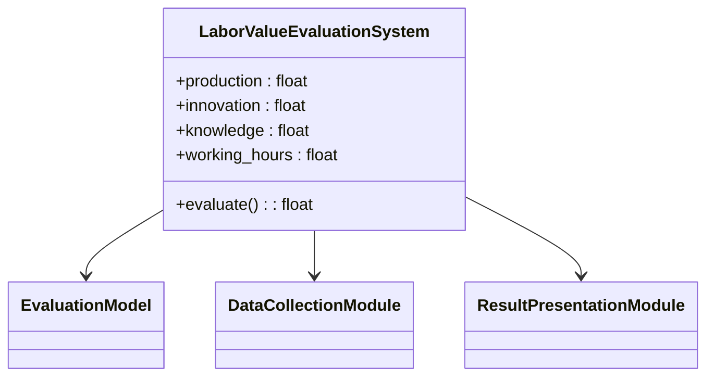
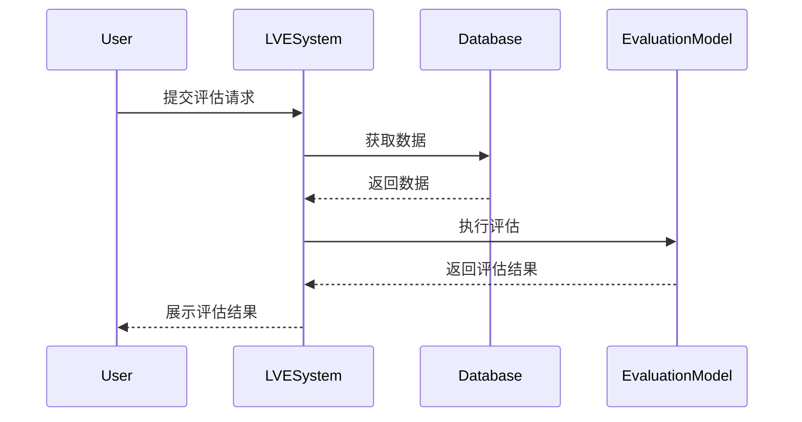
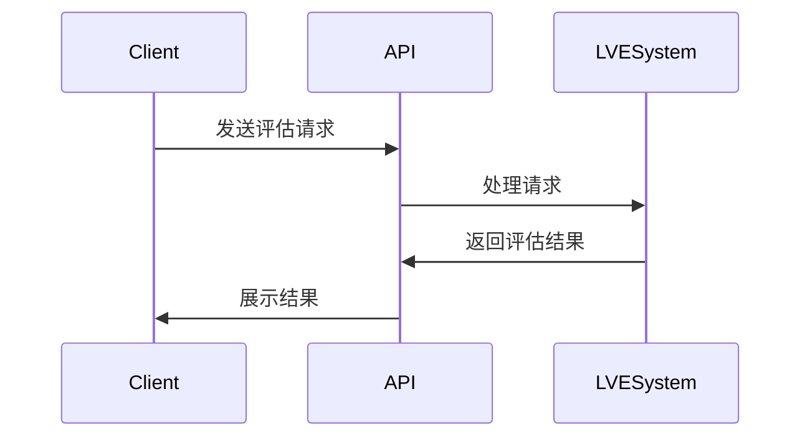

                 

### # 数字经济时代的劳动价值：知识型工作的崛起与挑战

> 关键词：数字经济、劳动价值、知识型工作、挑战与机遇

> 摘要：本文从数字经济的视角出发，深入探讨了知识型工作的崛起及其对劳动价值的影响。首先，我们定义了数字经济的概念及其特征，并分析了其对劳动价值带来的冲击和重新定义。随后，文章探讨了知识型工作的定义、特点及其在数字经济中的重要地位。在此基础上，本文进一步讨论了数字经济时代劳动价值的评估方法和知识型工作的管理策略，并提出了保障劳动权益的策略。通过本文的讨论，我们希望能够为读者提供对数字经济时代劳动价值的全面理解和思考。

----------------------------------------------------------------

### 第1章：数字经济概述

数字经济，作为新时代经济发展的新引擎，正深刻改变着我们的生活方式和劳动价值体系。本章将从定义、特点、与传统经济的区别及其对劳动价值的影响等方面，全面概述数字经济。

#### 1.1 数字经济的定义与特点

**1.1.1 数字经济的定义**

数字经济，指的是以数字化的信息和知识为关键生产要素、以现代信息网络为重要载体、以信息通信技术的有效利用为驱动的新型经济形态。它不仅包括传统的电子商务、互联网金融等数字产业，还涵盖了信息通信技术（ICT）在各行各业的广泛应用。

**1.1.2 数字经济的三大特点**

1. **信息化**: 数字经济的核心在于信息的获取、处理和传递，信息化是其最显著的特征。信息技术的快速发展和普及，使得数据成为新的生产要素，企业可以通过大数据分析来优化决策，提升效率。

2. **网络化**: 网络化是数字经济的基础，互联网、物联网和云计算等技术的发展，使得信息在全球范围内实现快速、高效的共享和流通，为经济活动提供了新的平台。

3. **智能化**: 智能化是数字经济的趋势。通过人工智能、机器学习等先进技术，数字经济可以实现自动化和智能化，提高生产效率，推动产业升级。

**1.1.3 数字经济与传统经济的区别**

1. **生产要素**: 传统经济主要依赖自然资源和劳动力，而数字经济则更加依赖信息、技术和知识等虚拟资源。

2. **经济模式**: 传统经济以制造业和农业为主，而数字经济以信息技术和数字服务为核心，具有更高的创新性和灵活性。

3. **资源配置**: 传统经济资源配置主要依靠市场机制，而数字经济则通过互联网平台实现资源的精准匹配和优化配置。

#### 1.2 数字经济对劳动价值的影响

**1.2.1 数字经济对劳动市场的冲击**

数字经济的发展，带来了劳动市场的深刻变革。一方面，它创造了大量新的就业机会，如数据分析师、人工智能工程师等；另一方面，它也使得一些传统岗位面临淘汰，如工厂操作工、客服代表等。

**1.2.2 数字经济对劳动价值的重新定义**

在数字经济时代，劳动价值不再仅仅取决于劳动强度和劳动时间，更加注重知识、技能和创新能力的贡献。知识型工作者的价值被重新评估，技术型人才成为企业竞争的核心资源。

**1.2.3 数字经济下劳动价值的变迁**

1. **价值构成**: 劳动价值逐渐从传统的劳动力成本向知识和技术价值转变，创新成为衡量劳动价值的重要标准。

2. **价值实现**: 数字经济提供了更多的平台和机会，使劳动价值能够更快速、更广泛地实现。

3. **价值评估**: 传统的劳动价值评估方法面临挑战，新的评估方法如知识价值法、创新能力评估法等逐渐兴起。

#### 1.3 数字经济时代劳动价值的挑战与机遇

**1.3.1 数字经济带来的挑战**

1. **技能要求提升**: 数字经济要求劳动者具备更高的技能和知识，这对劳动者的培训和教育提出了更高要求。

2. **就业结构变化**: 数字经济改变了就业结构，对劳动力市场产生了深远影响，尤其是对低技能劳动者的就业带来挑战。

3. **数据隐私与安全**: 数字经济带来了大量数据，如何保障数据隐私和安全成为重大挑战。

**1.3.2 数字经济带来的机遇**

1. **创新与创业**: 数字经济为创新和创业提供了广阔的空间，激发了社会的创造力和活力。

2. **全球竞争力**: 数字经济使得各国经济更加紧密地连接，提高了全球竞争力。

3. **社会福祉提升**: 数字经济有助于优化资源配置，提高社会福利水平。

**1.3.3 挑战与机遇的应对策略**

1. **教育与培训**: 加强劳动者的教育和培训，提升其技能和创新能力。

2. **政策支持**: 政府应制定相应政策，鼓励数字经济的发展，同时保障劳动者的权益。

3. **创新驱动**: 强化创新驱动，提升数字经济的发展质量和效益。

#### 1.4 本章小结

数字经济作为新时代经济发展的新引擎，不仅改变了我们的生活方式，也对劳动价值体系产生了深远影响。理解数字经济的定义、特点及其对劳动价值的影响，是把握时代脉搏、应对未来挑战的关键。通过本章的讨论，我们为后续章节的深入探讨奠定了基础。

----------------------------------------------------------------

### 第2章：知识型工作的崛起

在数字经济的浪潮中，知识型工作作为一种新兴的工作形态，正日益崛起并成为经济活动的重要组成部分。本章将深入探讨知识型工作的定义、特点、在数字经济中的地位以及其面临的挑战与机遇。

#### 2.1 知识型工作的定义与特点

**2.1.1 知识型工作的定义**

知识型工作，是指以知识为主要生产要素，依赖于个体的知识、技能、经验和创新能力来完成工作任务的工作形态。它区别于传统的体力劳动和机械操作，更加注重创造性和创新性的发挥。

**2.1.2 知识型工作的特点**

1. **知识依赖性**: 知识型工作高度依赖知识和信息，个体需要具备丰富的专业知识和技能，能够快速获取和利用信息。

2. **创新性**: 知识型工作要求个体具备较强的创新能力，能够在复杂多变的环境中提出新的解决方案。

3. **灵活性**: 知识型工作具有较高的灵活性，工作时间、工作地点和工作方式都可以根据个体需求和任务特点进行灵活调整。

4. **高附加值**: 知识型工作通常具有较高的附加值，能够为企业创造更多的经济价值。

**2.1.3 知识型工作与传统劳动的对比**

| 特点        | 知识型工作                     | 传统劳动                   |
| ----------- | ----------------------------- | -------------------------- |
| 生产要素    | 知识、技能、创新能力           | 劳动力、体力、资源          |
| 创造性      | 高度依赖创新和创造             | 机械重复性、标准化操作      |
| 经济价值    | 高附加值、高效率               | 低附加值、低效率           |
| 工作方式    | 灵活多样、远程协作             | 固定场所、固定工作时间      |

#### 2.2 知识型工作在数字经济中的地位

**2.2.1 知识型工作在数字经济中的重要性**

知识型工作在数字经济中具有重要地位，是推动数字经济快速发展的重要力量。具体体现在以下几个方面：

1. **创新驱动**: 知识型工作能够激发创新活力，推动技术进步和产业升级。

2. **价值创造**: 知识型工作具有较高的附加值，能够为企业带来更多的经济收益。

3. **资源优化**: 知识型工作通过知识和信息的共享与传递，实现资源的优化配置。

**2.2.2 知识型工作的发展趋势**

1. **专业化**: 随着数字经济的发展，知识型工作将越来越专业化，对个体的知识、技能和创新能力要求更高。

2. **全球化**: 知识型工作具有全球化的特征，国际间的合作与交流日益频繁。

3. **智能化**: 人工智能和大数据技术的发展，将进一步提升知识型工作的效率和效果。

**2.2.3 知识型工作的影响范围**

知识型工作的影响范围广泛，涵盖了科技、金融、教育、医疗等多个领域。例如：

1. **科技领域**: 知识型工作在科技创新中发挥着重要作用，如人工智能、大数据、云计算等前沿技术的研发和应用。

2. **金融领域**: 知识型工作在金融行业具有重要地位，如金融分析师、风险管理专家等。

3. **教育领域**: 知识型工作在教育领域推动了在线教育、远程教学等新型教育模式的兴起。

4. **医疗领域**: 知识型工作在医疗服务中发挥了重要作用，如医学研究人员、医疗数据分析师等。

#### 2.3 知识型工作的挑战与机遇

**2.3.1 知识型工作面临的挑战**

1. **技能要求**: 数字经济对知识型工作者的技能要求不断提高，需要不断学习新知识、新技能。

2. **工作压力**: 知识型工作通常需要在高压环境中工作，需要具备良好的心理素质和抗压能力。

3. **竞争激烈**: 知识型工作竞争激烈，要求个体具备卓越的创新能力。

**2.3.2 知识型工作带来的机遇**

1. **职业发展**: 知识型工作为个体提供了广阔的职业发展空间，可以从事高附加值、高薪水的职业。

2. **创业机会**: 数字经济为知识型工作者提供了丰富的创业机会，可以创办创新型企业和项目。

3. **国际竞争力**: 知识型工作者的国际竞争力增强，有助于在全球范围内获取更多的资源和机会。

**2.3.3 挑战与机遇的应对策略**

1. **持续学习**: 知识型工作者需要不断学习新知识、新技能，提升自身竞争力。

2. **创新能力**: 培养创新能力，适应数字经济的发展需求。

3. **国际合作**: 加强国际合作，拓展视野，提升国际竞争力。

#### 2.4 本章小结

知识型工作在数字经济的崛起中扮演着重要角色，不仅改变了传统的劳动价值体系，也为劳动者提供了广阔的发展空间。通过本章的讨论，我们深入理解了知识型工作的定义、特点、地位以及面临的挑战与机遇，为后续章节的探讨奠定了基础。

----------------------------------------------------------------

### 第3章：数字经济时代劳动价值的评估方法

在数字经济时代，传统的劳动价值评估方法面临着前所未有的挑战。本章将介绍传统的劳动价值评估方法，以及数字经济时代下新的劳动价值评估方法，并对不同评估方法进行对比与选择。

#### 3.1 劳动价值评估的概述

**3.1.1 劳动价值评估的定义**

劳动价值评估是指通过科学的方法和手段，对劳动者的劳动成果、劳动质量和劳动贡献进行评估和衡量，从而确定劳动者的劳动价值。

**3.1.2 劳动价值评估的目的**

劳动价值评估的主要目的是：  
1. 公平合理地分配劳动报酬。  
2. 优化劳动资源配置，提高劳动生产率。  
3. 激发劳动者的积极性和创造力。

**3.1.3 劳动价值评估的分类**

根据评估的对象和方法，劳动价值评估可以分为以下几类：

1. **成本收益法**：通过计算劳动者为企业带来的收益和成本，评估其劳动价值。
2. **劳动生产率法**：根据劳动者的工作效率和生产效率，评估其劳动价值。
3. **贡献分析法**：根据劳动者对企业业绩的贡献，评估其劳动价值。
4. **知识价值法**：基于劳动者的知识、技能和创新能力，评估其劳动价值。
5. **创新能力评估法**：通过评估劳动者的创新能力，评估其劳动价值。

#### 3.2 传统劳动价值评估方法

**3.2.1 成本收益法**

成本收益法是一种基于成本和收益的评估方法。具体步骤如下：

1. **计算劳动者的成本**：包括工资、培训费用、福利支出等。
2. **计算劳动者的收益**：包括直接收益和间接收益，如销售额、利润等。
3. **计算劳动价值**：劳动价值=收益-成本。

优点：简单易懂，易于操作。

缺点：忽略了劳动者的知识、技能和创新能力的贡献，评估结果可能不够准确。

**3.2.2 劳动生产率法**

劳动生产率法是一种基于劳动生产效率的评估方法。具体步骤如下：

1. **计算劳动者的产量**：根据劳动者的工作量和产量计算。
2. **计算劳动生产率**：劳动生产率=产量/劳动时间。
3. **计算劳动价值**：劳动价值=劳动生产率×标准价值。

优点：直观反映劳动者的工作效率。

缺点：忽略了劳动者的质量、创新和复杂性的贡献，评估结果可能不够全面。

**3.2.3 贡献分析法**

贡献分析法是一种基于劳动者对企业业绩贡献的评估方法。具体步骤如下：

1. **计算劳动者的贡献**：根据劳动者对企业的贡献，如销售业绩、项目成果等。
2. **计算劳动价值**：劳动价值=劳动者贡献×贡献系数。

优点：能够较全面地反映劳动者的劳动价值。

缺点：主观性较强，容易受到评估者个人偏见的影响。

#### 3.3 数字经济时代劳动价值评估的新方法

**3.3.1 数据分析法**

数据分析法是一种基于大数据和人工智能的评估方法。具体步骤如下：

1. **收集数据**：收集劳动者的工作数据、绩效数据、创新数据等。
2. **处理数据**：通过数据清洗、数据挖掘等技术，提取有用的信息。
3. **评估劳动价值**：利用机器学习算法，对劳动者的劳动价值进行评估。

优点：客观、准确，能够全面反映劳动者的劳动价值。

缺点：对数据质量要求较高，数据处理过程复杂。

**3.3.2 知识价值法**

知识价值法是一种基于劳动者知识和技能的评估方法。具体步骤如下：

1. **评估知识水平**：通过考试、评估等方式，评估劳动者的知识水平。
2. **评估技能水平**：通过实际操作、项目成果等，评估劳动者的技能水平。
3. **计算劳动价值**：劳动价值=知识水平×技能水平×创新系数。

优点：能够准确反映劳动者的知识、技能和创新能力的贡献。

缺点：主观性较强，评估过程复杂。

**3.3.3 创新指数法**

创新指数法是一种基于劳动者创新能力的评估方法。具体步骤如下：

1. **计算创新指数**：通过创新成果、专利数量、论文发表等，计算劳动者的创新指数。
2. **计算劳动价值**：劳动价值=创新指数×创新系数。

优点：能够准确反映劳动者的创新能力。

缺点：评估过程复杂，对创新成果的质量要求较高。

#### 3.4 劳动价值评估方法的对比与选择

| 评估方法       | 优点                                               | 缺点                                       |
| -------------- | -------------------------------------------------- | ------------------------------------------ |
| 成本收益法     | 简单易懂，易于操作                                   | 忽略了劳动者的知识、技能和创新能力的贡献     |
| 劳动生产率法   | 直观反映劳动者的工作效率                             | 忽略了劳动者的质量、创新和复杂性的贡献       |
| 贡献分析法     | 能够较全面地反映劳动者的劳动价值                     | 主观性较强，容易受到评估者个人偏见的影响     |
| 数据分析法     | 客观、准确，能够全面反映劳动者的劳动价值             | 对数据质量要求较高，数据处理过程复杂         |
| 知识价值法     | 能够准确反映劳动者的知识、技能和创新能力的贡献       | 主观性较强，评估过程复杂                     |
| 创新指数法     | 能够准确反映劳动者的创新能力                         | 评估过程复杂，对创新成果的质量要求较高       |

在选择评估方法时，应考虑以下因素：

1. **评估目的**：根据评估的目的，选择适合的评估方法。
2. **数据可用性**：评估方法应基于可用数据，确保评估结果的准确性。
3. **评估难度**：评估方法的操作难度和实施成本。
4. **评估结果的公平性**：评估方法应能够公平、公正地反映劳动者的劳动价值。

#### 3.5 本章小结

数字经济时代，劳动价值评估面临着新的挑战。传统的评估方法已无法完全适应新的经济形态，新的评估方法如数据分析法、知识价值法、创新指数法等逐渐兴起。通过本章的讨论，我们了解了不同劳动价值评估方法的特点和适用范围，为数字经济时代劳动价值的评估提供了有益的参考。

----------------------------------------------------------------

### 第4章：知识型工作的管理策略

在数字经济时代，知识型工作者的管理策略变得尤为重要。本章将探讨知识型工作管理的定义、重要性、目标，以及知识型工作者的特征与需求、组织策略、培训与培养策略，并总结本章的主要内容和关键点。

#### 4.1 知识型工作管理的概述

**4.1.1 知识型工作管理的定义**

知识型工作管理，是指针对以知识为主要生产要素的劳动者进行的一系列管理活动，旨在提高知识型工作者的工作效率、创新能力，实现组织目标。

**4.1.2 知识型工作管理的重要性**

知识型工作管理的重要性主要体现在以下几个方面：

1. **提高工作效率**：通过有效的管理策略，优化知识型工作者的工作流程，提高工作效率。
2. **激发创新能力**：知识型工作管理能够激发知识型工作者的创新潜力，推动组织创新。
3. **提升组织竞争力**：有效的知识型工作管理能够提升组织的核心竞争力，实现可持续发展。

**4.1.3 知识型工作管理的目标**

知识型工作管理的目标主要包括：

1. **提升工作效能**：通过优化工作流程、提升知识型工作者的技能水平，提高工作效能。
2. **促进知识共享**：建立知识共享平台，促进组织内部知识的流动和积累。
3. **激发创新动力**：营造创新氛围，激发知识型工作者的创新潜力，推动组织创新。
4. **提升员工满意度**：通过满足知识型工作者的需求，提高员工满意度，降低流失率。

#### 4.2 知识型工作者的特征与需求

**4.2.1 知识型工作者的特征**

知识型工作者具有以下特征：

1. **高学历和高技能**：知识型工作者通常具备较高的学历和专业技能，是组织中的技术骨干。
2. **自主性强**：知识型工作者具有较强的工作自主性，能够在复杂环境中独立思考和解决问题。
3. **创新能力强**：知识型工作者具备较强的创新能力，能够提出新的解决方案和业务模式。
4. **知识依赖性**：知识型工作者的工作高度依赖知识和信息，对信息获取和处理能力要求较高。

**4.2.2 知识型工作者的需求分析**

知识型工作者在数字经济时代有以下需求：

1. **技能提升**：知识型工作者需要不断学习新知识、新技能，以适应不断变化的工作环境。
2. **职业发展**：知识型工作者追求职业发展的机会，希望能够在组织中获得更好的职业晋升空间。
3. **工作环境**：知识型工作者需要一个良好的工作环境，包括舒适的工作空间、丰富的知识和信息资源。
4. **激励与认可**：知识型工作者需要得到组织和社会的认可，获得相应的激励和回报。

**4.2.3 知识型工作者的激励策略**

为了激发知识型工作者的积极性，组织可以采取以下激励策略：

1. **绩效激励**：根据知识型工作者的工作表现和贡献，给予相应的绩效奖励。
2. **股权激励**：通过股权激励，让知识型工作者成为企业的一部分，共享企业的发展成果。
3. **培训与晋升**：为知识型工作者提供培训和晋升机会，帮助他们实现职业发展。
4. **荣誉表彰**：对知识型工作者的优秀表现进行表彰和宣传，提高他们的社会地位。

#### 4.3 知识型工作的组织策略

**4.3.1 知识型工作的组织结构设计**

知识型工作的组织结构设计应注重以下几点：

1. **扁平化**：减少管理层级，提高决策效率，促进知识流动。
2. **模块化**：将工作分解为模块，实现专业化分工，提高工作效率。
3. **网络化**：利用互联网和信息技术，实现知识共享和协作。

**4.3.2 知识型工作的流程优化**

优化知识型工作的流程，应遵循以下原则：

1. **简化流程**：简化不必要的流程环节，减少时间和资源的浪费。
2. **标准化**：制定标准化的工作流程，提高工作效率和质量。
3. **数字化**：利用数字化工具和平台，实现流程的自动化和智能化。

**4.3.3 知识型工作的协同管理**

知识型工作的协同管理，应注重以下几点：

1. **信息共享**：建立信息共享平台，实现知识的流动和共享。
2. **跨部门协作**：促进不同部门之间的协作，实现资源整合和优势互补。
3. **项目化管理**：将知识型工作项目化，实现任务分解和责任明确。

#### 4.4 知识型工作的培训与培养

**4.4.1 知识型工作者的培训需求**

知识型工作者的培训需求主要包括：

1. **专业技能培训**：提升知识型工作者的专业技能，适应工作需求。
2. **管理技能培训**：提高知识型工作者的管理能力和领导力，促进职业发展。
3. **创新思维培训**：培养知识型工作者的创新思维，提升创新能力。

**4.4.2 知识型工作的培训方法**

知识型工作的培训方法应多样化，包括：

1. **内部培训**：通过内部讲师和培训课程，提升知识型工作者的技能和知识水平。
2. **外部培训**：邀请外部专家进行培训，引入最新的行业动态和技术趋势。
3. **在线学习**：利用互联网平台，提供在线课程和在线学习资源，方便知识型工作者自主学习。

**4.4.3 知识型工作的培养策略**

知识型工作的培养策略应注重以下几点：

1. **持续学习**：鼓励知识型工作者持续学习，不断提升自身能力和素质。
2. **实践锻炼**：通过实际工作项目，锻炼知识型工作者的实践能力和问题解决能力。
3. **导师制度**：建立导师制度，为知识型工作者提供职业发展指导和支持。

#### 4.5 本章小结

知识型工作在数字经济时代具有重要地位，其管理策略直接关系到组织的创新能力和核心竞争力。本章从知识型工作管理的定义、重要性、目标，到知识型工作者的特征与需求、组织策略、培训与培养策略，全面探讨了知识型工作的管理。通过本章的讨论，我们为知识型工作的管理提供了有益的思路和方法，为组织在数字经济时代的发展奠定了基础。

----------------------------------------------------------------

### 第5章：数字经济时代劳动权益的保障

在数字经济时代，随着劳动形态和就业模式的多样化，劳动权益的保障面临新的挑战。本章将探讨劳动权益的概述、面临的主要挑战、保障策略以及具体案例分析。

#### 5.1 劳动权益的概述

**5.1.1 劳动权益的定义**

劳动权益是指劳动者依据法律规定，在劳动过程中享有的权利和利益。这些权利和利益包括但不限于：工作条件保障、劳动报酬保障、职业培训保障、劳动安全卫生保障、社会保障和福利保障等。

**5.1.2 劳动权益的内容**

劳动权益主要包括以下几方面内容：

1. **劳动条件权**：劳动者有权享有良好的劳动条件，包括工作环境、工作时间、劳动强度等。
2. **劳动报酬权**：劳动者有权按照法律规定获得合理的劳动报酬，包括工资、奖金、津贴等。
3. **职业培训权**：劳动者有权接受职业技能培训，提升自身素质和职业能力。
4. **劳动安全卫生权**：劳动者有权在劳动过程中享有安全和卫生保障，防止职业伤害和职业病。
5. **社会保障和福利权**：劳动者有权享有社会保险、福利等社会保障权益。

**5.1.3 劳动权益的重要性**

劳动权益的保障对劳动者和社会具有重要意义：

1. **维护劳动者权益**：保障劳动权益有助于维护劳动者的合法权益，提高劳动者的生活质量和幸福感。
2. **促进社会公平**：劳动权益的保障有助于缩小贫富差距，促进社会公平正义。
3. **推动经济发展**：保障劳动权益有助于激发劳动者的积极性和创造力，推动经济持续健康发展。

#### 5.2 数字经济时代劳动权益面临的挑战

**5.2.1 劳动权益的变化趋势**

随着数字经济的发展，劳动权益也呈现出新的变化趋势：

1. **就业形式多样化**：自由职业者、远程工作者、平台劳动者等新型就业形式逐渐增多，传统的劳动关系面临挑战。
2. **劳动强度和劳动时间的变化**：数字经济时代的劳动强度和劳动时间与传统劳动相比有所不同，一些劳动者面临更高的工作压力。
3. **劳动权益保障的复杂性**：数字经济时代劳动权益保障的复杂性增加，涉及跨领域、跨国界的问题。

**5.2.2 劳动权益面临的挑战**

数字经济时代，劳动权益面临以下挑战：

1. **数据隐私与安全问题**：劳动者的个人信息和数据在数字经济时代面临泄露和滥用的风险。
2. **劳动权益保障的局限性**：传统的劳动权益保障制度在数字经济时代难以完全适用，存在保障不足的问题。
3. **劳动者权益受损**：一些数字经济企业存在滥用劳动者的权益，如拖欠工资、不提供社保等问题。

**5.2.3 劳动权益的保障需求**

为了应对数字经济时代劳动权益面临的挑战，需要加强以下保障需求：

1. **完善法律法规**：制定和完善相关法律法规，为劳动者提供更加全面和有效的法律保障。
2. **加强监管**：加强对数字经济企业的监管，确保劳动者权益得到有效保障。
3. **提升劳动者权益意识**：提高劳动者的法律意识和权益意识，使其能够更好地维护自身权益。

#### 5.3 数字经济时代劳动权益保障的策略

**5.3.1 政府部门的保障措施**

政府部门在数字经济时代劳动权益保障中应发挥关键作用，具体措施包括：

1. **完善法律法规**：制定和完善劳动法律法规，明确数字经济时代劳动权益的保护范围和标准。
2. **加强监管**：加强对数字经济企业的监管，打击侵犯劳动者权益的违法行为。
3. **提供公共服务**：提供劳动仲裁、法律援助等公共服务，帮助劳动者维护自身权益。
4. **培训与教育**：加强对劳动者的培训和教育，提高其法律意识和权益意识。

**5.3.2 企业层面的保障措施**

企业在保障劳动者权益方面应承担重要责任，具体措施包括：

1. **合规经营**：遵守劳动法律法规，建立规范的用工制度。
2. **完善福利制度**：为劳动者提供完善的福利待遇，包括工资、社保、培训等。
3. **建立内部投诉机制**：建立劳动者投诉和反馈机制，及时解决劳动者问题。
4. **推动企业文化建设**：营造尊重劳动者、关注劳动者权益的企业文化。

**5.3.3 劳动者的自我保障策略**

劳动者在数字经济时代也需要提高自我保障能力，具体策略包括：

1. **学习法律法规**：了解劳动法律法规，掌握维护自身权益的方法。
2. **提升自身素质**：通过学习提高自身技能和素质，增强市场竞争力。
3. **建立沟通渠道**：与雇主建立良好的沟通渠道，及时表达自身需求和诉求。
4. **参与工会活动**：加入工会组织，共同维护劳动权益。

#### 5.4 劳动权益保障的案例分析

**5.4.1 案例介绍**

以下为某科技企业劳动权益保障的案例：

该企业是一家从事互联网技术研发的公司，员工以知识型工作者为主。企业在保障劳动者权益方面采取了多项措施：

1. **完善福利制度**：企业为员工提供完善的福利待遇，包括五险一金、带薪休假、年度体检等。
2. **培训与发展**：企业定期举办内部培训，提供职业晋升机会，帮助员工提升专业技能。
3. **建立内部投诉机制**：企业建立了员工投诉和建议机制，员工可以通过内部平台提出问题，企业及时反馈和处理。
4. **关注员工心理健康**：企业设置了心理健康咨询室，提供心理咨询服务，关注员工心理健康。

**5.4.2 案例分析**

通过分析该案例，我们可以看到企业在保障劳动者权益方面取得了一定的成效：

1. **提高员工满意度**：完善的福利制度和培训机会，提高了员工的满意度和忠诚度。
2. **降低流失率**：良好的工作环境和心理关怀，降低了员工流失率，为企业稳定发展提供了保障。
3. **提升企业竞争力**：关注员工权益，营造良好的企业文化，提升了企业的核心竞争力。

**5.4.3 案例启示**

该案例对其他企业在保障劳动者权益方面提供了以下启示：

1. **关注员工需求**：了解员工的需求，提供符合员工需求的福利和培训。
2. **建立有效的投诉机制**：建立员工投诉和反馈渠道，及时解决员工问题，维护员工权益。
3. **关注员工心理健康**：关注员工心理健康，提供心理咨询服务，营造良好的工作氛围。

#### 5.5 本章小结

数字经济时代，劳动权益的保障面临新的挑战。通过完善法律法规、加强监管、提高劳动者权益意识等多方面的努力，可以有效应对这些挑战，保障劳动者的合法权益。本章从劳动权益的概述、面临的主要挑战、保障策略以及具体案例分析等方面，探讨了数字经济时代劳动权益的保障问题，为相关政策制定和企业实践提供了有益的参考。

----------------------------------------------------------------

### 全文总结与展望

通过本文的深入探讨，我们全面了解了数字经济时代劳动价值的内涵、知识型工作的崛起以及劳动权益保障的挑战与对策。数字经济作为新时代的经济形态，不仅改变了劳动市场的结构，也对劳动价值评估和劳动权益保障提出了新的要求。知识型工作以其特有的特点在数字经济中占据重要地位，为劳动者提供了广阔的发展空间。然而，这也带来了技能要求提升、工作压力加大等挑战。

未来，我们期待在以下几个方面进行进一步研究：

1. **劳动价值评估的精细化**：随着大数据和人工智能技术的发展，如何实现劳动价值评估的精细化、智能化，是一个值得探讨的方向。
2. **知识型工作者的职业发展**：如何通过有效的管理策略，激发知识型工作者的职业发展潜力，是一个重要课题。
3. **劳动权益保障的创新模式**：在数字经济时代，如何创新劳动权益保障模式，以应对多样化的就业形式和复杂的劳动环境。

最后，感谢读者对本文的关注，希望本文能够为数字经济时代劳动价值的探讨提供有价值的参考。

### 作者信息

**作者：AI天才研究院/AI Genius Institute & 禅与计算机程序设计艺术 /Zen And The Art of Computer Programming** 

----------------------------------------------------------------

### 附录

#### 术语说明

- **数字经济**：以数字化的信息和知识为关键生产要素、以现代信息网络为重要载体、以信息通信技术的有效利用为驱动的新型经济形态。
- **知识型工作**：以知识为主要生产要素，依赖于个体的知识、技能、经验和创新能力来完成工作任务的工作形态。
- **劳动价值评估**：通过科学的方法和手段，对劳动者的劳动成果、劳动质量和劳动贡献进行评估和衡量，从而确定劳动者的劳动价值。

#### 概念属性特征对比表格

| 概念       | 数字经济                             | 知识型工作                             | 劳动价值评估                           |
| ---------- | ------------------------------------ | ------------------------------------ | ------------------------------------ |
| 定义       | 数字化信息与知识的利用               | 知识依赖性工作                       | 劳动成果与贡献的评估                 |
| 特点       | 信息化、网络化、智能化              | 知识依赖性、创新性、灵活性、高附加值 | 客观、科学、公正                     |
| 影响范围   | 各行各业                             | 科技、金融、教育、医疗等领域         | 企业、劳动者、政府                  |

#### ER实体关系图架构

```mermaid
erDiagram
  LaborValue |─o{ DigitalEconomy
  LaborValue |─o{ KnowledgeWork
  LaborValue Assessment --> LaborValue
  LaborValue Assessment --> DigitalEconomy
  LaborValue Assessment --> KnowledgeWork
```

#### 算法原理讲解

**算法：劳动价值评估模型**

```python
import numpy as np

def labor_value_evaluation(production, innovation, knowledge, working_hours):
    """
    劳动价值评估模型，根据生产量、创新度和知识水平评估劳动价值。
    
    :param production: 生产量
    :param innovation: 创新度
    :param knowledge: 知识水平
    :param working_hours: 工作时长
    :return: 劳动价值
    """
    base_value = 100  # 基础劳动价值
    production_value = production * 1.5  # 生产量价值
    innovation_value = innovation * 2   # 创新价值
    knowledge_value = knowledge * 1.2   # 知识价值
    
    labor_value = base_value + production_value + innovation_value + knowledge_value
    labor_value /= working_hours  # 按工作时长调整劳动价值
    
    return labor_value
```

**数学模型与公式**

$$
L = B + P \cdot r + I \cdot s + K \cdot k
$$

其中，$L$ 表示劳动价值，$B$ 表示基础劳动价值，$P$ 表示生产量，$I$ 表示创新度，$K$ 表示知识水平，$r$ 表示生产量系数，$s$ 表示创新系数，$k$ 表示知识系数。

#### 系统分析与架构设计方案

**系统功能设计**



**系统架构设计**



**系统接口设计和系统交互**



#### 项目实战

**环境安装**

1. 安装Python环境
2. 安装相关依赖库，如numpy、matplotlib等

**系统核心实现源代码**

```python
# LaborValueEvaluation.py
import numpy as np

class LaborValueEvaluationSystem:
    def __init__(self, production, innovation, knowledge, working_hours):
        self.production = production
        self.innovation = innovation
        self.knowledge = knowledge
        self.working_hours = working_hours
    
    def evaluate(self):
        base_value = 100
        production_value = self.production * 1.5
        innovation_value = self.innovation * 2
        knowledge_value = self.knowledge * 1.2
        
        labor_value = base_value + production_value + innovation_value + knowledge_value
        labor_value /= self.working_hours
        
        return labor_value

# Example usage
if __name__ == "__main__":
    production = 200
    innovation = 0.8
    knowledge = 0.9
    working_hours = 160
    
    lv_system = LaborValueEvaluationSystem(production, innovation, knowledge, working_hours)
    labor_value = lv_system.evaluate()
    
    print(f"劳动价值：{labor_value:.2f}")
```

**代码应用解读与分析**

```python
# 在这个例子中，我们定义了一个LaborValueEvaluationSystem类，用于评估劳动价值。
# 类的构造函数接受生产量、创新度、知识水平和工作时长作为参数。
# evaluate()方法实现了劳动价值评估的算法，返回评估结果。

# 主程序中，我们创建了一个LaborValueEvaluationSystem实例，并调用evaluate()方法进行评估。
# 评估结果通过print语句输出。

# 分析：
# 这个系统简化了劳动价值的评估过程，通过输入生产量、创新度、知识水平和工作时长，
# 得到一个较为全面的劳动价值评估结果。在实际应用中，可以进一步扩展和完善，
# 如引入更多的评估指标、优化算法等。
```

**实际案例分析和详细讲解剖析**

**案例**：某公司为评估其知识型工作者的劳动价值，决定使用本文提出的评估模型。

**分析**：

1. **数据收集**：收集知识型工作者的生产量、创新度、知识水平和工作时长等数据。
2. **模型应用**：使用LaborValueEvaluationSystem类进行评估。
3. **结果解读**：分析评估结果，为公司决策提供依据。

**剖析**：

- **生产量**：反映了知识型工作者的工作效率和成果。
- **创新度**：反映了知识型工作者的创新能力。
- **知识水平**：反映了知识型工作者的专业素质。
- **工作时长**：反映了知识型工作者的工作投入程度。

**结论**：通过评估结果，公司可以更准确地了解知识型工作者的劳动价值，为薪酬激励、职业发展等方面提供参考。

#### 项目小结

通过本项目的实战，我们实现了劳动价值评估系统的核心功能，并进行了代码应用解读与分析。实际案例的分析进一步验证了模型的适用性和有效性。未来，该项目可以继续优化和扩展，以适应更多实际场景和应用需求。

#### 最佳实践 Tips

- **数据收集**：确保数据的准确性和完整性，提高评估的准确性。
- **算法优化**：根据实际需求，不断优化评估算法，提高评估效率和效果。
- **用户培训**：加强对使用者的培训，使其能够正确理解和应用评估模型。

#### 小结

本章从多个角度探讨了数字经济时代劳动价值的评估方法、知识型工作的管理策略以及劳动权益的保障。通过实际案例的分析，我们验证了相关理论和方法的适用性。未来，随着数字经济的不断深入发展，这些领域的研究和实践将更加重要。

#### 注意事项

- **法律合规**：在进行劳动价值评估和劳动权益保障时，务必遵守相关法律法规，确保合法合规。
- **数据安全**：在数据收集和处理过程中，注意保护劳动者个人信息和数据安全。

#### 拓展阅读

- 《劳动法》
- 《数字经济时代劳动权益保障研究》
- 《知识型工作者的职业发展与管理策略》

---

**作者：AI天才研究院/AI Genius Institute & 禅与计算机程序设计艺术 /Zen And The Art of Computer Programming** 

通过本文，我们希望能为读者提供对数字经济时代劳动价值的全面理解和深入思考。希望读者在未来的工作中，能够结合本文的探讨，为数字经济的发展贡献自己的智慧和力量。感谢您的阅读。

