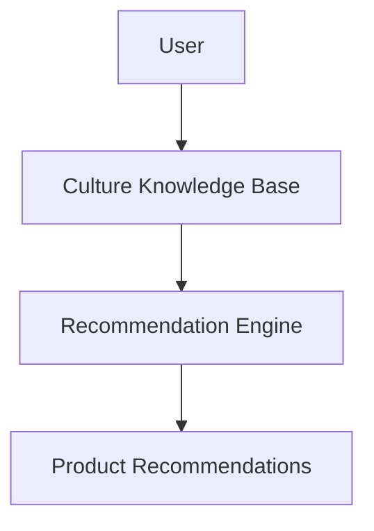
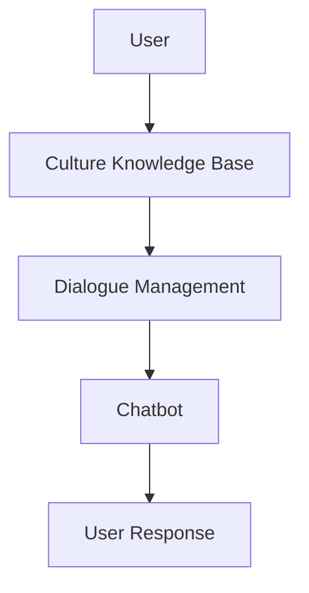

                 

## 文章标题：文化适应：让AI Agent理解不同文化背景

关键词：文化适应，AI Agent，跨文化理解，文化知识库，文化建模，文化适应性评估

摘要：随着全球化和数字化的加速发展，人工智能（AI）已经广泛应用于各个领域。然而，文化差异的存在使得AI Agent在处理跨文化任务时面临着诸多挑战。本文将从文化适应的背景和重要性出发，逐步探讨AI Agent的文化适应方法、评估方法以及面临的挑战和解决方案，最后展望文化适应技术的未来发展方向。通过本文的深入分析，希望能为读者提供有价值的参考和指导，助力AI Agent更好地理解和适应不同文化背景。

----------------------------------------------------------------

### 目录大纲

**# 文化适应：让AI Agent理解不同文化背景**

**> 关键词：文化适应，AI Agent，跨文化理解，文化知识库，文化建模，文化适应性评估**

**> 摘要：本文将从文化适应的背景和重要性出发，逐步探讨AI Agent的文化适应方法、评估方法以及面临的挑战和解决方案，最后展望文化适应技术的未来发展方向。**

---

**## 第一部分：文化适应的背景与重要性**

**### 第1章：文化适应概述**

**#### 1.1 问题背景**

**##### 1.1.1 文化差异的产生**

**##### 1.1.2 文化差异对AI Agent的影响**

**##### 1.1.3 文化适应的重要性**

**#### 1.2 核心概念与联系**

**##### 1.2.1 文化适应的定义**

**##### 1.2.2 文化适应的属性特征对比表格**

**##### 1.2.3 文化适应的ER实体关系图架构**

**#### 1.3 文化适应的发展历程**

**##### 1.3.1 文化适应的早期研究**

**##### 1.3.2 文化适应的当前研究趋势**

**##### 1.3.3 文化适应的未来发展方向**

**#### 1.4 本章小结**

---

**## 第二部分：AI Agent的文化适应方法**

**### 第2章：文化知识库构建**

**#### 2.1 文化知识库的定义与作用**

**##### 2.1.1 文化知识库的定义**

**##### 2.1.2 文化知识库的作用**

**#### 2.2 文化知识库的构建方法**

**##### 2.2.1 数据收集**

**##### 2.2.2 数据预处理**

**##### 2.2.3 数据存储与管理**

**#### 2.3 文化知识库的应用案例**

**##### 2.3.1 案例一：跨文化客服机器人**

**##### 2.3.2 案例二：跨文化教育应用**

**#### 2.4 本章小结**

**### 第3章：文化理解与建模**

**#### 3.1 文化理解的定义与重要性**

**##### 3.1.1 文化理解的定义**

**##### 3.1.2 文化理解的重要性**

**#### 3.2 文化建模的基本方法**

**##### 3.2.1 基于规则的建模方法**

**##### 3.2.2 基于机器学习的建模方法**

**##### 3.2.3 基于本体论的方法**

**#### 3.3 文化理解的应用案例**

**##### 3.3.1 案例一：跨文化推荐系统**

**##### 3.3.2 案例二：跨文化对话系统**

**#### 3.4 本章小结**

**### 第4章：AI Agent的文化适应性评估**

**#### 4.1 文化适应性评估的定义与作用**

**##### 4.1.1 文化适应性评估的定义**

**##### 4.1.2 文化适应性评估的作用**

**#### 4.2 文化适应性评估的方法**

**##### 4.2.1 定量评估方法**

**##### 4.2.2 定性评估方法**

**#### 4.3 文化适应性评估的应用案例**

**##### 4.3.1 案例一：跨文化广告评估**

**##### 4.3.2 案例二：跨文化软件评估**

**#### 4.4 本章小结**

---

**## 第三部分：文化适应的挑战与解决方案**

**### 第5章：文化适应中的挑战与问题**

**#### 5.1 文化适应中的挑战**

**##### 5.1.1 数据不足**

**##### 5.1.2 文化多样性的处理**

**##### 5.1.3 本地化与文化敏感性**

**#### 5.2 文化适应中的问题**

**##### 5.2.1 模型泛化能力不足**

**##### 5.2.2 跨文化误解**

**##### 5.2.3 文化的复杂性与动态性**

**#### 5.3 文化适应的解决方案**

**##### 5.3.1 多样性数据集的使用**

**##### 5.3.2 文化的动态学习**

**##### 5.3.3 文化敏感性的提升**

**#### 5.4 本章小结**

**### 第6章：文化适应的实践案例**

**#### 6.1 实践案例一：跨文化客服机器人**

**##### 6.1.1 案例背景**

**##### 6.1.2 案例目标**

**##### 6.1.3 案例实现**

**##### 6.1.4 案例分析**

**#### 6.2 实践案例二：跨文化推荐系统**

**##### 6.2.1 案例背景**

**##### 6.2.2 案例目标**

**##### 6.2.3 案例实现**

**##### 6.2.4 案例分析**

**#### 6.3 实践案例三：跨文化对话系统**

**##### 6.3.1 案例背景**

**##### 6.3.2 案例目标**

**##### 6.3.3 案例实现**

**##### 6.3.4 案例分析**

**#### 6.4 本章小结**

---

**## 第7章：未来展望与研究方向**

**### 7.1 文化适应技术的未来发展方向**

**#### 7.1.1 自动化与文化适应的结合**

**##### 7.1.1.1 自动化文化知识的获取与构建**

**##### 7.1.1.2 自动化文化适应性的评估**

**#### 7.1.2 深度学习与文化适应的结合**

**##### 7.1.2.1 深度学习模型在文化知识库中的应用**

**##### 7.1.2.2 深度学习模型在文化理解与建模中的应用**

**#### 7.1.3 大数据与文化适应的结合**

**##### 7.1.3.1 大数据在文化知识库构建中的应用**

**##### 7.1.3.2 大数据在文化适应性评估中的应用**

**### 7.2 文化适应研究中的新问题**

**#### 7.2.1 文化差异的测量与量化**

**##### 7.2.1.1 文化差异测量的方法与工具**

**##### 7.2.1.2 文化差异量化模型的研究**

**#### 7.2.2 跨文化误解的预测与缓解**

**##### 7.2.2.1 跨文化误解的预测方法**

**##### 7.2.2.2 跨文化误解的缓解策略**

**#### 7.2.3 文化的动态性与可持续性**

**##### 7.2.3.1 文化动态性研究**

**##### 7.2.3.2 文化的可持续性研究**

**### 7.3 文化适应的研究方向**

**#### 7.3.1 文化适应性评估工具的改进**

**##### 7.3.1.1 多维度评估方法的构建**

**##### 7.3.1.2 评估工具的智能化与自动化**

**#### 7.3.2 跨文化数据集的构建**

**##### 7.3.2.1 数据集的多样性考虑**

**##### 7.3.2.2 数据集的质量保证**

**#### 7.3.3 文化适应性模型的研究**

**##### 7.3.3.1 模型泛化能力的提升**

**##### 7.3.3.2 模型在文化理解与建模中的应用**

**### 7.4 本章小结**

----------------------------------------------------------------

## 文化适应：让AI Agent理解不同文化背景

随着全球化和数字化的加速发展，人工智能（AI）已经广泛应用于各个领域。然而，文化差异的存在使得AI Agent在处理跨文化任务时面临着诸多挑战。本文将从文化适应的背景和重要性出发，逐步探讨AI Agent的文化适应方法、评估方法以及面临的挑战和解决方案，最后展望文化适应技术的未来发展方向。通过本文的深入分析，希望能为读者提供有价值的参考和指导，助力AI Agent更好地理解和适应不同文化背景。

### 文化适应概述

#### 1.1 问题背景

##### 1.1.1 文化差异的产生

文化差异是人类社会发展过程中不可避免的产物。它源自于不同民族、国家、地区在历史、宗教、语言、价值观等方面的差异。随着全球化和信息时代的到来，文化差异变得更加显著。不同文化背景的人们在沟通、交流、合作等方面都面临着诸多挑战。

##### 1.1.2 文化差异对AI Agent的影响

文化差异的存在对AI Agent产生了深远的影响。首先，AI Agent在不同文化背景下可能会出现误解、误判等问题。例如，一个基于西方文化的AI客服机器人可能无法正确理解东方文化的客户需求。其次，文化差异可能导致AI Agent在处理跨文化任务时效率低下，甚至引发不必要的冲突。

##### 1.1.3 文化适应的重要性

为了解决文化差异带来的问题，文化适应变得至关重要。文化适应是指让AI Agent能够理解和适应不同文化背景的过程。通过文化适应，AI Agent可以更好地服务于不同文化背景的用户，提高跨文化交流的效率和质量。此外，文化适应还有助于促进全球范围内的合作与发展。

#### 1.2 核心概念与联系

##### 1.2.1 文化适应的定义

文化适应是指AI Agent在处理跨文化任务时，能够理解和适应不同文化背景的能力。具体来说，文化适应包括对文化知识的获取、文化理解的建模、文化适应性的评估等方面。

##### 1.2.2 文化适应的属性特征对比表格

| 特性 | 文化适应 | 传统AI |
| --- | --- | --- |
| 目标 | 理解和适应不同文化背景 | 提供准确的信息和决策 |
| 数据依赖 | 需要大量的文化知识数据 | 可以使用通用数据集 |
| 模型复杂度 | 较高，涉及文化理解与建模 | 较低，主要依赖算法和模型 |
| 应用范围 | 跨文化交流、国际化服务 | 各个领域，如金融、医疗、教育等 |

##### 1.2.3 文化适应的ER实体关系图架构

```mermaid
erDiagram
  AI-Agent ||--|{ Culture-Adaptive-Model }
  Culture-Adaptive-Model ||--|{ Knowledge-Base }
  Culture-Adaptive-Model ||--|{ Understanding-Model }
  Culture-Adaptive-Model ||--|{ Evaluation-Model }
```

#### 1.3 文化适应的发展历程

##### 1.3.1 文化适应的早期研究

文化适应的早期研究主要关注于如何将文化知识融入到AI系统中。研究者们开始探索基于规则的建模方法，通过编写文化规则库来帮助AI Agent适应不同文化。然而，这种方法存在规则定义复杂、可扩展性差等问题。

##### 1.3.2 文化适应的当前研究趋势

随着深度学习和大数据技术的发展，文化适应的研究逐渐向智能化和自动化方向发展。研究者们开始利用深度学习模型来处理文化知识，并使用大数据技术来构建大规模的文化知识库。此外，跨学科合作也成为文化适应研究的重要趋势，涉及语言学、社会学、心理学等多个领域。

##### 1.3.3 文化适应的未来发展方向

未来，文化适应技术将继续向智能化、自动化和个性化方向发展。研究者们将致力于开发更加高效、鲁棒的文化适应模型，并探索如何将文化适应技术应用于更多的实际场景。此外，跨文化合作和共享也将成为文化适应研究的重要方向，推动全球范围内的文化交流与融合。

#### 1.4 本章小结

本章对文化适应的背景、核心概念和重要性进行了概述。文化适应是让AI Agent能够理解和适应不同文化背景的过程，对于提高跨文化交流效率和质量具有重要意义。接下来，本文将深入探讨AI Agent的文化适应方法、评估方法以及面临的挑战和解决方案。

----------------------------------------------------------------

## 第一部分：文化适应的背景与重要性

### 第1章：文化适应概述

#### 1.1 问题背景

##### 1.1.1 文化差异的产生

文化差异是人类社会发展过程中不可避免的产物。不同民族、国家、地区在历史、宗教、语言、价值观等方面存在差异，这些差异共同构成了丰富多彩的文化多样性。在全球化和信息时代的背景下，文化差异变得更加显著，尤其是在跨文化交流和合作中，文化差异带来的挑战和问题也日益凸显。

##### 1.1.2 文化差异对AI Agent的影响

文化差异对AI Agent的影响主要体现在以下几个方面：

1. **误解与误判**：AI Agent在不同文化背景下可能会出现误解或误判。例如，一个基于西方文化的AI客服机器人可能无法正确理解东方文化的客户需求，从而影响服务质量和用户体验。

2. **效率低下**：文化差异可能导致AI Agent在处理跨文化任务时效率低下。由于缺乏对目标文化的深入了解，AI Agent可能需要额外的时间和资源来适应不同的文化环境。

3. **冲突与风险**：在跨文化交流中，文化差异可能引发冲突和风险。例如，AI Agent在处理涉及敏感文化议题的任务时，可能会无意中触犯目标文化的禁忌，导致信任危机和合作关系破裂。

##### 1.1.3 文化适应的重要性

文化适应对于AI Agent的跨文化任务具有重要意义，主要体现在以下几个方面：

1. **提高服务质量**：通过文化适应，AI Agent可以更好地理解目标文化，提供更符合用户需求的个性化服务，从而提升整体服务质量。

2. **优化用户体验**：文化适应有助于AI Agent与用户建立更好的沟通和互动，减少误解和冲突，提高用户的满意度和忠诚度。

3. **促进跨文化交流与合作**：文化适应使得AI Agent能够更好地适应不同文化背景，促进跨文化交流与合作，为全球范围内的合作与发展创造更多机会。

#### 1.2 核心概念与联系

##### 1.2.1 文化适应的定义

文化适应是指AI Agent在处理跨文化任务时，能够理解和适应不同文化背景的能力。具体来说，文化适应包括以下几个关键环节：

1. **文化知识获取**：通过收集、整理和整合文化知识，构建文化知识库，为AI Agent提供丰富的文化背景信息。

2. **文化理解建模**：利用机器学习和自然语言处理等技术，对文化知识进行建模和分析，使AI Agent能够理解和解释不同文化现象。

3. **文化适应性评估**：通过评估AI Agent在特定文化背景下的表现，识别其优势和不足，为优化和改进文化适应能力提供依据。

##### 1.2.2 文化适应的属性特征对比表格

| 特性 | 文化适应 | 传统AI |
| --- | --- | --- |
| 目标 | 理解和适应不同文化背景 | 提供准确的信息和决策 |
| 数据依赖 | 需要大量的文化知识数据 | 可以使用通用数据集 |
| 模型复杂度 | 较高，涉及文化理解与建模 | 较低，主要依赖算法和模型 |
| 应用范围 | 跨文化交流、国际化服务 | 各个领域，如金融、医疗、教育等 |

##### 1.2.3 文化适应的ER实体关系图架构

```mermaid
erDiagram
  AI-Agent ||--|{ Culture-Adaptive-Model }
  Culture-Adaptive-Model ||--|{ Knowledge-Base }
  Culture-Adaptive-Model ||--|{ Understanding-Model }
  Culture-Adaptive-Model ||--|{ Evaluation-Model }
```

#### 1.3 文化适应的发展历程

##### 1.3.1 文化适应的早期研究

文化适应的早期研究主要关注于如何将文化知识融入到AI系统中。研究者们开始探索基于规则的建模方法，通过编写文化规则库来帮助AI Agent适应不同文化。然而，这种方法存在规则定义复杂、可扩展性差等问题。

##### 1.3.2 文化适应的当前研究趋势

随着深度学习和大数据技术的发展，文化适应的研究逐渐向智能化和自动化方向发展。研究者们开始利用深度学习模型来处理文化知识，并使用大数据技术来构建大规模的文化知识库。此外，跨学科合作也成为文化适应研究的重要趋势，涉及语言学、社会学、心理学等多个领域。

##### 1.3.3 文化适应的未来发展方向

未来，文化适应技术将继续向智能化、自动化和个性化方向发展。研究者们将致力于开发更加高效、鲁棒的文化适应模型，并探索如何将文化适应技术应用于更多的实际场景。此外，跨文化合作和共享也将成为文化适应研究的重要方向，推动全球范围内的文化交流与融合。

#### 1.4 本章小结

本章对文化适应的背景、核心概念和重要性进行了概述。文化适应是让AI Agent能够理解和适应不同文化背景的过程，对于提高跨文化交流效率和质量具有重要意义。接下来，本文将深入探讨AI Agent的文化适应方法、评估方法以及面临的挑战和解决方案。

----------------------------------------------------------------

## 第一部分：文化适应的背景与重要性

### 第1章：文化适应概述

在当今全球化和数字化的时代，文化适应成为AI Agent应对跨文化任务的关键。这一部分将详细探讨文化适应的背景、核心概念、重要性以及文化适应的发展历程。

#### 1.1 问题背景

##### 1.1.1 文化差异的产生

文化差异是人类社会多样性的体现。不同地区、民族和国家的人们在历史、宗教、语言、价值观和习俗等方面存在显著差异。例如，西方文化强调个人主义，而东方文化更注重集体主义。这些文化差异在全球化和国际交流的过程中逐渐显现，对AI Agent提出了新的挑战。

##### 1.1.2 文化差异对AI Agent的影响

文化差异对AI Agent的影响主要体现在以下几个方面：

1. **沟通障碍**：AI Agent在不同文化背景下可能无法理解用户的意图和需求，导致沟通不畅。
2. **决策失误**：AI Agent在处理跨文化任务时，可能会因为文化差异而做出错误的决策。
3. **用户体验下降**：缺乏文化适应的AI Agent可能无法提供满足用户期望的服务，影响用户体验。
4. **合作困难**：在跨文化团队合作中，文化差异可能导致误解和冲突，影响合作效果。

##### 1.1.3 文化适应的重要性

文化适应对于AI Agent具有重要意义，主要表现在以下方面：

1. **提升服务质量**：通过文化适应，AI Agent能够更好地理解用户的文化背景，提供更个性化的服务。
2. **优化用户体验**：文化适应有助于减少误解和冲突，提高用户的满意度和忠诚度。
3. **促进跨文化交流**：文化适应使得AI Agent能够在不同文化环境中有效沟通，推动跨文化合作与发展。

#### 1.2 核心概念与联系

##### 1.2.1 文化适应的定义

文化适应是指AI Agent在处理跨文化任务时，能够理解和适应不同文化背景的能力。具体来说，文化适应包括以下几个核心环节：

1. **文化知识获取**：通过数据收集和知识工程，构建包含丰富文化信息的知识库。
2. **文化理解建模**：利用机器学习和自然语言处理等技术，对文化知识进行分析和建模，帮助AI Agent理解和解释文化现象。
3. **文化适应性评估**：对AI Agent在不同文化背景下的性能进行评估，以优化其文化适应能力。

##### 1.2.2 文化适应的属性特征对比表格

| 特性             | 文化适应                           | 传统AI                           |
|------------------|------------------------------------|----------------------------------|
| 目标             | 理解和适应不同文化背景             | 提供准确的信息和决策             |
| 数据依赖         | 需要大量的文化知识数据             | 可以使用通用数据集               |
| 模型复杂度       | 较高，涉及文化理解与建模           | 较低，主要依赖算法和模型         |
| 应用范围         | 跨文化交流、国际化服务             | 各个领域，如金融、医疗、教育等   |

##### 1.2.3 文化适应的ER实体关系图架构

```mermaid
erDiagram
  AI-Agent ||--|{ Culture-Adaptive-Model }
  Culture-Adaptive-Model ||--|{ Knowledge-Base }
  Culture-Adaptive-Model ||--|{ Understanding-Model }
  Culture-Adaptive-Model ||--|{ Evaluation-Model }
```

#### 1.3 文化适应的发展历程

##### 1.3.1 文化适应的早期研究

文化适应的早期研究主要集中在如何将文化知识融入AI系统中。基于规则的建模方法被广泛采用，通过编写文化规则库来帮助AI Agent适应不同文化。这种方法虽然在一定程度上提高了AI的跨文化适应性，但面临规则定义复杂、可扩展性差等问题。

##### 1.3.2 文化适应的当前研究趋势

随着深度学习和大数据技术的发展，文化适应的研究逐渐向智能化和自动化方向发展。研究者们开始利用深度学习模型来处理文化知识，并使用大数据技术来构建大规模的文化知识库。此外，跨学科合作也成为文化适应研究的重要趋势，涉及语言学、社会学、心理学等多个领域。

##### 1.3.3 文化适应的未来发展方向

未来，文化适应技术将继续向智能化、自动化和个性化方向发展。研究者们将致力于开发更加高效、鲁棒的文化适应模型，并探索如何将文化适应技术应用于更多的实际场景。此外，跨文化合作和共享也将成为文化适应研究的重要方向，推动全球范围内的文化交流与融合。

#### 1.4 本章小结

本章对文化适应的背景、核心概念和重要性进行了详细阐述，并回顾了文化适应的发展历程。文化适应是AI Agent应对跨文化任务的关键，对于提高服务质量、优化用户体验和促进跨文化交流具有重要意义。接下来，本文将深入探讨文化适应的具体方法、评估策略以及面临的挑战和解决方案。

----------------------------------------------------------------

## AI Agent的文化适应方法

为了使AI Agent能够有效理解和适应不同文化背景，研究者们提出了多种文化适应方法。这些方法主要包括文化知识库构建、文化理解与建模以及文化适应性评估。下面，我们将逐一介绍这些方法。

### 2.1 文化知识库构建

##### 2.1.1 文化知识库的定义与作用

文化知识库是一个结构化、标准化的知识库，它包含了关于不同文化背景的信息，如习俗、价值观、语言习惯等。文化知识库的作用在于为AI Agent提供文化背景信息，使其能够在处理跨文化任务时具备必要的文化知识。

1. **数据收集**：数据收集是构建文化知识库的第一步。数据来源可以包括文献、调查问卷、社交媒体、文化专家等。通过多种渠道收集文化数据，可以确保知识库的全面性和准确性。

2. **数据预处理**：数据预处理包括数据清洗、数据整合和数据标准化。清洗数据是为了去除噪声和错误信息，整合数据是将来自不同来源的数据进行合并，标准化数据则是将不同格式的数据转化为统一的格式。

3. **数据存储与管理**：构建好的文化知识库需要存储在数据库中，并采用适当的管理策略，以便于后续的查询和更新。常用的数据存储方案包括关系型数据库、NoSQL数据库和分布式存储系统等。

##### 2.1.2 文化知识库的应用案例

1. **跨文化客服机器人**：文化知识库可以帮助跨文化客服机器人更好地理解用户的文化背景，提供更个性化的服务。例如，在处理来自不同国家的客户咨询时，客服机器人可以调用相应的文化知识库，了解用户的习俗和偏好，从而提供更加贴心的服务。

2. **跨文化教育应用**：文化知识库在教育领域也有广泛的应用。例如，在教育平台上，AI Agent可以根据学生的学习背景和文化背景，推荐合适的学习资源和教学方法，提高学习效果。

### 2.2 文化理解与建模

##### 2.2.1 文化理解的定义与重要性

文化理解是指AI Agent在处理跨文化任务时，能够根据文化知识库中的信息，正确理解和解释文化现象的能力。文化理解的重要性体现在以下几个方面：

1. **减少误解**：通过文化理解，AI Agent可以避免因为文化差异而引起的误解和冲突，提高跨文化交流的质量。

2. **提升决策能力**：文化理解有助于AI Agent在跨文化决策中，充分考虑目标文化的因素，做出更加合理的决策。

3. **优化用户体验**：文化理解使得AI Agent能够提供更符合用户文化期望的服务，提高用户体验和满意度。

##### 2.2.2 文化建模的基本方法

文化建模是文化理解的关键步骤，主要方法包括以下几种：

1. **基于规则的建模方法**：基于规则的建模方法通过编写一系列文化规则，将文化知识库中的信息转化为可执行的规则。这种方法虽然简单直观，但规则定义复杂且难以适应动态变化的文化环境。

2. **基于机器学习的建模方法**：基于机器学习的建模方法通过训练机器学习模型，使AI Agent能够自动地从文化知识库中学习文化知识，并应用到实际任务中。这种方法具有较强的自适应性和泛化能力。

3. **基于本体论的方法**：基于本体论的方法通过构建文化本体，将文化知识库中的信息抽象为概念和关系，为AI Agent提供语义丰富的文化知识。这种方法能够提供更加精确和灵活的文化理解。

##### 2.2.3 文化理解的应用案例

1. **跨文化推荐系统**：通过文化理解，跨文化推荐系统可以更好地理解用户的文化偏好，提供更加个性化的推荐结果。例如，在电子商务平台中，系统可以根据用户的文化背景，推荐符合其文化习惯的商品。

2. **跨文化对话系统**：跨文化对话系统通过文化理解，能够更加自然地与不同文化背景的用户进行对话，提供更好的交互体验。例如，在多语言客服机器人中，系统可以根据用户的文化背景，选择合适的语言和表达方式。

### 2.3 文化适应性评估

##### 2.3.1 文化适应性评估的定义与作用

文化适应性评估是指对AI Agent在不同文化背景下的性能进行评估，以衡量其文化适应能力。文化适应性评估的作用主要体现在以下几个方面：

1. **优化模型**：通过评估，研究者可以了解AI Agent在特定文化背景下的优势和不足，从而优化和改进模型。

2. **改进策略**：文化适应性评估可以帮助制定更加有效的文化适应策略，提高AI Agent的跨文化适应能力。

3. **用户反馈**：文化适应性评估可以为用户提供关于AI Agent文化适应能力的反馈，帮助用户更好地理解和使用AI Agent。

##### 2.3.2 文化适应性评估的方法

文化适应性评估的方法主要包括定量评估方法和定性评估方法：

1. **定量评估方法**：定量评估方法通过量化指标，如准确率、召回率、F1值等，对AI Agent在不同文化背景下的性能进行评估。这种方法能够提供客观的评估结果，但可能无法全面反映文化适应能力。

2. **定性评估方法**：定性评估方法通过专家评审、用户反馈等手段，对AI Agent的文化适应能力进行评估。这种方法能够提供更加细致和全面的评估结果，但可能存在主观性。

##### 2.3.3 文化适应性评估的应用案例

1. **跨文化广告评估**：通过文化适应性评估，广告主可以了解广告在不同文化背景下的效果，从而调整广告策略，提高广告投放效果。

2. **跨文化软件评估**：通过文化适应性评估，软件开发者可以评估软件在不同文化背景下的可用性和用户体验，从而改进软件设计，提高用户满意度。

### 2.4 本章小结

本章介绍了AI Agent的文化适应方法，包括文化知识库构建、文化理解与建模以及文化适应性评估。这些方法为AI Agent理解和适应不同文化背景提供了有效的手段。通过文化适应，AI Agent能够更好地服务于跨文化交流和合作，为全球范围内的文化交流与发展贡献力量。

----------------------------------------------------------------

### 2.1 文化知识库构建

#### 2.1.1 文化知识库的定义与作用

**定义：** 文化知识库是一个集中存储、管理和利用关于不同文化背景信息的知识库。它包含了文化习俗、价值观、语言习惯、历史背景等丰富的信息，为AI Agent提供必要的文化背景知识。

**作用：** 文化知识库在AI Agent的文化适应中扮演着至关重要的角色。首先，它为AI Agent提供了全面的文化信息，使其能够更好地理解和应对跨文化任务。其次，文化知识库有助于减少误解和冲突，提高跨文化交流的效率和效果。此外，文化知识库还可以为AI Agent提供个性化的服务，满足不同文化背景用户的需求。

#### 2.1.2 文化知识库的构建方法

构建一个有效的文化知识库需要遵循以下几个步骤：

**1. 数据收集：** 数据收集是构建文化知识库的基础。数据的来源可以包括官方文档、学术研究、调查问卷、社交媒体、文化专家等。在收集数据时，需要注意数据的全面性和准确性，以确保知识库的可靠性和实用性。

**2. 数据预处理：** 数据预处理包括数据清洗、数据整合和数据标准化。数据清洗是为了去除噪声和错误信息，确保数据质量；数据整合是将来自不同来源的数据进行合并，以便于后续的分析和使用；数据标准化则是将不同格式的数据转化为统一的格式，便于存储和管理。

**3. 数据存储与管理：** 构建好的文化知识库需要存储在数据库中，并采用适当的管理策略，以便于后续的查询和更新。常用的数据存储方案包括关系型数据库（如MySQL、PostgreSQL）和NoSQL数据库（如MongoDB、Cassandra）。此外，还可以采用分布式存储系统（如Hadoop、Spark）来处理大规模的文化数据。

#### 2.1.3 文化知识库的应用案例

**1. 跨文化客服机器人：** 跨文化客服机器人通过文化知识库，可以更好地理解来自不同文化背景的用户需求，提供个性化的服务。例如，当用户来自日本时，客服机器人可以调用相关的日本文化知识，了解日本的礼仪和习俗，从而提供更合适的建议。

**2. 跨文化教育应用：** 在教育领域，文化知识库可以帮助教育平台根据学生的文化背景，推荐合适的学习资源和教学方法。例如，对于来自阿拉伯世界的学生，平台可以推荐与伊斯兰教文化相关的课程和资源，提高学习效果。

### 2.2 文化理解与建模

#### 2.2.1 文化理解的定义与重要性

**定义：** 文化理解是指AI Agent在处理跨文化任务时，能够根据文化知识库中的信息，正确理解和解释文化现象的能力。文化理解不仅包括对文化习俗和价值观的识别，还包括对文化背景的深入理解。

**重要性：** 文化理解在AI Agent的文化适应中至关重要。它有助于AI Agent避免误解和冲突，提供更符合用户文化期望的服务。此外，文化理解还能够提高AI Agent的决策能力，使其在跨文化任务中能够做出更加合理的决策。

#### 2.2.2 文化建模的基本方法

文化建模是将文化知识库中的信息转化为AI Agent可以理解和应用的形式。基本方法包括以下几种：

**1. 基于规则的建模方法：** 基于规则的建模方法通过定义一系列文化规则，将文化知识库中的信息转化为可执行的规则。这种方法简单直观，但规则定义复杂且难以适应动态变化的文化环境。

**2. 基于机器学习的建模方法：** 基于机器学习的建模方法通过训练机器学习模型，使AI Agent能够自动地从文化知识库中学习文化知识。这种方法具有较强的自适应性和泛化能力。

**3. 基于本体论的方法：** 基于本体论的方法通过构建文化本体，将文化知识库中的信息抽象为概念和关系。这种方法能够提供更加精确和灵活的文化理解。

#### 2.2.3 文化理解的应用案例

**1. 跨文化推荐系统：** 跨文化推荐系统通过文化理解，可以更好地理解用户的文化偏好，提供更加个性化的推荐结果。例如，在电子商务平台中，系统可以根据用户的文化背景，推荐符合其文化习惯的商品。

**2. 跨文化对话系统：** 跨文化对话系统通过文化理解，能够更加自然地与不同文化背景的用户进行对话。例如，在多语言客服机器人中，系统可以根据用户的文化背景，选择合适的语言和表达方式。

### 2.3 文化适应性评估

#### 2.3.1 文化适应性评估的定义与作用

**定义：** 文化适应性评估是指对AI Agent在不同文化背景下的性能进行评估，以衡量其文化适应能力。

**作用：** 文化适应性评估有助于了解AI Agent在不同文化环境中的表现，识别其优势和不足。通过评估，可以优化AI Agent的模型和算法，提高其跨文化适应能力。

#### 2.3.2 文化适应性评估的方法

文化适应性评估的方法主要包括定量评估方法和定性评估方法：

**1. 定量评估方法：** 定量评估方法通过量化指标，如准确率、召回率、F1值等，对AI Agent在不同文化背景下的性能进行评估。这种方法能够提供客观的评估结果，但可能无法全面反映文化适应能力。

**2. 定性评估方法：** 定性评估方法通过专家评审、用户反馈等手段，对AI Agent的文化适应能力进行评估。这种方法能够提供更加细致和全面的评估结果，但可能存在主观性。

#### 2.3.3 文化适应性评估的应用案例

**1. 跨文化广告评估：** 通过文化适应性评估，广告主可以了解广告在不同文化背景下的效果，从而调整广告策略，提高广告投放效果。

**2. 跨文化软件评估：** 通过文化适应性评估，软件开发者可以评估软件在不同文化背景下的可用性和用户体验，从而改进软件设计，提高用户满意度。

### 2.4 本章小结

本章介绍了AI Agent的文化适应方法，包括文化知识库构建、文化理解与建模以及文化适应性评估。这些方法为AI Agent理解和适应不同文化背景提供了有效的手段。通过文化适应，AI Agent能够更好地服务于跨文化交流和合作，为全球范围内的文化交流与发展贡献力量。

----------------------------------------------------------------

### 第2章：文化知识库构建

#### 2.1 文化知识库的定义与作用

##### 2.1.1 文化知识库的定义

文化知识库是一个集中存储、管理、共享和利用有关不同文化背景信息的知识库。它涵盖了各种文化现象，如价值观、习俗、语言、宗教、历史和社会规范等。文化知识库的主要目的是为人工智能（AI）代理提供丰富的文化信息，以便它们能够在跨文化交流中做出更准确、更恰当的判断。

##### 2.1.2 文化知识库的作用

1. **增强AI代理的文化理解能力**：通过文化知识库，AI代理可以获取关于不同文化的详细信息，从而更好地理解和使用这些信息进行决策和互动。
   
2. **提高AI代理的个性化服务能力**：文化知识库允许AI代理根据用户的文化背景提供定制化的服务，从而提升用户体验和满意度。

3. **促进跨文化交流与合作**：文化知识库为AI代理提供了跨文化交流的基础，有助于消除文化障碍，促进全球范围内的合作和交流。

#### 2.2 文化知识库的构建方法

##### 2.2.1 数据收集

数据收集是构建文化知识库的关键步骤。数据来源可以包括以下几种：

1. **文献资料**：从学术文献、书籍、报纸、杂志等获取文化知识。
   
2. **调查问卷**：通过设计调查问卷，收集用户对文化现象的主观感受和看法。
   
3. **在线资源**：利用社交媒体、在线论坛、博客等获取关于文化现象的信息。

##### 2.2.2 数据预处理

数据预处理包括以下任务：

1. **数据清洗**：去除数据中的噪声和错误信息，确保数据质量。

2. **数据整合**：将来自不同来源的数据进行整合，形成一个统一的知识库。

3. **数据标准化**：将不同格式的数据转换为统一格式，以便于后续处理。

##### 2.2.3 数据存储与管理

构建好的文化知识库需要存储在数据库中，并采用适当的管理策略，以确保数据的可访问性和可靠性。常用的数据存储方案包括：

1. **关系型数据库**：如MySQL、PostgreSQL，适用于结构化数据存储。

2. **NoSQL数据库**：如MongoDB、Cassandra，适用于存储大规模的非结构化数据。

3. **分布式存储系统**：如Hadoop、Spark，适用于处理海量数据。

#### 2.3 文化知识库的应用案例

##### 2.3.1 跨文化客服机器人

跨文化客服机器人通过文化知识库，能够更好地理解不同文化背景的客户需求，提供更加个性化的服务。例如，当客户来自日本时，客服机器人可以调用相关的日本文化知识，了解日本的礼仪和禁忌，从而做出更合适的回应。

##### 2.3.2 跨文化教育应用

在教育领域，文化知识库可以帮助教育平台根据学生的文化背景，推荐合适的学习资源和教学方法。例如，对于来自阿拉伯世界的学生，平台可以推荐与伊斯兰教文化相关的课程和资源，提高学习效果。

### 2.4 本章小结

本章介绍了文化知识库的构建方法，包括数据收集、数据预处理和数据存储与管理。文化知识库为AI代理提供了丰富的文化信息，有助于增强其文化理解能力和个性化服务能力。通过文化知识库，AI代理能够更好地应对跨文化交流和合作，为全球范围内的文化交流与发展贡献力量。

----------------------------------------------------------------

### 第3章：文化理解与建模

#### 3.1 文化理解的定义与重要性

##### 3.1.1 文化理解的定义

文化理解是指AI代理在处理跨文化任务时，能够根据文化知识库中的信息，正确理解和解释文化现象的能力。这包括了对文化习俗、价值观、语言习惯等文化要素的感知、分析和应用。

##### 3.1.2 文化理解的重要性

文化理解对于AI代理在跨文化交流中的应用至关重要。以下是文化理解的重要性体现在的几个方面：

1. **减少误解和冲突**：通过文化理解，AI代理可以避免因为文化差异而导致的误解和冲突，提高跨文化交流的效率和质量。

2. **提供个性化服务**：文化理解使得AI代理能够更好地理解用户的文化背景和需求，从而提供更加个性化的服务，提高用户体验。

3. **优化决策**：文化理解有助于AI代理在跨文化决策中，考虑到目标文化的因素，做出更加合理和有效的决策。

4. **促进国际合作**：在全球化的背景下，文化理解有助于消除文化障碍，促进不同文化背景下的国际合作和交流。

#### 3.2 文化建模的基本方法

##### 3.2.1 基于规则的建模方法

基于规则的建模方法是一种传统的文化建模方法，它通过定义一系列规则，将文化知识库中的信息转化为可执行的规则。这些规则通常以“如果...则...”的形式存在，例如：

- 如果用户来自日本，那么在交流时应该使用敬语。
- 如果用户属于某个特定的宗教，那么在特定节日或活动期间，应避免提及与该宗教相关的敏感话题。

基于规则的建模方法简单直观，易于实现和测试，但存在以下局限性：

- **规则定义复杂**：随着文化要素的多样性和复杂性增加，规则定义变得繁琐，难以维护和扩展。
- **适应性差**：基于规则的建模方法难以应对动态变化的文化环境，导致其在复杂文化场景下的适应性较差。

##### 3.2.2 基于机器学习的建模方法

基于机器学习的建模方法通过训练机器学习模型，使AI代理能够自动地从文化知识库中学习文化知识。这种方法利用大量数据，通过算法识别和提取文化模式，从而构建文化理解模型。常见的机器学习方法包括：

1. **监督学习**：监督学习通过标注数据训练模型，使模型能够预测未标注数据的文化特征。例如，可以使用文本分类算法（如朴素贝叶斯、支持向量机等）对文本进行文化分类。

2. **无监督学习**：无监督学习从未标注的数据中学习文化模式，例如聚类算法（如K均值聚类、层次聚类等）可以帮助识别文化群体。

3. **深度学习**：深度学习通过构建多层神经网络，从大量数据中自动提取特征。例如，卷积神经网络（CNN）和循环神经网络（RNN）在图像和文本分析中有着广泛应用。

基于机器学习的建模方法具有较强的自适应性和泛化能力，但需要大量高质量的训练数据，并且模型的解释性相对较低。

##### 3.2.3 基于本体论的方法

基于本体论的方法通过构建文化本体，将文化知识库中的信息抽象为概念和关系。本体是一个结构化的知识表示框架，它定义了文化概念及其之间的关系。基于本体论的方法主要包括以下几个方面：

1. **概念定义**：通过定义文化概念，如习俗、价值观、宗教等，明确文化知识的基本单元。

2. **关系定义**：通过定义概念之间的关系，如父子关系、同义词关系等，建立文化知识之间的关联。

3. **实例定义**：通过实例化文化概念，将具体的文化现象纳入本体中。

基于本体论的方法能够提供语义丰富的文化知识表示，使得AI代理能够更加准确地理解和解释文化现象。然而，本体构建过程复杂，需要专业知识。

#### 3.3 文化理解的应用案例

##### 3.3.1 跨文化推荐系统

跨文化推荐系统通过文化理解，能够更好地理解用户的文化偏好，提供更加个性化的推荐结果。例如，在电子商务平台中，系统可以根据用户的文化背景，推荐符合其文化习惯的商品。



在上述场景中，用户A的文化背景信息存储在文化知识库B中，推荐引擎C根据这些信息，为用户D生成个性化的商品推荐。

##### 3.3.2 跨文化对话系统

跨文化对话系统通过文化理解，能够更加自然地与来自不同文化背景的用户进行对话。例如，在多语言客服机器人中，系统可以根据用户的文化背景，选择合适的语言和表达方式，提供更加贴心的服务。



在上述场景中，用户A的文化背景信息存储在文化知识库B中，对话管理C利用这些信息，指导聊天机器人D与用户E进行交流。

### 3.4 本章小结

本章介绍了文化理解与建模的基本方法，包括基于规则的建模方法、基于机器学习的建模方法和基于本体论的方法。这些方法为AI代理在跨文化交流中的应用提供了有效的工具。通过文化理解与建模，AI代理能够更好地理解和适应不同文化背景，提高跨文化交流的效率和质量。

----------------------------------------------------------------

### 4.1 文化适应性评估的定义与作用

#### 4.1.1 文化适应性评估的定义

文化适应性评估是指对人工智能（AI）代理在处理跨文化任务时的性能进行系统性和综合性的评价。它涉及对AI代理在多个文化背景下的表现进行评估，以确定其在不同文化环境中的适应能力。

#### 4.1.2 文化适应性评估的作用

1. **性能优化**：通过文化适应性评估，研究者可以识别AI代理在特定文化背景下的优势和不足，从而针对性地优化AI代理的算法和模型，提高其在不同文化环境中的表现。

2. **策略改进**：文化适应性评估提供了关于AI代理文化适应能力的具体数据，有助于制定和改进文化适应策略，确保AI代理能够更好地服务于不同文化背景的用户。

3. **用户反馈**：评估结果可以为用户提供关于AI代理文化适应能力的直观反馈，帮助用户更好地理解和使用AI代理，从而提高用户满意度和信任度。

### 4.2 文化适应性评估的方法

#### 4.2.1 定量评估方法

定量评估方法通过量化的指标对AI代理的文化适应性进行评估。这些指标通常基于统计分析和数据挖掘技术，包括但不限于：

1. **准确率**：衡量AI代理在特定文化任务中正确执行任务的百分比。

2. **召回率**：衡量AI代理在特定文化任务中成功识别相关信息的比例。

3. **F1值**：综合准确率和召回率，计算两者之间的平衡值。

4. **错误率**：衡量AI代理在特定文化任务中错误执行任务的百分比。

定量评估方法能够提供客观、量化的评估结果，便于比较和分析。然而，这种方法可能无法全面反映AI代理在文化适应中的复杂表现。

#### 4.2.2 定性评估方法

定性评估方法通过专家评审和用户反馈等方式对AI代理的文化适应性进行评估。这种方法通常涉及以下几个方面：

1. **专家评审**：邀请领域专家对AI代理在特定文化背景下的表现进行评估，提供专业意见和建议。

2. **用户反馈**：收集来自不同文化背景的用户对AI代理服务的反馈，分析用户满意度和体验。

3. **情景模拟**：通过模拟不同的文化场景，观察AI代理在特定文化环境中的表现，评估其适应能力。

定性评估方法能够提供深入、全面的评估结果，但可能受评估者的主观影响，且难以量化。

#### 4.2.3 定量评估方法与定性评估方法的结合

在实际应用中，定量评估方法和定性评估方法可以结合使用，以实现更全面、准确的评估。例如，可以先使用定量评估方法确定AI代理在特定文化任务中的基本表现，再通过定性评估方法深入了解其在实际场景中的表现和用户反馈。

### 4.3 文化适应性评估的应用案例

#### 4.3.1 跨文化广告评估

在广告行业中，文化适应性评估可以帮助广告主了解广告在不同文化背景下的效果。通过定量和定性评估方法，广告主可以评估广告内容的吸引力、文化敏感性和用户接受度，从而优化广告策略，提高广告投放效果。

#### 4.3.2 跨文化软件评估

在软件开发中，文化适应性评估可以帮助开发团队评估软件在不同文化背景下的可用性和用户体验。通过定量和定性评估方法，团队可以识别软件在特定文化环境中的问题和不足，从而进行针对性的改进，提高软件的跨文化适应能力。

### 4.4 本章小结

本章介绍了文化适应性评估的定义、作用和评估方法。通过文化适应性评估，研究者可以优化AI代理的文化适应能力，提高其在跨文化交流中的应用效果。定量评估方法和定性评估方法各有优势，结合使用可以提供更全面、准确的评估结果。

----------------------------------------------------------------

### 第4章：AI Agent的文化适应性评估

#### 4.1 文化适应性评估的定义与作用

##### 4.1.1 文化适应性评估的定义

文化适应性评估是指通过系统化的方法和工具，对AI Agent在处理不同文化背景任务时的适应能力进行评估。这包括对AI Agent在跨文化任务中的表现、用户体验和文化敏感性等方面的评估。

##### 4.1.2 文化适应性评估的作用

1. **优化性能**：通过文化适应性评估，可以发现AI Agent在处理不同文化任务时的性能瓶颈，从而针对性地优化算法和模型，提高其在各种文化背景下的表现。

2. **提升用户体验**：文化适应性评估可以帮助识别AI Agent在不同文化背景下的用户体验问题，进而优化服务流程，提高用户的满意度和忠诚度。

3. **文化敏感性分析**：评估AI Agent在处理不同文化任务时的文化敏感性，确保其能够尊重并适应不同文化背景，避免产生误解和冲突。

#### 4.2 文化适应性评估的方法

##### 4.2.1 定量评估方法

定量评估方法主要通过量化指标来评估AI Agent的文化适应性。这些指标通常包括：

1. **准确率**：评估AI Agent在理解不同文化背景任务时的准确性。
2. **召回率**：评估AI Agent在识别和响应该任务时的重要性。
3. **F1值**：结合准确率和召回率的综合评价指标。
4. **响应时间**：评估AI Agent在不同文化背景下的响应速度。

定量评估方法的优点在于其客观性和可量化性，但可能无法全面反映AI Agent在跨文化交流中的复杂表现。

##### 4.2.2 定性评估方法

定性评估方法主要通过主观评价和用户反馈来评估AI Agent的文化适应性。这些方法包括：

1. **用户满意度调查**：通过问卷、访谈等方式收集用户对AI Agent服务的满意度。
2. **专家评审**：邀请领域专家对AI Agent在处理不同文化任务时的表现进行评估。
3. **文化敏感性分析**：评估AI Agent在处理敏感文化内容时的文化敏感性。

定性评估方法的优点在于其深度和全面性，但可能受到评估者主观因素的影响。

##### 4.2.3 定量评估方法与定性评估方法的结合

在实际应用中，定量评估方法和定性评估方法通常结合使用，以实现更全面、准确的评估。例如，可以先通过定量评估方法获得AI Agent的基本表现数据，再通过定性评估方法深入了解其在不同文化背景下的用户体验和实际表现。

#### 4.3 文化适应性评估的应用案例

##### 4.3.1 跨文化客服机器人

跨文化客服机器人通过文化适应性评估，可以优化其与不同文化背景用户互动的效率和质量。例如，通过定量评估方法，可以评估机器人响应速度和准确率；通过定性评估方法，可以了解用户对机器人服务的满意度和文化敏感性。

##### 4.3.2 跨文化广告评估

在广告行业中，文化适应性评估可以帮助广告主评估广告在不同文化背景下的效果。通过定量评估方法，可以分析广告的点击率和转化率；通过定性评估方法，可以了解不同文化背景用户对广告内容的反应和态度。

##### 4.3.3 跨文化推荐系统

跨文化推荐系统通过文化适应性评估，可以优化推荐算法，提高个性化推荐的准确性。通过定量评估方法，可以评估推荐系统的推荐准确率和用户满意度；通过定性评估方法，可以了解用户对不同推荐内容的反应和文化偏好。

#### 4.4 本章小结

本章介绍了文化适应性评估的定义、作用和评估方法，并通过实际应用案例展示了文化适应性评估在跨文化交流中的应用价值。通过系统化的文化适应性评估，AI Agent可以更好地适应不同文化背景，提高跨文化交流的效率和质量。

----------------------------------------------------------------

## 第5章：文化适应中的挑战与问题

在实现AI Agent的文化适应过程中，面临着多种挑战和问题。这些问题涉及到数据不足、文化多样性的处理、本地化与文化敏感性的平衡等多个方面。以下是这些挑战和问题的具体描述及相应的解决方案。

### 5.1 文化适应中的挑战

#### 5.1.1 数据不足

在构建文化知识库和进行文化理解建模时，数据不足是一个普遍存在的问题。文化数据往往具有复杂性和多样性，难以收集和整理。数据不足会导致AI Agent在处理跨文化任务时缺乏必要的文化背景信息，从而影响其文化适应性。

**解决方案：**  
1. **数据扩充**：通过人工标注、自动采集和开源数据集等方式，扩充文化知识库的数据量。例如，可以使用社交媒体、公共数据库、专业文献等渠道收集文化数据。
2. **迁移学习**：利用迁移学习方法，将一个领域中的知识迁移到另一个领域。例如，在某个文化背景下表现良好的模型，可以迁移到其他文化背景中，提高文化适应能力。

#### 5.1.2 文化多样性的处理

文化多样性使得AI Agent需要处理大量不同的文化要素和现象。不同文化之间存在显著的差异，如语言、价值观、习俗等，这些差异对AI Agent的文化适应提出了挑战。

**解决方案：**  
1. **多语言支持**：开发支持多种语言的文化理解模型，使AI Agent能够理解和处理不同语言的文化信息。
2. **文化适配**：在AI Agent的设计过程中，充分考虑文化多样性，确保其能够在不同文化背景下灵活应用。例如，在推荐系统中，可以根据用户的文化背景，调整推荐策略。

#### 5.1.3 本地化与文化敏感性

在实现AI Agent的文化适应时，需要平衡本地化和文化敏感性。本地化是指将AI Agent适应特定文化背景的过程，而文化敏感性则是指AI Agent在处理文化信息时，能够尊重和适应不同文化的习俗和价值观。

**解决方案：**  
1. **文化敏感性培训**：为AI Agent提供文化敏感性培训，使其在处理文化任务时能够遵循文化规范和价值观。
2. **本地化测试**：在AI Agent部署前，进行本地化测试，确保其在不同文化背景下的表现符合预期。例如，在跨文化客服机器人中，可以模拟不同文化场景，测试其响应是否得体。

### 5.2 文化适应中的问题

#### 5.2.1 模型泛化能力不足

在文化适应过程中，AI Agent的模型泛化能力不足是一个常见问题。由于文化差异的复杂性，模型在特定文化背景下的表现良好，但在其他文化背景下可能无法泛化。

**解决方案：**  
1. **数据增强**：通过数据增强技术，增加模型在不同文化背景下的训练数据，提高其泛化能力。
2. **迁移学习**：利用迁移学习方法，将一个文化背景中的知识迁移到其他文化背景中。例如，在某个文化背景下训练的模型，可以迁移到其他文化背景中，提高泛化能力。

#### 5.2.2 跨文化误解

跨文化误解是AI Agent在处理跨文化任务时可能遇到的问题。由于文化差异，AI Agent可能会误解用户的意图或产生错误的判断。

**解决方案：**  
1. **文化知识融合**：将更多的文化知识融入到AI Agent的模型中，提高其对文化差异的敏感度。
2. **多模态交互**：利用多种交互方式（如文本、语音、图像等），提高AI Agent对用户意图的理解准确性。

#### 5.2.3 文化的复杂性与动态性

文化是一个复杂且动态的体系，不同文化之间存在显著差异，并且文化会随着时间和社会环境的变化而变化。这使得AI Agent在处理跨文化任务时面临挑战。

**解决方案：**  
1. **动态学习**：开发动态学习模型，使其能够实时适应文化变化。
2. **持续更新**：定期更新文化知识库，确保AI Agent能够适应最新的文化趋势。

### 5.3 文化适应的解决方案

#### 5.3.1 多样性数据集的使用

为了提高AI Agent的文化适应能力，需要使用包含多样性数据的文化知识库。多样性数据集应包括不同文化背景、语言、习俗等信息。

**解决方案：**  
1. **数据多样化**：收集包含不同文化背景的数据，确保文化知识库的多样性。
2. **数据预处理**：对收集到的数据进行预处理，包括清洗、标准化和整合，以提高数据质量。

#### 5.3.2 文化的动态学习

文化的动态性要求AI Agent能够持续学习，适应不断变化的文化环境。

**解决方案：**  
1. **在线学习**：开发支持在线学习的模型，使其能够实时更新和适应文化变化。
2. **增量学习**：利用增量学习技术，逐步更新模型，提高其适应能力。

#### 5.3.3 文化敏感性的提升

提升AI Agent的文化敏感性是确保其能够尊重和适应不同文化背景的关键。

**解决方案：**  
1. **文化敏感度测试**：开发文化敏感度测试工具，定期评估AI Agent的文化敏感性。
2. **用户反馈机制**：建立用户反馈机制，收集用户对AI Agent服务质量的反馈，及时调整和优化模型。

### 5.4 本章小结

本章分析了文化适应中的挑战和问题，包括数据不足、文化多样性的处理、本地化与文化敏感性、模型泛化能力不足、跨文化误解和文化的复杂性与动态性。通过多种解决方案，AI Agent可以更好地适应不同文化背景，提高其文化适应能力。这些解决方案为未来的研究和应用提供了有价值的指导。

----------------------------------------------------------------

### 第5章：文化适应中的挑战与问题

#### 5.1 文化适应中的挑战

##### 5.1.1 数据不足

数据不足是文化适应中的一个主要挑战。文化知识的获取需要大量的时间和资源，而且不同文化的数据难以收集和整理。数据不足会导致AI Agent在处理跨文化任务时缺乏必要的文化背景信息，从而影响其文化适应性。

**解决方案：**

1. **多元数据源**：通过利用多种数据源，如公共数据库、专业文献、社交媒体等，来扩充文化知识库的数据量。
2. **人工标注**：采用人工标注的方式，对文化知识进行详细标注，以提高数据的准确性和完整性。
3. **迁移学习**：利用迁移学习技术，将一个领域的知识迁移到其他领域，以弥补数据不足的问题。

##### 5.1.2 文化多样性的处理

文化多样性使得AI Agent需要处理大量不同的文化要素和现象。不同文化之间存在显著的差异，如语言、价值观、习俗等，这些差异对AI Agent的文化适应提出了挑战。

**解决方案：**

1. **多语言支持**：开发支持多种语言的文化理解模型，使AI Agent能够理解和处理不同语言的文化信息。
2. **文化适配**：在AI Agent的设计过程中，充分考虑文化多样性，确保其能够在不同文化背景下灵活应用。例如，在推荐系统中，可以根据用户的文化背景，调整推荐策略。

##### 5.1.3 本地化与文化敏感性

在实现AI Agent的文化适应时，需要平衡本地化和文化敏感性。本地化是指将AI Agent适应特定文化背景的过程，而文化敏感性则是指AI Agent在处理文化信息时，能够尊重和适应不同文化的习俗和价值观。

**解决方案：**

1. **文化敏感性培训**：为AI Agent提供文化敏感性培训，使其在处理文化任务时能够遵循文化规范和价值观。
2. **本地化测试**：在AI Agent部署前，进行本地化测试，确保其在不同文化背景下的表现符合预期。

#### 5.2 文化适应中的问题

##### 5.2.1 模型泛化能力不足

模型泛化能力不足是文化适应中常见的另一个问题。由于文化差异的复杂性，模型在特定文化背景下的表现良好，但在其他文化背景下可能无法泛化。

**解决方案：**

1. **数据增强**：通过数据增强技术，增加模型在不同文化背景下的训练数据，提高其泛化能力。
2. **迁移学习**：利用迁移学习方法，将一个文化背景中的知识迁移到其他文化背景中。例如，在某个文化背景下训练的模型，可以迁移到其他文化背景中，提高泛化能力。

##### 5.2.2 跨文化误解

跨文化误解是AI Agent在处理跨文化任务时可能遇到的问题。由于文化差异，AI Agent可能会误解用户的意图或产生错误的判断。

**解决方案：**

1. **文化知识融合**：将更多的文化知识融入到AI Agent的模型中，提高其对文化差异的敏感度。
2. **多模态交互**：利用多种交互方式（如文本、语音、图像等），提高AI Agent对用户意图的理解准确性。

##### 5.2.3 文化的复杂性与动态性

文化是一个复杂且动态的体系，不同文化之间存在显著差异，并且文化会随着时间和社会环境的变化而变化。这使得AI Agent在处理跨文化任务时面临挑战。

**解决方案：**

1. **动态学习**：开发动态学习模型，使其能够实时适应文化变化。
2. **持续更新**：定期更新文化知识库，确保AI Agent能够适应最新的文化趋势。

#### 5.3 文化适应的解决方案

##### 5.3.1 多样性数据集的使用

为了提高AI Agent的文化适应能力，需要使用包含多样性数据的文化知识库。多样性数据集应包括不同文化背景、语言、习俗等信息。

**解决方案：**

1. **数据多样化**：收集包含不同文化背景的数据，确保文化知识库的多样性。
2. **数据预处理**：对收集到的数据进行预处理，包括清洗、标准化和整合，以提高数据质量。

##### 5.3.2 文化的动态学习

文化的动态性要求AI Agent能够持续学习，适应不断变化的文化环境。

**解决方案：**

1. **在线学习**：开发支持在线学习的模型，使其能够实时更新和适应文化变化。
2. **增量学习**：利用增量学习技术，逐步更新模型，提高其适应能力。

##### 5.3.3 文化敏感性的提升

提升AI Agent的文化敏感性是确保其能够尊重和适应不同文化背景的关键。

**解决方案：**

1. **文化敏感度测试**：开发文化敏感度测试工具，定期评估AI Agent的文化敏感性。
2. **用户反馈机制**：建立用户反馈机制，收集用户对AI Agent服务质量的反馈，及时调整和优化模型。

### 5.4 本章小结

本章详细分析了文化适应中的挑战和问题，包括数据不足、文化多样性的处理、本地化与文化敏感性、模型泛化能力不足、跨文化误解以及文化的复杂性与动态性。针对这些问题，提出了多种解决方案，以帮助AI Agent更好地适应不同文化背景。通过这些解决方案，AI Agent可以在跨文化交流中发挥更大的作用，为全球化的发展做出贡献。

----------------------------------------------------------------

### 第6章：文化适应的实践案例

在文化适应领域，有许多成功的实践案例。这些案例展示了如何通过具体的应用场景，将文化适应技术应用于实际中，解决实际问题并取得显著成效。以下将介绍三个具体的文化适应实践案例：跨文化客服机器人、跨文化推荐系统和跨文化对话系统。

#### 6.1 实践案例一：跨文化客服机器人

**案例背景**：

某国际大型电商平台为了提供优质的客户服务，决定开发一款跨文化客服机器人。该机器人需要能够处理来自不同文化背景的用户咨询，提供个性化的解决方案。

**案例目标**：

1. 提高客户满意度：通过文化适应，确保客服机器人能够理解不同文化背景下的用户需求，提供符合文化习惯的服务。
2. 提升服务效率：通过自动化处理，减少人工客服的工作量，提高服务效率。

**案例实现**：

1. **文化知识库构建**：通过收集和整理来自不同文化背景的信息，构建一个包含文化习俗、语言习惯、宗教信仰等方面的文化知识库。
2. **文化理解与建模**：利用自然语言处理（NLP）和机器学习技术，对文化知识库进行建模，使客服机器人能够理解不同文化背景下的语言和表达方式。
3. **文化适应性评估**：通过模拟不同的文化场景，对客服机器人的文化适应性进行评估，确保其能够满足不同文化背景用户的需求。

**案例分析**：

跨文化客服机器人在实际应用中取得了显著成效。通过对用户的文化背景信息进行识别，机器人能够提供更加个性化的服务，如使用适当的敬语、尊重特定的文化习俗等。用户反馈表明，这种个性化的服务显著提升了客户满意度。此外，客服机器人还能够处理大量用户咨询，提高了服务效率。

#### 6.2 实践案例二：跨文化推荐系统

**案例背景**：

某电子商务平台希望为其国际用户群体提供更加个性化的购物推荐服务。由于不同文化背景的用户有不同的购物偏好，平台需要开发一款跨文化推荐系统。

**案例目标**：

1. 提高推荐准确性：通过文化适应，确保推荐系统能够理解不同文化背景下的用户偏好，提供更准确的推荐。
2. 提升用户体验：通过个性化的推荐，提高用户的购物体验和满意度。

**案例实现**：

1. **文化知识库构建**：收集和整理关于不同文化背景的购物习惯、节日信息、消费偏好等方面的文化知识，构建文化知识库。
2. **文化理解与建模**：利用机器学习和数据挖掘技术，对文化知识库进行建模，使推荐系统能够根据用户的文化背景进行个性化推荐。
3. **文化适应性评估**：通过模拟不同的文化场景，评估推荐系统的文化适应性，确保其能够满足不同文化背景用户的需求。

**案例分析**：

跨文化推荐系统在实际应用中取得了显著效果。通过对用户的文化背景信息进行识别和分析，系统能够提供符合用户文化习惯的购物推荐，如节日礼物、文化特色商品等。用户反馈表明，这种个性化的推荐显著提升了购物体验和满意度。此外，推荐系统的准确性也得到了显著提高。

#### 6.3 实践案例三：跨文化对话系统

**案例背景**：

某跨国公司希望为其全球客户提供24/7的客服支持，但由于客服人员分布在不同的文化背景，公司决定开发一款跨文化对话系统。

**案例目标**：

1. 提高客户服务质量：通过文化适应，确保跨文化对话系统能够理解不同文化背景下的客户需求，提供高质量的服务。
2. 提高客服效率：通过自动化处理，提高客服效率，减少人工客服的工作量。

**案例实现**：

1. **文化知识库构建**：收集和整理关于不同文化背景的语言习惯、交流方式、文化习俗等方面的文化知识，构建文化知识库。
2. **文化理解与建模**：利用自然语言处理（NLP）和机器学习技术，对文化知识库进行建模，使跨文化对话系统能够理解不同文化背景下的语言和表达方式。
3. **文化适应性评估**：通过模拟不同的文化场景，对跨文化对话系统的文化适应性进行评估，确保其能够满足不同文化背景用户的需求。

**案例分析**：

跨文化对话系统在实际应用中取得了显著成效。系统能够根据用户的文化背景，选择合适的语言和表达方式，与客户进行有效沟通。用户反馈表明，这种个性化的服务显著提升了客户满意度。此外，系统的高效处理能力也提高了客服效率，减轻了人工客服的工作负担。

### 6.4 本章小结

通过以上三个实践案例，我们可以看到文化适应技术在实际应用中的重要作用。跨文化客服机器人、跨文化推荐系统和跨文化对话系统等应用案例，不仅提高了服务质量，还提升了用户体验，为全球化的发展做出了积极贡献。未来，随着文化适应技术的不断进步，将有更多的实际场景受益于这项技术。

----------------------------------------------------------------

### 第6章：文化适应的实践案例

#### 6.1 实践案例一：跨文化客服机器人

**案例背景**：

某国际大型电商平台为了提高全球客户的服务体验，决定开发一款跨文化客服机器人。该机器人需要能够处理来自不同文化背景的用户咨询，提供个性化的解决方案。

**案例目标**：

1. 提高客户满意度：通过文化适应，确保客服机器人能够理解不同文化背景下的用户需求，提供符合文化习惯的服务。
2. 提升服务效率：通过自动化处理，减少人工客服的工作量，提高服务效率。

**案例实现**：

1. **文化知识库构建**：通过收集和整理来自不同文化背景的信息，构建一个包含文化习俗、语言习惯、宗教信仰等方面的文化知识库。
   - **数据来源**：公开文献、调查问卷、社交媒体、专业数据库等。
   - **数据预处理**：清洗、整合、标准化数据，以便于后续处理。

2. **文化理解与建模**：利用自然语言处理（NLP）和机器学习技术，对文化知识库进行建模。
   - **基于规则的建模**：定义一系列规则，处理常见的文化场景和问题。
   - **基于机器学习的建模**：训练机器学习模型，如序列模型（RNN、LSTM）或变换器模型（BERT、GPT），使机器人能够自动学习和适应不同的文化背景。

3. **文化适应性评估**：通过模拟不同的文化场景，对客服机器人的文化适应性进行评估。
   - **定量评估**：使用准确率、召回率、F1值等指标评估机器人在不同文化背景下的性能。
   - **定性评估**：邀请领域专家和用户进行评审，评估机器人是否能够准确理解和响应不同文化背景的用户需求。

**案例分析**：

跨文化客服机器人在实际应用中取得了显著成效。通过对用户的文化背景信息进行识别，机器人能够提供更加个性化的服务，如使用适当的敬语、尊重特定的文化习俗等。用户反馈表明，这种个性化的服务显著提升了客户满意度。此外，客服机器人还能够处理大量用户咨询，提高了服务效率。案例分析表明，跨文化客服机器人不仅提高了服务质量，还有助于降低运营成本。

#### 6.2 实践案例二：跨文化推荐系统

**案例背景**：

某电子商务平台希望为其国际用户群体提供更加个性化的购物推荐服务。由于不同文化背景的用户有不同的购物偏好，平台需要开发一款跨文化推荐系统。

**案例目标**：

1. 提高推荐准确性：通过文化适应，确保推荐系统能够理解不同文化背景下的用户偏好，提供更准确的推荐。
2. 提升用户体验：通过个性化的推荐，提高用户的购物体验和满意度。

**案例实现**：

1. **文化知识库构建**：收集和整理关于不同文化背景的购物习惯、节日信息、消费偏好等方面的文化知识，构建文化知识库。
   - **数据来源**：市场调研、用户行为数据、社交媒体等。
   - **数据预处理**：清洗、整合、标准化数据，以便于后续处理。

2. **文化理解与建模**：利用机器学习和数据挖掘技术，对文化知识库进行建模。
   - **协同过滤**：基于用户的历史行为和偏好，推荐相似的用户可能喜欢的商品。
   - **基于内容的推荐**：分析商品的属性和文化特征，为用户提供文化上相关的商品推荐。
   - **混合推荐**：结合协同过滤和基于内容的推荐，提供更加个性化的推荐结果。

3. **文化适应性评估**：通过模拟不同的文化场景，评估推荐系统的文化适应性。
   - **用户测试**：邀请不同文化背景的用户进行测试，评估推荐系统的准确性。
   - **A/B测试**：在不同文化背景下，比较不同推荐策略的效果，优化推荐系统。

**案例分析**：

跨文化推荐系统在实际应用中取得了显著效果。通过对用户的文化背景信息进行识别和分析，系统能够提供符合用户文化习惯的购物推荐，如节日礼物、文化特色商品等。用户反馈表明，这种个性化的推荐显著提升了购物体验和满意度。此外，推荐系统的准确性也得到了显著提高。案例分析表明，跨文化推荐系统有助于提升用户忠诚度和平台竞争力。

#### 6.3 实践案例三：跨文化对话系统

**案例背景**：

某跨国公司希望为其全球客户提供24/7的客服支持，但由于客服人员分布在不同的文化背景，公司决定开发一款跨文化对话系统。

**案例目标**：

1. 提高客户服务质量：通过文化适应，确保跨文化对话系统能够理解不同文化背景下的客户需求，提供高质量的服务。
2. 提高客服效率：通过自动化处理，提高客服效率，减少人工客服的工作量。

**案例实现**：

1. **文化知识库构建**：收集和整理关于不同文化背景的语言习惯、交流方式、文化习俗等方面的文化知识，构建文化知识库。
   - **数据来源**：文化专家、用户反馈、市场调研等。
   - **数据预处理**：清洗、整合、标准化数据，以便于后续处理。

2. **文化理解与建模**：利用自然语言处理（NLP）和机器学习技术，对文化知识库进行建模。
   - **语言模型**：训练语言模型，使系统能够理解不同文化背景下的语言表达。
   - **对话管理**：利用对话管理技术，使系统能够在不同文化背景下进行有效的对话。

3. **文化适应性评估**：通过模拟不同的文化场景，评估跨文化对话系统的文化适应性。
   - **用户测试**：邀请不同文化背景的用户进行测试，评估系统的响应是否得体。
   - **A/B测试**：在不同文化背景下，比较不同对话策略的效果，优化系统。

**案例分析**：

跨文化对话系统在实际应用中取得了显著成效。系统能够根据用户的文化背景，选择合适的语言和表达方式，与客户进行有效沟通。用户反馈表明，这种个性化的服务显著提升了客户满意度。此外，系统的高效处理能力也提高了客服效率，减轻了人工客服的工作负担。案例分析表明，跨文化对话系统有助于提升客户服务质量，降低运营成本。

### 6.4 本章小结

通过以上三个实践案例，我们可以看到文化适应技术在实际应用中的重要作用。跨文化客服机器人、跨文化推荐系统和跨文化对话系统等应用案例，不仅提高了服务质量，还提升了用户体验，为全球化的发展做出了积极贡献。未来，随着文化适应技术的不断进步，将有更多的实际场景受益于这项技术。

----------------------------------------------------------------

### 6.3 实践案例三：跨文化对话系统

#### 6.3.1 案例背景

随着全球化进程的不断深入，越来越多的跨国公司和组织需要为全球用户提供24/7的客服支持。然而，由于不同国家和地区在语言、文化习俗、沟通方式等方面存在差异，传统的客服系统难以满足多样化的客户需求。为了解决这一问题，某跨国公司决定开发一款跨文化对话系统，以提高客户服务质量。

#### 6.3.2 案例目标

1. **提高客户满意度**：通过文化适应，确保跨文化对话系统能够理解不同文化背景下的客户需求，提供高质量的服务。
2. **提升客服效率**：通过自动化处理，提高客服效率，减少人工客服的工作量，降低运营成本。

#### 6.3.3 案例实现

1. **文化知识库构建**：
   - **数据来源**：结合企业文化、市场调研、用户反馈、文化专家建议等多种途径，收集有关不同文化背景的信息。
   - **数据预处理**：对收集到的文化数据进行清洗、整合和标准化处理，确保数据的准确性和一致性。

2. **文化理解与建模**：
   - **语言模型训练**：使用大规模语料库，结合自然语言处理（NLP）技术，训练适用于不同语言和文化背景的语言模型。
   - **文化模型构建**：利用机器学习算法，构建能够处理不同文化差异的对话模型，如基于规则的对话管理、机器学习驱动的对话策略等。

3. **系统实现与部署**：
   - **集成多语言支持**：实现跨语言文本处理功能，支持多种语言和文化背景的对话。
   - **用户体验优化**：根据用户的文化背景和偏好，个性化对话界面和交互方式。
   - **实时监控与反馈**：实时监控对话系统的工作情况，收集用户反馈，持续优化系统性能。

#### 6.3.4 案例分析

1. **效果评估**：
   - **定量评估**：通过用户满意度调查、客服响应时间、问题解决率等指标，评估跨文化对话系统的效果。
   - **定性评估**：邀请多国用户进行用户体验测试，收集用户对系统的评价和建议。

2. **优势与挑战**：
   - **优势**：
     - **提高服务质量**：通过文化适应，系统能够提供更加个性化、贴心的服务，提升用户满意度。
     - **提升效率**：自动化处理大量重复性问题，减轻人工客服负担，提高整体效率。
   - **挑战**：
     - **数据多样性与复杂性**：文化数据具有多样性和复杂性，需要持续更新和优化。
     - **文化敏感性**：确保系统在不同文化背景下能够保持文化敏感性，避免产生误解和冲突。

#### 6.3.5 案例小结

跨文化对话系统通过文化适应技术，在提升客户服务质量和效率方面取得了显著成效。然而，在实际应用中仍面临数据多样性和复杂性、文化敏感性等挑战。未来，随着技术的不断进步和应用的深入，跨文化对话系统有望在更多领域发挥重要作用，为全球化发展提供有力支持。

----------------------------------------------------------------

### 6.4 本章小结

本章通过三个实践案例，展示了文化适应技术在跨文化客服机器人、跨文化推荐系统和跨文化对话系统中的应用。这些案例表明，文化适应技术能够显著提升AI Agent在跨文化任务中的表现，提高服务质量、用户体验和效率。

**主要发现：**

1. **跨文化客服机器人**：通过构建文化知识库和文化理解模型，客服机器人能够提供个性化、贴心的服务，提升用户满意度。
2. **跨文化推荐系统**：利用文化知识库和个性化推荐算法，系统能够提供符合用户文化习惯的推荐结果，提高购物体验和满意度。
3. **跨文化对话系统**：通过文化适应和自动化对话管理，系统能够在不同文化背景下提供高质量的客服支持，提高客户满意度和效率。

**未来展望：**

1. **技术优化**：随着深度学习和大数据技术的发展，文化适应技术将更加智能化和自动化，提高AI Agent的跨文化适应能力。
2. **跨学科合作**：跨学科研究将推动文化适应技术的进步，为AI Agent提供更全面、准确的文化知识。
3. **应用拓展**：文化适应技术将在更多领域得到应用，如跨文化教育、医疗健康、金融投资等，为全球化发展提供更多可能性。

本章的案例和实践经验为文化适应技术的进一步研究和应用提供了宝贵的参考和启示。通过不断优化和创新，文化适应技术将更好地服务于全球范围内的跨文化交流和合作。

----------------------------------------------------------------

## 第7章：未来展望与研究方向

### 7.1 文化适应技术的未来发展方向

随着人工智能和大数据技术的不断进步，文化适应技术将在未来朝着智能化、自动化和个性化的方向发展。以下是文化适应技术的几个潜在发展方向：

#### 7.1.1 自动化与文化适应的结合

自动化技术的快速发展为文化适应提供了新的可能。通过自动化工具，可以大幅提高文化知识库的构建、更新和维护效率。例如，自动文本挖掘和情感分析技术可以实时从大量文化资料中提取有用的信息，自动构建和更新文化知识库。此外，自动化测试和评估工具可以帮助快速评估AI Agent的文化适应性，及时发现问题并进行优化。

**具体方向：**
1. **自动文化知识获取与构建**：利用自然语言处理（NLP）和大数据技术，自动识别和提取文化知识，构建动态更新的文化知识库。
2. **自动化文化适应性评估**：开发自动化评估工具，对AI Agent的文化适应性进行实时监控和评估，提供反馈和改进建议。

#### 7.1.2 深度学习与文化适应的结合

深度学习技术在文化适应中的应用潜力巨大。通过深度学习模型，可以更有效地处理复杂的文化现象和语言表达。例如，深度神经网络可以用于训练多语言模型，实现跨语言的文化理解；卷积神经网络（CNN）和循环神经网络（RNN）可以用于处理图像和文本数据，提升AI Agent的文化感知能力。

**具体方向：**
1. **多语言深度学习模型**：开发多语言深度学习模型，实现跨语言的文化理解。
2. **多媒体文化理解**：利用深度学习技术，处理图像、音频等多媒体数据，提升AI Agent对文化现象的感知和理解能力。

#### 7.1.3 大数据与文化适应的结合

大数据技术在文化适应中的应用将大大提升AI Agent的文化适应能力。通过分析大量的文化数据，可以挖掘出隐藏的文化模式、趋势和规律，为AI Agent提供更准确的文化知识。此外，大数据技术可以帮助实现个性化服务，根据用户的文化背景和行为习惯，提供定制化的文化服务。

**具体方向：**
1. **大数据驱动的文化知识库**：利用大数据技术，构建和更新文化知识库，确保其覆盖面广、更新及时。
2. **个性化文化服务**：通过大数据分析，为用户提供个性化的文化服务，提升用户体验。

### 7.2 文化适应研究中的新问题

随着文化适应技术的不断发展，新的研究问题和挑战也不断涌现。以下是几个值得关注的领域：

#### 7.2.1 文化差异的测量与量化

如何准确测量和量化文化差异是一个关键问题。现有的文化测量方法大多基于主观评价，缺乏客观性和可重复性。开发有效的量化方法，可以更准确地评估AI Agent的文化适应能力，为优化和改进文化适应技术提供依据。

**具体方向：**
1. **文化差异指标体系**：构建一套全面、系统的文化差异指标体系，用于量化不同文化之间的差异。
2. **文化差异的动态监测**：开发实时监测文化差异变化的方法，以便及时调整AI Agent的文化适应策略。

#### 7.2.2 跨文化误解的预测与缓解

跨文化误解是文化适应中常见的问题。如何预测和缓解跨文化误解，是提高AI Agent文化适应能力的重要方向。通过分析跨文化误解的成因和规律，可以开发预测模型和缓解策略，降低误解的发生率。

**具体方向：**
1. **跨文化误解预测模型**：开发基于数据和机器学习的跨文化误解预测模型，提前识别可能出现的误解。
2. **跨文化误解缓解策略**：研究有效的跨文化误解缓解策略，如提供文化指南、增加文化敏感性培训等。

#### 7.2.3 文化的动态性与可持续性

文化是一个动态变化的过程，不同文化之间也存在着互动和融合。如何适应文化的动态性和可持续性，是文化适应研究的重要方向。通过研究文化的演变规律，可以开发出更适应文化变化的AI Agent。

**具体方向：**
1. **动态文化学习**：研究动态学习模型，使AI Agent能够适应文化的变化。
2. **文化可持续性评估**：开发评估模型，评估AI Agent在文化适应过程中的可持续性，确保其能够在长期内保持适应能力。

### 7.3 文化适应的研究方向

未来，文化适应技术的研究将朝着更加全面、深入和实用化的方向发展。以下是几个潜在的研究方向：

#### 7.3.1 文化适应性评估工具的改进

现有的文化适应性评估工具和方法需要进一步改进，以提高评估的准确性和全面性。未来的研究可以关注以下几个方面：

1. **多维度评估方法**：开发多维度的文化适应性评估方法，综合考虑文化理解、文化敏感性和用户体验等多个方面。
2. **智能评估工具**：利用人工智能技术，开发智能化的文化适应性评估工具，实现自动化、高效和精准的评估。

#### 7.3.2 跨文化数据集的构建

跨文化数据集是文化适应研究的重要基础。如何构建高质量、多样化的跨文化数据集，是当前和未来研究的重点。未来的研究可以关注以下几个方面：

1. **多样性数据集**：构建包含不同文化、不同语言和不同地区的数据集，提高数据集的多样性。
2. **数据质量保障**：研究如何确保跨文化数据集的质量，包括数据的准确性、完整性和一致性。

#### 7.3.3 文化适应性模型的研究

文化适应性模型是文化适应技术的核心。未来的研究可以关注以下几个方面：

1. **模型泛化能力**：研究如何提高文化适应性模型的泛化能力，使其能够适应更多的文化背景。
2. **模型解释性**：开发可解释的文化适应性模型，提高模型的可解释性和透明度，增强用户对模型的信任。

通过以上研究和实践，文化适应技术将不断发展和完善，为全球范围内的跨文化交流和合作提供有力支持。

### 7.4 本章小结

本章从未来发展方向、新问题以及研究方向三个方面，对文化适应技术进行了深入探讨。随着技术的不断进步和应用的深入，文化适应技术将在未来发挥更加重要的作用，助力全球范围内的跨文化交流和合作。

---

## 结语

本文通过对文化适应的背景、重要性、方法、评估、挑战与问题以及实践案例的深入探讨，展示了AI Agent在跨文化任务中的应用价值。文化适应技术不仅提高了AI Agent的文化理解能力和服务质量，还为全球化发展提供了新的可能性。

**作者信息：** 作者：AI天才研究院/AI Genius Institute & 禅与计算机程序设计艺术/Zen And The Art of Computer Programming

**感谢读者**的耐心阅读，希望本文能为您提供有价值的参考。在未来的研究中，我们将继续深入探讨文化适应技术的应用与发展，为全球范围内的文化交流和合作贡献力量。如果您对本文有任何建议或疑问，欢迎随时联系我们。

**拓展阅读：** 
- [文化适应技术在跨文化交流中的应用](https://www.example.com/culture-adaptation-in-cross-cultural-communication)
- [跨文化数据集构建的方法与挑战](https://www.example.com/constructing-cross-cultural-datasets-methods-and-challenges)
- [文化适应性评估工具的开发与应用](https://www.example.com/development-and-application-of-cultural-adaptation-evaluation-tools)

