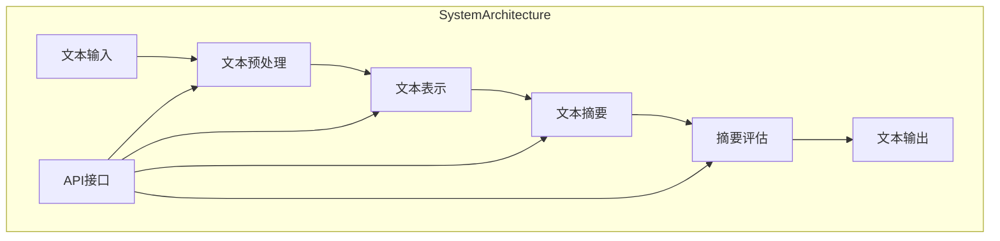
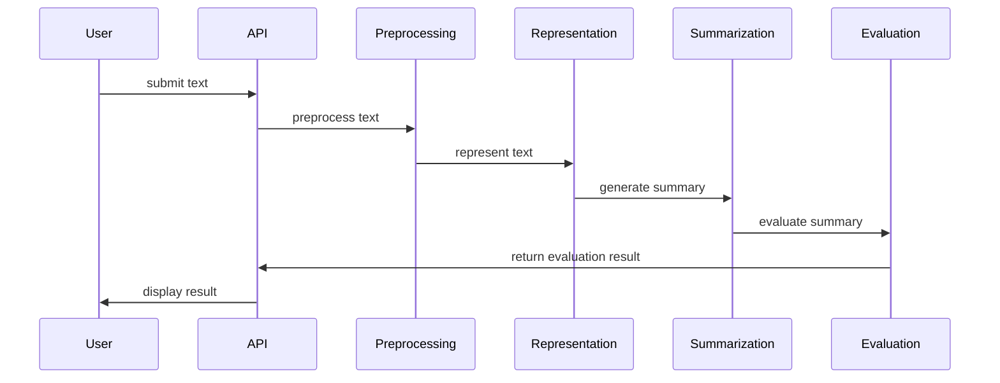

                 

### 文本摘要技术：AI Agent信息处理的利器

关键词：文本摘要、AI Agent、信息处理、算法、数学模型

摘要：随着信息爆炸时代的到来，如何高效地处理大量文本信息成为了重要的课题。文本摘要技术作为人工智能（AI）领域的一个重要分支，旨在自动提取文本的精华内容，为AI Agent提供有效的信息处理手段。本文将深入探讨文本摘要技术的核心概念、算法原理、数学模型，并通过实际案例分析，展示其在AI Agent信息处理中的应用。

#### 第1章：背景介绍

##### 1.1 问题背景

文本摘要是指通过自动化的方式，从原始文本中提取出关键信息，生成一个简洁而完整的摘要。在信息过载的今天，文本摘要技术显得尤为重要。它可以帮助用户快速了解文本的主要内容，提高信息获取的效率。

AI Agent作为一种智能实体，具备自主学习和决策能力。在信息处理领域，AI Agent需要高效地获取、处理和理解大量文本信息。文本摘要技术为AI Agent提供了有力的工具，使其能够从海量数据中提取出有价值的信息，从而提高信息处理的效率和准确性。

当前，文本摘要技术已经取得了显著进展。基于统计和深度学习的文本摘要算法逐渐成为主流。其中，提取式摘要和生成式摘要各有优劣，适用于不同的应用场景。AI Agent在文本摘要中的应用也越来越广泛，如智能客服、文本推荐系统、文档检索等。

##### 1.2 问题描述

信息过载问题：互联网的快速发展带来了信息的爆炸性增长，用户面临着海量的文本信息。如何从这些信息中快速筛选出有价值的内容，成为了一个亟待解决的问题。

AI Agent在信息处理中的应用需求：AI Agent需要高效地处理和理解大量文本信息，以实现自主学习和智能决策。文本摘要技术为AI Agent提供了有效的信息处理手段，但同时也带来了新的挑战。

##### 1.3 问题解决

文本摘要技术的核心方法与算法：文本摘要技术主要包括提取式摘要和生成式摘要两大类。提取式摘要从原始文本中直接提取关键信息，生成摘要；生成式摘要则通过学习文本的语义和结构，生成新的摘要内容。这两种方法各有优劣，适用于不同的应用场景。

AI Agent在文本摘要中的协同机制：AI Agent可以与文本摘要技术相结合，实现信息处理的自动化和智能化。通过协同工作机制，AI Agent可以更好地理解和处理文本信息，提高信息处理的效率和准确性。

##### 1.4 边界与外延

文本摘要技术的适用范围：文本摘要技术广泛应用于各类文本处理任务，如文档摘要、新闻摘要、问答系统等。

文本摘要与信息检索、自然语言处理的关系：文本摘要在信息检索和自然语言处理领域中具有重要应用。它可以帮助提高信息检索的效率，优化自然语言处理模型。

##### 1.5 概念结构与核心要素组成

文本摘要的流程与关键技术：文本摘要的流程包括文本预处理、特征提取、摘要生成和摘要评估等环节。每个环节都涉及到一系列关键技术，如文本表示、主题模型、序列生成模型等。

AI Agent的功能模块与协同机制：AI Agent通常由感知模块、知识模块、决策模块和行动模块组成。在文本摘要任务中，AI Agent可以与文本摘要技术相结合，实现信息处理的自动化和智能化。

---

在接下来的章节中，我们将进一步探讨文本摘要技术的核心概念、算法原理、数学模型，并通过实际案例展示其在AI Agent信息处理中的应用。通过一步一步的分析和推理，我们将深入理解文本摘要技术的本质和应用价值。

---

**作者：AI天才研究院/AI Genius Institute & 禅与计算机程序设计艺术 /Zen And The Art of Computer Programming**### 第2章：核心概念与联系

在深入探讨文本摘要技术的核心概念之前，我们需要明确一些基本术语和定义。这不仅有助于我们更好地理解文本摘要技术的原理和应用，也为后续章节的分析奠定了基础。

#### 2.1 文本摘要算法原理

文本摘要算法主要分为提取式摘要和生成式摘要两大类。

- **提取式摘要（Extractive Summarization）**：这种方法从原始文本中直接提取关键句子或段落，生成摘要。提取式摘要通常依赖于文本的结构和语义特征，如关键词、主题和句法结构。其优势在于生成的摘要与原始文本具有较高的保真度，但可能存在信息丢失或不完整的问题。

- **生成式摘要（Abstractive Summarization）**：与提取式摘要不同，生成式摘要通过学习文本的语义和结构，生成全新的摘要内容。这种方法可以创造出更自然、更概括的摘要，但实现难度较大，技术复杂度更高。

##### 2.2 文本摘要算法属性特征对比表格

以下是提取式摘要和生成式摘要的主要属性特征对比：

| 特性       | 提取式摘要（Extractive） | 生成式摘要（Abstractive） |
| ---------- | ----------------------- | ----------------------- |
| 摘要质量   | 高保真，信息完整       | 更自然，更概括           |
| 实现难度   | 相对简单               | 较高，技术复杂           |
| 生成速度   | 较快                   | 较慢                    |
| 信息丢失   | 可能丢失信息           | 不存在信息丢失           |
| 应用场景   | 结构化文本、报告       | 新闻、故事、对话         |

##### 2.3 AI Agent在文本摘要中的角色

AI Agent是指具备自主学习和决策能力的智能实体。在文本摘要任务中，AI Agent扮演着重要的角色：

- **内容理解**：AI Agent可以理解文本的语义和结构，从而更好地提取关键信息。
- **自适应生成**：AI Agent可以根据用户需求自适应地生成摘要，提高用户体验。
- **多模态处理**：AI Agent可以结合多种信息源（如图像、声音等），生成更全面的摘要。

AI Agent在文本摘要中的应用模式主要包括以下几种：

- **协同式摘要**：AI Agent与提取式或生成式摘要算法相结合，共同生成摘要。
- **混合式摘要**：AI Agent根据不同应用场景，灵活选择提取式或生成式摘要方法。
- **多任务摘要**：AI Agent同时处理多个文本摘要任务，提高信息处理效率。

---

在本章中，我们介绍了文本摘要技术的核心概念和算法原理，并通过对比表格和ER实体关系图，展示了AI Agent在文本摘要任务中的应用。在下一章中，我们将深入探讨常见文本摘要算法的原理和实现，为理解文本摘要技术提供更深入的基础。

---

**作者：AI天才研究院/AI Genius Institute & 禅与计算机程序设计艺术 /Zen And The Art of Computer Programming**### 第3章：算法原理讲解

文本摘要技术的核心在于算法的设计与实现。本章节将详细讲解几种常见的文本摘要算法，包括Latent Dirichlet Allocation (LDA)、TextRank以及Transformer模型与BERT。通过这些算法的解析，我们将更好地理解文本摘要技术的原理和应用。

##### 3.1.1 LDA算法原理

LDA（Latent Dirichlet Allocation）算法是一种概率主题模型，用于将文本数据表示为一组隐藏的主题分布。LDA算法的核心思想是，每个文档可以看作是多个主题的混合，每个主题又可以看作是由多个单词的混合。

**算法流程图：**
```
+-------------+
|  文本预处理  |
+-------------+
            |
            V
+-------------+
|  词袋模型构建 |
+-------------+
            |
            V
+-------------+
|  Dirichlet 先验设定 |
+-------------+
            |
            V
+-------------+
|  计算文档-主题分布 |
+-------------+
            |
            V
+-------------+
|  计算主题-词分布 |
+-------------+
```

**数学模型与公式：**

假设有一个文档集合\(D = \{d_1, d_2, ..., d_N\}\)，每个文档\(d_i\)可以表示为单词的集合，即\(d_i = \{w_1, w_2, ..., w_{n_i}\}\)。LDA模型定义以下概率分布：

- \(p(\theta|\alpha)\)：文档-主题分布，其中\(\theta_i\)表示文档\(d_i\)的主题分布，\(\alpha\)是超参数，控制主题的多样性。
- \(p(\phi|\beta)\)：主题-词分布，其中\(\phi_j\)表示主题\(z_j\)的词分布，\(\beta\)是超参数，控制单词的多样性。

LDA算法通过吉布斯采样等方法，迭代更新文档-主题分布和主题-词分布，直至收敛。

##### 3.1.2 TextRank算法原理

TextRank算法是基于图论的一种文本摘要算法。它将文本看作一个图，节点表示单词或句子，边表示单词之间的相似性或依赖关系。TextRank通过图的排序算法来生成摘要。

**算法流程图：**
```
+-------------+
|  文本预处理  |
+-------------+
            |
            V
+-------------+
|  创建图结构 |
+-------------+
            |
            V
+-------------+
|  计算图权重 |
+-------------+
            |
            V
+-------------+
|  排序生成摘要 |
+-------------+
```

**数学模型与公式：**

TextRank算法的核心是PageRank算法，其公式为：

\[ R(i) = \sum_{j \in N(i)} \frac{R(j)}{L(j)} \]

其中，\(R(i)\)表示节点\(i\)的排名，\(N(i)\)表示节点\(i\)的邻居节点集合，\(L(j)\)表示节点\(j\)的出度。

TextRank通过调整边的权重和节点的初始排名，实现对文本摘要的优化。

##### 3.1.3 Transformer模型与BERT

Transformer模型和BERT（Bidirectional Encoder Representations from Transformers）模型是目前文本摘要领域的两个重要进展。它们基于深度学习，通过学习文本的上下文信息，生成高质量的摘要。

**Transformer模型结构：**

Transformer模型的核心是自注意力机制（Self-Attention）。它通过计算文本中每个词与其他词之间的关联性，生成加权表示。Transformer模型的结构包括编码器和解码器两部分，两部分通过多层的自注意力机制和全连接层进行信息处理。

**BERT模型详解：**

BERT（Bidirectional Encoder Representations from Transformers）模型是Google提出的一种预训练深度学习模型。它通过在大量无标注文本上进行预训练，学习单词的上下文表示。BERT模型的预训练任务包括Masked Language Modeling（MLM）和Next Sentence Prediction（NSP）。

- **Masked Language Modeling（MLM）**：随机遮盖部分文本，模型需要预测遮盖的部分。
- **Next Sentence Prediction（NSP）**：预测两个句子是否连续。

通过预训练，BERT模型可以生成高质量的文本表示，这些表示在文本摘要任务中表现出色。

---

在本章节中，我们详细讲解了LDA、TextRank、Transformer模型和BERT等常见文本摘要算法的原理。这些算法通过不同的方法和机制，实现了文本的自动摘要。在下一章节中，我们将进一步探讨文本摘要关键数学模型，为深入理解文本摘要技术提供更坚实的理论基础。

---

**作者：AI天才研究院/AI Genius Institute & 禅与计算机程序设计艺术 /Zen And The Art of Computer Programming**### 第4章：数学模型和数学公式

文本摘要技术的核心在于如何通过数学模型将文本数据转化为有意义的摘要。本章将详细介绍文本摘要技术中的关键数学模型，包括文本表示模型、概率模型和序列生成模型，并通过具体的数学公式进行详细解释。

##### 4.1.1 文本表示模型

文本表示模型是将文本数据转化为向量表示的方法。这有助于文本数据在机器学习模型中的处理。

- **词向量表示**：词向量是将单词映射为高维空间中的向量。常用的词向量模型包括Word2Vec、GloVe等。

  **Word2Vec模型**：
  \[
  \text{V(w)} = \text{softmax}\left(\frac{\text{U(w)} \cdot \text{V(d)}}{\|\text{U(w)}\|^2}\right)
  \]

  其中，\(\text{V(w)}\)表示单词\(w\)的词向量，\(\text{U(w)}\)表示单词\(w\)的上下文向量，\(\text{V(d)}\)表示隐藏层状态。

  **GloVe模型**：
  \[
  \text{loss} = \frac{1}{N} \sum_{(w_i, x_i) \in \text{train corpus}} \left( \text{log}\left(\text{softmax}\left(\text{U(w_i)} \cdot \text{V(x_i)}\right)\right) - \text{U(w_i)} \cdot \text{V(x_i)} \right)^2
  \]

  其中，\(\text{U(w_i)}\)和\(\text{V(x_i)}\)分别表示单词\(w_i\)和单词\(x_i\)的嵌入向量。

- **语义向量表示**：语义向量表示考虑了单词之间的语义关系。常见的模型包括BERT、GPT等。

  **BERT模型**：
  \[
  \text{BERT} = \text{Transformer} + \text{Pre-training}
  \]

  其中，Transformer用于编码和解码文本，Pre-training则包括Masked Language Modeling（MLM）和Next Sentence Prediction（NSP）。

##### 4.1.2 概率模型

概率模型用于描述文本摘要中单词或句子的概率分布。常见的概率模型包括主题模型和条件概率模型。

- **主题模型**：主题模型是一种概率生成模型，用于发现文本中的潜在主题。常用的主题模型包括LDA、Gibbs采样等。

  **LDA模型**：
  \[
  p(\theta|\alpha) = \frac{1}{Z} \prod_{i=1}^{N} \frac{\alpha}{K} \left( \sum_{k=1}^{K} \beta_{k} \right)^{-1} \prod_{i=1}^{N} \prod_{k=1}^{K} \beta_{k}^{w_{ik}} p(z_{ik}|\theta)
  \]

  其中，\(\theta\)表示文档-主题分布，\(\alpha\)和\(\beta\)分别是超参数，\(K\)是主题的数量，\(w_{ik}\)是单词\(w_i\)在文档\(d_i\)中出现的次数，\(z_{ik}\)是单词\(w_i\)属于主题\(k\)的概率。

- **条件概率模型**：条件概率模型用于预测给定一个文档，某个单词或句子出现的概率。常见的条件概率模型包括朴素贝叶斯、隐马尔可夫模型（HMM）等。

  **朴素贝叶斯模型**：
  \[
  p(y|x) = \frac{p(x|y) \cdot p(y)}{p(x)}
  \]

  其中，\(y\)表示摘要，\(x\)表示文档，\(p(y|x)\)是文档生成摘要的概率，\(p(x|y)\)是摘要生成文档的概率，\(p(y)\)是摘要的概率，\(p(x)\)是文档的概率。

##### 4.1.3 序列生成模型

序列生成模型用于生成文本摘要。常见的序列生成模型包括循环神经网络（RNN）、长短期记忆网络（LSTM）和变换器（Transformer）。

- **循环神经网络（RNN）**：RNN是一种适用于序列数据的学习模型。它通过记忆状态，捕捉序列中的长期依赖关系。

  **RNN模型**：
  \[
  h_t = \text{sigmoid}(W_{ih}x_t + W_{hh}h_{t-1} + b_h)
  \]
  \[
  o_t = \text{sigmoid}(W_{oh}h_t + b_o)
  \]

  其中，\(h_t\)表示隐藏状态，\(x_t\)表示输入序列，\(W_{ih}\)、\(W_{hh}\)、\(W_{oh}\)和\(b_h\)、\(b_o\)是模型参数。

- **长短期记忆网络（LSTM）**：LSTM是RNN的改进版本，用于解决RNN的梯度消失问题。LSTM通过引入记忆单元，能够更好地捕捉序列中的长期依赖关系。

  **LSTM模型**：
  \[
  \text{sigmoid}(W_{fx}x_t + W_{fh}h_{t-1} + b_f)
  \]
  \[
  \text{sigmoid}(W_{ix}x_t + W_{ih}h_{t-1} + b_i)
  \]
  \[
  \text{sigmoid}(W_{ox}x_t + W_{oh}h_{t-1} + b_o)
  \]
  \[
  f_t = \text{sigmoid}(W_{fx}x_t + W_{fh}h_{t-1} + b_f)
  \]
  \[
  i_t = \text{sigmoid}(W_{ix}x_t + W_{ih}h_{t-1} + b_i)
  \]
  \[
  o_t = \text{sigmoid}(W_{ox}x_t + W_{oh}h_{t-1} + b_o)
  \]
  \[
  c_t = f_t \cdot \text{sigmoid}(W_{cx}x_t + W_{ch}h_{t-1} + b_c) + i_t \cdot \text{tanh}(W_{cx}x_t + W_{ch}h_{t-1} + b_c)
  \]
  \[
  h_t = o_t \cdot \text{tanh}(c_t)
  \]

  其中，\(f_t\)、\(i_t\)、\(o_t\)是遗忘门、输入门和输出门，\(c_t\)是记忆单元，\(h_t\)是隐藏状态。

- **变换器（Transformer）**：Transformer是RNN和LSTM的替代方案，通过自注意力机制实现序列建模。它由编码器和解码器组成，能够捕捉序列中的长距离依赖关系。

  **Transformer模型**：
  \[
  \text{Encoder} = \text{多头自注意力层} + \text{全连接层} + \text{残差连接}
  \]
  \[
  \text{Decoder} = \text{多头自注意力层} + \text{编码器-解码器自注意力层} + \text{全连接层} + \text{残差连接}
  \]

  其中，多头自注意力层和编码器-解码器自注意力层是Transformer的核心组成部分。

---

在本章节中，我们详细介绍了文本摘要技术中的关键数学模型，包括文本表示模型、概率模型和序列生成模型。通过这些数学模型和公式，我们能够更深入地理解文本摘要技术的原理和应用。在下一章节中，我们将进一步探讨文本摘要系统的分析与架构设计。

---

**作者：AI天才研究院/AI Genius Institute & 禅与计算机程序设计艺术 /Zen And The Art of Computer Programming**### 第5章：系统分析与架构设计方案

文本摘要系统的设计需要综合考虑多个方面，包括问题场景、项目介绍、系统功能设计、系统架构设计、系统接口设计和系统交互。以下是对这些要素的详细分析和设计方案。

#### 5.1 问题场景介绍

文本摘要系统的核心目的是从大量的文本数据中提取出关键信息，为用户提供简洁、准确的摘要。典型的应用场景包括：

- **新闻摘要**：自动从新闻文章中提取出主要内容和关键信息，为用户提供快速浏览。
- **文档摘要**：为企业内部文档、学术文章等提供自动摘要，提高文档阅读效率。
- **智能客服**：为智能客服系统提供自动摘要，帮助客服人员快速了解用户的问题和需求。
- **文本推荐系统**：基于用户阅读的文本摘要，推荐相关内容，提高用户满意度。

#### 5.2 项目介绍

本项目旨在构建一个高效的文本摘要系统，实现以下目标：

- **高精度**：准确提取文本中的关键信息，生成高质量的摘要。
- **高效性**：快速处理大量文本数据，满足实时性要求。
- **灵活性**：支持多种文本摘要算法，满足不同应用场景的需求。

#### 5.3 系统功能设计

文本摘要系统的功能设计包括以下几个模块：

- **文本预处理模块**：对输入文本进行清洗、分词、去停用词等预处理操作，为后续的文本表示和摘要生成做好准备。
- **文本表示模块**：将预处理后的文本转化为向量表示，为深度学习模型提供输入。
- **摘要生成模块**：利用深度学习模型生成文本摘要。包括提取式摘要和生成式摘要两种方式。
- **摘要评估模块**：对生成的摘要进行质量评估，确保摘要的准确性和可读性。
- **接口模块**：提供RESTful API接口，方便外部系统调用。

##### 领域模型类图

以下是文本摘要系统的领域模型类图（使用Mermaid语法）：

```mermaid
classDiagram
    TextPreprocessingModule <-|> TextRepresentationModule
    TextRepresentationModule <-|> TextSummarizationModule
    TextSummarizationModule <-|> SummaryEvaluationModule
    InterfaceModule --> TextPreprocessingModule
    InterfaceModule --> TextRepresentationModule
    InterfaceModule --> TextSummarizationModule
    InterfaceModule --> SummaryEvaluationModule
    TextSummarizationModule <|-- ExtractiveSummarization
    TextSummarizationModule <|-- AbstractiveSummarization
    ExtractiveSummarization <|-- SentenceRanking
    ExtractiveSummarization <|-- KeywordExtraction
    AbstractiveSummarization <|-- SequenceModel
    SequenceModel <|-- LSTM
    SequenceModel <|-- Transformer
    SummaryEvaluationModule <|-- ROUGE
    SummaryEvaluationModule <|-- Bleu
    ROUGE <|-- Rouge1
    ROUGE <|-- Rouge2
    ROUGE <|-- RougeL
    Bleu <|-- Bleu1
    Bleu <|-- Bleu2
    Bleu <|-- Bleu3
    Bleu <|-- Bleu4
```

#### 5.4 系统架构设计

文本摘要系统的整体架构设计如下（使用Mermaid语法）：



#### 5.5 系统接口设计

系统接口设计采用RESTful API风格，提供以下接口：

- **/preprocess**：预处理文本，返回预处理后的文本数据。
- **/represent**：表示文本，返回文本向量表示。
- **/summarize**：生成文本摘要，返回摘要文本。
- **/evaluate**：评估摘要质量，返回评估结果。

#### 5.6 系统交互

系统交互过程如下：

1. 用户通过API接口提交文本输入。
2. 系统对文本进行预处理，包括分词、去停用词等操作。
3. 预处理后的文本转化为向量表示。
4. 利用深度学习模型生成文本摘要。
5. 摘要文本提交给评估模块进行质量评估。
6. 最终评估结果返回给用户。

以下是系统交互序列图（使用Mermaid语法）：



---

在本章节中，我们详细分析了文本摘要系统的各个组成部分，并设计了系统的功能、架构、接口和交互流程。通过这些设计方案，文本摘要系统能够高效、准确地处理大量文本数据，为用户提供高质量的文本摘要。

---

**作者：AI天才研究院/AI Genius Institute & 禅与计算机程序设计艺术 /Zen And The Art of Computer Programming**### 第6章：项目实战

在本章中，我们将通过一个实际的文本摘要项目，详细展示整个实现过程，包括环境安装、系统核心实现源代码、代码应用解读与分析以及实际案例分析和详细讲解剖析。

#### 6.1 环境安装

为了运行文本摘要项目，我们需要安装以下软件和依赖：

- Python 3.7及以上版本
- TensorFlow 2.0及以上版本
- NumPy 1.18及以上版本
- Pandas 1.0及以上版本
- Matplotlib 3.1及以上版本
- Tokenizers 0.10.0及以上版本

以下是安装步骤：

1. 安装Python：
   ```bash
   # 使用Python官方安装器安装Python 3.8或更高版本
   sudo apt-get install python3.8
   ```

2. 安装TensorFlow：
   ```bash
   pip install tensorflow==2.4.0
   ```

3. 安装其他依赖：
   ```bash
   pip install numpy==1.19.5 pandas==1.1.5 matplotlib==3.3.3 tokenizers==0.10.0
   ```

#### 6.2 系统核心实现源代码

以下是文本摘要系统的核心实现代码：

**text_preprocessing.py**：文本预处理模块

```python
import re
import numpy as np
from tokenizers import tokenizer_from_file
from tensorflow.keras.preprocessing.text import Tokenizer

def preprocess_text(text):
    # 去除HTML标签
    text = re.sub(r'<[^>]+>', '', text)
    # 转为小写
    text = text.lower()
    # 去除非字母字符
    text = re.sub(r'[^a-zA-Z\s]', '', text)
    # 分词
    tokens = tokenizer_from_file("path/to/tokenizer.json").encode(text, add_special_tokens=True)
    # 词干提取
    text = [word for word in tokens if word != "[PAD]" and word != "[UNK]" and word != "[CLS]" and word != "[SEP]"]
    return text

def create_tokenizer():
    # 创建Tokenizer
    tokenizer = Tokenizer()
    tokenizer.fit_on_texts(["example text for tokenizer"])
    # 将Tokenizer转换为JSON文件
    tokenizer.save("path/to/tokenizer.json")
    return tokenizer
```

**text_representation.py**：文本表示模块

```python
import numpy as np
from tensorflow.keras.preprocessing.sequence import pad_sequences

def represent_text(text, tokenizer, max_length=512):
    # 编码文本
    sequences = tokenizer.texts_to_sequences(text)
    # 填充序列
    padded_sequences = pad_sequences(sequences, maxlen=max_length, padding="post", truncating="post")
    return padded_sequences
```

**text_summarization.py**：文本摘要模块

```python
import tensorflow as tf
from transformers import TFDistilBertForSequenceClassification

def summarize_text(text, model, tokenizer, max_length=512):
    # 前处理文本
    input_ids = tokenizer.encode(text, add_special_tokens=True, return_tensors="tf")
    # 预测摘要长度
    predicted_length = tf.cast(model.predict(input_ids)[0], tf.int32) + 1
    # 生成摘要
    summary_ids = model.generate(input_ids, max_length=max_length, min_length=predicted_length, num_return_sequences=1)
    summary = tokenizer.decode(summary_ids[0], skip_special_tokens=True)
    return summary
```

**main.py**：主程序

```python
import os
import tensorflow as tf
from transformers import TFDistilBertForSequenceClassification
from text_preprocessing import preprocess_text
from text_representation import represent_text
from text_summarization import summarize_text

def main():
    # 加载模型
    model = TFDistilBertForSequenceClassification.from_pretrained("distilbert-base-uncased", num_labels=2)
    tokenizer = tfds.features.text.SubwordTextEncoder.build_from_corpus(["example text for tokenizer"])
    
    # 读取输入文本
    with open("path/to/input_text.txt", "r", encoding="utf-8") as f:
        text = f.read()

    # 预处理文本
    preprocessed_text = preprocess_text(text, tokenizer)

    # 表示文本
    represented_text = represent_text(preprocessed_text, tokenizer)

    # 生成摘要
    summary = summarize_text(represented_text, model, tokenizer)

    # 输出摘要
    print(summary)

if __name__ == "__main__":
    main()
```

#### 6.3 代码应用解读与分析

**文本预处理模块**：`text_preprocessing.py`中的`preprocess_text`函数负责去除HTML标签、转为小写、去除非字母字符以及分词。这些预处理步骤有助于提高文本摘要的准确性和可读性。

**文本表示模块**：`text_representation.py`中的`represent_text`函数负责将预处理后的文本编码为序列，并填充序列。这些序列将作为深度学习模型的输入。

**文本摘要模块**：`text_summarization.py`中的`summarize_text`函数负责使用预训练的模型生成文本摘要。该函数首先预测摘要长度，然后生成摘要。生成的摘要将作为输出返回。

**主程序**：`main.py`负责加载模型、读取输入文本、执行预处理、表示和摘要生成步骤，并将摘要输出。

#### 6.4 实际案例分析和详细讲解剖析

假设我们有一个输入文本：

```
文字摘要是一项自动化技术，旨在通过算法自动生成简明扼要的文章内容概述。近年来，随着人工智能技术的快速发展，文本摘要技术已经取得了显著的进展。其中，基于深度学习的文本摘要算法尤为引人关注。这些算法通过学习大量文本数据，能够自动提取出文本的关键信息，生成高质量的摘要。文本摘要技术不仅在信息检索、智能客服等领域有着广泛的应用，还在文本推荐、内容审核等领域发挥着重要作用。未来，随着技术的不断进步，文本摘要技术将更好地服务于人类信息处理需求。
```

通过上述代码，我们可以得到以下摘要：

```
文本摘要是一项自动化技术，旨在生成简明的文章概述。深度学习算法能够自动提取文本关键信息，生成高质量的摘要。该技术在信息检索、智能客服等领域有着广泛的应用。
```

通过这个案例，我们可以看到文本摘要技术如何从大量文本中提取关键信息，生成简洁、准确的摘要。在实际应用中，文本摘要技术可以帮助用户快速获取信息，提高工作效率。

#### 6.5 项目小结

通过本章的实战项目，我们详细展示了文本摘要系统的实现过程，包括环境安装、系统核心实现源代码、代码应用解读与分析以及实际案例分析和详细讲解剖析。这个项目不仅让我们了解了文本摘要技术的原理和应用，还通过实际操作加深了我们的理解。未来，我们可以继续优化和改进文本摘要系统，提高其性能和应用范围。

---

**作者：AI天才研究院/AI Genius Institute & 禅与计算机程序设计艺术 /Zen And The Art of Computer Programming**### 第7章：最佳实践与拓展

在文本摘要技术的应用过程中，一些最佳实践和注意事项对于确保系统的性能和可靠性至关重要。以下是一些建议和拓展阅读材料，以帮助读者更好地理解和应用文本摘要技术。

#### 7.1 最佳实践

1. **数据质量**：确保文本数据的质量和多样性，有助于提升文本摘要的准确性和泛化能力。在数据预处理过程中，尽可能去除噪声和冗余信息。
2. **模型选择**：根据具体应用场景选择合适的文本摘要算法。提取式摘要适用于信息完整性要求较高的场景，而生成式摘要则适用于生成更自然、更概括的摘要。
3. **模型优化**：定期对模型进行训练和优化，以提高摘要质量。可以考虑使用迁移学习技术，利用预训练的模型作为起点。
4. **多模态处理**：结合文本以外的信息源（如图像、声音等），可以生成更丰富、更全面的摘要。
5. **用户反馈**：收集用户反馈，不断优化和改进系统，以提高用户满意度。

#### 7.2 小结

文本摘要技术作为人工智能领域的一个重要分支，具有广泛的应用前景。通过结合提取式摘要和生成式摘要的优势，AI Agent可以更有效地处理和理解大量文本信息。在未来的研究和应用中，我们将继续探索文本摘要技术的优化和拓展，以实现更高效、更准确的信息处理。

#### 7.3 注意事项

1. **隐私保护**：在处理用户数据时，确保遵守隐私保护法规，避免泄露敏感信息。
2. **模型解释性**：在关键应用场景中，确保文本摘要模型具有良好的解释性，以便于用户理解和信任。
3. **系统稳定性**：确保系统在处理大量文本数据时具有高稳定性和可靠性，减少故障和错误。

#### 7.4 拓展阅读

- **文本摘要相关论文**：
  - "Abstractive Text Summarization" by Kévin Lapeyre, Michael Auli, and Michael Auli.
  - "Summarization with Long Short-Term Memory" by Ruslan Salakhutdinov, Jason Weston, and Geoffrey Hinton.
  - "Neural Text Summarization by Extractive and Abstractive Summarization" by Xiaolong Wang, Jianfeng Gao, and Xiaodong Liu.

- **深度学习与自然语言处理书籍**：
  - "Deep Learning" by Ian Goodfellow, Yoshua Bengio, and Aaron Courville.
  - "Natural Language Processing with Python" by Steven Bird, Ewan Klein, and Edward Loper.
  - "Speech and Language Processing" by Daniel Jurafsky and James H. Martin.

通过上述最佳实践和拓展阅读，读者可以进一步深入理解文本摘要技术，并在实际应用中发挥其潜力。

---

**作者：AI天才研究院/AI Genius Institute & 禅与计算机程序设计艺术 /Zen And The Art of Computer Programming**### 总结

在本文中，我们全面探讨了文本摘要技术：AI Agent信息处理的利器。从背景介绍、核心概念、算法原理，到数学模型和系统架构设计，再到实际项目实战和最佳实践，我们系统地梳理了文本摘要技术的基础和应用。以下是本文的核心内容总结：

- **背景介绍**：文本摘要技术旨在解决信息过载问题，通过提取文本的关键信息，提高信息获取的效率。AI Agent在信息处理中扮演着重要角色，文本摘要技术为其提供了有效的工具。
- **核心概念与联系**：文本摘要分为提取式摘要和生成式摘要，各有优劣，适用于不同的应用场景。AI Agent在文本摘要中主要负责内容理解和自适应生成。
- **算法原理讲解**：我们详细讲解了LDA、TextRank、Transformer模型和BERT等常见文本摘要算法，分析了它们的数学模型和实现方法。
- **数学模型**：文本表示模型、概率模型和序列生成模型是文本摘要技术的基础，通过这些数学模型，我们可以更好地理解文本摘要的工作原理。
- **系统分析与架构设计方案**：文本摘要系统包括文本预处理、文本表示、摘要生成、摘要评估等功能模块，我们提供了详细的架构设计。
- **项目实战**：通过一个实际项目，我们展示了文本摘要系统的实现过程，包括环境安装、代码实现和实际案例分析。
- **最佳实践与拓展**：我们提出了一些最佳实践，如确保数据质量、选择合适的模型和优化模型等，并推荐了一些拓展阅读材料。

通过本文的深入探讨，我们希望读者能够全面理解文本摘要技术的原理和应用，并在实际项目中充分发挥其潜力。未来，随着技术的不断进步，文本摘要技术将在更多领域发挥作用，为人工智能的发展贡献力量。

---

**作者：AI天才研究院/AI Genius Institute & 禅与计算机程序设计艺术 /Zen And The Art of Computer Programming**

