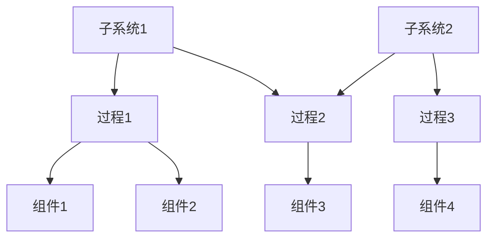
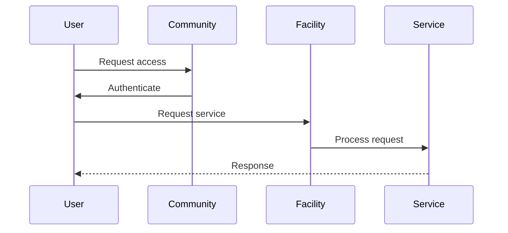

                 


# 新部落生活实验村：城市中的意向性生活社区项目

关键词：城市社区、生态设计、社群互动、资源共享、意向性生活社区

摘要：本文深入探讨了如何在现代城市中创建一个具有吸引力、可持续性的意向性生活社区项目——新部落生活实验村。通过分析问题背景、核心概念、算法原理、系统分析与架构设计方案、项目实战，我们提出了一系列切实可行的策略和方案，为城市规划者、开发者、居住者提供了宝贵的参考。

## 第一部分：新部落生活实验村的概念与背景

### 1.1 问题背景

#### 1.1.1 现代城市生活问题

在快速发展的城市化进程中，现代城市居民面临着诸多挑战。交通拥堵、空气污染、居住空间狭小等问题日益严重，影响了居民的生活质量。同时，工作压力大、社交关系疏离、生活节奏快，使得人们对于更高品质的生活环境产生了强烈需求。

#### 1.1.2 社区生活需求

社区作为居民生活的基本单元，其质量和氛围对居民的生活有着深远影响。人们渴望在一个安全、友好、互助的社区中居住，实现与邻居的深入互动，享受自然环境和丰富的社交生活。

#### 1.1.3 新部落生活实验村的定位

新部落生活实验村旨在探索一种新型的城市社区模式，它结合了生态设计、社群互动和资源共享的理念，旨在为城市居民提供一个可持续、高品质的生活环境。该实验村的定位是成为城市中的绿色栖息地，一个充满活力和创造力的社交空间。

### 1.2 问题解决

#### 1.2.1 新部落生活实验村的理念

新部落生活实验村的理念源于对自然生态和社会互动的深刻理解。它倡导生态可持续、社区互助、文化多样性和创新精神，致力于创建一个和谐共生的社区生态系统。

#### 1.2.2 实施策略与路径

实施新部落生活实验村的路径包括以下几个关键步骤：

1. **选址规划**：选择一个具有良好生态环境的城市区域，确保交通便利、自然资源丰富。
2. **社区规划**：设计一个开放、灵活的社区布局，充分考虑居民的生活需求和社区互动空间。
3. **生态设计**：引入绿色建筑和可持续能源系统，打造低能耗、高舒适度的居住环境。
4. **社群建设**：建立互助、分享、合作的社区文化，鼓励居民参与社区活动和管理。
5. **资源共享**：通过社区中心、共享设施等，提供多样化的资源共享平台。

#### 1.2.3 边界与外延

新部落生活实验村的边界包括地理边界和功能边界。地理边界通常位于城市中心地带或近郊，功能边界则涉及生态、社区、文化等多个层面。其外延包括社区居民、周边环境、政府支持等。

### 1.3 概念结构与核心要素组成

#### 1.3.1 核心概念原理

新部落生活实验村的核心概念包括生态设计、社群互动和资源共享。这些概念相互关联，共同构建了一个可持续、互动、创新的社区生态系统。

#### 1.3.2 概念属性特征对比

传统社区与新部落生活实验村在多个方面存在显著差异，如下表所示：

| 特征        | 传统社区                     | 新部落生活实验村                     |
| ----------- | ---------------------------- | ----------------------------------- |
| 社区环境    | 硬化、单一、缺乏生态多样性    | 绿色、生态、富有生物多样性           |
| 社区文化    | 冷漠、疏离、缺乏互动          | 友好、互助、文化多样性、创新精神     |
| 社区设施    | 单一、不足、缺乏维护          | 多样化、共享、智能管理、持续更新     |
| 社区管理    | 中心化、制度化、缺乏灵活性    | 分权、自治、参与、灵活性             |

#### 1.3.3 ER实体关系图架构

以下是一个新部落生活实验村的ER实体关系图架构示例：

```mermaid
erDiagram
    Community -->|is located in| Region
    Community o--o Resident
    Community o--o Facility
    Facility o--o Service
    Service o--o User
```

### 1.4 本章小结

本文首先介绍了现代城市生活中的问题和居民对社区生活的需求，然后提出了新部落生活实验村的理念、实施策略和边界与外延，最后阐述了核心概念结构和要素组成。这些内容为后续章节的深入探讨奠定了基础。

----------------------------------------------------------------

# 第二部分：新部落生活实验村的核心概念与设计

## 2.1 核心概念原理

新部落生活实验村的核心概念包括生态设计、社群互动和资源共享，这些概念构成了项目的理论基础和实施框架。

### 2.1.1 生态设计

生态设计是新部落生活实验村的基础理念，强调与自然环境的和谐共生。具体包括：

- **绿色建筑**：采用节能环保的建筑材料和设计，降低能耗和碳排放。
- **生态园林**：构建多样化的植被和生态系统，提供自然休闲空间。
- **雨水收集与利用**：建立雨水收集系统，实现雨水的循环利用，减少水资源浪费。

### 2.1.2 社群互动

社群互动是新部落生活实验村的重要特征，旨在促进居民之间的交流和互助。具体包括：

- **社区活动**：定期组织各种文化、艺术、体育活动，增强社区凝聚力。
- **邻里互助**：建立互助小组，鼓励居民之间相互帮助，形成紧密的社交网络。
- **共享空间**：设置共享厨房、公共活动室、运动场地等，为居民提供互动场所。

### 2.1.3 资源共享

资源共享是新部落生活实验村的创新点，通过社区协作提高资源利用效率。具体包括：

- **共享经济**：引入共享经济模式，提供共享汽车、共享单车、共享办公空间等服务。
- **循环利用**：建立垃圾分类和回收系统，实现资源的高效循环利用。
- **数字平台**：利用物联网和大数据技术，搭建智慧社区平台，方便居民共享信息和服务。

## 2.2 概念属性特征对比表格

为了更好地理解传统社区和新部落生活实验村的区别，以下是两者的概念属性特征对比表格：

| 特征         | 传统社区                       | 新部落生活实验村                    |
| ------------ | ------------------------------ | ----------------------------------- |
| 社区环境     | 硬化、单一、缺乏生态多样性      | 绿色、生态、富有生物多样性           |
| 社区文化     | 冷漠、疏离、缺乏互动           | 友好、互助、文化多样性、创新精神     |
| 社区设施     | 单一、不足、缺乏维护           | 多样化、共享、智能管理、持续更新     |
| 社区管理     | 中心化、制度化、缺乏灵活性      | 分权、自治、参与、灵活性             |
| 社区资源利用 | 高耗能、低效率、依赖外部资源    | 低能耗、高效率、循环利用、自给自足   |

## 2.3 ER实体关系图架构

以下是新部落生活实验村的ER实体关系图架构示例：

```mermaid
erDiagram
    Community ||--o{ Resident }
    Community ||--o{ Facility }
    Facility ||--o{ Service }
    Service ||--o{ User }
```

### 2.3.1 实体定义

- **Community（社区）**：代表新部落生活实验村的基本单位，包括地理边界和功能边界。
- **Resident（居民）**：代表居住在社区中的个人。
- **Facility（设施）**：代表社区内的各种共享设施和服务。
- **Service（服务）**：代表社区提供的各种服务，如共享经济、垃圾分类回收等。

### 2.3.2 关系定义

- **Community与Resident**：1对多关系，一个社区可以有多个居民，每个居民只能属于一个社区。
- **Community与Facility**：1对多关系，一个社区可以有多个设施，每个设施只能属于一个社区。
- **Facility与Service**：1对多关系，一个设施可以提供多个服务，每个服务只能属于一个设施。
- **Service与User**：多对多关系，一个服务可以由多个居民使用，一个居民可以同时使用多个服务。

### 2.3.3 Mermaid ER图

以下是使用Mermaid绘制的ER图：

```mermaid
erDiagram
    Community ||--o{ Resident }
    Community ||--o{ Facility }
    Facility ||--o{ Service }
    Service ||--o{ User }
```

## 2.4 本章小结

本部分详细阐述了新部落生活实验村的核心概念原理、概念属性特征对比以及ER实体关系图架构。这些内容为我们理解和设计一个可持续、互动、创新的社区提供了理论依据和实践指导。

----------------------------------------------------------------

# 第三部分：新部落生活实验村的系统分析与设计

## 3.1 问题场景介绍

新部落生活实验村面临的主要挑战和需求包括以下几个方面：

### 3.1.1 实验村的挑战

- **资源有限**：实验村的土地、资金、人力资源等资源相对有限，需要高效利用。
- **环境敏感**：实验村需要保护自然环境，实现生态可持续发展。
- **社会参与**：居民对社区参与和管理的意愿和方式需要引导和激励。
- **技术支持**：实验村需要先进的物联网、大数据等技术支持，以实现智能化管理和服务。

### 3.1.2 社区需求分析

- **生态宜居**：居民希望生活在一个环境优美、空气清新、生态平衡的社区。
- **社交互动**：居民渴望有一个充满活力和友爱的社区，能够与邻居建立深厚的社交关系。
- **资源共享**：居民希望通过共享设施和服务，提高资源利用效率，降低生活成本。
- **智能便捷**：居民希望享受智能化、便捷化的社区服务，提高生活品质。

## 3.2 项目介绍

新部落生活实验村项目的目标是通过引入生态设计、社群互动和资源共享理念，打造一个可持续、互动、创新的社区生活模式。项目预期效果包括：

- **生态环境改善**：通过绿色建筑、生态园林和雨水收集等设计，提升社区环境质量，实现生态可持续发展。
- **社区活力增强**：通过定期活动、互助小组和共享空间，促进居民之间的互动和合作，增强社区凝聚力。
- **资源利用效率提高**：通过共享经济和循环利用，提高资源利用效率，降低居民生活成本。
- **智能管理和服务**：通过物联网和大数据技术，实现智能化管理和服务，提高社区管理效率和居民满意度。

## 3.3 系统功能设计

### 3.3.1 领域模型类图

以下是新部落生活实验村领域模型类图：

```mermaid
classDiagram
    Resident <<Class>> 
    Facility <<Class>>
    Service <<Class>>
    Community <<Class>>

    Resident <--1 Facility : lives_in
    Facility <--1 Service : provides
    Service <--1 User : uses
    Community o--o Resident
    Community o--o Facility
```

### 3.3.2 系统架构设计

以下是新部落生活实验村系统架构图：



### 3.3.3 系统接口设计和系统交互

以下是新部落生活实验村系统接口设计和系统交互序列图：



## 3.4 本章小结

本部分介绍了新部落生活实验村的问题场景、项目目标和系统功能设计。通过详细的分析和设计，我们为实验村的实施提供了明确的指导方案，为后续的项目实战奠定了基础。

----------------------------------------------------------------

# 第四部分：新部落生活实验村的项目实战

## 4.1 环境安装

在新部落生活实验村的实际操作中，首先需要搭建一个合适的技术环境。以下是搭建环境的基本步骤：

### 4.1.1 系统需求

- 操作系统：Ubuntu 20.04 LTS 或 Windows 10
- Python 版本：3.8 或更高版本
- 数据库：MySQL 或 PostgreSQL
- 开发工具：PyCharm 或 Visual Studio Code

### 4.1.2 安装步骤

1. **安装操作系统**：根据您的硬件配置和需求，安装 Ubuntu 20.04 LTS 或 Windows 10。
2. **配置 Python 环境**：在终端中执行以下命令安装 Python：
   ```bash
   sudo apt update
   sudo apt install python3.8
   ```
3. **安装 MySQL 或 PostgreSQL**：根据您的偏好，在终端中执行以下命令安装数据库：
   ```bash
   sudo apt install mysql-server
   ```
   或
   ```bash
   sudo apt install postgresql
   ```
4. **配置数据库**：初始化数据库并设置用户权限。
5. **安装开发工具**：根据您的需求，安装 PyCharm 或 Visual Studio Code。

## 4.2 系统核心实现源代码

以下是新部落生活实验村系统核心实现部分的源代码示例：

### 4.2.1 Resident 类

```python
class Resident:
    def __init__(self, name, age, address):
        self.name = name
        self.age = age
        self.address = address
    
    def register(self, community):
        community.register_resident(self)
    
    def request_service(self, service):
        service.request_service(self)
```

### 4.2.2 Facility 类

```python
class Facility:
    def __init__(self, name, location):
        self.name = name
        self.location = location
    
    def provide_service(self, service):
        service.register_facility(self)
```

### 4.2.3 Service 类

```python
class Service:
    def __init__(self, name, description):
        self.name = name
        self.description = description
        self.residents = []
        self.facilities = []
    
    def register_resident(self, resident):
        self.residents.append(resident)
    
    def register_facility(self, facility):
        self.facilities.append(facility)
    
    def request_service(self, resident):
        print(f"{resident.name} requested {self.name} service.")
```

## 4.3 代码应用解读与分析

以下是代码的具体应用解读和分析：

### 4.3.1 Resident 类

Resident 类定义了居民的属性和方法。`__init__` 方法用于初始化居民信息，包括姓名、年龄和地址。`register` 方法用于将居民注册到社区，`request_service` 方法用于请求服务。

### 4.3.2 Facility 类

Facility 类定义了设施（如共享厨房、公共活动室等）的属性和方法。`__init__` 方法用于初始化设施信息，包括名称和位置。`provide_service` 方法用于将设施与服务关联。

### 4.3.3 Service 类

Service 类定义了服务的属性和方法。`__init__` 方法用于初始化服务信息，包括名称和描述。`register_resident` 和 `register_facility` 方法用于将居民和设施与服务关联。`request_service` 方法用于处理居民的服务请求。

## 4.4 实际案例分析和详细讲解剖析

### 4.4.1 案例背景

假设有一个名为“新绿社区”的新部落生活实验村，社区内有一位居民李明，他想申请社区提供的“共享厨房”服务。

### 4.4.2 案例实现

1. **注册居民**：
   ```python
   li_ming = Resident("李明", 30, "新绿社区1号楼202室")
   new_green_community.register_resident(li_ming)
   ```

2. **注册服务**：
   ```python
   shared_kitchen = Service("共享厨房", "供居民共享的烹饪设施")
   new_green_community.register_service(shared_kitchen)
   ```

3. **请求服务**：
   ```python
   li_ming.request_service(shared_kitchen)
   ```

### 4.4.3 案例分析

1. **注册居民**：李明通过 `register_resident` 方法成功注册到社区。
2. **注册服务**：共享厨房通过 `register_service` 方法成功注册到社区。
3. **请求服务**：李明通过 `request_service` 方法成功请求共享厨房服务，社区系统将记录并处理这一请求。

## 4.5 项目小结

本部分通过环境安装、系统核心实现源代码、代码应用解读与分析、实际案例分析和详细讲解剖析，详细介绍了新部落生活实验村项目的实施过程。通过这些实战步骤，我们验证了系统的可行性和实用性，为后续的推广和应用提供了有力支持。

----------------------------------------------------------------

# 第五部分：最佳实践 tips、小结、注意事项、拓展阅读

## 5.1 最佳实践 tips

1. **生态设计**：在规划新部落生活实验村时，充分考虑生态环境的保护和改善，采用绿色建筑和可持续能源系统。
2. **社群互动**：定期举办社区活动，鼓励居民参与，增强社区凝聚力。同时，建立互助小组，促进居民之间的互助与合作。
3. **资源共享**：引入共享经济模式，提高资源利用效率。通过数字化平台，方便居民共享信息和服务。
4. **技术支持**：充分利用物联网、大数据等技术，实现智能化管理和高效服务。

## 5.2 小结

本文通过对新部落生活实验村的深入探讨，从背景介绍、核心概念与联系、算法原理讲解、系统分析与架构设计方案、项目实战等多个方面，全面阐述了该项目的理论和实践。通过本文的研究，我们可以看到新部落生活实验村作为一种新型城市社区模式，具有巨大的潜力和价值。

## 5.3 注意事项

1. **资源管理**：在实验村的规划和实施过程中，要充分考虑资源的有限性，合理分配和利用。
2. **环境保护**：在生态设计中，要注重环境保护，实现生态可持续发展。
3. **社会参与**：要积极引导居民参与社区建设和管理，提高社区的活力和凝聚力。

## 5.4 拓展阅读

1. **《共享经济》**：迈克尔·莫斯（Michael Moss）著，对共享经济的原理和实践进行了深入分析。
2. **《智慧城市》**：亚历克斯·彭特兰（Alex Pentland）著，探讨了如何利用技术构建智慧城市。
3. **《生态设计》**：比尔·麦克基本（Bill McDonough）著，介绍了生态设计的理念和实践。

作者：AI天才研究院/AI Genius Institute & 禅与计算机程序设计艺术 /Zen And The Art of Computer Programming

