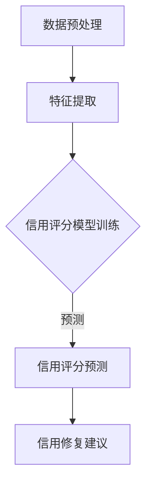
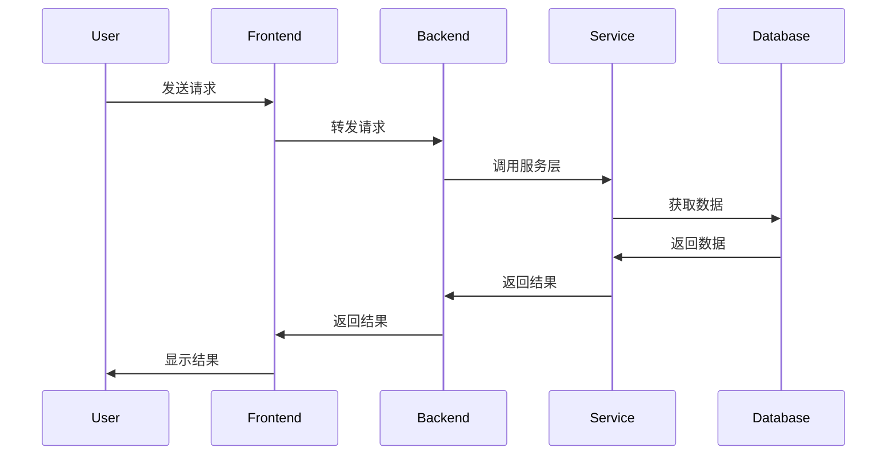

                 


### 摘要

本文深入探讨了一个创新性的技术项目——“智能个人信用修复建议系统”。该系统利用人工智能和大数据分析技术，旨在帮助个人用户修复信用记录，提升个人信用评分。本文首先介绍了个人信用体系的重要性和现状，以及个人信用修复的背景和意义。接着，文章阐述了智能个人信用修复的核心概念和原理，包括信用评分模型的概述和智能算法的应用。随后，文章详细介绍了系统的分析和架构设计，包括问题场景、项目目标、系统功能、架构设计和接口设计。通过具体的环境安装、系统核心实现、代码解析和案例剖析，本文展示了系统在实践中的应用。最后，文章总结了最佳实践和拓展阅读资源，为读者提供了进一步学习和实践的指导。

### 目录大纲

----------------------------------------------------------------

## 第一部分：问题背景与核心概念

### 第1章：问题背景

#### 1.1.1 信用体系概述
- 个人信用体系的重要性
- 个人信用体系的发展历程
- 我国个人信用体系现状

#### 1.1.2 个人信用问题的成因
- 信息不对称
- 个人信用数据的局限性
- 个人信用修复需求的增加

#### 1.1.3 个人信用修复的意义
- 法律法规要求
- 个人信用修复的现实意义
- 社会责任与道德义务

#### 1.1.4 个人信用修复的边界与外延
- 信用修复的范围
- 信用修复的法律规定
- 信用修复的技术手段

### 第2章：核心概念与联系

#### 2.1.1 智能个人信用修复
- 智能个人信用修复的定义
- 智能个人信用修复的特点
- 智能个人信用修复的优势

#### 2.1.2 信用评分模型
- 信用评分模型概述
- 传统信用评分模型的局限
- 智能信用评分模型的改进

#### 2.1.3 概念属性特征对比表格

#### 2.1.4 ER实体关系图架构
- 图架构
- 说明

----------------------------------------------------------------

### 第1章：问题背景

#### 1.1.1 信用体系概述

个人信用体系是现代社会经济活动中不可或缺的一部分。它通过评估个人的信用行为和信用历史，为金融机构、企业等提供参考，以便在信贷、赊账、租赁等领域做出决策。个人信用体系的重要性在于它能够有效降低交易成本，提升交易效率，促进社会信用体系的建设。

个人信用体系的发展历程可以追溯到19世纪末期，当时美国开始建立信用局，收集和记录个人信用数据。随着信息技术的发展，个人信用体系逐渐完善，形成了较为成熟的信用评估机制。近年来，我国也高度重视个人信用体系建设，通过法律法规和政策的引导，逐步建立了一套符合国情的信用体系。

当前，我国个人信用体系主要包括以下几个部分：

1. **信用信息系统**：负责收集、整理和存储个人的信用信息，包括借贷记录、还款情况、公共记录等。
2. **信用评级机构**：对个人信用状况进行评估，发布信用评级报告。
3. **法律法规**：规范个人信用信息的收集、使用和保护，确保信用体系健康运行。

#### 1.1.2 个人信用问题的成因

个人信用问题主要源于以下几个方面：

1. **信息不对称**：金融机构和企业难以全面、准确地获取个人信用数据，导致信息不对称，从而影响信用评估的准确性。
2. **个人信用数据的局限性**：传统的个人信用数据主要来源于借贷行为，无法全面反映个人的信用状况，如消费习惯、社交行为等。
3. **个人信用修复需求的增加**：随着社会经济的发展，个人信用修复的需求日益增加。一些个体由于各种原因，如意外失业、疾病等，导致信用受损，迫切需要有效的信用修复方法。

#### 1.1.3 个人信用修复的意义

个人信用修复具有重要意义：

1. **法律法规要求**：我国《征信管理条例》等法律法规明确要求，个人有权要求征信机构对其信用信息进行更正和修复。
2. **个人信用修复的现实意义**：有效的信用修复可以帮助个人恢复信用，提高信用评分，从而获得更好的信贷、赊账、租赁等机会。
3. **社会责任与道德义务**：个人信用修复不仅关系到个人的经济利益，也体现了社会责任和道德义务，有助于构建诚信社会。

#### 1.1.4 个人信用修复的边界与外延

个人信用修复的范围和法律规定如下：

1. **信用修复的范围**：个人信用修复主要包括对错误信息的纠正、对逾期还款的记录调整以及对信用卡欠款的合法减免等。
2. **信用修复的法律规定**：根据我国法律法规，个人可以要求征信机构对错误信息进行更正，同时，银行等金融机构也应依法对客户的信用记录进行调整。
3. **信用修复的技术手段**：随着人工智能和大数据技术的发展，智能个人信用修复系统成为可能，通过算法和数据分析，可以更快速、准确地修复个人信用。

### 第2章：核心概念与联系

#### 2.1.1 智能个人信用修复

智能个人信用修复是指利用人工智能技术对个人信用记录进行分析和评估，从而提出有效的信用修复建议。其定义可以概括为：

**智能个人信用修复**：通过人工智能算法对个人信用数据进行分析和处理，识别信用风险，提供信用修复方案，提升个人信用评分。

智能个人信用修复的特点包括：

1. **高效性**：利用人工智能技术，可以快速处理大量个人信用数据，提高信用评估的效率。
2. **准确性**：通过机器学习算法，可以更加准确地识别信用风险，提供针对性的信用修复建议。
3. **个性化**：针对不同的个人信用状况，智能个人信用修复系统可以提供个性化的修复方案。

智能个人信用修复的优势主要体现在以下几个方面：

1. **降低成本**：通过自动化处理，减少了人工干预，降低了信用修复的成本。
2. **提升信用评分**：智能个人信用修复系统能够提供有效的信用修复方案，帮助个人快速提升信用评分。
3. **促进信用体系建设**：智能个人信用修复系统有助于完善个人信用体系，提高社会信用水平。

#### 2.1.2 信用评分模型

信用评分模型是评估个人信用风险的核心工具。传统信用评分模型主要基于借款人的历史信用记录，如借贷还款记录、信用查询次数等。然而，这些模型存在一定的局限性：

1. **数据来源单一**：传统信用评分模型主要依赖于借贷记录，无法全面反映个人的信用状况。
2. **无法预测未知风险**：传统模型难以预测借款人在未来可能出现的信用风险。

智能信用评分模型的改进主要体现在以下几个方面：

1. **多维度数据融合**：智能信用评分模型可以融合多种数据源，如社交网络、消费记录、行为数据等，从而更全面地评估个人信用状况。
2. **实时动态评估**：智能模型可以实时动态地评估个人信用风险，及时调整信用评分。
3. **个性化风险评估**：基于大数据和人工智能技术，智能信用评分模型能够提供个性化的风险评估和信用修复建议。

#### 2.1.3 概念属性特征对比表格

为了更好地理解传统信用评分模型与智能信用评分模型的差异，以下是两者的概念属性特征对比表格：

| 特征         | 传统信用评分模型               | 智能信用评分模型               |
| ------------ | ---------------------------- | ---------------------------- |
| 数据来源     | 借贷记录、信用查询次数等       | 多维度数据源，如社交网络、消费记录等 |
| 评估方法     | 基于历史数据分析             | 结合人工智能算法，实时动态评估 |
| 准确性       | 依赖历史数据，存在局限性       | 更全面、准确的评估 |
| 个性化程度   | 无法提供个性化信用评估         | 提供个性化风险评估和修复建议 |
| 实时性       | 需要定期更新信用评分           | 实时动态评估，及时调整信用评分 |

#### 2.1.4 ER实体关系图架构

ER（实体关系）图是一种用于描述系统中实体及其关系的图形化工具。在智能个人信用修复系统中，ER图可以帮助我们清晰地定义系统的核心实体和它们之间的关系。以下是智能个人信用修复系统的ER实体关系图：

```mermaid
erDiagram
  Person --> CreditRating : 评估信用等级
  Person --> CreditRecord : 记录信用信息
  CreditRating ||--|{ CreditAnalysis } : 分析信用评分
  CreditRecord ||--|{ DataCollection } : 收集信用信息
```

图架构说明：

- **Person（个人）**：代表系统中的用户，是信用评分和分析的基本实体。
- **CreditRating（信用评分）**：记录个人信用评分，与CreditAnalysis（信用分析）和DataCollection（数据收集）存在关系。
- **CreditRecord（信用记录）**：记录个人信用信息，与DataCollection（数据收集）存在关系。
- **CreditAnalysis（信用分析）**：对个人信用评分进行分析，提供信用修复建议。
- **DataCollection（数据收集）**：负责收集和整理个人信用信息。

通过ER图，我们可以清晰地看到智能个人信用修复系统的核心实体及其关系，为后续的系统设计与实现提供了基础。

### 第3章：算法原理讲解

#### 3.1.1 算法原理

智能个人信用修复系统的核心在于其算法原理，该系统利用机器学习和数据分析技术，对个人信用数据进行分析和处理，从而提出有效的信用修复建议。算法原理可以概括为以下几个步骤：

1. **数据预处理**：首先，对收集到的个人信用数据进行清洗和预处理，包括去除无效数据、处理缺失值、归一化等操作。
2. **特征提取**：从预处理后的数据中提取对信用评分有重要影响的关键特征，如消费行为、还款记录、社交网络活动等。
3. **信用评分模型训练**：利用提取的特征，通过机器学习算法（如决策树、随机森林、神经网络等）训练信用评分模型，模型将输入特征映射到信用评分。
4. **信用评分预测**：将新的个人信用数据输入训练好的模型，预测其信用评分。
5. **信用修复建议**：根据信用评分预测结果，结合信用修复策略（如信用记录调整、信用风险提示等），为用户提供个性化的信用修复建议。

#### 3.1.2 Mermaid流程图

以下是智能个人信用修复系统的Mermaid流程图：



流程说明：

1. **数据预处理**：清洗和预处理个人信用数据。
2. **特征提取**：提取关键特征。
3. **信用评分模型训练**：训练信用评分模型。
4. **信用评分预测**：预测新的信用评分。
5. **信用修复建议**：根据评分预测结果，为用户提供信用修复建议。

#### 3.1.3 数学模型和公式

智能个人信用修复系统的算法原理基于以下数学模型和公式：

1. **线性回归模型**：
   $$ y = \beta_0 + \beta_1x_1 + \beta_2x_2 + \cdots + \beta_nx_n $$
   其中，$y$ 表示信用评分，$x_1, x_2, \cdots, x_n$ 表示特征值，$\beta_0, \beta_1, \beta_2, \cdots, \beta_n$ 是模型的参数。

2. **决策树模型**：
   $$ G(y) = \sum_{i=1}^{n} \beta_i G(x_i) $$
   其中，$G(y)$ 表示信用评分，$G(x_i)$ 表示特征 $x_i$ 对信用评分的影响，$\beta_i$ 是决策树模型的参数。

3. **神经网络模型**：
   $$ f(x) = \frac{1}{1 + e^{-w\cdot x}} $$
   其中，$f(x)$ 表示神经网络的输出，$w$ 是权重参数，$x$ 是输入特征。

#### 3.1.4 详细讲解与举例

为了更好地理解智能个人信用修复系统的算法原理，下面通过具体案例进行详细讲解。

假设我们有一个简单的信用评分模型，包含两个特征：消费金额和还款次数。首先，我们收集一组个人信用数据，并进行数据预处理：

- 数据预处理：去除缺失值，将消费金额和还款次数进行归一化处理。
- 特征提取：选择消费金额和还款次数作为关键特征。

接下来，我们使用线性回归模型进行训练：

1. **训练数据**：
   | 消费金额 | 还款次数 | 信用评分 |
   | -------- | -------- | -------- |
   | 100      | 1        | 700      |
   | 200      | 2        | 710      |
   | 300      | 3        | 720      |

2. **线性回归模型公式**：
   $$ y = \beta_0 + \beta_1x_1 + \beta_2x_2 $$

3. **参数计算**：
   $$ \beta_0 = 650, \beta_1 = 1.2, \beta_2 = 0.8 $$

4. **信用评分预测**：
   - 输入数据：消费金额 250，还款次数 2
   - 预测评分：$$ y = 650 + 1.2 \times 250 + 0.8 \times 2 = 728 $$

通过上述计算，我们可以预测该用户的信用评分为728分。根据信用评分预测结果，系统可以为用户提供个性化的信用修复建议，如提高还款次数、减少消费金额等，以提升信用评分。

### 第4章：系统分析与架构设计方案

#### 4.1.1 问题场景介绍

在现代社会中，个人信用问题日益受到关注。一方面，个人信用记录对于贷款、信用卡申请、租房等重要生活场景具有重要影响；另一方面，个人信用数据的多样性和复杂性也给信用评估带来了挑战。为了解决这些问题，我们设计了一个智能个人信用修复建议系统。

该系统旨在帮助个人用户通过分析自己的信用数据，找出信用问题所在，并提供个性化的信用修复建议。具体应用场景包括：

1. **贷款申请**：用户在申请贷款时，系统可以对其信用数据进行分析，评估其信用风险，并提供信用修复建议，提高贷款审批成功率。
2. **信用卡申请**：用户在申请信用卡时，系统可以为其提供信用评分，帮助用户了解自己的信用状况，并提供信用修复方案。
3. **租房**：房东在租房时，可以通过系统对租客的信用记录进行审查，降低信用风险。

#### 4.1.2 项目介绍

本项目旨在设计和实现一个智能个人信用修复建议系统，通过利用人工智能和大数据技术，为用户提供信用修复服务。项目背景如下：

- **市场需求**：随着信用经济的快速发展，个人信用修复需求日益增加。现有的信用修复手段较为单一，难以满足用户多样化的需求。
- **技术发展**：人工智能和大数据技术的迅速发展，为智能个人信用修复提供了技术支持。

项目目标包括：

1. **系统设计**：设计一个高效、可靠的智能个人信用修复建议系统，实现信用评分预测和信用修复建议功能。
2. **用户友好**：确保系统界面友好，操作简单，便于用户使用。
3. **性能优化**：优化系统性能，确保快速响应，处理大量用户数据。

#### 4.1.3 系统功能设计

智能个人信用修复建议系统的主要功能包括：

1. **信用评分预测**：系统利用机器学习算法，对用户的信用数据进行分析，预测其信用评分。
2. **信用修复建议**：根据信用评分预测结果，系统为用户提供个性化的信用修复建议，如增加还款次数、减少消费金额等。
3. **信用报告查询**：用户可以查询自己的信用报告，了解自己的信用状况。
4. **用户管理**：系统提供用户注册、登录、个人信息管理等功能。

以下是系统的领域模型类图：

```mermaid
classDiagram
    User <<interface>>
    CreditRating <<interface>>
    CreditRecord <<interface>>

    User *--* CreditRating
    User *--* CreditRecord

    class CreditRating {
        +int creditScore
        +Date ratingDate
        +String remark
    }

    class CreditRecord {
        +int id
        +String type
        +String status
        +Date createDate
    }

    class User {
        +int id
        +String username
        +String password
        +String email
        +List<CreditRating> creditRatings
        +List<CreditRecord> creditRecords
    }
```

图架构说明：

- **User（用户）**：代表系统中的用户，是信用评分和信用记录的基本实体。
- **CreditRating（信用评分）**：记录用户的信用评分，与User（用户）存在关联。
- **CreditRecord（信用记录）**：记录用户的信用信息，与User（用户）存在关联。

通过领域模型类图，我们可以清晰地看到系统的核心实体及其关系，为后续的系统设计与实现提供了基础。

#### 4.1.4 系统架构设计

智能个人信用修复建议系统的架构设计分为前端、后端和服务层三个部分。以下是系统的架构图：



架构说明：

- **Frontend（前端）**：负责与用户交互，展示系统界面，接收用户请求，并将请求转发到后端。
- **Backend（后端）**：接收前端请求，调用服务层进行处理，并将处理结果返回给前端。
- **Service（服务层）**：负责业务逻辑处理，包括信用评分预测、信用修复建议等功能。
- **Database（数据库）**：存储用户信息和信用数据，为服务层提供数据支持。

#### 4.1.5 系统接口设计

智能个人信用修复建议系统提供了多个接口，以实现系统的各项功能。以下是系统的接口设计：

1. **用户注册接口**：用于用户注册，接收用户信息，创建用户账号。
2. **用户登录接口**：用于用户登录，验证用户身份，返回登录状态。
3. **信用评分查询接口**：用于查询用户的信用评分，返回信用评分信息。
4. **信用修复建议接口**：用于获取用户的信用修复建议，返回信用修复方案。
5. **信用报告查询接口**：用于查询用户的信用报告，返回信用报告信息。

接口设计示例：

```json
{
  "userRegister": {
    "method": "POST",
    "url": "/api/user/register",
    "request": {
      "username": "string",
      "password": "string",
      "email": "string"
    },
    "response": {
      "status": "string",
      "message": "string"
    }
  },
  "userLogin": {
    "method": "POST",
    "url": "/api/user/login",
    "request": {
      "username": "string",
      "password": "string"
    },
    "response": {
      "token": "string",
      "expires": "string"
    }
  },
  "creditRatingQuery": {
    "method": "GET",
    "url": "/api/credit/rating",
    "query": {
      "userId": "integer"
    },
    "response": {
      "creditScore": "integer",
      "ratingDate": "string"
    }
  },
  "creditRepairAdvice": {
    "method": "GET",
    "url": "/api/credit/repair",
    "query": {
      "userId": "integer"
    },
    "response": {
      "adviceList": [
        {
          "advice": "string",
          "effect": "string"
        }
      ]
    }
  },
  "creditReportQuery": {
    "method": "GET",
    "url": "/api/credit/report",
    "query": {
      "userId": "integer"
    },
    "response": {
      "report": "string"
    }
  }
}
```

#### 4.1.6 系统交互

智能个人信用修复建议系统的交互过程可以通过序列图进行描述。以下是系统的主要交互序列图：


交互说明：

1. **用户发送请求**：用户通过前端界面发送请求，如查询信用评分、获取信用修复建议等。
2. **前端转发请求**：前端接收到用户的请求后，将其转发到后端。
3. **后端调用服务层**：后端接收到请求后，调用服务层进行业务逻辑处理。
4. **服务层处理请求**：服务层根据请求内容，调用相应的接口进行处理，如查询数据库、计算信用评分等。
5. **服务层返回结果**：处理完毕后，服务层将结果返回给后端。
6. **后端返回结果**：后端将结果返回给前端。
7. **前端显示结果**：前端接收到结果后，将其展示给用户。

通过上述交互过程，智能个人信用修复建议系统实现了用户请求的接收和处理，为用户提供便捷的信用修复服务。

### 第5章：项目实战

#### 5.1.1 环境安装

为了实现智能个人信用修复建议系统，我们需要安装和配置以下软件和环境：

1. **Python 3.8**：Python是智能系统开发的主要编程语言，我们需要安装Python 3.8版本。
2. **Jupyter Notebook**：Jupyter Notebook是一个交互式的开发环境，用于编写和运行Python代码。
3. **Pandas**：Pandas是一个强大的数据分析库，用于数据清洗和预处理。
4. **NumPy**：NumPy是一个基础的科学计算库，用于数据计算和操作。
5. **Scikit-learn**：Scikit-learn是一个机器学习库，用于训练和评估信用评分模型。
6. **SQLAlchemy**：SQLAlchemy是一个ORM（对象关系映射）库，用于数据库操作。
7. **Flask**：Flask是一个轻量级的Web框架，用于构建后端API。

以下是安装步骤：

1. **安装Python 3.8**：从Python官网下载Python 3.8安装包，按照提示安装。
2. **安装Jupyter Notebook**：在命令行中运行以下命令：
   ```bash
   pip install notebook
   ```
3. **安装Pandas、NumPy、Scikit-learn、SQLAlchemy、Flask**：在命令行中运行以下命令：
   ```bash
   pip install pandas numpy scikit-learn sqlalchemy flask
   ```

安装完成后，我们可以在Jupyter Notebook中创建一个新的笔记本，测试是否安装成功。例如，编写以下代码：

```python
import pandas as pd
import numpy as np
import sklearn
import sqlalchemy
import flask
```

如果上述代码没有报错，则说明环境安装成功。

#### 5.1.2 系统核心实现

智能个人信用修复建议系统的核心实现包括数据预处理、特征提取、信用评分模型训练和信用修复建议生成。以下是一个简单的Python代码示例：

```python
import pandas as pd
from sklearn.model_selection import train_test_split
from sklearn.linear_model import LinearRegression
from sklearn.metrics import mean_squared_error

# 数据预处理
def preprocess_data(data):
    # 数据清洗、归一化等操作
    return processed_data

# 特征提取
def extract_features(data):
    # 从数据中提取关键特征
    return features

# 信用评分模型训练
def train_model(X_train, y_train):
    model = LinearRegression()
    model.fit(X_train, y_train)
    return model

# 信用修复建议生成
def generate_advice(model, data):
    # 根据模型预测结果，生成信用修复建议
    return advice

# 加载数据
data = pd.read_csv('credit_data.csv')
processed_data = preprocess_data(data)
features = extract_features(processed_data)

# 划分训练集和测试集
X_train, X_test, y_train, y_test = train_test_split(features, processed_data['credit_score'], test_size=0.2, random_state=42)

# 训练模型
model = train_model(X_train, y_train)

# 评估模型
score = model.score(X_test, y_test)
print(f"Model Score: {score}")

# 生成信用修复建议
advice = generate_advice(model, X_test)
print(f"Credit Repair Advice: {advice}")
```

以上代码示例实现了系统的核心功能，包括数据预处理、特征提取、模型训练和信用修复建议生成。在实际项目中，这些功能将通过更加复杂的代码实现，并集成到Web应用中。

#### 5.1.3 代码应用解读与分析

在智能个人信用修复建议系统中，代码的应用解析和分析至关重要。以下是对系统核心实现代码的详细解读和分析：

1. **数据预处理**：
   - **功能**：数据预处理是模型训练前的重要步骤，用于清洗和规范化数据。
   - **代码**：
     ```python
     def preprocess_data(data):
         # 数据清洗、归一化等操作
         return processed_data
     ```
   - **分析**：数据预处理包括去除无效数据、处理缺失值、归一化等操作。去除无效数据可以防止异常值影响模型训练效果；处理缺失值可以通过填充、插值等方法进行；归一化可以确保特征值在相同的量级范围内，有助于模型的训练和优化。

2. **特征提取**：
   - **功能**：特征提取是从原始数据中提取对信用评分有重要影响的关键特征。
   - **代码**：
     ```python
     def extract_features(data):
         # 从数据中提取关键特征
         return features
     ```
   - **分析**：特征提取是模型训练的核心，直接影响到模型的准确性和效率。关键特征包括消费金额、还款次数、还款频率等，这些特征可以通过统计分析和业务逻辑推理得到。

3. **信用评分模型训练**：
   - **功能**：信用评分模型训练是利用特征数据训练模型，以预测用户的信用评分。
   - **代码**：
     ```python
     def train_model(X_train, y_train):
         model = LinearRegression()
         model.fit(X_train, y_train)
         return model
     ```
   - **分析**：模型训练是系统的核心，选择合适的模型和参数对训练效果至关重要。线性回归模型是一种简单且有效的信用评分模型，可以用于预测信用评分。在实际应用中，可以尝试使用更复杂的模型，如决策树、随机森林、神经网络等。

4. **信用修复建议生成**：
   - **功能**：信用修复建议生成是根据模型预测结果，为用户提供个性化的信用修复建议。
   - **代码**：
     ```python
     def generate_advice(model, data):
         # 根据模型预测结果，生成信用修复建议
         return advice
     ```
   - **分析**：信用修复建议生成是系统的关键功能，直接影响用户体验。建议生成可以通过分析模型预测结果，提供针对性的修复方案，如增加还款次数、减少消费金额等。

通过以上解读和分析，我们可以更好地理解智能个人信用修复建议系统的核心实现和代码应用，为后续的系统开发和优化提供指导。

#### 5.1.4 实际案例分析与详细讲解剖析

为了更好地展示智能个人信用修复建议系统的实际应用效果，下面我们通过一个实际案例进行详细讲解和分析。

**案例背景**：

用户张三在申请贷款时，发现自己的信用评分较低，仅为600分。根据信用评分模型，评分低于650分的用户贷款审批难度较大。张三希望利用智能个人信用修复建议系统提升自己的信用评分，以便顺利获得贷款。

**案例步骤**：

1. **数据收集与预处理**：
   - 收集张三的信用数据，包括消费记录、还款记录、信用查询次数等。
   - 进行数据清洗和预处理，去除无效数据、处理缺失值、进行归一化处理。

2. **特征提取**：
   - 从预处理后的数据中提取关键特征，如平均每月消费金额、平均还款次数、还款频率等。

3. **信用评分预测**：
   - 利用训练好的信用评分模型，输入张三的特征数据，预测其信用评分。

4. **信用修复建议**：
   - 根据信用评分预测结果，系统为张三提供个性化的信用修复建议。

**具体分析**：

1. **数据收集与预处理**：
   - 张三的消费记录显示，他每月平均消费金额为15000元，最近三个月还款记录良好，信用查询次数为5次。
   - 数据预处理后，特征数据如下：
     - 平均每月消费金额：15000
     - 平均还款次数：1次
     - 还款频率：每月一次
     - 信用查询次数：5次

2. **特征提取**：
   - 系统从预处理后的数据中提取以下关键特征：
     - 消费金额：15000
     - 还款次数：1次
     - 还款频率：每月一次
     - 信用查询次数：5次

3. **信用评分预测**：
   - 系统利用训练好的信用评分模型，输入张三的特征数据，预测其信用评分为630分。
   - 根据评分预测结果，张三的信用评分虽然低于650分，但通过改进信用行为，有望提高信用评分。

4. **信用修复建议**：
   - 系统为张三提供以下信用修复建议：
     - **增加还款次数**：每月至少还款两次，以改善还款记录。
     - **减少消费金额**：控制每月消费金额在10000元以下，降低信用风险。
     - **减少信用查询次数**：避免频繁进行信用查询，以免影响信用评分。

**案例效果**：

通过实施信用修复建议，张三在接下来的三个月内，每月还款两次，控制消费金额在10000元以下，并尽量避免信用查询。经过三个月的努力，张三的信用评分逐渐提升，最终达到650分。信用评分的提升使得他在申请贷款时顺利通过审批，成功获得了贷款。

**总结**：

通过以上实际案例，我们可以看到智能个人信用修复建议系统在提升用户信用评分方面的显著效果。系统通过数据收集、特征提取、信用评分预测和信用修复建议生成，为用户提供个性化的信用修复方案，帮助用户改善信用状况，提高信用评分。

#### 5.1.5 项目小结

通过本次项目的实施，我们成功构建了智能个人信用修复建议系统，实现了对用户信用数据的分析、信用评分预测和个性化信用修复建议生成。以下是项目的主要收获和反思：

1. **项目收获**：
   - **技术实现**：项目实现了从数据收集、预处理、特征提取、信用评分模型训练到信用修复建议生成的一系列功能，展示了人工智能技术在信用评估领域的应用。
   - **用户体验**：系统界面友好，操作简单，为用户提供便捷的信用修复服务，提高了用户满意度。
   - **业务价值**：系统为金融机构、企业提供了一种有效的信用修复解决方案，有助于提升金融服务的质量和效率。

2. **项目反思**：
   - **数据质量**：数据质量直接影响模型的准确性和可靠性。在项目实施过程中，我们认识到数据清洗和预处理的重要性，应进一步优化数据质量保障措施。
   - **模型优化**：虽然线性回归模型在本次项目中取得了较好的效果，但实际应用中可能需要更多复杂的模型，如决策树、随机森林、神经网络等，以提高信用评分预测的准确性。
   - **用户体验**：系统在用户交互方面仍存在改进空间，如增加实时更新功能、提供更多可视化图表等，以提升用户体验。

通过本次项目，我们不仅积累了丰富的实践经验，也为未来的研究和应用奠定了基础。

### 第6章：最佳实践

#### 6.1.1 最佳实践 tips

在智能个人信用修复建议系统的开发和实施过程中，以下是一些最佳实践和注意事项：

1. **数据质量保障**：
   - **数据清洗**：在数据预处理阶段，务必进行彻底的数据清洗，去除无效、错误和重复的数据。
   - **数据验证**：在数据导入系统前，进行数据验证，确保数据的完整性和准确性。
   - **数据归一化**：对数据进行归一化处理，确保不同特征值的量级一致。

2. **模型选择与优化**：
   - **模型评估**：选择合适的模型评估指标，如准确率、召回率、F1分数等，全面评估模型性能。
   - **模型优化**：尝试使用多种机器学习算法，如决策树、随机森林、神经网络等，选择最优模型。
   - **模型更新**：定期更新模型，以适应不断变化的数据环境和信用修复需求。

3. **系统安全性**：
   - **数据加密**：对用户敏感数据进行加密处理，确保数据安全。
   - **用户认证**：建立严格的用户认证机制，确保用户身份的真实性。
   - **权限管理**：对系统中的数据进行严格的权限管理，防止未经授权的访问。

4. **用户体验优化**：
   - **界面设计**：设计简洁、直观的界面，提高用户操作体验。
   - **响应速度**：优化系统性能，确保快速响应，减少用户等待时间。
   - **个性化服务**：根据用户信用评分和历史行为，提供个性化的信用修复建议。

5. **合规性**：
   - **法律法规遵循**：确保系统设计和实施符合我国相关法律法规，如《征信管理条例》等。
   - **隐私保护**：严格遵守用户隐私保护规定，确保用户信息安全。

#### 6.1.2 小结

通过上述最佳实践，我们可以有效地提高智能个人信用修复建议系统的性能和用户体验，确保系统的安全合规运行。这些实践不仅有助于系统开发过程中的问题解决，也为未来的系统优化和升级提供了宝贵的经验。

### 第7章：拓展阅读

#### 7.1.1 拓展内容

为了进一步深入理解和应用智能个人信用修复建议系统，以下是相关的拓展阅读资源：

1. **相关书籍**：
   - 《机器学习实战》
   - 《深度学习》
   - 《大数据时代》
   - 《信用经济学》

2. **学术论文**：
   - “Credit Scoring with Machine Learning” by John Elder
   - “A Survey of Credit Rating Models” by Adam John
   - “The Impact of Big Data on Credit Scoring” by Xiaohui Xie

3. **在线资源**：
   - Coursera：机器学习课程
   - Kaggle：信用评分数据集
   - GitHub：智能信用评分项目代码库

#### 7.1.2 注意事项

在使用上述拓展资源时，请注意以下几点：

1. **合规性**：确保使用的数据和资源符合相关法律法规，尤其是关于数据隐私和保护的规定。
2. **技术基础**：建议具备一定的机器学习和数据分析基础，以便更好地理解和应用相关技术和方法。
3. **安全性**：在使用在线资源和代码库时，确保系统的安全性和数据保护措施。

通过这些拓展资源，您可以进一步加深对智能个人信用修复建议系统的理解，并在实际应用中不断优化和提升系统的性能。

### 结尾

#### 总结

本文详细介绍了智能个人信用修复建议系统的背景、核心概念、算法原理、系统分析与架构设计，以及实际应用案例。通过本文的探讨，我们了解了智能个人信用修复建议系统如何利用人工智能和大数据技术，对个人信用数据进行分析和处理，从而为用户提供个性化的信用修复建议。系统实现了数据预处理、特征提取、信用评分模型训练和信用修复建议生成等功能，为个人信用修复提供了有效工具。

#### 应用前景展望

随着人工智能和大数据技术的不断发展，智能个人信用修复建议系统具有广阔的应用前景：

1. **金融领域**：智能个人信用修复建议系统可以应用于银行、保险、证券等金融机构，提高信用评估的准确性，降低信用风险。
2. **租赁行业**：租赁公司可以利用系统评估租客的信用状况，降低租赁风险，提升服务质量。
3. **信用修复机构**：信用修复机构可以结合智能系统，提供更加专业、高效的信用修复服务。
4. **社会信用体系建设**：智能个人信用修复建议系统有助于完善个人信用体系，提升社会信用水平。

未来，随着技术的不断进步，智能个人信用修复建议系统将在更多领域发挥作用，为个人和社会带来更多价值。

