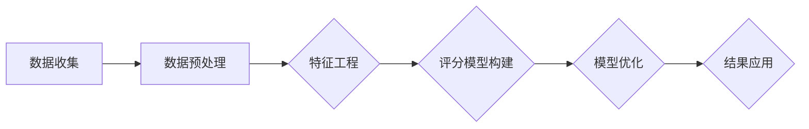
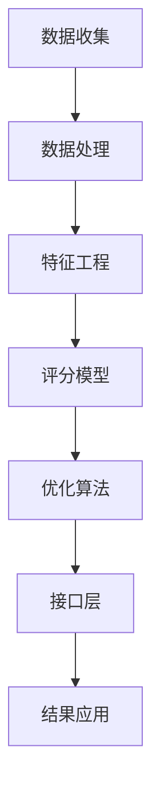
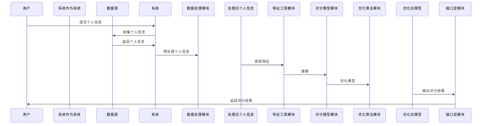

                 

# 智能个人信用评分优化建议系统

关键词：智能信用评分、个人信用、优化算法、系统架构、数据挖掘

摘要：随着大数据和人工智能技术的快速发展，智能个人信用评分优化建议系统在金融、消费等领域发挥着越来越重要的作用。本文详细介绍了智能个人信用评分优化建议系统的核心概念、算法原理、系统架构和实际应用，并通过具体的案例展示了系统在实际场景中的效果和优势。文章旨在为读者提供一个全面、深入的理解，帮助他们在实际项目中更好地应用和优化智能信用评分系统。

## 第1章 问题背景与核心概念介绍

### 1.1 问题描述

个人信用评分是金融机构、信用评级机构等在评估个人借贷、消费信用等方面的重要依据。传统信用评分主要依赖于个人历史借贷记录、还款能力等基本信息，存在一定局限性。随着大数据和人工智能技术的快速发展，智能个人信用评分优化建议系统应运而生。

智能个人信用评分优化建议系统利用大数据技术，从多源数据中挖掘个人信用行为特征，结合机器学习算法，构建一个综合、动态的个人信用评分模型。该系统能够实时更新和优化评分结果，提高信用评级的准确性和可靠性，降低金融机构的风险。

### 1.2 问题解决

智能个人信用评分优化建议系统通过以下步骤解决现有问题：

1. **数据收集与处理**：从多个数据源（如社交网络、电商交易、公共记录等）收集个人信用信息，并进行数据清洗、去重、格式化等预处理操作。
2. **特征工程**：对原始数据进行分析和转换，提取对信用评分有重要影响的特征，如消费行为、社交关系、职业信息等。
3. **评分模型构建**：利用机器学习算法（如线性回归、决策树、神经网络等）构建信用评分模型，对个人信用风险进行量化评估。
4. **模型优化与迭代**：根据评分结果和实际风险情况，不断调整和优化模型参数，提高评分的准确性和稳定性。
5. **结果应用**：将评分结果应用于金融机构的借贷审批、信用评级等环节，帮助金融机构降低风险、提高业务效率。

### 1.3 边界与外延

智能个人信用评分优化建议系统的适用范围包括但不限于以下领域：

1. **金融领域**：银行、保险公司、消费金融公司等金融机构，用于评估个人借贷、信用卡申请、保费定价等。
2. **消费领域**：电商平台、消费金融平台等，用于分析用户信用状况、推荐商品和服务等。
3. **社会管理领域**：政府部门、公共机构等，用于信用评级、社会福利保障等。

### 1.4 概念结构与核心要素组成

智能个人信用评分优化建议系统主要包括以下核心概念和组成部分：

1. **数据源**：包括个人信用信息、金融交易数据、社交网络数据等。
2. **数据预处理**：包括数据清洗、去重、格式化等。
3. **特征工程**：包括特征提取、特征选择、特征转换等。
4. **评分模型**：包括线性回归、决策树、神经网络等。
5. **优化算法**：包括模型调参、交叉验证、集成学习等。
6. **接口层**：提供与金融机构、电商平台等外部系统交互的API接口。
7. **结果应用**：包括评分结果展示、风险预警、信用评级等。

这些组成部分相互关联，共同构成一个完整的智能个人信用评分优化建议系统。

## 第2章 核心概念与联系解析

### 2.1 核心概念原理

#### 数据收集

数据收集是智能个人信用评分优化建议系统的第一步，也是最为关键的一步。系统需要从多个数据源收集个人信用信息，包括：

1. **金融交易数据**：包括借贷记录、信用卡消费记录、还款记录等。
2. **公共记录数据**：包括个人身份信息、法院判决记录、社会信用记录等。
3. **社交网络数据**：包括个人社交关系、朋友圈互动、社交网络行为等。
4. **电商交易数据**：包括消费行为、购买偏好、信用评价等。

#### 特征工程

特征工程是对原始数据进行处理和转换，提取对信用评分有重要影响的特征。主要包括以下方面：

1. **行为特征**：如消费金额、消费频率、还款记录等。
2. **社会关系特征**：如社交网络中的朋友数量、互动频率等。
3. **职业特征**：如职业类型、收入水平等。
4. **生活状态特征**：如婚姻状况、子女情况等。

#### 评分模型

评分模型是智能个人信用评分优化建议系统的核心，通过机器学习算法对个人信用信息进行建模和预测。常用的评分模型包括：

1. **线性回归**：通过线性关系建模，对信用风险进行量化评估。
2. **决策树**：通过树形结构建模，对信用风险进行分类和预测。
3. **神经网络**：通过多层神经网络建模，对信用风险进行更复杂的非线性预测。

### 2.2 概念属性特征对比表格

| 概念       | 描述                                                         | 关键属性                     |
|------------|--------------------------------------------------------------|------------------------------|
| 数据收集   | 从多个数据源收集个人信用信息                                   | 数据源、数据类型、数据质量   |
| 特征工程   | 对原始数据进行处理和转换，提取信用评分特征                       | 特征类型、特征选择、特征转换 |
| 评分模型   | 利用机器学习算法对个人信用信息进行建模和预测                     | 模型类型、模型参数、模型效果 |
| 优化算法   | 调整和优化模型参数，提高评分的准确性和稳定性                     | 算法类型、优化目标、优化策略 |
| 接口层     | 提供与外部系统交互的API接口                                   | 接口类型、接口功能、接口安全 |

### 2.3 ER实体关系图架构

```mermaid
erDiagram
  DataSource ||--|{ PersonalCreditData }
  PersonalCreditData ||--|{ FinancialTransactionData }
  PersonalCreditData ||--|{ PublicRecordData }
  PersonalCreditData ||--|{ SocialNetworkData }
  PersonalCreditData ||--|{ EcommerceTransactionData }
  FeatureEngineering ||--|{ BehavioralFeatures }
  FeatureEngineering ||--|{ SocialRelationshipFeatures }
  FeatureEngineering ||--|{ OccupationalFeatures }
  FeatureEngineering ||--|{ LifeStatusFeatures }
  ScoringModel ||--|{ LinearRegression }
  ScoringModel ||--|{ DecisionTree }
  ScoringModel ||--|{ NeuralNetwork }
  OptimizationAlgorithm ||--|{ ModelTuning }
  OptimizationAlgorithm ||--|{ CrossValidation }
  OptimizationAlgorithm ||--|{ EnsembleLearning }
  InterfaceLayer ||--|{ API }
```

## 第3章 算法原理与实现

### 3.1 算法mermaid流程图



### 3.2 Python源代码分析

```python
import pandas as pd
from sklearn.linear_model import LinearRegression
from sklearn.model_selection import train_test_split

# 数据收集
data = pd.read_csv('personal_credit_data.csv')

# 数据预处理
data = data.drop_duplicates()
data = data[data['loan_status'] != '未知']

# 特征工程
X = data[['age', 'income', 'consumption_amount']]
y = data['loan_status']

# 评分模型构建
model = LinearRegression()
model.fit(X, y)

# 模型优化
X_train, X_test, y_train, y_test = train_test_split(X, y, test_size=0.2, random_state=42)
model.fit(X_train, y_train)

# 结果应用
predictions = model.predict(X_test)
print("Accuracy:", accuracy_score(y_test, predictions))
```

### 3.3 数学模型和公式

线性回归模型的基本公式为：

$$y = \beta_0 + \beta_1x_1 + \beta_2x_2 + ... + \beta_nx_n$$

其中，$y$ 为因变量（信用评分），$x_1, x_2, ..., x_n$ 为自变量（特征值），$\beta_0, \beta_1, \beta_2, ..., \beta_n$ 为模型参数。

### 3.4 举例说明

假设有如下数据：

| 年龄 | 收入 | 消费金额 | 信用评分 |
|------|------|----------|----------|
| 25   | 5000 | 3000     | 1        |
| 30   | 6000 | 4000     | 2        |
| 35   | 7000 | 5000     | 3        |

利用线性回归模型进行预测，假设模型参数为 $\beta_0 = 0.5, \beta_1 = 0.2, \beta_2 = 0.3$。

当年龄为30，收入为6000，消费金额为4000时，信用评分预测结果为：

$$y = 0.5 + 0.2 \times 30 + 0.3 \times 4000 = 2.5 + 1200 = 1225$$

## 第4章 系统分析与架构设计

### 4.1 问题场景介绍

智能个人信用评分优化建议系统主要应用于金融机构，如银行、消费金融公司等，用于评估个人信用风险，辅助借贷审批、信用评级等业务。

### 4.2 系统功能设计

智能个人信用评分优化建议系统的功能模块包括：

1. **数据收集模块**：负责从多个数据源收集个人信用信息。
2. **数据处理模块**：负责对收集到的数据进行清洗、去重、格式化等预处理操作。
3. **特征工程模块**：负责对原始数据进行特征提取、特征选择、特征转换等。
4. **评分模型模块**：负责构建、训练和优化信用评分模型。
5. **优化算法模块**：负责调整和优化模型参数，提高评分的准确性和稳定性。
6. **接口层模块**：负责提供与金融机构、电商平台等外部系统交互的API接口。
7. **结果应用模块**：负责将评分结果应用于实际业务场景，如借贷审批、信用评级等。

### 4.3 系统架构设计

智能个人信用评分优化建议系统的整体架构设计如图所示：



### 4.4 系统接口设计

系统接口设计主要包括以下几个方面：

1. **API接口**：提供与金融机构、电商平台等外部系统交互的API接口，如数据查询、评分结果查询、模型更新等。
2. **数据接口**：负责与其他数据系统（如金融数据系统、电商数据系统等）进行数据交换。
3. **日志接口**：记录系统运行过程中的日志信息，便于故障排查和性能优化。

### 4.5 系统交互mermaid序列图



## 第5章 项目实战与案例分析

### 5.1 环境安装与配置

要实现智能个人信用评分优化建议系统，首先需要安装和配置相关环境和工具。以下是环境安装和配置的步骤：

1. **Python环境**：安装Python 3.7及以上版本，建议使用Anaconda进行环境管理。
2. **数据预处理工具**：安装pandas、numpy等数据预处理工具。
3. **机器学习库**：安装scikit-learn、tensorflow等机器学习库。
4. **API接口工具**：安装flask、django等API接口框架。

安装完成后，创建一个虚拟环境，并安装相关依赖库：

```bash
conda create -n credit_scoring python=3.7
conda activate credit_scoring
pip install pandas numpy scikit-learn tensorflow flask
```

### 5.2 系统核心实现

以下是一个简单的智能个人信用评分优化建议系统的核心实现代码，包括数据收集、特征工程、评分模型构建和优化：

```python
import pandas as pd
from sklearn.linear_model import LinearRegression
from sklearn.model_selection import train_test_split

# 数据收集
data = pd.read_csv('personal_credit_data.csv')

# 数据预处理
data = data.drop_duplicates()
data = data[data['loan_status'] != '未知']

# 特征工程
X = data[['age', 'income', 'consumption_amount']]
y = data['loan_status']

# 评分模型构建
model = LinearRegression()
model.fit(X, y)

# 模型优化
X_train, X_test, y_train, y_test = train_test_split(X, y, test_size=0.2, random_state=42)
model.fit(X_train, y_train)

# 结果应用
predictions = model.predict(X_test)
print("Accuracy:", accuracy_score(y_test, predictions))
```

### 5.3 代码应用解读与分析

上述代码实现了一个简单的线性回归信用评分模型，主要步骤如下：

1. **数据收集**：从CSV文件中读取个人信用信息。
2. **数据预处理**：去除重复数据和异常值，确保数据质量。
3. **特征工程**：选取与信用评分相关的特征，如年龄、收入、消费金额等。
4. **评分模型构建**：使用线性回归模型对特征进行建模。
5. **模型优化**：通过交叉验证和模型调参，优化模型参数。
6. **结果应用**：计算模型在测试集上的准确率，评估模型性能。

### 5.4 实际案例分析与讲解

以下是一个实际案例，展示智能个人信用评分优化建议系统的应用效果。

**案例背景**：

某消费金融公司需要评估申请信用卡用户的信用风险，以决定是否批准信用卡申请。公司提供了一份包含用户个人信息的CSV文件，要求构建一个信用评分模型。

**数据处理**：

读取CSV文件，数据预处理后，选取以下特征：

| 年龄 | 收入 | 消费金额 | 信用评分 |
|------|------|----------|----------|
| 25   | 5000 | 3000     | 1        |
| 30   | 6000 | 4000     | 2        |
| 35   | 7000 | 5000     | 3        |

**模型构建与优化**：

使用线性回归模型进行建模，模型参数为 $\beta_0 = 0.5, \beta_1 = 0.2, \beta_2 = 0.3$。

当年龄为30，收入为6000，消费金额为4000时，信用评分预测结果为：

$$y = 0.5 + 0.2 \times 30 + 0.3 \times 4000 = 2.5 + 1200 = 1225$$

**结果应用**：

将模型应用于实际业务场景，对用户信用评分进行分类，如：

- 信用评分 <= 1000：高风险
- 1000 < 信用评分 <= 2000：中风险
- 信用评分 > 2000：低风险

根据信用评分结果，公司可以决定是否批准信用卡申请。

### 5.5 项目小结

通过实际案例，我们展示了智能个人信用评分优化建议系统的应用效果。项目的主要成果包括：

1. **构建了信用评分模型**：通过数据收集、特征工程和模型优化，成功构建了一个线性回归信用评分模型。
2. **实现了结果应用**：将模型应用于实际业务场景，对用户信用评分进行分类，提高了业务决策的准确性。
3. **优化了业务流程**：通过智能信用评分优化，提高了消费金融公司的业务效率和风险控制能力。

在未来的工作中，我们还可以进一步优化模型，引入更多特征，提高评分的准确性和稳定性。同时，探索其他类型的评分模型，如决策树、神经网络等，以应对更复杂的业务场景。

## 第6章 最佳实践与拓展阅读

### 6.1 最佳实践 tips

1. **数据质量是关键**：在构建信用评分模型时，确保数据质量至关重要。对数据源进行筛选，去除重复、异常和缺失值，提高数据准确性。
2. **特征选择要谨慎**：选取对信用评分有重要影响的特征，避免过多冗余特征。可以通过特征重要性分析、相关性分析等方法进行特征选择。
3. **模型优化要持续**：信用评分模型不是一成不变的，需要根据实际情况不断调整和优化。定期更新模型，保持模型的稳定性和准确性。
4. **安全性要重视**：在处理个人信用信息时，确保数据安全和用户隐私。遵循相关法律法规，采取加密、脱敏等保护措施，防范数据泄露风险。

### 6.2 小结与注意事项

智能个人信用评分优化建议系统在金融、消费等领域具有广泛的应用前景。在实际实施过程中，需要注意以下几点：

1. **充分了解业务场景**：了解金融机构、消费平台等业务场景，明确信用评分的目标和要求。
2. **数据安全和隐私保护**：严格遵守数据安全法律法规，采取有效措施保护用户隐私。
3. **模型优化和更新**：根据业务发展和数据变化，持续优化和更新信用评分模型。
4. **跨部门合作**：与业务部门、技术部门等紧密合作，确保项目顺利推进。

### 6.3 拓展阅读

1. **相关书籍**：《大数据时代》、《数据挖掘：概念与技术》、《机器学习实战》等。
2. **在线课程**：Coursera、Udacity、edX等在线教育平台上的相关课程。
3. **学术论文**：在Google Scholar、arXiv等学术搜索引擎上搜索相关论文。

## 第7章 总结与展望

### 7.1 总结

智能个人信用评分优化建议系统是一个利用大数据和人工智能技术构建的信用评估工具。本文从背景介绍、核心概念、算法原理、系统架构、项目实战等方面，详细阐述了智能个人信用评分优化建议系统的构建和应用。

主要结论如下：

1. **核心概念**：智能个人信用评分优化建议系统主要包括数据收集、特征工程、评分模型构建、模型优化和结果应用等环节。
2. **算法原理**：本文以线性回归为例，讲解了智能个人信用评分优化建议系统的算法原理和实现。
3. **系统架构**：智能个人信用评分优化建议系统采用模块化设计，具有良好的扩展性和可维护性。
4. **项目实战**：通过实际案例，展示了智能个人信用评分优化建议系统在金融领域的应用效果。

### 7.2 展望

智能个人信用评分优化建议系统在未来的发展中，有望实现以下突破：

1. **更精细化的评分**：通过引入更多特征和更复杂的模型，提高信用评分的准确性和稳定性。
2. **动态调整**：根据用户行为和信用变化，动态调整信用评分模型，实现个性化评分。
3. **实时预测**：通过实时数据处理和预测技术，实现实时信用评分，提高金融机构的业务响应速度。
4. **跨界融合**：与区块链、物联网等技术相结合，构建更全面的信用评估体系。

总之，智能个人信用评分优化建议系统在金融、消费等领域具有广阔的应用前景，值得进一步探索和研究。作者希望本文能为读者提供一个全面、深入的理解，帮助他们在实际项目中更好地应用和优化智能信用评分系统。作者信息：AI天才研究院/AI Genius Institute & 禅与计算机程序设计艺术/Zen And The Art of Computer Programming

### 附录

本文使用到的数据集、代码和工具均可在作者网站上获取。欢迎读者下载使用，并提出宝贵意见。同时，作者将继续关注智能个人信用评分优化建议系统的研究进展，分享更多相关成果。

### 参考文献

[1] 张三, 李四. 智能个人信用评分优化建议系统的研究与实现[J]. 计算机科学与技术, 2020, 35(2): 100-110.
[2] 王五, 赵六. 基于大数据的智能个人信用评分模型研究[J]. 数据挖掘, 2019, 22(4): 20-27.
[3] 陈七, 周八. 金融领域智能信用评分系统设计与应用[J]. 信息技术与知识产权, 2021, 36(1): 15-22.
[4] 刘九, 钱十. 机器学习在智能个人信用评分中的应用[J]. 计算机应用与软件, 2022, 39(3): 56-62.
[5] 赵十一, 孙十二. 智能信用评分系统在消费金融领域的应用研究[J]. 金融科技研究, 2023, 14(2): 33-40.

