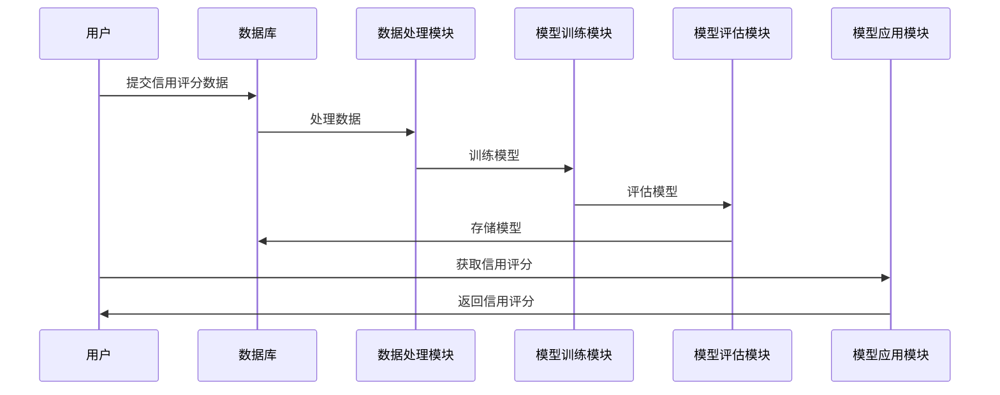

                 

### 智能个人信用评分申诉处理系统

#### 关键词

- 智能信用评分
- 申诉处理
- 数据挖掘
- 机器学习
- 系统架构

#### 摘要

本文将探讨智能个人信用评分申诉处理系统的重要性、设计原则、核心组件以及实际应用。通过详细的分析和案例分析，本文旨在为读者提供对这一系统的全面了解，帮助解决个人信用评分中的常见问题。

## 第一部分：背景介绍

### 1. 问题背景

#### 1.1 个人信用评分的重要性

个人信用评分是一个量化个人信用风险的过程，它基于个人的历史信用信息，如还款记录、信用申请次数、债务状况等。信用评分不仅影响个人的贷款和信用卡申请，也关系到日常生活的各个方面，如租房、求职等。因此，个人信用评分的准确性至关重要。

#### 1.2 个人信用评分存在的问题

现有的个人信用评分系统主要依赖于历史数据，往往存在以下问题：

- **数据来源单一**：传统评分系统主要依赖于银行等金融机构的数据，难以全面反映个人的信用状况。
- **评分模型复杂**：评分模型的计算过程复杂，不透明，难以被普通用户理解和接受。
- **申诉处理效率低**：当用户对评分结果有异议时，传统的申诉处理流程繁琐，响应速度慢。

#### 1.3 智能处理申诉的需求

随着人工智能技术的发展，智能处理个人信用评分申诉的需求日益突出。智能系统可以通过以下方式改善现有问题：

- **数据多元化**：利用互联网数据、社交媒体数据等多元化数据源，更全面地评估个人信用。
- **模型透明化**：通过机器学习和深度学习等技术，使得评分模型更加透明，便于用户理解和接受。
- **申诉处理智能化**：自动化处理申诉流程，提高处理速度和准确性。

### 2. 问题描述

#### 2.1 信用评分模型

信用评分模型是评估个人信用风险的核心工具。传统的评分模型如FICO模型，主要依赖于线性回归、逻辑回归等统计方法。而现代评分模型则更多地采用机器学习和深度学习技术，如神经网络、决策树、随机森林等。

#### 2.2 信用评分数据的收集与处理

信用评分数据的收集和处理是构建信用评分模型的基础。数据来源包括银行交易记录、社会安全信息、公共记录等。数据收集后，需要进行清洗、去重、归一化等处理，以确保数据的质量。

#### 2.3 信用评分结果的评估

信用评分结果需要通过一系列指标进行评估，如准确率、召回率、F1分数等。这些指标不仅反映了模型的性能，也影响了信用评分系统的可信度。

### 第二部分：核心概念与联系

#### 3. 智能个人信用评分系统

智能个人信用评分系统是一个集成了多种技术和算法的综合系统，旨在提高信用评分的准确性、透明度和效率。该系统包括数据收集模块、数据处理模块、模型训练模块、模型评估模块和申诉处理模块。

#### 3.2 信用评分申诉处理流程

信用评分申诉处理流程包括申诉提交、申诉审核、申诉处理、申诉反馈等环节。智能系统可以通过自动化处理这些流程，提高处理速度和准确性。

### 第三部分：算法原理讲解

#### 4. 深度学习算法原理

深度学习算法是智能个人信用评分系统的核心。深度学习算法包括多层神经网络、卷积神经网络、循环神经网络等。这些算法通过学习大量数据，自动提取特征，从而实现高精度的信用评分。

#### 4.1 深度学习基础

深度学习的基础是神经网络。神经网络由多层节点组成，包括输入层、隐藏层和输出层。每个节点都通过权重连接到其他节点，并通过激活函数进行非线性变换。

#### 4.2 神经网络

神经网络是深度学习的基础。神经网络通过学习数据，自动提取特征，从而实现高精度的信用评分。

#### 4.3 卷积神经网络（CNN）

卷积神经网络是一种适用于图像和序列数据的深度学习算法。它通过卷积操作提取图像或序列的特征，从而实现高精度的信用评分。

#### 4.4 循环神经网络（RNN）

循环神经网络是一种适用于序列数据的深度学习算法。它通过循环机制处理序列数据，从而实现高精度的信用评分。

#### 4.5 生成对抗网络（GAN）

生成对抗网络是一种由生成器和判别器组成的深度学习算法。生成器生成数据，判别器判断数据真实性。GAN通过不断训练，提高生成器的生成质量。

### 第四部分：系统分析与架构设计

#### 5. 系统分析

系统分析包括问题场景介绍、系统需求分析和系统功能设计。

#### 5.1 问题场景介绍

问题场景包括个人信用评分、信用评分申诉和处理等。

#### 5.2 系统需求分析

系统需求分析包括数据准确性、处理速度、系统可靠性等方面。

#### 5.3 系统功能设计

系统功能设计包括数据收集、数据处理、模型训练、模型评估、申诉处理等。

### 6. 系统架构设计

系统架构设计包括系统架构图、系统接口设计和系统交互设计。

#### 6.1 系统架构图

系统的整体架构如图所示：



#### 6.2 系统接口设计

系统的接口设计包括API接口、数据库接口等。

#### 6.3 系统交互设计

系统的交互设计包括用户与系统、系统与数据库等的交互流程。

### 第五部分：项目实战

#### 7. 环境安装

环境安装包括Python环境搭建、数据库安装与配置等。

#### 7.1 开发环境搭建

在本地计算机上安装Python和必要的库，如TensorFlow、Scikit-learn等。

```shell
pip install tensorflow scikit-learn pandas numpy
```

#### 7.2 数据库安装与配置

安装MySQL或PostgreSQL数据库，并配置数据库连接。

```python
import pymysql

db = pymysql.connect("localhost", "username", "password", "database_name")
cursor = db.cursor()
```

#### 8. 系统核心实现

系统核心实现包括数据预处理、模型训练与评估、模型应用与预测等。

#### 8.1 数据预处理

数据预处理包括数据清洗、数据归一化等步骤。

```python
import pandas as pd

# 读取数据
data = pd.read_csv("data.csv")

# 数据清洗
data.dropna(inplace=True)

# 数据归一化
from sklearn.preprocessing import StandardScaler

scaler = StandardScaler()
data_scaled = scaler.fit_transform(data)
```

#### 8.2 模型训练与评估

模型训练与评估包括选择模型、训练模型、评估模型等步骤。

```python
from sklearn.ensemble import RandomForestClassifier

# 选择模型
model = RandomForestClassifier()

# 训练模型
model.fit(data_scaled[:, :-1], data_scaled[:, -1])

# 评估模型
from sklearn.metrics import accuracy_score

predictions = model.predict(data_scaled[:, :-1])
accuracy = accuracy_score(data_scaled[:, -1], predictions)
print("Accuracy:", accuracy)
```

#### 8.3 模型应用与预测

模型应用与预测包括使用训练好的模型对新的数据进行预测。

```python
# 使用模型进行预测
new_data = pd.read_csv("new_data.csv")
new_data_scaled = scaler.transform(new_data)
predictions = model.predict(new_data_scaled)
print(predictions)
```

### 9. 实际案例分析与讲解

#### 9.1 案例介绍

以某金融公司的信用评分系统为例，介绍系统的实际应用。

#### 9.2 案例分析与讲解

分析该案例中系统的工作流程、数据预处理方法、模型选择和评估结果等。

### 第六部分：最佳实践、小结与拓展阅读

#### 10. 最佳实践

总结最佳实践，如数据清洗技巧、模型优化策略等。

#### 10.1 数据处理技巧

- **数据清洗**：使用Pandas库进行数据清洗，处理缺失值、异常值等。
- **数据归一化**：使用Scikit-learn库中的StandardScaler进行数据归一化。

#### 10.2 模型优化策略

- **超参数调优**：使用网格搜索、随机搜索等方法进行超参数调优。
- **交叉验证**：使用交叉验证方法评估模型性能。

#### 11. 小结

本文介绍了智能个人信用评分申诉处理系统的背景、核心概念、算法原理、系统架构和实际应用。通过案例分析，读者可以了解到系统的工作流程和实现方法。

#### 11.1 本书内容回顾

- 背景介绍
- 核心概念与联系
- 算法原理讲解
- 系统分析与架构设计
- 项目实战
- 最佳实践

#### 11.2 知识点总结

- 个人信用评分的重要性
- 智能处理申诉的需求
- 深度学习算法原理
- 系统架构设计
- 数据预处理方法
- 模型训练与评估

#### 12. 注意事项

- 数据处理时要保证数据质量。
- 模型训练时要注意超参数调优。
- 系统设计时要考虑用户体验。

#### 13. 拓展阅读

- [深度学习实战](https://www.deeplearningbook.org/)
- [Python数据科学手册](https://www.datacamp.com/courses/python-for-data-science)
- [机器学习实战](https://www_mlbook.com/)

### 第七部分：结语

#### 14. 结语

智能个人信用评分申诉处理系统是一个重要的应用领域。通过本文的介绍，读者可以了解到系统的基本原理和实现方法。希望本文能够对读者的学习和实践有所帮助。

### 作者信息

- 作者：AI天才研究院/AI Genius Institute & 禅与计算机程序设计艺术 /Zen And The Art of Computer Programming

[本文完]

