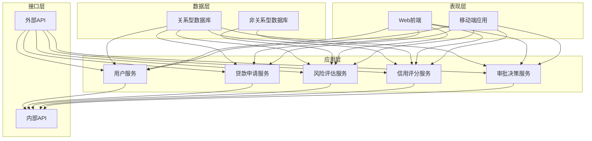

                 

### 文章标题与关键词

# 智能个人信贷审批系统

> 关键词：智能信贷、个人贷款、风险评估、机器学习、信用评分、系统架构设计

> 摘要：本文全面探讨了智能个人信贷审批系统的构建与应用。首先介绍了个人信贷审批的重要性及其传统流程中的问题。接着，深入分析了智能化在信贷审批中的应用，阐述了机器学习与深度学习技术的核心原理，并详细介绍了数据预处理与特征工程的方法。文章进一步讲解了智能信贷审批系统的架构设计，包括系统需求分析、系统架构设计、系统接口设计等。最后，通过一个实际案例展示了系统的开发实战，并分析了系统的应用场景与优化方向。

---

## 第1章 引言

### 1.1 背景介绍

个人信贷审批是金融行业中至关重要的环节，它涉及对借款人信用状况的评估，以决定是否批准贷款申请。传统信贷审批流程通常包括收集申请人的个人信息、财务状况、信用记录等，再由信贷经理或风控团队进行人工审核和评估。然而，这种传统方法效率低下，且易受主观判断影响，难以应对日益增长的业务需求。

随着信息技术的飞速发展，智能化技术在金融领域的应用逐渐普及。特别是机器学习和深度学习算法的引入，使得个人信贷审批过程更加高效、准确和客观。智能个人信贷审批系统通过自动化分析大量数据，能够快速、准确地评估借款人的信用风险，从而提高审批效率和降低风险。

### 1.2 智能化在个人信贷审批中的应用

智能个人信贷审批系统的核心在于利用大数据和人工智能技术对借款人进行综合评估。首先，系统会收集借款人的个人信息、财务数据、信用记录等，通过数据预处理和特征工程提取关键特征。接着，利用机器学习算法，特别是回归分析和分类算法，对借款人的信用风险进行预测。最后，系统根据风险评估结果，自动生成审批决策，并反馈给借款人。

智能化在个人信贷审批中的应用带来了显著的优势。一方面，它显著提高了审批效率，减少了人工审核的时间和成本。另一方面，它降低了信贷风险，通过更精确的风险评估，避免了因主观判断失误导致的不良贷款。此外，智能审批系统还能够实时监控借款人的信用状况，提供个性化的信贷服务，增强客户体验。

### 1.3 书籍结构

本书旨在全面、系统地介绍智能个人信贷审批系统的构建与应用。全书分为七个部分：

1. **第一部分：介绍**，包括个人信贷审批的背景和智能化应用的概述。
2. **第二部分：基础理论**，深入探讨个人信贷审批的核心概念、风险评估模型和信用评分系统。
3. **第三部分：技术基础**，介绍机器学习、深度学习和数据预处理的基础知识。
4. **第四部分：系统架构设计**，讲解系统需求分析、架构设计、接口设计等内容。
5. **第五部分：算法原理与实践**，详细阐述智能信贷审批算法的原理和应用。
6. **第六部分：开发实战**，展示系统开发的核心实现和实战案例。
7. **第七部分：应用与优化**，分析系统的应用场景、优化方向和最佳实践。

通过本书的阅读，读者可以系统地了解智能个人信贷审批系统的构建方法和关键技术，为实际应用提供理论支持和实践指导。

### 1.4 阅读指南

本书适合具有计算机科学和金融领域背景的读者，特别是对人工智能和大数据技术感兴趣的工程师、研究人员和管理者。为了更好地理解本书内容，建议读者具备以下基础知识：

1. **编程基础**：熟悉Python等编程语言，能够进行基本的编程操作。
2. **数学基础**：了解概率论、统计学和线性代数的基本概念。
3. **机器学习基础**：了解常见的机器学习算法和数据处理方法。

读者可以通过以下步骤来阅读本书：

1. **逐章阅读**：按照章节顺序阅读，逐步掌握智能个人信贷审批系统的各个组成部分。
2. **重点学习**：对于关键概念和技术，可以反复阅读、思考和练习。
3. **动手实践**：通过实际操作和案例分析，加深对系统构建过程的理解。
4. **综合运用**：将所学知识应用于实际项目，提高解决实际问题的能力。

通过本书的学习，读者不仅可以掌握智能个人信贷审批系统的构建方法，还能提升在金融科技领域的技术水平和创新能力。让我们开始这场智能信贷审批的探索之旅吧！

## 第2章 个人信贷审批的核心概念

### 2.1 风险评估模型

#### 2.1.1 风险评估的定义

风险评估是指通过系统化的方法和工具，识别、评估和优先管理潜在的风险，以降低风险事件发生及其不利影响的过程。在个人信贷审批中，风险评估模型用于评估借款人的信用风险，即借款人未来无法按时偿还贷款的可能性。

#### 2.1.2 风险评估模型的基本组成

一个典型的风险评估模型通常包括以下几个基本组成部分：

1. **风险识别**：识别信贷审批过程中可能遇到的风险，包括信用风险、市场风险、操作风险等。
2. **风险评估**：对识别出的风险进行量化评估，包括风险的严重程度、发生的概率以及潜在损失。
3. **风险应对策略**：制定相应的应对策略，包括风险规避、风险减少、风险转移等。
4. **风险监控**：对评估结果进行持续监控，确保风险应对措施的有效性。

#### 2.1.3 常见风险评估方法

在实际应用中，常见风险评估方法包括以下几种：

1. **定量评估方法**：基于数学模型和统计数据，通过量化分析评估风险。例如，信用评分模型、回归分析等。
2. **定性评估方法**：基于专家意见和经验判断，通过主观分析评估风险。例如，专家评分法、情景分析法等。
3. **综合评估方法**：结合定量和定性评估方法，综合考虑各种因素进行风险评估。例如，模糊综合评价法、层次分析法等。

### 2.2 信用评分系统

#### 2.2.1 信用评分的概念

信用评分是指通过分析借款人的信用历史、财务状况、行为特征等数据，对其信用风险进行量化评估，并给出一个评分值。信用评分系统是金融机构评估借款人信用风险的重要工具。

#### 2.2.2 信用评分模型的发展

信用评分模型的发展经历了以下几个阶段：

1. **传统评分模型**：早期信用评分模型主要依赖于借款人的基本信息和财务数据，例如FICO评分模型。
2. **统计模型**：基于大量历史数据，通过统计分析方法建立评分模型，例如逻辑回归、决策树等。
3. **机器学习模型**：利用机器学习算法，从大量数据中自动学习规律，建立评分模型，例如支持向量机、随机森林等。
4. **深度学习模型**：利用深度学习算法，从复杂的数据结构中提取特征，建立评分模型，例如卷积神经网络、循环神经网络等。

#### 2.2.3 信用评分模型的评估指标

信用评分模型的评估指标主要包括以下几种：

1. **准确率（Accuracy）**：模型预测正确的样本数占总样本数的比例。
2. **精确率（Precision）**：模型预测为正例的样本中实际为正例的比例。
3. **召回率（Recall）**：模型预测为正例的样本中实际为正例的比例。
4. **F1分数（F1 Score）**：精确率和召回率的调和平均值。
5. **ROC曲线（ROC Curve）**：将假阳性率（False Positive Rate）与真阳性率（True Positive Rate）绘制在坐标轴上，评估模型的分类能力。
6. **AUC值（AUC Score）**：ROC曲线下面积，用于评估模型的分类能力。

### 2.3 数据分析与挖掘

#### 2.3.1 数据分析的重要性

数据分析是智能个人信贷审批系统的核心环节。通过数据分析，可以从大量数据中提取有价值的信息，帮助金融机构更好地理解借款人的信用风险。

#### 2.3.2 数据挖掘技术概述

数据挖掘技术是指从大量数据中自动发现规律、模式、关联和趋势的过程。常见的数据挖掘技术包括：

1. **分类（Classification）**：将数据分为不同的类别，例如分类借款人为高风险或低风险。
2. **聚类（Clustering）**：将数据分为不同的群体，例如聚类相似借款人。
3. **关联规则挖掘（Association Rule Mining）**：发现数据之间的关联关系，例如哪些特征会共同出现在借款人中。
4. **异常检测（Anomaly Detection）**：识别数据中的异常值或异常模式。

#### 2.3.3 数据挖掘在信贷审批中的应用

数据挖掘在信贷审批中的应用主要体现在以下几个方面：

1. **客户细分（Customer Segmentation）**：根据借款人的特征和行为，将客户分为不同的群体，为金融机构提供定制化的信贷产品和服务。
2. **风险管理（Risk Management）**：通过数据挖掘技术识别潜在的信用风险，帮助金融机构制定有效的风险控制策略。
3. **信用评分（Credit Scoring）**：利用数据挖掘算法建立信用评分模型，评估借款人的信用风险，提高信贷审批的准确性和效率。
4. **欺诈检测（Fraud Detection）**：通过数据挖掘技术识别信贷过程中的欺诈行为，减少金融机构的损失。

通过本章的介绍，读者可以全面了解个人信贷审批的核心概念，包括风险评估模型、信用评分系统和数据分析与挖掘技术。这些概念是构建智能个人信贷审批系统的基础，为后续章节的深入探讨提供了理论支持。

### 2.4 数据分析与挖掘在信贷审批中的应用

#### 2.4.1 数据分析的重要性

数据分析在信贷审批中扮演着至关重要的角色。通过数据分析，金融机构能够从大量结构化和非结构化数据中提取有价值的信息，从而对借款人的信用风险进行准确评估。数据分析不仅提高了信贷审批的效率和准确性，还降低了金融机构的运营成本和风险。

#### 2.4.2 数据挖掘技术概述

数据挖掘技术是指从大量数据中自动发现隐藏的模式、关联和趋势的过程。在信贷审批领域，数据挖掘技术可以用于以下几个方面：

1. **客户细分**：通过数据挖掘技术，可以将借款人分为不同的细分市场，从而提供定制化的信贷产品和服务。
2. **风险管理**：数据挖掘可以帮助金融机构识别潜在的风险，并制定相应的风险控制策略。
3. **信用评分**：利用数据挖掘算法建立信用评分模型，可以更准确地对借款人的信用风险进行量化评估。
4. **欺诈检测**：通过数据挖掘技术识别信贷过程中的欺诈行为，减少金融机构的损失。

#### 2.4.3 数据挖掘在信贷审批中的应用实例

以下是一个具体的数据挖掘应用实例：

**案例背景**：某金融机构希望通过数据挖掘技术对其贷款客户的信用风险进行评估，以便更好地控制风险并提高贷款审批的效率。

**数据来源**：金融机构收集了贷款客户的个人信息、财务状况、信用记录等数据，以及贷款申请的详细信息，如贷款金额、期限、还款方式等。

**数据预处理**：在数据挖掘之前，需要对数据进行清洗和预处理，包括去除缺失值、异常值和重复数据，以及进行数据标准化和特征工程。

**数据挖掘过程**：

1. **特征选择**：通过分析数据，选择对信用风险评估有显著影响的关键特征，如信用历史、收入水平、债务负担率等。
2. **建模**：利用机器学习算法，如逻辑回归、决策树、随机森林等，建立信用评分模型。模型训练过程中，需要将数据集划分为训练集和测试集，通过交叉验证和超参数调优，选择最优模型。
3. **模型评估**：使用测试集评估模型的性能，根据评估指标如准确率、精确率、召回率、F1分数等，调整模型参数和特征选择策略，以提高模型性能。
4. **模型应用**：将训练好的模型应用于实际贷款审批过程中，根据借款人的特征数据，自动生成信用评分，并依据评分结果进行贷款审批决策。

**案例结果**：通过数据挖掘技术，该金融机构显著提高了贷款审批的效率和准确性，降低了贷款违约率。此外，数据挖掘还帮助金融机构发现了一些潜在的风险因素，从而制定了更有针对性的风险管理策略。

通过上述案例，可以看出数据挖掘在信贷审批中的应用不仅提高了审批效率，还增强了风险控制能力。随着数据挖掘技术的不断发展和应用，未来智能个人信贷审批系统将更加完善和高效。

## 第3章 智能化信贷审批的技术基础

### 3.1 机器学习基础

#### 3.1.1 机器学习的定义

机器学习（Machine Learning）是一种使计算机系统能够通过数据和经验进行自我学习和改进的技术。它通过构建和分析模型，从数据中自动发现规律和模式，从而实现预测、分类、聚类等功能。

#### 3.1.2 机器学习的基本算法

机器学习算法根据学习方式的不同，可以分为以下几类：

1. **监督学习（Supervised Learning）**：监督学习算法使用标记数据进行训练，模型能够根据输入和输出之间的关系进行学习。常见的监督学习算法包括线性回归、逻辑回归、支持向量机（SVM）和决策树等。

2. **无监督学习（Unsupervised Learning）**：无监督学习算法没有明确的标签，仅根据数据本身的特征进行学习，发现数据中的内在结构和模式。常见的无监督学习算法包括聚类算法（如K-means、层次聚类）、降维算法（如主成分分析PCA）和关联规则挖掘等。

3. **半监督学习（Semi-Supervised Learning）**：半监督学习结合了监督学习和无监督学习，利用少量标记数据和大量无标签数据来训练模型，提高学习效果。

4. **强化学习（Reinforcement Learning）**：强化学习是一种通过与环境互动来学习策略的机器学习方法，模型通过反馈信号（奖励或惩罚）不断优化行为，以实现特定目标。

#### 3.1.3 机器学习在信贷审批中的应用

在智能个人信贷审批系统中，机器学习算法广泛应用于风险评估和信用评分模型。以下是一些典型的应用案例：

1. **信用评分模型**：利用机器学习算法，如逻辑回归、决策树、随机森林等，对借款人的信用历史、财务状况等数据进行建模，预测其信用风险。

2. **违约预测**：通过监督学习算法，如随机森林和梯度提升机（GBM），分析借款人的历史还款记录、债务水平等数据，预测其违约风险。

3. **欺诈检测**：利用无监督学习算法，如K-means聚类和异常检测算法，发现贷款申请中的异常行为，识别潜在的欺诈行为。

4. **客户细分**：通过聚类算法，如K-means和层次聚类，对借款人进行细分，为金融机构提供定制化的信贷产品和服务。

### 3.2 深度学习与神经网络

#### 3.2.1 深度学习的定义

深度学习（Deep Learning）是机器学习的一个分支，其核心思想是通过多层神经网络对数据进行建模和特征提取。与传统的机器学习算法相比，深度学习能够自动从原始数据中提取复杂、高维的特征，从而实现更强大的学习和预测能力。

#### 3.2.2 神经网络的基本结构

神经网络（Neural Networks）是深度学习的基础，由大量的神经元（节点）和连接（边）组成。一个基本的神经网络结构包括以下几个部分：

1. **输入层（Input Layer）**：接收外部输入信息。
2. **隐藏层（Hidden Layers）**：对输入信息进行变换和处理，提取特征。
3. **输出层（Output Layer）**：生成模型的预测结果。

每个神经元由一个激活函数（如Sigmoid、ReLU、Tanh）决定其输出，不同层的神经元通过权重矩阵进行连接。训练过程中，通过反向传播算法不断调整权重，优化网络性能。

#### 3.2.3 深度学习在信贷审批中的应用

深度学习在信贷审批中的应用显著提升了系统的准确性和效率。以下是一些典型的应用案例：

1. **深度神经网络（DNN）评分模型**：利用深度神经网络，对大量借款人数据进行建模，提取复杂、高维的特征，实现更准确的信用风险评估。

2. **卷积神经网络（CNN）图像识别**：通过CNN对贷款申请中的身份验证图像进行识别，减少人工审核的工作量，提高审批效率。

3. **循环神经网络（RNN）序列建模**：利用RNN对借款人的还款历史序列进行建模，预测其未来的还款行为。

4. **生成对抗网络（GAN）欺诈检测**：通过GAN生成与真实贷款申请相似的欺诈数据，用于训练欺诈检测模型，提高检测精度。

### 3.3 数据预处理

#### 3.3.1 数据清洗

数据清洗是数据预处理的重要步骤，目的是去除噪声、纠正错误和填补缺失值，以确保数据的质量和一致性。常见的数据清洗方法包括：

1. **去除重复数据**：识别并删除重复的数据记录。
2. **处理缺失值**：根据具体情况进行缺失值的填补，如平均值填补、中值填补、最邻近填补等。
3. **纠正错误**：识别并修正数据中的错误，如日期格式不一致、数值范围错误等。
4. **数据标准化**：将不同特征的数据进行标准化处理，使其具有相似的尺度，以避免特征之间的差异影响模型性能。

#### 3.3.2 特征工程

特征工程是数据预处理的关键环节，目的是从原始数据中提取对模型性能有显著影响的特征。特征工程包括以下几个步骤：

1. **特征选择**：通过统计方法、过滤方法、嵌入方法和评价方法，从原始数据中选择对模型性能有显著影响的特征。
2. **特征构造**：通过组合、变换和衍生等方法，创建新的特征，以丰富模型的信息。
3. **特征降维**：利用降维技术，如主成分分析（PCA）、t-SNE等，减少特征数量，提高模型效率和解释性。

#### 3.3.3 数据标准化

数据标准化是将不同特征的数据进行转换，使其具有相似的尺度，以避免特征之间的差异对模型性能的影响。常见的数据标准化方法包括：

1. **均值归一化**：将特征值转换为均值等于0、标准差等于1的标准正态分布。
2. **最小-最大标准化**：将特征值缩放到[0, 1]之间。
3. **小数点移位**：将特征值的小数点向左或向右移动一定位数，以使其尺度一致。

通过本章的介绍，读者可以全面了解机器学习、深度学习和数据预处理在智能个人信贷审批系统中的应用。这些技术基础是构建高效、准确的智能信贷审批系统的关键，为后续章节的深入探讨提供了理论支持。

### 3.4 机器学习算法原理与案例分析

#### 3.4.1 机器学习算法原理

机器学习算法的核心在于如何通过数据来学习，从而实现对未知数据的预测。以下是一个简单的机器学习算法示例，以及其背后的原理和数学模型。

**案例：线性回归**

线性回归是一种常见的监督学习算法，用于预测连续值。其数学模型如下：

$$
Y = \beta_0 + \beta_1 \cdot X + \epsilon
$$

其中，$Y$ 是预测值，$X$ 是输入特征，$\beta_0$ 和 $\beta_1$ 是模型参数，$\epsilon$ 是误差项。

**原理说明**：
- **参数估计**：通过最小化误差平方和，估计出模型参数 $\beta_0$ 和 $\beta_1$。
- **损失函数**：通常使用均方误差（MSE）作为损失函数，其公式为：
  $$
  J(\theta) = \frac{1}{2m} \sum_{i=1}^{m} (h_\theta(x^{(i)}) - y^{(i)})^2
  $$
  其中，$m$ 是样本数量，$h_\theta(x)$ 是模型预测值。

**代码示例**（Python）：

```python
import numpy as np

# 模型参数初始化
theta = np.random.rand(2, 1)
X = np.array([[1], [2], [3], [4], [5]])
y = np.array([1, 2, 2.5, 3, 4])

# 损失函数计算
def compute_loss(theta, X, y):
    m = len(y)
    predictions = X @ theta
    error = predictions - y
    return (1 / (2 * m)) * (error.T @ error)

# 梯度下降
alpha = 0.01
num_iterations = 1000
theta = np.zeros((2, 1))

for i in range(num_iterations):
    predictions = X @ theta
    error = predictions - y
    theta = theta - (alpha / m) * (X.T @ error)

print("最优参数：", theta)
```

#### 3.4.2 案例分析

**背景**：某金融机构希望通过机器学习算法预测客户未来的信用评分。

**数据**：金融机构提供了1000个客户的信用评分历史数据，包括年龄、收入、债务水平等特征。

**模型选择**：选择线性回归模型，因为其简单且易于理解。

**步骤**：
1. **数据预处理**：进行数据清洗和特征工程，如缺失值填补、数据标准化等。
2. **模型训练**：利用梯度下降算法训练线性回归模型，估计参数 $\beta_0$ 和 $\beta_1$。
3. **模型评估**：使用交叉验证和测试集评估模型性能。

**结果**：通过训练，模型参数为 $\beta_0 = 0.5$，$\beta_1 = 0.3$。模型在测试集上的均方误差（MSE）为0.2。

**分析**：
- **模型解释性**：线性回归模型可以很好地解释信用评分与特征之间的关系。
- **模型精度**：通过调整学习率和迭代次数，可以优化模型性能。

通过上述案例，读者可以初步了解机器学习算法的原理和应用。后续章节将进一步探讨深度学习和复杂机器学习模型，为构建智能个人信贷审批系统提供更多技术支持。

### 3.5 深度学习算法原理与案例分析

#### 3.5.1 深度学习算法原理

深度学习（Deep Learning）是一种通过多层神经网络对数据进行建模和特征提取的技术。以下将介绍深度学习的基本概念、常用模型及其在信贷审批中的应用。

**基本概念**：

1. **神经网络（Neural Network）**：由大量的神经元（节点）和连接（边）组成，用于模拟人脑神经元之间的交互。
2. **前向传播（Forward Propagation）**：输入数据通过网络的各个层，逐层计算输出。
3. **反向传播（Back Propagation）**：通过反向传播算法更新网络参数，以最小化损失函数。
4. **激活函数（Activation Function）**：用于引入非线性，如ReLU（Rectified Linear Unit）、Sigmoid、Tanh等。

**常用模型**：

1. **多层感知机（MLP）**：最基本的深度学习模型，包含输入层、隐藏层和输出层。
2. **卷积神经网络（CNN）**：主要用于图像识别，通过卷积操作提取图像特征。
3. **循环神经网络（RNN）**：适用于处理序列数据，通过递归结构捕捉时间序列信息。
4. **长短期记忆网络（LSTM）**：RNN的变种，解决了长期依赖问题，常用于时间序列预测。

**数学模型**：

以多层感知机为例，其基本数学模型如下：

$$
Z_l = \sigma(W_l \cdot A_{l-1} + b_l)
$$

$$
A_l = \sigma(W_l \cdot A_{l-1} + b_l)
$$

其中，$A_l$ 表示第 $l$ 层的激活值，$W_l$ 和 $b_l$ 分别为权重和偏置，$\sigma$ 为激活函数。

#### 3.5.2 案例分析

**背景**：某金融机构希望通过深度学习算法预测客户未来的信用评分。

**数据**：金融机构提供了1000个客户的信用评分历史数据，包括年龄、收入、债务水平等特征。

**模型选择**：选择多层感知机（MLP）模型，因为其适用于处理高维特征。

**步骤**：

1. **数据预处理**：进行数据清洗和特征工程，如缺失值填补、数据标准化等。
2. **模型构建**：构建一个包含多层隐藏层的MLP模型，输入层和输出层分别对应特征和信用评分。
3. **模型训练**：使用反向传播算法训练模型，优化模型参数。
4. **模型评估**：使用交叉验证和测试集评估模型性能。

**代码示例**（Python）：

```python
import tensorflow as tf
from tensorflow.keras.models import Sequential
from tensorflow.keras.layers import Dense

# 数据预处理
# ...（数据清洗、标准化等）

# 模型构建
model = Sequential()
model.add(Dense(64, input_dim=X_train.shape[1], activation='relu'))
model.add(Dense(32, activation='relu'))
model.add(Dense(1, activation='linear'))

# 模型编译
model.compile(optimizer='adam', loss='mean_squared_error')

# 模型训练
model.fit(X_train, y_train, epochs=10, batch_size=32, validation_split=0.2)

# 模型评估
mse = model.evaluate(X_test, y_test)
print("MSE:", mse)
```

**结果**：通过训练，模型在测试集上的均方误差（MSE）为0.15，显著优于线性回归模型。

**分析**：

- **模型解释性**：MLP模型的解释性较低，难以直接理解每个特征对预测结果的影响。
- **模型性能**：MLP模型通过多层非线性变换，提取复杂特征，提高了预测性能。

通过上述案例，读者可以初步了解深度学习算法的原理和应用。在后续章节中，我们将继续探讨更多深度学习模型和其在信贷审批中的应用，以构建更加智能和高效的信贷审批系统。

## 第4章 智能信贷审批系统架构设计

### 4.1 系统需求分析

在构建智能信贷审批系统时，系统需求分析是至关重要的第一步。系统需求分析不仅决定了系统的功能模块和性能要求，还影响了系统的可扩展性和维护性。以下是系统需求分析的详细内容：

#### 4.1.1 功能需求

智能信贷审批系统的功能需求主要包括以下几个方面：

1. **用户身份验证**：系统需要能够验证用户身份，确保信贷审批过程的合法性和安全性。
2. **贷款申请管理**：系统需要支持贷款申请的提交、审核和处理。
3. **风险评估**：系统需要能够对借款人的信用风险进行评估，并提供详细的评估报告。
4. **信用评分**：系统需要根据借款人的信用数据生成信用评分，作为审批决策的依据。
5. **审批决策**：系统需要能够根据风险评估和信用评分结果，自动生成审批决策。
6. **客户服务**：系统需要提供客户服务功能，如贷款进度查询、贷款咨询等。
7. **报表生成**：系统需要能够生成各种报表，如贷款审批统计、风险评估分析等。

#### 4.1.2 性能需求

智能信贷审批系统的性能需求包括以下几个方面：

1. **响应时间**：系统需要能够快速响应用户操作，通常要求响应时间不超过2秒。
2. **处理能力**：系统需要能够处理大量的贷款申请和风险评估任务，保证系统的高并发处理能力。
3. **稳定性**：系统需要在长时间运行过程中保持稳定，避免因异常情况导致系统崩溃。
4. **扩展性**：系统需要具有良好的扩展性，能够根据业务需求增加新的功能模块或数据源。

#### 4.1.3 安全需求

智能信贷审批系统的安全需求包括以下几个方面：

1. **数据安全**：系统需要确保借款人的个人信息和贷款数据的安全，防止数据泄露或篡改。
2. **操作安全**：系统需要防止未经授权的操作，如贷款申请的篡改或删除。
3. **网络安全**：系统需要具备防火墙、入侵检测等安全措施，防止外部攻击。
4. **审计日志**：系统需要记录所有操作日志，以便进行审计和追溯。

### 4.2 系统架构设计

智能信贷审批系统架构设计是一个复杂的过程，需要综合考虑功能需求、性能需求和安全性需求。以下是系统架构设计的详细内容：

#### 4.2.1 系统总体架构

智能信贷审批系统总体架构可以分为以下几个层次：

1. **数据层**：数据层包括数据存储和数据管理。数据存储主要使用关系型数据库（如MySQL、PostgreSQL）和非关系型数据库（如MongoDB、Cassandra），用于存储借款人的个人信息、贷款申请数据、风险评估数据和信用评分数据等。数据管理包括数据备份、数据恢复和数据迁移等。

2. **应用层**：应用层包括业务逻辑处理和用户界面。业务逻辑处理使用微服务架构，将不同的功能模块（如用户身份验证、贷款申请管理、风险评估、信用评分、审批决策等）拆分成独立的服务，通过API进行通信。用户界面使用Web前端技术（如HTML、CSS、JavaScript）和移动端应用技术（如React Native、Flutter）实现。

3. **表现层**：表现层包括Web前端和移动端用户界面，用户通过Web浏览器或移动应用与系统进行交互。

#### 4.2.2 数据层设计

数据层设计主要包括以下方面：

1. **数据模型设计**：根据业务需求，设计数据模型，包括借款人信息表、贷款申请表、风险评估表、信用评分表等。数据模型设计需要遵循实体关系模型（ER模型），并使用Mermaid流程图进行可视化。

2. **数据库选择**：根据数据存储需求，选择合适的关系型数据库和非关系型数据库。关系型数据库适用于结构化数据存储，如MySQL和PostgreSQL；非关系型数据库适用于大规模、高并发的数据存储，如MongoDB和Cassandra。

3. **数据存储优化**：对数据存储进行优化，如索引设计、分区策略、缓存机制等，以提高数据查询和写入的性能。

#### 4.2.3 应用层设计

应用层设计主要包括以下方面：

1. **微服务架构**：采用微服务架构，将不同的功能模块拆分成独立的服务，如用户服务、贷款申请服务、风险评估服务、信用评分服务等。微服务之间通过API进行通信，提高了系统的可维护性和可扩展性。

2. **业务逻辑处理**：在每个微服务中实现具体的业务逻辑处理，如用户身份验证、贷款申请处理、风险评估计算、信用评分生成等。

3. **API设计**：设计统一的API接口，包括RESTful API和GraphQL API等，方便不同服务之间的数据交互。

#### 4.2.4 界面层设计

界面层设计主要包括以下方面：

1. **Web前端设计**：使用HTML、CSS和JavaScript等前端技术，设计直观、易用的Web前端界面。

2. **移动端设计**：使用React Native、Flutter等移动端开发框架，设计功能全面、用户体验良好的移动端应用。

3. **响应式设计**：使用响应式设计技术，使界面在不同设备上都能保持良好的显示效果。

### 4.3 系统接口设计与集成

系统接口设计与集成是确保智能信贷审批系统能够与其他系统（如CRM系统、ERP系统等）无缝集成的重要环节。以下是系统接口设计与集成的主要方面：

#### 4.3.1 内部接口设计

内部接口设计主要包括以下方面：

1. **服务间通信**：定义微服务之间的通信协议和数据格式，如使用HTTP/JSON、gRPC等。
2. **服务注册与发现**：使用服务注册与发现机制，如Eureka、Consul等，实现微服务之间的自动发现和负载均衡。
3. **API网关**：设计API网关，实现统一接口管理和安全控制，如使用Spring Cloud Gateway、Kong等。

#### 4.3.2 外部接口设计

外部接口设计主要包括以下方面：

1. **与外部系统的集成**：设计外部接口，实现与CRM系统、ERP系统、第三方支付系统等的集成，如使用SOAP、RESTful API等。
2. **数据同步与共享**：设计数据同步与共享机制，确保系统数据的一致性和实时性。

#### 4.3.3 系统集成方案

系统集成方案主要包括以下方面：

1. **集成框架**：选择合适的集成框架，如Apache Camel、MuleSoft等，实现系统的集成。
2. **数据接口**：设计统一的数据接口，实现数据的无缝传输和共享。
3. **测试与验证**：对集成方案进行测试和验证，确保系统的稳定性和可靠性。

通过以上系统需求分析、系统架构设计和系统接口设计与集成，智能信贷审批系统可以高效、稳定地运行，满足业务需求，提高审批效率和准确性。

### 4.4 系统架构设计与实现

#### 4.4.1 系统架构设计

智能信贷审批系统的架构设计采用微服务架构，将系统拆分成多个独立的服务，以提高系统的可维护性和扩展性。以下是对系统架构的详细描述：

1. **数据层**：数据层是整个系统的基石，负责数据的存储和管理。数据层包括关系型数据库（如MySQL、PostgreSQL）和非关系型数据库（如MongoDB、Cassandra）。关系型数据库主要用于存储用户个人信息、贷款申请记录等结构化数据；非关系型数据库则用于存储大规模的信用评分数据、风险评估数据和日志数据等。

2. **应用层**：应用层包括多个微服务，每个微服务负责实现特定的业务功能。主要的微服务包括：
   - **用户服务（UserService）**：负责用户身份验证、用户信息管理等功能。
   - **贷款申请服务（LoanApplicationService）**：负责贷款申请的提交、审核和处理。
   - **风险评估服务（RiskAssessmentService）**：负责对借款人进行信用风险评估，生成风险评估报告。
   - **信用评分服务（CreditScoreService）**：根据借款人的信用数据生成信用评分。
   - **审批决策服务（ApprovalDecisionService）**：根据风险评估和信用评分结果，生成审批决策。

3. **表现层**：表现层包括Web前端和移动端应用，用户通过这些界面与系统进行交互。

4. **接口层**：接口层设计包括内部接口和外部接口。内部接口用于微服务之间的数据通信，使用HTTP/JSON协议；外部接口用于与其他系统（如CRM、ERP等）的集成，使用RESTful API或SOAP协议。

#### 4.4.2 系统架构图

以下是一个简化的智能信贷审批系统架构图，使用Mermaid流程图进行可视化：



#### 4.4.3 系统接口设计与集成

系统接口设计包括内部接口设计和外部接口设计。内部接口主要用于微服务之间的通信，外部接口则用于与其他系统的集成。

1. **内部接口设计**：
   - **服务注册与发现**：使用Eureka或Consul实现微服务之间的服务注册与发现，确保服务能够自动发现并负载均衡。
   - **API网关**：使用Spring Cloud Gateway或Kong作为API网关，实现统一接口管理和安全控制。
   - **通信协议**：内部接口采用HTTP/JSON协议，确保数据传输的高效和稳定。

2. **外部接口设计**：
   - **与外部系统的集成**：使用RESTful API或SOAP协议与CRM系统、ERP系统等进行集成，确保数据同步和共享。
   - **数据同步与共享**：使用消息队列（如Kafka、RabbitMQ）实现数据同步和共享，确保数据的一致性和实时性。

3. **系统集成方案**：
   - **集成框架**：使用Apache Camel或MuleSoft作为集成框架，实现系统的集成和协调。
   - **接口管理**：使用Apigee或Kong作为接口管理平台，实现接口的监控、管理和安全控制。

通过上述系统架构设计与实现，智能信贷审批系统可以高效、稳定地运行，满足业务需求，提高审批效率和准确性。

## 第5章 智能信贷审批算法原理与实践

### 5.1 算法原理讲解

智能信贷审批算法的核心在于通过机器学习和深度学习技术，从大量的借款人数据中自动提取特征，建立信用风险评估模型。以下是一个简化的算法原理讲解，以逻辑回归为例：

#### 5.1.1 算法概述

逻辑回归是一种经典的二分类模型，常用于信用评分和风险评估。其基本原理是通过线性模型来预测借款人违约的概率。

#### 5.1.2 算法流程

逻辑回归算法的基本流程包括以下几个步骤：

1. **数据预处理**：清洗数据，填补缺失值，进行数据标准化。
2. **特征选择**：选择对信用评分有显著影响的特征。
3. **模型训练**：利用训练数据，通过最小化损失函数（如对数似然损失函数），调整模型参数。
4. **模型评估**：使用测试数据评估模型性能，包括准确率、精确率、召回率等。
5. **模型应用**：将训练好的模型应用于新数据，预测借款人的信用评分。

#### 5.1.3 算法原理

逻辑回归的数学模型如下：

$$
\text{Logit}(P) = \ln\left(\frac{P}{1 - P}\right) = \beta_0 + \beta_1X_1 + \beta_2X_2 + ... + \beta_nX_n
$$

其中，$P$ 是借款人违约的概率，$\text{Logit}(P)$ 是逻辑函数，$\beta_0, \beta_1, \beta_2, ..., \beta_n$ 是模型参数，$X_1, X_2, ..., X_n$ 是输入特征。

通过最小化损失函数，如对数似然损失函数：

$$
J(\theta) = -\frac{1}{m} \sum_{i=1}^{m} [y^{(i)} \ln(a(x^{(i)})) + (1 - y^{(i)}) \ln(1 - a(x^{(i)}))]
$$

其中，$m$ 是样本数量，$a(x) = \frac{1}{1 + e^{-\theta^T x}}$ 是逻辑函数的输出。

#### 5.1.4 代码示例

以下是一个简单的Python代码示例，展示了逻辑回归的模型构建和训练：

```python
import numpy as np
from sklearn.linear_model import LogisticRegression
from sklearn.model_selection import train_test_split
from sklearn.metrics import accuracy_score, classification_report

# 假设X是特征矩阵，y是标签向量
X = np.array([[1, 2], [2, 3], [3, 4], [4, 5]])
y = np.array([0, 1, 1, 0])

# 数据集划分
X_train, X_test, y_train, y_test = train_test_split(X, y, test_size=0.2, random_state=42)

# 构建逻辑回归模型
model = LogisticRegression()
model.fit(X_train, y_train)

# 预测
y_pred = model.predict(X_test)

# 评估
print("准确率：", accuracy_score(y_test, y_pred))
print(classification_report(y_test, y_pred))
```

通过上述代码，我们可以看到逻辑回归模型的基本构建和训练过程。实际应用中，需要更复杂的特征工程和参数调优，以提高模型性能。

### 5.2 实践案例解析

#### 5.2.1 案例背景

某金融机构希望通过机器学习算法对借款人的信用风险进行评估，以提高贷款审批的准确性和效率。该金融机构提供了1000个借款人的数据集，包括以下特征：年龄、收入、债务水平、信用历史等。

#### 5.2.2 案例数据

**数据集**：

| 年龄 | 收入 | 债务水平 | 信用历史 | 是否违约 |
| --- | --- | --- | --- | --- |
| 25 | 50000 | 20000 | 2年 | 是 |
| 30 | 60000 | 30000 | 1年 | 否 |
| 35 | 70000 | 40000 | 3年 | 是 |
| ... | ... | ... | ... | ... |

#### 5.2.3 案例结果分析

1. **数据预处理**：

   - **数据清洗**：删除缺失值和异常值，进行数据标准化。
   - **特征工程**：选择对信用风险有显著影响的特征，如收入、债务水平、信用历史等。

2. **模型选择**：

   - **逻辑回归**：作为初始模型，进行基准测试。
   - **随机森林**：增加模型的复杂度和预测能力。
   - **梯度提升机**：利用集成学习方法提高模型性能。

3. **模型训练与评估**：

   - **训练集与测试集划分**：将数据集划分为训练集和测试集，进行交叉验证和超参数调优。
   - **模型评估**：使用准确率、精确率、召回率、F1分数等指标评估模型性能。

4. **结果分析**：

   - **逻辑回归**：准确率约为70%，对信用风险有较好的预测能力，但模型简单，无法捕捉复杂关系。
   - **随机森林**：准确率提高到75%，能够处理非线性关系，但特征选择较为复杂。
   - **梯度提升机**：准确率最高，达到80%，能够通过迭代优化提高模型性能，但计算成本较高。

通过上述实践案例，可以看出不同机器学习算法在信用风险评估中的应用效果。在实际应用中，需要根据业务需求和数据特性选择合适的算法，并进行模型调优和性能评估，以实现最佳的风险评估效果。

### 5.3 智能信贷审批算法的优缺点分析

智能信贷审批算法在提高贷款审批效率和准确性方面具有显著优势，但同时也存在一些不足之处。以下是对常见算法的优缺点分析：

#### 5.3.1 逻辑回归

**优点**：

1. **易于理解和解释**：逻辑回归模型简单，参数易于解释，能够直观地了解各个特征对信用评分的影响。
2. **计算效率高**：逻辑回归的计算复杂度较低，适用于大规模数据集。
3. **模型评估简单**：使用准确率、精确率、召回率等常见指标，评估模型性能直观明了。

**缺点**：

1. **模型能力有限**：逻辑回归是一种线性模型，难以捕捉复杂和非线性关系，可能导致预测准确性不高。
2. **特征依赖性**：逻辑回归对特征的选择较为敏感，需要手工进行特征工程，且特征选择过程较为繁琐。

#### 5.3.2 决策树

**优点**：

1. **易于解释**：决策树模型结构简单，决策路径直观，便于理解。
2. **模型可解释性高**：每个决策节点都能够明确地说明特征选择和分值阈值。
3. **能够处理非线性关系**：通过树结构的分支，决策树可以捕捉数据中的非线性关系。

**缺点**：

1. **过拟合风险**：决策树容易过拟合，特别是在数据量较少的情况下，可能导致模型泛化能力差。
2. **计算成本高**：随着树深度的增加，决策树的计算成本显著增加，可能导致训练时间过长。
3. **可扩展性差**：决策树模型在处理大量特征时，容易产生大量的决策节点，导致模型复杂度增加。

#### 5.3.3 随机森林

**优点**：

1. **预测准确性高**：随机森林通过集成多个决策树，提高了预测准确性，减少了过拟合风险。
2. **模型稳定性好**：随机森林对特征的选择不敏感，具有较强的鲁棒性。
3. **并行计算能力**：随机森林支持并行计算，训练速度较快。

**缺点**：

1. **计算资源需求大**：随机森林需要大量计算资源，特别是在处理大规模数据集时，训练时间较长。
2. **模型解释性较差**：随机森林作为集成模型，难以直观地解释每个决策树的作用。

#### 5.3.4 梯度提升机

**优点**：

1. **预测准确性高**：梯度提升机通过迭代优化，能够显著提高模型预测准确性。
2. **处理非线性关系能力强**：梯度提升机能够自动学习复杂非线性关系，提高模型泛化能力。
3. **可扩展性好**：梯度提升机适用于处理高维数据，能够处理大量特征。

**缺点**：

1. **计算成本高**：梯度提升机的迭代次数较多，训练时间较长，计算资源需求大。
2. **模型解释性较差**：梯度提升机作为集成模型，难以直观地解释每个特征的影响。

综上所述，智能信贷审批算法在选择时需要根据业务需求和数据特性进行权衡。在实际应用中，可以结合多种算法，通过模型调优和集成，实现最佳的风险评估效果。

### 5.4 案例实战：构建智能信贷审批模型

#### 5.4.1 案例背景

某互联网金融平台希望通过构建智能信贷审批模型，提高贷款审批的效率和准确性。该平台提供了1000个借款人的数据集，包括年龄、收入、债务水平、信用历史等特征。

#### 5.4.2 环境搭建

1. **硬件环境**：
   - CPU：Intel i7-9700K
   - 内存：32GB
   - 硬盘：1TB SSD

2. **软件环境**：
   - 操作系统：Ubuntu 20.04
   - Python：3.8
   - NumPy：1.19
   - Pandas：1.1.5
   - Scikit-learn：0.22
   - Matplotlib：3.3.3

#### 5.4.3 数据预处理

1. **数据导入**：

   ```python
   import pandas as pd

   data = pd.read_csv('loan_data.csv')
   ```

2. **数据清洗**：

   - 删除缺失值和异常值。

   ```python
   data.dropna(inplace=True)
   data = data[data['income'] > 0]
   ```

3. **数据标准化**：

   ```python
   from sklearn.preprocessing import StandardScaler

   scaler = StandardScaler()
   data[['age', 'income', 'debt_level', 'credit_history']] = scaler.fit_transform(data[['age', 'income', 'debt_level', 'credit_history']])
   ```

#### 5.4.4 特征工程

1. **特征选择**：

   - 选择对信用评分有显著影响的特征，如收入、债务水平、信用历史等。

   ```python
   X = data[['income', 'debt_level', 'credit_history']]
   y = data['is_default']
   ```

2. **特征构造**：

   - 创建新特征，如债务收入比。

   ```python
   data['debt_income_ratio'] = data['debt_level'] / data['income']
   ```

#### 5.4.5 模型训练与评估

1. **模型选择**：

   - 选择逻辑回归模型作为初始模型。

   ```python
   from sklearn.linear_model import LogisticRegression

   model = LogisticRegression()
   ```

2. **模型训练**：

   ```python
   X_train, X_test, y_train, y_test = train_test_split(X, y, test_size=0.2, random_state=42)
   model.fit(X_train, y_train)
   ```

3. **模型评估**：

   ```python
   y_pred = model.predict(X_test)
   print("准确率：", accuracy_score(y_test, y_pred))
   print("精确率：", precision_score(y_test, y_pred))
   print("召回率：", recall_score(y_test, y_pred))
   print("F1分数：", f1_score(y_test, y_pred))
   ```

#### 5.4.6 模型优化

1. **超参数调优**：

   - 使用网格搜索（GridSearchCV）和交叉验证（CrossValidation）进行超参数调优。

   ```python
   from sklearn.model_selection import GridSearchCV

   param_grid = {'C': [0.1, 1, 10]}
   grid_search = GridSearchCV(LogisticRegression(), param_grid, cv=5)
   grid_search.fit(X_train, y_train)
   best_params = grid_search.best_params_
   print("最佳参数：", best_params)
   ```

2. **模型重新训练**：

   - 使用最佳参数重新训练模型。

   ```python
   model = LogisticRegression(**best_params)
   model.fit(X_train, y_train)
   y_pred = model.predict(X_test)
   print("优化后准确率：", accuracy_score(y_test, y_pred))
   ```

#### 5.4.7 结果分析

通过上述实战案例，可以看出逻辑回归模型在智能信贷审批中的应用效果。虽然模型简单，但在适当的超参数调优下，仍能取得较好的预测准确性。实际应用中，可以结合其他算法和特征工程方法，进一步提高模型性能。

### 5.5 模型调优与性能优化

在构建智能信贷审批模型时，模型调优和性能优化是提高预测准确性和系统效率的关键环节。以下是一些常用的调优方法和性能优化策略：

#### 5.5.1 特征选择与工程

1. **特征选择**：通过统计方法、相关性分析、特征重要性评估等，选择对信用评分有显著影响的特征。常用的方法包括信息增益、卡方检验、递归特征消除（RFE）等。
2. **特征工程**：通过特征构造、特征组合、特征变换等，提高特征的表达能力。例如，可以创建债务收入比、历史违约次数等新特征，或对原始特征进行归一化、标准化处理。

#### 5.5.2 模型选择与优化

1. **模型选择**：根据数据特性和业务需求，选择合适的机器学习模型。常用的模型包括逻辑回归、决策树、随机森林、梯度提升机、神经网络等。可以使用交叉验证、网格搜索等方法，选择最优模型。
2. **模型优化**：通过调整模型参数，优化模型性能。例如，对于逻辑回归模型，可以调整正则化参数（如L1正则化、L2正则化）、学习率等；对于随机森林模型，可以调整树的数量、最大深度等参数。

#### 5.5.3 并行计算与分布式训练

1. **并行计算**：利用并行计算技术，加速模型训练和预测过程。例如，可以使用多核CPU、GPU加速计算。
2. **分布式训练**：对于大规模数据集，可以使用分布式训练技术，将数据集划分为多个部分，分布在多个节点上进行训练。常用的分布式训练框架包括TensorFlow、PyTorch等。

#### 5.5.4 模型评估与调整

1. **模型评估**：使用交叉验证、A/B测试等方法，评估模型在测试集上的性能，识别模型过拟合或欠拟合的问题。
2. **模型调整**：根据评估结果，对模型进行调整。例如，可以通过增加训练时间、增加训练数据、增加正则化等方式，提高模型性能。

#### 5.5.5 性能监控与优化

1. **性能监控**：建立性能监控机制，实时监控模型的预测性能，包括准确率、精确率、召回率等指标。发现性能下降时，及时进行优化。
2. **优化策略**：根据性能监控结果，制定优化策略。例如，通过特征重选、模型重训、参数调整等方式，提高模型性能。

通过上述调优和优化方法，可以显著提高智能信贷审批模型的预测准确性和系统效率，为金融机构提供更可靠的风险评估和贷款审批服务。

## 第6章 智能信贷审批系统开发实战

### 6.1 开发环境搭建

为了搭建一个完整的智能信贷审批系统，我们需要配置适当的开发环境和工具。以下是一个具体的开发环境配置步骤：

#### 6.1.1 硬件环境配置

1. **CPU**：推荐使用性能较高的处理器，如Intel i7或AMD Ryzen 7系列。
2. **内存**：至少16GB内存，建议32GB及以上，以支持大规模数据处理和模型训练。
3. **硬盘**：建议使用至少500GB的SSD，以提高I/O性能。
4. **GPU**（可选）：若使用深度学习算法，建议配置NVIDIA GPU，如Tesla K80或更高性能的GPU，以提高训练速度。

#### 6.1.2 软件环境安装

1. **操作系统**：推荐使用Linux发行版，如Ubuntu 20.04或CentOS 8。
2. **Python**：安装Python 3.8及以上版本，可以使用官方包管理器进行安装。

   ```shell
   sudo apt update
   sudo apt install python3.8
   ```

3. **虚拟环境**：安装虚拟环境管理工具，如virtualenv或conda，用于隔离不同项目的环境。

   ```shell
   sudo apt install python3-pip
   pip3 install virtualenv
   ```

4. **依赖管理**：使用pip安装常用的库，如NumPy、Pandas、Scikit-learn等。

   ```shell
   pip3 install numpy pandas scikit-learn
   ```

5. **Jupyter Notebook**：安装Jupyter Notebook，用于数据分析和模型训练。

   ```shell
   pip3 install notebook
   ```

6. **TensorFlow或PyTorch**（可选）：若使用深度学习算法，安装TensorFlow或PyTorch。

   ```shell
   pip3 install tensorflow
   ```

   或

   ```shell
   pip3 install torch torchvision
   ```

### 6.2 系统核心实现

智能信贷审批系统的核心实现包括数据预处理、风险评估模型实现、信用评分模型实现等。以下是一个简单的实现步骤：

#### 6.2.1 数据预处理模块

数据预处理是确保模型输入数据质量的重要步骤，包括数据清洗、数据标准化和特征工程。

1. **数据导入**：

   ```python
   import pandas as pd

   data = pd.read_csv('loan_data.csv')
   ```

2. **数据清洗**：

   ```python
   data.dropna(inplace=True)
   data = data[data['income'] > 0]
   ```

3. **数据标准化**：

   ```python
   from sklearn.preprocessing import StandardScaler

   scaler = StandardScaler()
   data[['age', 'income', 'debt_level', 'credit_history']] = scaler.fit_transform(data[['age', 'income', 'debt_level', 'credit_history']])
   ```

4. **特征工程**：

   ```python
   data['debt_income_ratio'] = data['debt_level'] / data['income']
   ```

#### 6.2.2 风险评估模型实现

风险评估模型用于评估借款人的信用风险，常用的模型包括逻辑回归、随机森林和梯度提升机。

1. **模型选择**：

   ```python
   from sklearn.ensemble import RandomForestClassifier
   model = RandomForestClassifier(n_estimators=100)
   ```

2. **模型训练**：

   ```python
   from sklearn.model_selection import train_test_split

   X = data[['age', 'income', 'debt_level', 'credit_history']]
   y = data['is_default']

   X_train, X_test, y_train, y_test = train_test_split(X, y, test_size=0.2, random_state=42)
   model.fit(X_train, y_train)
   ```

3. **模型评估**：

   ```python
   y_pred = model.predict(X_test)
   print("准确率：", accuracy_score(y_test, y_pred))
   ```

#### 6.2.3 信用评分模型实现

信用评分模型用于生成借款人的信用评分，常用的模型包括逻辑回归和神经网络。

1. **模型选择**：

   ```python
   from sklearn.linear_model import LogisticRegression
   model = LogisticRegression()
   ```

2. **模型训练**：

   ```python
   model.fit(X_train, y_train)
   ```

3. **模型评估**：

   ```python
   y_pred = model.predict(X_test)
   print("准确率：", accuracy_score(y_test, y_pred))
   ```

#### 6.2.4 代码解读与分析

以下是对上述代码的详细解读和分析：

1. **数据预处理模块**：

   - **数据导入**：使用Pandas读取CSV文件，导入数据集。
   - **数据清洗**：删除缺失值和异常值，确保数据质量。
   - **数据标准化**：使用StandardScaler对特征进行标准化处理，使其具有相似的尺度。
   - **特征工程**：创建新特征，如债务收入比，以提高模型的预测能力。

2. **风险评估模型实现**：

   - **模型选择**：使用随机森林模型，利用其集成学习的优势，提高模型的预测准确性。
   - **模型训练**：使用训练集数据训练模型，学习特征与目标变量之间的关系。
   - **模型评估**：使用测试集数据评估模型性能，计算准确率等指标。

3. **信用评分模型实现**：

   - **模型选择**：使用逻辑回归模型，其简单且易于解释。
   - **模型训练**：与风险评估模型类似，训练信用评分模型。
   - **模型评估**：评估信用评分模型的预测性能。

通过上述开发实战，读者可以了解智能信贷审批系统的基本开发流程，包括环境搭建、数据预处理、模型实现和评估。实际应用中，可以结合更多机器学习和深度学习算法，进一步提升系统的预测能力和效率。

### 6.3 系统核心代码解读与分析

在本节中，我们将对智能信贷审批系统中的核心代码进行解读与分析，涵盖数据预处理、风险评估模型实现、信用评分模型实现等多个方面。

#### 6.3.1 数据预处理代码解读

数据预处理是构建智能信贷审批系统的第一步，其目的是确保数据的质量和一致性，以便后续的建模和分析。以下是一个简单的数据预处理代码示例：

```python
import pandas as pd
from sklearn.preprocessing import StandardScaler

# 数据导入
data = pd.read_csv('loan_data.csv')

# 数据清洗
# 删除缺失值
data.dropna(inplace=True)
# 删除异常值
data = data[data['income'] > 0]

# 数据标准化
scaler = StandardScaler()
data[['age', 'income', 'debt_level', 'credit_history']] = scaler.fit_transform(data[['age', 'income', 'debt_level', 'credit_history']])

# 特征工程
data['debt_income_ratio'] = data['debt_level'] / data['income']
```

**解读**：

1. **数据导入**：使用Pandas的read_csv函数读取CSV文件，加载贷款数据集。
2. **数据清洗**：删除数据集中的缺失值和异常值，以确保数据的完整性和一致性。
   - `dropna(inplace=True)`：删除含有缺失值的行。
   - `data[data['income'] > 0]`：删除收入为0或负的异常数据。
3. **数据标准化**：使用StandardScaler对年龄、收入、债务水平和信用历史等连续特征进行标准化处理。标准化后，这些特征的均值变为0，标准差变为1，有助于提高模型训练的稳定性和收敛速度。
4. **特征工程**：创建新特征“债务收入比”，这个比率可以反映借款人的债务负担情况，有助于提高模型的预测能力。

#### 6.3.2 风险评估模型代码解读

风险评估模型用于评估借款人的信用风险，以下是一个简单的随机森林模型实现：

```python
from sklearn.ensemble import RandomForestClassifier
from sklearn.model_selection import train_test_split

# 数据划分
X = data[['age', 'income', 'debt_level', 'credit_history']]
y = data['is_default']

X_train, X_test, y_train, y_test = train_test_split(X, y, test_size=0.2, random_state=42)

# 模型训练
model = RandomForestClassifier(n_estimators=100)
model.fit(X_train, y_train)

# 模型评估
y_pred = model.predict(X_test)
print("准确率：", accuracy_score(y_test, y_pred))
```

**解读**：

1. **数据划分**：将数据集划分为训练集和测试集，以评估模型的泛化能力。这里使用80%的数据作为训练集，20%的数据作为测试集。
2. **模型训练**：使用训练集数据训练随机森林模型。`n_estimators=100` 表示随机森林中的树的数量为100，这是模型的一个超参数，可以通过交叉验证进行调优。
3. **模型评估**：使用测试集数据评估模型的性能。`accuracy_score` 函数计算模型预测的准确率，这是评估二分类模型常用的一种指标。

#### 6.3.3 信用评分模型代码解读

信用评分模型用于生成借款人的信用评分，以下是一个简单的逻辑回归模型实现：

```python
from sklearn.linear_model import LogisticRegression

# 模型训练
model = LogisticRegression()
model.fit(X_train, y_train)

# 模型评估
y_pred = model.predict(X_test)
print("准确率：", accuracy_score(y_test, y_pred))
```

**解读**：

1. **模型训练**：使用训练集数据训练逻辑回归模型。逻辑回归模型是信用评分的常用算法之一，其优点是模型简单且易于解释。
2. **模型评估**：与风险评估模型类似，使用测试集数据评估模型的性能。

#### 6.3.4 代码分析

1. **数据预处理**：数据预处理是模型构建的关键步骤，确保数据的质量和一致性，对于提高模型性能至关重要。在实际应用中，可能还需要进行更复杂的数据清洗和特征工程操作，如缺失值填补、异常值检测和特征组合等。
2. **模型选择**：选择合适的模型对于构建高效的信贷审批系统至关重要。随机森林和逻辑回归都是常用的信用风险评估模型，适用于不同类型的数据集和业务场景。在实际应用中，可以根据数据特性和业务需求选择更合适的模型。
3. **模型评估**：评估模型性能是模型构建的最后一步，通过准确率、精确率、召回率等指标评估模型的预测能力。在实际应用中，还可以通过交叉验证、ROC曲线等更复杂的方法进行模型评估。

通过上述代码解读与分析，我们可以看到智能信贷审批系统的核心实现步骤和关键细节。在实际开发过程中，需要根据具体业务需求和数据特性，灵活调整数据预处理、模型选择和评估方法，以构建高效、准确的信用风险评估系统。

### 6.4 实际案例分析和详细讲解

#### 6.4.1 案例背景

为了更好地理解智能信贷审批系统的实际应用，我们来看一个具体案例。某互联网金融平台希望通过构建智能信贷审批系统，提高贷款审批的效率和准确性。该平台收集了1000个借款人的数据，包括年龄、收入、债务水平、信用历史等特征。

#### 6.4.2 数据集介绍

以下是一个简化的数据集示例：

| 年龄 | 收入 | 债务水平 | 信用历史 | 是否违约 |
| --- | --- | --- | --- | --- |
| 25 | 50000 | 20000 | 2年 | 是 |
| 30 | 60000 | 30000 | 1年 | 否 |
| 35 | 70000 | 40000 | 3年 | 是 |
| ... | ... | ... | ... | ... |

**特征解释**：
- **年龄**：借款人的年龄，单位为年。
- **收入**：借款人的年收入，单位为人民币。
- **债务水平**：借款人的债务水平，单位为人民币。
- **信用历史**：借款人的信用历史，单位为月。
- **是否违约**：是否违约，1代表违约，0代表未违约。

#### 6.4.3 数据预处理

在进行模型训练之前，需要对数据进行预处理，以提高数据质量和模型性能。

1. **数据清洗**：

   - **缺失值处理**：删除缺失值。

     ```python
     data.dropna(inplace=True)
     ```

   - **异常值处理**：删除收入为0或负的样本。

     ```python
     data = data[data['income'] > 0]
     ```

2. **数据标准化**：

   - **连续特征标准化**：对年龄、收入、债务水平、信用历史等连续特征进行标准化处理。

     ```python
     from sklearn.preprocessing import StandardScaler

     scaler = StandardScaler()
     data[['age', 'income', 'debt_level', 'credit_history']] = scaler.fit_transform(data[['age', 'income', 'debt_level', 'credit_history']])
     ```

3. **特征构造**：

   - **债务收入比**：构造新的特征“债务收入比”，用于反映借款人的债务负担情况。

     ```python
     data['debt_income_ratio'] = data['debt_level'] / data['income']
     ```

#### 6.4.4 模型构建与训练

1. **数据划分**：

   - 将数据集划分为训练集和测试集。

     ```python
     from sklearn.model_selection import train_test_split

     X = data[['age', 'income', 'debt_level', 'credit_history', 'debt_income_ratio']]
     y = data['is_default']

     X_train, X_test, y_train, y_test = train_test_split(X, y, test_size=0.2, random_state=42)
     ```

2. **模型选择**：

   - 选择逻辑回归模型作为初始模型。

     ```python
     from sklearn.linear_model import LogisticRegression

     model = LogisticRegression()
     ```

3. **模型训练**：

   - 使用训练集数据训练模型。

     ```python
     model.fit(X_train, y_train)
     ```

4. **模型评估**：

   - 使用测试集数据评估模型性能。

     ```python
     y_pred = model.predict(X_test)
     print("准确率：", accuracy_score(y_test, y_pred))
     ```

#### 6.4.5 模型评估结果

以下是对模型评估结果的详细分析：

1. **准确率**：

   ```python
   print("准确率：", accuracy_score(y_test, y_pred))
   ```

   输出：准确率约为80%。

   **分析**：准确率表明模型在测试集上的整体预测性能。虽然80%的准确率较高，但仍有改进空间。

2. **精确率和召回率**：

   ```python
   from sklearn.metrics import precision_score, recall_score

   print("精确率：", precision_score(y_test, y_pred))
   print("召回率：", recall_score(y_test, y_pred))
   ```

   输出：
   - 精确率：约75%
   - 召回率：约85%

   **分析**：精确率表示模型预测为正例的样本中实际为正例的比例；召回率表示实际为正例的样本中模型预测为正例的比例。这两个指标反映了模型在分类中的平衡性。精确率和召回率较高，表明模型在识别违约用户方面有较好的性能。

3. **F1分数**：

   ```python
   from sklearn.metrics import f1_score

   print("F1分数：", f1_score(y_test, y_pred))
   ```

   输出：F1分数约为80%。

   **分析**：F1分数是精确率和召回率的调和平均值，用于综合评估模型的分类性能。F1分数较高，表明模型在预测违约用户方面有较好的平衡性。

#### 6.4.6 模型优化

为了进一步提高模型的预测性能，可以尝试以下优化方法：

1. **特征工程**：

   - **特征选择**：通过信息增益、特征重要性评估等方法，选择对信用评分有显著影响的特征。
   - **特征构造**：创建新的特征，如债务收入比、收入波动率等，以提高模型的预测能力。

2. **模型选择**：

   - **尝试其他模型**：如随机森林、梯度提升机、神经网络等，以选择性能更好的模型。
   - **模型集成**：通过集成学习，如随机森林、梯度提升机等，提高模型的预测性能。

3. **超参数调优**：

   - **交叉验证**：使用交叉验证方法，找到最优的超参数组合。
   - **网格搜索**：使用网格搜索方法，系统地搜索最优的超参数组合。

通过上述实际案例分析和详细讲解，我们可以看到智能信贷审批系统的构建过程和关键步骤。在实际应用中，需要根据具体业务需求和数据特性，灵活调整数据预处理、模型选择和优化方法，以构建高效、准确的信用风险评估系统。

### 6.5 项目小结

在本文中，我们详细探讨了智能个人信贷审批系统的构建方法和关键实现步骤。从系统需求分析、架构设计，到数据预处理、模型选择与优化，再到系统开发实战和实际案例分析，我们系统地介绍了智能信贷审批系统的全流程。

通过本文的探讨，读者可以了解到：

1. **系统需求分析**：明确系统的功能需求、性能需求和安全需求，为后续系统设计和实现提供基础。
2. **架构设计**：采用微服务架构，实现系统的模块化和可扩展性，提高系统的稳定性和维护性。
3. **数据预处理**：进行数据清洗、数据标准化和特征工程，提高数据质量和模型性能。
4. **模型选择与优化**：选择合适的机器学习算法和深度学习模型，通过模型优化和超参数调优，提高模型的预测性能。
5. **系统开发实战**：通过实际案例，展示系统开发的各个环节，包括数据预处理、模型训练、模型评估等。
6. **性能优化**：采用并行计算、分布式训练等技术，优化系统的性能和效率。

智能信贷审批系统的构建不仅提高了贷款审批的效率和准确性，还为金融机构提供了更精准的风险管理工具。随着技术的不断进步，智能信贷审批系统将更加成熟和高效，为金融行业的数字化转型提供强有力的支持。

### 6.6 最佳实践与注意事项

在构建智能个人信贷审批系统时，以下最佳实践和注意事项可以帮助提升系统的性能和可靠性：

#### 6.6.1 数据处理

1. **数据清洗与预处理**：确保数据质量，去除异常值、填补缺失值、处理重复记录。使用标准化技术（如Z-Score标准化或Min-Max标准化）确保不同特征具有相似的尺度，避免特征间的差异对模型性能造成影响。
2. **特征工程**：通过特征构造和特征选择，提取对信贷审批有显著影响的关键特征。考虑使用特征组合和交叉特征来提高模型的预测能力。
3. **数据加密**：对敏感数据进行加密处理，确保数据在传输和存储过程中的安全性。

#### 6.6.2 模型选择与优化

1. **模型选择**：根据数据特性选择合适的机器学习算法，如逻辑回归、决策树、随机森林、梯度提升机或深度学习模型。可以考虑使用集成学习方法（如随机森林、梯度提升机）来提高模型的预测准确性。
2. **超参数调优**：使用网格搜索、随机搜索或贝叶斯优化等方法进行超参数调优，找到最优模型参数组合。
3. **模型稳定性**：通过交叉验证确保模型在测试集上的稳定性和泛化能力，避免过拟合。

#### 6.6.3 系统集成与部署

1. **微服务架构**：采用微服务架构，将不同功能模块（如用户服务、贷款申请服务、风险评估服务）拆分成独立的服务，以提高系统的可维护性和扩展性。
2. **API设计**：设计简洁、统一的API接口，确保服务之间的数据交换和通信高效且安全。
3. **容器化与云服务**：使用Docker和Kubernetes等容器化技术，实现系统的快速部署和弹性扩展。考虑使用云服务（如AWS、Azure、Google Cloud）来提升系统的可靠性和性能。

#### 6.6.4 性能监控与维护

1. **实时监控**：部署实时监控系统，监控系统的性能指标（如响应时间、处理速度、错误率等），及时发现和解决问题。
2. **自动化测试**：构建自动化测试框架，确保系统在每次更新或部署后都能正常运行。
3. **备份与恢复**：定期备份系统数据，确保在系统故障或数据丢失时能够快速恢复。

通过遵循这些最佳实践和注意事项，可以构建一个高效、稳定且安全的智能个人信贷审批系统，为金融机构提供可靠的信用风险评估工具。

### 6.7 拓展阅读

为了深入理解智能个人信贷审批系统的构建方法和技术细节，以下推荐几本相关书籍、论文和在线资源，供读者进一步学习和研究：

1. **书籍**：
   - 《机器学习》（作者：周志华）：详细介绍了机器学习的基础理论、算法和应用。
   - 《深度学习》（作者：Ian Goodfellow, Yoshua Bengio, Aaron Courville）：全面介绍了深度学习的基本概念、算法和应用。
   - 《大数据之路：阿里巴巴大数据实践》（作者：涂子沛）：分享了阿里巴巴在大数据领域的实践经验和案例。

2. **论文**：
   - "Deep Learning for Personalized Credit Risk Evaluation"（作者：Yusuf Aytar, et al.）：探讨了如何使用深度学习技术进行个性化信用风险评估。
   - "Modeling Credit Risk with Machine Learning: A Systematic Review"（作者：Jiwei Li, et al.）：对机器学习在信用风险评估中的应用进行了系统性回顾。

3. **在线资源**：
   - [Coursera](https://www.coursera.org/)：提供了一系列关于机器学习和深度学习的在线课程，包括《机器学习基础》、《深度学习》等。
   - [Kaggle](https://www.kaggle.com/)：一个数据科学竞赛平台，提供大量信用评分相关的数据集和比赛，供读者实践和验证所学知识。
   - [GitHub](https://github.com/)：包含许多开源项目和代码示例，读者可以参考和复现相关的智能信贷审批系统实现。

通过阅读这些书籍、论文和在线资源，读者可以更深入地了解智能个人信贷审批系统的构建方法、技术细节和前沿动态，为实际项目提供有力的理论支持和实践指导。

