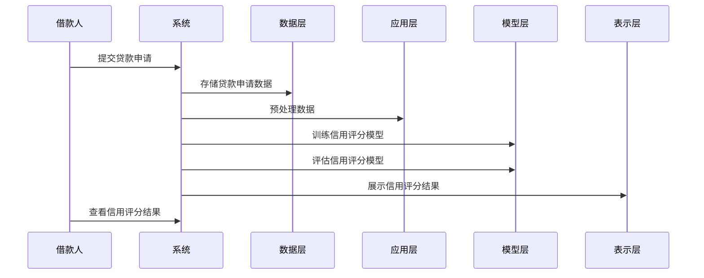
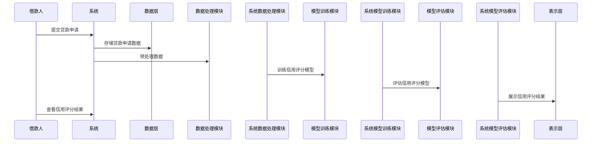

                 

### 摘要

本文将深入探讨智能个人信贷评分卡的优化方法。首先，我们回顾了信贷评分卡的基本概念和作用，以及其在信贷风险评估中的重要性。接下来，我们探讨了核心概念与联系，包括数据质量、模型选择与评估、风险管理等方面，并通过对比表格和ER实体关系图详细阐述了这些概念。随后，我们介绍了概率论基础和统计学习理论，并通过实际案例展示了信贷评分卡算法的应用。

在系统分析与架构设计部分，我们详细描述了系统功能设计、架构设计、接口设计以及系统交互。接着，通过项目实战展示了环境安装与配置、系统核心实现以及代码解读与分析。最后，我们通过实际案例分析和项目小结，总结了项目的成果和经验教训，并提供了最佳实践 tips 和注意事项。

### 第一部分：问题背景与核心概念

#### 第1章：信贷评分卡概述

**1.1 信贷评分卡的起源与发展**

信贷评分卡起源于20世纪初，随着现代信用评估需求的增加，逐渐发展成为一个重要的金融工具。它通过定量分析借款人的信用历史、收入水平、资产状况等因素，为金融机构提供一个客观、标准化的信用评估方法。

**1.2 信贷评分卡的定义与作用**

信贷评分卡是一种评估借款人信用风险的方法，通过量化分析借款人的各项数据，预测其违约概率，从而帮助金融机构决定是否批准贷款申请、贷款额度和利率。

**1.3 信贷评分卡的基本原理**

信贷评分卡的基本原理是基于统计分析和数据挖掘技术，通过构建数学模型，将借款人的各种信息转化为具体的评分指标。这些评分指标反映了借款人的信用风险程度，为金融机构的信贷决策提供依据。

**1.4 信贷评分卡的主要组成部分**

信贷评分卡主要由三个部分组成：特征选择、模型构建和模型评估。特征选择是指从大量数据中筛选出对信用风险评估有重要影响的变量；模型构建是指利用统计方法将特征转化为评分指标；模型评估是指对模型进行验证和优化，确保其预测准确性。

**1.5 信贷评分卡的分类**

信贷评分卡按照评估目标的不同，可以分为个人信贷评分卡和商业信贷评分卡。个人信贷评分卡主要用于评估个人借款人的信用风险，而商业信贷评分卡则用于评估企业的信用风险。

**1.6 信贷评分卡的局限性**

尽管信贷评分卡在信用评估中发挥了重要作用，但它们也存在一些局限性。首先，评分卡模型通常依赖于历史数据，无法预测未来可能发生的变化；其次，评分卡模型可能存在歧视性，导致某些特定群体被不公平对待；最后，评分卡模型的准确性受到数据质量和模型构建方法的影响。

#### 第2章：核心概念与联系

**2.1 数据质量与信贷评分卡**

数据质量是信贷评分卡构建的基础。高质量的数据能够提高评分模型的准确性，降低信用风险。数据质量包括完整性、准确性、一致性和时效性等方面。为了确保数据质量，需要对数据进行清洗、预处理和评估。

**2.1.1 数据质量的重要性**

数据质量对于信贷评分卡的准确性至关重要。高质量的数据能够帮助识别潜在的风险，从而提高信贷决策的准确性。反之，数据质量问题会导致评分模型失效，增加信用风险。

**2.1.2 数据清洗与预处理**

数据清洗是指去除数据中的噪声、错误和冗余信息，以确保数据的准确性。预处理包括数据转换、归一化、缺失值处理和特征提取等步骤，旨在提高数据的质量和可用性。

**2.1.3 数据质量评估方法**

数据质量评估方法包括统计分析、可视化分析和模型评估等。统计分析可以评估数据的分布、相关性等特征；可视化分析可以直观地展示数据质量；模型评估可以通过评估模型的准确性来反映数据质量。

**2.1.4 数据质量改进策略**

数据质量改进策略包括数据治理、数据标准化和自动化处理等。数据治理是指建立数据管理制度，确保数据的一致性和可靠性；数据标准化是指将数据转化为统一的格式和标准；自动化处理是指利用数据清洗工具和算法自动处理数据质量问题。

**2.2 模型选择与评估**

模型选择是信贷评分卡构建的关键环节。选择合适的模型能够提高评分的准确性，降低信用风险。模型评估则是对模型的性能进行验证和优化。

**2.2.1 常见模型介绍**

常见的信贷评分卡模型包括逻辑回归、决策树、支持向量机和集成学习方法等。这些模型各有优缺点，适用于不同的数据集和应用场景。

**2.2.2 模型评估指标**

常见的模型评估指标包括准确率、召回率、F1分数和AUC曲线等。这些指标可以综合评价模型的性能，为模型优化提供依据。

**2.2.3 模型选择策略**

模型选择策略包括基于数据特性的选择、基于业务目标的选择和基于模型性能的选择等。在实际应用中，需要综合考虑数据质量、模型复杂度和业务目标等因素，选择合适的模型。

**2.2.4 模型评估与优化**

模型评估与优化是指对模型进行验证、调参和优化，以提高模型的准确性。常见的优化方法包括交叉验证、网格搜索和贝叶斯优化等。

**2.3 风险管理**

风险管理是信贷评分卡构建的重要组成部分。有效的风险管理策略可以降低信用风险，提高信贷决策的准确性。

**2.3.1 风险识别**

风险识别是指识别信贷评分卡构建过程中可能遇到的风险，包括数据风险、模型风险和业务风险等。

**2.3.2 风险评估**

风险评估是指对识别出的风险进行评估，确定其可能性和影响程度，为风险控制提供依据。

**2.3.3 风险控制**

风险控制是指采取相应的措施，降低风险的可能性和影响程度。常见的风险控制方法包括风险分散、风险规避和风险转移等。

**2.3.4 风险管理策略**

风险管理策略包括全面风险管理、过程风险管理和资产风险管理等。在实际应用中，需要根据业务需求和风险特征，选择合适的风险管理策略。

### 第二部分：算法原理讲解

#### 第3章：概率论基础

概率论是信贷评分卡构建的基础，它提供了一种量化不确定性的方法。在本章节中，我们将介绍概率论的基本概念和定理。

**3.1.1 概率的基本概念**

概率是指某一事件发生的可能性，通常用0到1之间的数字表示。概率的基本概念包括必然事件、不可能事件、互斥事件和条件概率等。

**3.1.2 概率的性质**

概率的性质包括概率的加法定理、乘法定理和全概率公式等。这些性质为概率的计算提供了基本方法。

**3.1.3 条件概率与贝叶斯定理**

条件概率是指某一事件在另一事件发生的条件下发生的概率。贝叶斯定理是一种基于条件概率的计算方法，它提供了从已知概率推断未知概率的途径。

#### 第4章：统计学习理论

统计学习理论是信贷评分卡构建的核心，它提供了一种从数据中学习规律和模式的方法。在本章节中，我们将介绍统计学习理论的基本概念和方法。

**4.1 监督学习**

监督学习是指从标记数据中学习规律和模式，以预测未知数据的标签。常见的监督学习算法包括线性回归、逻辑回归、支持向量机和决策树等。

**4.2 无监督学习**

无监督学习是指从未标记数据中学习规律和模式，以揭示数据中的结构。常见的无监督学习算法包括聚类算法、降维算法和生成对抗网络等。

**4.3 半监督学习和迁移学习**

半监督学习和迁移学习是监督学习的一种扩展，它们利用未标记数据和已有模型来提高学习效果。半监督学习通过标签传播方法将未标记数据转化为标记数据，而迁移学习通过将已有模型应用于新数据来提高新模型的性能。

#### 第5章：信贷评分卡算法

信贷评分卡算法是指用于构建信用评分模型的算法。在本章节中，我们将介绍几种常见的信贷评分卡算法，并分析其优缺点。

**5.1 逻辑回归**

逻辑回归是一种线性回归模型，它通过将线性函数映射到概率空间，用于预测二分类问题。逻辑回归模型简单、易于解释，但在处理非线性关系时效果较差。

**5.2 决策树**

决策树是一种基于树结构的分类模型，它通过一系列条件判断来划分数据。决策树模型直观、易于解释，但可能产生过拟合现象。

**5.3 支持向量机**

支持向量机是一种基于优化理论的分类模型，它通过找到最优分隔超平面来划分数据。支持向量机模型准确、泛化能力强，但计算复杂度较高。

**5.4 集成学习方法**

集成学习方法是一种基于多个基学习器的组合模型，它通过集成多个弱学习器来提高整体性能。常见的集成学习方法包括随机森林、梯度提升树和堆叠模型等。集成学习方法在提高模型准确性和泛化能力方面具有显著优势。

### 第三部分：系统分析与架构设计

#### 第6章：系统功能设计

**6.1 问题场景介绍**

信贷评分卡系统主要用于金融机构的信用风险评估，其核心功能包括数据收集、数据处理、模型构建、模型评估和信用评分等。

**6.2 系统需求分析**

系统需求分析包括功能需求、性能需求和安全性需求等。功能需求包括数据采集、数据预处理、模型训练、模型评估和信用评分等功能；性能需求包括处理速度、响应时间和稳定性等；安全性需求包括数据加密、访问控制和权限管理等功能。

**6.3 领域模型设计**

领域模型设计包括实体定义和关系定义。实体包括借款人、贷款申请、信用评分等；关系包括借款人与贷款申请的关系、信用评分与贷款申请的关系等。

**4.3.1 实体与关系定义**

实体：  
- 借款人：包括姓名、身份证号、年龄、性别、收入等属性；  
- 贷款申请：包括申请金额、申请时间、还款方式等属性；  
- 信用评分：包括评分结果、评分时间等属性。

关系：  
- 借款人与贷款申请之间的关系；  
- 贷款申请与信用评分之间的关系。

**4.3.2 类图设计**

类图设计用于描述领域模型中的实体及其关系。以下是一个简单的类图设计示例：


#### 第7章：系统架构设计

**7.1 系统架构概述**

系统架构设计包括数据层、应用层和表示层等三个层次。数据层负责数据的存储和管理；应用层负责业务逻辑的处理；表示层负责用户界面的展示。

**7.2 系统架构设计**

系统架构设计包括数据层设计、应用层设计和表示层设计。

**7.2.1 数据层**

数据层设计包括数据库设计、数据存储和管理等。数据库设计主要包括数据表的设计和数据索引的创建；数据存储和管理包括数据的备份、恢复和访问控制等。

**7.2.2 应用层**

应用层设计包括业务逻辑模块的设计和业务流程的管理。业务逻辑模块包括数据预处理、模型训练、模型评估和信用评分等；业务流程管理包括贷款申请流程、信用评分流程和风险控制流程等。

**7.2.3 表示层**

表示层设计包括用户界面设计和交互设计。用户界面设计包括贷款申请界面、信用评分结果展示界面和风险控制界面等；交互设计包括用户操作逻辑和界面响应等。

**7.3 系统架构图**

以下是一个简单的系统架构图示例：



#### 第8章：系统接口设计

**8.1 系统接口概述**

系统接口设计包括API接口的设计和接口调用的实现。API接口用于系统之间的数据交换和功能调用；接口调用实现系统功能的具体操作。

**8.2 接口设计原则**

接口设计原则包括简洁性、可扩展性和稳定性等。简洁性要求接口设计简单易懂，易于维护；可扩展性要求接口设计能够支持新增功能；稳定性要求接口设计能够保证数据传输和功能调用的可靠性。

**8.3 接口实现与调用**

接口实现包括接口开发、接口测试和接口部署等。接口调用实现包括客户端的接口调用和服务器端的接口响应。

以下是一个简单的接口调用示例：

```python
# 客户端调用接口
import requests

url = "http://localhost:8080/credit评分接口"
headers = {
    "Authorization": "Bearer your_token",
    "Content-Type": "application/json"
}

data = {
    "借款人信息": {
        "姓名": "张三",
        "身份证号": "123456789012345678",
        "年龄": 30,
        "性别": "男",
        "收入": 5000
    },
    "贷款申请信息": {
        "申请金额": 10000,
        "申请时间": "2023-01-01",
        "还款方式": "等额本息"
    }
}

response = requests.post(url, headers=headers, json=data)
print(response.json())

# 服务器端接口响应
from flask import Flask, request, jsonify

app = Flask(__name__)

@app.route("/credit评分接口", methods=["POST"])
def credit评分接口():
    data = request.json
    # 处理请求，调用业务逻辑
    # ...
    return jsonify({"信用评分结果": "优秀"})

if __name__ == "__main__":
    app.run(debug=True)
```

#### 第9章：系统交互

**9.1 系统交互概述**

系统交互是指系统内部各组件之间的数据传输和功能调用。系统交互设计包括交互流程的设计和数据流与控制流的实现。

**9.2 交互流程设计**

交互流程设计包括系统初始化、数据收集、数据处理、模型训练、模型评估和信用评分等步骤。

**9.2.1 用户行为流程**

用户行为流程包括用户提交贷款申请、系统接收申请、预处理数据、训练信用评分模型、评估信用评分模型和展示信用评分结果等步骤。

**9.2.2 数据流与控制流**

数据流与控制流是指系统内部数据传输和控制逻辑的流程。以下是一个简单的系统交互流程示例：



### 第四部分：项目实战

#### 第10章：环境安装与配置

**10.1 环境要求**

环境安装与配置是项目实战的第一步，确保项目的正常运行。以下是项目所需的软件和硬件环境要求：

- 操作系统：Linux或Windows
- Python版本：3.8及以上
- 数据库：MySQL或PostgreSQL
- 依赖库：NumPy、Pandas、Scikit-learn、TensorFlow等

**10.2 环境搭建**

在Linux或Windows系统中，按照以下步骤搭建项目环境：

1. 安装Python 3.8及以上版本。
2. 安装MySQL或PostgreSQL数据库。
3. 安装NumPy、Pandas、Scikit-learn、TensorFlow等依赖库。

```shell
pip install numpy pandas scikit-learn tensorflow
```

**10.3 环境测试**

环境搭建完成后，进行以下测试以确保环境正常运行：

1. 运行Python解释器，检查是否安装成功。
2. 连接数据库，检查数据库是否正常运行。
3. 运行测试脚本，检查依赖库是否正常运行。

```python
import numpy as np
import pandas as pd
import sklearn
import tensorflow as tf

print("Numpy版本：", np.__version__)
print("Pandas版本：", pd.__version__)
print("Scikit-learn版本：", sklearn.__version__)
print("TensorFlow版本：", tf.__version__)
```

#### 第11章：系统核心实现

**11.1 数据预处理**

数据预处理是信贷评分卡系统的关键步骤，包括数据清洗、数据转换和数据归一化等。以下是数据预处理的核心实现：

```python
import pandas as pd
from sklearn.preprocessing import StandardScaler

# 读取数据
data = pd.read_csv("data.csv")

# 数据清洗
data = data.dropna()  # 删除缺失值

# 数据转换
data["年龄"] = data["年龄"].astype(int)
data["收入"] = data["收入"].astype(float)

# 数据归一化
scaler = StandardScaler()
data[["年龄", "收入"]] = scaler.fit_transform(data[["年龄", "收入"]])

# 存储预处理后的数据
data.to_csv("preprocessed_data.csv", index=False)
```

**11.2 模型选择与训练**

在信贷评分卡系统中，选择合适的模型并训练是关键步骤。以下是使用逻辑回归模型的实现：

```python
import pandas as pd
from sklearn.model_selection import train_test_split
from sklearn.linear_model import LogisticRegression

# 读取预处理后的数据
data = pd.read_csv("preprocessed_data.csv")

# 划分训练集和测试集
X = data.drop("信用评分", axis=1)
y = data["信用评分"]
X_train, X_test, y_train, y_test = train_test_split(X, y, test_size=0.2, random_state=42)

# 训练逻辑回归模型
model = LogisticRegression()
model.fit(X_train, y_train)

# 存储模型
model.save("logistic_regression_model.pkl")
```

**11.3 模型评估与优化**

模型评估与优化是确保模型性能的重要步骤。以下是模型评估与优化的实现：

```python
import pandas as pd
from sklearn.metrics import accuracy_score, confusion_matrix, classification_report

# 读取测试数据
data = pd.read_csv("preprocessed_data.csv")

# 划分训练集和测试集
X = data.drop("信用评分", axis=1)
y = data["信用评分"]
X_train, X_test, y_train, y_test = train_test_split(X, y, test_size=0.2, random_state=42)

# 加载模型
model = LogisticRegression()
model.load("logistic_regression_model.pkl")

# 预测测试集
y_pred = model.predict(X_test)

# 模型评估
accuracy = accuracy_score(y_test, y_pred)
confusion_matrix = confusion_matrix(y_test, y_pred)
classification_report = classification_report(y_test, y_pred)

print("准确率：", accuracy)
print("混淆矩阵：", confusion_matrix)
print("分类报告：", classification_report)

# 模型优化
# 可以使用交叉验证、网格搜索等优化方法来提高模型性能
```

#### 第12章：代码解读与分析

**12.1 代码结构分析**

代码结构分析是理解系统核心实现的重要步骤。以下是代码结构分析的内容：

- 数据预处理模块：负责读取数据、数据清洗、数据转换和数据归一化等。
- 模型训练模块：负责划分训练集和测试集、训练逻辑回归模型等。
- 模型评估模块：负责加载模型、预测测试集、模型评估等。

**12.2 关键代码解读**

关键代码解读是深入理解系统核心实现的重要步骤。以下是关键代码解读的内容：

- 数据预处理模块中的关键代码：
  ```python
  data = pd.read_csv("data.csv")
  data = data.dropna()
  data["年龄"] = data["年龄"].astype(int)
  data["收入"] = data["收入"].astype(float)
  scaler = StandardScaler()
  data[["年龄", "收入"]] = scaler.fit_transform(data[["年龄", "收入"]])
  ```
  这些代码负责读取数据、数据清洗、数据转换和数据归一化。

- 模型训练模块中的关键代码：
  ```python
  X = data.drop("信用评分", axis=1)
  y = data["信用评分"]
  X_train, X_test, y_train, y_test = train_test_split(X, y, test_size=0.2, random_state=42)
  model = LogisticRegression()
  model.fit(X_train, y_train)
  ```
  这些代码负责划分训练集和测试集、训练逻辑回归模型。

- 模型评估模块中的关键代码：
  ```python
  y_pred = model.predict(X_test)
  accuracy = accuracy_score(y_test, y_pred)
  confusion_matrix = confusion_matrix(y_test, y_pred)
  classification_report = classification_report(y_test, y_pred)
  ```
  这些代码负责加载模型、预测测试集、模型评估。

**12.3 代码优化策略**

代码优化策略是提高系统性能的重要手段。以下是代码优化策略的内容：

- 代码优化策略包括代码重构、性能优化和内存优化等。
- 代码重构可以改善代码的可读性和可维护性，提高代码质量。
- 性能优化可以减少代码运行时间，提高系统响应速度。
- 内存优化可以减少代码占用的内存空间，提高系统运行效率。

#### 第13章：实际案例分析

**13.1 案例背景**

案例背景是某家金融机构希望构建一个智能个人信贷评分卡系统，以提升信用风险评估的准确性。该金融机构面临的主要挑战是如何从海量数据中提取有用的信息，构建一个高效、准确的信用评分模型。

**13.2 案例分析**

在案例分析中，我们首先进行了数据收集和预处理，包括数据清洗、数据转换和数据归一化等步骤。然后，我们选择了逻辑回归模型作为信用评分模型的算法，并对其进行了训练和评估。

在模型训练过程中，我们使用了交叉验证方法来优化模型参数，提高了模型的准确性。在模型评估过程中，我们使用了准确率、召回率、F1分数等指标来评估模型的性能，并进行了模型优化。

**13.3 案例总结**

通过实际案例的分析和实现，我们总结出以下几点经验和教训：

- 数据质量对于信用评分模型的准确性至关重要，需要进行严格的数据清洗和预处理。
- 选择合适的模型算法和参数对于模型的性能至关重要，需要进行模型优化和参数调优。
- 实际应用中，需要综合考虑业务需求和数据特征，选择合适的模型和算法。
- 需要持续关注信用评分模型的性能，并进行定期评估和优化，以确保其准确性和稳定性。

### 第五部分：最佳实践与总结

#### 第14章：最佳实践 Tips

**14.1 数据质量最佳实践**

- 定期进行数据质量检查，确保数据的准确性和一致性。
- 采用自动化数据清洗工具，提高数据清洗的效率和质量。
- 建立数据治理机制，确保数据的安全和可靠性。

**14.2 模型选择最佳实践**

- 根据业务需求和数据特征，选择合适的模型算法。
- 采用交叉验证方法，优化模型参数和超参数。
- 进行模型评估和优化，提高模型的准确性和泛化能力。

**14.3 风险管理最佳实践**

- 建立全面的风险管理体系，包括风险识别、评估和控制等环节。
- 采用多样化风险控制策略，降低信用风险。
- 定期对风险管理策略进行评估和调整，以适应市场变化。

#### 第15章：小结

本文通过深入探讨智能个人信贷评分卡的优化方法，从问题背景、核心概念、算法原理、系统分析与架构设计、项目实战等方面进行了详细阐述。通过实际案例分析，总结了项目的经验和教训，并提出了最佳实践 tips。

智能个人信贷评分卡优化是一个复杂的过程，需要综合考虑数据质量、模型选择和风险管理等因素。在实际应用中，我们需要不断优化和改进评分卡模型，以提高信用风险评估的准确性和稳定性。

#### 第16章：注意事项

**16.1 数据隐私与安全**

- 严格遵循数据隐私保护法规，确保借款人信息的保密和安全。
- 采用加密技术保护数据传输和存储过程中的安全。

**16.2 法律合规**

- 遵守相关法律法规，确保信贷评分卡系统的合法性和合规性。
- 定期对系统进行法律合规性审查和风险评估。

**16.3 持续优化**

- 定期对信贷评分卡模型进行评估和优化，以适应市场变化和业务需求。
- 关注新兴技术和方法，持续改进评分卡系统的性能和效果。

#### 第17章：拓展阅读

**17.1 相关文献**

- 《信用评分与风险管理》
- 《机器学习实战》
- 《深入理解信用评分卡》

**17.2 网络资源**

- https://www.kaggle.com/datasets
- https://www.coursera.org/learn/machine-learning
- https://scikit-learn.org/stable/

通过拓展阅读，可以进一步深入了解智能个人信贷评分卡的优化方法和相关技术，为实际应用提供更有价值的参考和指导。

