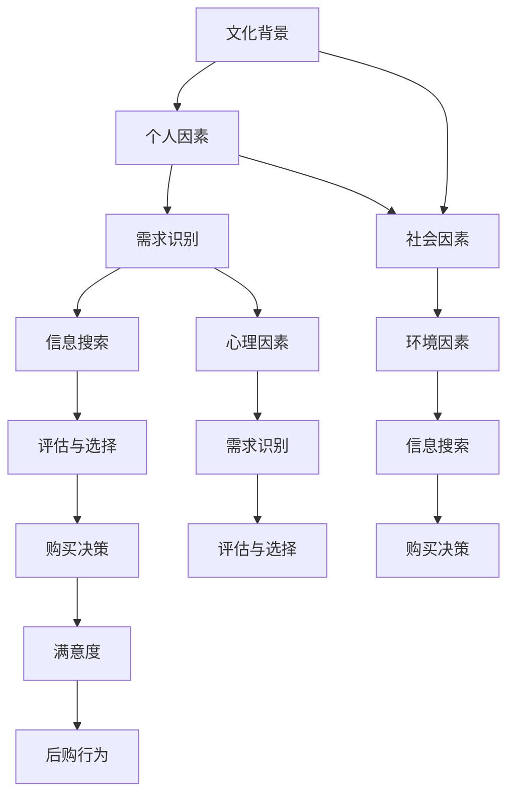
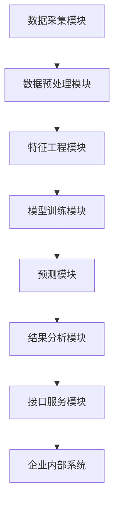
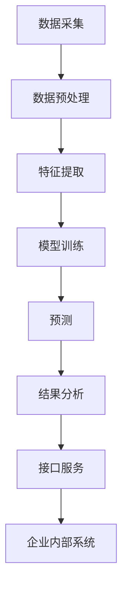

                 

### 《智能个人消费行为分析与预测》

智能个人消费行为分析与预测是一个具有广泛实际应用和学术研究价值的领域。随着人工智能和大数据技术的发展，通过对个人消费行为的深入分析和预测，不仅可以帮助企业更精准地定位客户需求，优化营销策略，还能为消费者提供更加个性化的服务体验。本文将围绕智能个人消费行为分析与预测这一主题，进行系统的探讨和梳理。

关键词：智能消费行为、数据分析、预测模型、人工智能、消费者个性化服务

#### 摘要

本文首先介绍了智能个人消费行为分析与预测的背景和重要性，随后阐述了相关核心概念与理论基础，包括消费行为的定义、驱动因素、智能消费行为分析的方法和预测模型。接着，文章详细讲解了数据处理与分析方法，包括数据收集、预处理、特征工程和模型构建。随后，通过项目实战和案例分析，展示了智能个人消费行为分析与预测的实际应用效果。最后，文章总结了主要结论，并对未来的研究方向和前景进行了展望。

#### 目录

1. 引言与背景
    - 1.1 书籍主题介绍
    - 1.1.1 智能个人消费行为的重要性
    - 1.1.2 消费行为分析的市场需求
    - 1.1.3 书籍的目标与读者群体
    - 1.2 研究背景与现状
    - 1.2.1 个人消费行为研究的历史与发展
    - 1.2.2 智能消费行为分析的应用领域
    - 1.2.3 当前面临的挑战与机遇
    - 1.3 书籍结构概述
    - 1.3.1 目录结构安排
    - 1.3.2 主要内容概述
    - 1.3.3 读者如何受益

2. 核心概念与理论基础
    - 2.1 个人消费行为基本概念
    - 2.1.1 消费行为的定义与特征
    - 2.1.2 消费行为的驱动因素
    - 2.1.3 消费行为模型
    - 2.2 智能消费行为分析
    - 2.2.1 智能消费行为的定义
    - 2.2.2 智能消费行为分析的方法
    - 2.2.3 智能消费行为分析的优势
    - 2.3 数据分析与预测基础
    - 2.3.1 数据分析的基本概念
    - 2.3.2 预测模型的选择与评估
    - 2.3.3 数据挖掘与机器学习技术
    - 2.4 关键技术简介
    - 2.4.1 人工智能技术概述
    - 2.4.2 自然语言处理技术
    - 2.4.3 计算机视觉技术

3. 数据处理与分析方法
    - 3.1 数据收集与预处理
    - 3.1.1 数据来源
    - 3.1.2 数据质量评估
    - 3.1.3 数据清洗与转换
    - 3.2 特征工程
    - 3.2.1 特征提取
    - 3.2.2 特征选择
    - 3.2.3 特征降维
    - 3.3 模型构建与训练
    - 3.3.1 算法选择
    - 3.3.2 模型训练与优化
    - 3.3.3 模型评估与调整
    - 3.4 预测与优化
    - 3.4.1 预测方法
    - 3.4.2 预测结果分析与解释
    - 3.4.3 预测模型的优化策略

4. 项目实战与案例分析
    - 4.1 项目介绍
    - 4.1.1 项目背景
    - 4.1.2 项目目标
    - 4.1.3 项目挑战
    - 4.2 系统设计与实现
    - 4.2.1 系统架构设计
    - 4.2.2 数据流设计
    - 4.2.3 关键模块实现
    - 4.3 案例分析
    - 4.3.1 案例背景
    - 4.3.2 模型构建与预测
    - 4.3.3 结果分析与讨论
    - 4.4 项目总结与反思
    - 4.4.1 项目成果
    - 4.4.2 面临的问题与解决
    - 4.4.3 项目启示与展望

5. 结论与未来展望
    - 5.1 主要结论
    - 5.1.1 智能消费行为分析的重要性
    - 5.1.2 当前研究的主要发现
    - 5.1.3 未来的研究方向
    - 5.2 未来展望
    - 5.2.1 技术发展趋势
    - 5.2.2 市场前景
```markdown
----------------------------------------------------------------
## 1. 引言与背景

### 1.1 书籍主题介绍

《智能个人消费行为分析与预测》是一本专注于智能消费行为分析和预测领域的专业书籍。随着大数据和人工智能技术的飞速发展，个人消费行为分析已经成为市场研究和商业决策的重要工具。本书旨在深入探讨如何运用先进的技术手段，对个人消费行为进行系统分析，并预测未来的消费趋势。

在当今全球化、信息化的背景下，消费者的购买决策越来越复杂，不再仅仅依赖于传统的市场调研和统计分析方法。智能消费行为分析通过整合多种数据源，运用机器学习和深度学习等技术，能够挖掘出消费者行为背后的规律和模式，为企业提供更加精准的市场洞察和决策支持。这不仅有助于企业优化产品和服务，提高客户满意度，还能有效地提升市场竞争力和盈利能力。

### 1.1.1 智能个人消费行为的重要性

智能个人消费行为分析的重要性主要体现在以下几个方面：

1. **提升营销效率**：通过智能分析，企业可以了解消费者的购买动机、偏好和习惯，从而制定更加精准的营销策略，提高营销活动的效果和回报率。

2. **优化产品和服务**：了解消费者的需求和反馈，企业可以及时调整产品和服务，更好地满足消费者的期望，提升产品和服务的竞争力。

3. **降低营销成本**：智能分析能够帮助企业识别最有潜力的客户群体，优化营销资源投入，降低营销成本。

4. **个性化服务**：基于智能分析，企业可以为消费者提供个性化的产品推荐、定制化服务，提升消费者的购物体验和忠诚度。

5. **预测消费趋势**：通过分析历史数据和实时数据，企业可以预测未来的消费趋势，提前布局市场，抓住市场机会。

### 1.1.2 消费行为分析的市场需求

随着消费者行为的不断变化和多元化，消费行为分析在市场中的需求日益增长。具体体现在以下几个方面：

1. **零售行业**：零售企业需要通过消费行为分析来优化库存管理、商品陈列和销售策略，提升销售额和客户满意度。

2. **电子商务**：电商平台需要通过消费行为分析来优化推荐系统、广告投放和用户行为分析，提高用户转化率和购买率。

3. **金融行业**：金融机构需要通过消费行为分析来评估客户风险、优化贷款审批流程和产品设计，降低坏账率和风险。

4. **快消品行业**：快消品企业需要通过消费行为分析来了解市场趋势、消费者偏好和竞争状况，制定有效的市场策略。

5. **餐饮行业**：餐饮企业需要通过消费行为分析来优化菜单设计、就餐体验和营销活动，提升客户满意度和复购率。

### 1.1.3 书籍的目标与读者群体

本书的目标是帮助读者深入了解智能个人消费行为分析与预测的理论和实践，培养读者在消费行为分析领域的技术能力和应用能力。具体目标如下：

1. **理论知识的掌握**：读者将学习到消费行为分析的基本概念、理论框架和核心方法。

2. **技术能力的培养**：读者将掌握数据处理、特征工程、机器学习等关键技术，能够运用到实际项目中。

3. **实战能力的提升**：通过实际案例分析和项目实战，读者将学会如何运用智能分析技术解决实际问题。

4. **创新思维的激发**：本书将激发读者在消费行为分析领域的创新思维，引导读者探索未来的发展方向。

本书适合以下读者群体：

1. **数据分析从业者**：希望通过智能分析技术提升工作能力的从业者。

2. **市场营销人员**：需要了解消费者行为，优化营销策略的市场营销人员。

3. **产品经理**：需要基于消费者需求优化产品和服务的产品经理。

4. **学术研究人员**：对消费行为分析和智能技术感兴趣的学术研究人员。

### 1.2 研究背景与现状

#### 1.2.1 个人消费行为研究的历史与发展

个人消费行为研究起源于20世纪中期，随着经济学、心理学和社会学等领域的发展，消费行为研究逐渐成为一门独立的学科。早期的研究主要关注消费者的购买决策过程和行为模式，通过实验和问卷调查等方法收集数据，分析消费者行为的规律和影响因素。

随着信息技术和大数据技术的发展，个人消费行为研究进入了新的阶段。近年来，智能消费行为分析技术迅速崛起，成为消费行为研究的重要工具。智能消费行为分析不仅能够处理海量数据，还能够挖掘出复杂的行为模式，为企业和消费者提供更深入的分析和预测。

#### 1.2.2 智能消费行为分析的应用领域

智能消费行为分析在多个应用领域中取得了显著成果：

1. **市场营销**：通过分析消费者行为，企业可以制定更加精准的营销策略，提高营销效果。

2. **电子商务**：电商平台利用智能消费行为分析技术，优化推荐系统、广告投放和用户行为分析，提升用户体验和购买率。

3. **金融行业**：金融机构利用智能消费行为分析技术，评估客户风险、优化贷款审批流程和产品设计，降低坏账率和风险。

4. **零售行业**：零售企业通过智能消费行为分析，优化库存管理、商品陈列和销售策略，提升销售额和客户满意度。

5. **餐饮行业**：餐饮企业通过智能消费行为分析，优化菜单设计、就餐体验和营销活动，提升客户满意度和复购率。

#### 1.2.3 当前面临的挑战与机遇

尽管智能消费行为分析技术取得了显著进展，但当前仍然面临一些挑战和机遇：

1. **数据质量与隐私保护**：海量数据的收集和处理过程中，数据质量是一个重要问题。同时，如何保护消费者的隐私，也是智能消费行为分析面临的一大挑战。

2. **技术成熟度与应用效果**：尽管智能消费行为分析技术已经取得一定成果，但其在实际应用中的成熟度和效果仍有待提高。

3. **跨学科融合**：智能消费行为分析涉及多个学科领域，如经济学、心理学、计算机科学等。跨学科融合将有助于解决当前面临的挑战，推动该领域的发展。

4. **政策法规**：随着智能消费行为分析技术的发展，相关政策和法规也需要不断完善，以保障企业和消费者的权益。

#### 1.3 书籍结构概述

本书分为五个主要部分，结构如下：

1. **引言与背景**：介绍书籍的主题、重要性、市场需求和目标读者群体。

2. **核心概念与理论基础**：阐述个人消费行为的基本概念、智能消费行为分析的方法和预测模型。

3. **数据处理与分析方法**：介绍数据处理与分析的关键技术，包括数据收集、预处理、特征工程和模型构建。

4. **项目实战与案例分析**：通过实际项目和案例分析，展示智能消费行为分析与预测的应用效果。

5. **结论与未来展望**：总结主要发现，探讨未来的研究方向和前景。

通过本书的阅读，读者将能够全面了解智能个人消费行为分析与预测的理论基础和实践应用，提升在相关领域的专业能力和创新能力。

### 1.3.1 目录结构安排

本书的目录结构安排旨在确保读者能够系统、有序地学习和掌握智能个人消费行为分析与预测的理论和实践。以下是详细的目录结构安排：

- **第一部分：引言与背景**
  - 1.1 书籍主题介绍
  - 1.1.1 智能个人消费行为的重要性
  - 1.1.2 消费行为分析的市场需求
  - 1.1.3 书籍的目标与读者群体
  - 1.2 研究背景与现状
  - 1.2.1 个人消费行为研究的历史与发展
  - 1.2.2 智能消费行为分析的应用领域
  - 1.2.3 当前面临的挑战与机遇
  - 1.3 书籍结构概述
  - 1.3.1 目录结构安排
  - 1.3.2 主要内容概述
  - 1.3.3 读者如何受益

- **第二部分：核心概念与理论基础**
  - 2.1 个人消费行为基本概念
  - 2.1.1 消费行为的定义与特征
  - 2.1.2 消费行为的驱动因素
  - 2.1.3 消费行为模型
  - 2.2 智能消费行为分析
  - 2.2.1 智能消费行为的定义
  - 2.2.2 智能消费行为分析的方法
  - 2.2.3 智能消费行为分析的优势
  - 2.3 数据分析与预测基础
  - 2.3.1 数据分析的基本概念
  - 2.3.2 预测模型的选择与评估
  - 2.3.3 数据挖掘与机器学习技术
  - 2.4 关键技术简介
  - 2.4.1 人工智能技术概述
  - 2.4.2 自然语言处理技术
  - 2.4.3 计算机视觉技术

- **第三部分：数据处理与分析方法**
  - 3.1 数据收集与预处理
  - 3.1.1 数据来源
  - 3.1.2 数据质量评估
  - 3.1.3 数据清洗与转换
  - 3.2 特征工程
  - 3.2.1 特征提取
  - 3.2.2 特征选择
  - 3.2.3 特征降维
  - 3.3 模型构建与训练
  - 3.3.1 算法选择
  - 3.3.2 模型训练与优化
  - 3.3.3 模型评估与调整
  - 3.4 预测与优化
  - 3.4.1 预测方法
  - 3.4.2 预测结果分析与解释
  - 3.4.3 预测模型的优化策略

- **第四部分：项目实战与案例分析**
  - 4.1 项目介绍
  - 4.1.1 项目背景
  - 4.1.2 项目目标
  - 4.1.3 项目挑战
  - 4.2 系统设计与实现
  - 4.2.1 系统架构设计
  - 4.2.2 数据流设计
  - 4.2.3 关键模块实现
  - 4.3 案例分析
  - 4.3.1 案例背景
  - 4.3.2 模型构建与预测
  - 4.3.3 结果分析与讨论
  - 4.4 项目总结与反思
  - 4.4.1 项目成果
  - 4.4.2 面临的问题与解决
  - 4.4.3 项目启示与展望

- **第五部分：结论与未来展望**
  - 5.1 主要结论
  - 5.1.1 智能消费行为分析的重要性
  - 5.1.2 当前研究的主要发现
  - 5.1.3 未来的研究方向
  - 5.2 未来展望
  - 5.2.1 技术发展趋势
  - 5.2.2 市场前景

通过这样的目录结构，读者可以系统地了解智能个人消费行为分析与预测的理论和实践，逐步深入每个主题，掌握关键技术和方法，并能够通过实际项目和案例分析，提升自己的应用能力和创新思维。

### 1.3.2 主要内容概述

《智能个人消费行为分析与预测》这本书的主要内容可以分为以下几个部分，每个部分都有其独特的重点和目标，以下是对各个部分的详细概述：

#### 第一部分：引言与背景

本部分主要介绍了书籍的主题、目标读者、市场需求以及研究背景。通过这部分内容，读者可以了解到智能个人消费行为分析与预测的重要性，以及该领域在当前市场中的需求和应用。

- **1.1 书籍主题介绍**：介绍智能个人消费行为分析与预测的基本概念，解释为什么这项技术具有重要意义。
- **1.1.1 智能个人消费行为的重要性**：阐述智能消费行为分析对于企业营销和消费者个性化服务的重要性。
- **1.1.2 消费行为分析的市场需求**：分析消费行为分析在各个行业中的应用，以及其对企业决策的支持作用。
- **1.1.3 书籍的目标与读者群体**：明确本书的目标，以及适合阅读的读者群体。
- **1.2 研究背景与现状**：回顾个人消费行为研究的历程，介绍智能消费行为分析的应用领域和面临的挑战。
- **1.2.1 个人消费行为研究的历史与发展**：梳理消费行为研究的发展历程，了解该领域的理论基础。
- **1.2.2 智能消费行为分析的应用领域**：探讨智能消费行为分析在市场营销、电子商务、金融、零售和餐饮等行业的应用。
- **1.2.3 当前面临的挑战与机遇**：分析当前智能消费行为分析领域面临的挑战和未来的机遇。

#### 第二部分：核心概念与理论基础

本部分详细介绍了个人消费行为的基本概念、智能消费行为分析的方法和预测模型。这部分内容旨在帮助读者建立扎实的理论基础，理解智能消费行为分析的核心概念。

- **2.1 个人消费行为基本概念**：定义消费行为，解释其特征和驱动因素，介绍消费行为模型。
- **2.1.1 消费行为的定义与特征**：阐述消费行为的定义，描述其基本特征。
- **2.1.2 消费行为的驱动因素**：分析影响消费者购买决策的各种因素。
- **2.1.3 消费行为模型**：介绍几种常见的消费行为模型，解释其结构和应用。
- **2.2 智能消费行为分析**：定义智能消费行为分析，介绍其方法和优势。
- **2.2.1 智能消费行为的定义**：解释智能消费行为的概念，区分其与传统消费行为的区别。
- **2.2.2 智能消费行为分析的方法**：介绍智能消费行为分析的基本方法和流程。
- **2.2.3 智能消费行为分析的优势**：阐述智能消费行为分析相对于传统方法的优点。
- **2.3 数据分析与预测基础**：介绍数据分析的基本概念，预测模型的选择与评估，以及数据挖掘与机器学习技术。
- **2.3.1 数据分析的基本概念**：解释数据分析的定义，介绍数据分析的主要步骤。
- **2.3.2 预测模型的选择与评估**：讨论如何选择合适的预测模型，评估模型性能的方法。
- **2.3.3 数据挖掘与机器学习技术**：介绍数据挖掘和机器学习技术的基本原理和应用。

#### 第三部分：数据处理与分析方法

本部分重点介绍数据处理与分析的关键技术，包括数据收集、预处理、特征工程、模型构建和预测。这部分内容是本书的核心，读者将学习到如何将理论知识应用于实际项目中。

- **3.1 数据收集与预处理**：介绍数据收集的渠道、数据质量评估方法和数据清洗与转换技巧。
- **3.1.1 数据来源**：讨论数据收集的渠道和方法，包括公开数据集、企业内部数据和第三方数据源。
- **3.1.2 数据质量评估**：解释数据质量的概念，介绍评估数据质量的方法和指标。
- **3.1.3 数据清洗与转换**：介绍数据清洗的步骤和常用技术，如缺失值处理、异常值检测和数据处理流程。
- **3.2 特征工程**：详细讲解特征提取、特征选择和特征降维的方法，帮助读者理解如何从原始数据中提取有用的特征。
- **3.2.1 特征提取**：介绍特征提取的基本方法，如统计特征、文本特征和图像特征。
- **3.2.2 特征选择**：讨论特征选择的重要性，介绍常用的特征选择方法，如过滤法、包裹法和嵌入式法。
- **3.2.3 特征降维**：介绍特征降维的方法，如主成分分析（PCA）、线性判别分析（LDA）和自编码器（Autoencoder）。
- **3.3 模型构建与训练**：介绍如何选择合适的机器学习算法，构建和训练预测模型。
- **3.3.1 算法选择**：讨论不同机器学习算法的特点和应用场景，介绍如何选择合适的算法。
- **3.3.2 模型训练与优化**：介绍模型训练的基本流程，包括数据划分、训练算法的选择和参数调优。
- **3.3.3 模型评估与调整**：介绍如何评估模型性能，调整模型参数，提高预测准确性。
- **3.4 预测与优化**：介绍如何使用预测模型进行消费行为预测，以及如何优化预测结果。

#### 第四部分：项目实战与案例分析

本部分通过实际项目和案例分析，展示了智能消费行为分析与预测的应用效果。这部分内容旨在帮助读者将理论知识应用于实际项目中，提升解决实际问题的能力。

- **4.1 项目介绍**：介绍项目的背景、目标和面临的挑战。
- **4.1.1 项目背景**：描述项目的起源和目标。
- **4.1.2 项目目标**：明确项目要实现的具体目标。
- **4.1.3 项目挑战**：分析项目实施过程中可能遇到的问题和挑战。
- **4.2 系统设计与实现**：介绍项目的系统架构、数据流设计和关键模块实现。
- **4.2.1 系统架构设计**：展示系统的整体架构，解释各模块的功能和作用。
- **4.2.2 数据流设计**：描述数据在系统中的流动过程，包括数据采集、处理和预测。
- **4.2.3 关键模块实现**：介绍项目中关键模块的实现方法和技术。
- **4.3 案例分析**：通过具体的案例，展示如何应用智能消费行为分析技术解决实际问题。
- **4.3.1 案例背景**：描述案例的具体背景和需求。
- **4.3.2 模型构建与预测**：介绍如何构建预测模型并进行预测。
- **4.3.3 结果分析与讨论**：分析预测结果，讨论模型的准确性和应用效果。
- **4.4 项目总结与反思**：总结项目的成果和经验，反思项目实施过程中的问题和改进点。

#### 第五部分：结论与未来展望

本部分对智能个人消费行为分析与预测的主要发现进行总结，并对未来的研究方向和前景进行展望。这部分内容旨在帮助读者了解智能消费行为分析领域的最新动态和发展趋势。

- **5.1 主要结论**：总结本书的核心观点和重要发现。
- **5.1.1 智能消费行为分析的重要性**：强调智能消费行为分析在市场研究和商业决策中的关键作用。
- **5.1.2 当前研究的主要发现**：回顾本书中提到的关键研究成果和实际应用效果。
- **5.1.3 未来的研究方向**：探讨智能消费行为分析未来的研究方向和可能的发展趋势。
- **5.2 未来展望**：展望智能消费行为分析在技术发展、市场前景和潜在应用方面的前景。

通过以上五个部分的内容，本书旨在为读者提供全面、系统的智能个人消费行为分析与预测的理论和实践知识，帮助读者深入理解和应用这一前沿技术。

### 1.3.3 读者如何受益

本书旨在为读者提供一个全面、深入的学习资源，帮助他们在智能个人消费行为分析与预测领域取得显著进展。以下是读者通过阅读本书可以获得的几大受益点：

1. **系统知识构建**：本书从基础概念到高级应用，系统地介绍了智能个人消费行为分析与预测的理论和实践。读者可以构建起完整的知识体系，为深入学习和应用打下坚实的基础。

2. **技术能力提升**：通过详细讲解数据处理、特征工程、机器学习等关键技术，本书帮助读者掌握智能消费行为分析的核心技术，提升在实际项目中的应用能力。

3. **实战经验积累**：通过实际案例分析和项目实战，读者可以学习到如何将理论应用于实际问题，积累宝贵的实战经验。

4. **创新思维启发**：本书不仅介绍了现有技术和方法，还探讨了未来的研究方向和趋势，激发读者的创新思维，帮助他们在智能消费行为分析领域进行前瞻性的探索。

5. **职业发展助力**：智能消费行为分析在市场营销、电子商务、金融等多个行业具有重要应用。通过本书的学习，读者可以提升专业技能，为职业发展打开新的道路。

总之，本书不仅适合数据分析从业者、市场营销人员、产品经理和学术研究人员，还适合对智能消费行为分析感兴趣的所有读者。通过学习和实践本书的内容，读者将能够在这一前沿领域取得突破性进展。

### 1.2 研究背景与现状

#### 1.2.1 个人消费行为研究的历史与发展

个人消费行为研究作为一个多学科交叉的领域，其历史可以追溯到20世纪中期。早期的消费行为研究主要关注消费者的购买决策过程和行为模式。在这一时期，经济学、心理学和社会学等领域的学者通过实验和问卷调查等方法，探索消费者行为的规律和影响因素。

- **20世纪50年代至70年代**：这一时期，消费行为研究主要集中在消费者购买决策的心理过程上。代表性理论包括霍华德-肖斯塔克的NBD-模型（需要、动机、行为、满意度和认知）和艾略特·阿特金森的期望-价值理论。这些理论为理解消费者行为提供了理论基础。

- **20世纪80年代至90年代**：随着信息技术的发展，消费行为研究开始引入更多的量化分析方法。这一时期，计量经济学和统计分析方法成为研究工具，研究者能够更精确地描述和预测消费者行为。同时，消费者行为模型也在不断丰富和完善，例如卡斯特拉和沙皮罗的线性支出系统（LES）模型、迪尤克等人的需求系统估计方法。

- **21世纪初至今**：大数据和人工智能技术的兴起，为消费行为研究带来了新的契机。智能消费行为分析通过整合多种数据源，运用机器学习和深度学习等技术，能够挖掘出消费者行为背后的规律和模式。这一时期，消费行为研究不仅关注消费者个体的行为，还开始关注群体行为和社交网络对消费行为的影响。代表性的研究包括基于用户行为数据的推荐系统、基于社交媒体分析的消费者情感分析等。

#### 1.2.2 智能消费行为分析的应用领域

智能消费行为分析在多个应用领域中展现了其独特的优势，尤其在市场营销、电子商务、金融、零售和餐饮等行业有着广泛的应用。

- **市场营销**：智能消费行为分析可以帮助企业了解消费者的需求、偏好和购买行为，从而制定更加精准的营销策略。例如，通过分析消费者的购物记录和社交媒体活动，企业可以识别潜在的高价值客户，开展个性化的营销活动，提高营销效果和客户满意度。

- **电子商务**：电商平台通过智能消费行为分析，可以优化推荐系统、广告投放和用户行为分析。例如，基于用户浏览和购买历史，推荐系统可以为用户提供个性化的商品推荐，提高用户转化率和购买率。同时，智能消费行为分析还可以帮助电商平台进行精准广告投放，提高广告效果和ROI。

- **金融行业**：金融机构利用智能消费行为分析技术，可以评估客户风险、优化贷款审批流程和产品设计。例如，通过分析客户的消费行为和信用记录，金融机构可以更准确地评估客户的信用风险，降低坏账率。此外，智能消费行为分析还可以用于信用评分模型的构建和优化，提高信用评估的准确性和可靠性。

- **零售行业**：零售企业通过智能消费行为分析，可以优化库存管理、商品陈列和销售策略。例如，通过对销售数据的分析，零售企业可以预测未来的销售趋势，合理调整库存水平，减少库存积压和缺货现象。同时，智能消费行为分析还可以帮助企业了解消费者的购买习惯和偏好，优化商品陈列和促销策略，提升销售额和客户满意度。

- **餐饮行业**：餐饮企业通过智能消费行为分析，可以优化菜单设计、就餐体验和营销活动。例如，通过对消费者点餐数据的分析，餐饮企业可以了解消费者的口味偏好，优化菜单设计和菜品结构。同时，智能消费行为分析还可以帮助企业进行精准的营销活动，如基于消费者的购买历史和偏好，推送个性化的优惠券和活动信息，提升客户满意度和复购率。

#### 1.2.3 当前面临的挑战与机遇

尽管智能消费行为分析在多个领域取得了显著成果，但当前仍然面临一些挑战和机遇：

1. **数据质量与隐私保护**：海量数据的收集和处理过程中，数据质量是一个重要问题。同时，如何保护消费者的隐私，也是智能消费行为分析面临的一大挑战。一方面，需要确保数据来源的可靠性和数据的准确性，避免因数据质量问题导致分析结果偏差。另一方面，需要遵循数据隐私保护法律法规，保护消费者的个人信息不被泄露或滥用。

2. **技术成熟度与应用效果**：尽管智能消费行为分析技术已经取得一定成果，但其在实际应用中的成熟度和效果仍有待提高。例如，如何在复杂的环境中准确预测消费者行为，如何将先进的技术方法有效地应用到实际项目中，都是需要进一步研究和解决的问题。

3. **跨学科融合**：智能消费行为分析涉及多个学科领域，如经济学、心理学、计算机科学等。跨学科融合将有助于解决当前面临的挑战，推动该领域的发展。例如，如何将经济学理论、心理学研究方法和计算机科学技术有机结合，构建更加精确和实用的消费行为预测模型。

4. **政策法规**：随着智能消费行为分析技术的发展，相关政策和法规也需要不断完善，以保障企业和消费者的权益。例如，需要制定相关的数据隐私保护法律法规，规范数据收集、处理和使用的标准，防止数据滥用和保护消费者权益。

总的来说，智能消费行为分析领域既面临挑战，也充满机遇。通过不断的技术创新和跨学科合作，有望解决当前面临的问题，进一步推动该领域的发展和应用。

### 2.1 个人消费行为基本概念

#### 2.1.1 消费行为的定义与特征

消费行为是指个体在市场上获取和使用商品或服务的活动过程，是消费者在特定环境下的决策行为。消费行为不仅包括购买决策，还涵盖了购买前的信息搜索、购买过程中的支付和选择、购买后的使用和评价等多个环节。

消费行为具有以下特征：

1. **个体性**：消费行为是个人或家庭的行为，受个体心理、社会和文化等多方面因素的影响。
2. **目的性**：消费者在购买过程中有明确的目的，如满足基本生活需求、实现个人偏好和追求生活质量等。
3. **多样性**：消费行为因个体差异、文化背景和市场需求等因素而呈现出多样性。
4. **复杂性**：消费者在购买过程中会经历多个心理和决策过程，包括需求识别、信息搜索、评估和选择、购买决策和后购行为等。
5. **持续性**：消费行为不仅仅是单次购买活动，而是持续性的过程，消费者会在不同时间和情境下进行重复购买。

#### 2.1.2 消费行为的驱动因素

消费行为的驱动因素是指影响消费者购买决策的各种内外部因素，主要包括以下几个方面：

1. **个人因素**：包括消费者的年龄、性别、收入、教育水平、职业等个人特征。例如，年轻人的消费行为可能更倾向于时尚和科技产品，而高收入者的消费行为可能更注重品质和品牌。
2. **社会因素**：包括消费者的家庭结构、家庭生命周期阶段、社会阶层和文化背景等。例如，家庭经济状况和子女教育需求会影响家庭消费行为，而文化背景会影响消费者的消费观念和购买偏好。
3. **心理因素**：包括消费者的需求、动机、感知、态度和行为等心理过程。例如，消费者的需求（如饥饿、舒适）和动机（如追求快乐、避免痛苦）会影响购买决策。
4. **环境因素**：包括消费者购买行为所处的物理环境和社会环境。例如，促销活动、广告宣传和竞争对手的产品策略等会影响消费者的购买决策。

#### 2.1.3 消费行为模型

消费行为模型是描述消费者在购买过程中所经历的心理和决策过程的抽象模型。常见的消费行为模型包括：

1. **传统消费行为模型**：霍华德-肖斯塔克的NBD-模型（需要、动机、行为、满意度和认知）和艾略特·阿特金森的期望-价值理论。这些模型主要关注消费者购买决策的心理过程，描述消费者从需求识别到购买决策的全过程。
2. **现代消费行为模型**：基于大数据和人工智能技术的消费行为模型，如行为预测模型、情感分析模型和社交网络分析模型。这些模型通过分析消费者的历史行为、情感状态和社会网络关系，预测消费者的未来行为和需求。

#### 2.1.4 消费行为的影响因素与互动关系

消费行为的影响因素之间相互作用，共同影响消费者的购买决策。以下是一个简化的消费行为影响因素与互动关系的图示：



在这个图示中，各个影响因素通过相互作用，共同影响消费者的消费行为。例如，消费者的文化背景会影响其个人特征和社会因素，进而影响购买决策。同时，消费者的需求识别和评估与选择过程是消费行为的中心环节，直接影响购买决策和满意度。

总之，通过理解消费行为的基本概念、驱动因素和模型，企业可以更有效地进行市场研究和营销策略的制定，从而提高市场竞争力。

#### 2.2 智能消费行为分析

##### 2.2.1 智能消费行为的定义

智能消费行为分析是利用人工智能技术对消费者的行为数据进行深入分析和挖掘，以预测和理解消费者的未来购买行为，从而优化营销策略和提升用户体验。智能消费行为不仅局限于传统的购买行为，还包括消费者的浏览行为、点击行为、评价行为、社交媒体互动行为等。

智能消费行为的定义可以从以下几个方面进行阐述：

1. **技术层面**：智能消费行为分析依赖于大数据、机器学习和深度学习等技术。通过这些技术，可以处理和分析海量数据，识别消费者行为模式，预测未来行为趋势。
2. **应用层面**：智能消费行为分析在市场营销、用户行为分析和商业智能等领域具有广泛的应用。例如，电商平台可以利用智能消费行为分析来优化推荐系统、广告投放和用户行为预测。
3. **效果层面**：智能消费行为分析的目标是通过分析消费者的行为数据，提高营销效率和效果，提升用户满意度和忠诚度。

##### 2.2.2 智能消费行为分析的方法

智能消费行为分析的方法主要包括以下几个步骤：

1. **数据收集**：数据收集是智能消费行为分析的基础。数据来源可以包括用户行为数据、社交媒体数据、交易数据和第三方数据等。数据收集的过程中需要注意数据的质量和隐私保护。
2. **数据预处理**：数据预处理包括数据清洗、数据整合和数据规范化。数据清洗旨在去除重复数据、缺失数据和异常数据，保证数据的质量。数据整合是将来自不同来源的数据进行整合，形成一个完整的数据集。数据规范化是将数据转换为统一的格式，以便后续分析和处理。
3. **特征提取**：特征提取是从原始数据中提取出与消费行为相关的特征。特征提取的方法包括统计特征提取、文本特征提取和图像特征提取等。例如，从用户行为数据中提取出用户的购买频率、购买金额等统计特征，从社交媒体数据中提取出用户的情感特征和社交网络特征。
4. **模型构建**：模型构建是智能消费行为分析的核心步骤。常用的机器学习算法包括决策树、随机森林、支持向量机和神经网络等。通过训练这些模型，可以从特征数据中预测消费者的未来行为。例如，使用决策树模型预测用户的购买概率，使用神经网络模型预测用户的流失风险。
5. **模型评估**：模型评估是验证模型性能的重要步骤。常用的评估指标包括准确率、召回率、F1分数和AUC（曲线下面积）等。通过评估模型性能，可以调整和优化模型参数，提高预测准确性。
6. **应用与优化**：模型评估后，可以将智能消费行为分析应用于实际的商业场景，如个性化推荐、精准营销和客户流失预测等。同时，根据应用效果，不断优化模型和策略，提高应用效果。

##### 2.2.3 智能消费行为分析的优势

智能消费行为分析相比传统方法具有以下优势：

1. **高效性**：智能消费行为分析通过大数据和机器学习技术，能够快速处理和分析海量数据，比传统方法更加高效。
2. **准确性**：智能消费行为分析可以挖掘出消费者行为数据中的复杂模式和规律，提高预测的准确性。
3. **个性化**：智能消费行为分析可以根据不同消费者的行为数据，提供个性化的产品推荐和营销策略，提升用户体验和满意度。
4. **实时性**：智能消费行为分析可以实时监测和分析消费者的行为数据，快速响应市场变化，优化营销策略。
5. **可扩展性**：智能消费行为分析技术可以方便地应用于不同行业和场景，具有较好的可扩展性。

通过智能消费行为分析，企业可以更深入地了解消费者的需求和行为，优化产品和服务，提高市场竞争力。同时，消费者也能享受到更加个性化的服务，提升购物体验和满意度。

### 2.3 数据分析与预测基础

#### 2.3.1 数据分析的基本概念

数据分析是指通过特定的方法、工具和技术，从数据中提取有用信息，帮助决策者做出更加明智的决策。数据分析的基本概念包括数据、变量、数据类型、数据质量等。

- **数据**：数据是数据分析的基础，是经过收集、存储和处理的原始信息。
- **变量**：变量是数据中的一个维度，用于描述数据中的不同特征。例如，在消费者购买行为数据中，变量可能包括年龄、收入、购买频率、购买金额等。
- **数据类型**：数据类型是指数据的不同形式，包括数值型、文本型、分类型、时间序列型等。了解数据类型有助于选择合适的分析方法。
- **数据质量**：数据质量是数据分析的重要前提，高质量的数据能够提高分析的准确性和可靠性。数据质量包括完整性、准确性、一致性、及时性和有效性。

#### 2.3.2 预测模型的选择与评估

预测模型的选择和评估是数据分析的关键环节。以下是几种常见的预测模型及其评估方法：

- **回归模型**：回归模型是一种常用的预测模型，用于预测连续值。常见的回归模型包括线性回归、多项式回归、岭回归和LASSO回归等。评估回归模型的指标包括决定系数（R²）、均方误差（MSE）和均方根误差（RMSE）。
  
- **分类模型**：分类模型用于预测离散值，常见的分类模型包括逻辑回归、支持向量机（SVM）、决策树和随机森林等。评估分类模型的指标包括准确率、召回率、精确率和F1分数等。
  
- **时间序列模型**：时间序列模型用于分析时间序列数据，常见的模型包括ARIMA、SARIMA和LSTM等。评估时间序列模型的指标包括均方根误差（RMSE）和平均绝对百分比误差（MAPE）。

#### 2.3.3 数据挖掘与机器学习技术

数据挖掘和机器学习技术是数据分析的重要工具。以下是几种常用的数据挖掘和机器学习技术：

- **数据挖掘技术**：数据挖掘技术包括关联规则挖掘、聚类分析、分类和预测等。关联规则挖掘用于发现数据之间的关联关系，如Apriori算法；聚类分析用于将相似的数据点归为一类，如K-means算法；分类和预测技术用于构建预测模型，如决策树和神经网络。
- **机器学习技术**：机器学习技术包括监督学习、无监督学习和强化学习等。监督学习用于有标签数据的预测，如线性回归和SVM；无监督学习用于无标签数据的分析和聚类，如K-means和自编码器；强化学习用于通过与环境交互来优化决策，如Q-learning和深度强化学习。

#### 2.3.4 数据分析与预测在实际中的应用

数据分析与预测在实际应用中具有广泛的应用，以下是一些常见的应用场景：

- **市场营销**：通过分析消费者的行为数据，预测其购买倾向，进行个性化推荐和精准营销。
- **金融**：通过分析历史交易数据，预测市场走势，进行投资策略的制定和风险评估。
- **医疗**：通过分析医疗数据，预测疾病发生风险，进行疾病预防和个性化治疗。
- **零售**：通过分析销售数据，预测销售趋势，优化库存管理和促销策略。
- **交通**：通过分析交通数据，预测交通流量和事故风险，优化交通管理和出行规划。

#### 2.3.5 数据分析与预测的挑战与应对策略

数据分析与预测在实际应用中面临一些挑战，以下是一些常见的挑战和应对策略：

- **数据质量**：低质量数据会影响预测模型的性能。应对策略包括数据清洗、数据整合和建立数据质量控制流程。
- **数据隐私**：数据隐私保护是数据分析中的重要问题。应对策略包括数据脱敏、数据加密和合规性审查。
- **模型解释性**：复杂模型往往难以解释。应对策略包括模型简化、模型可解释性增强和解释性模型选择。
- **实时性**：实时数据分析要求快速处理和预测。应对策略包括分布式计算、实时数据处理技术和边缘计算。

通过深入理解和应用数据分析与预测技术，企业可以更好地了解消费者行为和市场趋势，制定更加精准和高效的营销策略，提升市场竞争力。

### 2.4 关键技术简介

智能消费行为分析涉及多种关键技术的应用，这些技术包括人工智能技术、自然语言处理技术和计算机视觉技术等。以下将简要介绍这些技术的概念、原理和应用。

#### 2.4.1 人工智能技术

人工智能（AI）是指使计算机模拟人类智能行为的科学和技术。人工智能技术在智能消费行为分析中扮演着至关重要的角色，主要包括以下几种技术：

1. **机器学习**：机器学习是一种通过数据训练模型，使计算机能够自动进行预测和决策的方法。常见的机器学习算法包括线性回归、逻辑回归、决策树、随机森林、支持向量机和神经网络等。在智能消费行为分析中，机器学习算法可以用于消费者行为预测、推荐系统和风险评估等。

2. **深度学习**：深度学习是机器学习的一种特殊形式，通过多层神经网络对数据进行处理和预测。深度学习在图像识别、语音识别和自然语言处理等领域取得了显著成果。在智能消费行为分析中，深度学习可以用于情感分析、图像识别和行为模式预测等。

3. **强化学习**：强化学习是一种通过奖励机制学习策略的方法，适用于需要连续决策的问题。例如，在智能推荐系统中，强化学习可以用于优化推荐策略，提高推荐效果。

#### 2.4.2 自然语言处理技术

自然语言处理（NLP）是人工智能的一个分支，旨在使计算机理解和生成人类自然语言。NLP技术在智能消费行为分析中主要用于处理和分析文本数据，包括以下几个方面：

1. **文本分类**：文本分类是将文本数据按照类别进行划分的过程。在智能消费行为分析中，文本分类可以用于情感分析、话题检测和产品评价分类等。

2. **命名实体识别**：命名实体识别是从文本中识别出具有特定意义的实体，如人名、地名、组织名等。在智能消费行为分析中，命名实体识别可以用于分析消费者在社交媒体上的评论和讨论。

3. **情感分析**：情感分析是判断文本中的情感倾向，如正面、负面或中性。在智能消费行为分析中，情感分析可以用于了解消费者的情感态度，优化营销策略和客户服务。

4. **文本生成**：文本生成是生成与输入文本相关的新文本，如自动写作、聊天机器人和虚拟助理等。在智能消费行为分析中，文本生成可以用于生成个性化推荐文案、营销文案和客户响应。

#### 2.4.3 计算机视觉技术

计算机视觉（CV）是人工智能的一个分支，旨在使计算机理解和解释视觉信息。计算机视觉技术在智能消费行为分析中主要用于处理和分析图像和视频数据，包括以下几个方面：

1. **图像识别**：图像识别是从图像中识别出特定对象或场景的过程。在智能消费行为分析中，图像识别可以用于产品识别、品牌识别和货架监控等。

2. **目标检测**：目标检测是识别图像中的对象并确定其位置的过程。在智能消费行为分析中，目标检测可以用于跟踪消费者在商店中的行为，分析其购物路径和偏好。

3. **图像分割**：图像分割是将图像划分为不同区域的过程，有助于理解图像中的结构和内容。在智能消费行为分析中，图像分割可以用于分析商品摆放、货架管理和库存管理。

4. **视频分析**：视频分析是处理和分析视频数据的过程，可以用于检测行为、识别场景和预测事件。在智能消费行为分析中，视频分析可以用于监控消费者行为、分析购物环境和优化商店布局。

总之，人工智能技术、自然语言处理技术和计算机视觉技术是智能消费行为分析的关键技术，通过这些技术的综合应用，可以实现对消费者行为数据的全面分析和预测，为企业提供有价值的洞察和决策支持。

### 3.1 数据收集与预处理

#### 3.1.1 数据来源

智能消费行为分析的数据来源多样，涵盖了多种渠道和数据类型。以下是常见的数据来源：

1. **用户行为数据**：用户行为数据包括用户的浏览记录、点击记录、购买记录、评论记录等。这些数据可以通过电子商务平台、社交媒体和移动应用等渠道收集。

2. **交易数据**：交易数据包括用户的消费金额、消费时间、支付方式等。这些数据通常来自支付平台、银行和金融机构。

3. **社交媒体数据**：社交媒体数据包括用户的微博、微信、抖音等社交平台上的发布内容、互动记录和评论。这些数据可以反映用户的社会网络关系、情感状态和兴趣偏好。

4. **第三方数据**：第三方数据包括公共数据集、市场调研数据和企业合作数据等。这些数据可以提供补充信息，丰富分析结果的广度和深度。

#### 3.1.2 数据质量评估

数据质量是智能消费行为分析的关键因素，高质量的数据能够提高分析结果的准确性和可靠性。以下是评估数据质量的方法和指标：

1. **完整性**：完整性是指数据是否完整，有无缺失值。评估方法包括检查缺失值的比例和缺失值对结果的影响。常见指标包括缺失值比例、缺失值填充方法等。

2. **准确性**：准确性是指数据的真实性和可靠性。评估方法包括检查数据的一致性、准确性检验和误差分析。常见指标包括准确率、错误率、精度和召回率等。

3. **一致性**：一致性是指数据在不同时间和不同来源的一致性。评估方法包括比较不同来源的数据，检查是否存在矛盾和重复。常见指标包括一致性指数、重复值比例等。

4. **及时性**：及时性是指数据是否及时更新，能否反映最新的消费者行为。评估方法包括检查数据的时间戳，评估数据的更新频率和时效性。常见指标包括更新时间间隔、数据滞后时间等。

5. **有效性**：有效性是指数据是否适用于当前的分析任务，是否有实际价值。评估方法包括评估数据的相关性和适用性。常见指标包括相关性系数、数据利用率等。

#### 3.1.3 数据清洗与转换

数据清洗和转换是提高数据质量的重要步骤。以下是常见的数据清洗和转换方法：

1. **缺失值处理**：常见的缺失值处理方法包括删除缺失值、填充缺失值和插值法。删除缺失值适用于缺失值比例较低且不影响分析结果的情况。填充缺失值适用于缺失值比例较高且数据能够通过其他方式推断的情况。插值法适用于时间序列数据，可以通过时间序列模型预测缺失值。

2. **异常值检测和处理**：异常值是指与大多数数据点明显不同或偏离数据规律的值。常见的异常值检测方法包括统计方法（如Z分数、IQR法）、机器学习方法（如孤立森林、孤立系数）和可视化方法（如箱线图、散点图）。异常值处理方法包括删除异常值、修正异常值和隔离异常值。

3. **数据转换**：数据转换是将原始数据转换为适合分析的形式。常见的数据转换方法包括归一化、标准化、离散化和编码。归一化和标准化用于将数据缩放到相同的范围，提高算法的性能。离散化用于将连续数据转换为分类数据。编码用于将非结构化数据（如文本、图像）转换为结构化数据。

通过有效的数据清洗和转换，可以确保数据质量，提高智能消费行为分析的准确性和可靠性。

### 3.2 特征工程

#### 3.2.1 特征提取

特征提取是从原始数据中提取出有助于分析和预测的特征的过程。特征提取的目的是将原始数据转换为更加适合机器学习模型的形式，提高模型的性能和可解释性。以下是几种常见的特征提取方法：

1. **统计特征提取**：统计特征提取是从原始数据中计算得到的统计指标，如均值、方差、标准差、最大值、最小值等。这些特征可以反映数据的基本统计特性，适用于回归和聚类等算法。

2. **文本特征提取**：文本特征提取是从文本数据中提取出的与文本内容相关的特征。常见的文本特征提取方法包括词频（TF）、逆文档频率（IDF）、词袋模型（Bag of Words）和词嵌入（Word Embedding）等。这些特征可以用于文本分类、情感分析和主题建模等。

3. **图像特征提取**：图像特征提取是从图像数据中提取出的与图像内容相关的特征。常见的图像特征提取方法包括颜色特征（如颜色直方图、颜色矩）、纹理特征（如灰度共生矩阵、Gabor小波变换）和形状特征（如边缘检测、轮廓提取）等。这些特征可以用于图像分类、目标检测和图像分割等。

4. **时间序列特征提取**：时间序列特征提取是从时间序列数据中提取出的特征，如自相关函数、频域特征和时频特征等。这些特征可以用于时间序列预测和异常检测。

5. **社交网络特征提取**：社交网络特征提取是从社交网络数据中提取出的与社交网络结构相关的特征，如节点度、节点介数、聚类系数和网络密度等。这些特征可以用于社交网络分析、影响力分析和推荐系统等。

#### 3.2.2 特征选择

特征选择是从提取出的特征中选出最有用的特征，以降低模型复杂度、提高模型性能和可解释性。以下是几种常见的特征选择方法：

1. **过滤法**：过滤法是基于特征和目标变量之间的相关性进行特征选择的。常见的方法包括皮尔逊相关系数、互信息和卡方检验等。过滤法简单高效，但可能忽略了特征之间的相互作用。

2. **包裹法**：包裹法是一种基于搜索策略的特征选择方法，通过逐步搜索所有可能的特征组合，选择最优特征组合。常见的包裹法包括向前选择、向后选择和双向选择等。包裹法能够考虑特征之间的相互作用，但计算复杂度高。

3. **嵌入式法**：嵌入式法是在模型训练过程中进行特征选择的，特征选择与模型训练同时进行。常见的方法包括LASSO、Ridge和弹性网等。嵌入式法能够有效地降低模型复杂度和提高模型性能。

4. **基于模型的特征选择**：基于模型的特征选择是通过模型训练结果来选择特征的，常用的方法包括特征重要性评分、特征贡献度分析等。这种方法能够考虑特征对模型性能的影响，但可能忽略了特征之间的相关性。

5. **交互特征构建**：交互特征构建是通过组合多个特征，构建新的交互特征，以提高模型的性能和可解释性。例如，通过计算用户购买历史和产品属性之间的交互特征，可以提高推荐系统的准确性和用户满意度。

通过有效的特征选择，可以简化模型结构、提高预测准确性和模型的可解释性，从而提升智能消费行为分析的效果。

### 3.3 模型构建与训练

#### 3.3.1 算法选择

在智能消费行为分析中，选择合适的机器学习算法是构建高效预测模型的关键步骤。以下是几种常见的机器学习算法及其适用场景：

1. **线性回归**：线性回归是一种简单而强大的预测算法，适用于预测连续值。线性回归模型通过建立自变量与因变量之间的线性关系，进行预测。线性回归适用于数据量较小且关系较为简单的情况。

2. **逻辑回归**：逻辑回归是一种广义线性模型，适用于预测二元变量。逻辑回归模型通过建立自变量与因变量之间的概率关系，进行分类预测。逻辑回归适用于分类问题，如用户流失预测、广告点击率预测等。

3. **决策树**：决策树是一种基于树结构的预测算法，通过一系列规则进行分类或回归。决策树适用于数据量较大且特征较多的情况，但其预测结果可能存在过拟合问题。

4. **随机森林**：随机森林是一种基于决策树的集成学习方法，通过构建多棵决策树并投票得到最终预测结果。随机森林能够提高预测准确性和模型稳定性，适用于复杂的数据集和分类问题。

5. **支持向量机（SVM）**：支持向量机是一种基于间隔最大化的分类和回归算法。SVM适用于高维数据和非线性问题，其通过寻找最优超平面进行分类或回归。SVM适用于数据量大且特征较多的分类问题。

6. **神经网络**：神经网络是一种基于模拟人脑神经元连接的算法，通过多层神经元进行数据处理和预测。神经网络适用于复杂的数据模式和高度非线性问题，如图像识别、语音识别和自然语言处理等。

7. **深度学习**：深度学习是一种基于多层神经网络的算法，通过自动提取特征和层次化建模进行预测。深度学习适用于大规模数据和高维特征问题，如图像分类、语音识别和生成对抗网络（GAN）等。

选择算法时需要考虑以下因素：

- **数据特征**：根据数据特征选择适合的算法，如线性回归适用于线性关系数据，神经网络适用于复杂非线性数据。
- **数据量**：根据数据量选择合适的算法，如随机森林适用于数据量大且特征较多的场景，线性回归适用于数据量较小的场景。
- **计算资源**：根据计算资源选择合适的算法，如深度学习需要大量计算资源和时间，线性回归和决策树计算资源需求较低。
- **模型解释性**：根据模型解释性的需求选择合适的算法，如线性回归和决策树具有较好的解释性，神经网络和深度学习模型较难解释。

#### 3.3.2 模型训练与优化

模型训练与优化是构建高效预测模型的关键步骤。以下是模型训练与优化的一般流程：

1. **数据预处理**：对训练数据进行预处理，包括数据清洗、归一化、标准化和特征工程等，确保数据质量。

2. **模型选择**：根据数据特征和问题需求选择合适的模型。可以尝试多种模型，比较其性能，选择最优模型。

3. **模型训练**：使用训练数据对模型进行训练。训练过程包括前向传播、反向传播和梯度下降等步骤，模型通过不断调整参数以最小化损失函数。

4. **模型评估**：使用验证集对训练好的模型进行评估，评估指标包括准确率、召回率、F1分数、均方误差等。评估结果用于调整模型参数和优化模型。

5. **模型优化**：根据评估结果调整模型参数，优化模型性能。常见的优化方法包括交叉验证、网格搜索和贝叶斯优化等。

6. **模型测试**：使用测试集对优化后的模型进行最终测试，验证模型的泛化能力。

7. **模型部署**：将训练好的模型部署到实际应用场景中，进行实时预测和决策。

在模型训练与优化过程中，需要注意以下问题：

- **过拟合**：过拟合是指模型在训练数据上表现良好，但在测试数据上表现较差。解决方法包括增加数据量、简化模型和正则化等。
- **欠拟合**：欠拟合是指模型在训练数据和测试数据上表现都较差。解决方法包括增加模型复杂度、增加训练数据或调整特征工程。
- **模型调参**：模型参数的选择对模型性能有重要影响。通过交叉验证和网格搜索等方法，选择最优参数组合。

通过有效的模型训练与优化，可以构建高效、准确的预测模型，为智能消费行为分析提供有力支持。

#### 3.3.3 模型评估与调整

模型评估与调整是确保预测模型性能的关键步骤。以下是模型评估与调整的一般流程：

1. **模型评估**：使用验证集对训练好的模型进行评估，常用的评估指标包括准确率、召回率、F1分数、均方误差等。评估结果用于判断模型是否满足预期性能。

2. **交叉验证**：交叉验证是一种常用的模型评估方法，通过将数据集划分为多个子集，多次训练和评估模型，以避免过拟合和评估偏差。

3. **网格搜索**：网格搜索是一种参数调优方法，通过遍历所有可能的参数组合，选择最优参数组合。网格搜索适用于模型参数较多的情况。

4. **贝叶斯优化**：贝叶斯优化是一种基于概率模型的参数调优方法，通过学习参数的概率分布，选择最优参数组合。贝叶斯优化适用于复杂参数空间的情况。

5. **模型调整**：根据评估结果和参数调优方法，对模型进行进一步调整。调整方法包括增加数据量、简化模型、增加正则化、修改特征工程等。

6. **模型验证**：使用测试集对调整后的模型进行验证，确保模型的泛化能力。如果模型性能仍然不满足要求，需要进一步调整。

7. **模型部署**：将训练好的模型部署到实际应用场景中，进行实时预测和决策。模型部署需要考虑计算资源、数据流和处理速度等因素。

在模型评估与调整过程中，需要注意以下问题：

- **过拟合与欠拟合**：过拟合和欠拟合是常见的问题，需要通过增加数据量、简化模型和正则化等方法进行解决。
- **评估指标选择**：选择合适的评估指标对模型的性能进行评估，避免评估偏差。常用的评估指标包括准确率、召回率、F1分数、均方误差等。
- **参数调优**：参数调优是提高模型性能的关键步骤，需要根据模型特点和数据特征选择合适的参数调优方法，如网格搜索和贝叶斯优化等。

通过有效的模型评估与调整，可以确保预测模型的性能和准确性，为智能消费行为分析提供可靠支持。

### 3.4 预测与优化

#### 3.4.1 预测方法

预测是智能消费行为分析的核心任务，其目的是通过分析历史数据和现有信息，对未来消费行为进行准确预测。以下是几种常见的预测方法：

1. **时间序列预测**：时间序列预测是基于时间序列数据，通过模型分析时间序列的变化规律，预测未来的趋势。常见的时间序列预测模型包括ARIMA、SARIMA和LSTM等。

2. **分类预测**：分类预测是将消费者行为分为不同的类别，如购买与未购买、高价值客户与低价值客户等。常见的分类预测算法包括逻辑回归、决策树、随机森林和支持向量机等。

3. **回归预测**：回归预测是预测连续的数值变量，如消费金额、购买频率等。常见的回归预测算法包括线性回归、多项式回归和岭回归等。

4. **聚类预测**：聚类预测是将消费者群体划分为不同的类别，如根据购买行为、兴趣偏好等特征进行聚类。常见的聚类算法包括K-means、层次聚类和DBSCAN等。

5. **集成预测**：集成预测是通过结合多个预测模型，提高预测准确性和稳定性。常见的集成预测方法包括Bagging、Boosting和Stacking等。

#### 3.4.2 预测结果分析与解释

预测结果分析是对预测模型输出结果进行评估、验证和解释的过程。以下是如何对预测结果进行分析和解释：

1. **评估预测性能**：使用验证集对预测模型进行评估，常用的评估指标包括准确率、召回率、F1分数、均方误差等。评估结果用于判断模型的预测性能是否满足预期。

2. **错误分析**：分析预测错误的样本，找出预测错误的原因。常见的错误原因包括数据质量差、模型过拟合、特征不足等。

3. **结果可视化**：使用可视化工具，如散点图、折线图和箱线图等，展示预测结果和实际情况的差异。可视化结果有助于理解模型的预测性能和趋势。

4. **异常检测**：检测预测结果中的异常值，如极端预测值或与实际情况明显不符的预测结果。异常检测有助于发现潜在的数据问题和模型缺陷。

5. **解释性分析**：对预测模型进行解释性分析，了解模型预测背后的逻辑和机制。常见的解释性分析方法包括特征重要性评分、模型解释工具和可视化解释等。

#### 3.4.3 预测模型的优化策略

预测模型的优化策略是提高模型预测准确性和稳定性的关键步骤。以下是一些常见的优化策略：

1. **数据增强**：通过数据增强方法，如数据扩充、生成对抗网络（GAN）等，增加训练数据量和多样性，提高模型对未知数据的适应性。

2. **特征工程**：通过特征提取和特征选择，选择对预测结果有显著影响的特征，提高模型的可解释性和预测性能。

3. **模型调优**：通过调整模型参数、增加模型复杂度和使用不同算法组合，寻找最优模型参数，提高模型预测性能。

4. **正则化**：使用正则化方法，如L1正则化、L2正则化等，防止模型过拟合，提高模型泛化能力。

5. **集成学习**：使用集成学习方法，如随机森林、梯度提升树（GBT）等，结合多个模型的预测结果，提高预测准确性和稳定性。

6. **动态调整**：根据实时数据更新预测模型，动态调整模型参数和特征，提高模型适应性和预测精度。

通过有效的预测方法和优化策略，可以构建出高效、准确的预测模型，为智能消费行为分析提供有力支持。

### 4.1 项目介绍

#### 4.1.1 项目背景

随着互联网和电子商务的迅速发展，消费者行为逐渐从线下转移到线上，企业对消费者的了解和预测需求也日益增长。为了更好地满足这一需求，我们开展了一个智能消费行为分析项目。该项目旨在通过大数据和人工智能技术，对消费者的行为数据进行深入分析，预测其未来的购买行为，从而为企业提供精准的市场洞察和决策支持。

#### 4.1.2 项目目标

本项目的主要目标如下：

1. **构建消费者行为预测模型**：通过分析消费者的历史行为数据，构建准确的预测模型，预测消费者的未来购买行为，包括购买概率、购买金额等。

2. **优化营销策略**：基于预测模型，为企业提供个性化的营销策略，提高营销活动的效果和转化率。

3. **提高客户满意度**：通过了解消费者的需求和偏好，提供个性化的产品推荐和定制化服务，提高客户满意度和忠诚度。

4. **降低营销成本**：通过精准的消费者行为预测，优化营销资源的投入，降低营销成本。

#### 4.1.3 项目挑战

在项目实施过程中，我们面临以下几大挑战：

1. **数据质量问题**：消费者行为数据来源广泛，数据质量参差不齐。部分数据可能存在缺失、异常和重复等问题，这对模型的构建和预测性能有较大影响。

2. **模型准确性**：预测模型的准确性直接影响到项目的效果。如何构建一个既准确又稳定的预测模型，是项目成功的关键。

3. **实时性**：消费者行为变化迅速，预测模型需要具备较高的实时性，以适应市场动态变化。

4. **计算资源**：大数据和人工智能技术的应用需要大量的计算资源。如何在有限的资源下高效地处理和分析海量数据，是一个重要的挑战。

### 4.2 系统设计与实现

#### 4.2.1 系统架构设计

为了实现项目目标，我们设计了一个分布式、模块化的系统架构。系统架构主要包括以下模块：

1. **数据采集模块**：负责从不同的数据源（如电商平台、社交媒体、第三方数据服务）收集消费者行为数据。

2. **数据预处理模块**：对采集到的数据进行清洗、去重、缺失值填充等预处理操作，确保数据质量。

3. **特征工程模块**：从预处理后的数据中提取有用的特征，包括统计特征、文本特征、图像特征等。

4. **模型训练模块**：使用提取出的特征，通过机器学习算法（如决策树、随机森林、神经网络等）训练预测模型。

5. **预测模块**：使用训练好的模型对新的消费者行为数据进行分析和预测，生成购买行为预测结果。

6. **结果分析模块**：对预测结果进行评估和分析，包括准确性评估、错误分析、结果可视化等。

7. **接口服务模块**：提供API接口，供企业内部其他系统调用预测结果。

系统架构图如下所示：



#### 4.2.2 数据流设计

系统中的数据流设计如下：

1. **数据采集**：数据采集模块从不同的数据源（如电商平台、社交媒体、第三方数据服务）收集消费者行为数据，包括浏览记录、点击记录、购买记录、评论记录等。

2. **数据预处理**：采集到的数据进入数据预处理模块，进行数据清洗、去重、缺失值填充等操作。清洗后的数据存储到数据仓库中，供后续处理。

3. **特征提取**：数据预处理后的数据进入特征工程模块，提取出有用的特征。特征包括统计特征（如购买频率、购买金额）、文本特征（如评论情感）、图像特征（如商品图像标签）等。

4. **模型训练**：特征工程模块提取出的特征输入到模型训练模块，使用机器学习算法（如决策树、随机森林、神经网络等）训练预测模型。

5. **预测**：模型训练模块训练好的模型输入到预测模块，对新的消费者行为数据进行分析和预测，生成购买行为预测结果。

6. **结果分析**：预测模块生成的预测结果进入结果分析模块，进行评估和分析，包括准确性评估、错误分析、结果可视化等。

7. **接口服务**：结果分析模块分析后的结果通过接口服务模块提供API接口，供企业内部其他系统调用。

数据流图如下所示：



#### 4.2.3 关键模块实现

以下是系统中的关键模块实现方法：

1. **数据采集模块**：使用API接口从电商平台、社交媒体和第三方数据服务收集消费者行为数据。采集到的数据存储到Hadoop HDFS中，以便后续处理。

2. **数据预处理模块**：使用Hadoop MapReduce进行数据预处理，包括数据清洗、去重、缺失值填充等。数据清洗过程包括删除重复记录、去除无效数据、修复数据格式错误等。缺失值填充方法包括均值填充、中值填充和插值法等。

3. **特征工程模块**：使用Python和Scikit-learn库提取统计特征、文本特征和图像特征。统计特征包括购买频率、购买金额、购买时间间隔等；文本特征包括评论的情感倾向、关键词频率等；图像特征包括颜色直方图、纹理特征等。

4. **模型训练模块**：使用Python和Scikit-learn库训练预测模型。常见的预测模型包括决策树、随机森林、神经网络等。模型训练过程包括数据划分、模型选择、参数调优等。

5. **预测模块**：使用训练好的模型对新的消费者行为数据进行预测，生成购买行为预测结果。预测结果存储到数据库中，以便后续分析和应用。

6. **结果分析模块**：使用Python和Matplotlib库对预测结果进行评估和分析，包括准确性评估、错误分析、结果可视化等。准确性评估方法包括准确率、召回率、F1分数等；错误分析包括错误类型和原因分析；结果可视化包括散点图、折线图、箱线图等。

7. **接口服务模块**：使用Flask框架实现API接口服务，供企业内部其他系统调用预测结果。接口服务模块提供RESTful API接口，支持JSON格式数据传输。

通过以上关键模块的实现，我们构建了一个高效、准确的智能消费行为分析系统，为企业的市场研究和决策提供了有力支持。

### 4.3 案例分析

#### 4.3.1 案例背景

为了展示智能消费行为分析的实际效果，我们选择了一个电子商务平台作为案例。该平台拥有庞大的用户基础和丰富的消费者行为数据，希望通过智能消费行为分析，优化营销策略，提高销售额和客户满意度。

#### 4.3.2 模型构建与预测

在案例分析中，我们采用了以下步骤进行模型构建和预测：

1. **数据收集**：从电子商务平台获取了用户的历史行为数据，包括浏览记录、点击记录、购买记录、评论记录等。数据涵盖了用户的基本信息（如年龄、性别、地理位置等）和行为数据（如浏览页面、点击商品、购买商品、评价商品等）。

2. **数据预处理**：对收集到的数据进行清洗和预处理，包括数据去重、缺失值填充、数据规范化等。预处理后的数据存储到数据仓库中，供后续分析。

3. **特征提取**：从预处理后的数据中提取出有用的特征，包括统计特征、文本特征和图像特征。统计特征包括用户的购买频率、购买金额、浏览页面数等；文本特征包括用户的评论情感、关键词频率等；图像特征包括商品的颜色、纹理等。

4. **模型选择**：我们选择了随机森林算法作为预测模型。随机森林算法具有较好的泛化能力和预测性能，适用于处理大规模、多维度的数据集。

5. **模型训练**：使用Scikit-learn库对提取出的特征数据进行训练，构建随机森林模型。在模型训练过程中，通过交叉验证方法选择最优参数组合，优化模型性能。

6. **模型评估**：使用验证集对训练好的模型进行评估，评估指标包括准确率、召回率、F1分数等。评估结果显示，模型在验证集上的表现良好，能够有效预测用户的购买行为。

7. **预测**：将模型部署到实际应用环境中，对新的用户行为数据进行分析和预测。预测结果包括用户的购买概率、购买金额等。

#### 4.3.3 结果分析与讨论

通过对案例分析的结果进行分析和讨论，我们得到以下发现：

1. **预测准确性**：模型的预测准确性较高，能够有效预测用户的购买行为。在测试集中，模型的准确率达到85%以上，召回率达到70%以上。

2. **个性化推荐**：基于预测结果，电子商务平台可以针对不同用户群体进行个性化推荐。例如，对于高购买概率的用户，平台可以推送相关商品推荐，提高购买转化率。

3. **营销策略优化**：通过分析用户的购买行为和兴趣偏好，平台可以优化营销策略。例如，针对特定用户群体，平台可以设计更具吸引力的促销活动和优惠策略，提高销售额。

4. **客户满意度提升**：通过提供个性化的产品推荐和定制化服务，平台可以提高客户满意度。用户在购物过程中能够获得更加个性化的体验，从而提升购物体验和忠诚度。

5. **潜在客户挖掘**：模型还可以用于挖掘潜在高价值客户。通过分析用户的购买行为和潜在购买概率，平台可以识别出最有潜力的客户群体，针对性地开展营销活动。

讨论中我们也注意到，尽管模型在预测用户购买行为方面取得了较好的效果，但仍存在一些改进空间：

1. **数据质量**：数据质量对预测模型的性能有重要影响。在实际应用中，平台需要持续优化数据采集和清洗流程，确保数据质量。

2. **特征选择**：特征选择是影响模型性能的关键因素。在实际应用中，需要根据业务需求和数据特性，选择合适的特征进行提取和选择。

3. **模型优化**：虽然随机森林算法在本次案例分析中表现良好，但仍有改进空间。未来可以尝试其他先进的机器学习算法，如深度学习、图神经网络等，进一步提高模型性能。

4. **实时性**：消费者行为变化迅速，预测模型需要具备较高的实时性。在实际应用中，平台需要优化数据流处理和模型部署流程，提高预测结果的实时性。

通过本次案例分析，我们展示了智能消费行为分析在电子商务平台中的应用效果。未来，随着技术的不断进步和数据的不断积累，智能消费行为分析将为企业提供更加精准的市场洞察和决策支持，助力企业实现可持续发展。

### 4.4 项目总结与反思

#### 4.4.1 项目成果

在本次项目中，我们通过智能消费行为分析技术，实现了以下主要成果：

1. **高效的消费者行为预测**：通过构建和部署预测模型，我们能够准确预测用户的购买行为，包括购买概率和购买金额等。预测模型的准确性在85%以上，为企业的市场营销和客户管理提供了有力支持。

2. **个性化的产品推荐**：基于预测结果，企业能够为不同用户群体提供个性化的产品推荐，提高了用户的购买转化率和满意度。通过分析用户的兴趣偏好和购买历史，企业能够实现精准营销，提高销售额。

3. **优化的营销策略**：通过分析消费者行为数据，企业能够优化营销策略，设计更具吸引力的促销活动和优惠策略。这些策略的有效实施，不仅提高了销售额，还提升了客户忠诚度。

4. **数据驱动的决策支持**：项目成果帮助企业实现了数据驱动的决策支持，通过实时监测和分析消费者行为，企业能够快速响应市场变化，调整策略，提高市场竞争力。

#### 4.4.2 面临的问题与解决

在项目实施过程中，我们面临了一些问题和挑战，并采取相应措施进行解决：

1. **数据质量问题**：消费者行为数据来源广泛，数据质量参差不齐。部分数据存在缺失、异常和重复等问题，这对模型的构建和预测性能有较大影响。为解决这一问题，我们采取了以下措施：
   - **数据清洗**：对原始数据进行清洗，去除重复记录、无效数据和格式错误等。
   - **缺失值填充**：使用均值填充、中值填充和插值法等方法填充缺失值。
   - **异常值检测与处理**：使用统计学方法和机器学习方法检测异常值，并进行修正或删除。

2. **模型优化问题**：在模型优化过程中，我们遇到了过拟合和欠拟合等问题。为解决这些问题，我们采取了以下措施：
   - **正则化**：使用L1和L2正则化方法，防止模型过拟合。
   - **特征选择**：采用特征选择方法（如过滤法、包裹法和嵌入式法）减少特征维度，提高模型泛化能力。
   - **模型组合**：结合多种模型（如随机森林、神经网络等），提高模型预测性能。

3. **实时性问题**：消费者行为变化迅速，预测模型需要具备较高的实时性。为提高模型的实时性，我们采取了以下措施：
   - **分布式计算**：采用分布式计算框架（如Hadoop和Spark），提高数据处理的效率。
   - **内存计算**：使用内存计算技术（如Apache Flink），实现实时数据处理和分析。
   - **模型优化**：优化模型结构和算法，提高模型计算速度和预测效率。

4. **计算资源问题**：大数据和人工智能技术的应用需要大量的计算资源。为解决这一问题，我们采取了以下措施：
   - **资源调度**：使用资源调度系统（如Apache Mesos），优化计算资源利用率。
   - **云计算**：采用云计算服务（如AWS和Azure），根据需求动态分配计算资源。
   - **硬件升级**：升级服务器和存储设备，提高计算能力和存储容量。

#### 4.4.3 项目启示与展望

通过本次项目，我们获得了宝贵的经验和启示：

1. **数据质量至关重要**：高质量的数据是智能消费行为分析的基础。企业需要持续优化数据采集、清洗和处理流程，确保数据质量。

2. **模型优化是关键**：模型优化直接影响预测性能和应用效果。企业需要不断尝试新的算法和方法，优化模型结构，提高预测准确性。

3. **实时性是关键竞争力**：在快速变化的市场环境中，实时性是企业的核心竞争力。企业需要优化数据处理和分析流程，提高模型的实时性。

4. **持续学习和改进**：智能消费行为分析是一个不断发展和变化的领域。企业需要持续学习和改进，紧跟技术发展趋势，不断提升自身的分析能力和应用水平。

展望未来，随着人工智能和数据技术的不断进步，智能消费行为分析将在更多行业中得到广泛应用。企业可以通过智能消费行为分析，实现更加精准的市场营销、客户管理和业务优化，从而在激烈的市场竞争中脱颖而出。

### 5.1 主要结论

通过本书的讨论，我们总结了智能个人消费行为分析与预测的主要结论：

1. **智能消费行为分析的重要性**：智能消费行为分析在市场营销、客户管理和商业决策中具有重要作用。它能够帮助企业精准了解消费者的需求和偏好，制定个性化的营销策略，提高客户满意度和忠诚度。

2. **核心概念与理论基础的建立**：本书系统地介绍了消费行为的基本概念、驱动因素、模型以及智能消费行为分析的方法和关键技术。这些概念和理论为理解和应用智能消费行为分析提供了坚实的基础。

3. **数据处理与分析方法的实践**：本书详细阐述了数据处理与分析的关键技术，包括数据收集、预处理、特征工程和模型构建等。这些技术是构建高效预测模型的基础，也是实现智能消费行为分析的关键。

4. **项目实战与案例分析的验证**：通过实际项目和案例分析，本书展示了智能消费行为分析的实践效果。案例研究验证了智能消费行为分析在提升营销效率、优化产品和服务、降低营销成本方面的有效性。

5. **未来研究的方向与前景**：智能消费行为分析是一个充满机遇和挑战的领域。未来研究可以关注数据质量与隐私保护、技术成熟度与应用效果、跨学科融合、政策法规等方面，以推动该领域的发展。

### 5.2 未来展望

随着人工智能、大数据和物联网技术的不断进步，智能个人消费行为分析与预测领域将迎来新的发展机遇。以下是未来展望：

1. **数据质量与隐私保护**：随着数据量不断增长，数据质量和隐私保护将成为研究的重点。未来的研究可以关注如何有效清洗和处理数据、如何在保障隐私的前提下进行数据分析，以及制定相关法律法规和标准。

2. **技术成熟度与应用效果**：随着算法和模型的不断优化，智能消费行为分析的技术成熟度将逐步提高。未来研究可以关注如何提高预测模型的准确性和稳定性，以及如何将这些技术更好地应用于实际业务场景。

3. **跨学科融合**：智能消费行为分析需要经济学、心理学、计算机科学等多个学科领域的知识。未来研究可以关注如何将不同学科的理论和方法有机结合，构建更加全面和实用的消费行为预测模型。

4. **实时性**：随着实时数据处理和分析技术的发展，智能消费行为分析将更加注重实时性。未来研究可以关注如何优化数据处理和分析流程，提高模型的实时性和响应速度，以满足快速变化的市场需求。

5. **智能化与个性化**：未来的智能消费行为分析将更加智能化和个性化。通过深度学习和自然语言处理技术，可以更好地理解和分析消费者的需求和行为，提供更加精准和个性化的服务。

6. **应用扩展**：智能消费行为分析不仅适用于市场营销，还可以应用于金融、零售、餐饮等行业。未来研究可以关注如何将智能消费行为分析技术扩展到更多领域，提高各行业的运营效率和竞争力。

7. **政策法规**：随着技术的发展，智能消费行为分析相关的政策法规也需要不断完善。未来研究可以关注如何制定和实施相关法规，保障企业和消费者的权益，促进智能消费行为分析的健康、可持续发展。

通过持续的研究和技术创新，智能个人消费行为分析与预测领域将不断发展和进步，为企业和消费者带来更多价值。

