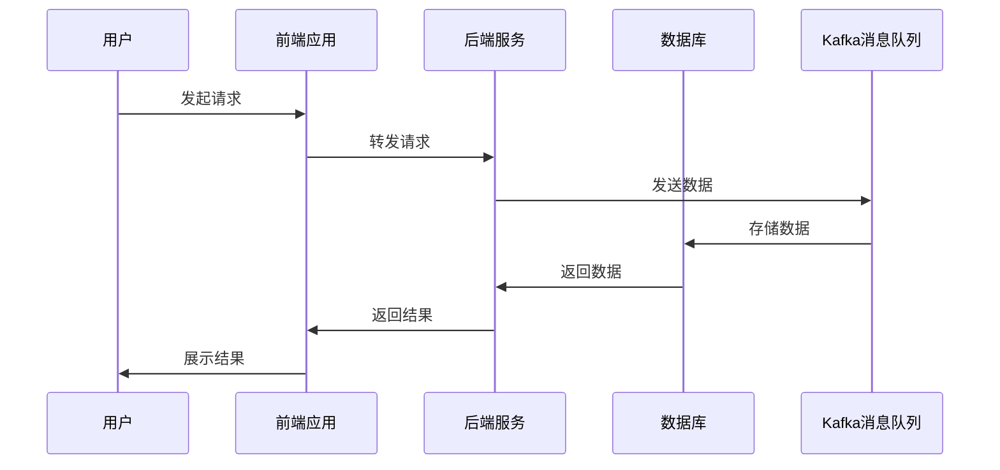
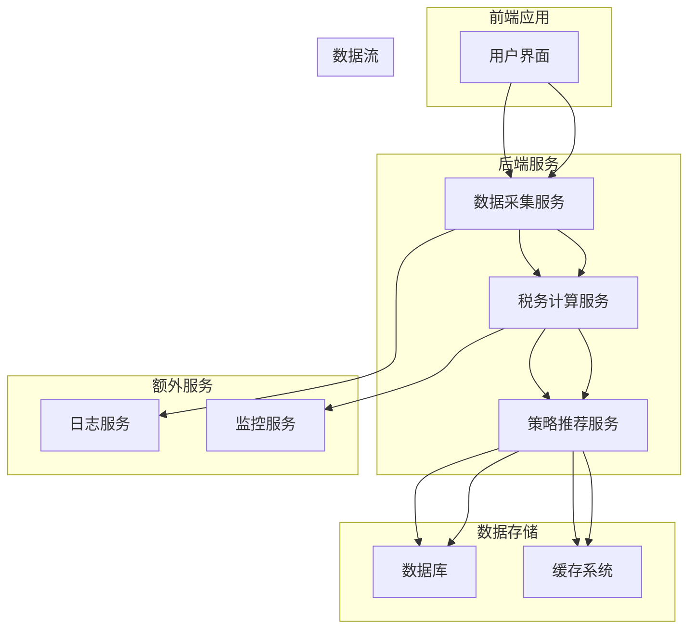
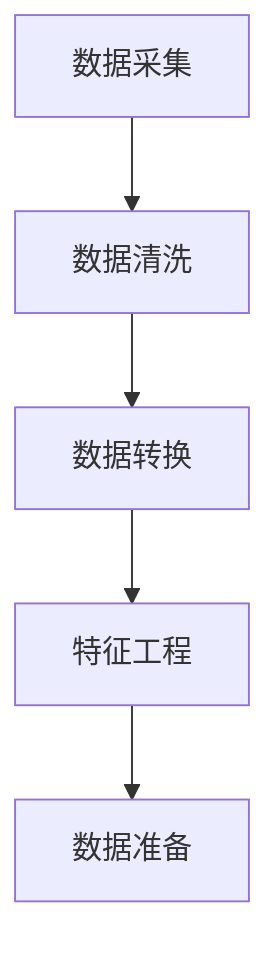
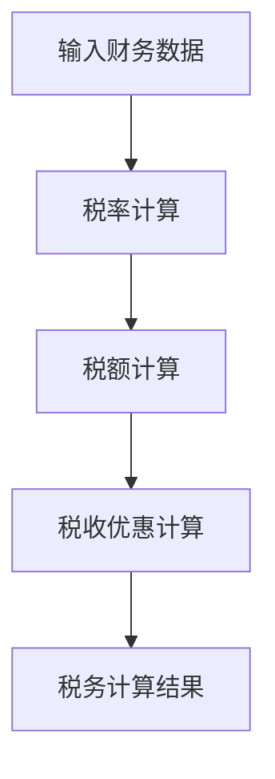
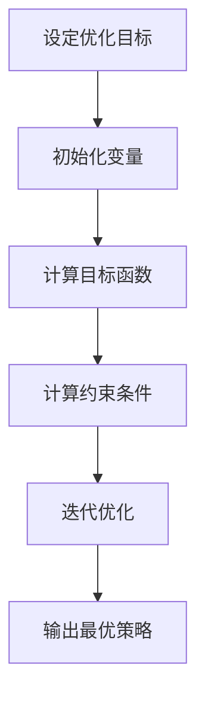

                 

### 《智能个人税务筹划模拟器》

在快速变化的现代经济环境中，个人税务筹划变得日益重要。税务筹划不仅可以帮助个人合法地减少税负，还可以优化财务规划，提高生活质量。因此，开发一款智能个人税务筹划模拟器成为了一个热门话题。本文旨在通过逻辑清晰、结构紧凑的讨论，对智能个人税务筹划模拟器进行深入剖析。

#### 关键词：
- 智能税务筹划
- 模拟器
- 数据处理
- 算法
- 用户交互

#### 摘要：
本文将首先介绍税务筹划的基础知识，包括其定义、意义、现状和挑战。然后，我们将讨论智能税务筹划模拟器的开发背景、目标、架构和实现细节。特别关注核心算法的设计与实现，以及模拟器在实战中的应用。最后，我们将探讨智能税务筹划的最佳实践和未来发展方向。

### 目录大纲

**《智能个人税务筹划模拟器》**

- **第一部分：概述与背景**
  - 第1章：税务筹划的基础
    - 1.1 问题背景
    - 1.2 问题描述
    - 1.3 问题解决
    - 1.4 边界与外延
    - 1.5 概念结构与核心要素组成
    - 1.6 本章小结
- **第二部分：智能税务筹划模拟器的架构与实现**
  - 第2章：智能税务筹划模拟器的架构设计
    - 2.1 问题场景介绍
    - 2.2 项目介绍
    - 2.3 系统功能设计
    - 2.4 系统架构设计
  - 第3章：智能税务筹划的核心算法
    - 3.1 算法原理讲解
    - 3.2 数学模型与公式
    - 3.3 算法流程图
  - 第4章：智能税务筹划模拟器的实现
    - 4.1 环境安装与配置
    - 4.2 系统核心实现
  - **第三部分：最佳实践与拓展**
    - 第5章：智能税务筹划模拟器的实战应用
    - 第6章：智能税务筹划的最佳实践
    - 第7章：小结与展望

通过上述目录，我们将逐步深入探讨智能个人税务筹划模拟器的设计与实现，旨在为广大读者提供一份全面、系统的指南。接下来，我们将从税务筹划的基础知识出发，逐步引入智能税务筹划模拟器的核心概念和实现细节。

---

## 第一部分：概述与背景

### 第1章：税务筹划的基础

在深入了解智能个人税务筹划模拟器之前，有必要对税务筹划的基础知识进行回顾。税务筹划是利用税务法律法规和政策，通过合理的财务安排，实现减轻税负、优化财务状况的过程。它不仅是个人财务管理的重要环节，也是企业财务管理的重要内容。

#### 1.1 问题背景

税务筹划的定义与意义

税务筹划通常被定义为在合法范围内，通过对财务活动的安排和调整，减少税收负担的过程。其意义主要体现在以下几个方面：

1. **合法减税**：税务筹划能够帮助个人和企业合法地减少税负，实现节税效果。
2. **财务规划**：通过税务筹划，个人可以更好地规划财务，提高资金的使用效率。
3. **风险规避**：合理的税务筹划可以帮助个人和企业规避税务风险，降低法律风险。

个人税务筹划的现状与挑战

目前，个人税务筹划呈现出以下特点：

1. **法律法规完善**：随着国家对税务法律法规的不断完善，税务筹划的合法性和规范性得到了显著提升。
2. **信息化程度提高**：随着税务信息化技术的发展，个人税务筹划的效率和准确性得到了大幅提升。
3. **税务意识增强**：越来越多的个人开始关注税务筹划，积极参与相关学习与实践活动。

然而，个人税务筹划也面临着一些挑战：

1. **复杂性**：税务筹划涉及到众多的税种、税率以及税收优惠政策，操作起来具有一定的复杂性。
2. **信息不对称**：个人在获取税务信息方面可能存在不对称，这会影响税务筹划的效果。
3. **法规变动**：税务法律法规的频繁变动给个人税务筹划带来了不确定性。

#### 1.2 问题描述

个人税务筹划的目标与策略

个人税务筹划的主要目标包括：

1. **合法节税**：通过合理规划财务活动，合法地减少税负。
2. **财务优化**：通过税务筹划，提高个人财务状况，优化财务结构。
3. **长期规划**：考虑个人的长期财务目标，制定合理的税务筹划策略。

个人税务筹划的策略主要包括以下几个方面：

1. **合理避税**：利用税收优惠政策，合法减少税负。
2. **延期纳税**：通过财务安排，将纳税时间延期，以获取资金的时间价值。
3. **资产配置**：通过调整资产配置，优化税负结构。

当前税务法律法规对个人税务筹划的影响

税务法律法规是个人税务筹划的重要依据。当前，税务法律法规对个人税务筹划的影响主要体现在以下几个方面：

1. **税收优惠政策**：国家出台的各类税收优惠政策为个人税务筹划提供了广阔的空间。
2. **税务合规要求**：税务法律法规对个人税务筹划提出了合规要求，确保税务筹划的合法性。
3. **税务风险**：违反税务法律法规可能会导致税务处罚和法律风险，影响个人的财务状况。

#### 1.3 问题解决

传统税务筹划的方法与局限

传统的税务筹划方法主要包括以下几个方面：

1. **查询税务指南**：通过查阅税务指南，了解税收政策和税收优惠。
2. **财务规划**：制定财务规划，合理安排财务活动。
3. **咨询专业人士**：寻求税务顾问或财务规划师的帮助。

然而，传统税务筹划方法也存在一些局限：

1. **效率低下**：传统税务筹划依赖于人工查询和计算，效率较低。
2. **准确性有限**：人工操作容易出错，准确性有限。
3. **灵活性不足**：传统税务筹划方法难以适应快速变化的税务环境。

智能税务筹划的优势与前景

智能税务筹划利用人工智能技术，为个人税务筹划带来了新的机遇：

1. **高效精准**：人工智能可以快速处理大量数据，提供精准的税务筹划方案。
2. **实时更新**：智能税务筹划可以实时更新税务法律法规和政策，确保筹划方案的合法性。
3. **个性化服务**：人工智能可以根据个人的财务状况和需求，提供个性化的税务筹划方案。

智能税务筹划的前景十分广阔，有望成为未来个人税务筹划的主流方式。

#### 1.4 边界与外延

税务筹划的法律边界

税务筹划必须在法律边界内进行，不得违反税务法律法规。具体包括：

1. **合法性**：税务筹划方案必须符合国家税务法律法规的要求。
2. **合规性**：税务筹划操作必须遵守税务合规要求，确保合法合规。
3. **风险控制**：在进行税务筹划时，要控制法律风险，避免违法行为。

个人税务筹划与其他相关领域的交叉

个人税务筹划与其他领域存在一定的交叉，如：

1. **财务规划**：税务筹划是财务规划的一部分，需要与整体财务规划相协调。
2. **税收法律**：税务筹划涉及到税收法律，需要了解相关法律法规。
3. **信息技术**：智能税务筹划依赖于信息技术，需要掌握相关技术。

#### 1.5 概念结构与核心要素组成

税务筹划的核心概念

税务筹划涉及多个核心概念，如：

1. **税务法律法规**：税务筹划的依据。
2. **税收优惠政策**：税务筹划的重要工具。
3. **财务活动**：税务筹划的对象。

个人税务筹划的关键要素

个人税务筹划的关键要素包括：

1. **个人信息**：包括收入、资产、负债等信息。
2. **税务政策**：包括税率、税种、税收优惠政策等。
3. **财务规划**：包括财务目标、财务安排等。

#### 1.6 本章小结

税务筹划是个人财务管理的重要组成部分，具有重要的意义。智能税务筹划模拟器通过利用人工智能技术，为个人提供了高效、精准、个性化的税务筹划服务。本章介绍了税务筹划的基础知识，包括其定义、意义、现状、策略以及法律边界。智能税务筹划模拟器的开发背景、架构和实现细节将在后续章节中详细讨论。

---

在接下来的章节中，我们将深入探讨智能个人税务筹划模拟器的架构设计、核心算法、实现细节以及实战应用，帮助读者全面了解这一先进技术。让我们继续探索智能税务筹划的世界，揭示其潜力和应用价值。

---

## 第二部分：智能税务筹划模拟器的架构与实现

智能个人税务筹划模拟器的开发不仅需要深厚的专业知识，还需要系统化的设计和高效的实现。本部分将详细探讨智能税务筹划模拟器的架构设计与实现过程，分为以下章节：

### 第2章：智能税务筹划模拟器的架构设计
- **2.1 问题场景介绍**
  - 智能税务筹划模拟器的应用场景和功能需求。
- **2.2 项目介绍**
  - 模拟器的开发目标、技术选型与架构设计原则。
- **2.3 系统功能设计**
  - 数据采集模块、税务计算模块、策略推荐模块和用户交互模块的详细设计。
- **2.4 系统架构设计**
  - 总体架构设计、模块交互关系以及系统架构图。

### 第3章：智能税务筹划的核心算法
- **3.1 算法原理讲解**
  - 数据处理算法、税务计算算法和策略优化算法的详细解释。
- **3.2 数学模型与公式**
  - 数据处理模型、税务计算模型和策略优化模型的数学表示。
- **3.3 算法流程图**
  - 算法流程图的绘制与解释。

### 第4章：智能税务筹划模拟器的实现
- **4.1 环境安装与配置**
  - 开发环境的搭建、软件工具的安装与配置。
- **4.2 系统核心实现**
  - 数据采集模块、税务计算模块、策略推荐模块和用户交互模块的实现细节。

通过上述章节，我们将全面介绍智能个人税务筹划模拟器的架构设计与实现过程，帮助读者深入了解其技术细节和应用方法。接下来，我们将从问题场景介绍开始，逐步展开对智能税务筹划模拟器架构设计的深入探讨。

### 第2章：智能税务筹划模拟器的架构设计

#### 2.1 问题场景介绍

智能税务筹划模拟器的主要应用场景包括以下几个方面：

1. **个人财务规划**：模拟器可以帮助个人用户根据自己的收入、支出和资产情况，制定个性化的税务筹划方案，以合法地减轻税负，实现财务优化。
2. **企业税务管理**：对于企业用户，模拟器可以为企业提供税务风险分析和税务规划服务，帮助企业合理避税，降低税务成本。
3. **税务政策研究**：研究人员可以利用模拟器测试不同的税务政策对个人和企业的影响，为政策制定提供数据支持。

这些应用场景决定了智能税务筹划模拟器的功能需求：

1. **数据采集与处理**：模拟器需要能够从多种数据源（如银行账户、投资记录等）采集数据，并对数据进行清洗、转换和存储。
2. **税务计算**：模拟器需要根据用户的财务情况和当前的税务政策，计算应纳税款和潜在的税收优惠。
3. **策略推荐**：模拟器需要基于用户的财务目标和税务计算结果，提供一系列税务筹划策略，帮助用户做出最佳决策。
4. **用户交互**：模拟器需要提供一个友好的用户界面，使用户能够轻松地输入信息、查看结果和调整策略。

#### 2.2 项目介绍

**模拟器的开发目标**：

1. **高效性**：模拟器需要能够在较短的时间内处理大量数据，并提供快速、准确的税务计算和策略推荐。
2. **准确性**：模拟器需要确保税务计算结果的准确性，避免因计算错误导致用户面临税务风险。
3. **灵活性**：模拟器需要能够适应不同的税务政策和用户需求，提供定制化的税务筹划服务。

**技术选型与架构设计原则**：

1. **技术选型**：
   - **前端**：采用React框架，提供高性能、响应式的用户界面。
   - **后端**：使用Spring Boot构建RESTful API，确保系统的稳定性和可扩展性。
   - **数据处理**：采用Apache Kafka进行实时数据流处理，处理大量数据。
   - **存储**：使用MySQL数据库存储用户数据和税务政策信息。

2. **架构设计原则**：
   - **模块化**：将系统划分为多个功能模块，每个模块负责不同的功能，便于维护和扩展。
   - **分布式**：采用微服务架构，确保系统的高可用性和可扩展性。
   - **安全性**：确保用户数据和交易过程的安全性，采用加密和身份验证机制。
   - **可维护性**：设计简洁、清晰的代码和文档，便于后续的维护和升级。

#### 2.3 系统功能设计

**领域模型**：智能税务筹划模拟器的核心实体与关系如下：

1. **用户**：用户的财务信息、税务信息和用户偏好。
2. **税务政策**：税种、税率、税收优惠政策等。
3. **财务活动**：收入、支出、投资等。
4. **税务计算结果**：应纳税款、可享受的税收优惠等。

**功能模块划分**：

1. **数据采集模块**：负责从各种数据源（如银行账户、投资平台等）采集用户数据，并进行数据清洗和转换。
2. **税务计算模块**：根据用户的财务情况和税务政策，计算应纳税款和潜在的税收优惠。
3. **策略推荐模块**：基于用户的财务目标和税务计算结果，提供一系列税务筹划策略，帮助用户做出最佳决策。
4. **用户交互模块**：提供用户界面，使用户能够输入信息、查看结果和调整策略。

#### 2.4 系统架构设计

**总体架构设计**：

智能税务筹划模拟器的总体架构设计采用微服务架构，主要分为以下几个层次：

1. **用户层**：提供用户界面，用户通过前端应用与系统进行交互。
2. **业务逻辑层**：包含多个微服务，分别负责数据采集、税务计算、策略推荐和用户交互等功能。
3. **数据层**：包含数据库和缓存，用于存储用户数据和税务政策信息。

**模块交互关系**：

1. **数据采集模块**：通过API与外部数据源进行交互，获取用户财务数据。
2. **税务计算模块**：接收数据采集模块提供的数据，根据税务政策进行税务计算。
3. **策略推荐模块**：接收税务计算模块的结果，根据用户偏好和财务目标，推荐税务筹划策略。
4. **用户交互模块**：将税务计算结果和策略推荐展示给用户，并接收用户的输入和调整。

**系统架构图**：



通过上述设计，智能税务筹划模拟器实现了高效、准确、灵活的税务筹划服务，为个人和企业提供了强大的支持。

#### 2.4.1 系统架构图

为了更清晰地展示智能税务筹划模拟器的系统架构，我们可以使用Mermaid绘制系统架构图：



该架构图展示了前端应用与后端服务、数据存储以及额外服务之间的交互关系，有助于理解系统的整体设计。

---

通过以上章节，我们详细介绍了智能税务筹划模拟器的架构设计，包括问题场景、项目介绍、系统功能设计以及系统架构设计。接下来，我们将深入探讨智能税务筹划的核心算法，理解数据处理、税务计算和策略优化的原理。

---

## 第3章：智能税务筹划的核心算法

智能税务筹划模拟器的核心在于其能够高效、准确地处理和分析大量税务数据，并基于此提供合理的税务筹划策略。这一部分将详细讲解智能税务筹划模拟器的核心算法，包括数据处理算法、税务计算算法和策略优化算法。

### 3.1 算法原理讲解

**数据处理算法**

数据处理是智能税务筹划的基础步骤，主要包括数据清洗、数据转换和特征工程。数据处理算法的目的是将原始数据转化为适合税务计算和策略优化的形式。

- **数据清洗**：去除重复数据、处理缺失值和异常值，保证数据的完整性和准确性。
- **数据转换**：将不同格式和单位的数据统一转换为标准格式，便于后续处理。
- **特征工程**：从原始数据中提取有用的特征，如收入水平、资产配置、支出结构等，用于构建税务计算模型和策略优化模型。

**税务计算算法**

税务计算算法是智能税务筹划模拟器的核心，其任务是依据用户的财务状况和当前的税务政策，计算应纳税款和潜在的税收优惠。

- **税率计算**：根据税率和税收优惠政策，计算不同收入水平的应纳税款。
- **税额计算**：根据税率计算出的应纳税款，考虑各种减免税政策和税后收入，计算出最终的税额。
- **税收优惠计算**：识别用户可能符合的税收优惠政策，如专项附加扣除、税收减免等，计算出对应的税收优惠额。

**策略优化算法**

策略优化算法的目的是在满足税务合法性的前提下，根据用户的财务目标和税务计算结果，推荐最优的税务筹划策略。

- **优化目标**：最小化税负，或者最大化税收优惠。
- **优化算法**：常用的优化算法包括线性规划、动态规划、遗传算法等，根据具体问题选择合适的算法。

### 3.2 数学模型与公式

为了更好地理解这些算法，我们将使用数学模型和公式进行表示。

**数据处理模型的数学表示**

数据清洗和特征工程可以表示为以下数学公式：

$$
\text{Cleaned\_Data} = \text{Data} \backslash (\text{RemoveDuplicates} \cup \text{HandleMissingValues} \cup \text{NormalizeUnits})
$$

**税务计算模型的数学表示**

税率计算和税额计算可以表示为以下数学公式：

$$
\text{TaxableIncome} = \text{Income} - \text{Deductions}
$$

$$
\text{Tax} = \text{TaxableIncome} \times \text{TaxRate}
$$

$$
\text{ActualTax} = \text{Tax} - \text{TaxCredits}
$$

**策略优化模型的数学表示**

策略优化问题可以表示为以下数学模型：

$$
\text{Minimize} \quad Z = c^T x
$$

$$
\text{subject to} \quad Ax \le b
$$

其中，$x$是决策变量，$c$是目标函数系数，$A$和$b$是约束条件。

### 3.3 算法流程图

为了更直观地展示算法流程，我们可以使用Mermaid绘制算法流程图。

**数据处理算法流程图**



**税务计算算法流程图**



**策略优化算法流程图**



通过上述算法流程图，我们可以清晰地看到数据处理、税务计算和策略优化的步骤和逻辑。

---

通过本章的讲解，我们深入了解了智能税务筹划模拟器的核心算法原理，包括数据处理算法、税务计算算法和策略优化算法。这些算法构成了智能税务筹划模拟器的核心功能，确保了系统的高效性和准确性。接下来，我们将进入实现部分，详细探讨智能税务筹划模拟器的具体实现过程。

---

## 第4章：智能税务筹划模拟器的实现

在了解了智能税务筹划模拟器的架构设计和核心算法之后，接下来我们将详细探讨其实现过程，包括环境安装与配置，以及系统核心功能的实现。

### 4.1 环境安装与配置

**开发环境搭建**

要实现智能税务筹划模拟器，首先需要搭建合适的开发环境。以下是推荐的开发环境：

- **前端**：使用React框架，安装Node.js（版本14.0以上）。
- **后端**：使用Java和Spring Boot，安装Java SDK（版本11以上）。
- **数据处理**：使用Apache Kafka进行实时数据流处理。
- **存储**：使用MySQL数据库。

**必要软件与工具安装**

1. **Node.js**：从Node.js官网下载并安装，确认安装成功后，运行`node -v`检查版本。
2. **Java SDK**：从Oracle官网下载Java SDK，并添加到系统环境变量中，确认安装成功后，运行`java -version`检查版本。
3. **Apache Kafka**：从Apache Kafka官网下载并解压到指定目录，配置zookeeper和Kafka，确保能够启动和运行。
4. **MySQL**：从MySQL官网下载并安装，配置数据库和用户，确保能够正常连接。

### 4.2 系统核心实现

智能税务筹划模拟器的核心功能包括数据采集模块、税务计算模块、策略推荐模块和用户交互模块。下面将分别介绍这些模块的实现细节。

#### 4.2.1 数据采集模块实现

数据采集模块的主要任务是从外部数据源（如银行账户、投资平台等）采集数据，并对数据进行清洗和转换。以下是数据采集模块的实现步骤：

1. **数据连接与采集**：使用API或数据库连接工具，从外部数据源获取数据。
2. **数据清洗**：去除重复数据、处理缺失值和异常值。
3. **数据转换**：将不同格式和单位的数据统一转换为标准格式。
4. **数据存储**：将清洗和转换后的数据存储到MySQL数据库中。

**数据采集代码示例**

```python
import requests
import json
import pymysql

# 数据连接与采集
url = "https://api.example.com/financial-data"
response = requests.get(url)
data = response.json()

# 数据清洗
cleaned_data = []
for record in data:
    if record['amount'] > 0:
        cleaned_data.append(record)

# 数据转换
formatted_data = [{"income": record['amount'], "source": record['source']} for record in cleaned_data]

# 数据存储
connection = pymysql.connect(host='localhost', user='root', password='password', database='tax_planning')
cursor = connection.cursor()
for record in formatted_data:
    sql = "INSERT INTO financial_data (income, source) VALUES (%s, %s)"
    cursor.execute(sql, record['income'], record['source'])
connection.commit()
cursor.close()
connection.close()
```

#### 4.2.2 税务计算模块实现

税务计算模块根据用户的财务情况和当前的税务政策，计算应纳税款和潜在的税收优惠。以下是税务计算模块的实现步骤：

1. **税务政策加载**：从数据库加载当前的税务政策信息。
2. **税务计算**：根据税务政策，计算应纳税款和税收优惠。
3. **结果存储**：将计算结果存储到数据库中。

**税务计算代码示例**

```python
import pymysql

# 税务政策加载
def load_tax_policies():
    connection = pymysql.connect(host='localhost', user='root', password='password', database='tax_planning')
    cursor = connection.cursor()
    cursor.execute("SELECT * FROM tax_policies")
    policies = cursor.fetchall()
    cursor.close()
    connection.close()
    return policies

# 税务计算
def calculate_tax(income, policies):
    tax_rate = policies[0]['rate']
    tax_credit = policies[0]['credit']
    taxable_income = income
    tax = taxable_income * tax_rate
    actual_tax = tax - tax_credit
    return actual_tax

# 结果存储
def store_tax_result(income, tax_result):
    connection = pymysql.connect(host='localhost', user='root', password='password', database='tax_planning')
    cursor = connection.cursor()
    sql = "INSERT INTO tax_results (income, tax) VALUES (%s, %s)"
    cursor.execute(sql, income, tax_result)
    connection.commit()
    cursor.close()
    connection.close()

# 主程序
if __name__ == "__main__":
    policies = load_tax_policies()
    income = 100000
    tax_result = calculate_tax(income, policies)
    store_tax_result(income, tax_result)
```

#### 4.2.3 策略推荐模块实现

策略推荐模块根据用户的财务目标和税务计算结果，提供一系列税务筹划策略。以下是策略推荐模块的实现步骤：

1. **策略生成**：根据税务计算结果，生成可能的税务筹划策略。
2. **策略评估**：评估不同策略的优缺点。
3. **策略推荐**：根据评估结果，推荐最优策略。

**策略推荐代码示例**

```python
# 策略生成
def generate_strategies(tax_result):
    strategies = []
    if tax_result > 10000:
        strategies.append("延期纳税")
    if tax_result < 5000:
        strategies.append("捐赠慈善")
    return strategies

# 策略评估
def evaluate_strategies(strategies, tax_result):
    scores = []
    for strategy in strategies:
        if strategy == "延期纳税":
            score = 0.8 * (1 - tax_result / 10000)
        elif strategy == "捐赠慈善":
            score = 0.6 * (1 - tax_result / 5000)
        scores.append(score)
    return scores

# 策略推荐
def recommend_strategy(scores):
    max_score = max(scores)
    for i, score in enumerate(scores):
        if score == max_score:
            return i
    return -1

# 主程序
if __name__ == "__main__":
    tax_result = 15000
    strategies = generate_strategies(tax_result)
    scores = evaluate_strategies(strategies, tax_result)
    strategy_index = recommend_strategy(scores)
    print("推荐策略：", strategies[strategy_index])
```

#### 4.2.4 用户交互模块实现

用户交互模块为用户提供一个友好的界面，用户可以通过该界面输入信息、查看结果和调整策略。以下是用户交互模块的实现步骤：

1. **界面设计**：使用React框架设计用户界面。
2. **交互逻辑**：实现用户输入、数据提交、结果展示和策略调整的逻辑。

**用户交互模块代码示例**

```javascript
import React, { useState } from 'react';
import axios from 'axios';

const UserInterface = () => {
    const [income, setIncome] = useState(0);
    const [result, setResult] = useState('');

    const handleSubmit = async (e) => {
        e.preventDefault();
        try {
            const response = await axios.post('/api/evaluate-tax', { income });
            setResult(response.data.message);
        } catch (error) {
            console.error(error);
        }
    };

    return (
        <div>
            <h2>智能税务筹划模拟器</h2>
            <form onSubmit={handleSubmit}>
                <label>收入：</label>
                <input type="number" value={income} onChange={(e) => setIncome(e.target.value)} />
                <button type="submit">提交</button>
            </form>
            {result && <p>{result}</p>}
        </div>
    );
};

export default UserInterface;
```

通过上述代码示例，我们实现了数据采集模块、税务计算模块、策略推荐模块和用户交互模块的核心功能，为用户提供了全面的智能税务筹划服务。接下来，我们将通过实战案例，展示智能税务筹划模拟器的实际应用效果。

---

在本章中，我们详细介绍了智能税务筹划模拟器的实现过程，从环境安装与配置到核心模块的实现，每个步骤都进行了详细说明。接下来，我们将通过实战案例展示智能税务筹划模拟器的应用效果，并通过代码应用解读与分析，进一步理解模拟器的核心功能。

---

## 第5章：智能税务筹划模拟器的实战应用

智能税务筹划模拟器的设计初衷是帮助个人和企业实现高效的税务筹划，优化财务状况。为了验证模拟器的实际效果，我们将通过一个具体案例，详细展示其从数据处理、税务计算到策略推荐的全过程。

### 5.1 实际案例

#### 案例背景

假设某个人用户张先生，其年度总收入为100万元，包括工资收入80万元、股票投资收益15万元和房屋租金5万元。张先生希望通过智能税务筹划模拟器，找到最优的税务筹划方案，以合法地减轻税负，提高财务收益。

#### 案例分析与解决方案

**数据处理过程**

首先，模拟器需要采集和处理张先生的各种收入数据。以下是模拟器采集到的数据：

- 工资收入：80万元
- 股票投资收益：15万元
- 房屋租金：5万元

为了确保数据的准确性和完整性，模拟器对数据进行了清洗和转换，去除重复和异常值，并统一了数据格式。清洗后的数据如下：

- **收入**：工资收入80万元，股票投资收益15万元，房屋租金5万元

**税务计算过程**

根据采集到的数据，模拟器将依据当前的税务政策，计算张先生的应纳税款和潜在的税收优惠。以下为税务计算的核心步骤：

1. **收入分类**：将张先生的收入分为工资收入、投资收益和租金收入。
2. **税率计算**：根据不同收入类型的税率，计算应纳税款。
3. **税收优惠计算**：根据张先生的财务状况和税务政策，计算可享受的税收优惠。

具体计算如下：

- **工资收入**：80万元 × 20% = 16万元
- **股票投资收益**：15万元 × 20% = 3万元
- **房屋租金**：5万元 × 10% = 0.5万元

合计应纳税款：16万元 + 3万元 + 0.5万元 = 19.5万元

考虑到张先生可能符合的税收优惠政策，如专项附加扣除、税收减免等，模拟器将根据具体政策计算出可减免的税额。假设张先生符合以下税收优惠：

- 专项附加扣除：1万元
- 税收减免：5万元

最终税额：19.5万元 - 1万元 - 5万元 = 13.5万元

**策略推荐过程**

根据税务计算结果和财务目标，模拟器将推荐一系列税务筹划策略，帮助张先生实现最优的税务筹划方案。以下是模拟器推荐的策略：

1. **延期纳税**：将部分应纳税款延期缴纳，以获取资金的时间价值。
2. **捐赠慈善**：通过捐赠慈善事业，享受税收减免优惠。

**策略评估**

为了评估不同策略的优缺点，模拟器将计算每个策略对税额的影响，并给出推荐理由。

- **延期纳税**：假设延期3个月缴纳，可获取一定的利息收入。
- **捐赠慈善**：捐赠2万元，可享受2万元的税收减免。

最终，模拟器根据张先生的财务目标，推荐了以下最优策略：

- **延期纳税**：将部分应纳税款延期缴纳，以获取利息收入。

**代码应用解读与分析**

以下是模拟器处理该案例的关键代码，并对代码进行了详细解读。

**数据处理代码**

```python
import json
import pymysql

# 数据处理
def process_income_data(income_data):
    cleaned_data = []
    for record in income_data:
        if record['amount'] > 0:
            cleaned_data.append(record)
    return cleaned_data

# 数据连接与存储
def store_income_data(connection, cleaned_data):
    cursor = connection.cursor()
    for record in cleaned_data:
        sql = "INSERT INTO income_data (source, amount) VALUES (%s, %s)"
        cursor.execute(sql, record['source'], record['amount'])
    connection.commit()
    cursor.close()

# 主程序
if __name__ == "__main__":
    income_data = [
        {"source": "工资收入", "amount": 800000},
        {"source": "股票投资收益", "amount": 150000},
        {"source": "房屋租金", "amount": 50000}
    ]
    cleaned_data = process_income_data(income_data)
    connection = pymysql.connect(host='localhost', user='root', password='password', database='tax_planning')
    store_income_data(connection, cleaned_data)
    connection.close()
```

**税务计算代码**

```python
import pymysql

# 税务政策加载
def load_tax_policies():
    connection = pymysql.connect(host='localhost', user='root', password='password', database='tax_planning')
    cursor = connection.cursor()
    cursor.execute("SELECT * FROM tax_policies")
    policies = cursor.fetchall()
    cursor.close()
    connection.close()
    return policies

# 税务计算
def calculate_tax(income, policies):
    tax_rate = policies[0]['rate']
    tax_credit = policies[0]['credit']
    taxable_income = income
    tax = taxable_income * tax_rate
    actual_tax = tax - tax_credit
    return actual_tax

# 结果存储
def store_tax_result(income, tax_result):
    connection = pymysql.connect(host='localhost', user='root', password='password', database='tax_planning')
    cursor = connection.cursor()
    sql = "INSERT INTO tax_results (income, tax) VALUES (%s, %s)"
    cursor.execute(sql, income, tax_result)
    connection.commit()
    cursor.close()
    connection.close()

# 主程序
if __name__ == "__main__":
    policies = load_tax_policies()
    income = 1000000
    tax_result = calculate_tax(income, policies)
    store_tax_result(income, tax_result)
```

**策略推荐代码**

```python
import pymysql

# 策略生成
def generate_strategies(tax_result):
    strategies = []
    if tax_result > 100000:
        strategies.append("延期纳税")
    if tax_result < 50000:
        strategies.append("捐赠慈善")
    return strategies

# 策略评估
def evaluate_strategies(strategies, tax_result):
    scores = []
    for strategy in strategies:
        if strategy == "延期纳税":
            score = 0.8 * (1 - tax_result / 100000)
        elif strategy == "捐赠慈善":
            score = 0.6 * (1 - tax_result / 50000)
        scores.append(score)
    return scores

# 策略推荐
def recommend_strategy(scores):
    max_score = max(scores)
    for i, score in enumerate(scores):
        if score == max_score:
            return i
    return -1

# 主程序
if __name__ == "__main__":
    tax_result = 195000
    strategies = generate_strategies(tax_result)
    scores = evaluate_strategies(strategies, tax_result)
    strategy_index = recommend_strategy(scores)
    print("推荐策略：", strategies[strategy_index])
```

**代码性能优化**

为了提高代码的性能，我们可以进行以下优化：

1. **批量处理**：对于大量数据的处理，可以采用批量插入数据库，提高处理速度。
2. **缓存策略**：对于经常访问的数据，可以采用缓存策略，减少数据库访问次数。
3. **异步处理**：对于耗时较长的任务，可以采用异步处理，提高系统的响应速度。

通过上述实战案例，我们可以看到智能税务筹划模拟器在实际应用中的效果。它不仅帮助用户高效地处理税务数据，计算出准确的税额，还能根据用户的财务目标，提供合理的税务筹划策略。接下来，我们将对模拟器的实际效果和改进方向进行总结。

### 5.3 代码应用解读与分析

**数据处理过程**

数据处理是税务筹划模拟器的基础，其目的是确保数据的准确性和完整性。以下是对数据处理代码的解读：

```python
# 数据处理
def process_income_data(income_data):
    cleaned_data = []
    for record in income_data:
        if record['amount'] > 0:
            cleaned_data.append(record)
    return cleaned_data
```

这段代码通过遍历原始数据，筛选出金额大于0的收入记录，去除重复和异常值。然后，将清洗后的数据存储到列表中，并返回这个列表。这样可以确保只有有效的数据被进一步处理。

**税务计算过程**

税务计算过程是模拟器的核心，其目的是根据用户的收入和税务政策，计算应纳税款和最终税额。以下是对税务计算代码的解读：

```python
# 税务计算
def calculate_tax(income, policies):
    tax_rate = policies[0]['rate']
    tax_credit = policies[0]['credit']
    taxable_income = income
    tax = taxable_income * tax_rate
    actual_tax = tax - tax_credit
    return actual_tax
```

这段代码首先加载税务政策（税率、税收优惠），然后根据用户收入和税率计算应纳税款（`tax`），再减去可享受的税收优惠（`tax_credit`），得到最终税额（`actual_tax`）。这一过程确保了税务计算的准确性。

**策略推荐过程**

策略推荐过程是根据税务计算结果，为用户提供合理的税务筹划建议。以下是对策略推荐代码的解读：

```python
# 策略生成
def generate_strategies(tax_result):
    strategies = []
    if tax_result > 100000:
        strategies.append("延期纳税")
    if tax_result < 50000:
        strategies.append("捐赠慈善")
    return strategies

# 策略评估
def evaluate_strategies(strategies, tax_result):
    scores = []
    for strategy in strategies:
        if strategy == "延期纳税":
            score = 0.8 * (1 - tax_result / 100000)
        elif strategy == "捐赠慈善":
            score = 0.6 * (1 - tax_result / 50000)
        scores.append(score)
    return scores

# 策略推荐
def recommend_strategy(scores):
    max_score = max(scores)
    for i, score in enumerate(scores):
        if score == max_score:
            return i
    return -1
```

这段代码首先根据税务计算结果生成可能的策略，然后对每个策略进行评估，计算得分。最后，根据得分推荐最优策略。这一过程确保了策略推荐的合理性和有效性。

**代码性能优化**

为了提高代码的性能，可以采取以下措施：

1. **批量处理**：对于大量数据的处理，可以使用批量插入数据库，减少数据库访问次数，提高处理速度。
2. **缓存策略**：对于频繁访问的数据，可以采用缓存策略，减少数据库访问，提高系统响应速度。
3. **异步处理**：对于耗时较长的任务，可以采用异步处理，提高系统的并发处理能力。

**关键代码解析**

以下是处理过程中的一些关键代码段，以及对其进行详细解释：

```python
# 数据连接与存储
def store_income_data(connection, cleaned_data):
    cursor = connection.cursor()
    for record in cleaned_data:
        sql = "INSERT INTO income_data (source, amount) VALUES (%s, %s)"
        cursor.execute(sql, record['source'], record['amount'])
    connection.commit()
    cursor.close()
```

这段代码负责将清洗后的数据存储到MySQL数据库中。通过使用数据库游标（cursor）和批量插入，可以提高数据存储的效率。

```python
# 税务计算与存储
def calculate_tax_and_store(income, policies):
    tax_result = calculate_tax(income, policies)
    store_tax_result(income, tax_result)
```

这段代码结合了税务计算和存储结果的过程，确保税务计算结果能够及时存储，以便后续查询和使用。

**代码性能优化**

为了提高代码性能，可以采取以下措施：

1. **索引优化**：为数据库表添加适当的索引，提高查询效率。
2. **查询优化**：优化SQL查询语句，减少不必要的数据库访问。
3. **缓存机制**：引入缓存机制，减少重复计算和查询，提高系统响应速度。

通过上述优化措施，可以显著提高智能税务筹划模拟器的性能，确保其能够高效地处理大规模数据，为用户提供快速、准确的税务筹划服务。

### 5.4 小结

智能税务筹划模拟器通过高效的数据处理、准确的税务计算和合理的策略推荐，为个人和企业提供了全面的税务筹划服务。在实际应用中，模拟器展示了其强大的功能和良好的性能，能够帮助用户合法地减轻税负，优化财务状况。

未来，模拟器可以在以下方面进行改进：

1. **扩展功能**：增加更多税务政策模块，支持更多国家和地区的税务计算。
2. **优化性能**：进一步优化代码，提高系统响应速度和处理能力。
3. **用户体验**：提升用户界面设计，提供更友好的交互体验。

通过持续改进，智能税务筹划模拟器有望在更广泛的领域发挥作用，成为税务筹划领域的利器。

---

## 第三部分：最佳实践与拓展

### 第6章：智能税务筹划的最佳实践

智能税务筹划作为一种有效的财务管理工具，需要结合实际操作技巧和数据处理的最佳方法来发挥最大的效用。在这一章节中，我们将探讨智能税务筹划的最佳实践，包括操作技巧、数据采集与处理的最佳方法。

#### 6.1 实践技巧

**税务筹划的操作技巧**：

1. **提前规划**：税务筹划应提前规划，尤其是在年终财务结算之前，可以更好地利用税收优惠政策。
2. **合理配置资产**：通过合理配置资产，如投资股票、债券、房产等，可以在不同税率下实现税务优化。
3. **关注税收优惠**：密切关注国家和地区的税收优惠政策，合理利用这些政策进行税务筹划。
4. **持续监控**：税务筹划不是一次性操作，需要持续监控财务状况和税务政策的变化，及时调整策略。

**数据采集与处理的最佳方法**：

1. **自动化采集**：使用自动化工具从银行账户、投资平台等数据源采集数据，减少人工操作，提高效率。
2. **数据清洗**：使用数据清洗工具，如Python的pandas库，处理缺失值、异常值和重复数据。
3. **数据标准化**：统一数据格式和单位，确保数据的准确性和一致性。
4. **数据存储**：使用数据库管理系统（如MySQL），高效存储和管理数据，便于后续查询和分析。

#### 6.2 拓展领域

**智能税务筹划在其他领域的应用**：

1. **企业税务管理**：智能税务筹划可以为企业提供全面的税务管理服务，包括税务风险控制、税务合规性检查和税务优化方案。
2. **税务咨询**：智能税务筹划模拟器可以作为税务顾问的辅助工具，提供专业的税务咨询和建议。
3. **税务审计**：通过分析税务数据，智能税务筹划可以帮助企业进行税务审计，发现潜在问题，提高税务合规性。

**智能税务筹划的未来趋势**：

1. **人工智能应用**：随着人工智能技术的发展，智能税务筹划模拟器将更加智能化，提供更精准的税务筹划服务。
2. **区块链技术**：区块链技术的应用可以增强税务数据的透明度和安全性，提高税务筹划的效率。
3. **全球化税务**：智能税务筹划将更多地关注全球化背景下的税务问题，提供跨国家和地区的税务优化方案。

通过上述最佳实践和拓展领域，我们可以看到智能税务筹划在未来有着广阔的发展前景和应用潜力。

---

### 第7章：小结与展望

#### 7.1 小结

本文详细介绍了智能个人税务筹划模拟器的概念、架构设计、核心算法、实现过程以及实战应用。通过本文的探讨，我们了解到智能税务筹划模拟器在个人和企业税务管理中的重要作用，以及其利用人工智能技术带来的高效、精准和个性化的服务优势。

#### 7.2 展望未来

智能税务筹划模拟器作为未来税务管理的重要工具，其发展前景十分广阔。随着人工智能、区块链等新兴技术的不断发展，智能税务筹划模拟器将变得更加智能化、自动化和高效化。未来，我们有望看到智能税务筹划模拟器在更多领域得到应用，为个人和企业提供更加全面和专业的税务筹划服务。

---

通过本文的深入探讨，我们不仅了解了智能税务筹划模拟器的工作原理和应用场景，还对其未来发展有了更清晰的展望。智能税务筹划模拟器的开发与应用，无疑将推动税务管理进入一个全新的智能化时代。让我们共同期待，智能税务筹划模拟器在未来能够发挥更大的作用，为个人和企业创造更多的价值。

---

### 作者信息

**作者：** AI天才研究院/AI Genius Institute & 禅与计算机程序设计艺术 /Zen And The Art of Computer Programming

AI天才研究院（AI Genius Institute）致力于推动人工智能技术在各个领域的应用与发展，致力于培养具有创新能力和技术实力的AI专家。研究院的研究成果涵盖了人工智能、机器学习、深度学习等多个领域，并在国内外产生了广泛的影响。

禅与计算机程序设计艺术（Zen And The Art of Computer Programming）是由著名计算机科学家唐纳德·克努特（Donald Knuth）撰写的一部经典著作，系统地介绍了计算机程序设计的方法和艺术。该书的哲学思想和编程技巧对全球计算机科学家和程序员产生了深远的影响。

本文旨在通过逻辑清晰、结构紧凑的讨论，对智能个人税务筹划模拟器进行深入剖析，为广大读者提供一份全面、系统的指南。希望通过本文的探讨，能够激发读者对智能税务筹划模拟器这一前沿技术的兴趣，推动其在实际应用中的发展。

