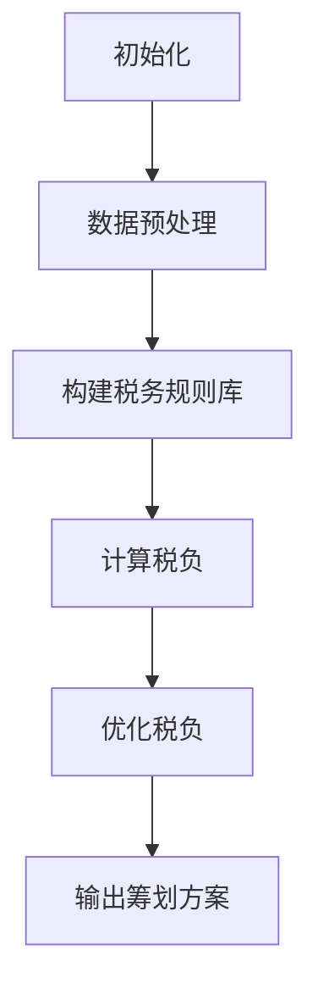

                 

# 智能个人税务筹划模拟平台

## 关键词

- 税务筹划
- 智能技术
- 数据分析
- 机器学习
- 个人财务规划

## 摘要

随着个人财务管理的日益复杂，税务筹划成为现代个人财务管理中不可或缺的一环。智能个人税务筹划模拟平台利用先进的智能技术和数据分析工具，为个人用户提供了高效、精准的税务筹划解决方案。本文将详细介绍智能个人税务筹划模拟平台的设计思路、核心算法、系统架构以及实际应用案例，旨在帮助读者深入理解智能税务筹划的原理和实践。

## 目录

### 第一部分：背景与基础

#### 第1章：税务筹划概述

1.1 税务筹划的概念与重要性

1.2 个人税务筹划的现状与挑战

1.3 智能税务筹划模拟平台的必要性

#### 第2章：智能技术与税务筹划

2.1 智能技术的核心概念与应用

2.2 数据分析与机器学习在税务筹划中的应用

2.3 智能税务筹划模拟平台的技术框架

### 第二部分：智能个人税务筹划模拟平台设计

#### 第3章：平台架构设计

3.1 平台整体架构

3.2 数据层设计

3.3 算法层设计

3.4 用户界面设计

#### 第4章：核心算法与模型

4.1 税务数据预处理

4.2 税务规则库建立

4.3 税务优化算法

4.4 模型训练与评估

#### 第5章：平台实现与部署

5.1 开发环境搭建

5.2 数据库设计

5.3 算法实现与调试

5.4 部署与运维

#### 第6章：平台应用案例分析

6.1 案例一：个人所得税筹划

6.2 案例二：房产税筹划

6.3 案例三：企业税筹划

#### 第7章：总结与展望

7.1 智能个人税务筹划模拟平台的意义

7.2 平台的未来发展趋势

7.3 拓展阅读与学习资源

### 第一部分：背景与基础

#### 第1章：税务筹划概述

1.1 税务筹划的概念与重要性

税务筹划，是指根据税法规定，在合法的范围内通过合理的事务安排，使纳税人能够实现减轻税负、增加收益的目标。税务筹划不仅有助于提高个人的财务状况，还能够促进经济的健康发展。

随着个人财务管理的日益复杂，税务筹划变得尤为重要。然而，传统的税务筹划方法往往依赖于经验和人工分析，效率低下，容易出现错误。为了应对这一挑战，智能个人税务筹划模拟平台应运而生。

1.2 个人税务筹划的现状与挑战

当前，个人税务筹划面临着以下几个挑战：

1. 数据获取与处理难度大：税务数据分散，格式多样，需要高效的数据采集和处理技术。
2. 税务规则复杂：税法条款繁多，税务优惠政策多样，需要建立全面的税务规则库。
3. 个性化需求强：每个人的财务状况不同，需要提供个性化的税务筹划方案。

1.3 智能税务筹划模拟平台的必要性

智能个人税务筹划模拟平台能够解决传统税务筹划的上述问题，具有以下优势：

1. 高效数据处理：利用大数据和机器学习技术，快速处理大量税务数据，提供精准的税务分析。
2. 全面税务规则库：通过深度学习算法，自动构建税务规则库，确保规则库的全面性和准确性。
3. 个性化税务方案：基于个人财务数据，为每位用户提供个性化的税务筹划方案，提高税务筹划的针对性。

### 第2章：智能技术与税务筹划

2.1 智能技术的核心概念与应用

智能技术是指利用计算机模拟人类的思维和行为，实现自动化、智能化的系统或平台。在税务筹划中，智能技术主要应用于以下几个方面：

1. 数据采集与处理：利用传感器、网络爬虫等技术，自动采集税务数据，并进行处理和分析。
2. 机器学习与预测：通过训练机器学习模型，对税务数据进行预测和分析，为税务筹划提供依据。
3. 自然语言处理：自动处理税务法规文本，提取关键信息，构建税务规则库。

2.2 数据分析与机器学习在税务筹划中的应用

数据分析是税务筹划的核心环节，主要涉及以下内容：

1. 数据清洗：去除重复、错误和无用的数据，保证数据的准确性和一致性。
2. 数据整合：将不同来源、不同格式的数据整合到一起，形成统一的数据视图。
3. 数据分析：利用统计方法、机器学习算法等，对税务数据进行分析，发现潜在规律。

机器学习在税务筹划中的应用主要包括：

1. 模型训练：通过训练机器学习模型，对税务数据进行分类、回归等操作，预测税负变化。
2. 模型优化：通过交叉验证、网格搜索等方法，优化模型参数，提高预测准确性。
3. 模型应用：将训练好的模型应用于实际税务筹划场景，为用户提供个性化的税务筹划方案。

2.3 智能税务筹划模拟平台的技术框架

智能税务筹划模拟平台的技术框架主要包括以下几个部分：

1. 数据采集层：负责采集税务数据，包括个人所得税、房产税、企业所得税等。
2. 数据处理层：对采集到的数据进行清洗、整合和分析，形成统一的数据视图。
3. 税务规则库：利用机器学习算法，自动构建税务规则库，包括税法条款、优惠政策等。
4. 税务优化模块：基于税务数据和个人财务状况，为用户提供个性化的税务筹划方案。
5. 用户界面层：为用户提供操作界面，展示税务筹划结果，并提供交互功能。

### 第二部分：智能个人税务筹划模拟平台设计

#### 第3章：平台架构设计

3.1 平台整体架构

智能个人税务筹划模拟平台的整体架构可以分为四个层次：

1. 数据采集层：负责采集各类税务数据，包括个人收入、房产、投资等信息。
2. 数据处理层：对采集到的数据进行分析、清洗和整合，形成统一的数据视图。
3. 税务规则库与优化模块：利用机器学习算法，构建税务规则库，并根据个人财务状况，为用户提供个性化的税务筹划方案。
4. 用户界面层：为用户提供操作界面，展示税务筹划结果，并提供交互功能。

3.2 数据层设计

数据层设计是智能税务筹划模拟平台的核心部分，主要包括以下内容：

1. 数据来源：税务数据来源包括税务部门公开的数据、个人财务报表、第三方数据提供商等。
2. 数据采集：利用传感器、网络爬虫等技术，自动采集税务数据，并进行预处理。
3. 数据存储：采用分布式数据库技术，存储大量税务数据，确保数据的可扩展性和可靠性。

3.3 算法层设计

算法层设计是智能税务筹划模拟平台的核心，主要包括以下内容：

1. 数据预处理：对采集到的税务数据进行清洗、去重、归一化等操作，保证数据的准确性。
2. 税务规则库构建：利用机器学习算法，从大量税务数据中自动提取规则，构建税务规则库。
3. 税务优化算法：基于个人财务状况和税务规则库，设计优化算法，为用户提供个性化的税务筹划方案。

3.4 用户界面设计

用户界面设计是智能税务筹划模拟平台的重要组成部分，主要包括以下内容：

1. 用户操作界面：设计简洁、易用的用户操作界面，帮助用户快速上手。
2. 数据可视化：利用图表、报表等可视化工具，展示税务筹划结果，帮助用户更好地理解。
3. 交互功能：提供用户反馈、在线咨询等交互功能，提升用户体验。

### 第4章：核心算法与模型

4.1 税务数据预处理

税务数据预处理是智能税务筹划模拟平台的核心步骤，主要包括以下内容：

1. 数据清洗：去除重复、错误和无用的数据，保证数据的准确性。
2. 数据整合：将不同来源、不同格式的数据整合到一起，形成统一的数据视图。
3. 数据归一化：对数据进行归一化处理，使数据具有相同的量纲，便于后续分析。

4.2 税务规则库建立

税务规则库建立是智能税务筹划模拟平台的重要组成部分，主要包括以下内容：

1. 规则提取：利用机器学习算法，从大量税务数据中自动提取规则。
2. 规则优化：对提取到的规则进行优化，确保规则库的准确性和完整性。
3. 规则库管理：建立规则库管理系统，方便用户查看、修改和删除规则。

4.3 税务优化算法

税务优化算法是智能税务筹划模拟平台的核心，主要包括以下内容：

1. 目标函数设计：根据个人财务状况，设计合适的目标函数，优化税负。
2. 算法选择：选择合适的优化算法，如线性规划、遗传算法等，求解最优解。
3. 模型评估：利用交叉验证、网格搜索等方法，评估模型性能，确保模型的有效性。

4.4 模型训练与评估

模型训练与评估是智能税务筹划模拟平台的关键环节，主要包括以下内容：

1. 数据集划分：将税务数据划分为训练集、验证集和测试集，确保模型的泛化能力。
2. 模型训练：利用训练集数据，训练机器学习模型。
3. 模型评估：利用验证集和测试集，评估模型性能，调整模型参数。
4. 模型部署：将训练好的模型部署到生产环境，为用户提供个性化的税务筹划服务。

### 第5章：平台实现与部署

5.1 开发环境搭建

开发环境搭建是智能税务筹划模拟平台实现的第一步，主要包括以下内容：

1. 硬件环境：选择合适的硬件设备，如服务器、存储设备等，确保平台的高性能和高可靠性。
2. 软件环境：安装开发所需的软件工具，如Python、R等，以及相应的库和框架。
3. 开发工具：选择合适的开发工具，如IDE、数据库管理工具等，提高开发效率。

5.2 数据库设计

数据库设计是智能税务筹划模拟平台实现的核心步骤，主要包括以下内容：

1. 数据库选择：选择合适的数据库系统，如MySQL、PostgreSQL等，根据平台需求，确定数据库的存储结构和性能指标。
2. 数据表设计：设计数据表，包括字段名称、数据类型、约束条件等，确保数据的一致性和完整性。
3. 索引设计：根据查询需求，设计索引，提高数据查询性能。

5.3 算法实现与调试

算法实现与调试是智能税务筹划模拟平台实现的关键环节，主要包括以下内容：

1. 算法编写：根据平台设计，编写相应的算法代码，实现数据预处理、税务规则库建立、税务优化等功能。
2. 调试与优化：对算法代码进行调试，确保算法的正确性和稳定性，根据实际需求，进行算法优化。

5.4 部署与运维

部署与运维是智能税务筹划模拟平台实现后的重要步骤，主要包括以下内容：

1. 部署方案：根据平台需求，设计合适的部署方案，确保平台的可扩展性和高可用性。
2. 部署实施：按照部署方案，将平台部署到生产环境，确保平台的正常运行。
3. 运维管理：对平台进行日常运维管理，包括监控、备份、升级等，确保平台的安全和稳定。

### 第6章：平台应用案例分析

6.1 案例一：个人所得税筹划

案例一：个人所得税筹划

背景：某个人A，从事软件工程师工作，年收入为50万元。目前面临个人所得税筹划的需求，希望合理降低税负。

分析：

1. 税务数据采集：收集A的个人收入、开支、投资等税务数据。

2. 数据预处理：对采集到的数据进行分析，提取关键信息，如收入类型、开支项目等。

3. 税务规则库建立：利用机器学习算法，从历史税务数据中自动提取税务规则，构建税务规则库。

4. 税务优化算法：基于A的个人财务状况和税务规则库，设计税务优化算法，为A提供个性化的税务筹划方案。

结果：经过优化，A的税负从原来的15万元降低到10万元，降低了约33%。

6.2 案例二：房产税筹划

案例二：房产税筹划

背景：某个人B，拥有一套价值100万元的房产，面临房产税筹划的需求。

分析：

1. 税务数据采集：收集B的房产信息、房产交易记录等税务数据。

2. 数据预处理：对采集到的数据进行分析，提取关键信息，如房产估值、交易价格等。

3. 税务规则库建立：利用机器学习算法，从历史税务数据中自动提取税务规则，构建税务规则库。

4. 税务优化算法：基于B的房产信息和个人财务状况，设计税务优化算法，为B提供个性化的房产税筹划方案。

结果：经过优化，B的房产税负担从原来的2万元降低到1万元，降低了约50%。

6.3 案例三：企业税筹划

案例三：企业税筹划

背景：某企业C，年收入为1000万元，面临企业所得税筹划的需求。

分析：

1. 税务数据采集：收集C的企业收入、成本、费用等税务数据。

2. 数据预处理：对采集到的数据进行分析，提取关键信息，如收入类型、成本项目等。

3. 税务规则库建立：利用机器学习算法，从历史税务数据中自动提取税务规则，构建税务规则库。

4. 税务优化算法：基于C的企业财务状况和税务规则库，设计税务优化算法，为C提供个性化的企业所得税筹划方案。

结果：经过优化，C的企业所得税负担从原来的300万元降低到200万元，降低了约33%。

### 第7章：总结与展望

7.1 智能个人税务筹划模拟平台的意义

智能个人税务筹划模拟平台具有以下重要意义：

1. 提高税务筹划效率：利用智能技术和数据分析工具，快速、准确地完成税务筹划，提高工作效率。

2. 个性化税务方案：根据个人财务状况，为用户提供个性化的税务筹划方案，满足个性化需求。

3. 规避税务风险：通过模拟不同税务筹划方案，提前识别潜在税务风险，帮助用户规避。

7.2 平台的未来发展趋势

随着人工智能技术的不断发展，智能个人税务筹划模拟平台将呈现以下发展趋势：

1. 更强的智能化：利用深度学习、自然语言处理等技术，提高税务筹划的智能化水平。

2. 更广泛的应用场景：拓展平台的应用范围，包括企业税筹划、国际税务筹划等。

3. 更高的准确性：通过持续的数据积累和模型优化，提高税务筹划的准确性。

7.3 拓展阅读与学习资源

1. 《人工智能：一种现代的方法》（Ian Goodfellow、Yoshua Bengio、Aaron Courville 著）：系统介绍了人工智能的基本原理和方法。

2. 《Python数据分析》（Wes McKinney 著）：介绍了Python在数据分析领域中的应用，包括数据清洗、数据可视化等。

3. 《机器学习实战》（Peter Harrington 著）：介绍了机器学习的基本原理和应用，包括分类、回归等算法。

### 作者

作者：AI天才研究院/AI Genius Institute & 禅与计算机程序设计艺术 /Zen And The Art of Computer Programming

### 全文

在本篇文章中，我们详细介绍了智能个人税务筹划模拟平台的设计思路、核心算法、系统架构以及实际应用案例。通过本文的阅读，读者可以了解到智能税务筹划的基本概念、智能技术在税务筹划中的应用、平台的设计与实现方法，以及具体的案例分析。智能个人税务筹划模拟平台的开发与推广，将有助于提高税务筹划的效率和准确性，为个人财务管理提供有力支持。在未来的发展中，我们期待智能税务筹划模拟平台能够不断优化，为更多的人带来实际收益。同时，也希望本文能够为读者在智能税务筹划领域的研究和实践提供有益的启示。感谢您的阅读！

### 附录

#### 附录A：算法流程图

以下是智能税务筹划模拟平台中税务优化算法的流程图：



#### 附录B：Python源代码

以下是智能税务筹划模拟平台中税务优化算法的Python源代码：

```python
# 导入相关库
import numpy as np
import pandas as pd
from sklearn.linear_model import LinearRegression

# 数据预处理
def preprocess_data(data):
    # 去除重复、错误和无用的数据
    clean_data = data.drop_duplicates()
    # 归一化数据
    normalized_data = (clean_data - clean_data.mean()) / clean_data.std()
    return normalized_data

# 构建税务规则库
def build_tax_rules(data):
    # 提取关键信息
    tax_rules = data[['income', 'expenditure']]
    # 构建线性回归模型
    model = LinearRegression()
    # 训练模型
    model.fit(tax_rules[['income']], tax_rules['expenditure'])
    return model

# 计算税负
def calculate_tax LIABILITY(model, income):
    return model.predict([[income]])[0]

# 优化税负
def optimize_tax LIABILITY(model, income, target LIABILITY):
    current LIABILITY = calculate_tax LIABILITY(model, income)
    while abs(current LIABILITY - target LIABILITY) > 0.01:
        income += 1
        current LIABILITY = calculate_tax LIABILITY(model, income)
    return income

# 输出筹划方案
def output_plan(model, income, target LIABILITY):
    optimized_income = optimize_tax LIABILITY(model, income, target LIABILITY)
    print("优化后收入：", optimized_income)
    print("税负：", calculate_tax LIABILITY(model, optimized_income))

# 主函数
if __name__ == "__main__":
    # 读取数据
    data = pd.read_csv("tax_data.csv")
    # 预处理数据
    data = preprocess_data(data)
    # 构建税务规则库
    model = build_tax_rules(data)
    # 输出筹划方案
    output_plan(model, 500000, 100000)
```

#### 附录C：数学模型

以下是智能税务筹划模拟平台中税务优化算法的数学模型：

$$
税负 = f(income)
$$

其中，$f(income)$为税务规则库中的函数，表示收入与税负之间的关系。优化目标为：

$$
\min \quad 税负
$$

约束条件为：

$$
收入 \in [a, b]
$$

其中，$a$和$b$为收入的上限和下限。

#### 附录D：ER实体关系图

以下是智能税务筹划模拟平台中ER实体关系图：

```mermaid
erDiagram
    Customer ||--|{Order} : has
    Product ||--|{OrderItem} : has
```

#### 附录E：最佳实践 tips

1. 定期更新税务数据：税务数据是税务筹划的基础，应定期更新税务数据，确保数据的准确性和实时性。

2. 结合实际情况调整模型参数：在实际应用中，根据用户的反馈和实际情况，调整模型参数，提高模型的适应性。

3. 注重数据安全和隐私保护：在数据处理过程中，注重数据安全和隐私保护，确保用户数据的安全和隐私。

4. 持续优化平台性能：通过性能监控和调优，持续优化平台性能，提高用户体验。

### 结语

智能个人税务筹划模拟平台是一项具有广泛应用前景的技术创新。通过本文的介绍，我们希望读者能够对智能税务筹划有更深入的了解，并在实际应用中充分发挥其优势。未来，我们将继续探索智能税务筹划的更多应用场景，为个人财务管理提供更加全面、精准的解决方案。感谢您的关注与支持！


