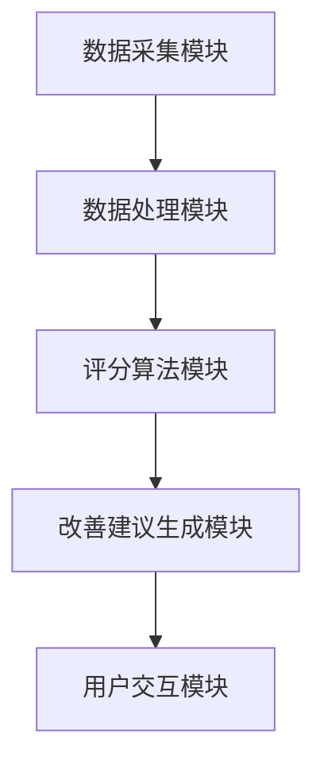

                 

# 智能个人财务健康评分与改善建议系统

## 关键词

- 智能财务管理
- 个人财务健康评分
- 数据分析与算法
- 系统架构设计
- 个性化改善建议

## 摘要

本文旨在探讨如何构建一个智能个人财务健康评分与改善建议系统。通过详细分析个人财务健康评分指标体系、数据采集与处理方法、算法模型以及系统架构设计，本文提供了从理论到实践的全面指导。系统结合了数据分析与机器学习算法，实现了对个人财务状况的实时评估，并生成个性化的改善建议，助力个人财务稳健增长。

---

## 引言与背景介绍

### 1.1 问题背景

随着人工智能技术的飞速发展，个人财务管理领域迎来了新的变革。传统的个人财务管理方法已无法满足人们日益复杂的财务需求，如何实现智能化的个人财务健康评分与改善建议系统成为亟待解决的问题。在这个大数据和人工智能的时代，利用先进的技术手段对个人财务进行智能化管理和分析，将极大地提升财务管理效率和效果。

### 1.2 问题描述

智能个人财务健康评分与改善建议系统旨在通过对用户财务数据的分析，对个人财务健康状况进行实时评估，并根据评估结果提供个性化的改善建议。具体来说，该系统需要解决以下问题：

- 如何建立一套科学的个人财务健康评分指标体系？
- 如何高效地采集和处理用户财务数据？
- 如何运用机器学习算法对财务数据进行分析，并生成准确的评分结果？
- 如何根据评分结果，制定出具有实用性和可操作性的改善建议？

### 1.3 问题解决

本文将详细介绍智能个人财务健康评分与改善建议系统的构建过程，包括核心概念、算法原理、系统架构和实现方法，帮助读者全面了解并掌握系统的设计与应用。通过理论与实践的结合，读者可以学习到从数据采集到结果呈现的全过程，从而为实际项目开发提供有力的支持。

### 1.4 边界与外延

本文主要关注以下内容：

- 个人财务健康评分指标体系的构建原则和具体指标；
- 数据采集与处理方法，包括数据清洗、归一化和数据可视化；
- 常用的机器学习算法及其在个人财务健康评分中的应用；
- 系统架构设计，包括数据采集模块、数据处理模块、评分算法模块和改善建议生成模块；
- 个性化改善建议的制定原则和方法。

### 1.5 概念结构与核心要素组成

本文的核心概念与要素包括：

- **个人财务健康评分指标体系**：建立一套科学、全面的指标体系，涵盖收入、支出、资产和债务等多个方面，为评分提供依据。
- **数据采集与处理方法**：设计高效的数据采集系统，确保数据的准确性和完整性，并采用数据清洗和归一化技术，提高数据质量。
- **数据分析与算法模型**：运用机器学习算法，对财务数据进行深度分析，生成个人财务健康评分。
- **系统架构设计与实现**：构建一个模块化、扩展性强的系统架构，实现从数据采集到改善建议生成的一整套流程。
- **个性化改善建议的制定**：根据评分结果，制定具有针对性和可操作性的改善建议，帮助用户优化财务状况。

---

## 第一部分: 引言与背景介绍

### 2.1 问题背景

#### 2.1.1 传统个人财务管理的局限

在过去的几十年中，个人财务管理主要依赖于手动记录和分析。这种传统的财务管理方法存在诸多局限性，主要体现在以下几个方面：

- **数据不完整和准确性差**：手工记录容易遗漏重要信息，导致数据不完整。同时，手工记录的数据可能存在误差，影响分析结果的准确性。
- **分析能力有限**：传统方法主要依靠人工分析，难以处理大量复杂的财务数据，导致分析能力受限。
- **缺乏个性化建议**：传统方法难以根据个人财务状况提供个性化的改善建议，往往采用通用性建议，缺乏针对性。
- **响应速度慢**：传统方法在数据更新和分析结果生成上存在较大的延迟，无法实现实时财务管理。

#### 2.1.2 人工智能在个人财务管理中的应用

随着人工智能技术的飞速发展，特别是在大数据和机器学习领域，个人财务管理迎来了新的变革。人工智能在个人财务管理中的应用主要体现在以下几个方面：

- **数据采集与处理**：通过智能传感器和数据采集设备，可以实时获取用户的财务数据，提高数据的完整性和准确性。
- **数据分析与预测**：运用机器学习算法，可以对财务数据进行分析和预测，发现潜在的风险和机会。
- **个性化建议生成**：根据个人财务状况和需求，人工智能系统能够生成个性化的改善建议，提高财务管理的效率和效果。
- **实时反馈与调整**：通过实时数据分析和反馈，人工智能系统能够快速调整财务管理策略，实现实时优化。

### 2.2 问题描述

本文旨在探讨如何构建一个智能个人财务健康评分与改善建议系统。具体来说，该系统需要实现以下目标：

- **个人财务健康评分**：通过分析用户的财务数据，对个人财务健康状况进行实时评估，生成一个评分。
- **改善建议生成**：根据评分结果，系统需要生成具有实用性和可操作性的改善建议，帮助用户优化财务状况。

为了实现上述目标，系统需要解决以下问题：

- **数据采集与处理**：如何高效地采集和处理用户的财务数据，确保数据的完整性和准确性？
- **评分算法设计**：如何设计一个科学、准确的评分算法，对个人财务健康进行评估？
- **改善建议生成**：如何根据评分结果，制定出具有针对性和可操作性的改善建议？

### 2.3 问题解决

为了解决上述问题，本文提出以下解决方案：

- **数据采集与处理**：设计一个高效的数据采集系统，采用数据清洗和归一化技术，确保数据的准确性和完整性。
- **评分算法设计**：采用机器学习算法，设计一个科学、准确的评分算法，对个人财务健康进行评估。
- **改善建议生成**：根据评分结果，采用个性化推荐算法，生成具有实用性和可操作性的改善建议。

### 2.4 边界与外延

本文主要关注以下内容：

- **个人财务健康评分指标体系**：建立一套科学、全面的指标体系，涵盖收入、支出、资产和债务等多个方面。
- **数据采集与处理方法**：设计高效的数据采集系统，采用数据清洗和归一化技术。
- **评分算法设计**：采用机器学习算法，设计一个科学、准确的评分算法。
- **改善建议生成**：根据评分结果，采用个性化推荐算法，生成实用性和可操作性强的改善建议。

本文的核心概念与要素包括：

- **个人财务健康评分指标体系**：建立指标体系，包括收入、支出、资产和债务等多个方面的指标。
- **数据采集与处理方法**：设计数据采集系统，采用数据清洗和归一化技术。
- **评分算法设计**：采用机器学习算法，设计评分算法。
- **改善建议生成**：根据评分结果，生成个性化改善建议。

---

## 第二部分: 核心概念与联系

### 2.1 个人财务健康评分指标体系

#### 2.1.1 指标体系概述

个人财务健康评分指标体系是构建智能个人财务健康评分与改善建议系统的核心组成部分。一个科学、全面的指标体系能够全面反映用户的财务状况，为评分提供依据。

#### 2.1.2 指标分类

个人财务健康评分指标可以按照不同的分类方式进行划分，常见的分类方式包括：

1. **按财务类型分类**：

   - **收入类指标**：反映个人收入水平及其稳定性，如月均收入、年收入增长率等。
   - **支出类指标**：反映个人支出情况及其结构，如月均支出、支出占比等。
   - **资产类指标**：反映个人资产状况及其结构，如资产总额、资产配置比等。
   - **债务类指标**：反映个人负债状况及其结构，如债务总额、债务占比等。

2. **按财务稳定性分类**：

   - **短期稳定性指标**：反映个人在短期内财务状况的稳定性，如月均收入波动率、月均支出波动率等。
   - **长期稳定性指标**：反映个人在长期内财务状况的稳定性，如年均收入增长率、年均支出增长率等。

3. **按财务健康程度分类**：

   - **健康度指标**：反映个人财务健康的程度，如收入健康度、支出健康度、资产健康度、债务健康度等。
   - **综合健康度指标**：通过综合各项指标，反映个人整体财务健康状况。

#### 2.1.3 具体指标

1. **收入类指标**：

   - 月均收入：$$\frac{总收入}{月数}$$
   - 年收入增长率：$$\frac{当前年收入 - 历史年收入}{历史年收入} \times 100\%$$

2. **支出类指标**：

   - 月均支出：$$\frac{总支出}{月数}$$
   - 支出占比：$$\frac{支出总额}{总收入} \times 100\%$$

3. **资产类指标**：

   - 资产总额：个人所有资产的总额。
   - 资产配置比：各类资产占总资产的比例，如房产占比、股票占比等。

4. **债务类指标**：

   - 债务总额：个人所有负债的总额。
   - 债务占比：债务总额占总收入的比例。

#### 2.1.4 指标体系构建原则

1. **全面性**：指标体系应涵盖个人财务健康的各个方面，包括收入、支出、资产和债务等。
2. **客观性**：指标数据来源应可靠，具有代表性，确保评分的客观性。
3. **可操作性**：指标应易于计算和评估，确保系统的实用性和可操作性。

### 2.2 数据分析与算法模型

#### 2.2.1 数据分析概述

数据分析是构建智能个人财务健康评分与改善建议系统的重要环节。通过数据分析，可以从大量的财务数据中提取出有价值的信息，为评分和改善建议提供依据。

#### 2.2.2 数据分析工具

1. **Python**：Python 是一种广泛应用于数据分析和机器学习的编程语言。常用的数据分析库包括 pandas、numpy、matplotlib 等。

2. **R**：R 是一种专门用于统计学习和数据可视化的语言。常用的统计学习库包括 caret、ggplot2 等。

#### 2.2.3 算法模型

算法模型是数据分析的核心。常见的算法模型包括：

1. **机器学习算法**：

   - **决策树**：适用于分类和回归问题，简单易懂。
   - **随机森林**：提高预测准确性，处理高维数据。
   - **支持向量机**：适用于分类问题，处理高维数据。
   - **神经网络**：适用于复杂非线性问题，能够处理大量数据。

2. **深度学习算法**：

   - **卷积神经网络（CNN）**：适用于图像数据。
   - **循环神经网络（RNN）**：适用于序列数据。
   - **生成对抗网络（GAN）**：适用于生成新数据。

### 2.3 系统架构设计与实现

#### 2.3.1 系统架构概述

系统架构是构建智能个人财务健康评分与改善建议系统的基础。一个合理的系统架构能够确保系统的稳定性、扩展性和可靠性。

#### 2.3.2 系统架构设计原则

1. **模块化**：系统应划分为多个模块，每个模块负责一个特定的功能，便于系统的维护和升级。
2. **扩展性**：系统应具备良好的扩展性，支持新功能的快速接入。
3. **可靠性**：系统应具备高可靠性，确保数据的准确性和系统的稳定性。

#### 2.3.3 主要模块

1. **数据采集模块**：负责采集用户的财务数据，包括收入、支出、资产和债务等。
2. **数据处理模块**：负责清洗、整理和归一化财务数据，提高数据质量。
3. **评分算法模块**：负责计算个人财务健康评分，采用机器学习算法进行分析。
4. **改善建议生成模块**：根据评分结果，生成个性化的改善建议。

### 2.4 个性化改善建议的制定

#### 2.4.1 建议制定原则

1. **实用性**：建议应针对用户的实际财务状况提出，具有实际操作价值。
2. **可操作性**：建议应易于实施和执行，确保用户能够实际应用。
3. **持续性**：建议应有助于用户的长期财务规划，实现财务稳健增长。

#### 2.4.2 建议生成方法

1. **个性化推荐算法**：根据用户的历史财务数据和评分结果，采用个性化推荐算法生成改善建议。
2. **专家系统**：结合领域专家的经验和知识，生成具有专业性的改善建议。
3. **数据驱动**：利用大数据分析技术，发现用户财务状况中的潜在问题和改进机会，生成有针对性的改善建议。

---

## 第三部分: 数据分析与算法模型

### 3.1 数据分析概述

数据分析是构建智能个人财务健康评分与改善建议系统的核心环节。通过数据分析，可以从大量的财务数据中提取出有价值的信息，为评分和改善建议提供依据。

#### 3.1.1 数据分析基本概念

1. **数据收集**：收集个人财务数据，包括收入、支出、资产和债务等。
2. **数据预处理**：清洗、整理和归一化财务数据，提高数据质量。
3. **数据可视化**：通过可视化技术，展示数据分析结果。

#### 3.1.2 数据分析工具

1. **Python**：Python 是一种广泛应用于数据分析和机器学习的编程语言。常用的数据分析库包括 pandas、numpy、matplotlib 等。
   
2. **R**：R 是一种专门用于统计学习和数据可视化的语言。常用的统计学习库包括 caret、ggplot2 等。

### 3.2 机器学习算法

机器学习算法是构建智能个人财务健康评分与改善建议系统的重要工具。通过机器学习算法，可以对财务数据进行分析和预测，生成个人财务健康评分和改善建议。

#### 3.2.1 决策树

决策树是一种常见的分类和回归算法。通过决策树，可以根据财务数据的特点，对用户进行分类和评分。

1. **原理**：决策树通过一系列的决策节点，将数据划分为不同的类别或评分区间。
2. **优点**：简单易懂，易于解释。
3. **缺点**：容易过拟合，对噪声敏感。

#### 3.2.2 随机森林

随机森林是一种基于决策树的集成算法。通过随机选取特征和样本，构建多个决策树，并求取平均结果。

1. **原理**：随机森林通过随机化方法，降低过拟合的风险，提高预测准确性。
2. **优点**：提高预测准确性，处理高维数据。
3. **缺点**：计算复杂度较高。

#### 3.2.3 支持向量机

支持向量机是一种基于优化理论的分类算法。通过最大化分类边界，提高分类效果。

1. **原理**：支持向量机通过求解优化问题，找到最佳的分类边界。
2. **优点**：适用于分类问题，处理高维数据。
3. **缺点**：对异常值敏感，计算复杂度较高。

#### 3.2.4 神经网络

神经网络是一种基于生物神经元的计算模型。通过多层神经网络，可以处理复杂的非线性问题。

1. **原理**：神经网络通过多层节点和激活函数，模拟生物神经元的计算过程。
2. **优点**：适用于复杂非线性问题，能够处理大量数据。
3. **缺点**：参数较多，训练过程复杂。

### 3.3 深度学习算法

深度学习算法是机器学习的一个分支，通过多层神经网络，可以提取出数据的深层特征。

#### 3.3.1 卷积神经网络（CNN）

卷积神经网络是一种适用于图像数据的深度学习算法。通过卷积层和池化层，可以提取出图像的特征。

1. **原理**：卷积神经网络通过卷积操作，提取图像的特征。
2. **优点**：适用于图像识别和分类。
3. **缺点**：对图像数据的要求较高。

#### 3.3.2 循环神经网络（RNN）

循环神经网络是一种适用于序列数据的深度学习算法。通过循环结构，可以处理序列数据。

1. **原理**：循环神经网络通过循环连接，处理序列数据。
2. **优点**：适用于语音识别、自然语言处理等。
3. **缺点**：容易发生梯度消失和梯度爆炸问题。

#### 3.3.3 生成对抗网络（GAN）

生成对抗网络是一种生成模型，通过生成器和判别器的对抗训练，可以生成高质量的数据。

1. **原理**：生成对抗网络通过生成器和判别器的对抗训练，生成高质量的数据。
2. **优点**：适用于图像生成、文本生成等。
3. **缺点**：训练过程复杂，对数据要求较高。

### 3.4 数据分析与算法模型的应用

在构建智能个人财务健康评分与改善建议系统时，可以结合不同算法的特点，设计合适的算法模型。

1. **数据收集**：通过传感器、API 等，收集用户的财务数据。
2. **数据预处理**：清洗、整理和归一化财务数据，提高数据质量。
3. **模型选择**：根据数据特点和业务需求，选择合适的机器学习算法。
4. **模型训练**：通过训练数据，训练模型，优化模型参数。
5. **模型评估**：通过测试数据，评估模型的效果，调整模型参数。
6. **模型应用**：将训练好的模型应用于实际业务，生成个人财务健康评分和改善建议。

---

## 第四部分: 系统架构设计与实现

### 4.1 系统架构概述

智能个人财务健康评分与改善建议系统是一个复杂的系统，需要多个模块协同工作。系统架构设计的关键是要确保系统的高效性、稳定性和可扩展性。本节将介绍系统架构的设计原则、主要模块及其功能。

#### 4.1.1 系统架构设计原则

1. **模块化**：系统应划分为多个模块，每个模块负责一个特定的功能，便于系统的维护和升级。
2. **扩展性**：系统应具备良好的扩展性，支持新功能的快速接入。
3. **可靠性**：系统应具备高可靠性，确保数据的准确性和系统的稳定性。
4. **灵活性**：系统应具备灵活性，能够根据用户需求进行定制化调整。

#### 4.1.2 主要模块

1. **数据采集模块**：负责收集用户的财务数据，包括收入、支出、资产和债务等。数据采集模块可以使用各种传感器、API 等手段，确保数据的准确性和完整性。

2. **数据处理模块**：负责清洗、整理和归一化财务数据，提高数据质量。数据处理模块应包括数据清洗、数据整理和数据归一化等功能。

3. **评分算法模块**：负责计算个人财务健康评分。评分算法模块应采用机器学习算法，如决策树、随机森林、神经网络等，对财务数据进行深度分析，生成个人财务健康评分。

4. **改善建议生成模块**：根据评分结果，生成个性化的改善建议。改善建议生成模块应结合用户的历史数据、评分结果以及领域专家的知识，生成具有实用性和可操作性的改善建议。

5. **用户交互模块**：负责与用户进行交互，提供评分结果和改善建议。用户交互模块应支持多种交互方式，如 Web 界面、移动应用等，方便用户使用。

### 4.2 系统架构设计

智能个人财务健康评分与改善建议系统的架构设计如图所示：

#### 4.2.1 数据采集模块

数据采集模块是系统的入口，负责从各种渠道收集用户的财务数据。数据来源可能包括银行账户信息、投资账户信息、信用卡消费记录等。数据采集模块应具备以下功能：

- **数据接入**：通过 API、Web 界面、手机应用等，接入各种数据源。
- **数据清洗**：去除重复数据、异常数据等，确保数据质量。
- **数据存储**：将清洗后的数据存储到数据库中，供后续模块使用。

#### 4.2.2 数据处理模块

数据处理模块负责对采集到的财务数据进行清洗、整理和归一化，提高数据质量。数据处理模块应包括以下功能：

- **数据清洗**：去除重复数据、异常数据等，确保数据质量。
- **数据整理**：对数据进行格式化处理，使其符合系统要求。
- **数据归一化**：对数据进行归一化处理，使其在同一尺度上，便于分析。

#### 4.2.3 评分算法模块

评分算法模块是系统的核心，负责对财务数据进行分析和评分。评分算法模块应包括以下功能：

- **特征提取**：从财务数据中提取关键特征，如收入、支出、资产和债务等。
- **模型训练**：使用机器学习算法，如决策树、随机森林、神经网络等，对财务数据进行训练，生成评分模型。
- **评分计算**：使用训练好的模型，对用户财务数据进行分析和评分，生成个人财务健康评分。

#### 4.2.4 改善建议生成模块

改善建议生成模块根据评分结果，生成个性化的改善建议。改善建议生成模块应包括以下功能：

- **评分结果分析**：对评分结果进行分析，识别用户的财务状况问题。
- **建议生成**：根据评分结果和分析结果，生成具有实用性和可操作性的改善建议。
- **建议优化**：根据用户反馈，不断优化改善建议，提高其质量。

#### 4.2.5 用户交互模块

用户交互模块负责与用户进行交互，提供评分结果和改善建议。用户交互模块应包括以下功能：

- **界面展示**：通过 Web 界面、移动应用等，展示评分结果和改善建议。
- **用户反馈**：收集用户对评分结果和改善建议的反馈，用于优化系统。
- **用户互动**：提供用户与系统互动的功能，如问答、聊天等。

---

## 第五部分：个性化改善建议的制定

### 5.1 个性化改善建议的重要性

在智能个人财务健康评分与改善建议系统中，个性化改善建议的制定至关重要。传统财务管理方法通常提供通用的建议，无法充分考虑个体的财务状况和需求。而个性化改善建议能够根据用户的实际情况，提供有针对性的建议，从而提高财务管理的效率和效果。

#### 5.1.1 实用性

个性化改善建议必须具备实用性，即建议需要具有实际操作价值，能够帮助用户在现实生活中进行调整和优化。例如，如果系统发现用户的债务负担较重，可以建议用户减少不必要的开支或增加收入来源。

#### 5.1.2 可操作性

建议的可操作性是确保用户能够实际应用的关键。例如，建议应明确具体的操作步骤，并提供必要的资源和支持。例如，如果建议用户进行投资，系统应提供详细的投资策略和推荐的投资产品。

#### 5.1.3 持续性

个性化改善建议应具备持续性，即建议应有助于用户的长期财务规划，而不仅仅是短期调整。例如，系统可以建议用户建立紧急储备金、制定退休规划等，以确保财务的长期稳健。

### 5.2 建议生成方法

个性化改善建议的生成是一个复杂的过程，涉及多个步骤和算法。以下是一种可能的建议生成方法：

1. **用户数据收集**：系统首先需要收集用户的财务数据，包括收入、支出、资产和债务等。

2. **数据分析**：对收集到的数据进行深入分析，识别用户的财务状况和潜在问题。

3. **问题识别**：根据分析结果，识别用户在财务管理中存在的主要问题。例如，高负债率、不合理的支出结构等。

4. **建议制定**：根据问题识别的结果，系统需要生成具体的改善建议。这可以通过以下方法实现：

   - **专家系统**：结合领域专家的经验和知识，生成具有专业性的改善建议。
   - **机器学习模型**：使用机器学习算法，根据用户的历史数据和评分结果，生成个性化的改善建议。
   - **数据驱动方法**：利用大数据分析技术，发现用户财务状况中的潜在问题和改进机会，生成有针对性的改善建议。

5. **建议优化**：系统应提供用户反馈渠道，收集用户对改善建议的反馈，用于优化建议的质量。

### 5.3 实际案例分析

为了更好地理解个性化改善建议的制定过程，以下是一个实际案例：

#### 案例背景

张先生，30 岁，未婚，月均收入 15000 元，月均支出 12000 元，主要支出包括生活费用、房租和娱乐消费。张先生有一笔未偿还的信用卡债务，总额 30000 元。

#### 案例分析

1. **数据分析**：系统收集了张先生的财务数据，并进行了分析。发现张先生的支出高于收入，且信用卡债务负担较重。

2. **问题识别**：根据分析结果，系统识别出以下问题：

   - 支出高于收入，导致财务状况紧张。
   - 信用卡债务负担较重，可能影响未来的财务状况。

3. **建议制定**：

   - **减少不必要支出**：系统建议张先生减少不必要的娱乐消费和购物支出。
   - **增加收入**：系统建议张先生通过兼职或加班等方式，增加收入。
   - **债务管理**：系统建议张先生制定一个合理的还款计划，逐步减轻债务负担。

4. **建议优化**：系统提供了一个反馈渠道，张先生可以根据自己的实际情况，对建议进行调整和优化。

#### 案例总结

通过个性化改善建议的制定，张先生能够有针对性地调整自己的财务状况，实现财务的稳健增长。

---

## 结论

本文探讨了如何构建一个智能个人财务健康评分与改善建议系统。通过详细分析个人财务健康评分指标体系、数据采集与处理方法、算法模型以及系统架构设计，本文为读者提供了一个全面的解决方案。智能个人财务健康评分与改善建议系统不仅能够实时评估个人财务状况，还能生成具有实用性和可操作性的改善建议，帮助用户实现财务的稳健增长。

## 最佳实践 tips

1. **数据质量**：确保数据采集和处理的准确性，是构建高效系统的关键。在数据采集过程中，要尽量避免数据缺失和错误。
2. **模型优化**：定期对评分模型进行优化，可以提升评分的准确性和稳定性。可以通过交叉验证、模型调参等方法，提高模型性能。
3. **用户反馈**：鼓励用户提供反馈，根据用户的实际需求和反馈，不断优化改善建议的质量。
4. **安全与隐私**：在处理用户财务数据时，要确保数据的安全性和隐私性。采取适当的数据加密和访问控制措施，防止数据泄露。

## 注意事项

1. **数据隐私**：在收集和处理用户财务数据时，必须严格遵守相关法律法规，保护用户的隐私权。
2. **模型解释性**：在选择机器学习算法时，要考虑算法的可解释性，以便用户理解评分和改善建议的依据。
3. **系统稳定性**：确保系统的稳定性，特别是在高并发场景下，要设计合理的负载均衡和容错机制。

## 拓展阅读

- **《机器学习实战》**：由 Peter Harrington 著，详细介绍了机器学习算法的应用和实践。
- **《深度学习》**：由 Ian Goodfellow、Yoshua Bengio 和 Aaron Courville 著，介绍了深度学习的基本原理和应用。
- **《Python数据分析》**：由 Wes McKinney 著，详细介绍了 Python 在数据分析中的应用。

---

## 作者信息

**作者：AI天才研究院/AI Genius Institute & 禅与计算机程序设计艺术 /Zen And The Art of Computer Programming**

AI天才研究院（AI Genius Institute）专注于人工智能领域的研究和开发，致力于推动人工智能技术的创新和应用。同时，作者还是《禅与计算机程序设计艺术》（Zen And The Art of Computer Programming）一书的作者，对计算机科学和编程艺术有着深刻的理解和独到的见解。本文由AI天才研究院撰写，旨在为读者提供关于智能个人财务健康评分与改善建议系统的深入分析和实用指南。|

