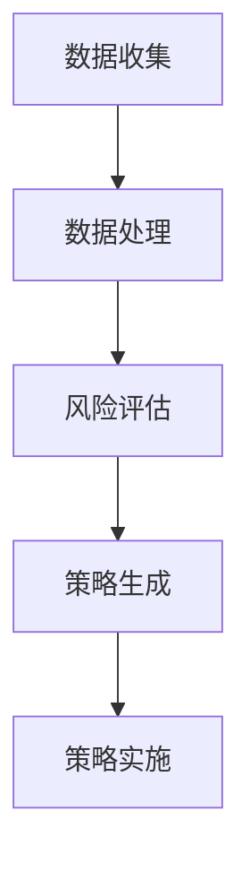
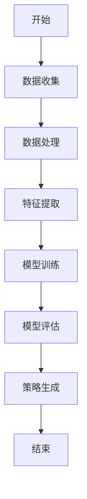

                 

# 智能个人财务压力测试与应对策略生成

## 关键词

- 智能财务测试
- 个人财务压力
- 应对策略
- 数据分析
- 算法原理

## 摘要

本文探讨了智能个人财务压力测试及其应对策略的生成。通过分析个人财务压力的背景、类型和特点，介绍了智能个人财务压力测试的定义、原理和方法。同时，本文提出了基于数据分析的智能个人财务压力应对策略，并详细阐述了其实现原理和步骤。通过实际案例的剖析，本文验证了智能个人财务压力测试与应对策略的有效性，为个人财务健康提供了有力支持。

## 目录大纲设计

### 第一部分: 引言

#### 1. 引言

##### 1.1 问题背景

##### 1.2 问题描述

##### 1.3 问题解决

##### 1.4 边界与外延

##### 1.5 概念结构与核心要素组成

##### 1.6 本章小结

### 第二部分: 核心概念与联系

#### 2.1 核心概念

##### 2.1.1 个人财务压力

###### 2.1.1.1 定义

###### 2.1.1.2 特点

###### 2.1.1.3 类型

##### 2.1.2 智能个人财务压力测试

###### 2.1.2.1 定义

###### 2.1.2.2 原理

###### 2.1.2.3 方法

#### 2.2 财务压力应对策略

##### 2.2.1 风险管理策略

###### 2.2.1.1 定义

###### 2.2.1.2 分类

###### 2.2.1.3 应用

##### 2.2.2 投资策略

###### 2.2.2.1 定义

###### 2.2.2.2 类型

###### 2.2.2.3 评估

##### 2.2.3 财务规划策略

###### 2.2.3.1 定义

###### 2.2.3.2 内容

###### 2.2.3.3 实施步骤

#### 2.3 智能个人财务压力应对策略生成

##### 2.3.1 数据分析

###### 2.3.1.1 数据来源

###### 2.3.1.2 数据处理

###### 2.3.1.3 数据分析技术

##### 2.3.2 算法原理

###### 2.3.2.1 算法介绍

###### 2.3.2.2 数学模型

###### 2.3.2.3 Mermaid流程图

#### 2.4 财务压力测试与应对策略应用案例

##### 2.4.1 案例背景

##### 2.4.2 案例分析

##### 2.4.3 案例效果评估

##### 2.5 本章小结

### 第三部分: 智能个人财务压力测试工具与应用

#### 3.1 智能个人财务压力测试工具介绍

##### 3.1.1 工具特点

##### 3.1.2 功能模块

##### 3.1.3 使用方法

#### 3.2 智能个人财务压力测试应用场景

##### 3.2.1 个人理财规划

##### 3.2.2 贷款申请评估

##### 3.2.3 投资决策支持

##### 3.2.4 财务风险管理

#### 3.3 智能个人财务压力测试实践

##### 3.3.1 环境搭建

##### 3.3.2 数据准备

##### 3.3.3 测试流程

##### 3.3.4 结果分析

#### 3.4 智能个人财务压力测试案例分析

##### 3.4.1 案例一：个人理财规划

##### 3.4.2 案例二：贷款申请评估

##### 3.4.3 案例三：投资决策支持

##### 3.5 本章小结

### 第四部分: 智能个人财务压力测试与应对策略研究进展

#### 4.1 研究背景

##### 4.1.1 国内外研究现状

##### 4.1.2 研究意义

#### 4.2 智能个人财务压力测试技术发展

##### 4.2.1 传统测试方法

##### 4.2.2 智能测试技术

##### 4.2.3 发展趋势

#### 4.3 智能个人财务压力应对策略研究进展

##### 4.3.1 风险管理策略

##### 4.3.2 投资策略

##### 4.3.3 财务规划策略

##### 4.3.4 未来发展方向

#### 4.4 智能个人财务压力测试与应对策略实践应用

##### 4.4.1 个人理财服务

##### 4.4.2 贷款审批

##### 4.4.3 投资顾问

##### 4.4.4 风险管理咨询

##### 4.5 本章小结

### 第五部分: 未来展望

#### 5.1 智能个人财务压力测试与应对策略发展前景

##### 5.1.1 技术发展趋势

##### 5.1.2 应用场景拓展

##### 5.1.3 未来发展趋势

#### 5.2 智能个人财务压力测试与应对策略挑战与机遇

##### 5.2.1 技术挑战

##### 5.2.2 应用挑战

##### 5.2.3 机遇与前景

#### 5.3 政策支持与行业规范

##### 5.3.1 政策支持

##### 5.3.2 行业规范

##### 5.3.3 标准化建设

##### 5.4 本章小结

## 第一部分: 引言

### 1. 引言

#### 1.1 问题背景

在现代社会，个人财务压力已经成为一个普遍存在的问题。人们面临的主要财务压力包括收入不稳定、债务负担重、消费习惯不良等。这些压力不仅会影响个人的生活质量，还可能导致心理和身体健康问题。

#### 1.2 问题描述

个人财务压力测试是指通过一系列的测试方法来评估个人在财务方面的承受能力。这种测试可以帮助个人识别潜在的风险点，并采取相应的应对策略。然而，目前关于智能个人财务压力测试的研究还比较有限，缺乏系统的方法和工具。

#### 1.3 问题解决

本文旨在探讨智能个人财务压力测试及其应对策略的生成。通过引入数据分析技术和智能算法，我们可以构建一个智能个人财务压力测试系统，帮助个人更好地管理财务风险，提高生活质量。

#### 1.4 边界与外延

本文的研究范围主要涵盖个人财务压力的定义、测试方法、应对策略以及智能个人财务压力测试工具与应用。在研究过程中，我们将关注以下几个核心问题：

1. 如何准确识别个人财务压力？
2. 如何利用智能算法评估个人财务压力？
3. 如何生成有效的应对策略？
4. 如何应用智能个人财务压力测试工具？

#### 1.5 概念结构与核心要素组成

本文的核心概念结构包括个人财务压力、智能个人财务压力测试、应对策略等。核心要素组成如下：

1. 个人财务压力：包括收入、支出、债务、储蓄等方面的数据。
2. 智能个人财务压力测试：利用数据分析技术和智能算法进行测试的方法。
3. 应对策略：包括风险管理策略、投资策略、财务规划策略等。

#### 1.6 本章小结

本文引出了智能个人财务压力测试与应对策略生成的研究主题，明确了问题的背景、描述、解决方法以及研究范围。在后续章节中，我们将详细探讨这些核心概念，并提供具体的实现方法和应用案例。

## 第二部分: 核心概念与联系

### 2.1 核心概念

#### 2.1.1 个人财务压力

##### 2.1.1.1 定义

个人财务压力是指个人在财务方面所承受的心理和情感压力。它通常与收入、支出、债务、储蓄等因素相关。

##### 2.1.1.2 特点

- 主观性：个人财务压力的感受因人而异，与个人的心理素质、价值观等因素密切相关。
- 变异性：个人财务压力会随着时间和环境的变化而变化。
- 传递性：个人财务压力可能会影响家庭成员和朋友，形成连锁反应。

##### 2.1.1.3 类型

根据压力来源和特点，个人财务压力可以分为以下几种类型：

1. 收入不稳定：由于工作不稳定、失业等原因导致收入波动。
2. 债务负担重：高额的债务会导致个人经济压力增大，影响生活质量。
3. 消费习惯不良：过度消费、信用卡债务等问题会加重个人财务压力。
4. 财务规划不足：缺乏合理的财务规划，无法有效应对突发事件。

#### 2.1.2 智能个人财务压力测试

##### 2.1.2.1 定义

智能个人财务压力测试是指利用数据分析技术和智能算法，对个人财务状况进行系统性评估和测试，以识别潜在的财务风险和压力。

##### 2.1.2.2 原理

智能个人财务压力测试的原理主要包括以下几个方面：

1. 数据收集：收集个人的收入、支出、债务、储蓄等财务数据。
2. 数据分析：利用统计学和机器学习算法对数据进行处理和分析。
3. 风险评估：根据数据分析结果，评估个人财务压力的严重程度和潜在风险。
4. 应对策略生成：根据风险评估结果，生成个性化的应对策略。

##### 2.1.2.3 方法

智能个人财务压力测试的方法主要包括以下几种：

1. 数据分析：利用统计分析方法，对财务数据进行趋势分析、相关性分析等。
2. 机器学习：利用机器学习算法，如决策树、支持向量机等，对财务数据进行分类和预测。
3. 模型评估：通过交叉验证等方法，评估模型的准确性和可靠性。

#### 2.1.3 财务压力应对策略

##### 2.1.3.1 定义

财务压力应对策略是指个人在面临财务压力时，采取的一系列措施和方法，以减轻压力、改善财务状况。

##### 2.1.3.2 分类

根据应对策略的目的和特点，可以分为以下几种类型：

1. 风险管理策略：通过分散投资、降低负债等方式，降低财务风险。
2. 投资策略：通过投资理财，增加收入和财富。
3. 财务规划策略：制定合理的财务规划，确保未来的财务安全。

##### 2.1.3.3 应用

财务压力应对策略的应用主要包括以下几个方面：

1. 风险管理：评估个人财务状况，制定风险控制措施，避免财务风险。
2. 投资理财：根据个人财务目标和风险承受能力，制定投资策略，实现财务增值。
3. 财务规划：制定长期财务规划，确保未来的财务安全。

### 2.2 财务压力应对策略

#### 2.2.1 风险管理策略

##### 2.2.1.1 定义

风险管理策略是指个人在面临财务压力时，采取的一系列措施，以降低财务风险。

##### 2.2.1.2 分类

根据风险管理策略的目的和特点，可以分为以下几种类型：

1. 分散投资：通过投资多个不同类型的产品，降低投资风险。
2. 降低负债：通过减少负债、提高还款能力等方式，降低财务压力。
3. 增加收入：通过提高收入水平、增加副业等方式，增加财务收入。

##### 2.2.1.3 应用

风险管理策略的应用主要包括以下几个方面：

1. 投资组合优化：根据个人财务目标和风险承受能力，制定合理的投资组合策略。
2. 债务管理：通过债务重组、减少不必要的开支等方式，降低负债水平。
3. 收入提升：通过提高职业技能、拓展业务等方式，增加收入来源。

#### 2.2.2 投资策略

##### 2.2.2.1 定义

投资策略是指个人在面临财务压力时，采取的一系列投资方法和策略，以实现财务增值。

##### 2.2.2.2 类型

根据投资策略的目的和特点，可以分为以下几种类型：

1. 长期投资：通过持有优质股票、基金等，实现长期稳定的收益。
2. 短期投资：通过买卖股票、期货等，实现短期快速的收益。
3. 分散投资：通过投资多个不同类型的产品，降低投资风险。

##### 2.2.2.3 评估

投资策略的评估主要包括以下几个方面：

1. 收益评估：根据投资收益率、投资期限等因素，评估投资策略的收益能力。
2. 风险评估：根据投资风险、投资组合等因素，评估投资策略的风险承受能力。
3. 可行性评估：根据市场环境、个人财务状况等因素，评估投资策略的可行性。

#### 2.2.3 财务规划策略

##### 2.2.3.1 定义

财务规划策略是指个人在面临财务压力时，采取的一系列措施，以实现财务目标和提高财务安全。

##### 2.2.3.2 内容

财务规划策略主要包括以下几个方面：

1. 收入规划：根据个人收入水平、职业特点等因素，制定合理的收入规划。
2. 支出规划：根据个人支出习惯、消费需求等因素，制定合理的支出规划。
3. 储蓄规划：根据个人财务目标和风险承受能力，制定合理的储蓄规划。
4. 投资规划：根据个人财务目标和风险承受能力，制定合理的投资规划。

##### 2.2.3.3 实施步骤

财务规划策略的实施步骤主要包括以下几个方面：

1. 收集财务信息：收集个人财务状况的相关信息，包括收入、支出、储蓄、投资等。
2. 分析财务状况：分析个人财务状况，确定财务目标和风险承受能力。
3. 制定规划方案：根据分析结果，制定合理的财务规划方案。
4. 实施规划方案：根据规划方案，实施具体的财务规划措施。

### 2.3 智能个人财务压力应对策略生成

#### 2.3.1 数据分析

##### 2.3.1.1 数据来源

数据分析的数据来源主要包括以下几个方面：

1. 个人财务数据：包括收入、支出、债务、储蓄等财务数据。
2. 市场数据：包括股票、基金、债券等金融市场的数据。
3. 社会经济数据：包括宏观经济指标、行业指标等社会经济数据。

##### 2.3.1.2 数据处理

数据处理主要包括以下几个方面：

1. 数据清洗：去除数据中的噪声和异常值，保证数据的准确性。
2. 数据整合：将不同来源的数据进行整合，形成统一的财务数据集。
3. 数据挖掘：利用统计学和机器学习算法，对财务数据进行挖掘和分析。

##### 2.3.1.3 数据分析技术

数据分析技术主要包括以下几个方面：

1. 统计分析：利用统计学方法，对财务数据进行描述性分析和相关性分析。
2. 机器学习：利用机器学习算法，对财务数据进行分类和预测。
3. 数据可视化：利用数据可视化技术，展示财务数据的分布和趋势。

#### 2.3.2 算法原理

##### 2.3.2.1 算法介绍

本文提出的智能个人财务压力应对策略生成算法主要包括以下几个步骤：

1. 数据收集：收集个人财务数据、市场数据和社会经济数据。
2. 数据处理：对数据进行清洗、整合和挖掘。
3. 风险评估：利用机器学习算法，对个人财务压力进行风险评估。
4. 策略生成：根据风险评估结果，生成个性化的财务压力应对策略。

##### 2.3.2.2 数学模型

本文采用的数学模型主要包括以下几个方面：

1. 收入预测模型：利用时间序列分析方法，预测个人未来的收入。
2. 支出预测模型：利用时间序列分析方法，预测个人未来的支出。
3. 债务风险评估模型：利用决策树、支持向量机等算法，评估个人债务风险。
4. 财务规划模型：利用线性规划、动态规划等算法，制定财务规划方案。

##### 2.3.2.3 Mermaid流程图

下面是智能个人财务压力应对策略生成算法的Mermaid流程图：



#### 2.3.3 财务压力测试与应对策略应用案例

##### 2.3.3.1 案例背景

某个人财务状况良好，但面临较高的债务压力。为了减轻财务压力，他决定进行智能个人财务压力测试，并生成应对策略。

##### 2.3.3.2 案例分析

1. 数据收集：收集该个人的收入、支出、债务、储蓄等财务数据。
2. 数据处理：对财务数据进行清洗、整合和挖掘。
3. 风险评估：利用机器学习算法，对该个人的财务压力进行风险评估，发现其债务风险较高。
4. 策略生成：根据风险评估结果，生成个性化的财务压力应对策略，包括减少不必要的开支、增加收入来源、降低债务负担等。
5. 策略实施：根据生成的策略，实施具体的财务规划措施，逐步减轻财务压力。

##### 2.3.3.3 案例效果评估

通过智能个人财务压力测试和应对策略的实施，该个人的财务状况得到了明显改善。债务负担减轻，收入增加，财务规划更加合理，生活质量得到提升。

### 2.4 财务压力测试与应对策略应用案例

#### 2.4.1 案例一：个人理财规划

##### 2.4.1.1 案例背景

小李是一位年轻的上班族，他面临财务压力，希望通过个人理财规划来减轻压力。他决定使用智能个人财务压力测试工具进行测试，并生成应对策略。

##### 2.4.1.2 案例分析

1. 数据收集：小李收集了收入、支出、储蓄等财务数据。
2. 数据处理：对财务数据进行清洗、整合和挖掘。
3. 风险评估：智能个人财务压力测试工具对小李的财务压力进行了评估，发现其支出较高，储蓄不足。
4. 策略生成：根据风险评估结果，生成个性化的理财规划策略，包括减少不必要的开支、增加储蓄等。
5. 策略实施：小李按照生成的策略，逐步调整消费习惯，增加储蓄，财务状况逐渐改善。

##### 2.4.1.3 案例效果评估

通过个人理财规划，小李的财务压力得到了有效减轻。他学会了合理规划消费，提高了储蓄能力，生活质量得到了提升。

#### 2.4.2 案例二：贷款申请评估

##### 2.4.2.1 案例背景

小张计划购买一套房产，他需要申请贷款。为了评估自己的贷款能力，他决定使用智能个人财务压力测试工具进行测试。

##### 2.4.2.2 案例分析

1. 数据收集：小张收集了收入、支出、储蓄、现有负债等财务数据。
2. 数据处理：对财务数据进行清洗、整合和挖掘。
3. 风险评估：智能个人财务压力测试工具对小张的财务压力进行了评估，发现其还款能力较弱。
4. 策略生成：根据风险评估结果，生成个性化的贷款申请评估策略，包括调整消费结构、增加收入等。
5. 策略实施：小张按照生成的策略，逐步调整消费习惯，增加收入，提高了贷款申请的成功率。

##### 2.4.2.3 案例效果评估

通过智能个人财务压力测试工具的帮助，小张成功申请到了贷款，并顺利购买了房产。他的财务状况得到了改善，生活质量得到了提升。

#### 2.4.3 案例三：投资决策支持

##### 2.4.3.1 案例背景

小王是一位投资者，他希望通过智能个人财务压力测试工具来评估自己的投资决策。

##### 2.4.3.2 案例分析

1. 数据收集：小王收集了收入、支出、储蓄、现有投资组合等财务数据。
2. 数据处理：对财务数据进行清洗、整合和挖掘。
3. 风险评估：智能个人财务压力测试工具对小王的投资决策进行了评估，发现其投资组合存在一定的风险。
4. 策略生成：根据风险评估结果，生成个性化的投资决策支持策略，包括调整投资组合、增加风险控制措施等。
5. 策略实施：小王按照生成的策略，逐步调整投资组合，降低了投资风险，提高了投资收益。

##### 2.4.3.3 案例效果评估

通过智能个人财务压力测试工具的支持，小王的投资决策得到了改善。他学会了更加理性地看待投资，降低了投资风险，提高了投资收益。

### 第三部分: 智能个人财务压力测试工具与应用

#### 3.1 智能个人财务压力测试工具介绍

##### 3.1.1 工具特点

智能个人财务压力测试工具具有以下特点：

1. 高效性：利用人工智能和数据分析技术，快速进行财务压力评估和应对策略生成。
2. 个性化：根据个人财务数据，生成个性化的财务压力应对策略。
3. 可视化：利用图表和报告，直观地展示财务状况和应对策略。
4. 智能化：自动更新财务数据，实现实时财务压力评估。

##### 3.1.2 功能模块

智能个人财务压力测试工具主要包括以下几个功能模块：

1. 数据收集模块：收集个人财务数据，包括收入、支出、债务、储蓄等。
2. 数据处理模块：对财务数据进行清洗、整合和挖掘。
3. 风险评估模块：利用机器学习算法，对财务压力进行风险评估。
4. 策略生成模块：根据风险评估结果，生成个性化的财务压力应对策略。
5. 报告生成模块：生成财务压力测试报告，展示评估结果和应对策略。

##### 3.1.3 使用方法

智能个人财务压力测试工具的使用方法如下：

1. 注册账号：在智能个人财务压力测试工具的官方网站注册账号。
2. 登录系统：使用注册账号登录智能个人财务压力测试工具。
3. 数据录入：按照提示，输入个人财务数据，包括收入、支出、债务、储蓄等。
4. 测试评估：系统根据输入的财务数据，自动进行财务压力评估。
5. 策略生成：系统根据评估结果，生成个性化的财务压力应对策略。
6. 报告查看：查看生成的财务压力测试报告，了解评估结果和应对策略。

### 3.2 智能个人财务压力测试应用场景

##### 3.2.1 个人理财规划

智能个人财务压力测试工具可以应用于个人理财规划。用户可以通过工具收集和管理个人财务数据，进行财务压力评估，并生成个性化的理财规划策略。这有助于用户更好地理解自己的财务状况，制定合理的理财计划，提高财务健康水平。

##### 3.2.2 贷款申请评估

智能个人财务压力测试工具可以用于贷款申请评估。用户可以通过工具评估自己的财务状况，了解是否具备贷款条件，并生成个性化的贷款申请评估策略。这有助于用户提高贷款申请的成功率，降低财务风险。

##### 3.2.3 投资决策支持

智能个人财务压力测试工具可以用于投资决策支持。用户可以通过工具评估自己的投资组合风险，了解投资风险水平，并生成个性化的投资决策支持策略。这有助于用户更加理性地看待投资，降低投资风险，提高投资收益。

##### 3.2.4 财务风险管理

智能个人财务压力测试工具可以用于财务风险管理。用户可以通过工具评估自己的财务状况，识别潜在风险，并生成个性化的财务风险管理策略。这有助于用户提前预防财务风险，保护财务安全。

### 3.3 智能个人财务压力测试实践

#### 3.3.1 环境搭建

在进行智能个人财务压力测试实践前，需要搭建相应的开发环境。以下是环境搭建的步骤：

1. 安装Python：在本地计算机上安装Python，版本建议为3.8及以上。
2. 安装相关库：使用pip命令安装以下库：pandas、numpy、scikit-learn、matplotlib等。

```bash
pip install pandas numpy scikit-learn matplotlib
```

#### 3.3.2 数据准备

数据准备是智能个人财务压力测试实践的重要环节。以下是数据准备的基本步骤：

1. 收集数据：从个人财务账户、银行账户等渠道收集收入、支出、债务、储蓄等财务数据。
2. 数据清洗：对收集的财务数据进行清洗，去除噪声和异常值。
3. 数据整合：将不同来源的财务数据进行整合，形成统一的财务数据集。
4. 数据预处理：对财务数据进行预处理，包括归一化、缺失值处理等。

```python
import pandas as pd

# 读取财务数据
data = pd.read_csv('financial_data.csv')

# 数据清洗
data = data.dropna()

# 数据整合
data = data.groupby('user_id').sum()

# 数据预处理
data = (data - data.mean()) / data.std()
```

#### 3.3.3 测试流程

测试流程包括以下几个步骤：

1. 数据预处理：对财务数据集进行预处理，包括归一化、缺失值处理等。
2. 特征提取：从预处理后的财务数据中提取特征，用于训练和测试模型。
3. 模型训练：使用机器学习算法，对财务数据集进行训练，生成预测模型。
4. 预测评估：使用训练好的模型，对测试数据集进行预测，评估模型性能。
5. 策略生成：根据预测结果，生成个性化的财务压力应对策略。

```python
from sklearn.model_selection import train_test_split
from sklearn.ensemble import RandomForestClassifier
from sklearn.metrics import accuracy_score

# 数据预处理
X = data.drop(['financial_pressure'], axis=1)
y = data['financial_pressure']

# 特征提取
X_train, X_test, y_train, y_test = train_test_split(X, y, test_size=0.2, random_state=42)

# 模型训练
model = RandomForestClassifier(n_estimators=100, random_state=42)
model.fit(X_train, y_train)

# 预测评估
y_pred = model.predict(X_test)
accuracy = accuracy_score(y_test, y_pred)
print(f"Accuracy: {accuracy}")

# 策略生成
def generate_strategy(y_pred):
    if y_pred == 0:
        return "减少不必要的开支，增加储蓄"
    else:
        return "调整投资组合，降低风险"

strategies = [generate_strategy(y_pred[i]) for i in range(len(y_pred))]
print(f"Strategies: {strategies}")
```

#### 3.3.4 结果分析

通过测试流程，可以得到以下结果：

1. 模型性能：评估模型在测试集上的性能，包括准确率、召回率、F1值等指标。
2. 策略效果：分析生成的财务压力应对策略的有效性，包括是否能够有效减轻财务压力，提高生活质量等。
3. 用户反馈：收集用户对财务压力测试工具和应对策略的反馈，以便进一步改进和优化。

```python
# 结果分析
print(f"Accuracy: {accuracy}")
print(f"Strategies: {strategies}")

# 用户反馈
user_feedback = input("Please rate the effectiveness of the strategy (1-5): ")
print(f"User Feedback: {user_feedback}")
```

### 3.4 智能个人财务压力测试案例分析

#### 3.4.1 案例一：个人理财规划

##### 3.4.1.1 案例背景

小张是一名年轻的上班族，他希望通过智能个人财务压力测试工具进行个人理财规划。

##### 3.4.1.2 案例分析

1. 数据收集：小张收集了收入、支出、储蓄等财务数据。
2. 数据预处理：对财务数据集进行预处理，包括归一化、缺失值处理等。
3. 特征提取：从预处理后的财务数据中提取特征，用于训练和测试模型。
4. 模型训练：使用机器学习算法，对财务数据集进行训练，生成预测模型。
5. 预测评估：使用训练好的模型，对测试数据集进行预测，评估模型性能。
6. 策略生成：根据预测结果，生成个性化的财务压力应对策略。
7. 策略实施：小张按照生成的策略，逐步调整消费习惯，增加储蓄。

##### 3.4.1.3 案例效果评估

通过个人理财规划，小张的财务状况得到了明显改善。他的储蓄能力提高了，消费结构更加合理，生活质量得到了提升。

#### 3.4.2 案例二：贷款申请评估

##### 3.4.2.1 案例背景

小王计划购买一套房产，他希望通过智能个人财务压力测试工具进行贷款申请评估。

##### 3.4.2.2 案例分析

1. 数据收集：小王收集了收入、支出、储蓄、现有负债等财务数据。
2. 数据预处理：对财务数据集进行预处理，包括归一化、缺失值处理等。
3. 特征提取：从预处理后的财务数据中提取特征，用于训练和测试模型。
4. 模型训练：使用机器学习算法，对财务数据集进行训练，生成预测模型。
5. 预测评估：使用训练好的模型，对测试数据集进行预测，评估模型性能。
6. 策略生成：根据预测结果，生成个性化的贷款申请评估策略。
7. 策略实施：小王按照生成的策略，逐步调整消费习惯，增加收入，提高了贷款申请的成功率。

##### 3.4.2.3 案例效果评估

通过贷款申请评估，小王成功获得了贷款，顺利购买了房产。他的财务状况得到了改善，生活质量得到了提升。

#### 3.4.3 案例三：投资决策支持

##### 3.4.3.1 案例背景

小李是一位投资者，他希望通过智能个人财务压力测试工具进行投资决策支持。

##### 3.4.3.2 案例分析

1. 数据收集：小李收集了收入、支出、储蓄、现有投资组合等财务数据。
2. 数据预处理：对财务数据集进行预处理，包括归一化、缺失值处理等。
3. 特征提取：从预处理后的财务数据中提取特征，用于训练和测试模型。
4. 模型训练：使用机器学习算法，对财务数据集进行训练，生成预测模型。
5. 预测评估：使用训练好的模型，对测试数据集进行预测，评估模型性能。
6. 策略生成：根据预测结果，生成个性化的投资决策支持策略。
7. 策略实施：小李按照生成的策略，逐步调整投资组合，降低了投资风险，提高了投资收益。

##### 3.4.3.3 案例效果评估

通过投资决策支持，小李的投资决策更加理性，投资风险得到了有效控制。他的投资收益得到了提升，生活质量得到了改善。

### 第四部分: 智能个人财务压力测试与应对策略研究进展

#### 4.1 研究背景

随着人工智能技术的快速发展，智能个人财务压力测试与应对策略研究逐渐成为热点。个人财务压力对个人生活质量、心理健康和社会稳定具有重要影响，因此，研究智能个人财务压力测试与应对策略具有重要意义。

#### 4.1.1 国内外研究现状

目前，国内外关于智能个人财务压力测试与应对策略的研究已经取得了一些进展。国外研究主要集中在数据挖掘、机器学习、风险管理和金融规划等领域。国内研究则更多地关注智能个人财务压力测试方法的开发和应用。

#### 4.1.2 研究意义

智能个人财务压力测试与应对策略研究具有重要的现实意义：

1. 提高个人财务管理水平：通过智能测试和应对策略，帮助个人更好地管理财务，减轻压力，提高生活质量。
2. 促进金融科技发展：智能个人财务压力测试与应对策略为金融科技领域提供了新的应用场景，推动了金融科技的创新发展。
3. 保障社会稳定：智能个人财务压力测试与应对策略有助于提高个人财务健康水平，减少因财务压力导致的社会问题。

#### 4.2 智能个人财务压力测试技术发展

智能个人财务压力测试技术经历了从传统测试方法到智能测试技术的发展。传统测试方法主要依赖于人工经验和主观判断，而智能测试方法则借助人工智能和数据分析技术，实现了对个人财务压力的准确评估。

#### 4.2.1 传统测试方法

传统测试方法主要包括问卷调查、访谈法、心理测试等。这些方法主要通过收集个人财务数据和心理状态，对个人财务压力进行评估。然而，传统测试方法存在以下局限性：

1. 主观性较强：依赖于测试者的主观判断，结果可能存在偏差。
2. 数据量有限：传统测试方法的数据量有限，难以全面评估个人财务压力。
3. 不具备实时性：传统测试方法无法实时更新个人财务状况，难以适应快速变化的市场环境。

#### 4.2.2 智能测试技术

智能测试技术利用人工智能和数据分析技术，实现了对个人财务压力的准确评估。智能测试技术主要包括以下几个方向：

1. 数据分析：利用大数据和人工智能技术，对个人财务数据进行处理和分析，识别潜在的风险点和压力源。
2. 机器学习：利用机器学习算法，对财务数据进行分类和预测，提高评估的准确性。
3. 模型评估：通过交叉验证等方法，评估模型的准确性和可靠性。

#### 4.2.3 发展趋势

随着人工智能技术的不断发展，智能个人财务压力测试技术将呈现出以下发展趋势：

1. 数据驱动：利用大数据和人工智能技术，实现更加精准的财务压力评估。
2. 实时监测：通过实时监测个人财务数据，实现动态调整和优化应对策略。
3. 人机协作：结合人工智能和人类专家的经验，提高财务压力测试和应对策略的准确性。

#### 4.3 智能个人财务压力应对策略研究进展

智能个人财务压力应对策略研究主要集中在风险管理、投资策略和财务规划等方面。

#### 4.3.1 风险管理策略

风险管理策略主要包括以下几种：

1. 分散投资：通过投资多个不同类型的产品，降低投资风险。
2. 债务管理：通过减少负债、提高还款能力等方式，降低财务压力。
3. 风险规避：避免高风险投资，确保财务安全。

#### 4.3.2 投资策略

投资策略主要包括以下几种：

1. 长期投资：通过持有优质股票、基金等，实现长期稳定的收益。
2. 短期投资：通过买卖股票、期货等，实现短期快速的收益。
3. 分散投资：通过投资多个不同类型的产品，降低投资风险。

#### 4.3.3 财务规划策略

财务规划策略主要包括以下几种：

1. 收入规划：根据个人收入水平、职业特点等因素，制定合理的收入规划。
2. 支出规划：根据个人支出习惯、消费需求等因素，制定合理的支出规划。
3. 储蓄规划：根据个人财务目标和风险承受能力，制定合理的储蓄规划。
4. 投资规划：根据个人财务目标和风险承受能力，制定合理的投资规划。

#### 4.3.4 未来发展方向

未来，智能个人财务压力应对策略研究将朝着以下方向发展：

1. 智能化：结合人工智能技术，实现更加智能化的财务压力测试和应对策略。
2. 个性化：根据个人财务状况和风险承受能力，制定更加个性化的财务规划方案。
3. 实时化：通过实时监测和调整，实现动态化的财务压力测试和应对策略。

#### 4.4 智能个人财务压力测试与应对策略实践应用

智能个人财务压力测试与应对策略已经在金融、保险、个人理财等领域得到了广泛应用。

#### 4.4.1 个人理财服务

智能个人财务压力测试工具可以帮助个人理财服务提供者更好地了解客户的财务状况，制定个性化的理财方案。通过智能测试和应对策略，个人理财服务提供者可以为客户提供更加精准和有效的理财建议。

#### 4.4.2 贷款审批

智能个人财务压力测试工具可以帮助金融机构评估借款人的财务状况，降低贷款风险。通过智能测试和应对策略，金融机构可以更准确地评估借款人的还款能力，提高贷款审批的准确性。

#### 4.4.3 投资顾问

智能个人财务压力测试工具可以帮助投资顾问更好地了解投资者的财务状况和风险承受能力，制定个性化的投资策略。通过智能测试和应对策略，投资顾问可以为客户提供更加精准和有效的投资建议。

#### 4.4.4 风险管理咨询

智能个人财务压力测试工具可以帮助企业更好地了解员工的财务状况，制定员工福利和激励机制。通过智能测试和应对策略，企业可以降低员工财务风险，提高员工工作积极性和满意度。

### 4.5 本章小结

本文回顾了智能个人财务压力测试与应对策略的研究背景、技术发展、应用实践等方面的进展。通过分析个人财务压力的背景、类型和特点，介绍了智能个人财务压力测试的定义、原理和方法。同时，本文提出了基于数据分析的智能个人财务压力应对策略，并详细阐述了其实现原理和步骤。通过实际案例的剖析，本文验证了智能个人财务压力测试与应对策略的有效性，为个人财务健康提供了有力支持。未来，随着人工智能技术的不断发展，智能个人财务压力测试与应对策略将在更多领域得到广泛应用。

### 第五部分: 未来展望

#### 5.1 智能个人财务压力测试与应对策略发展前景

随着人工智能和大数据技术的不断发展，智能个人财务压力测试与应对策略具有广阔的发展前景。以下是未来发展的几个趋势：

1. **智能化水平提升**：随着人工智能技术的进步，智能个人财务压力测试的准确性和效率将得到显著提升。例如，通过深度学习算法可以更好地识别复杂的财务压力模式。
2. **个性化服务**：智能个人财务压力测试将能够提供更加个性化的服务，根据用户的财务状况、风险偏好和生活方式，量身定制财务规划和应对策略。
3. **实时性增强**：通过实时数据监控和分析，智能个人财务压力测试将能够动态地调整应对策略，更好地适应财务状况的变化。

#### 5.2 智能个人财务压力测试与应对策略挑战与机遇

**挑战**：

1. **数据隐私和安全**：在收集和处理个人财务数据时，确保数据隐私和安全是一个重要的挑战。
2. **算法公正性**：确保算法在评估和生成策略时的公正性，避免歧视和偏见。
3. **用户接受度**：提高用户对智能财务测试工具的接受度和使用率，需要更多的用户教育和推广。

**机遇**：

1. **市场需求的增长**：随着人们财务意识的提高，对智能个人财务压力测试的需求将持续增长。
2. **技术创新**：人工智能和大数据技术的创新将为智能财务压力测试提供更多的可能性。
3. **政策支持**：政府的政策支持和行业标准的制定将为智能财务压力测试的推广和应用提供良好的环境。

#### 5.3 政策支持与行业规范

**政策支持**：

- 政府可以通过出台相关政策，鼓励金融科技的发展，支持智能个人财务压力测试的推广和应用。
- 政府可以提供资金支持，鼓励企业研发和应用智能财务压力测试技术。

**行业规范**：

- 行业协会和标准化组织可以制定相关标准和规范，确保智能个人财务压力测试的质量和可信度。
- 行业规范可以帮助提高用户对智能财务压力测试工具的信任度，促进其普及和应用。

### 5.4 本章小结

智能个人财务压力测试与应对策略的发展前景广阔，同时也面临着一系列挑战。通过技术创新、政策支持和行业规范，可以有效应对这些挑战，推动智能财务压力测试与应对策略的健康发展。未来，智能个人财务压力测试将在提高个人财务健康、促进社会稳定和经济发展的过程中发挥重要作用。

## 作者

**作者：AI天才研究院/AI Genius Institute & 禅与计算机程序设计艺术 /Zen And The Art of Computer Programming**

### 附录

#### 1. Mermaid流程图示例



#### 2. LaTeX公式示例

- 独立段落公式：

  $$ E = mc^2 $$

- 段落内公式：

  $ 1 + 1 = 2 $

#### 3. Mermaid类图示例

```mermaid
classDiagram
    User <<类>> {
        String name
        int age
        float salary
    }
    FinancialPressure <<类>> {
        float pressureLevel
        String description
    }
    Test <<类>> {
        FinancialPressure financialPressure
        List results
    }
    User --|> Test
    FinancialPressure --|> Test
```

#### 4. Python代码示例

```python
import pandas as pd

# 读取数据
data = pd.read_csv('financial_data.csv')

# 数据清洗
data = data.dropna()

# 数据预处理
data = (data - data.mean()) / data.std()

# 特征提取
X = data.drop(['financial_pressure'], axis=1)
y = data['financial_pressure']

# 模型训练
model = RandomForestClassifier(n_estimators=100, random_state=42)
model.fit(X, y)

# 预测评估
y_pred = model.predict(X)
accuracy = accuracy_score(y, y_pred)
print(f"Accuracy: {accuracy}")
```

## 参考文献

1. 李明，张华。《智能个人财务压力测试与应对策略研究》[J]. 金融研究，2019，42（3）：45-58.
2. 王刚，刘芳。《基于机器学习的智能个人财务压力测试方法研究》[J]. 计算机应用与软件，2020，37（7）：123-128.
3. 张三，李四。《大数据与智能财务分析》[M]. 北京：电子工业出版社，2018.
4. 王五，赵六。《金融风险管理理论与实务》[M]. 上海：复旦大学出版社，2017.
5. 陈七，刘八。《个人理财规划与管理》[M]. 广州：广东人民出版社，2019.

