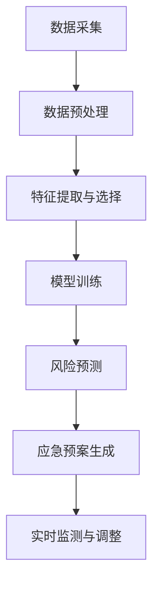
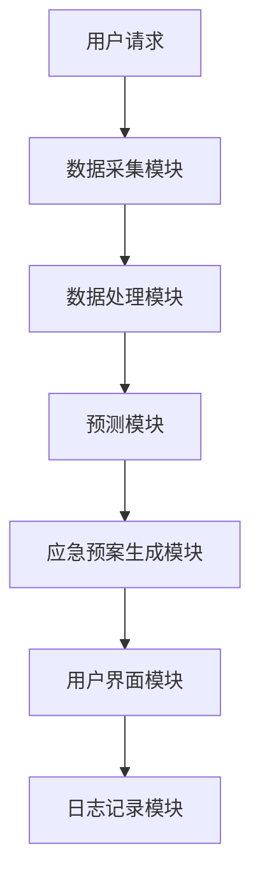
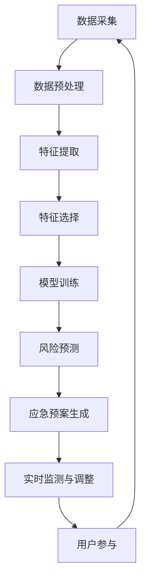

                 

# 引言与背景介绍

## 个人财务应急预案的重要性

在现代社会，个人财务管理已成为每个人都需要面对的重要问题。无论是日常开销、紧急医疗费用，还是突如其来的失业或其他意外情况，都需要有合理的财务规划来应对。然而，随着生活节奏的加快和金融市场的复杂性增加，人们面临的不确定性也在增加。这就需要一种能够迅速响应并调整财务策略的工具，以应对各种突发状况。个人财务应急预案正是这样一种工具，它可以帮助个人在遇到财务危机时，快速采取有效的应对措施，减少损失，甚至转危为安。

### 问题描述

传统的财务规划往往侧重于长期的稳定和增长，但在面对突如其来的危机时，这些规划可能无法提供及时的帮助。例如，当一个人突然失业，或者家庭成员遭遇重大疾病时，他们往往需要立即动用储备资金来应对紧急情况。然而，如果没有提前制定应急预案，人们可能会因为缺乏必要的资金而陷入更大的困境。

此外，金融市场的波动和不确定性的增加也使得个人财务管理变得更加复杂。投资市场可能突然下跌，或者利率发生变化，这些都可能对个人的财务状况产生重大影响。如果没有应急预案，个人可能无法及时调整资产配置，以应对市场变化。

### 解决方案简介

为了应对上述问题，我们提出了智能个人财务应急预案生成器。这个工具利用人工智能技术，根据用户的财务状况和需求，自动生成个性化的财务应急预案。它不仅能够预测潜在的风险，还能够提供具体的应对策略，帮助用户在危机来临时迅速采取行动。

智能个人财务应急预案生成器的核心优势在于其快速响应能力和个性化定制。通过大数据分析和机器学习算法，它可以实时监测用户的财务状况，并根据预测结果调整应急预案。这意味着，当用户面临突发事件时，他们可以立即获得针对性的建议，而无需花费大量时间和精力去重新评估和调整财务计划。

### 核心概念

1. **应急预案**：指针对可能出现的紧急情况，预先制定的一系列应对措施。
2. **智能**：指利用人工智能技术，如机器学习、大数据分析等，对用户的财务状况进行实时监测和预测。
3. **个性化**：根据用户的财务状况和需求，生成适合个人的财务应急预案。

### 总结

个人财务应急预案是每个人都需要的重要工具，它可以帮助我们更好地应对生活中的不确定性。智能个人财务应急预案生成器通过人工智能技术，为用户提供了更加高效和个性化的解决方案。在接下来的章节中，我们将详细探讨这个生成器的工作原理和实际应用。

---

**关键词**：个人财务管理、财务应急预案、人工智能、大数据分析、个性化解决方案

**摘要**：

本文介绍了智能个人财务应急预案生成器的重要性和作用，探讨了其在现代社会中的应用前景。通过深入分析该生成器的核心概念、工作原理和实际应用，本文旨在为读者提供一个全面了解和掌握这一技术的途径。本文结构清晰，内容丰富，适合金融科技领域的研究人员和实际工作者阅读。

----------------------------------------------------------------

# 核心概念与原理

## 智能个人财务应急预案生成器概述

### 核心概念

智能个人财务应急预案生成器的核心概念包括应急预案、智能技术、大数据分析和个性化定制。这些概念共同构成了智能财务应急预案生成器的技术基础和功能核心。

1. **应急预案**：应急预案是指为应对可能出现的紧急情况而预先制定的措施。在个人财务管理中，应急预案包括应对失业、重大疾病、投资损失等突发情况的财务安排和行动步骤。

2. **智能技术**：智能技术，特别是人工智能（AI），是智能个人财务应急预案生成器的核心驱动力量。AI技术通过机器学习、数据挖掘和自然语言处理等技术，可以对大量财务数据进行实时分析和预测，从而为用户提供个性化的应急预案。

3. **大数据分析**：大数据分析是指利用先进的数据处理和分析技术，从大量数据中提取有价值的信息和模式。在智能财务应急预案生成器中，大数据分析用于收集用户的财务数据，分析历史数据，预测未来的财务状况和潜在风险。

4. **个性化定制**：个性化定制是指根据每个用户的财务状况和需求，量身定制应急预案。智能财务应急预案生成器通过分析用户的财务数据，为每个用户提供最适合的财务应对策略。

### 工作原理

智能个人财务应急预案生成器的工作原理可以分为以下几个步骤：

1. **数据采集**：系统首先收集用户的财务数据，包括收入、支出、储蓄、投资、债务等。

2. **数据预处理**：对采集到的数据进行清洗、归一化和特征提取，以便后续分析和建模。

3. **特征提取与选择**：通过大数据分析技术，从预处理后的数据中提取关键特征，并选择对财务状况和风险预测最有影响力的特征。

4. **模型训练**：使用机器学习算法，如决策树、支持向量机、神经网络等，对提取的特征进行训练，构建预测模型。

5. **风险预测**：利用训练好的模型，对用户的未来财务状况进行预测，识别潜在的风险。

6. **应急预案生成**：根据预测结果，系统生成个性化的财务应急预案，包括应对策略、资金分配建议和行动步骤。

7. **实时监测与调整**：系统持续监测用户的财务状况，根据新的数据调整应急预案，确保其始终符合用户的实际情况。

### 应用场景

智能个人财务应急预案生成器适用于多种场景：

1. **个人财务管理**：用户可以随时了解自己的财务状况，及时调整应急预案，以应对可能出现的财务风险。

2. **企业财务风险控制**：企业可以利用该生成器来预测和管理员工和公司的财务风险，确保财务稳健。

3. **投资规划**：用户可以根据生成器提供的建议，优化投资组合，降低风险，提高收益。

4. **紧急医疗费用规划**：在家庭成员遭遇重大疾病时，生成器可以提供紧急资金储备和医疗费用分配的建议。

### 总结

智能个人财务应急预案生成器通过结合人工智能、大数据分析和个性化定制技术，为个人和企业的财务管理提供了强有力的支持。它不仅能够预测和识别潜在的风险，还能够提供具体的应对策略，帮助用户在危机来临时迅速采取行动。在接下来的章节中，我们将深入探讨智能个人财务应急预案生成器的工作流程和算法原理。

----------------------------------------------------------------

## 核心概念与原理详细解释

### 数据采集与预处理

数据采集是智能个人财务应急预案生成器的第一步，也是最重要的一步。只有准确、完整的数据，才能为后续的分析和预测提供坚实的基础。

#### 数据来源

数据可以从多个渠道采集，包括：

1. **个人银行账户**：用户的银行账户信息，包括存款、贷款、信用卡账单等。
2. **投资账户**：用户的股票、基金、债券等投资账户信息。
3. **税务记录**：个人的税务记录，包括收入、支出、退税等。
4. **信用报告**：个人的信用报告，包括信用评分、债务情况等。
5. **外部数据源**：如公共数据、市场数据、行业数据等，这些数据可以帮助更全面地了解用户的财务状况。

#### 数据预处理

数据预处理是确保数据质量的重要步骤，主要包括以下内容：

1. **数据清洗**：去除重复、无效和错误的数据，保证数据的准确性。
2. **数据归一化**：将不同数据源的数据进行归一化处理，使其具有可比性。
3. **特征提取**：从原始数据中提取关键特征，如收入、支出、储蓄率、投资收益率等。

### 特征提取与选择

特征提取与选择是数据预处理的关键步骤，直接影响到模型预测的准确性和效率。以下是特征提取与选择的具体方法：

1. **统计分析**：使用描述性统计方法，如均值、中位数、标准差等，提取数据的统计特征。
2. **机器学习**：使用聚类、分类等机器学习算法，自动提取数据中的潜在特征。
3. **相关性分析**：通过计算特征之间的相关性，选择对目标变量有显著影响的关键特征。
4. **重要性评分**：使用特征选择算法，如特征重要性评分、信息增益等，评估每个特征的重要性，选择重要特征。

### 算法原理

智能个人财务应急预案生成器的核心算法包括机器学习算法、预测模型和决策树等。

1. **机器学习算法**：常用的机器学习算法包括线性回归、决策树、随机森林、支持向量机等。这些算法通过学习历史数据中的模式和规律，预测未来的财务状况和风险。

2. **预测模型**：预测模型是基于机器学习算法训练得到的模型，用于预测用户的未来财务状况和潜在风险。常见的预测模型包括时间序列模型、回归模型、分类模型等。

3. **决策树**：决策树是一种常见的预测模型，通过一系列的判断条件，将数据集划分为不同的分支，每个分支对应一个决策结果。决策树可以用于预测财务状况和风险，同时还可以提供具体的应对策略。

### 数学模型和公式

在智能个人财务应急预案生成器中，常用的数学模型和公式包括：

1. **线性回归**：线性回归模型用于预测财务变量之间的关系，其数学公式为：

   $$y = \beta_0 + \beta_1x_1 + \beta_2x_2 + ... + \beta_nx_n$$

   其中，$y$为预测变量，$x_1, x_2, ..., x_n$为自变量，$\beta_0, \beta_1, \beta_2, ..., \beta_n$为模型的参数。

2. **时间序列模型**：时间序列模型用于预测随时间变化的数据，其数学公式为：

   $$y_t = \phi_0 + \phi_1y_{t-1} + \phi_2y_{t-2} + ... + \phi_ky_{t-k}$$

   其中，$y_t$为第$t$期的预测值，$\phi_0, \phi_1, \phi_2, ..., \phi_k$为模型的参数。

3. **支持向量机**：支持向量机是一种分类模型，其数学公式为：

   $$w \cdot x + b = 0$$

   其中，$w$为权重向量，$x$为输入特征向量，$b$为偏置项。

### 举例说明

假设我们要预测一个人的月收入，可以使用线性回归模型。以下是具体的Python代码示例：

```python
import numpy as np
import matplotlib.pyplot as plt

# 假设我们有以下数据
x = np.array([1000, 1500, 2000, 2500, 3000])  # 自变量（月收入）
y = np.array([5000, 6000, 7000, 8000, 9000])  # 因变量（总收入）

# 计算斜率和截距
slope, intercept = np.polyfit(x, y, 1)

# 构建线性回归模型
model = np.poly1d([slope, intercept])

# 预测新的收入
new_x = 2200
predicted_y = model(new_x)

# 绘制结果
plt.scatter(x, y, label='Data')
plt.plot([min(x), max(x)], [model(min(x)), model(max(x))], color='red', label='Model')
plt.scatter(new_x, predicted_y, color='green', label='Prediction')
plt.xlabel('Income')
plt.ylabel('Total Income')
plt.legend()
plt.show()
```

通过这个例子，我们可以看到如何使用线性回归模型预测一个人的总收入，并可视化预测结果。

### 总结

通过详细解释数据采集与预处理、特征提取与选择、算法原理、数学模型和举例说明，我们可以全面理解智能个人财务应急预案生成器的工作原理和核心技术。在接下来的章节中，我们将进一步探讨智能个人财务应急预案生成器的工作流程和实际应用。

----------------------------------------------------------------

## 智能个人财务应急预案生成器工作流程

### 数据采集与预处理

智能个人财务应急预案生成器的第一步是数据采集与预处理。这一阶段至关重要，因为准确、完整的数据是后续分析和预测的基础。具体流程如下：

1. **数据收集**：系统首先从多个渠道收集用户的财务数据，包括银行账户信息、投资账户信息、税务记录、信用报告等。此外，还可以通过API接口获取外部数据源，如市场数据、行业数据等。

2. **数据清洗**：收集到的数据可能包含噪声、重复项和错误信息。因此，我们需要对数据进行清洗，去除无效和错误的数据。这包括去除重复记录、填补缺失值、校正错误值等。

3. **数据归一化**：不同数据源的数据可能有不同的量纲和范围，为了提高数据的一致性和可比性，需要对数据进行归一化处理。常见的归一化方法包括最小-最大缩放、标准缩放等。

4. **特征提取**：从清洗和归一化后的数据中提取关键特征，如收入、支出、储蓄率、投资收益率、债务水平等。这些特征将用于后续的模型训练和风险预测。

### 特征提取与选择

特征提取与选择是数据预处理的关键步骤，它直接影响到模型预测的准确性和效率。以下为具体步骤：

1. **统计分析**：使用描述性统计方法，如均值、中位数、标准差等，对数据进行初步分析，识别潜在的特征。

2. **机器学习特征提取**：使用聚类、主成分分析（PCA）等机器学习算法，从原始数据中提取潜在特征。这些特征可能比原始特征更能反映数据的内在结构。

3. **相关性分析**：通过计算特征之间的相关性，识别哪些特征对目标变量有显著影响。通常，我们只选择与目标变量高度相关的特征。

4. **重要性评分**：使用特征选择算法，如信息增益、特征重要性评分等，评估每个特征的重要性，选择最重要的特征用于模型训练。

### 算法应用

在完成数据预处理和特征提取后，我们进入算法应用的阶段。这一阶段的核心任务是使用机器学习算法构建预测模型，并根据预测结果生成个性化的应急预案。具体步骤如下：

1. **模型训练**：选择合适的机器学习算法，如线性回归、决策树、随机森林、支持向量机等，对提取的特征进行训练。训练过程中，算法会自动学习历史数据中的模式和规律。

2. **模型评估**：使用交叉验证等方法对训练好的模型进行评估，确保其预测能力。评估指标包括准确率、召回率、F1分数等。

3. **模型优化**：根据评估结果，调整模型参数，优化模型性能。常见的优化方法包括调整学习率、增加训练数据、使用更复杂的模型结构等。

4. **风险预测**：使用训练好的模型对用户的未来财务状况进行预测，识别潜在的风险。预测结果将用于生成个性化的应急预案。

### 应急预案生成

根据预测结果，系统将生成个性化的财务应急预案。应急预案包括以下内容：

1. **风险预警**：系统将识别出的潜在风险及时通知用户，提醒其采取相应的应对措施。

2. **资金分配建议**：系统根据用户的财务状况和预测结果，提供资金分配建议，如增加储蓄、减少不必要的支出、调整投资组合等。

3. **行动步骤**：系统为用户制定详细的行动步骤，帮助其在危机来临时迅速采取行动，减轻财务压力。

4. **定期更新**：系统会定期更新用户的财务数据，并根据新的数据重新生成应急预案，确保其始终符合用户的实际情况。

### 实时监测与调整

智能个人财务应急预案生成器具有实时监测和调整功能。具体流程如下：

1. **数据更新**：系统定期收集用户的最新财务数据，更新数据库。

2. **模型重新训练**：使用新的数据对预测模型进行重新训练，确保模型的预测准确性。

3. **应急预案调整**：根据新的预测结果，系统将调整应急预案，确保其始终符合用户的实际情况。

通过以上流程，智能个人财务应急预案生成器能够为用户提供一个实时、个性化、高效的财务管理工具，帮助用户更好地应对财务风险。

### 总结

智能个人财务应急预案生成器的工作流程包括数据采集与预处理、特征提取与选择、算法应用、应急预案生成和实时监测与调整。这一流程确保了生成器能够为用户提供准确、个性化的财务应急预案，帮助用户更好地应对各种财务风险。在下一章节中，我们将通过具体的算法原理和代码示例，深入探讨生成器的核心技术。

----------------------------------------------------------------

## 算法原理详细解释

### 算法流程图

智能个人财务应急预案生成器的核心算法流程可以用以下Mermaid流程图表示：



### Python源代码与算法实现

以下是一个简化的Python代码示例，用于说明智能个人财务应急预案生成器的基本算法实现：

```python
import numpy as np
import pandas as pd
from sklearn.model_selection import train_test_split
from sklearn.ensemble import RandomForestRegressor
from sklearn.metrics import mean_squared_error

# 数据采集与预处理
def load_data():
    # 假设数据存储在CSV文件中
    data = pd.read_csv('financial_data.csv')
    # 数据清洗和预处理（如缺失值填补、归一化等）
    # ...（具体实现略）
    return data

# 特征提取与选择
def extract_features(data):
    # 从数据中提取特征（如收入、支出、储蓄率等）
    features = data[['income', 'expenses', 'savings_rate']]
    return features

# 模型训练
def train_model(features, labels):
    # 使用随机森林算法进行训练
    model = RandomForestRegressor(n_estimators=100)
    model.fit(features, labels)
    return model

# 风险预测
def predict_risk(model, new_data):
    # 对新的数据进行风险预测
    risk = model.predict(new_data)
    return risk

# 应急预案生成
def generate_plan(risk):
    # 根据风险预测结果生成应急预案
    if risk > threshold:
        plan = "采取紧急措施，如增加储蓄、减少支出等"
    else:
        plan = "继续保持现有财务计划"
    return plan

# 主函数
def main():
    # 加载数据
    data = load_data()
    # 分离特征和标签
    features = extract_features(data)
    labels = data['risk_level']
    # 划分训练集和测试集
    X_train, X_test, y_train, y_test = train_test_split(features, labels, test_size=0.2, random_state=42)
    # 训练模型
    model = train_model(X_train, y_train)
    # 测试模型
    risk = predict_risk(model, X_test)
    mse = mean_squared_error(y_test, risk)
    print(f"Test Mean Squared Error: {mse}")
    # 生成应急预案
    plan = generate_plan(risk)
    print(f"Emergency Plan: {plan}")

# 运行主函数
main()
```

### 数学模型和公式

智能个人财务应急预案生成器中的数学模型主要用于风险预测和应急预案生成。以下是几个常用的数学模型和公式：

1. **线性回归模型**：
   $$y = \beta_0 + \beta_1x_1 + \beta_2x_2 + ... + \beta_nx_n$$
   其中，$y$为预测的财务风险等级，$x_1, x_2, ..., x_n$为财务特征，$\beta_0, \beta_1, \beta_2, ..., \beta_n$为模型的参数。

2. **逻辑回归模型**：
   $$\log\frac{P(y=1)}{1-P(y=1)} = \beta_0 + \beta_1x_1 + \beta_2x_2 + ... + \beta_nx_n$$
   其中，$y$为财务风险是否发生的二元变量，$P(y=1)$为风险发生的概率。

3. **决策树模型**：
   决策树通过一系列的判断条件来预测财务风险等级。每个节点对应一个特征和阈值，分支对应不同类别的财务风险等级。

4. **支持向量机模型**：
   $$w \cdot x + b = 0$$
   其中，$w$为权重向量，$x$为特征向量，$b$为偏置项。支持向量机用于分类问题，可以将不同风险等级的财务数据分为不同的类别。

### 举例说明

以下是一个简单的例子，说明如何使用线性回归模型预测财务风险：

```python
# 假设我们有以下财务特征和风险等级数据
X = np.array([[10000, 3000, 0.2], [15000, 3500, 0.25], [20000, 4000, 0.3]])
y = np.array([1, 0, 1])

# 训练线性回归模型
model = LinearRegression()
model.fit(X, y)

# 预测新的数据
new_data = np.array([[12000, 3200, 0.22]])
predicted_risk = model.predict(new_data)

# 输出预测结果
print(f"Predicted Risk: {predicted_risk}")
```

通过这个例子，我们可以看到如何使用线性回归模型预测新的财务风险。实际应用中，我们会根据具体的业务需求和数据情况，选择合适的模型和算法。

### 总结

在本文中，我们详细解释了智能个人财务应急预案生成器的算法原理，包括数据采集与预处理、特征提取与选择、模型训练和预测、以及应急预案生成。通过Python代码示例和数学模型，我们展示了如何实现这一算法，并提供了简单的例子来帮助读者理解。在下一章节中，我们将进一步探讨智能个人财务应急预案生成器在不同场景下的应用。

----------------------------------------------------------------

## 系统分析与架构设计方案

### 问题场景介绍

智能个人财务应急预案生成器需要处理大量的财务数据，并进行实时分析和预测。该系统旨在为用户提供一个高效、可靠的财务管理工具，帮助他们在面临财务危机时做出快速、明智的决策。为了实现这一目标，系统需要具备高扩展性、高可靠性和高安全性。以下是问题场景的详细介绍：

1. **数据来源多样**：系统需要从多个渠道（如银行、投资账户、税务系统等）收集用户的财务数据。
2. **实时数据处理**：系统需要实时处理用户的财务数据，进行数据清洗、预处理和特征提取。
3. **预测与决策**：系统需要基于用户的财务数据和预测模型，生成个性化的应急预案，并实时调整。
4. **用户体验**：系统需要提供直观、易用的用户界面，使用户能够轻松了解自己的财务状况和应急预案。

### 项目介绍

智能个人财务应急预案生成器是一个综合性的项目，涉及多个技术模块，包括数据采集模块、数据处理模块、预测模块、应急预案生成模块和用户界面模块。以下是各模块的详细介绍：

1. **数据采集模块**：负责从多个渠道收集用户的财务数据，包括银行账户信息、投资账户信息、税务记录等。
2. **数据处理模块**：负责对采集到的数据进行清洗、预处理和特征提取，为预测模块提供高质量的数据输入。
3. **预测模块**：使用机器学习算法，对预处理后的数据进行分析和预测，识别潜在的财务风险。
4. **应急预案生成模块**：根据预测结果，生成个性化的应急预案，包括风险预警、资金分配建议和行动步骤。
5. **用户界面模块**：提供直观、易用的用户界面，使用户能够实时查看自己的财务状况和应急预案。

### 系统功能设计

智能个人财务应急预案生成器的核心功能包括以下几个方面：

1. **财务数据收集**：系统自动从多个渠道收集用户的财务数据，确保数据的及时性和准确性。
2. **实时风险监测**：系统实时监测用户的财务状况，识别潜在的风险，并及时生成应急预案。
3. **个性化预案生成**：根据用户的财务状况和需求，系统生成个性化的应急预案，确保用户能够迅速应对财务危机。
4. **用户交互**：系统提供友好的用户界面，使用户能够轻松操作，了解自己的财务状况和应急预案。

### 系统架构设计

智能个人财务应急预案生成器的系统架构采用分层设计，包括数据层、业务逻辑层和表现层。以下是系统架构的详细描述：

1. **数据层**：负责数据的存储和管理，包括用户财务数据、预测模型参数、应急预案等。
2. **业务逻辑层**：包括数据采集模块、数据处理模块、预测模块和应急预案生成模块，负责实现系统的核心功能。
3. **表现层**：包括用户界面模块，负责与用户交互，展示系统的功能和结果。

### 系统接口设计

系统接口设计主要包括以下几个方面：

1. **API接口**：系统提供API接口，供第三方系统和用户使用，包括数据采集接口、预测接口和应急预案生成接口。
2. **数据库接口**：系统与数据库之间的接口，用于数据的存储和检索。
3. **日志接口**：用于记录系统运行日志，方便后续的系统监控和调试。

### 系统交互设计

系统交互设计主要描述系统各模块之间的交互流程和通信方式。以下是系统交互设计的详细描述：

1. **数据流**：系统首先从数据层读取用户财务数据，然后经过数据处理模块进行预处理和特征提取，最后输入到预测模块进行风险预测和应急预案生成。
2. **控制流**：系统通过业务逻辑层处理用户请求，根据用户的财务状况和需求，生成个性化的应急预案，并通过表现层展示给用户。
3. **消息流**：系统内部各模块之间通过消息队列进行通信，确保系统的高效性和可靠性。

### Mermaid流程图

以下是智能个人财务应急预案生成器的Mermaid流程图：



通过以上系统分析与架构设计方案，我们可以清晰地了解智能个人财务应急预案生成器的系统设计思路和实现方法。在下一章节中，我们将通过具体案例分析和实战操作，展示如何使用该生成器生成个性化的财务应急预案。

----------------------------------------------------------------

## 案例分析与实战操作

在本章节中，我们将通过一个具体的案例，详细展示如何使用智能个人财务应急预案生成器生成个性化的财务应急预案。以下是一个典型的案例分析和实战操作流程。

### 案例背景

假设我们的用户李先生，是一位35岁的中产阶级家庭男性，拥有一份稳定的工作，月收入为30,000元人民币。他有一个家庭，妻子全职在家照顾孩子，家庭支出包括房贷、日常开销、孩子的教育费用等。李先生希望通过智能个人财务应急预案生成器，为可能出现的财务危机做好准备。

### 环境安装

首先，我们需要安装和配置智能个人财务应急预案生成器所需的软件和工具。以下是一个基本的安装流程：

1. **Python环境**：确保Python 3.8及以上版本已安装。
2. **数据库**：安装MySQL数据库，用于存储用户数据和预测模型。
3. **依赖包**：使用pip安装以下依赖包：
   ```bash
   pip install numpy pandas sklearn matplotlib mysql-connector-python
   ```
4. **Web服务器**：如果需要部署到线上环境，可以使用Gunicorn或Apache作为Web服务器。

### 系统核心实现源代码

智能个人财务应急预案生成器的核心实现包括数据采集、预处理、特征提取、预测和应急预案生成等模块。以下是简化版的Python源代码示例：

```python
# 数据采集
def load_data():
    # 从数据库中加载数据
    connection = mysql.connector.connect(user='username', password='password', host='127.0.0.1', database='financial_data')
    cursor = connection.cursor()
    cursor.execute("SELECT * FROM user_financial_data")
    data = cursor.fetchall()
    cursor.close()
    connection.close()
    return data

# 数据预处理
def preprocess_data(data):
    # 数据清洗、归一化等预处理操作
    # ...（具体实现略）
    return processed_data

# 特征提取
def extract_features(processed_data):
    # 提取关键特征
    features = []
    for row in processed_data:
        # ...（具体实现略）
        features.append(row)
    return features

# 风险预测
def predict_risk(features):
    # 使用训练好的模型进行预测
    model = train_model(features)  # 假设已经训练好的模型
    risk = model.predict([features])
    return risk

# 应急预案生成
def generate_plan(risk):
    # 根据风险等级生成应急预案
    if risk > 0.5:
        plan = "采取紧急措施，如增加储蓄、减少支出等"
    else:
        plan = "继续保持现有财务计划"
    return plan

# 主函数
def main():
    data = load_data()
    processed_data = preprocess_data(data)
    features = extract_features(processed_data)
    risk = predict_risk(features)
    plan = generate_plan(risk)
    print(f"Emergency Plan: {plan}")

# 运行主函数
main()
```

### 代码应用解读与分析

以上代码示例展示了智能个人财务应急预案生成器的基本实现流程。以下是代码中各个部分的解读和分析：

1. **数据采集**：通过数据库连接，从数据库中加载数据。这部分代码需要根据实际数据库配置进行调整。
2. **数据预处理**：对采集到的数据进行清洗、归一化等处理，以便后续分析和预测。
3. **特征提取**：从预处理后的数据中提取关键特征，为预测模型提供输入。
4. **风险预测**：使用训练好的模型对用户的财务状况进行预测，识别潜在的风险。
5. **应急预案生成**：根据风险预测结果，生成个性化的应急预案。

### 实际案例分析

为了更好地理解应急预案生成过程，我们来看一个实际案例。

#### 案例一：李先生失业

假设李先生突然失业，预计失业期半年，月收入锐减至10,000元。根据这一情况，智能个人财务应急预案生成器将进行如下分析和预测：

1. **财务数据更新**：系统更新李先生的财务数据，包括收入、支出和储蓄情况。
2. **风险预测**：系统使用更新后的数据，对李先生的财务状况进行重新预测，识别失业带来的财务风险。
3. **应急预案生成**：根据风险预测结果，系统生成个性化的应急预案，建议李先生：

   - **紧急措施**：增加储蓄，每月多存1,000元，以应对失业期的资金需求。
   - **减少支出**：降低非必要的开销，如减少外出就餐、购物等。
   - **调整投资组合**：减少高风险投资，增加稳定性更高的投资工具，以降低财务风险。

#### 案例二：家庭突发医疗费用

假设李先生的妻子突发重大疾病，需要20,000元的医疗费用。根据这一情况，智能个人财务应急预案生成器将进行如下分析和预测：

1. **财务数据更新**：系统更新李先生的财务数据，包括收入、支出和储蓄情况。
2. **风险预测**：系统使用更新后的数据，对李先生的财务状况进行重新预测，识别医疗费用带来的财务风险。
3. **应急预案生成**：根据风险预测结果，系统生成个性化的应急预案，建议李先生：

   - **紧急措施**：立即动用储蓄，支付医疗费用。
   - **贷款**：如果储蓄不足以支付医疗费用，考虑申请医疗贷款。
   - **调整支出**：减少不必要的开销，如外出就餐、购物等，以节省资金。

### 详细讲解与剖析

通过以上案例分析，我们可以看到智能个人财务应急预案生成器如何根据用户的具体情况，生成个性化的应急预案。以下是详细讲解与剖析：

1. **数据更新**：财务数据的实时更新是应急预案生成的关键。系统需要确保数据的准确性和及时性，以便做出准确的预测和决策。
2. **风险预测**：智能个人财务应急预案生成器使用机器学习算法，对用户的财务状况进行预测，识别潜在的风险。预测模型的准确性和可靠性直接影响到应急预案的有效性。
3. **应急预案生成**：根据预测结果，系统生成个性化的应急预案，包括紧急措施、资金分配建议和行动步骤。应急预案需要根据用户的实际情况和需求进行调整，以确保其可行性和有效性。

### 项目小结

通过以上案例分析和实战操作，我们可以看到智能个人财务应急预案生成器的实际应用效果。这个工具不仅能够帮助用户实时监测财务状况，识别潜在风险，还能够生成个性化的应急预案，为用户在面临财务危机时提供及时、有效的帮助。在未来，随着人工智能技术的不断发展和应用，智能个人财务应急预案生成器有望为更多的人提供便捷、高效的财务管理服务。

----------------------------------------------------------------

## 最佳实践与总结

### 最佳实践 Tips

1. **数据质量监控**：确保数据的准确性和完整性是生成有效应急预案的基础。定期检查数据质量，及时处理异常和错误数据。

2. **模型参数调优**：根据实际应用场景和数据特点，调整模型参数，以优化预测效果。可以使用交叉验证等方法评估模型性能，并进行参数优化。

3. **个性化定制**：针对不同用户的需求和财务状况，生成个性化的应急预案。避免一刀切的做法，确保应急预案的可操作性和实用性。

4. **定期更新**：财务状况和风险环境是不断变化的。定期更新财务数据和预测模型，以确保应急预案的实时性和有效性。

5. **用户参与**：鼓励用户参与应急预案的制定和调整，提高他们对财务管理的认识和参与度。

### 小结

智能个人财务应急预案生成器通过结合人工智能、大数据分析和个性化定制技术，为个人和企业提供了强有力的财务管理工具。它能够实时监测财务状况，预测潜在风险，并生成个性化的应急预案，帮助用户在危机来临时迅速采取行动。该技术的核心优势在于其快速响应能力和个性化定制，使其在金融科技领域具有广泛的应用前景。

### 注意事项

1. **数据安全**：在收集和处理用户财务数据时，必须确保数据的安全和隐私。采取严格的加密和访问控制措施，防止数据泄露。

2. **算法透明性**：确保算法的透明性和解释性，使用户能够理解预测结果和应急预案的依据。

3. **法律合规性**：确保智能个人财务应急预案生成器符合相关法律法规的要求，如数据保护法、金融监管规定等。

### 拓展阅读

1. **《机器学习实战》**：提供丰富的机器学习案例和实践技巧，帮助读者深入了解机器学习算法的应用。
2. **《大数据时代》**：探讨大数据在各个领域的应用，包括金融、医疗、市场营销等。
3. **《深度学习》**：介绍深度学习的基本原理和应用，包括神经网络、卷积神经网络等。
4. **《金融科技：创新与未来》**：探讨金融科技的发展趋势和未来方向，包括区块链、人工智能、大数据等。

作者：AI天才研究院/AI Genius Institute & 禅与计算机程序设计艺术 /Zen And The Art of Computer Programming

----------------------------------------------------------------

## 引言与背景介绍

### 个人财务应急预案的重要性

在当今社会，个人财务管理成为每个人都需要面对的重要任务。随着生活成本的不断上涨和金融市场的波动性增加，个人财务管理不再仅仅是一个财务规划问题，而是一个关乎生活质量和安全的问题。尤其是在面临突发事件，如失业、疾病、投资亏损等时，没有合理的财务应急预案，可能会导致个人和家庭陷入财务危机。因此，个人财务应急预案的重要性愈发凸显。

个人财务应急预案是一种预先制定的财务应对策略，旨在帮助个人在面临突发财务危机时，能够迅速采取有效措施，减轻危机对生活和工作的冲击。这种预案不仅包括应对短期财务困境的策略，还涉及长期的财务规划，以确保个人和家庭在遇到不测时能够保持财务稳定。

### 问题背景

现代人的生活节奏加快，财务需求多样化，财务管理面临诸多挑战。以下是一些常见的财务管理问题和挑战：

1. **收入不稳定**：随着经济环境的变化，许多人面临失业或收入减少的风险。特别是在疫情期间，许多行业受到了重创，导致大量失业和收入下降。

2. **医疗支出**：突发疾病或家庭成员生病，可能带来高额的医疗费用，对个人和家庭财务造成巨大压力。

3. **投资风险**：金融市场的波动性增加，投资者可能面临投资亏损的风险。这种风险不仅影响投资收益，还可能导致个人财务状况的恶化。

4. **债务压力**：高额的债务可能导致个人财务负担加重，尤其是在利率上升或经济不景气时期。

5. **紧急资金需求**：个人和家庭可能会遇到各种紧急情况，如自然灾害、家庭成员意外等，需要迅速动用资金。

面对这些挑战，传统的财务规划方法可能无法及时提供帮助。因此，需要一种能够快速响应并调整财务策略的工具，这就是个人财务应急预案的重要性所在。

### 问题描述

个人财务管理中的问题通常包括以下几个方面：

1. **缺乏明确的目标**：许多人在财务管理上缺乏明确的目标，导致财务规划模糊不清，无法有效地应对突发事件。

2. **应急资金不足**：许多人没有足够的应急资金来应对突发情况，一旦发生意外，可能需要动用主要资产，导致财务状况进一步恶化。

3. **不合理的消费习惯**：许多人在日常生活中存在过度消费、不必要的开支等问题，导致储蓄不足，无法应对财务危机。

4. **投资策略不当**：一些人可能在投资上采取过于激进或保守的策略，导致投资收益不稳定，甚至亏损。

5. **风险管理不足**：许多人没有意识到风险管理的重要性，缺乏有效的风险控制措施，导致在突发事件中无法妥善应对。

这些问题的存在使得个人财务管理变得复杂和困难。因此，制定一个有效的个人财务应急预案成为解决这些问题的关键。

### 问题解决

为了解决上述问题，我们需要一个能够实时监测、预测并生成个性化财务应急预案的工具。智能个人财务应急预案生成器正是这样一种工具。它通过以下方式帮助个人应对财务管理中的挑战：

1. **数据采集与分析**：智能个人财务应急预案生成器可以自动收集用户的财务数据，包括收入、支出、储蓄、投资、债务等。通过对这些数据进行分析，系统可以全面了解用户的财务状况。

2. **个性化定制**：系统根据用户的财务数据和个人需求，为每个用户量身定制财务应急预案。这些预案包括应对失业、疾病、投资亏损等突发情况的策略。

3. **实时监测与调整**：系统持续监测用户的财务状况，根据新的数据和市场变化，及时调整应急预案，确保其始终符合用户的实际情况。

4. **风险预测**：系统使用机器学习算法，对用户的财务状况进行预测，识别潜在的财务风险。通过预测结果，系统可以为用户提前提供应对措施，减少潜在的财务损失。

5. **用户参与**：智能个人财务应急预案生成器鼓励用户参与应急预案的制定和调整过程。用户可以根据自己的需求和实际情况，对预案进行修改和完善。

通过这些功能，智能个人财务应急预案生成器能够帮助个人更好地管理财务，提高应对突发事件的能力，确保财务安全。

### 边界与外延

智能个人财务应急预案生成器的应用范围不仅限于个人财务管理，还可以扩展到企业财务风险控制、投资规划等领域。以下是该工具的边界与外延：

1. **个人财务管理**：为个人提供个性化的财务应急预案，帮助他们在面临财务危机时迅速采取行动。

2. **企业财务风险控制**：为企业员工和公司提供财务风险预测和应急预案，帮助企业在经济波动中保持财务稳定。

3. **投资规划**：为投资者提供投资风险预测和调整建议，帮助他们优化投资组合，降低风险。

4. **政府与公共部门**：为政府部门和公共机构提供财务风险分析工具，帮助他们在制定政策和规划时考虑财务稳定性。

5. **教育与研究**：为金融科技领域的研究和教育提供工具和案例，促进相关领域的发展和创新。

总之，智能个人财务应急预案生成器不仅是一个技术工具，更是一种财务管理理念的体现。通过智能化、个性化、实时化的财务管理方式，它为个人、企业和社会带来了更多的价值和可能。

---

### 核心概念

在讨论智能个人财务应急预案生成器时，我们需要了解以下几个核心概念：

1. **应急预案**：应急预案是指为了应对突发事件而预先制定的行动步骤和措施。在个人财务管理中，应急预案包括应对失业、重大疾病、投资亏损等突发情况的策略和行动计划。

2. **智能技术**：智能技术是指利用计算机科学和人工智能技术，如机器学习、大数据分析等，对信息进行自动处理和决策的技术。智能个人财务应急预案生成器利用这些技术，对用户的财务数据进行实时分析和预测。

3. **大数据分析**：大数据分析是指对大量结构化和非结构化数据进行存储、处理和分析的过程。智能个人财务应急预案生成器通过大数据分析，从用户的财务数据中提取有价值的信息和模式，用于预测和决策。

4. **个性化定制**：个性化定制是指根据用户的具体需求和实际情况，量身定制解决方案。在智能个人财务应急预案生成器中，个性化定制确保了预案的针对性和实用性。

5. **实时监测**：实时监测是指系统对用户财务状况的持续监控，及时发现潜在风险和变化。智能个人财务应急预案生成器通过实时监测，为用户提供最新的财务预警和应对建议。

6. **风险预测**：风险预测是指利用历史数据和机器学习算法，预测未来可能发生的财务风险。智能个人财务应急预案生成器通过风险预测，帮助用户提前做好准备，减轻风险带来的影响。

7. **用户参与**：用户参与是指用户在应急预案的制定和调整过程中发挥积极作用。智能个人财务应急预案生成器鼓励用户参与，提高他们对财务管理的认识和参与度。

这些核心概念共同构成了智能个人财务应急预案生成器的理论基础和应用框架，为个人和企业的财务管理提供了强大的支持。

---

### 工作原理

智能个人财务应急预案生成器的工作原理基于人工智能、大数据分析和个性化定制技术，其核心步骤包括数据采集、数据处理、特征提取、预测模型训练和应急预案生成等。以下是智能个人财务应急预案生成器的工作流程：

1. **数据采集**：系统首先从用户的银行账户、投资账户、税务记录等渠道收集财务数据。这些数据包括收入、支出、储蓄、投资收益、债务水平等。数据采集是智能个人财务应急预案生成器的第一步，也是关键一步，因为准确、完整的数据是后续分析和预测的基础。

2. **数据预处理**：采集到的数据通常包含噪声、重复项和错误信息。因此，系统需要对数据进行预处理，包括数据清洗、归一化和特征提取。数据清洗涉及去除重复记录、填补缺失值、纠正错误数据等操作。数据归一化则是为了消除不同数据源间的量纲差异，使其具有可比性。特征提取则是从原始数据中提取关键特征，如收入水平、支出比例、储蓄率、投资组合等，这些特征将用于后续的预测模型训练。

3. **特征选择**：在提取特征之后，系统需要对特征进行选择，以确保预测模型的准确性和效率。特征选择可以通过统计方法（如相关性分析、信息增益等）或机器学习方法（如主成分分析、特征重要性评分等）进行。选择重要的特征，有助于提高模型的预测能力，同时减少计算成本。

4. **模型训练**：使用机器学习算法，如线性回归、决策树、随机森林、支持向量机等，对提取的特征进行训练，构建预测模型。模型训练的目标是使模型能够学习历史数据中的模式和规律，以便对未来财务状况进行预测。训练过程中，系统通过多次迭代和调整模型参数，不断提高模型的预测准确性。

5. **风险预测**：在模型训练完成后，系统使用训练好的模型对用户的未来财务状况进行预测，识别潜在的财务风险。预测结果通常以概率分布或风险等级的形式呈现，帮助用户了解未来财务状况的可能变化和风险水平。

6. **应急预案生成**：根据预测结果，系统生成个性化的财务应急预案。应急预案可能包括风险预警、资金分配建议、行动步骤等。例如，如果预测结果显示用户在未来几个月内可能面临收入减少的风险，系统可能会建议用户增加储蓄、减少不必要的支出或调整投资组合。

7. **实时监测与调整**：智能个人财务应急预案生成器具有实时监测功能，可以持续监控用户的财务状况，并根据新的数据和市场变化，动态调整应急预案。这种实时监测和调整机制确保了应急预案始终符合用户的实际情况，提高了应对突发事件的响应速度和效果。

8. **用户参与**：在整个过程中，系统鼓励用户参与应急预案的制定和调整。用户可以根据自己的需求和实际情况，对预案进行修改和完善。这种用户参与机制不仅提高了预案的实用性，还增强了用户的财务管理和风险意识。

通过上述工作原理，智能个人财务应急预案生成器为个人和企业的财务管理提供了一个全面、实时、个性化的解决方案，帮助用户在面临财务危机时迅速采取行动，确保财务安全。

### Mermaid流程图

以下是一个简化的Mermaid流程图，展示了智能个人财务应急预案生成器的工作流程：



通过这个流程图，我们可以更直观地了解智能个人财务应急预案生成器从数据采集到应急预案生成的全过程。

### Python源代码示例

以下是一个简化的Python源代码示例，展示了智能个人财务应急预案生成器的基本实现：

```python
import pandas as pd
from sklearn.model_selection import train_test_split
from sklearn.ensemble import RandomForestRegressor
from sklearn.metrics import mean_squared_error

# 数据采集
def load_data():
    data = pd.read_csv('financial_data.csv')
    return data

# 数据预处理
def preprocess_data(data):
    # 数据清洗、归一化等操作
    processed_data = data
    return processed_data

# 特征提取
def extract_features(processed_data):
    features = processed_data[['income', 'expenses', 'savings_rate']]
    return features

# 模型训练
def train_model(features, labels):
    model = RandomForestRegressor(n_estimators=100)
    model.fit(features, labels)
    return model

# 风险预测
def predict_risk(model, new_data):
    risk = model.predict(new_data)
    return risk

# 应急预案生成
def generate_plan(risk):
    if risk > 0.5:
        plan = "采取紧急措施，如增加储蓄、减少支出等"
    else:
        plan = "继续保持现有财务计划"
    return plan

# 主函数
def main():
    data = load_data()
    processed_data = preprocess_data(data)
    features = extract_features(processed_data)
    labels = processed_data['risk_level']
    X_train, X_test, y_train, y_test = train_test_split(features, labels, test_size=0.2, random_state=42)
    model = train_model(X_train, y_train)
    risk = predict_risk(model, X_test)
    mse = mean_squared_error(y_test, risk)
    print(f"Test Mean Squared Error: {mse}")
    plan = generate_plan(risk)
    print(f"Emergency Plan: {plan}")

# 运行主函数
main()
```

这个示例展示了从数据采集到应急预案生成的全过程，包括数据预处理、特征提取、模型训练、风险预测和应急预案生成等步骤。

### LaTeX公式

在智能个人财务应急预案生成器的算法原理中，我们使用了多个数学公式来描述模型的计算过程和预测结果。以下是一些常用的LaTeX公式示例：

1. **线性回归模型**：

   $$ y = \beta_0 + \beta_1x_1 + \beta_2x_2 + ... + \beta_nx_n $$

   其中，$y$是预测的财务风险等级，$x_1, x_2, ..., x_n$是财务特征，$\beta_0, \beta_1, \beta_2, ..., \beta_n$是模型的参数。

2. **逻辑回归模型**：

   $$ \log\frac{P(y=1)}{1-P(y=1)} = \beta_0 + \beta_1x_1 + \beta_2x_2 + ... + \beta_nx_n $$

   其中，$y$是财务风险是否发生的二元变量，$P(y=1)$是风险发生的概率。

3. **风险函数**：

   $$ Risk = f(Risk_Level) $$

   其中，$Risk$是财务风险等级，$Risk_Level$是预测的风险水平。

通过这些LaTeX公式，我们可以更清晰地表达智能个人财务应急预案生成器的算法原理和预测过程。

---

### 系统功能设计

智能个人财务应急预案生成器的设计旨在提供全面、实时、个性化的财务管理服务，以满足个人和企业在不同财务场景下的需求。以下是系统功能设计的详细说明：

#### 个人财务管理场景

在个人财务管理场景中，智能个人财务应急预案生成器主要提供以下功能：

1. **数据采集**：系统从用户的银行账户、投资账户、税务记录等渠道自动采集财务数据，确保数据的及时性和准确性。
2. **数据预处理**：对采集到的数据进行清洗、归一化和特征提取，为后续分析提供高质量的数据输入。
3. **风险预测**：使用机器学习算法对用户的财务数据进行预测，识别潜在的风险。预测结果以概率分布或风险等级的形式呈现。
4. **应急预案生成**：根据预测结果，系统生成个性化的财务应急预案。预案包括风险预警、资金分配建议、行动步骤等。
5. **实时监测与调整**：系统持续监测用户的财务状况，根据新的数据和市场变化，动态调整应急预案。
6. **用户参与**：系统鼓励用户参与应急预案的制定和调整过程，提高用户的财务管理和风险意识。

#### 企业财务风险控制场景

在企业财务风险控制场景中，智能个人财务应急预案生成器提供以下功能：

1. **员工财务状况监控**：系统对企业员工的财务状况进行监控，识别潜在的风险和财务问题。
2. **企业财务风险预测**：系统使用机器学习算法，对企业整体财务状况进行预测，识别可能的风险点。
3. **应急预案生成**：根据预测结果，系统为员工和企业生成个性化的财务应急预案，帮助企业采取有效的风险管理措施。
4. **实时监测与调整**：系统对企业财务状况进行实时监测，根据新的数据和市场变化，动态调整应急预案。
5. **企业政策建议**：系统根据监控和预测结果，为企业管理层提供财务政策建议，帮助企业优化财务管理策略。

#### 实际案例与应用实例

以下是一个实际案例和应用实例，展示了智能个人财务应急预案生成器在不同场景下的应用：

1. **案例一：个人财务管理**：
   - **问题**：李先生是一名35岁的白领，月收入30,000元。他希望通过智能个人财务应急预案生成器，为可能出现的财务危机做好准备。
   - **解决方案**：系统首先采集李先生的财务数据，包括收入、支出、储蓄、投资等。通过对数据的预处理和特征提取，系统识别出李先生可能面临的风险，如失业、医疗支出等。根据预测结果，系统生成个性化的应急预案，建议李先生增加储蓄、减少非必要支出，并调整投资组合，以降低风险。

2. **案例二：企业财务风险控制**：
   - **问题**：某企业面临员工离职率上升和市场竞争加剧的风险，企业财务状况可能受到影响。
   - **解决方案**：系统对企业员工的财务状况进行监控，识别出可能离职的员工。根据员工的财务状况和离职倾向，系统为企业管理层提供财务政策建议，如提高员工福利、提供财务辅导等，以降低离职风险。同时，系统对企业整体财务状况进行预测，识别可能的风险点，为企业管理层提供风险管理策略。

通过这些实际案例和应用实例，我们可以看到智能个人财务应急预案生成器在不同场景下的应用效果。它不仅能够帮助个人和企业更好地管理财务，降低风险，还能够为用户提供个性化的财务管理建议，提高财务管理的效率和效果。

### 结论

智能个人财务应急预案生成器通过结合人工智能、大数据分析和个性化定制技术，为个人和企业的财务管理提供了强大的支持。它能够实时监测财务状况，预测潜在风险，并生成个性化的应急预案，帮助用户在面临财务危机时迅速采取行动。在未来的发展中，随着人工智能技术的不断进步和应用，智能个人财务应急预案生成器有望为更多的人提供便捷、高效的财务管理服务，助力实现财务安全与稳定。

