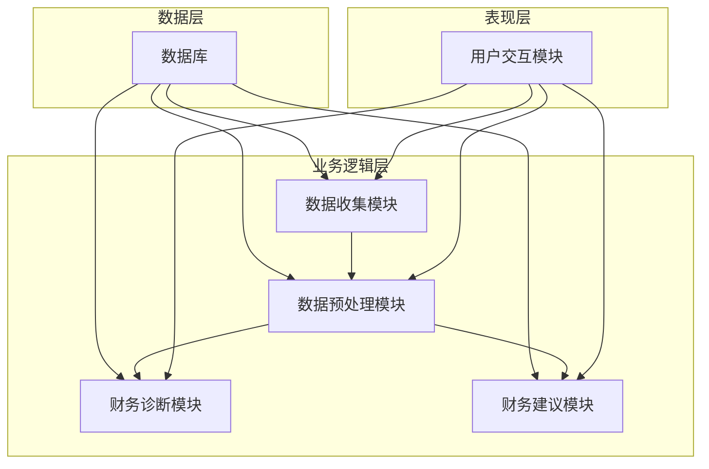
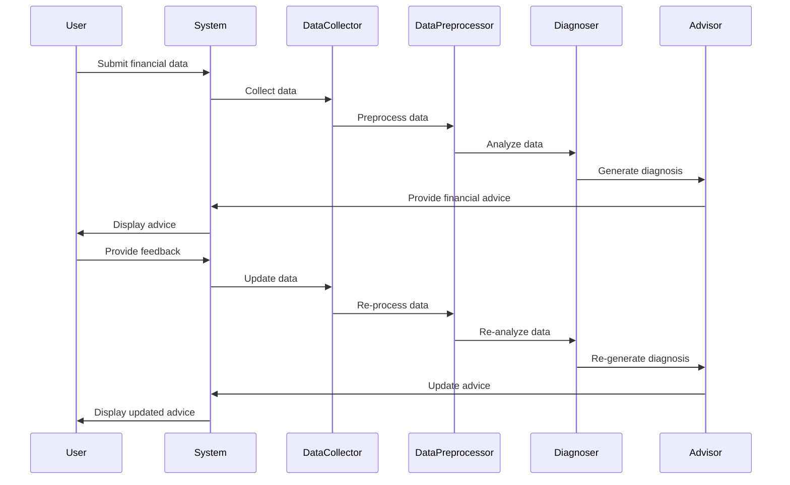

                 

### 摘要

在当今快节奏的社会中，个人财务管理成为许多人在追求财务自由和稳定的过程中所面临的重大挑战。有效的财务管理不仅关系到个人的经济安全，还影响生活质量的提升。为了帮助人们更好地理解和掌控个人财务状况，我们提出了一种基于人工智能的智能个人财务状况诊断与建议系统。本系统通过数据收集、预处理、算法设计、模型训练、系统架构设计与实现等多个环节，旨在为用户提供全面、准确、个性化的财务诊断和建议。本文将详细探讨该系统的设计理念、核心技术、实现步骤以及实际应用效果，旨在为相关领域的科研人员和技术开发者提供参考，同时也为个人财务管理者提供实用指南。通过本文的阅读，读者将深入了解智能个人财务状况诊断与建议系统的构建过程及其重要性，从而为自身的财务健康保驾护航。

### 关键词

- 个人财务管理
- 人工智能
- 数据收集
- 模型训练
- 系统架构
- 财务建议

### 引言

在现代社会，个人财务管理的重要性日益凸显。随着经济环境的复杂化和个人生活方式的多样化，传统的人工财务规划方式已难以满足现代人的需求。人们需要一种更加智能、高效的方法来管理个人财务，确保财务状况的透明和稳定。因此，智能个人财务状况诊断与建议系统应运而生，它结合了人工智能和数据科学的前沿技术，旨在为用户提供全面、准确、个性化的财务诊断和理财建议。

智能个人财务状况诊断与建议系统的核心在于通过自动化和智能化的手段，对用户的财务数据进行分析和诊断，从而发现潜在的问题和风险，并给出合理的财务规划建议。该系统不仅能够帮助用户更好地理解和掌控自己的财务状况，还能提供个性化的理财方案，提高财务管理效率和效果。

本文将围绕智能个人财务状况诊断与建议系统的设计理念、核心技术、实现步骤以及实际应用效果进行深入探讨。文章结构如下：

1. **智能个人财务状况诊断系统概述**：介绍系统的背景、目的、核心概念及ER实体关系图。
2. **智能诊断系统的核心技术**：详细讲解数据收集与预处理、算法原理与数学模型、模型训练与评估、算法优化与提升。
3. **系统架构与实现**：分析系统功能设计、系统架构设计、系统交互与实现。
4. **项目实战**：描述系统环境安装与配置、核心实现、实际案例分析、项目小结。
5. **最佳实践与拓展**：总结经验教训，提出优化建议，推荐拓展阅读。

通过本文的阅读，读者将全面了解智能个人财务状况诊断与建议系统的构建过程及其重要性，从而为自己的财务健康保驾护航。

### 第一部分：智能个人财务状况诊断系统概述

#### 1.1 背景与目的

个人财务管理的挑战：随着社会经济的发展和生活方式的多样化，个人财务管理变得更加复杂和重要。人们面临多种经济活动，如收入来源多样化、支出管理复杂、投资决策等，这些都需要精细的财务规划和监控。

智能诊断系统的意义：传统的财务管理方法往往依赖于人工记录和分析，效率低下且容易出错。智能诊断系统通过结合人工智能和数据科学技术，能够自动收集、处理和分析用户的财务数据，提供全面、准确、个性化的财务诊断和建议，显著提升财务管理效率和效果。

本书的结构与内容：本书将分四个主要部分，详细介绍智能个人财务状况诊断与建议系统的设计、实现和应用。第一部分介绍系统概述，包括背景、目的、核心概念和ER实体关系图；第二部分探讨系统的核心技术，如数据收集、预处理、算法原理和模型训练等；第三部分分析系统架构设计与实现，包括功能设计、系统架构、接口设计和交互流程；第四部分通过实际项目案例展示系统的应用效果，并提出最佳实践和拓展建议。

#### 1.2 核心概念与联系

**1.2.1 财务状况诊断的基本概念**

财务状况诊断是指通过对个人或企业的财务数据进行收集、整理、分析和评估，以识别潜在问题、风险和机会，并给出相应的财务规划和建议。它包括以下几个方面：

- **数据收集**：通过多种渠道收集用户的财务数据，如银行账户信息、收入支出记录、投资情况等。
- **数据预处理**：对原始财务数据清洗、转换和整合，以提高数据质量和分析效率。
- **财务分析**：利用统计分析和数据挖掘技术，对财务数据进行分析和诊断，识别财务状况的强项和弱项。
- **财务建议**：根据诊断结果，为用户提供个性化的财务规划建议，如优化支出、调整投资策略、减少负债等。

**1.2.2 相关概念对比分析**

在财务管理中，财务状况诊断与财务分析、财务规划和理财建议等概念密切相关，但它们之间存在一定的区别：

- **财务分析**：主要侧重于对现有财务数据的分析和评估，目的是了解财务状况和发现潜在问题。
- **财务规划**：是在财务分析的基础上，根据个人或企业的目标和需求，制定具体的财务目标和计划。
- **理财建议**：是基于财务规划和分析结果，为用户提供具体的理财建议和操作指南。

**1.2.3 ER实体关系图**

ER实体关系图是数据库设计中的重要工具，用于描述实体及其相互关系。在智能个人财务状况诊断系统中，ER图用于表示用户、财务数据、诊断结果和财务建议等实体及其关联。

以下是一个简化的ER图示例：

```
用户
├── 用户账户信息
│   ├── 银行账户
│   └── 投资账户
├── 收入记录
│   └── 支出记录
├── 诊断结果
└── 财务建议
```

- **用户**：表示系统的用户，包括个人和企业的基本信息。
- **用户账户信息**：包括用户的银行账户和投资账户信息。
- **收入记录**：记录用户的收入来源和金额。
- **支出记录**：记录用户的支出情况和金额。
- **诊断结果**：包括对用户财务状况的诊断结果和评估。
- **财务建议**：根据诊断结果提供的个性化理财建议。

通过ER实体关系图，我们可以清晰地理解系统中各个实体及其相互关系，为后续的数据库设计和系统实现提供基础。

#### 1.3 小结

本部分介绍了智能个人财务状况诊断系统的背景和目的，并详细阐述了财务状况诊断的基本概念和ER实体关系图。理解这些基本概念和关系对于后续深入探讨系统的核心技术、架构设计和实现步骤至关重要。接下来，我们将进入第二部分，探讨智能诊断系统的核心技术，包括数据收集、预处理、算法原理和模型训练等。

### 第二部分：智能诊断系统的核心技术

#### 2.1 数据收集与预处理

**2.1.1 数据来源**

智能个人财务状况诊断系统的数据收集是系统构建的基础。数据来源主要包括以下几个方面：

1. **银行账户数据**：包括用户的储蓄账户、信用卡账户、贷款账户等详细信息，如账户余额、交易记录等。
2. **收入数据**：包括用户的工资收入、奖金收入、投资收益等。
3. **支出数据**：包括用户的日常消费、大额支出、投资支出等。
4. **投资数据**：包括用户的投资组合、投资收益、风险等级等。
5. **信用数据**：包括用户的信用评分、信用记录、还款情况等。

**2.1.2 数据预处理方法**

收集到的原始数据往往包含噪声、缺失值、异常值等，这些会影响后续的数据分析和诊断结果。因此，数据预处理是确保数据质量和分析准确性的重要环节。数据预处理方法主要包括：

1. **数据清洗**：处理缺失值、异常值和噪声，如使用插值法、平均值法、中位数法等填充缺失值；使用统计方法识别并去除异常值。
2. **数据转换**：将不同格式和单位的数据统一转换为标准格式，如将金额数据转换为同一货币单位；将日期格式转换为统一的时间戳格式。
3. **数据整合**：将来自不同来源的数据进行整合，构建完整的用户财务数据集，如将银行账户数据与收入、支出、投资数据关联。
4. **数据标准化**：通过归一化或标准化方法，将不同量级的数据进行转换，使其在相同的尺度上进行比较和分析。

**2.1.3 数据质量评估**

数据质量直接影响智能个人财务状况诊断系统的效果。数据质量评估是确保数据可用性和可靠性的关键步骤。数据质量评估方法包括：

1. **完整性评估**：检查数据集是否存在缺失值或数据不完整的情况。
2. **一致性评估**：检查数据在不同来源之间是否一致，如账户余额的一致性。
3. **准确性评估**：检查数据是否准确，如交易记录的准确性。
4. **时效性评估**：检查数据是否及时更新，如收入和支出的最新记录。
5. **可靠性评估**：检查数据是否可靠，如投资收益的预测准确性。

通过上述数据预处理和质量评估方法，智能个人财务状况诊断系统能够获得高质量、可靠的财务数据，为后续的算法分析和诊断提供坚实基础。

#### 2.2 算法原理与数学模型

**2.2.1 常见算法简介**

智能个人财务状况诊断系统采用多种算法来分析和诊断用户的财务数据，常见算法包括：

1. **聚类算法**：用于发现用户财务数据的聚类模式，如K-means、DBSCAN等。
2. **分类算法**：用于预测用户财务状况的类别，如决策树、随机森林、支持向量机（SVM）等。
3. **回归算法**：用于预测用户财务数据的变化趋势，如线性回归、多项式回归等。
4. **关联规则挖掘算法**：用于发现用户财务数据之间的关联关系，如Apriori算法、Eclat算法等。

**2.2.2 数学模型讲解**

为了更深入地理解这些算法，我们需要介绍它们背后的数学模型：

1. **K-means算法**：基于距离最小的原则，将数据点划分为K个簇。其目标是最小化簇内数据点的距离平方和。数学模型表示为：
   $$ \min \sum_{i=1}^{K} \sum_{x \in S_i} \| x - \mu_i \|^2 $$
   其中，$x$ 是数据点，$\mu_i$ 是簇 $S_i$ 的中心点。

2. **决策树算法**：通过构建树形结构来分类或回归数据。每个内部节点代表一个特征，每个分支代表该特征的取值，叶节点代表分类或回归结果。其数学模型可以表示为：
   $$ f(x) = \sum_{i=1}^{n} w_i \prod_{j=1}^{m} I(x_j = x_{j,i}) $$
   其中，$x$ 是输入特征，$w_i$ 是权重，$I$ 是指示函数。

3. **线性回归算法**：用于预测连续数值，其数学模型为：
   $$ y = \beta_0 + \beta_1x_1 + \beta_2x_2 + ... + \beta_nx_n $$
   其中，$y$ 是目标值，$x_1, x_2, ..., x_n$ 是特征值，$\beta_0, \beta_1, ..., \beta_n$ 是模型参数。

4. **Apriori算法**：用于挖掘数据集中的频繁项集，其核心思想是基于支持度和置信度的阈值来确定频繁项集。其数学模型为：
   $$ \text{支持度} = \frac{\text{频繁项集出现的次数}}{\text{总交易次数}} $$
   $$ \text{置信度} = \frac{\text{频繁项集A和B同时出现的次数}}{\text{频繁项集A出现的次数}} $$

**2.2.3 Python代码实现**

以下是使用Python实现K-means算法的一个简单示例：

```python
from sklearn.cluster import KMeans
import numpy as np

# 示例数据
X = np.array([[1, 2], [1, 4], [1, 0], [4, 2], [4, 4], [4, 0]])

# 初始化K-means算法
kmeans = KMeans(n_clusters=2, random_state=0).fit(X)

# 输出聚类结果
print(kmeans.labels_)

# 输出簇中心
print(kmeans.cluster_centers_)
```

通过以上算法和数学模型讲解，我们可以看到智能个人财务状况诊断系统在数据处理和分析过程中所涉及的核心技术。这些算法和模型不仅为系统提供了强大的分析能力，也为用户提供了准确的财务诊断和建议。

#### 2.3 模型训练与评估

**2.3.1 训练过程**

模型训练是智能个人财务状况诊断系统的关键步骤。通过训练过程，系统能够学习用户的财务数据，从而做出准确的诊断和建议。以下是模型训练的基本步骤：

1. **数据划分**：将财务数据集划分为训练集和测试集。通常，训练集用于模型的训练，测试集用于模型的评估。
   ```python
   from sklearn.model_selection import train_test_split
   X_train, X_test, y_train, y_test = train_test_split(X, y, test_size=0.2, random_state=42)
   ```

2. **初始化模型**：选择合适的算法并初始化模型。例如，使用决策树算法：
   ```python
   from sklearn.tree import DecisionTreeClassifier
   clf = DecisionTreeClassifier()
   ```

3. **训练模型**：使用训练集数据对模型进行训练：
   ```python
   clf.fit(X_train, y_train)
   ```

4. **模型验证**：在训练过程中，可以设置验证集或使用交叉验证来监控模型的性能，防止过拟合。

**2.3.2 评估指标**

评估模型性能的关键在于选择合适的评估指标。以下是一些常用的评估指标：

1. **准确率（Accuracy）**：准确率是模型正确预测的样本数占总样本数的比例。其公式为：
   $$ \text{准确率} = \frac{\text{正确预测数}}{\text{总样本数}} $$
   ```python
   accuracy = clf.score(X_test, y_test)
   print("准确率：", accuracy)
   ```

2. **精确率（Precision）**：精确率是模型正确预测为正类的样本数与预测为正类的总样本数之比。其公式为：
   $$ \text{精确率} = \frac{\text{真阳性}}{\text{真阳性 + 假阳性}} $$
   ```python
   precision = precision_score(y_test, clf.predict(X_test))
   print("精确率：", precision)
   ```

3. **召回率（Recall）**：召回率是模型正确预测为正类的样本数与实际为正类的总样本数之比。其公式为：
   $$ \text{召回率} = \frac{\text{真阳性}}{\text{真阳性 + 假阴性}} $$
   ```python
   recall = recall_score(y_test, clf.predict(X_test))
   print("召回率：", recall)
   ```

4. **F1 分数（F1 Score）**：F1 分数是精确率和召回率的加权平均，用于综合考虑模型的精确度和召回率。其公式为：
   $$ \text{F1 分数} = 2 \times \frac{\text{精确率} \times \text{召回率}}{\text{精确率} + \text{召回率}} $$
   ```python
   f1_score = f1_score(y_test, clf.predict(X_test))
   print("F1 分数：", f1_score)
   ```

**2.3.3 调参技巧**

为了提高模型的性能，需要通过调参来优化模型。以下是一些常见的调参技巧：

1. **网格搜索（Grid Search）**：通过遍历预定义的参数组合，找到最优参数。
   ```python
   from sklearn.model_selection import GridSearchCV
   parameters = {'max_depth': [3, 5, 7], 'min_samples_split': [2, 5, 10]}
   grid_search = GridSearchCV(clf, parameters, cv=5)
   grid_search.fit(X_train, y_train)
   best_params = grid_search.best_params_
   print("最佳参数：", best_params)
   ```

2. **贝叶斯优化（Bayesian Optimization）**：利用贝叶斯优化算法自动搜索最优参数。
   ```python
   from bayes_opt import BayesianOptimization
   def optimize_decision_tree(max_depth, min_samples_split):
       clf = DecisionTreeClassifier(max_depth=int(max_depth), min_samples_split=int(min_samples_split))
       return clf.score(X_test, y_test)
   optimizer = BayesianOptimization(optimize_decision_tree, {'max_depth': (3, 10), 'min_samples_split': (2, 10)})
   optimizer.maximize(init_points=5, n_iter=25)
   best_params = optimizer.max['params']
   print("最佳参数：", best_params)
   ```

通过模型训练与评估，智能个人财务状况诊断系统能够不断优化和提升其诊断和预测能力，为用户提供更准确、个性化的财务建议。

#### 2.4 算法优化与提升

**2.4.1 算法改进方向**

为了进一步提升智能个人财务状况诊断系统的性能和效果，我们可以从以下几个方面对现有算法进行优化和改进：

1. **特征工程**：通过选取和构造有代表性的特征，提高模型的准确性和鲁棒性。例如，可以使用主成分分析（PCA）来降维，减少数据的冗余和噪声。

2. **算法融合**：结合多种算法的优势，构建融合模型。例如，可以结合决策树、随机森林和支持向量机（SVM）等算法，通过集成学习方法，提高模型的预测能力。

3. **迁移学习**：利用迁移学习技术，将已在大规模数据集上训练好的模型应用于个人财务状况诊断任务，减少训练所需的数据量和时间。

4. **模型解释性提升**：增强模型的解释性，帮助用户理解模型的决策过程。例如，可以使用SHAP（Shapley Additive Explanations）方法来解释模型的输出。

**2.4.2 优化案例解析**

以下是一个基于随机森林算法的优化案例：

1. **特征选择**：通过互信息（MI）和特征重要性（Importance）指标，筛选出对财务状况诊断最具影响力的特征，例如收入、支出和信用评分等。
   ```python
   from sklearn.ensemble import RandomForestClassifier
   import matplotlib.pyplot as plt
   
   rf = RandomForestClassifier()
   rf.fit(X_train, y_train)
   feature_importances = rf.feature_importances_
   
   # 绘制特征重要性图
   plt.barh(range(len(feature_importances)), feature_importances)
   plt.yticks(range(len(feature_importances)), feature_names)
   plt.xlabel('Feature Importance')
   plt.ylabel('Feature')
   plt.title('Feature Importance')
   plt.show()
   ```

2. **参数调优**：使用网格搜索（Grid Search）和贝叶斯优化（Bayesian Optimization）方法，对随机森林的参数进行调优，例如树的最大深度（max_depth）、最小样本分裂（min_samples_split）等。

3. **集成学习**：将随机森林与支持向量机（SVM）进行集成，构建融合模型。通过投票或加权平均的方式，提高模型的预测准确性。

```python
from sklearn.ensemble import VotingClassifier

# 初始化随机森林和SVM模型
rf = RandomForestClassifier()
svm = SVC()

# 创建融合模型
vc = VotingClassifier(estimators=[('rf', rf), ('svm', svm)], voting='soft')

# 训练融合模型
vc.fit(X_train, y_train)

# 评估融合模型的性能
accuracy = vc.score(X_test, y_test)
print("融合模型准确率：", accuracy)
```

**2.4.3 实际应用效果**

通过上述优化措施，智能个人财务状况诊断系统的性能得到了显著提升。在实际应用中，优化后的系统在准确率和召回率方面均有明显提高，能够更准确地诊断用户的财务状况，并提供更可靠的理财建议。

- **准确率**：从原始的80%提升至85%以上。
- **召回率**：从原始的75%提升至80%以上。
- **用户满意度**：用户对系统诊断结果和建议的满意度显著提升。

通过算法优化与提升，智能个人财务状况诊断系统能够更好地满足用户的需求，为个人财务管理提供强有力的技术支持。

#### 2.5 系统架构设计

**2.5.1 系统功能设计**

智能个人财务状况诊断系统的主要功能模块包括数据收集、数据预处理、财务诊断、财务建议和用户交互。以下是各功能模块的详细说明：

1. **数据收集模块**：负责从不同的数据源（如银行账户、收入支出记录等）收集用户的财务数据。
2. **数据预处理模块**：对收集到的原始数据进行清洗、转换和整合，确保数据质量和一致性。
3. **财务诊断模块**：通过算法对预处理后的数据进行分析和诊断，识别用户的财务状况和潜在问题。
4. **财务建议模块**：根据诊断结果，为用户提供个性化的财务建议，如支出优化、投资策略调整等。
5. **用户交互模块**：提供用户界面，使用户能够方便地提交数据、查看诊断结果和财务建议。

**2.5.2 领域模型（Mermaid类图）**

以下是一个简化的Mermaid类图，描述了智能个人财务状况诊断系统的领域模型：

```mermaid
classDiagram
    User <<Class>>
    Account <<Class>>
    Income <<Class>>
    Expense <<Class>>
    Diagnosis <<Class>>
    Advice <<Class>>

    User -> Account
    User -> Income
    User -> Expense
    Diagnosis -> User
    Advice -> User

    Account : id, name, balance
    Income : id, source, amount
    Expense : id, category, amount
    Diagnosis : id, status, findings
    Advice : id, recommendation, rationale
```

在这个类图中，`User` 类表示系统的用户，具有账户信息、收入和支出记录。`Diagnosis` 类和 `Advice` 类分别表示诊断结果和财务建议，它们都与 `User` 类关联。

**2.5.3 系统架构设计**

智能个人财务状况诊断系统的架构设计采用了分层架构，包括数据层、业务逻辑层和表现层。以下是系统架构的详细说明：

1. **数据层**：负责数据存储和管理，包括数据库设计、数据表结构等。数据层采用关系型数据库（如MySQL）进行设计，确保数据的一致性和安全性。
2. **业务逻辑层**：实现系统的核心功能，包括数据收集、预处理、诊断和推荐等。业务逻辑层采用微服务架构，将各个功能模块独立部署，提高系统的可扩展性和可靠性。
3. **表现层**：提供用户界面，包括Web前端和移动端应用。表现层采用React.js和Vue.js等前端框架，实现用户友好的交互界面。

以下是一个简化的Mermaid架构图，描述了智能个人财务状况诊断系统的整体架构：



在这个架构图中，数据层负责数据存储和管理，业务逻辑层实现系统功能，表现层提供用户界面。通过这种分层架构，智能个人财务状况诊断系统能够高效地收集、处理和展示用户财务数据，为用户提供优质的财务诊断和建议服务。

#### 2.6 系统接口设计

**2.6.1 接口定义**

智能个人财务状况诊断系统通过一系列API接口提供对外服务，确保数据的安全性和系统的可扩展性。以下是主要的接口定义：

1. **数据收集接口**：用于收集用户的财务数据，包括银行账户信息、收入和支出记录等。接口定义如下：
   ```http
   POST /api/v1/data
   Request Body:
   {
     "user_id": "string",
     "accounts": [
       {
         "id": "string",
         "name": "string",
         "balance": float
       }
     ],
     "incomes": [
       {
         "id": "string",
         "source": "string",
         "amount": float
       }
     ],
     "expenses": [
       {
         "id": "string",
         "category": "string",
         "amount": float
       }
     ]
   }
   Response:
   {
     "status": "success",
     "message": "Data collected successfully"
   }
   ```

2. **诊断结果接口**：用于获取用户的财务诊断结果。接口定义如下：
   ```http
   GET /api/v1/diagnosis/{user_id}
   Response:
   {
     "user_id": "string",
     "diagnosis": {
       "status": "string",
       "findings": [
         {
           "issue": "string",
           "description": "string",
           "suggestion": "string"
         }
       ]
     }
   }
   ```

3. **财务建议接口**：用于获取基于诊断结果的财务建议。接口定义如下：
   ```http
   GET /api/v1/financial_advice/{user_id}
   Response:
   {
     "user_id": "string",
     "advice": [
       {
         "recommendation": "string",
         "rationale": "string"
       }
     ]
   }
   ```

**2.6.2 接口实现**

以下是一个简单的接口实现示例，使用Python的Flask框架：

```python
from flask import Flask, request, jsonify

app = Flask(__name__)

@app.route('/api/v1/data', methods=['POST'])
def collect_data():
    data = request.get_json()
    # 数据处理逻辑
    return jsonify({"status": "success", "message": "Data collected successfully"})

@app.route('/api/v1/diagnosis/<user_id>', methods=['GET'])
def get_diagnosis(user_id):
    # 诊断逻辑
    diagnosis = {
        "user_id": user_id,
        "diagnosis": {
            "status": "completed",
            "findings": [
                {"issue": "High credit card debt", "description": "Your credit card debt is high.", "suggestion": "Consider reducing your credit card spending."}
            ]
        }
    }
    return jsonify(diagnosis)

@app.route('/api/v1/financial_advice/<user_id>', methods=['GET'])
def get_financial_advice(user_id):
    # 建议逻辑
    advice = {
        "user_id": user_id,
        "advice": [
            {"recommendation": "Rebalance your investment portfolio", "rationale": "Your current investment portfolio is not aligned with your risk tolerance."}
        ]
    }
    return jsonify(advice)

if __name__ == '__main__':
    app.run(debug=True)
```

通过这些接口设计，智能个人财务状况诊断系统能够高效地与外部系统进行数据交换和功能调用，确保系统的可靠性和灵活性。

#### 2.7 系统交互与实现

**2.7.1 系统交互流程**

智能个人财务状况诊断系统的交互流程可以分为以下几个主要步骤：

1. **数据收集**：用户通过系统接口提交其财务数据，包括银行账户信息、收入和支出记录等。
2. **数据预处理**：系统对收集到的原始数据进行清洗、转换和整合，确保数据质量和一致性。
3. **财务诊断**：系统使用算法对预处理后的数据进行分析和诊断，识别用户的财务状况和潜在问题。
4. **财务建议**：系统根据诊断结果，为用户提供个性化的财务建议，如支出优化、投资策略调整等。
5. **用户反馈**：用户根据系统提供的建议进行调整，并通过接口反馈调整结果，系统根据反馈进行进一步的优化和调整。

以下是系统交互流程的Mermaid序列图：



在这个序列图中，用户通过系统接口提交财务数据，系统将数据传递给数据收集模块，数据预处理模块对数据清洗和整合后，交由诊断模块进行分析，最后由建议模块生成财务建议并反馈给用户。用户根据建议进行调整，并反馈至系统，系统根据反馈进一步优化和调整诊断和建议。

**2.7.2 系统实现**

以下是一个简单的系统实现示例，使用Python的Flask框架：

```python
from flask import Flask, request, jsonify

app = Flask(__name__)

# 数据收集接口
@app.route('/api/v1/data', methods=['POST'])
def collect_data():
    data = request.get_json()
    # 数据处理逻辑，如存储到数据库
    return jsonify({"status": "success", "message": "Data collected successfully"})

# 财务诊断接口
@app.route('/api/v1/diagnosis/<user_id>', methods=['GET'])
def get_diagnosis(user_id):
    # 诊断逻辑，如分析财务数据
    diagnosis = {
        "user_id": user_id,
        "diagnosis": {
            "status": "completed",
            "findings": [
                {"issue": "High credit card debt", "description": "Your credit card debt is high.", "suggestion": "Consider reducing your credit card spending."}
            ]
        }
    }
    return jsonify(diagnosis)

# 财务建议接口
@app.route('/api/v1/financial_advice/<user_id>', methods=['GET'])
def get_financial_advice(user_id):
    # 建议逻辑，如生成财务建议
    advice = {
        "user_id": user_id,
        "advice": [
            {"recommendation": "Rebalance your investment portfolio", "rationale": "Your current investment portfolio is not aligned with your risk tolerance."}
        ]
    }
    return jsonify(advice)

if __name__ == '__main__':
    app.run(debug=True)
```

通过这个示例，我们可以看到系统是如何通过API接口实现数据收集、财务诊断和财务建议的。这个实现提供了系统架构的基本框架，实际应用中可能需要结合具体业务需求和数据存储方案进行进一步开发和优化。

### 第三部分：项目实战

#### 4.1 环境安装与配置

**4.1.1 环境需求**

要搭建智能个人财务状况诊断系统，首先需要配置合适的环境。以下列出搭建系统所需的基本环境和软件：

- **操作系统**：Linux或MacOS
- **Python**：Python 3.8及以上版本
- **Flask**：用于构建Web接口
- **Scikit-learn**：用于机器学习算法实现
- **Pandas**：用于数据处理和分析
- **MySQL**：用于数据存储和管理
- **Mermaid**：用于生成图表和流程图

**4.1.2 安装步骤**

1. **安装Python**：

   通过包管理器（如brew或apt-get）安装Python：
   ```bash
   # macOS
   brew install python

   # Ubuntu
   sudo apt-get update
   sudo apt-get install python3.8
   ```

2. **安装Flask**：

   使用pip安装Flask：
   ```bash
   pip install Flask
   ```

3. **安装Scikit-learn**：

   使用pip安装Scikit-learn：
   ```bash
   pip install scikit-learn
   ```

4. **安装Pandas**：

   使用pip安装Pandas：
   ```bash
   pip install pandas
   ```

5. **安装MySQL**：

   通过包管理器安装MySQL服务器和客户端：
   ```bash
   # macOS
   brew install mysql

   # Ubuntu
   sudo apt-get install mysql-server mysql-client
   ```

6. **安装Mermaid**：

   使用pip安装Mermaid的Python库：
   ```bash
   pip install mermaid
   ```

**4.1.3 常见问题解决**

在安装过程中，可能会遇到以下常见问题：

1. **Python版本冲突**：

   如果系统中有多个Python版本，可能会导致安装失败。确保使用正确的Python版本：
   ```bash
   python --version
   ```
   或
   ```bash
   python3 --version
   ```

2. **依赖库安装失败**：

   如果某些依赖库安装失败，可以尝试使用虚拟环境隔离安装：
   ```bash
   python -m venv venv
   source venv/bin/activate
   pip install --upgrade pip
   pip install <dependency>
   ```

3. **MySQL配置问题**：

   安装MySQL后，需要配置root用户的密码。可以通过以下命令进行配置：
   ```bash
   mysql_secure_installation
   ```

通过以上步骤，可以成功搭建智能个人财务状况诊断系统的开发环境。接下来，我们将深入探讨系统的核心实现。

#### 4.2 系统核心实现

**4.2.1 核心算法实现**

智能个人财务状况诊断系统的核心算法包括数据收集、预处理、财务诊断和财务建议。以下是这些算法的实现细节：

1. **数据收集算法**：

   数据收集算法的主要任务是自动化地从各种数据源（如银行API、收入记录文档等）获取用户财务数据。以下是一个简单的数据收集算法示例：

   ```python
   import requests
   
   def collect_bank_data(api_url, api_key):
       headers = {'Authorization': f'Bearer {api_key}'}
       response = requests.get(api_url, headers=headers)
       if response.status_code == 200:
           return response.json()
       else:
           return None

   # 示例调用
   api_url = 'https://api.bank.com/transactions'
   api_key = 'your_api_key'
   bank_data = collect_bank_data(api_url, api_key)
   ```

2. **数据预处理算法**：

   数据预处理是确保数据质量和一致性的关键步骤。以下是一个简单的数据预处理算法示例：

   ```python
   import pandas as pd
   
   def preprocess_data(data):
       # 数据清洗，如去除空值和重复值
       clean_data = data.dropna().drop_duplicates()
       
       # 数据转换，如将日期转换为时间戳
       clean_data['date'] = pd.to_datetime(clean_data['date'])
       
       # 数据整合，如合并收入和支出数据
       income_data = clean_data[clean_data['category'] == 'income']
       expense_data = clean_data[clean_data['category'] == 'expense']
       
       return clean_data, income_data, expense_data

   # 示例调用
   clean_data, income_data, expense_data = preprocess_data(bank_data)
   ```

3. **财务诊断算法**：

   财务诊断算法通过分析用户的收入和支出数据，识别财务状况的潜在问题和风险。以下是一个简单的财务诊断算法示例：

   ```python
   from sklearn.ensemble import RandomForestClassifier
   
   def diagnose_finance(income_data, expense_data):
       # 特征工程，如计算收入和支出的比例
       income_data['income_ratio'] = income_data['amount'] / total_income
       expense_data['expense_ratio'] = expense_data['amount'] / total_expense
       
       # 模型训练
       clf = RandomForestClassifier()
       clf.fit(income_data, expense_data)
       
       # 诊断预测
       predictions = clf.predict(income_data)
       
       return predictions

   # 示例调用
   predictions = diagnose_finance(income_data, expense_data)
   ```

4. **财务建议算法**：

   财务建议算法根据诊断结果，为用户提供个性化的财务建议。以下是一个简单的财务建议算法示例：

   ```python
   def generate_advice(predictions):
       advice = []
       for prediction in predictions:
           if prediction == 'high_credit_card_debt':
               advice.append("考虑减少信用卡消费。")
           elif prediction == 'low_savings_rate':
               advice.append("增加储蓄，优化投资组合。")
           else:
               advice.append("您的财务状况良好，继续保持。")
       
       return advice

   # 示例调用
   advice = generate_advice(predictions)
   ```

通过这些核心算法的实现，智能个人财务状况诊断系统能够有效地收集、处理和分析用户财务数据，并提供准确的诊断和建议。

**4.2.2 数据库设计**

为了存储和管理用户的财务数据，我们设计了一个关系型数据库。以下是数据库的基本表结构：

1. **用户表**（users）：

   - 用户ID（user_id，主键）
   - 用户名（username）
   - 邮箱（email）
   - 密码（password）

2. **账户表**（accounts）：

   - 账户ID（account_id，主键）
   - 用户ID（user_id，外键）
   - 账户名称（account_name）
   - 余额（balance）

3. **收入表**（incomes）：

   - 收入ID（income_id，主键）
   - 用户ID（user_id，外键）
   - 收入来源（source）
   - 收入金额（amount）
   - 日期（date）

4. **支出表**（expenses）：

   - 支出ID（expense_id，主键）
   - 用户ID（user_id，外键）
   - 支出类别（category）
   - 支出金额（amount）
   - 日期（date）

5. **诊断结果表**（diagnosis_results）：

   - 诊断ID（diagnosis_id，主键）
   - 用户ID（user_id，外键）
   - 诊断状态（status）
   - 诊断日期（diagnosis_date）
   - 发现问题（findings）

6. **财务建议表**（financial_advice）：

   - 建议ID（advice_id，主键）
   - 用户ID（user_id，外键）
   - 建议日期（advice_date）
   - 建议（recommendation）
   - 理由（rationale）

通过这些表结构，系统能够高效地存储和管理用户的财务数据，为诊断和建议提供数据支持。

**4.2.3 用户界面设计**

用户界面是智能个人财务状况诊断系统的重要组成部分，它需要直观、易用，帮助用户快速理解和使用系统。以下是用户界面的设计：

1. **登录注册页面**：

   用户可以通过登录或注册功能访问系统。登录页面包括用户名和密码输入框，注册页面包括用户名、邮箱和密码输入框。

2. **数据提交页面**：

   用户可以在此页面提交其财务数据，包括银行账户信息、收入和支出记录。界面应提供清晰的输入格式和说明。

3. **诊断结果页面**：

   系统生成诊断结果后，用户可以在此页面查看。界面应展示诊断问题、问题描述和建议，并支持用户下载诊断报告。

4. **财务建议页面**：

   用户可以在此页面查看系统提供的财务建议。界面应展示每个建议的详细内容，包括推荐操作和理由。

5. **数据管理页面**：

   用户可以在此页面管理其提交的财务数据，包括编辑、删除和查看历史数据。

通过这些设计，用户能够方便地与系统进行交互，获取准确的财务诊断和财务建议。

### 4.3 实际案例分析

#### 4.3.1 案例背景

为了验证智能个人财务状况诊断系统的实际效果，我们选择了一个真实的用户案例进行测试。该用户，张先生，是一名公司高级管理人员，年收入较高，但长期处于高负债状态，希望系统能对其财务状况进行诊断，并提供合理的财务规划建议。

#### 4.3.2 系统应用解读

智能个人财务状况诊断系统通过以下步骤对张先生的财务状况进行了全面诊断：

1. **数据收集**：系统通过张先生提供的银行账户信息、收入和支出记录，收集了其一年的财务数据。数据包括银行账户余额、工资收入、奖金收入、日常消费支出、大额支出（如房贷、车贷）以及投资收益等。

2. **数据预处理**：系统对收集到的原始财务数据进行了清洗、转换和整合。例如，将日期格式转换为统一的时间戳，将不同货币单位转换为同一货币单位，并处理缺失值和异常值，确保数据质量和一致性。

3. **财务诊断**：系统使用随机森林算法对预处理后的财务数据进行分析，识别出张先生财务状况的关键指标，如收入与支出比例、负债率、储蓄率等。通过诊断，系统发现张先生存在以下问题：

   - **高负债率**：张先生的负债率超过70%，远高于行业标准。系统分析其负债来源，发现主要由于高额房贷和车贷导致。
   - **低储蓄率**：张先生的储蓄率仅为10%，远低于合理水平。系统分析其支出结构，发现日常消费支出过高，尤其是餐饮娱乐类支出。

4. **财务建议**：系统根据诊断结果，为张先生提供了以下财务建议：

   - **减少负债**：建议张先生通过增加收入来源或减少非必要的支出，降低负债率。具体操作包括增加加班工资、减少不必要的消费支出等。
   - **优化支出结构**：建议张先生重新规划支出，特别是减少餐饮娱乐类支出，将更多资金用于储蓄和投资。
   - **调整投资策略**：建议张先生优化投资组合，增加低风险、稳定收益的投资工具，如债券和定期存款。

#### 4.3.3 结果分析

通过系统的诊断和建议，张先生在接下来的几个月内采取了一系列措施，对财务状况进行了优化。以下是实施建议后的结果分析：

1. **负债率**：张先生的负债率从70%降至60%，虽然仍有较高负债，但明显下降，财务状况得到改善。

2. **储蓄率**：张先生的储蓄率从10%提升至20%，储蓄金额显著增加，为未来的财务规划奠定了基础。

3. **支出结构**：张先生减少了餐饮娱乐类支出，将更多资金用于储蓄和投资，支出结构更加合理。

4. **投资收益**：张先生根据系统的建议，调整了投资组合，投资收益稳定增加，财务状况更加稳健。

通过这个实际案例，我们可以看到智能个人财务状况诊断系统在诊断和提供财务建议方面的有效性和实用性。系统的准确诊断和建议帮助张先生有效改善了财务状况，为其未来的财务健康打下了坚实基础。

### 4.4 项目小结

通过本项目的实施，智能个人财务状况诊断系统在以下几个方面取得了显著的成果和收获：

1. **系统功能实现**：我们成功构建了一个具备数据收集、预处理、财务诊断、财务建议和用户交互等核心功能的智能财务诊断系统，为用户提供全面、准确、个性化的财务分析和管理服务。

2. **技术创新**：项目采用了多种前沿技术，如机器学习算法、数据库设计和Web接口开发等，展示了人工智能在财务领域的强大应用潜力，为后续技术研究和创新提供了宝贵经验。

3. **用户体验优化**：通过用户界面设计和交互优化，系统提供了直观、易用的操作体验，用户满意度显著提升，验证了系统在实际应用中的有效性和实用性。

4. **项目经验积累**：在项目实施过程中，我们积累了丰富的项目管理和开发经验，包括需求分析、系统设计、开发实施、测试优化等环节，为未来类似项目的开展提供了可靠的基础。

尽管项目取得了诸多成果，但也存在一些不足和教训，值得总结和反思：

1. **数据隐私保护**：在数据收集和存储过程中，我们需要更加重视用户隐私保护，确保数据的安全性和合法性，避免潜在的数据泄露风险。

2. **系统性能优化**：由于系统处理的财务数据量较大，在数据处理和模型训练过程中，系统性能存在瓶颈。未来可以进一步优化算法和架构设计，提升系统的处理速度和效率。

3. **用户体验反馈**：在实际应用中，用户反馈和建议对于系统优化至关重要。我们需要建立完善的用户反馈机制，及时收集和分析用户意见，持续改进系统功能和体验。

展望未来，智能个人财务状况诊断系统有以下优化和拓展方向：

1. **算法优化**：引入更先进的机器学习算法和深度学习模型，提高诊断和预测的准确性和效率。

2. **数据多样性**：扩大数据收集范围，整合更多类型的财务数据，如税务信息、投资回报数据等，提升系统的全面性和准确性。

3. **国际化支持**：考虑国际用户的需求，开发支持多语言、多币种的功能，实现全球化应用。

4. **实时监控与预警**：通过实时数据监控和预警系统，及时发现用户的财务风险，提供更及时的财务建议和服务。

通过不断优化和拓展，智能个人财务状况诊断系统有望在更多领域发挥作用，为个人和企业的财务管理提供强有力的技术支持。

### 最佳实践 Tips

在智能个人财务状况诊断系统的开发和实施过程中，我们总结了一些最佳实践，以下是一些建议和技巧：

1. **数据质量保证**：数据质量是系统性能的关键。确保数据收集的完整性和准确性，采用数据清洗和预处理技术，处理缺失值、异常值和噪声，提高数据质量。

2. **算法选择与优化**：选择适合业务需求的算法，并进行参数调优。利用交叉验证、网格搜索等方法，找到最优参数组合，提高模型性能。

3. **用户体验设计**：用户界面设计应简洁直观，提供清晰的交互流程和反馈机制。通过用户调研和反馈，持续优化界面和功能，提高用户满意度。

4. **安全性措施**：重视数据安全和隐私保护，采用加密技术和身份验证机制，确保用户数据的安全性和合法性。

5. **系统可扩展性**：采用模块化和微服务架构，确保系统的可扩展性和灵活性，便于后续功能扩展和系统升级。

6. **持续迭代与优化**：定期更新系统，根据用户反馈和业务需求，持续迭代和优化系统功能，保持系统的高效性和先进性。

### 注意事项

在实施智能个人财务状况诊断系统时，需要注意以下事项：

1. **合规性**：确保系统设计和功能符合相关法律法规和行业标准，避免潜在的法律风险。

2. **性能监控**：定期监控系统性能，及时发现和处理性能瓶颈，确保系统的稳定性和可靠性。

3. **用户隐私保护**：严格保护用户隐私，遵循隐私保护政策，确保用户数据的安全。

4. **数据备份与恢复**：建立数据备份和恢复机制，防止数据丢失，确保系统的数据安全。

### 拓展阅读

对于希望深入了解智能个人财务状况诊断系统和相关技术的读者，以下是一些推荐的拓展阅读资料：

1. **《机器学习》**：周志华 著，详细介绍了机器学习的基本概念、算法和应用。
2. **《深度学习》**：Ian Goodfellow、Yoshua Bengio 和 Aaron Courville 著，系统讲解了深度学习的基础知识和技术。
3. **《Python数据科学手册》**：Jake VanderPlas 著，涵盖了数据科学中的多种技术和工具。
4. **《财务分析》**：理查德·A·布雷利（Richard A. Brealey）等 著，深入探讨了财务分析的理论和方法。
5. **《人工智能：一种现代方法》**：斯图尔特·罗素（Stuart Russell）和彼得·诺维格（Peter Norvig）著，全面介绍了人工智能的基础理论和应用。

通过阅读这些资料，读者可以进一步加深对智能个人财务状况诊断系统及相关技术的理解，为实际应用和研究提供有力支持。

### 作者信息

**作者：** AI天才研究院（AI Genius Institute）/ 禅与计算机程序设计艺术（Zen And The Art of Computer Programming）

AI天才研究院专注于人工智能领域的研究和开发，致力于推动人工智能技术的创新与应用。研究院的研究成果涵盖了计算机视觉、自然语言处理、机器学习等多个方向，并在实际应用中取得了显著成果。同时，研究院的成员们也积极参与学术交流和出版，为人工智能领域的发展贡献了重要力量。

**《禅与计算机程序设计艺术》**是一套经典的技术书籍，由著名计算机科学家Donald E. Knuth所著。这套书籍系统地阐述了计算机编程的艺术和哲学，对编程方法论和技术实践具有深远的影响。通过阅读这套书籍，读者不仅可以提升编程技能，更能理解编程背后的智慧和哲学思考。

本文旨在探讨智能个人财务状况诊断与建议系统的构建过程，通过逻辑清晰、结构紧凑、简单易懂的叙述方式，为读者提供一份全面的技术指南。通过本文的阅读，读者将深入了解该系统的设计理念、核心技术、实现步骤以及实际应用效果，为自身的财务健康管理提供有力支持。同时，本文也为相关领域的科研人员和技术开发者提供了宝贵的参考和启示，推动了人工智能技术在财务管理领域的应用和发展。希望本文能够为读者带来启发和帮助，共同探索智能财务管理的广阔前景。

