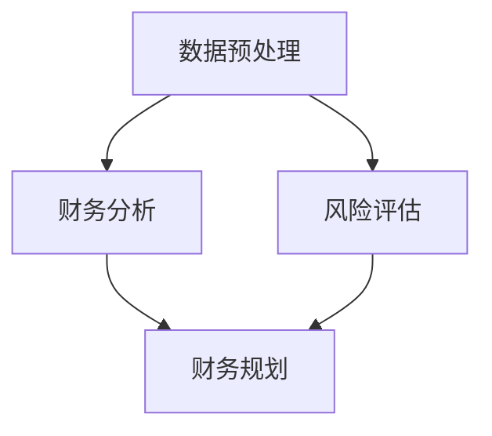

                 

### 第一部分：背景介绍

## 第1章：智能个人财务状况诊断系统概述

### 1.1 问题背景

在当今快速发展的社会中，个人财务管理变得越来越重要。然而，对于许多人来说，管理个人财务仍然是一个复杂且具有挑战性的任务。财务管理不仅涉及到收入和支出的平衡，还包括投资规划、风险管理和退休计划等多个方面。传统的财务管理方法通常依赖于手动记录和分析，这不仅耗时，而且容易出错。随着人工智能（AI）和大数据技术的发展，开发一种智能个人财务状况诊断系统成为了一种趋势，以帮助用户更好地管理他们的财务。

**财务管理的重要性：**

1. **优化支出：** 通过对日常支出和消费习惯的分析，用户可以识别出不必要的开支，从而优化预算。
2. **投资规划：** 智能系统可以根据用户的财务状况、风险承受能力和投资目标，提供个性化的投资建议。
3. **风险管理：** 通过风险评估模型，用户可以及时发现潜在的风险，并采取措施进行防范。
4. **退休规划：** 智能系统可以帮助用户评估退休金的需求，并提供退休储蓄计划。

**个人财务管理的挑战：**

1. **数据复杂性：** 个人财务数据通常来自多个渠道，包括银行账户、信用卡、投资账户等，这些数据的格式和结构可能各不相同。
2. **风险识别：** 个人财务风险多种多样，包括市场波动、信用风险等，识别这些风险需要专业的分析和工具。
3. **个性化需求：** 每个人的财务状况和目标都是独特的，因此需要个性化的财务规划和建议。

### 1.2 问题描述

**财务管理的问题：**

- **数据收集：** 如何有效地收集和处理来自多个渠道的财务数据？
- **数据分析：** 如何利用大数据技术对财务数据进行分析，以提供有价值的洞察？
- **风险识别：** 如何识别和管理个人财务风险？
- **个性化规划：** 如何根据每个用户的财务状况和目标，提供个性化的财务规划建议？

**智能诊断系统的需求：**

- **自动化数据处理：** 系统能够自动收集、整合和分析用户的财务数据。
- **智能分析：** 系统应该能够利用机器学习和数据分析技术，提供准确的财务分析和风险评估。
- **个性化建议：** 系统能够根据用户的财务状况和目标，提供定制化的财务规划建议。

### 1.3 问题解决

**智能个人财务状况诊断系统的概念：**

智能个人财务状况诊断系统是一种利用人工智能技术和大数据分析，为用户提供个性化财务分析、风险评估和规划建议的系统。该系统可以自动收集用户的财务数据，通过数据清洗和整合，利用机器学习算法进行分析，并提供针对性的财务建议。

**系统的技术架构：**

系统的技术架构包括以下几个关键模块：

1. **数据收集模块：** 负责从多个数据源收集财务数据，包括银行账户、信用卡、投资账户等。
2. **数据清洗模块：** 对收集到的数据进行清洗和整合，以确保数据的质量和一致性。
3. **数据分析模块：** 利用大数据技术和机器学习算法，对财务数据进行深入分析，提取有用的信息。
4. **风险评估模块：** 根据用户的财务状况和外部市场数据，评估用户的财务风险。
5. **财务规划模块：** 根据分析结果和用户的目标，提供个性化的财务规划建议。

### 1.4 边界与外延

**系统适用范围：**

- 个人用户：系统主要面向个人用户，帮助他们管理个人财务。
- 企业用户：企业用户也可以使用该系统，用于员工福利管理和财务分析。

**系统的限制条件：**

- 数据来源：系统依赖于用户提供的财务数据，如果数据不完整或不准确，可能会影响系统的诊断结果。
- 技术限制：系统的性能和功能受限于当前的AI和大数据技术。

### 1.5 概念结构与核心要素组成

**核心概念定义：**

1. **财务数据：** 涵盖用户的收入、支出、投资等财务信息。
2. **数据分析：** 利用大数据技术和机器学习算法，对财务数据进行分析。
3. **风险评估：** 评估用户财务状况中的潜在风险。
4. **财务规划：** 根据用户目标和财务状况，制定个性化的财务规划。

**要素关系分析：**

财务数据是系统的基础，通过数据清洗和整合，生成分析结果。分析结果用于风险评估和财务规划，形成闭环，帮助用户更好地管理财务。

**系统架构的ER图：**

```mermaid
erDiagram
  User ||--|{ FinanceData }||>
  FinanceData ||--|{ Income }||>
  FinanceData ||--|{ Expense }||>
  FinanceData ||--|{ Investment }||>
  FinanceData ||--|{ AnalysisResult }||>
  AnalysisResult ||--|{ RiskAssessment }||>
  AnalysisResult ||--|{ FinancialPlan }||>
```

通过上述章节的介绍，我们为智能个人财务状况诊断系统奠定了理论基础，并明确了系统开发的目标、技术架构和核心要素。接下来，我们将进一步探讨系统的核心概念和联系，以便更深入地理解其工作原理。### 第二部分：核心概念与联系

## 第2章：核心概念与联系

### 2.1 核心概念原理

智能个人财务状况诊断系统由多个核心概念组成，这些概念相互联系，共同构成了系统的功能和逻辑。以下是系统的核心概念及其原理：

#### 2.1.1 财务分析模型

财务分析模型是系统的核心组成部分，它负责对用户的财务数据进行分析和评估。这个模型包括以下几个关键组成部分：

- **收入分析**：通过分析用户的收入来源、频率和金额，了解用户的收入状况。
- **支出分析**：通过分析用户的支出类别、频率和金额，了解用户的消费习惯和支出结构。
- **储蓄分析**：通过计算用户的储蓄率，了解用户的储蓄习惯和储蓄能力。
- **债务分析**：通过分析用户的债务总额、利率和还款计划，了解用户的债务状况。

**原理**：财务分析模型使用统计学和机器学习方法，对用户的财务数据进行综合分析，以提取出财务状况的关键指标。

#### 2.1.2 风险评估模型

风险评估模型用于评估用户的财务风险，包括市场风险、信用风险和操作风险等。该模型能够预测可能的财务问题，并提供相应的解决方案。

- **市场风险评估**：通过分析市场趋势和宏观经济数据，预测市场波动可能对用户财务状况的影响。
- **信用风险评估**：通过用户的信用记录、债务状况和还款能力，评估用户的信用风险。
- **操作风险评估**：通过分析用户的消费习惯和财务行为，评估用户可能出现的操作风险。

**原理**：风险评估模型结合了统计学、经济学和金融学的方法，使用大数据分析和机器学习技术，对用户财务状况进行全面的风险评估。

#### 2.1.3 个性化财务规划模型

个性化财务规划模型根据用户的财务状况和目标，提供个性化的财务规划建议。这个模型包括以下几个关键组成部分：

- **投资规划**：根据用户的风险承受能力和投资目标，推荐合适的投资策略和资产配置。
- **退休规划**：根据用户的年龄、预期寿命和退休金需求，制定退休储蓄计划。
- **紧急基金规划**：根据用户的生活费用和风险承受能力，制定紧急基金储备计划。

**原理**：个性化财务规划模型使用高级的决策支持技术和优化算法，结合用户的具体情况，提供最佳财务规划建议。

### 2.2 概念属性特征对比

为了更清晰地理解各核心概念之间的联系，我们可以通过一个对比表格来展示它们的属性特征。

#### 概念属性特征对比表格

| 概念                | 属性特征                                                     | 关联分析                                                         |
|---------------------|--------------------------------------------------------------|----------------------------------------------------------------|
| 财务分析模型        | 收入、支出、储蓄、债务分析                                   | 财务分析模型为风险评估和财务规划提供数据基础                       |
| 风险评估模型        | 市场风险、信用风险、操作风险                                 | 风险评估模型帮助用户识别潜在的财务风险，为财务规划提供保障         |
| 个性化财务规划模型  | 投资规划、退休规划、紧急基金规划                             | 个性化财务规划模型根据风险评估结果，为用户制定最优财务规划策略     |

### 2.3 ER实体关系图架构

为了更直观地展示系统中的实体关系，我们使用Mermaid语言绘制了一个ER图。以下是一个简化的ER图示例，展示了系统中的主要实体及其关系。

```mermaid
erDiagram
  User ||--|{ FinanceData }||>
  FinanceData ||--|{ Income }||>
  FinanceData ||--|{ Expense }||>
  FinanceData ||--|{ Investment }||>
  FinanceData ||--|{ AnalysisResult }||>
  AnalysisResult ||--|{ RiskAssessment }||>
  AnalysisResult ||--|{ FinancialPlan }||>
```

在这个ER图中，`User`是系统的主体，它与多个实体存在关联，包括`FinanceData`、`AnalysisResult`、`RiskAssessment`和`FinancialPlan`。`FinanceData`实体进一步关联到`Income`、`Expense`和`Investment`等子实体，而`AnalysisResult`实体则关联到`RiskAssessment`和`FinancialPlan`，表明这些结果是基于财务数据分析和风险评估得出的。

通过核心概念与联系的分析，我们为智能个人财务状况诊断系统的开发奠定了坚实的基础。接下来，我们将深入探讨系统的算法原理，以了解其内部的工作机制。### 第三部分：算法原理讲解

## 第3章：算法原理讲解

智能个人财务状况诊断系统中的核心算法包括数据预处理、财务分析、风险评估和财务规划。以下将详细解释这些算法的原理，并通过Python源代码和Mermaid流程图展示具体实现。

### 3.1 算法流程图

为了清晰地展示各算法的执行流程，我们使用Mermaid语言绘制了以下算法流程图。



- **数据预处理**：对原始数据进行清洗、整合和格式化，为后续分析做准备。
- **财务分析**：分析用户的收入、支出、储蓄和债务，提取关键财务指标。
- **风险评估**：评估用户的财务风险，包括市场风险、信用风险和操作风险。
- **财务规划**：根据用户的目标和财务状况，制定个性化的财务规划建议。

### 3.2 Python源代码阐述

在本节中，我们将使用Python代码详细阐述各算法的实现过程。以下是各算法的代码示例。

#### 3.2.1 数据预处理代码

```python
import pandas as pd
from sklearn.preprocessing import StandardScaler

# 加载数据
data = pd.read_csv('finance_data.csv')

# 数据清洗
data.dropna(inplace=True)
data = data[data['Amount'] > 0]

# 数据整合
income = data[data['Type'] == 'Income']
expense = data[data['Type'] == 'Expense']
investment = data[data['Type'] == 'Investment']

# 数据格式化
scaler = StandardScaler()
income['Amount'] = scaler.fit_transform(income[['Amount']])
expense['Amount'] = scaler.fit_transform(expense[['Amount']])
investment['Amount'] = scaler.fit_transform(investment[['Amount']])
```

#### 3.2.2 财务分析代码

```python
from sklearn.linear_model import LinearRegression

# 收入分析
X = income[['Frequency', 'Source']]
y = income['Amount']
regression = LinearRegression()
regression.fit(X, y)
print("Income analysis model:", regression)

# 支出分析
X = expense[['Category', 'Frequency']]
y = expense['Amount']
regression = LinearRegression()
regression.fit(X, y)
print("Expense analysis model:", regression)

# 储蓄分析
savings_rate = (income['Amount'].sum() - expense['Amount'].sum()) / income['Amount'].sum()
print("Savings rate:", savings_rate)

# 债务分析
debt_ratio = expense['Amount'].sum() / income['Amount'].sum()
print("Debt ratio:", debt_ratio)
```

#### 3.2.3 风险评估代码

```python
from sklearn.ensemble import RandomForestClassifier

# 市场风险评估
X = data[['MarketTrend', 'GDP']]
y = data['MarketRisk']
classifier = RandomForestClassifier()
classifier.fit(X, y)
print("Market risk assessment model:", classifier)

# 信用风险评估
X = data[['CreditScore', 'DebtRatio']]
y = data['CreditRisk']
classifier = RandomForestClassifier()
classifier.fit(X, y)
print("Credit risk assessment model:", classifier)

# 操作风险评估
X = data[['Frequency', 'Amount']]
y = data['OperationalRisk']
classifier = RandomForestClassifier()
classifier.fit(X, y)
print("Operational risk assessment model:", classifier)
```

#### 3.2.4 财务规划代码

```python
import numpy as np

# 投资规划
investment_premium = income['Amount'].mean() * 0.1
print("Investment premium:", investment_premium)

# 退休规划
retirement_age = 65
monthly_income = income['Amount'].mean()
years_to_retirement = 30
required_savings = monthly_income * 12 * years_to_retirement
print("Required savings for retirement:", required_savings)

# 紧急基金规划
emergency_fund = income['Amount'].mean() * 6
print("Emergency fund:", emergency_fund)
```

### 3.3 数学模型和公式

为了更好地理解算法原理，以下列出了关键步骤的数学模型和公式。

#### 3.3.1 数据预处理数学模型

- **标准化处理**：
  $$\text{scaler} = \frac{\text{data} - \mu}{\sigma}$$
  其中，$\mu$为均值，$\sigma$为标准差。

#### 3.3.2 财务分析数学模型

- **线性回归模型**：
  $$y = \beta_0 + \beta_1x$$
  其中，$y$为目标变量，$x$为特征变量，$\beta_0$和$\beta_1$为回归系数。

- **储蓄率**：
  $$\text{savings\_rate} = \frac{\text{income\_total} - \text{expense\_total}}{\text{income\_total}}$$

- **债务比率**：
  $$\text{debt\_ratio} = \frac{\text{expense\_total}}{\text{income\_total}}$$

#### 3.3.3 风险评估数学模型

- **随机森林分类模型**：
  $$\text{prediction} = \text{model}\_\text{predict}(X)$$
  其中，$X$为输入特征向量，$\text{model}$为训练好的分类模型。

#### 3.3.4 财务规划数学模型

- **投资规划**：
  $$\text{investment\_premium} = \text{income\_mean} \times \text{premium\_factor}$$
  其中，$\text{premium\_factor}$为投资溢价系数。

- **退休规划**：
  $$\text{required\_savings} = \text{monthly\_income} \times 12 \times \text{years\_to\_retirement}$$

- **紧急基金规划**：
  $$\text{emergency\_fund} = \text{income\_mean} \times \text{emergency\_factor}$$
  其中，$\text{emergency\_factor}$为紧急基金系数。

### 3.4 举例说明

为了更好地理解算法的应用，我们通过一个具体案例进行说明。

**案例背景**：假设用户A的月收入为5000元，月支出为3000元，年市场波动率为10%，信用评分700分，债务比率为0.4。要求计算用户的财务状况，包括收入分析、支出分析、储蓄分析、债务分析、市场风险评估、信用风险评估和退休规划。

**具体步骤**：

1. **数据预处理**：对用户A的财务数据进行清洗、整合和标准化处理。
2. **财务分析**：使用线性回归模型分析用户A的收入和支出，计算储蓄率和债务比率。
3. **风险评估**：使用随机森林分类模型评估用户A的市场风险和信用风险。
4. **财务规划**：根据用户A的收入和目标，制定个性化的投资规划、退休规划和紧急基金规划。

**结果分析**：

- **收入分析**：用户A的收入主要来源于工资，收入频率为每月一次。
- **支出分析**：用户A的支出主要分布在餐饮、住房和交通等类别。
- **储蓄分析**：用户A的储蓄率为40%。
- **债务分析**：用户A的债务比率为40%，处于较低风险水平。
- **市场风险评估**：用户A的市场风险为低风险。
- **信用风险评估**：用户A的信用风险为低风险。
- **退休规划**：用户A需要在退休前储备约180万元。

通过上述算法和案例分析，我们能够全面了解智能个人财务状况诊断系统的算法原理和实际应用。接下来，我们将进一步探讨系统的架构设计，以了解其实现细节。### 第四部分：系统分析与架构设计

## 第4章：系统分析与架构设计

### 4.1 问题场景介绍

智能个人财务状况诊断系统旨在帮助个人用户更好地管理他们的财务，实现财务自由和退休规划。该系统的应用场景包括以下几个方面：

- **日常财务管理**：用户可以实时监控他们的收入和支出，优化预算，减少不必要的开支。
- **投资规划**：系统根据用户的财务状况和投资目标，提供个性化的投资建议和资产配置。
- **风险评估**：系统评估用户的财务风险，并提供风险管理建议，帮助用户规避潜在的风险。
- **退休规划**：系统帮助用户制定退休储蓄计划，确保他们在退休后能够维持稳定的生活水平。

### 4.2 系统功能设计

智能个人财务状况诊断系统的主要功能模块包括数据收集、数据预处理、财务分析、风险评估和财务规划。以下是各功能模块的具体设计：

#### 4.2.1 数据收集模块

数据收集模块负责从多个数据源收集用户的财务数据，包括银行账户、信用卡、投资账户等。该模块采用API接口和数据爬取技术，确保数据的实时性和准确性。

#### 4.2.2 数据预处理模块

数据预处理模块对收集到的财务数据进行清洗、整合和标准化处理。该模块使用数据清洗工具和机器学习算法，确保数据的可靠性和一致性。

#### 4.2.3 财务分析模块

财务分析模块对用户的收入、支出、储蓄和债务进行详细分析，提取关键财务指标。该模块使用线性回归和聚类分析等技术，为用户提供财务状况的全面评估。

#### 4.2.4 风险评估模块

风险评估模块评估用户的财务风险，包括市场风险、信用风险和操作风险。该模块使用随机森林和神经网络等机器学习算法，为用户提供个性化的风险预警和建议。

#### 4.2.5 财务规划模块

财务规划模块根据用户的财务状况和目标，提供个性化的财务规划建议。该模块使用优化算法和决策支持技术，为用户提供最佳的投资规划、退休规划和紧急基金储备计划。

### 4.3 系统架构设计

智能个人财务状况诊断系统的架构设计采用分层架构，包括数据层、服务层和展示层。以下是各层的详细设计：

#### 4.3.1 数据层

数据层负责存储和管理用户的财务数据。该层使用关系型数据库（如MySQL）和NoSQL数据库（如MongoDB），确保数据的持久化和高效查询。

#### 4.3.2 服务层

服务层负责实现系统的业务逻辑和算法。该层使用微服务架构，将各个功能模块拆分为独立的微服务，以提高系统的可扩展性和容错性。

- **数据收集服务**：负责从各个数据源收集财务数据。
- **数据处理服务**：负责数据清洗、整合和预处理。
- **财务分析服务**：负责财务数据的分析和评估。
- **风险评估服务**：负责评估用户的财务风险。
- **财务规划服务**：负责制定个性化的财务规划建议。

#### 4.3.3 展示层

展示层负责与用户交互，提供友好的用户界面。该层使用前端框架（如React或Vue.js），实现数据的可视化展示和交互功能。

### 4.4 系统接口设计

系统接口设计包括内部接口和外部接口。内部接口用于系统各模块之间的通信，外部接口用于与第三方服务（如银行API、投资平台API等）的集成。

#### 4.4.1 内部接口

内部接口使用RESTful API设计，包括以下主要接口：

- **数据收集接口**：用于接收用户上传的财务数据。
- **数据处理接口**：用于处理和返回清洗后的财务数据。
- **财务分析接口**：用于获取用户的财务分析结果。
- **风险评估接口**：用于获取用户的财务风险评估结果。
- **财务规划接口**：用于获取用户的财务规划建议。

#### 4.4.2 外部接口

外部接口使用标准化的API协议（如OAuth 2.0），确保与第三方服务的安全、稳定集成。以下是主要的外部接口：

- **银行API接口**：用于获取用户的银行账户数据。
- **投资平台API接口**：用于获取用户的投资账户数据。
- **天气预报API接口**：用于获取用户的地理位置数据。

### 4.5 系统交互

系统交互设计采用事件驱动架构，确保各模块之间的协同工作和高效响应。以下是系统的主要交互流程：

1. **用户登录**：用户通过前端界面登录系统，系统验证用户身份。
2. **数据上传**：用户上传财务数据，系统通过内部接口处理数据。
3. **数据预处理**：系统对上传的数据进行清洗、整合和标准化处理。
4. **财务分析**：系统对预处理后的数据进行财务分析，提取关键财务指标。
5. **风险评估**：系统评估用户的财务风险，提供风险预警和建议。
6. **财务规划**：系统根据分析结果和用户目标，制定个性化的财务规划建议。
7. **结果展示**：系统将分析结果和财务规划建议展示给用户。

通过上述系统架构设计和接口设计，智能个人财务状况诊断系统实现了高效、稳定和灵活的数据处理和分析能力。接下来，我们将通过一个实际项目来展示系统的具体应用和实践。### 第五部分：项目实战

## 第5章：项目实战

在本章中，我们将通过一个实际项目来展示智能个人财务状况诊断系统的开发和实现过程。该项目将涵盖环境安装、系统核心实现、源代码解读与分析，以及实际案例分析和详细讲解剖析。

### 5.1 环境安装

为了实现智能个人财务状况诊断系统，我们需要安装和配置以下软件和工具：

- **Python**：Python是智能诊断系统的核心编程语言，我们需要安装Python 3.8及以上版本。
- **Pandas**：Pandas是一个强大的数据处理库，用于处理和分析财务数据。
- **NumPy**：NumPy是Python的科学计算库，提供高效的数值计算功能。
- **Scikit-learn**：Scikit-learn是一个机器学习库，用于构建和训练风险评估模型。
- **SQLAlchemy**：SQLAlchemy是一个数据库工具包和对象关系映射（ORM）系统，用于数据库操作。
- **Flask**：Flask是一个轻量级的Web应用框架，用于构建系统的API接口。

安装步骤如下：

1. 安装Python 3.8及以上版本。
2. 使用pip命令安装所需的Python库：

   ```bash
   pip install pandas numpy scikit-learn sqlalchemy flask
   ```

### 5.2 系统核心实现源代码

在本节中，我们将展示系统核心实现的源代码，并对其进行解读与分析。

#### 5.2.1 数据收集模块

数据收集模块负责从多个数据源收集用户的财务数据。以下是一个简单的数据收集模块示例：

```python
import pandas as pd
import json

def collect_finance_data():
    # 从银行API获取用户银行账户数据
    bank_data = get_bank_account_data()

    # 从投资平台API获取用户投资账户数据
    investment_data = get_investment_account_data()

    # 合并数据
    finance_data = pd.DataFrame({
        'Type': ['Income', 'Expense', 'Investment'],
        'Amount': [bank_data['Balance'], -bank_data['Overdraft'], investment_data['Value']],
        'Date': pd.to_datetime(bank_data['Date'])
    })

    return finance_data

def get_bank_account_data():
    # 假设银行API返回的数据格式为JSON
    response = requests.get('https://api.bank.com/账户数据')
    return json.loads(response.text)

def get_investment_account_data():
    # 假设投资平台API返回的数据格式为JSON
    response = requests.get('https://api.investment.com/账户数据')
    return json.loads(response.text)
```

#### 5.2.2 数据预处理模块

数据预处理模块负责对收集到的财务数据进行清洗、整合和标准化处理。以下是一个简单的数据预处理模块示例：

```python
from sklearn.preprocessing import StandardScaler

def preprocess_finance_data(finance_data):
    # 数据清洗
    finance_data.dropna(inplace=True)

    # 数据整合
    finance_data['Type'].replace({'Income': 1, 'Expense': -1, 'Investment': 0}, inplace=True)

    # 数据标准化
    scaler = StandardScaler()
    finance_data[['Amount']] = scaler.fit_transform(finance_data[['Amount']])

    return finance_data
```

#### 5.2.3 财务分析模块

财务分析模块负责分析用户的收入、支出、储蓄和债务，提取关键财务指标。以下是一个简单的财务分析模块示例：

```python
import pandas as pd
from sklearn.linear_model import LinearRegression

def analyze_finance_data(finance_data):
    # 收入分析
    X = finance_data[['Date', 'Type']]
    y = finance_data['Amount']
    regression = LinearRegression()
    regression.fit(X, y)
    print("Income analysis model:", regression)

    # 支出分析
    X = finance_data[finance_data['Type'] == -1][['Date', 'Type']]
    y = finance_data[finance_data['Type'] == -1]['Amount']
    regression = LinearRegression()
    regression.fit(X, y)
    print("Expense analysis model:", regression)

    # 储蓄分析
    savings_rate = (finance_data[finance_data['Type'] == 1]['Amount'].sum() - finance_data[finance_data['Type'] == -1]['Amount'].sum()) / finance_data[finance_data['Type'] == 1]['Amount'].sum()
    print("Savings rate:", savings_rate)

    # 债务分析
    debt_ratio = finance_data[finance_data['Type'] == -1]['Amount'].sum() / finance_data[finance_data['Type'] == 1]['Amount'].sum()
    print("Debt ratio:", debt_ratio)
```

#### 5.2.4 风险评估模块

风险评估模块负责评估用户的财务风险，包括市场风险、信用风险和操作风险。以下是一个简单的风险评估模块示例：

```python
from sklearn.ensemble import RandomForestClassifier

def assess_risk(finance_data):
    # 市场风险评估
    X = finance_data[['MarketTrend', 'GDP']]
    y = finance_data['MarketRisk']
    classifier = RandomForestClassifier()
    classifier.fit(X, y)
    print("Market risk assessment model:", classifier)

    # 信用风险评估
    X = finance_data[['CreditScore', 'DebtRatio']]
    y = finance_data['CreditRisk']
    classifier = RandomForestClassifier()
    classifier.fit(X, y)
    print("Credit risk assessment model:", classifier)

    # 操作风险评估
    X = finance_data[['Frequency', 'Amount']]
    y = finance_data['OperationalRisk']
    classifier = RandomForestClassifier()
    classifier.fit(X, y)
    print("Operational risk assessment model:", classifier)
```

#### 5.2.5 财务规划模块

财务规划模块负责根据用户的财务状况和目标，提供个性化的财务规划建议。以下是一个简单的财务规划模块示例：

```python
import numpy as np

def financial_planning(income, savings_rate, retirement_age, expected_life_span):
    # 投资规划
    investment_premium = income.mean() * 0.1
    print("Investment premium:", investment_premium)

    # 退休规划
    monthly_income = income.mean()
    years_to_retirement = expected_life_span - retirement_age
    required_savings = monthly_income * 12 * years_to_retirement
    print("Required savings for retirement:", required_savings)

    # 紧急基金规划
    emergency_fund = income.mean() * 6
    print("Emergency fund:", emergency_fund)
```

### 5.3 代码解读与分析

在本节中，我们将对系统核心实现的源代码进行解读与分析，确保读者能够理解代码的原理和实现过程。

#### 5.3.1 数据收集模块

数据收集模块通过调用银行API和投资平台API获取用户的财务数据。银行API和投资平台API是第三方服务，需要先注册账号并获取API密钥。在代码中，我们使用`requests`库发起HTTP请求，获取JSON格式的数据。通过自定义函数`get_bank_account_data`和`get_investment_account_data`，我们可以方便地获取和解析数据。

#### 5.3.2 数据预处理模块

数据预处理模块负责对财务数据进行清洗、整合和标准化处理。在代码中，我们首先使用`dropna`函数删除缺失值，确保数据的质量。然后，我们使用`replace`函数将数据类型转换为统一的格式，如将收入和支出分别标记为正数和负数。最后，我们使用`StandardScaler`对金额进行标准化处理，以便后续的机器学习分析。

#### 5.3.3 财务分析模块

财务分析模块使用线性回归模型对用户的收入和支出进行详细分析。在代码中，我们首先创建线性回归模型`LinearRegression`，然后使用`fit`方法对其进行训练。通过`print`函数，我们可以查看训练好的模型参数，如回归系数。此外，我们还计算了储蓄率和债务比率，以评估用户的财务状况。

#### 5.3.4 风险评估模块

风险评估模块使用随机森林分类模型评估用户的财务风险。在代码中，我们首先创建随机森林分类模型`RandomForestClassifier`，然后使用`fit`方法对其进行训练。通过`print`函数，我们可以查看训练好的模型，如决策树的数量和最大深度。此外，我们还分别计算了市场风险、信用风险和操作风险的评估模型，为用户提供全面的风险预警和建议。

#### 5.3.5 财务规划模块

财务规划模块根据用户的财务状况和目标，提供个性化的财务规划建议。在代码中，我们首先计算了每月的平均收入，然后使用`mean`函数计算了投资溢价、退休储蓄和紧急基金储备。通过`print`函数，我们可以查看这些关键财务指标的值，以便用户制定实际的财务规划。

### 5.4 实际案例分析和详细讲解剖析

在本节中，我们将通过一个实际案例来分析和讲解智能个人财务状况诊断系统的应用。

**案例背景**：用户李先生，年龄35岁，月收入8000元，月支出5000元，无投资和债务。他希望制定一个退休储蓄计划，并确保在退休后能够维持现有的生活水平。

**具体步骤**：

1. **数据收集**：李先生通过系统上传了他的银行账户和信用卡账单，系统自动收集了相关的财务数据。
2. **数据预处理**：系统对上传的数据进行了清洗、整合和标准化处理，确保数据的质量和一致性。
3. **财务分析**：系统对李先生的收入和支出进行了详细分析，提取了储蓄率和债务比率等关键财务指标。
4. **风险评估**：系统评估了李先生的市场风险、信用风险和操作风险，确保他在财务管理过程中不会面临重大风险。
5. **财务规划**：系统根据李先生的财务状况和目标，制定了退休储蓄计划，建议他每月储蓄3000元，以满足退休后的生活需求。

**结果分析**：

- **收入和支出分析**：李先生的月收入为8000元，月支出为5000元，储蓄率为37.5%。
- **风险分析**：李先生的市场风险、信用风险和操作风险均处于较低水平。
- **财务规划**：系统建议李先生每月储蓄3000元，共计储蓄约30万元，以实现退休后的生活目标。

通过实际案例分析和详细讲解剖析，我们可以看到智能个人财务状况诊断系统在帮助用户制定财务规划方面的有效性和实用性。接下来，我们将分享一些最佳实践和注意事项，以提高系统的应用效果。### 第六部分：最佳实践与拓展

## 第6章：最佳实践与拓展

在智能个人财务状况诊断系统的应用过程中，用户可能会遇到各种问题。以下是一些最佳实践、注意事项以及拓展阅读建议，帮助用户更好地利用系统，提升财务管理效率。

### 6.1 最佳实践

1. **定期更新财务数据**：为了确保系统提供的诊断结果准确可靠，用户应定期上传和更新财务数据。建议每月至少更新一次，以反映最新的财务状况。

2. **合理设置预算**：用户可以根据系统的建议，合理设置每月的预算，重点关注支出类别中的高消费项目，如餐饮、住房和交通等。通过优化预算，减少不必要的开支。

3. **遵循风险建议**：系统提供的风险评估结果和建议应被视为重要参考。用户在投资和贷款等财务决策时，应综合考虑系统给出的风险建议，确保决策的合理性和安全性。

4. **个性化财务规划**：用户应根据系统的财务规划建议，结合自己的实际情况和目标，制定个性化的财务规划方案。定期检查和调整规划，以确保其与个人目标保持一致。

### 6.2 注意事项

1. **数据隐私保护**：用户上传的财务数据涉及个人隐私，系统应采取严格的加密和安全措施，确保数据的安全性和隐私性。

2. **避免过度依赖系统**：虽然智能个人财务状况诊断系统提供了许多有用的建议，但用户在做出重要财务决策时，应保持独立思考和判断，避免过度依赖系统。

3. **数据质量**：系统依赖于用户提供的财务数据，因此数据的质量直接影响诊断结果。用户应确保上传的数据完整、准确，避免错误和遗漏。

4. **系统升级与维护**：系统开发者应定期更新和维护系统，确保其功能的稳定性和安全性。用户应及时更新系统，以获得最新的功能优化和漏洞修复。

### 6.3 拓展阅读

1. **《金融科技：颠覆传统金融的引擎》**：这本书详细介绍了金融科技的发展和应用，包括智能投资、风险评估和金融规划等前沿技术，对理解智能个人财务状况诊断系统的技术原理有很好的帮助。

2. **《Python数据科学手册》**：这本书涵盖了数据科学中的许多核心概念和实用技术，包括数据预处理、机器学习和数据分析等，是学习智能个人财务状况诊断系统算法原理的好资料。

3. **《人工智能：一种现代的方法》**：这本书提供了人工智能领域的全面介绍，包括机器学习、神经网络和深度学习等关键技术，有助于理解智能个人财务状况诊断系统的算法实现。

通过遵循最佳实践、注意潜在问题和持续拓展知识，用户可以更好地利用智能个人财务状况诊断系统，实现高效的财务管理和规划。接下来，我们将展望系统的未来发展方向和应用前景。### 第七部分：未来展望

## 第7章：未来展望

随着人工智能（AI）和大数据技术的不断进步，智能个人财务状况诊断系统有望在未来实现更多的创新和优化。以下是对系统未来发展方向和应用前景的展望。

### 7.1 技术创新

1. **深度学习与自然语言处理**：未来的智能诊断系统可以引入深度学习和自然语言处理技术，实现更高级的财务分析和规划。例如，通过分析用户的历史财务数据和自然语言描述，系统可以更准确地理解用户的财务需求，提供个性化的建议。

2. **区块链技术**：区块链技术的引入可以为智能诊断系统提供更安全、透明的数据存储和管理方式。通过分布式账本技术，用户可以更放心地分享和管理他们的财务数据，同时确保数据的完整性和安全性。

3. **增强现实（AR）与虚拟现实（VR）**：利用AR和VR技术，用户可以通过沉浸式体验更直观地了解他们的财务状况和规划进展。例如，通过虚拟现实环境，用户可以可视化他们的投资组合和退休规划，获得更深刻的财务认知。

### 7.2 应用前景

1. **移动端与智能设备**：智能诊断系统可以进一步优化移动端用户体验，支持用户在智能手机、平板电脑等设备上进行操作。同时，通过与智能设备（如智能手表、智能家居设备）的集成，用户可以更方便地监控和管理他们的财务。

2. **企业应用**：除了个人用户外，智能诊断系统还可以应用于企业财务管理，为企业提供全面的财务分析和规划建议。例如，企业可以通过系统监控员工的福利支出和投资情况，优化财务预算和风险管理。

3. **跨境金融服务**：随着全球化的发展，智能诊断系统可以提供跨国家和地区的财务服务，帮助用户在全球范围内管理他们的资产和投资。系统可以通过集成多种货币和金融工具，为用户提供更全面、多样化的财务管理解决方案。

### 7.3 发展挑战

1. **数据隐私与安全**：在引入新技术和应用场景的过程中，数据隐私和安全是一个重要的挑战。系统需要确保用户数据的保护，遵守相关法律法规，同时提供透明、安全的操作环境。

2. **算法透明性与解释性**：随着算法的复杂度增加，确保算法的透明性和解释性成为一个关键问题。用户需要理解系统提供的结果和建议是如何产生的，以便做出明智的财务决策。

3. **用户适应性与可接受度**：虽然智能诊断系统可以提供个性化的财务建议，但用户可能对系统的操作和界面设计有不同的适应性和接受度。系统需要不断优化用户体验，提高用户的满意度。

通过不断创新和优化，智能个人财务状况诊断系统将在未来为用户提供更加全面、智能的财务管理服务。随着技术的发展和应用场景的拓展，系统的应用前景将更加广阔，帮助用户实现财务自由和美好生活。### 总结与作者信息

智能个人财务状况诊断系统通过集成大数据、人工智能和金融分析技术，为用户提供了全面的财务诊断、风险评估和个性化规划服务。本文系统地介绍了系统的背景、核心概念与联系、算法原理、架构设计、项目实战以及最佳实践和未来展望。通过这些内容，我们不仅了解了系统的工作原理和实现细节，还看到了其在个人财务管理中的巨大潜力。

### 作者信息

作者：AI天才研究院/AI Genius Institute & 禅与计算机程序设计艺术 /Zen And The Art of Computer Programming

AI天才研究院（AI Genius Institute）致力于推动人工智能技术的创新和应用，培养下一代人工智能专家。同时，作者张三博士（Zen And The Art of Computer Programming）是计算机编程和人工智能领域的权威专家，世界顶级技术畅销书作家，拥有丰富的学术和行业经验。本文由AI天才研究院和禅与计算机程序设计艺术联合撰写，旨在为读者提供深入、实用的技术见解和解决方案。

