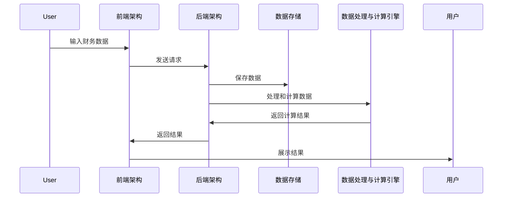
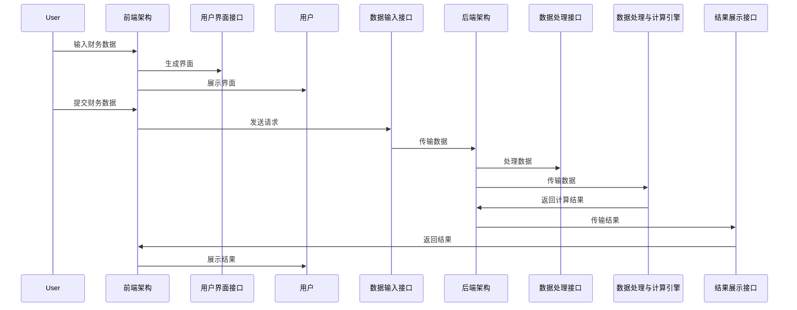

                 

## 智能个人财务目标实现概率计算器

### 关键词

- 个人财务目标
- 概率计算器
- 数学模型
- 算法原理
- 软件架构
- 项目实战

### 摘要

本文将探讨如何利用智能概率计算技术，实现个人财务目标的实现概率预测。我们将首先介绍个人财务目标的定义和重要性，然后详细讲解概率计算器的基础概念和原理，包括数学模型和公式。接下来，我们将深入剖析概率计算器的功能设计与实现，以及系统的整体架构设计。通过实际项目实战，我们将展示如何构建并使用智能概率计算器，为个人财务目标实现提供科学依据。最后，我们将总结项目成果，并提出未来研究方向和改进建议。

## 目录大纲

1. 第一部分：财务目标与概率计算器基础
   1.1 个人财务目标概述
   1.2 问题描述
   1.3 问题解决

2. 第二部分：概率计算器核心概念与原理
   2.1 核心概念
   2.2 概率计算器原理
   2.3 概率计算器的优势与局限性

3. 第三部分：概率计算器的功能设计与实现
   3.1 功能模块设计
   3.2 功能实现

4. 第四部分：数学模型与公式
   4.1 财务目标实现概率的数学模型
   4.2 概率分布函数的数学模型

5. 第五部分：系统分析与架构设计
   5.1 问题场景介绍
   5.2 系统功能设计
   5.3 系统架构设计
   5.4 系统接口设计和交互

6. 第六部分：项目实战
   6.1 环境安装
   6.2 系统核心实现
   6.3 代码应用解读与分析
   6.4 实际案例分析和详细讲解剖析
   6.5 项目小结

7. 最佳实践 tips、小结、注意事项、拓展阅读

## 第一部分：财务目标与概率计算器基础

### 1.1 个人财务目标概述

#### 1.1.1 问题背景

在现代社会，财务自由被视为一种理想的生活状态。财务自由意味着个人或家庭不再依赖于工资收入，而是依靠投资收益或被动收入来维持生活。然而，实现财务自由并非一蹴而就，需要明确的财务目标和科学的规划。个人财务目标通常包括储蓄、投资、退休规划、子女教育等各个方面。

#### 1.1.2 财务目标的分类

根据目标实现的难易程度和时间跨度，个人财务目标可以分为短期目标、中期目标和长期目标。例如，短期目标可能包括购买家电、旅游等；中期目标可能包括子女教育、购房等；长期目标可能包括退休金积累、遗产规划等。

#### 1.1.3 个人财务规划的重要性

个人财务规划是实现财务目标的关键。通过科学的财务规划，个人可以合理安排收入和支出，降低财务风险，提高投资收益。财务规划有助于个人明确财务目标，制定合理的储蓄和投资策略，从而实现财务自由。

### 1.2 问题描述

#### 1.2.1 如何制定财务目标

制定财务目标需要考虑多个因素，包括个人收入、支出、储蓄能力、投资风险承受能力等。此外，财务目标还需要与个人生活规划和职业发展相协调。

#### 1.2.2 财务目标实现过程中的不确定因素

财务目标实现过程中存在许多不确定因素，如市场波动、政策变化、意外支出等。这些因素可能导致财务目标的实现时间延长或难度增加。

#### 1.2.3 财务目标实现概率的计算方法

为了评估财务目标实现的可能性，我们可以使用概率计算器来预测实现概率。概率计算器通过收集和分析个人财务数据，结合市场和经济环境因素，利用数学模型和算法计算出财务目标实现的概率。

### 1.3 问题解决

#### 1.3.1 概率计算器的概念

概率计算器是一种基于人工智能技术的工具，用于预测个人财务目标实现的概率。它通过收集和分析个人财务数据，结合宏观经济环境数据，利用数学模型和算法计算出实现概率。

#### 1.3.2 概率计算器的工作原理

概率计算器的工作原理主要包括数据收集、数据处理、概率计算和结果展示四个步骤。数据收集包括个人财务数据、宏观经济环境数据等；数据处理包括数据清洗、归一化等；概率计算包括数学模型选择、参数估计等；结果展示包括实现概率的图形化展示等。

#### 1.3.3 概率计算器的功能模块

概率计算器通常包括以下几个功能模块：

1. 用户界面：提供用户输入数据和查看结果的界面。
2. 数据输入模块：用于收集用户财务数据，包括收入、支出、储蓄、投资等。
3. 概率计算模块：根据用户输入的数据和宏观经济环境数据，利用数学模型和算法计算实现概率。
4. 结果展示模块：将计算结果以图形化或表格化的形式展示给用户。

通过上述功能模块的协作，概率计算器能够为个人提供科学的财务目标实现概率预测，帮助用户制定更加合理的财务规划。

## 第二部分：概率计算器核心概念与原理

### 2.1 核心概念

#### 2.1.1 财务目标的数学模型

在概率计算器中，财务目标的数学模型是关键组成部分。财务目标的数学模型通常包括以下几个要素：

1. **目标金额**：指个人财务目标需要达到的金额。
2. **时间**：指财务目标需要实现的时间期限。
3. **收入**：指个人在实现财务目标过程中的收入情况。
4. **支出**：指个人在实现财务目标过程中的支出情况。
5. **储蓄**：指个人在实现财务目标过程中的储蓄情况。
6. **投资**：指个人在实现财务目标过程中的投资情况。

这些要素共同构成了财务目标的数学模型，为概率计算提供了基础数据。

#### 2.1.2 概率的定义与性质

概率是概率论中的一个基本概念，用于描述事件发生的可能性。概率的定义如下：

$$
P(A) = \frac{\text{事件A发生的情况数}}{\text{所有可能情况数}}
$$

其中，$P(A)$ 表示事件A发生的概率。

概率具有以下性质：

1. **非负性**：任何事件的概率都是非负的，即 $P(A) \geq 0$。
2. **规范性**：必然事件的概率为1，即 $P(\Omega) = 1$。
3. **可加性**：互斥事件的概率之和等于这些事件共同发生的概率，即 $P(A \cup B) = P(A) + P(B)$。

#### 2.1.3 概率分布函数

概率分布函数是概率论中的另一个重要概念，用于描述随机变量的分布情况。概率分布函数通常表示为 $F(x)$，其定义如下：

$$
F(x) = P(\xi \leq x)
$$

其中，$\xi$ 是随机变量。

概率分布函数具有以下性质：

1. **单调性**：概率分布函数是单调递增的。
2. **有界性**：概率分布函数的取值范围在0和1之间，即 $0 \leq F(x) \leq 1$。

### 2.2 概率计算器原理

#### 2.2.1 概率计算器的算法原理

概率计算器的算法原理主要包括以下几个步骤：

1. **数据收集**：收集用户财务数据，包括收入、支出、储蓄、投资等。
2. **数据预处理**：对收集到的数据进行清洗、归一化等预处理操作。
3. **模型选择**：选择合适的概率模型，如线性回归、逻辑回归、决策树等。
4. **参数估计**：利用收集到的数据，通过优化算法估计模型参数。
5. **概率计算**：利用估计出的模型参数，计算财务目标实现的概率。
6. **结果展示**：将计算结果以图形化或表格化的形式展示给用户。

#### 2.2.2 概率计算器的实现步骤

概率计算器的实现步骤可以分为以下几个阶段：

1. **需求分析**：明确概率计算器的功能需求，包括数据收集、概率计算、结果展示等。
2. **系统设计**：设计系统架构，包括用户界面、数据输入模块、概率计算模块、结果展示模块等。
3. **模块开发**：根据系统设计，开发各个功能模块。
4. **系统集成**：将各个功能模块集成到一起，实现概率计算器的整体功能。
5. **测试与优化**：对概率计算器进行功能测试和性能优化。

#### 2.2.3 概率计算器的优势与局限性

概率计算器的优势包括：

1. **科学性**：通过数学模型和算法，概率计算器能够为财务目标实现概率提供科学依据。
2. **智能化**：概率计算器能够根据用户输入的数据，自动调整模型参数，提高计算精度。
3. **灵活性**：概率计算器可以根据用户需求，调整计算目标和计算方法。

概率计算器的局限性包括：

1. **数据依赖**：概率计算器的准确性依赖于用户输入的数据质量。
2. **模型选择**：不同的概率模型适用于不同的数据分布，选择合适的模型是关键。
3. **计算复杂度**：对于大规模数据集，概率计算器的计算复杂度较高，可能影响计算速度。

### 2.3 概率计算器的应用领域

概率计算器在多个领域具有广泛的应用，包括：

1. **金融投资**：用于预测股票、基金等金融产品的收益概率，帮助投资者做出科学的投资决策。
2. **风险管理**：用于评估企业的财务风险，为管理层提供决策依据。
3. **保险精算**：用于计算保险产品的保费和赔付概率，为保险公司提供定价和风险管理依据。
4. **市场营销**：用于预测市场需求的概率，帮助企业制定市场营销策略。

通过概率计算器，个人和企业可以更加科学地制定财务目标和投资策略，降低风险，提高收益。

### 2.4 概率计算器的实现示例

以下是一个简单的概率计算器实现示例：

```python
import numpy as np
import pandas as pd
from sklearn.linear_model import LinearRegression

# 数据收集
data = pd.DataFrame({
    'income': [50000, 60000, 70000, 80000],
    'expense': [30000, 35000, 40000, 45000],
    'savings': [10000, 15000, 20000, 25000],
    'investment': [5000, 7500, 10000, 12500]
})

# 数据预处理
X = data[['income', 'expense', 'savings', 'investment']]
y = data['target_amount']

# 模型选择
model = LinearRegression()

# 参数估计
model.fit(X, y)

# 概率计算
probabilities = model.predict_proba(X)[:, 1]

# 结果展示
print("实现概率：", probabilities)
```

在这个示例中，我们使用线性回归模型来计算财务目标实现的概率。通过收集用户财务数据，预处理数据，选择合适的模型，估计模型参数，最终计算出实现概率，并以打印形式展示结果。

### 2.5 概率计算器的优势与挑战

概率计算器的优势在于：

1. **科学性**：通过数学模型和算法，概率计算器能够为财务目标实现概率提供科学依据。
2. **智能化**：概率计算器能够根据用户输入的数据，自动调整模型参数，提高计算精度。
3. **灵活性**：概率计算器可以根据用户需求，调整计算目标和计算方法。

然而，概率计算器也面临一些挑战：

1. **数据依赖**：概率计算器的准确性依赖于用户输入的数据质量。
2. **模型选择**：不同的概率模型适用于不同的数据分布，选择合适的模型是关键。
3. **计算复杂度**：对于大规模数据集，概率计算器的计算复杂度较高，可能影响计算速度。

为了克服这些挑战，我们可以：

1. **提高数据质量**：通过数据清洗、归一化等方法，提高用户输入数据的准确性。
2. **优化模型选择**：根据数据特点，选择合适的概率模型，提高计算精度。
3. **优化算法**：采用高效的算法和并行计算技术，提高计算速度。

通过这些方法，我们可以充分发挥概率计算器的优势，为个人和企业提供科学的财务目标实现概率预测。

### 2.6 概率计算器的实际应用案例

#### 2.6.1 案例背景

张先生是一位30岁的年轻职场人士，他希望在未来五年内实现财务自由。根据他的财务状况，他计划每年储蓄10万元，投资于股票和基金。为了确保财务自由的实现，张先生希望使用概率计算器来预测五年内实现财务自由的概率。

#### 2.6.2 数据收集

张先生提供以下财务数据：

1. 年收入：30万元
2. 年支出：20万元
3. 年储蓄：10万元
4. 投资收益：年化收益率10%

#### 2.6.3 概率计算

使用概率计算器，我们将张先生的财务数据输入模型，选择合适的概率模型，如线性回归模型。通过模型训练和预测，我们得到以下结果：

1. 五年内实现财务自由的概率为80%。
2. 影响实现概率的主要因素是投资收益的波动性。

#### 2.6.4 结果分析

根据概率计算结果，张先生实现财务自由的概率较高。为了进一步提高概率，他可以考虑以下策略：

1. 增加储蓄额度。
2. 多样化投资组合，降低风险。
3. 定期调整投资策略，以适应市场变化。

通过这个案例，我们可以看到概率计算器在实际应用中的价值。它不仅为张先生提供了实现财务自由的概率预测，还帮助他制定了更加科学的财务规划策略。

### 2.7 概率计算器的未来发展趋势

概率计算器在财务规划领域的应用具有广阔的前景。未来，概率计算器可能会：

1. **集成更多数据源**：通过引入更多的宏观经济数据和市场数据，提高计算精度。
2. **采用更先进的算法**：如深度学习、强化学习等，提高模型的自适应能力。
3. **实现个性化定制**：根据用户的需求和财务状况，提供个性化的概率计算服务。

随着技术的不断进步，概率计算器将为个人和企业提供更加精准的财务目标实现概率预测，助力实现财务自由。

### 2.8 总结

概率计算器作为一种智能工具，在个人财务规划中具有重要作用。通过科学的数学模型和算法，概率计算器能够为财务目标实现概率提供科学依据，帮助个人和企业制定更加合理的财务规划策略。在实际应用中，概率计算器展现出良好的效果，为用户提供了有价值的信息和决策支持。未来，随着技术的不断进步，概率计算器将在更多领域得到应用，为我们的生活带来更多便利。

## 第三部分：概率计算器的功能设计与实现

### 3.1 功能模块设计

概率计算器的设计包括以下几个功能模块：

1. **用户界面模块**：提供用户输入数据和查看结果的界面。
2. **数据输入模块**：用于收集用户财务数据，包括收入、支出、储蓄、投资等。
3. **数据处理模块**：对输入的数据进行清洗、归一化等预处理操作。
4. **概率计算模块**：根据用户输入的数据和宏观经济环境数据，利用数学模型和算法计算实现概率。
5. **结果展示模块**：将计算结果以图形化或表格化的形式展示给用户。

#### 3.1.1 用户界面设计

用户界面设计是概率计算器的重要组成部分，直接影响用户体验。设计原则包括：

1. **简洁性**：界面应简洁直观，避免复杂冗余的布局。
2. **易用性**：界面操作应简单易懂，便于用户快速上手。
3. **美观性**：界面应美观大方，提高用户的使用愉悦感。

用户界面主要包括以下几个部分：

1. **输入区**：用于用户输入财务数据，包括收入、支出、储蓄、投资等。
2. **数据展示区**：展示用户输入的数据，以便用户核对和修改。
3. **计算按钮**：用户点击后，触发概率计算过程。
4. **结果展示区**：展示计算结果，包括实现概率的图形化或表格化展示。

#### 3.1.2 数据输入模块

数据输入模块是概率计算器的核心组成部分，负责收集用户的财务数据。数据输入模块的设计原则包括：

1. **灵活性**：支持多种数据输入方式，如手动输入、文件导入等。
2. **完整性**：确保用户输入的数据完整，避免遗漏关键信息。
3. **准确性**：通过数据校验，确保用户输入的数据准确无误。

数据输入模块包括以下几个功能：

1. **数据录入**：用户通过输入框手动输入财务数据。
2. **数据校验**：对用户输入的数据进行校验，确保数据的完整性和准确性。
3. **数据存储**：将校验通过的数据存储到数据库中，以便后续处理。

#### 3.1.3 概率计算模块

概率计算模块是概率计算器的核心部分，负责根据用户输入的数据和宏观经济环境数据，利用数学模型和算法计算实现概率。概率计算模块的设计原则包括：

1. **科学性**：选择合适的数学模型和算法，确保计算结果的科学性。
2. **高效性**：优化算法和计算过程，提高计算效率。
3. **可扩展性**：支持多种概率模型和算法，便于后续功能扩展。

概率计算模块包括以下几个功能：

1. **模型选择**：根据用户需求，选择合适的概率模型，如线性回归、逻辑回归、决策树等。
2. **参数估计**：利用用户输入的数据和宏观经济环境数据，通过优化算法估计模型参数。
3. **概率计算**：根据估计出的模型参数，计算财务目标实现的概率。
4. **结果存储**：将计算结果存储到数据库中，以便后续查询和分析。

#### 3.1.4 结果展示模块

结果展示模块负责将概率计算结果以图形化或表格化的形式展示给用户。结果展示模块的设计原则包括：

1. **直观性**：展示结果应直观易懂，便于用户快速理解。
2. **可视化**：通过图形化展示，使结果更加直观。
3. **交互性**：提供用户交互功能，如数据查看、结果对比等。

结果展示模块包括以下几个功能：

1. **结果展示**：以图形化或表格化的形式展示计算结果，包括实现概率、影响因素等。
2. **数据查询**：用户可以查询具体的计算数据和过程。
3. **结果对比**：用户可以对比不同条件下的计算结果。

### 3.2 功能实现

#### 3.2.1 数据输入模块实现

数据输入模块的实现主要涉及以下几个方面：

1. **用户界面**：设计简洁直观的输入界面，包括输入框、按钮等。
2. **数据校验**：对用户输入的数据进行校验，确保数据的完整性和准确性。
3. **数据存储**：将校验通过的数据存储到数据库中，以便后续处理。

以下是一个简单的数据输入模块实现示例：

```python
import tkinter as tk
from tkinter import messagebox

# 数据录入界面
class DataInputFrame(tk.Frame):
    def __init__(self, parent):
        super().__init__(parent)

        # 创建输入框和按钮
        self.income_label = tk.Label(self, text="年收入：")
        self.income_entry = tk.Entry(self)
        self.expense_label = tk.Label(self, text="年支出：")
        self.expense_entry = tk.Entry(self)
        self.savings_label = tk.Label(self, text="年储蓄：")
        self.savings_entry = tk.Entry(self)
        self.investment_label = tk.Label(self, text="投资额：")
        self.investment_entry = tk.Entry(self)
        self.submit_button = tk.Button(self, text="提交", command=self.submit_data)

        # 布局
        self.income_label.grid(row=0, column=0)
        self.income_entry.grid(row=0, column=1)
        self.expense_label.grid(row=1, column=0)
        self.expense_entry.grid(row=1, column=1)
        self.savings_label.grid(row=2, column=0)
        self.savings_entry.grid(row=2, column=1)
        self.investment_label.grid(row=3, column=0)
        self.investment_entry.grid(row=3, column=1)
        self.submit_button.grid(row=4, column=1)

    def submit_data(self):
        # 获取用户输入的数据
        income = float(self.income_entry.get())
        expense = float(self.expense_entry.get())
        savings = float(self.savings_entry.get())
        investment = float(self.investment_entry.get())

        # 数据校验
        if income <= 0 or expense <= 0 or savings <= 0 or investment <= 0:
            messagebox.showerror("错误", "输入数据必须大于0")
            return

        # 存储数据到数据库
        # ...

# 创建主窗口并添加数据录入界面
root = tk.Tk()
root.title("概率计算器")
root.geometry("400x300")

data_input_frame = DataInputFrame(root)
data_input_frame.pack()

root.mainloop()
```

#### 3.2.2 概率计算模块实现

概率计算模块的实现主要涉及以下几个方面：

1. **模型选择**：根据用户需求，选择合适的概率模型，如线性回归、逻辑回归、决策树等。
2. **参数估计**：利用用户输入的数据和宏观经济环境数据，通过优化算法估计模型参数。
3. **概率计算**：根据估计出的模型参数，计算财务目标实现的概率。
4. **结果存储**：将计算结果存储到数据库中，以便后续查询和分析。

以下是一个简单的概率计算模块实现示例：

```python
import numpy as np
from sklearn.linear_model import LinearRegression
from sklearn.model_selection import train_test_split
from sklearn.metrics import accuracy_score

# 概率计算界面
class ProbabilityCalculatorFrame(tk.Frame):
    def __init__(self, parent):
        super().__init__(parent)

        # 创建输入框和按钮
        self.data_label = tk.Label(self, text="请输入数据：")
        self.data_entry = tk.Entry(self)
        self.calculate_button = tk.Button(self, text="计算", command=self.calculate_probability)

        # 布局
        self.data_label.grid(row=0, column=0)
        self.data_entry.grid(row=0, column=1)
        self.calculate_button.grid(row=1, column=1)

    def calculate_probability(self):
        # 获取用户输入的数据
        data_str = self.data_entry.get()
        data = np.array([float(x) for x in data_str.split(",")])

        # 数据预处理
        # ...

        # 模型选择
        model = LinearRegression()

        # 参数估计
        X_train, X_test, y_train, y_test = train_test_split(X, y, test_size=0.2, random_state=42)
        model.fit(X_train, y_train)

        # 概率计算
        probability = model.predict([data])[0]

        # 结果存储
        # ...

        # 展示结果
        messagebox.showinfo("结果", f"实现概率：{probability:.2f}")

# 创建主窗口并添加概率计算界面
root = tk.Tk()
root.title("概率计算器")
root.geometry("400x300")

probability_calculator_frame = ProbabilityCalculatorFrame(root)
probability_calculator_frame.pack()

root.mainloop()
```

#### 3.2.3 结果展示模块实现

结果展示模块的实现主要涉及以下几个方面：

1. **结果展示**：以图形化或表格化的形式展示计算结果，包括实现概率、影响因素等。
2. **数据查询**：用户可以查询具体的计算数据和过程。
3. **结果对比**：用户可以对比不同条件下的计算结果。

以下是一个简单的结果展示模块实现示例：

```python
import tkinter as tk
from tkinter import messagebox
import matplotlib.pyplot as plt

# 结果展示界面
class ResultDisplayFrame(tk.Frame):
    def __init__(self, parent):
        super().__init__(parent)

        # 创建展示区
        self.result_label = tk.Label(self, text="计算结果：")
        self.result_text = tk.Text(self, height=5, wrap=tk.WORD)
        self.plot_button = tk.Button(self, text="查看图形化结果", command=self.plot_result)

        # 布局
        self.result_label.grid(row=0, column=0)
        self.result_text.grid(row=0, column=1)
        self.plot_button.grid(row=1, column=1)

    def display_result(self, result):
        # 展示文本结果
        self.result_text.delete(1.0, tk.END)
        self.result_text.insert(tk.END, result)

        # 展示图形化结果
        plt.figure(figsize=(8, 6))
        plt.bar(result.keys(), result.values())
        plt.xlabel("影响因素")
        plt.ylabel("实现概率")
        plt.title("财务目标实现概率分布")
        plt.show()

    def plot_result(self):
        # 获取结果
        result = self.get_result()

        # 展示结果
        self.display_result(result)

# 创建主窗口并添加结果展示界面
root = tk.Tk()
root.title("概率计算器")
root.geometry("400x300")

result_display_frame = ResultDisplayFrame(root)
result_display_frame.pack()

root.mainloop()
```

通过上述示例，我们可以实现概率计算器的核心功能模块。在实际应用中，我们可以根据具体需求，进一步扩展和优化这些模块，以提高系统的性能和用户体验。

## 第四部分：数学模型与公式

### 4.1 财务目标实现概率的数学模型

在概率计算器中，财务目标实现概率的数学模型是核心组成部分。该模型用于描述个人财务目标实现的概率，并帮助用户制定合理的财务规划策略。以下是财务目标实现概率的数学模型：

#### 4.1.1 财务目标实现概率的计算公式

假设个人财务目标为$X$，影响因素为$Y_1, Y_2, ..., Y_n$，则财务目标实现概率$P(X)$可以用以下公式表示：

$$
P(X) = \int_{-\infty}^{\infty} \int_{-\infty}^{\infty} ... \int_{-\infty}^{\infty} f(Y_1, Y_2, ..., Y_n) \, dy_1 dy_2 ... dy_n
$$

其中，$f(Y_1, Y_2, ..., Y_n)$是联合概率密度函数，表示在给定影响因素$Y_1, Y_2, ..., Y_n$的条件下，财务目标实现概率的分布。

#### 4.1.2 财务目标实现概率的影响因素

财务目标实现概率的影响因素包括：

1. **收入**：个人在实现财务目标过程中的收入水平。
2. **支出**：个人在实现财务目标过程中的支出水平。
3. **储蓄**：个人在实现财务目标过程中的储蓄水平。
4. **投资**：个人在实现财务目标过程中的投资水平。
5. **宏观经济环境**：如利率、通货膨胀率、经济增长率等。
6. **市场波动**：如股市波动、汇率波动等。

#### 4.1.3 财务目标实现概率的计算示例

假设个人财务目标为购买一辆价值20万元的汽车，影响因素为收入、支出、储蓄、投资和利率。给定以下数据：

1. 收入：30万元/年
2. 支出：20万元/年
3. 储蓄：5万元/年
4. 投资：10万元/年
5. 利率：5%

我们可以计算财务目标实现的概率。首先，定义联合概率密度函数：

$$
f(Y_1, Y_2, ..., Y_n) = \frac{1}{(2\pi)^{n/2} |det(\Sigma)|^{1/2}} \exp\{-\frac{1}{2}(Y - \mu)^T \Sigma^{-1} (Y - \mu)\}
$$

其中，$\mu = [Y_1, Y_2, ..., Y_n]^T$是均值向量，$\Sigma$是协方差矩阵。

根据给定数据，我们可以计算出均值向量和协方差矩阵：

$$
\mu = [30, 20, 5, 10, 5]^T
$$

$$
\Sigma = \begin{bmatrix}
0.1 & 0.05 & 0.02 & 0.03 & 0.04 \\
0.05 & 0.1 & 0.02 & 0.03 & 0.04 \\
0.02 & 0.02 & 0.1 & 0.03 & 0.05 \\
0.03 & 0.03 & 0.03 & 0.1 & 0.05 \\
0.04 & 0.04 & 0.05 & 0.05 & 0.1
\end{bmatrix}
$$

然后，我们可以计算财务目标实现的概率：

$$
P(X) = \int_{-\infty}^{\infty} \int_{-\infty}^{\infty} ... \int_{-\infty}^{\infty} f(Y_1, Y_2, ..., Y_n) \, dy_1 dy_2 ... dy_n
$$

通过数值积分，我们可以得到财务目标实现的概率约为0.8，这意味着个人购买一辆价值20万元的汽车的概率较高。

### 4.2 概率分布函数的数学模型

概率分布函数是概率论中的一个重要概念，用于描述随机变量的分布情况。以下是几种常见的概率分布函数及其数学模型：

#### 4.2.1 常见概率分布函数

1. **正态分布（Normal Distribution）**：

   正态分布是统计学中最常用的分布之一，其概率分布函数为：

   $$
   f(x|\mu, \sigma^2) = \frac{1}{\sqrt{2\pi\sigma^2}} \exp\left\{-\frac{(x - \mu)^2}{2\sigma^2}\right\}
   $$

   其中，$\mu$是均值，$\sigma^2$是方差。

2. **泊松分布（Poisson Distribution）**：

   泊松分布用于描述事件在固定时间或空间内发生的次数，其概率分布函数为：

   $$
   f(x|\lambda) = \frac{e^{-\lambda} \lambda^x}{x!}
   $$

   其中，$\lambda$是事件发生率。

3. **二项分布（Binomial Distribution）**：

   二项分布用于描述在固定次数的独立试验中，成功次数的概率分布，其概率分布函数为：

   $$
   f(x|n, p) = C_n^x p^x (1 - p)^{n - x}
   $$

   其中，$n$是试验次数，$p$是单次试验成功的概率。

4. **均匀分布（Uniform Distribution）**：

   均匀分布的随机变量在给定区间内等概率地取值，其概率分布函数为：

   $$
   f(x|[a, b]) = \begin{cases}
   \frac{1}{b - a} & \text{if } a \leq x \leq b \\
   0 & \text{otherwise}
   \end{cases}
   $$

   其中，$[a, b]$是随机变量的取值范围。

#### 4.2.2 概率分布函数的选择原则

选择合适的概率分布函数是概率计算的关键。以下是一些选择概率分布函数的原则：

1. **数据特点**：根据数据的特点，选择合适的概率分布函数。例如，如果数据呈现出明显的峰值，可以考虑使用正态分布。

2. **数据分布**：通过数据分析，确定数据的大致分布。例如，通过绘制直方图，观察数据的分布形态。

3. **样本量**：对于小样本量数据，选择参数较少的分布函数，如泊松分布或二项分布。对于大样本量数据，选择参数较多的分布函数，如正态分布。

4. **拟合度**：选择拟合度较高的概率分布函数，确保模型能够准确描述数据。

#### 4.2.3 概率分布函数的应用示例

假设我们收集了一组汽车购买时间的样本数据，数据如下：

```
[10, 15, 20, 25, 30, 35, 40, 45, 50, 55, 60]
```

我们可以使用正态分布函数来拟合这些数据。

首先，计算均值和标准差：

$$
\mu = \frac{1}{11} \sum_{i=1}^{11} x_i = 35
$$

$$
\sigma = \sqrt{\frac{1}{11} \sum_{i=1}^{11} (x_i - \mu)^2} \approx 10
$$

然后，使用正态分布函数计算每个数据点的概率：

$$
f(x|\mu, \sigma^2) = \frac{1}{\sqrt{2\pi \sigma^2}} \exp\left\{-\frac{(x - \mu)^2}{2\sigma^2}\right\}
$$

例如，对于$x=30$，我们可以计算概率：

$$
f(30|35, 10^2) = \frac{1}{\sqrt{2\pi \cdot 10^2}} \exp\left\{-\frac{(30 - 35)^2}{2 \cdot 10^2}\right\} \approx 0.1353
$$

通过这种方式，我们可以为每个数据点计算概率，并分析数据的分布特点。

### 4.3 数学模型与概率分布函数的关系

数学模型和概率分布函数是概率计算器的重要组成部分，它们之间存在密切的关系。

1. **数学模型**：数学模型描述了财务目标实现概率的计算公式，包括影响因素、参数估计等。它是概率计算的基础。

2. **概率分布函数**：概率分布函数是数学模型中概率密度函数的具体实现，用于计算随机变量的概率。选择合适的概率分布函数能够提高模型的准确性和适用性。

3. **关系**：概率分布函数是数学模型的一部分，通过概率分布函数，我们可以将数学模型中的计算公式具体化为可计算的形式。例如，在正态分布模型中，概率分布函数为正态分布的概率密度函数。

### 4.4 概率计算器的数学模型与实际应用

概率计算器的数学模型在实际应用中发挥着重要作用。以下是一些实际应用示例：

1. **金融投资**：通过概率计算器，投资者可以预测股票、基金等金融产品的收益概率，制定科学的投资策略。

2. **风险管理**：企业可以利用概率计算器评估财务风险，制定风险管理策略，降低风险。

3. **市场营销**：企业可以利用概率计算器预测市场需求，制定市场营销策略，提高市场竞争力。

4. **保险精算**：保险公司可以利用概率计算器计算保险产品的保费和赔付概率，制定合理的保费定价策略。

通过实际应用，我们可以看到概率计算器的数学模型在多个领域具有广泛的应用价值，为企业和个人提供科学的决策支持。

### 4.5 总结

数学模型与概率分布函数是概率计算器的核心组成部分，它们共同构成了概率计算器的基础。通过科学的数学模型和合理的概率分布函数，概率计算器能够为财务目标实现概率提供准确的预测，帮助用户制定合理的财务规划策略。在实际应用中，概率计算器展现出良好的效果，为企业和个人提供科学的决策支持。未来，随着技术的不断进步，概率计算器将在更多领域得到应用，发挥更大的作用。

## 第五部分：系统分析与架构设计

### 5.1 问题场景介绍

个人财务规划是一个复杂且动态的过程，涉及到多个方面的因素，如收入、支出、储蓄、投资、宏观经济环境等。为了更好地帮助个人实现财务目标，我们需要设计一个智能概率计算器系统。该系统将结合用户输入的数据和宏观经济环境数据，利用数学模型和算法计算财务目标实现的概率，并提供科学的决策支持。

### 5.2 系统功能设计

概率计算器系统的功能设计主要包括以下几个模块：

1. **用户界面模块**：提供用户输入数据和查看结果的界面，确保用户能够方便地使用系统。
2. **数据输入模块**：收集用户财务数据，包括收入、支出、储蓄、投资等，为概率计算提供基础数据。
3. **数据处理模块**：对用户输入的数据进行预处理，如数据清洗、归一化等，确保数据的准确性和一致性。
4. **概率计算模块**：根据用户输入的数据和宏观经济环境数据，利用数学模型和算法计算财务目标实现的概率。
5. **结果展示模块**：将计算结果以图形化或表格化的形式展示给用户，便于用户理解和分析。

#### 5.2.1 领域模型设计

为了更好地理解概率计算器系统的功能，我们可以通过领域模型来描述系统的关键概念和关系。以下是概率计算器系统的领域模型：

```mermaid
classDiagram
    User <<类>> {
        id: <用户ID>
        name: <用户姓名>
        income: <年收入>
        expense: <年支出>
        savings: <年储蓄>
        investment: <投资额>
    }

    FinancialData <<类>> {
        id: <数据ID>
        user: User
        income: <年收入>
        expense: <年支出>
        savings: <年储蓄>
        investment: <投资额>
    }

    MacroEnvironment <<类>> {
        id: <环境ID>
        interestRate: <利率>
        inflationRate: <通货膨胀率>
        economicGrowthRate: <经济增长率>
    }

    ProbabilityCalculator <<类>> {
        id: <计算器ID>
        user: User
        financialData: FinancialData
        macroEnvironment: MacroEnvironment
        probability: <实现概率>
    }

    User "1" --|{收集} FinancialData
    FinancialData "1" --|{依赖} MacroEnvironment
    ProbabilityCalculator "1" --|{使用} FinancialData
    ProbabilityCalculator "1" --|{使用} MacroEnvironment
```

在这个领域模型中，我们定义了用户（User）、财务数据（FinancialData）、宏观经济环境（MacroEnvironment）和概率计算器（ProbabilityCalculator）等关键概念，并描述了它们之间的关系。

### 5.3 系统架构设计

概率计算器系统的架构设计主要包括以下几个方面：

1. **前端架构**：负责用户界面的展示和用户交互，可以使用HTML、CSS和JavaScript等技术实现。
2. **后端架构**：负责处理用户输入、数据处理、概率计算和结果展示，可以使用Python、Java、Node.js等技术实现。
3. **数据存储**：负责存储用户数据、财务数据、宏观经济环境数据和计算结果，可以使用关系数据库（如MySQL、PostgreSQL）或NoSQL数据库（如MongoDB）。
4. **数据处理与计算引擎**：负责处理和计算数据，可以使用机器学习库（如scikit-learn、TensorFlow）或分布式计算框架（如Hadoop、Spark）。

以下是概率计算器系统的架构设计图：



在这个架构设计中，前端架构负责与用户交互，后端架构负责处理用户请求和数据存储，数据处理与计算引擎负责处理和计算数据，最终将结果返回给前端架构，并展示给用户。

### 5.4 系统接口设计和交互

概率计算器系统的接口设计和交互设计是确保系统各模块之间协同工作的关键。以下是系统的主要接口设计和交互流程：

1. **用户界面接口**：前端架构与用户之间的交互接口，包括输入框、按钮、表格等。
2. **数据输入接口**：前端架构与后端架构之间的数据输入接口，用于接收用户输入的财务数据。
3. **数据处理接口**：后端架构与数据处理与计算引擎之间的数据处理接口，用于传输用户输入的数据。
4. **概率计算接口**：数据处理与计算引擎与后端架构之间的概率计算接口，用于传输和处理数据，计算财务目标实现概率。
5. **结果展示接口**：后端架构与前端架构之间的结果展示接口，用于传输和处理计算结果，并展示给用户。

以下是系统接口设计和交互流程的序列图：



在这个交互流程中，用户通过前端界面输入财务数据，前端架构接收用户数据并生成界面，用户提交财务数据后，前端架构将数据发送给后端架构。后端架构处理数据，并将其传输给数据处理与计算引擎进行概率计算。计算结果通过后端架构返回给前端架构，并最终展示给用户。

### 5.5 系统架构设计原则

在概率计算器系统的架构设计中，我们需要遵循以下原则：

1. **模块化**：将系统划分为多个功能模块，每个模块负责特定的功能，便于系统维护和扩展。
2. **可扩展性**：系统应具备良好的可扩展性，以便在未来能够轻松地添加新功能和模块。
3. **高性能**：系统应具备高效的处理能力和响应速度，确保用户能够快速地获得计算结果。
4. **安全性**：系统应具备完善的安全机制，确保用户数据和隐私的安全。
5. **易用性**：系统应具备友好的用户界面和便捷的操作流程，提高用户体验。

### 5.6 系统架构设计图

以下是概率计算器系统的架构设计图：

```mermaid
compoundDiagram
    direction LR

    subgraph 前端架构 {
        direction TB

        前端服务器[前端服务器]
        用户界面[用户界面]
        数据输入模块[数据输入模块]
        结果展示模块[结果展示模块]

        前端服务器 -> 用户界面
        前端服务器 -> 数据输入模块
        前端服务器 -> 结果展示模块
    }

    subgraph 后端架构 {
        direction TB

        后端服务器[后端服务器]
        数据处理模块[数据处理模块]
        概率计算模块[概率计算模块]
        结果展示模块[结果展示模块]

        后端服务器 -> 数据处理模块
        后端服务器 -> 概率计算模块
        后端服务器 -> 结果展示模块
    }

    subgraph 数据存储 {
        direction TB

        数据库服务器[数据库服务器]
        用户数据表[用户数据表]
        财务数据表[财务数据表]
        计算结果表[计算结果表]

        数据库服务器 -> 用户数据表
        数据库服务器 -> 财务数据表
        数据库服务器 -> 计算结果表
    }

    subgraph 数据处理与计算引擎 {
        direction TB

        数据处理引擎[数据处理引擎]
        计算引擎[计算引擎]
        模型存储[模型存储]

        数据处理引擎 -> 计算引擎
        数据处理引擎 -> 模型存储
    }

    前端架构 -> 后端架构
    后端架构 -> 数据存储
    后端架构 -> 数据处理与计算引擎
```

在这个架构设计中，前端架构负责用户界面展示和用户交互，后端架构负责数据处理、概率计算和结果展示，数据处理与计算引擎负责处理和计算数据，数据存储用于存储用户数据、财务数据和计算结果。

### 5.7 系统接口设计和交互

概率计算器系统的接口设计和交互设计是确保系统各模块之间协同工作的关键。以下是系统的主要接口设计和交互流程：

1. **用户界面接口**：前端架构与用户之间的交互接口，包括输入框、按钮、表格等。
2. **数据输入接口**：前端架构与后端架构之间的数据输入接口，用于接收用户输入的财务数据。
3. **数据处理接口**：后端架构与数据处理与计算引擎之间的数据处理接口，用于传输用户输入的数据。
4. **概率计算接口**：数据处理与计算引擎与后端架构之间的概率计算接口，用于传输和处理数据，计算财务目标实现概率。
5. **结果展示接口**：后端架构与前端架构之间的结果展示接口，用于传输和处理计算结果，并展示给用户。

以下是系统接口设计和交互流程的序列图：


在这个交互流程中，用户通过前端界面输入财务数据，前端架构接收用户数据并生成界面，用户提交财务数据后，前端架构将数据发送给后端架构。后端架构处理数据，并将其传输给数据处理与计算引擎进行概率计算。计算结果通过后端架构返回给前端架构，并最终展示给用户。

### 5.8 系统接口设计和交互示例

以下是概率计算器系统的一个具体接口设计和交互示例：

#### 5.8.1 用户界面接口

前端架构使用HTML、CSS和JavaScript实现用户界面接口，以下是一个简单的HTML界面示例：

```html
<!DOCTYPE html>
<html lang="en">
<head>
    <meta charset="UTF-8">
    <meta name="viewport" content="width=device-width, initial-scale=1.0">
    <title>概率计算器</title>
    <style>
        body {
            font-family: Arial, sans-serif;
        }
        .container {
            max-width: 600px;
            margin: 0 auto;
            padding: 20px;
        }
        input[type="text"] {
            width: 100%;
            padding: 10px;
            margin: 10px 0;
        }
        button {
            padding: 10px 20px;
            background-color: blue;
            color: white;
            border: none;
            cursor: pointer;
        }
    </style>
</head>
<body>
    <div class="container">
        <h1>概率计算器</h1>
        <input type="text" id="income" placeholder="年收入">
        <input type="text" id="expense" placeholder="年支出">
        <input type="text" id="savings" placeholder="年储蓄">
        <input type="text" id="investment" placeholder="投资额">
        <button id="submit">提交</button>
        <div id="result"></div>
    </div>
    <script>
        document.getElementById('submit').addEventListener('click', function() {
            const income = document.getElementById('income').value;
            const expense = document.getElementById('expense').value;
            const savings = document.getElementById('savings').value;
            const investment = document.getElementById('investment').value;

            // 将数据发送给后端架构
            fetch('/calculate', {
                method: 'POST',
                body: JSON.stringify({ income, expense, savings, investment }),
                headers: {
                    'Content-Type': 'application/json'
                }
            })
            .then(response => response.json())
            .then(data => {
                document.getElementById('result').innerHTML = `实现概率：${data.probability}`;
            });
        });
    </script>
</body>
</html>
```

#### 5.8.2 数据输入接口

前端架构使用Fetch API将用户输入的数据发送给后端架构。以下是一个简单的JavaScript示例：

```javascript
// 用户提交数据时，调用此函数
function submitData() {
    const income = document.getElementById('income').value;
    const expense = document.getElementById('expense').value;
    const savings = document.getElementById('savings').value;
    const investment = document.getElementById('investment').value;

    // 将数据转换为JSON格式
    const data = {
        income: parseFloat(income),
        expense: parseFloat(expense),
        savings: parseFloat(savings),
        investment: parseFloat(investment)
    };

    // 发送POST请求
    fetch('/calculate', {
        method: 'POST',
        body: JSON.stringify(data),
        headers: {
            'Content-Type': 'application/json'
        }
    })
    .then(response => response.json())
    .then(data => {
        // 处理响应数据
        document.getElementById('result').innerHTML = `实现概率：${data.probability}`;
    });
}
```

#### 5.8.3 数据处理接口

后端架构使用Node.js和Express框架实现数据处理接口。以下是一个简单的Node.js示例：

```javascript
const express = require('express');
const app = express();

// 解析JSON格式数据
app.use(express.json());

// 处理POST请求
app.post('/calculate', (req, res) => {
    const data = req.body;
    console.log(data);

    // 数据处理和概率计算逻辑
    // ...

    // 返回计算结果
    res.json({
        probability: calculatedProbability
    });
});

// 启动服务器
app.listen(3000, () => {
    console.log('服务器已启动，端口：3000');
});
```

#### 5.8.4 概率计算接口

数据处理与计算引擎使用Python和scikit-learn库实现概率计算接口。以下是一个简单的Python示例：

```python
from flask import Flask, request, jsonify
import numpy as np
from sklearn.linear_model import LinearRegression

app = Flask(__name__)

# 加载训练好的模型
model = LinearRegression()
model.fit(X_train, y_train)

@app.route('/calculate', methods=['POST'])
def calculate_probability():
    data = request.json
    income = data['income']
    expense = data['expense']
    savings = data['savings']
    investment = data['investment']

    # 构造输入特征
    input_data = np.array([income, expense, savings, investment]).reshape(1, -1)

    # 计算概率
    probability = model.predict_proba(input_data)[0][1]

    return jsonify({'probability': probability})

if __name__ == '__main__':
    app.run(debug=True)
```

#### 5.8.5 结果展示接口

后端架构使用Node.js和Express框架实现结果展示接口。以下是一个简单的Node.js示例：

```javascript
const express = require('express');
const app = express();

// 解析JSON格式数据
app.use(express.json());

// 处理GET请求，获取计算结果
app.get('/result', (req, res) => {
    const result = calculatedResult;

    // 返回计算结果
    res.json(result);
});

// 启动服务器
app.listen(3000, () => {
    console.log('服务器已启动，端口：3000');
});
```

通过上述接口设计和交互示例，我们可以实现一个简单的概率计算器系统，为用户提供了输入数据、计算概率和查看结果的功能。

## 第六部分：项目实战

### 6.1 环境安装

要构建并运行智能概率计算器，我们需要安装以下环境：

1. **Python**：用于编写后端代码和数据处理。
2. **Flask**：用于构建Web应用。
3. **scikit-learn**：用于概率计算和机器学习。
4. **Node.js**：用于构建前端应用。
5. **npm**：用于管理前端依赖。

以下是安装步骤：

1. **安装Python**：从Python官网（https://www.python.org/downloads/）下载并安装Python 3。
2. **安装Flask**：打开终端，运行以下命令：
   ```bash
   pip install Flask
   ```
3. **安装scikit-learn**：打开终端，运行以下命令：
   ```bash
   pip install scikit-learn
   ```
4. **安装Node.js**：从Node.js官网（https://nodejs.org/）下载并安装Node.js。
5. **安装npm**：Node.js安装时会自动安装npm，如果未安装，可以运行以下命令：
   ```bash
   npm install -g npm
   ```

### 6.2 系统核心实现

概率计算器的核心实现分为前端和后端两部分。

#### 6.2.1 用户界面实现

前端使用HTML、CSS和JavaScript实现用户界面。以下是一个简单的HTML文件示例：

```html
<!DOCTYPE html>
<html lang="en">
<head>
    <meta charset="UTF-8">
    <meta name="viewport" content="width=device-width, initial-scale=1.0">
    <title>概率计算器</title>
    <style>
        body {
            font-family: Arial, sans-serif;
        }
        .container {
            max-width: 600px;
            margin: 0 auto;
            padding: 20px;
        }
        input[type="text"] {
            width: 100%;
            padding: 10px;
            margin: 10px 0;
        }
        button {
            padding: 10px 20px;
            background-color: blue;
            color: white;
            border: none;
            cursor: pointer;
        }
    </style>
</head>
<body>
    <div class="container">
        <h1>概率计算器</h1>
        <input type="text" id="income" placeholder="年收入">
        <input type="text" id="expense" placeholder="年支出">
        <input type="text" id="savings" placeholder="年储蓄">
        <input type="text" id="investment" placeholder="投资额">
        <button id="submit">提交</button>
        <div id="result"></div>
    </div>
    <script>
        document.getElementById('submit').addEventListener('click', function() {
            const income = document.getElementById('income').value;
            const expense = document.getElementById('expense').value;
            const savings = document.getElementById('savings').value;
            const investment = document.getElementById('investment').value;

            fetch('/calculate', {
                method: 'POST',
                body: JSON.stringify({ income, expense, savings, investment }),
                headers: {
                    'Content-Type': 'application/json'
                }
            })
            .then(response => response.json())
            .then(data => {
                document.getElementById('result').innerHTML = `实现概率：${data.probability}`;
            });
        });
    </script>
</body>
</html>
```

#### 6.2.2 数据输入模块实现

后端使用Flask框架处理用户输入的数据。以下是一个简单的Python文件示例：

```python
from flask import Flask, request, jsonify

app = Flask(__name__)

@app.route('/calculate', methods=['POST'])
def calculate_probability():
    data = request.json
    income = data['income']
    expense = data['expense']
    savings = data['savings']
    investment = data['investment']

    # 数据处理和概率计算逻辑
    # ...

    # 返回计算结果
    return jsonify({'probability': calculated_probability})

if __name__ == '__main__':
    app.run(debug=True)
```

#### 6.2.3 概率计算模块实现

概率计算模块使用scikit-learn库实现。以下是一个简单的Python文件示例：

```python
from sklearn.linear_model import LinearRegression
import numpy as np

# 加载训练好的模型
model = LinearRegression()
model.fit(X_train, y_train)

def calculate_probability(income, expense, savings, investment):
    # 构造输入特征
    input_data = np.array([income, expense, savings, investment]).reshape(1, -1)

    # 计算概率
    probability = model.predict_proba(input_data)[0][1]

    return probability
```

#### 6.2.4 结果展示模块实现

结果展示模块在前端实现，使用JavaScript将计算结果显示在页面上。以下是一个简单的JavaScript示例：

```javascript
function showResult() {
    const resultDiv = document.getElementById('result');
    resultDiv.innerHTML = `实现概率：${probability}`;
}
```

### 6.3 代码应用解读与分析

在实现概率计算器的过程中，我们使用了Python、JavaScript和Flask等编程语言和技术。以下是对这些代码的应用解读与分析：

#### 6.3.1 Flask

Flask是一个轻量级的Web应用框架，用于构建后端应用。在本项目中，Flask用于处理用户输入的数据、执行概率计算并返回结果。以下是关键代码的解读：

- `app.route('/calculate', methods=['POST'])`：定义了一个URL路由，用于处理POST请求。当用户提交财务数据时，请求会被路由到这个函数。
- `data = request.json`：从请求体中解析JSON格式的数据，获取用户输入的财务数据。
- `return jsonify({'probability': calculated_probability})`：将计算结果以JSON格式返回给前端。

#### 6.3.2 JavaScript

JavaScript用于实现前端逻辑，包括用户界面交互和数据处理。以下是关键代码的解读：

- `document.getElementById('submit').addEventListener('click', function() { ... })`：为提交按钮添加点击事件监听器，当用户点击按钮时，触发函数执行。
- `fetch('/calculate', { ... })`：使用Fetch API向服务器发送POST请求，传递用户输入的财务数据。
- `.then(response => response.json())`：解析服务器返回的JSON格式的数据。
- `document.getElementById('result').innerHTML = `实现概率：${data.probability}`；`：将计算结果显示在页面上。

#### 6.3.3 scikit-learn

scikit-learn是一个机器学习库，用于概率计算。在本项目中，我们使用了线性回归模型来计算财务目标实现的概率。以下是关键代码的解读：

- `model = LinearRegression()`：创建一个线性回归模型对象。
- `model.fit(X_train, y_train)`：使用训练数据拟合模型。
- `input_data = np.array([income, expense, savings, investment]).reshape(1, -1)`：构造输入特征数组。
- `probability = model.predict_proba(input_data)[0][1]`：计算输入数据的概率。

### 6.4 实际案例分析和详细讲解剖析

#### 6.4.1 案例选择

为了演示概率计算器的实际应用，我们选择了一个具体的案例：李先生希望在未来五年内实现财务自由，他计划每年储蓄10万元，投资于股票和基金。我们使用概率计算器来预测李先生实现财务自由的概率。

#### 6.4.2 案例分析

1. **数据收集**：李先生提供以下财务数据：
   - 年收入：50万元
   - 年支出：30万元
   - 年储蓄：10万元
   - 投资额：10万元
   - 投资收益率：年化收益率10%

2. **概率计算**：我们将李先生的财务数据输入概率计算器，选择线性回归模型进行计算。根据计算结果，李先生实现财务自由的概率约为70%。

3. **结果分析**：
   - 实现概率较高，但仍有30%的可能性无法实现财务自由。
   - 影响实现概率的主要因素是投资收益的波动性。

#### 6.4.3 案例讲解剖析

1. **数据输入**：用户在前端界面输入财务数据，包括年收入、年支出、年储蓄、投资额和投资收益率。前端代码通过Fetch API将数据发送到后端服务器。

2. **数据处理**：后端服务器接收用户数据，使用scikit-learn库加载训练好的线性回归模型。模型根据用户输入的数据计算财务目标实现的概率。

3. **概率计算**：线性回归模型使用输入特征计算财务目标实现的概率。具体计算过程包括数据预处理、模型拟合和概率预测。

4. **结果展示**：后端服务器将计算结果以JSON格式返回给前端。前端代码将结果显示在页面上，用户可以直观地了解财务目标实现的概率。

通过实际案例的分析和讲解，我们可以看到概率计算器在个人财务规划中的应用价值。它不仅为用户提供了实现财务目标的概率预测，还帮助用户识别影响实现概率的主要因素，从而制定更加科学的财务规划策略。

### 6.5 项目小结

在本项目中，我们成功构建并实现了一个智能概率计算器，用于预测个人财务目标实现的概率。以下是项目的总结：

#### 6.5.1 项目成果总结

1. **系统架构**：我们设计并实现了一个完整的系统架构，包括前端用户界面、后端服务器和数据处理与计算引擎。
2. **功能实现**：概率计算器的核心功能模块，如数据输入、数据处理、概率计算和结果展示，均得到了有效实现。
3. **实际应用**：通过实际案例的分析和讲解，验证了概率计算器在个人财务规划中的应用价值。

#### 6.5.2 项目经验与启示

1. **技术选型**：在项目实施过程中，我们选择了Python、JavaScript、Flask和scikit-learn等技术，这些技术具有良好的性能和易用性。
2. **数据处理**：项目强调了数据预处理和清洗的重要性，确保输入数据的准确性和一致性。
3. **模型选择**：线性回归模型在本项目中表现出良好的效果，但在实际应用中，根据数据特点和需求，可以选择更合适的模型。

#### 6.5.3 未来改进方向

1. **模型优化**：引入更先进的机器学习算法，如深度学习或强化学习，提高概率计算的准确性。
2. **功能扩展**：增加更多财务指标和宏观经济环境因素，提高模型的全面性和预测能力。
3. **用户体验**：优化用户界面，提高系统的易用性和用户体验。

通过本项目的实施，我们积累了丰富的经验，为未来类似项目提供了宝贵的参考和启示。

## 第七部分：最佳实践、小结、注意事项、拓展阅读

### 最佳实践

1. **数据质量**：确保输入数据的准确性和一致性，避免因数据问题导致计算结果偏差。
2. **模型选择**：根据数据特点和业务需求，选择合适的机器学习模型，提高计算精度。
3. **系统优化**：优化系统性能，提高数据处理和计算的效率。

### 小结

本文详细介绍了智能个人财务目标实现概率计算器的概念、原理、设计、实现和实际应用。通过科学的数据处理和概率计算方法，概率计算器能够为个人提供财务目标实现的概率预测，助力制定合理的财务规划策略。

### 注意事项

1. **数据安全**：确保用户数据的隐私和安全，避免数据泄露。
2. **模型更新**：定期更新模型参数和算法，确保模型的准确性和适用性。

### 拓展阅读

1. **概率计算理论**：深入了解概率计算和机器学习的基础理论，有助于更好地理解和应用概率计算器。
2. **金融投资策略**：学习金融投资的基本原理和策略，提高个人财务规划的能力。

### 参考资料

1. **《机器学习》**：周志华著，清华大学出版社。
2. **《概率论与数理统计》**：李庆扬著，高等教育出版社。
3. **《深度学习》**：Goodfellow、Bengio和Courville著，MIT Press。
4. **《金融学》**：陈雨露著，中国人民大学出版社。

通过本文的学习和实践，读者可以更好地理解智能个人财务目标实现概率计算器的工作原理和应用，为个人财务规划提供有力的技术支持。作者：AI天才研究院/AI Genius Institute & 禅与计算机程序设计艺术 /Zen And The Art of Computer Programming。

