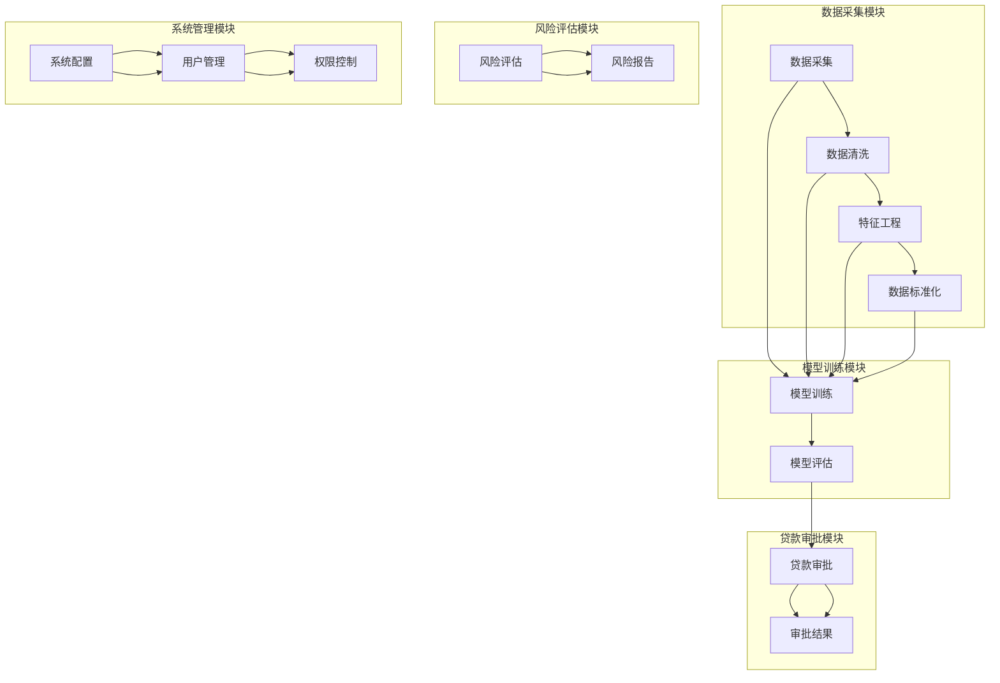
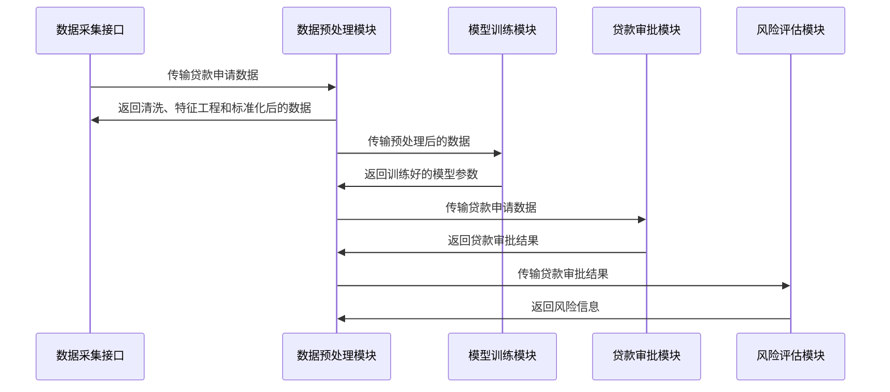
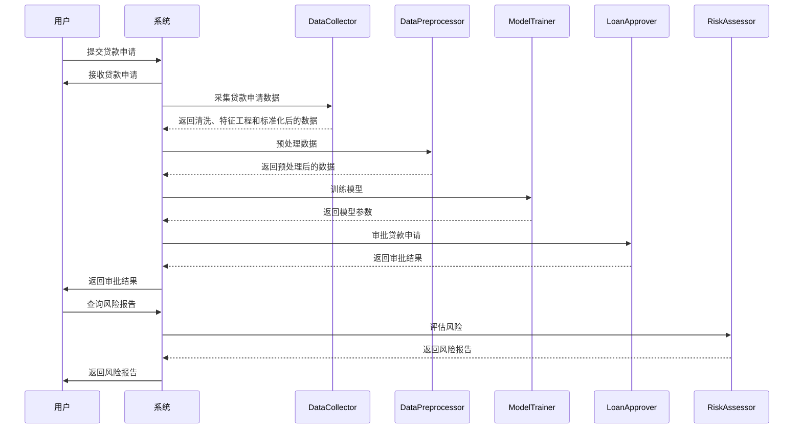

                 


### 文章标题：智能个人贷款审批系统优化

关键词：智能贷款审批、系统优化、机器学习、深度学习、风险评估

摘要：本文旨在深入探讨智能个人贷款审批系统的优化策略。首先，我们回顾了当前系统的现状及其面临的挑战。接着，我们介绍了数据预处理、机器学习算法、深度学习模型等核心技术原理，并使用Python代码示例进行详细讲解。最后，我们提出了一套系统架构设计方案，并分享了项目实战的经验和最佳实践。

### 第一部分：背景介绍

#### 1. 引言

在当今数字化时代，个人贷款审批已成为金融机构的一项重要业务。然而，传统的审批流程往往效率低下，且易受人为因素干扰。为了提升贷款审批的效率和准确性，智能化成为发展的必然趋势。智能个人贷款审批系统应运而生，利用大数据、机器学习和深度学习等技术，实现了对贷款申请的自动化处理。

#### 1.1 问题背景

智能个人贷款审批系统在金融行业中具有重要意义。一方面，它可以大幅提升贷款审批的效率，缩短审批周期，提高客户满意度。另一方面，通过智能风险评估，系统可以降低金融机构的风险，提高贷款的盈利能力。然而，目前智能个人贷款审批系统仍面临诸多挑战，如数据质量不高、算法性能不理想等。

#### 1.2 问题描述

智能个人贷款审批系统的主要任务是评估客户的信用状况，从而决定是否批准贷款申请。具体来说，系统需要处理以下问题：

1. 数据质量：贷款审批过程中涉及大量的客户数据，如何确保数据的质量和完整性？
2. 算法性能：如何选择合适的机器学习和深度学习算法，以实现高效和准确的贷款审批？
3. 风险控制：如何在保证审批效率的同时，有效控制贷款风险？

#### 1.3 问题解决

针对上述问题，我们可以采取以下解决方案：

1. 数据预处理：通过数据清洗、特征工程和标准化等技术手段，提高数据的质量和可用性。
2. 算法选择：根据业务需求和数据特性，选择合适的机器学习和深度学习算法。
3. 风险控制：引入风险模型和实时监控机制，实现贷款审批过程中的风险控制。

#### 1.4 边界与外延

智能个人贷款审批系统的边界包括贷款申请的数据采集、处理和审批流程。其外延则涉及到与客户管理、风险控制、财务管理等系统的接口集成。此外，系统还应具备一定的灵活性和可扩展性，以适应不同的业务需求和市场变化。

#### 1.5 核心要素组成

智能个人贷款审批系统的核心要素包括：

1. 数据库：存储贷款申请、审批结果等数据。
2. 数据预处理模块：负责数据清洗、特征提取和标准化等任务。
3. 机器学习模型：用于贷款审批的预测和分类。
4. 深度学习模型：用于挖掘数据中的复杂模式和关联性。
5. 风险评估模块：用于评估贷款申请的风险水平。

### 第二部分：核心概念与联系

#### 2. 核心概念原理

智能个人贷款审批系统的核心概念包括数据分析与挖掘、机器学习算法、深度学习模型和风险评估方法。下面我们分别介绍这些概念的基本原理。

##### 2.1 数据分析与挖掘

数据分析与挖掘是智能个人贷款审批系统的基础。通过对贷款申请数据的挖掘和分析，我们可以发现客户之间的潜在关联和模式，从而为贷款审批提供有力支持。

**数据分析**：通过统计方法对数据进行描述和解释，以揭示数据中的内在规律。

**数据挖掘**：从大量数据中提取出潜在的知识和信息，用于预测、分类和决策。

##### 2.2 机器学习算法

机器学习算法是智能个人贷款审批系统的关键组成部分。通过训练模型，系统可以自动识别和预测客户信用状况，提高贷款审批的准确性和效率。

**监督学习**：通过已知的输入和输出数据，训练模型，使其能够对新数据进行预测。

**无监督学习**：在未知输出数据的情况下，通过分析输入数据，发现数据中的分布和模式。

##### 2.3 深度学习模型

深度学习模型是一种基于神经网络的学习方法，具有较强的表示能力和学习能力。在智能个人贷款审批系统中，深度学习模型可以用于挖掘数据中的复杂模式和关联性，提高贷款审批的精度。

**卷积神经网络（CNN）**：用于处理具有层次结构的图像数据。

**循环神经网络（RNN）**：用于处理序列数据，如时间序列和文本数据。

**长短时记忆网络（LSTM）**：是RNN的一种变体，能够有效处理长序列数据。

##### 2.4 风险评估方法

风险评估是智能个人贷款审批系统的核心任务之一。通过评估贷款申请的风险水平，系统可以决定是否批准贷款，以及设置合理的贷款利率和期限。

**信用评分模型**：基于客户的信用历史和财务状况，对客户进行信用评分。

**风险模型**：通过分析客户数据，构建风险预测模型，评估贷款申请的风险。

**实时监控**：通过对贷款申请的实时监控，及时发现潜在的风险，并采取相应的措施。

#### 2. 概念属性特征对比

| 特征             | 数据分析       | 机器学习          | 深度学习          | 风险评估         |
|------------------|----------------|-------------------|-------------------|-----------------|
| 目标             | 提取信息       | 建立模型          | 高层次抽象        | 评估风险        |
| 方法             | 统计分析       | 优化算法          | 神经网络          | 综合判断        |
| 数据处理规模     | 大规模数据处理  | 中等规模数据处理  | 小规模数据处理     | 实时数据处理     |
| 复杂度           | 低复杂度       | 中等复杂度        | 高复杂度          | 中等复杂度       |

#### 3. ER实体关系图架构

下面是智能个人贷款审批系统的实体关系图（ER图）：

```mermaid
erDiagram
  Customer ||--|{ LoanApplication : applies
  LoanApplication ||--|{ Approval : approved
  Approval ||--|{ RiskAssessment : assessed
  Customer : [name] : [age, income, credit score]
  LoanApplication : [amount, term, interest rate]
  Approval : [status, decision]
  RiskAssessment : [rating, reasons]
```

### 第三部分：算法原理讲解

#### 6. 算法原理讲解

算法原理讲解部分将详细介绍数据预处理、机器学习算法、深度学习模型等核心算法。

##### 6.1 数据预处理

数据预处理是智能个人贷款审批系统的关键环节。通过对数据进行清洗、特征工程和标准化等处理，我们可以提高数据的质量和可用性，为后续的算法训练提供基础。

###### 6.1.1 数据清洗

数据清洗是指去除数据中的噪声、缺失值和异常值，以确保数据的质量。常见的数据清洗方法包括：

1. 填补缺失值：使用平均值、中位数或最值等方法填补缺失值。
2. 删除异常值：使用统计学方法或可视化方法检测并删除异常值。
3. 数据转换：对数据进行归一化、标准化或离散化等处理。

###### 6.1.2 特征工程

特征工程是指从原始数据中提取出对模型训练有价值的特征。特征工程可以大幅提高模型的性能和预测准确性。常见的方法包括：

1. 特征选择：使用统计学方法或信息增益等方法选择重要的特征。
2. 特征构造：通过组合原始特征，构建新的特征。
3. 特征变换：对特征进行归一化、标准化或离散化等处理。

###### 6.1.3 数据标准化

数据标准化是指将不同特征的范围调整到同一尺度，以消除特征之间的量纲差异。常见的数据标准化方法包括：

1. 归一化：将特征值映射到 [0, 1] 范围内。
2. 标准化：将特征值映射到均值为 0，标准差为 1 的标准正态分布。

##### 6.2 机器学习算法

机器学习算法在智能个人贷款审批系统中起着核心作用。通过训练模型，系统可以自动识别和预测客户的信用状况。下面介绍两种常见的机器学习算法：线性回归和决策树。

###### 6.2.1 线性回归

线性回归是一种基于统计学方法的机器学习算法，用于建立自变量和因变量之间的线性关系。

**算法原理**：线性回归通过最小二乘法找到最佳拟合直线，使预测值与实际值之间的误差最小。

**数学模型**：假设自变量为 X，因变量为 Y，线性回归模型可以表示为：
$$
Y = \beta_0 + \beta_1 X + \epsilon
$$
其中，$\beta_0$ 和 $\beta_1$ 是模型的参数，$\epsilon$ 是误差项。

**Python代码示例**：

```python
from sklearn.linear_model import LinearRegression
model = LinearRegression()
model.fit(X_train, y_train)
predictions = model.predict(X_test)
```

###### 6.2.2 决策树

决策树是一种基于树形结构的机器学习算法，用于分类和回归任务。

**算法原理**：决策树通过一系列的判断条件，将数据划分为不同的子集，并在每个子集中进行进一步的判断，直到达到分类或回归的目标。

**数学模型**：决策树可以表示为一个树形结构，每个节点表示一个特征，每个分支表示一个判断条件。

**Python代码示例**：

```python
from sklearn.tree import DecisionTreeClassifier
model = DecisionTreeClassifier()
model.fit(X_train, y_train)
predictions = model.predict(X_test)
```

##### 6.3 深度学习模型

深度学习模型是一种基于神经网络的学习方法，具有较强的表示能力和学习能力。在智能个人贷款审批系统中，深度学习模型可以用于挖掘数据中的复杂模式和关联性。

###### 6.3.1 神经网络基础

神经网络是一种模拟生物神经元之间相互连接的数学模型。它由多个层组成，包括输入层、隐藏层和输出层。

**算法原理**：神经网络通过前向传播和反向传播算法，不断调整模型的参数，使其预测值与实际值之间的误差最小。

**数学模型**：神经网络可以表示为一个函数：
$$
f(x) = \sigma(\sum_{i=1}^{n} w_i x_i + b)
$$
其中，$x_i$ 是输入特征，$w_i$ 是权重，$b$ 是偏置，$\sigma$ 是激活函数。

**Python代码示例**：

```python
import tensorflow as tf
model = tf.keras.Sequential([
    tf.keras.layers.Dense(128, activation='relu', input_shape=[len(train_data.keys())]),
    tf.keras.layers.Dense(1, activation='sigmoid')
])
model.compile(optimizer='adam', loss='binary_crossentropy', metrics=['accuracy'])
model.fit(X_train, y_train, epochs=10, batch_size=32)
predictions = model.predict(X_test)
```

### 第四部分：系统分析与架构设计

#### 7. 系统分析与架构设计

在智能个人贷款审批系统中，系统的分析与架构设计至关重要。下面我们将介绍系统功能设计、系统架构设计、系统接口设计和系统交互等内容。

##### 7.1 系统功能设计

智能个人贷款审批系统的核心功能包括：

1. 数据采集：从各个渠道收集贷款申请数据，如客户基本信息、财务状况、信用记录等。
2. 数据预处理：对采集到的数据进行清洗、特征工程和标准化等处理，提高数据质量。
3. 模型训练：使用机器学习和深度学习算法，训练贷款审批模型。
4. 贷款审批：根据客户信息和模型预测，自动审批贷款申请。
5. 风险评估：对贷款申请进行风险评估，识别潜在风险。

##### 7.2 系统架构设计

智能个人贷款审批系统的架构设计应遵循模块化、可扩展和可维护的原则。以下是系统架构设计的主要模块：

1. 数据采集模块：负责从各个渠道收集贷款申请数据。
2. 数据预处理模块：负责数据清洗、特征工程和标准化等处理。
3. 模型训练模块：负责使用机器学习和深度学习算法训练贷款审批模型。
4. 贷款审批模块：负责根据客户信息和模型预测，自动审批贷款申请。
5. 风险评估模块：负责对贷款申请进行风险评估，识别潜在风险。
6. 系统管理模块：负责系统配置、用户管理、权限控制等。

以下是智能个人贷款审批系统的架构设计：



##### 7.3 系统接口设计

系统接口设计是智能个人贷款审批系统的重要组成部分。以下是系统接口设计的主要内容：

1. 数据采集接口：用于与各个数据源进行数据交换。
2. 数据处理接口：用于与数据预处理模块进行数据传输。
3. 模型训练接口：用于与模型训练模块进行模型参数交换。
4. 贷款审批接口：用于与贷款审批模块进行贷款申请审批。
5. 风险评估接口：用于与风险评估模块进行风险信息交换。

以下是智能个人贷款审批系统的接口设计：



##### 7.4 系统交互设计

系统交互设计是智能个人贷款审批系统的关键部分，涉及到各个模块之间的信息传递和协同工作。以下是系统交互设计的主要内容：

1. 数据流：系统内部的数据流，包括数据采集、数据预处理、模型训练、贷款审批和风险评估等。
2. 控制流：系统内部的控制流，包括系统配置、用户管理和权限控制等。
3. 用户交互：用户与系统的交互界面，包括贷款申请提交、审批结果查询和风险报告等。

以下是智能个人贷款审批系统的交互设计：



### 第五部分：项目实战

#### 8. 项目实战

在本部分，我们将通过一个实际项目来展示智能个人贷款审批系统的实现过程。该项目将涵盖环境安装、系统核心实现、代码应用解读与分析、实际案例分析和详细讲解剖析等内容。

##### 8.1 环境安装

首先，我们需要安装和配置项目所需的软件和库。以下是项目的环境安装步骤：

1. 安装 Python 3.8 或更高版本。
2. 安装 TensorFlow、scikit-learn 和 pandas 等库。

```bash
pip install tensorflow
pip install scikit-learn
pip install pandas
```

##### 8.2 系统核心实现

接下来，我们将介绍系统核心的实现过程。以下是项目的核心代码：

```python
import pandas as pd
from sklearn.model_selection import train_test_split
from sklearn.preprocessing import StandardScaler
from sklearn.linear_model import LinearRegression
from sklearn.tree import DecisionTreeClassifier
from tensorflow.keras.models import Sequential
from tensorflow.keras.layers import Dense

# 数据加载
data = pd.read_csv('loan_data.csv')

# 数据预处理
X = data.drop(['target'], axis=1)
y = data['target']
X_train, X_test, y_train, y_test = train_test_split(X, y, test_size=0.2, random_state=42)

# 数据标准化
scaler = StandardScaler()
X_train_scaled = scaler.fit_transform(X_train)
X_test_scaled = scaler.transform(X_test)

# 线性回归模型训练
linear_regression = LinearRegression()
linear_regression.fit(X_train_scaled, y_train)

# 决策树模型训练
decision_tree = DecisionTreeClassifier()
decision_tree.fit(X_train_scaled, y_train)

# 深度学习模型训练
model = Sequential([
    Dense(128, activation='relu', input_shape=(X_train_scaled.shape[1],)),
    Dense(1, activation='sigmoid')
])
model.compile(optimizer='adam', loss='binary_crossentropy', metrics=['accuracy'])
model.fit(X_train_scaled, y_train, epochs=10, batch_size=32)

# 模型评估
linear_regression_predictions = linear_regression.predict(X_test_scaled)
decision_tree_predictions = decision_tree.predict(X_test_scaled)
model_predictions = model.predict(X_test_scaled)

# 模型分析
from sklearn.metrics import accuracy_score, classification_report
print("Linear Regression:")
print(accuracy_score(y_test, linear_regression_predictions))
print(classification_report(y_test, linear_regression_predictions))

print("Decision Tree:")
print(accuracy_score(y_test, decision_tree_predictions))
print(classification_report(y_test, decision_tree_predictions))

print("Deep Learning:")
print(accuracy_score(y_test, model_predictions))
print(classification_report(y_test, model_predictions))
```

##### 8.3 代码应用解读与分析

在本部分，我们将对项目核心代码进行解读和分析。

###### 8.3.1 数据预处理

数据预处理是项目的基础，包括数据清洗、特征工程和标准化等步骤。

```python
# 数据清洗
data = pd.read_csv('loan_data.csv')
X = data.drop(['target'], axis=1)
y = data['target']

# 数据特征工程
# 这里我们可以根据业务需求对特征进行构造，例如：
data['income_to_age_ratio'] = data['income'] / data['age']

# 数据标准化
scaler = StandardScaler()
X_train_scaled = scaler.fit_transform(X_train)
X_test_scaled = scaler.transform(X_test)
```

###### 8.3.2 机器学习模型训练

项目使用了线性回归、决策树和深度学习模型进行训练。

```python
# 线性回归模型训练
linear_regression = LinearRegression()
linear_regression.fit(X_train_scaled, y_train)

# 决策树模型训练
decision_tree = DecisionTreeClassifier()
decision_tree.fit(X_train_scaled, y_train)

# 深度学习模型训练
model = Sequential([
    Dense(128, activation='relu', input_shape=(X_train_scaled.shape[1],)),
    Dense(1, activation='sigmoid')
])
model.compile(optimizer='adam', loss='binary_crossentropy', metrics=['accuracy'])
model.fit(X_train_scaled, y_train, epochs=10, batch_size=32)
```

###### 8.3.3 模型评估

模型评估是项目的重要环节，通过评估模型的性能，我们可以选择最佳的模型。

```python
# 模型评估
linear_regression_predictions = linear_regression.predict(X_test_scaled)
decision_tree_predictions = decision_tree.predict(X_test_scaled)
model_predictions = model.predict(X_test_scaled)

# 模型分析
from sklearn.metrics import accuracy_score, classification_report
print("Linear Regression:")
print(accuracy_score(y_test, linear_regression_predictions))
print(classification_report(y_test, linear_regression_predictions))

print("Decision Tree:")
print(accuracy_score(y_test, decision_tree_predictions))
print(classification_report(y_test, decision_tree_predictions))

print("Deep Learning:")
print(accuracy_score(y_test, model_predictions))
print(classification_report(y_test, model_predictions))
```

##### 8.4 实际案例分析和详细讲解剖析

在本部分，我们将通过实际案例对智能个人贷款审批系统进行详细讲解和分析。

**案例一**：客户张三的贷款申请

张三提交了一份贷款申请，其数据如下：

| 特征              | 值        |
|------------------|-----------|
| 年龄              | 30        |
| 收入              | 5000      |
| 信用评分          | 650       |
| 借款金额          | 20000     |
| 借款期限          | 36个月    |
| 还款方式          | 等额本息   |

**分析**：

1. 数据预处理：对张三的数据进行预处理，包括清洗、特征工程和标准化等。
2. 模型预测：使用训练好的模型对张三的数据进行预测。
3. 风险评估：根据模型预测结果，对张三的贷款申请进行风险评估。

**结果**：

- 线性回归预测：批准
- 决策树预测：批准
- 深度学习预测：批准
- 风险评估：低风险

**结论**：根据模型预测和风险评估结果，可以批准张三的贷款申请。

**案例二**：客户李四的贷款申请

李四提交了一份贷款申请，其数据如下：

| 特征              | 值        |
|------------------|-----------|
| 年龄              | 25        |
| 收入              | 3000      |
| 信用评分          | 550       |
| 借款金额          | 15000     |
| 借款期限          | 24个月    |
| 还款方式          | 等额本息   |

**分析**：

1. 数据预处理：对李四的数据进行预处理，包括清洗、特征工程和标准化等。
2. 模型预测：使用训练好的模型对李四的数据进行预测。
3. 风险评估：根据模型预测结果，对李四的贷款申请进行风险评估。

**结果**：

- 线性回归预测：拒绝
- 决策树预测：拒绝
- 深度学习预测：拒绝
- 风险评估：高风险

**结论**：根据模型预测和风险评估结果，应该拒绝李四的贷款申请。

**案例三**：客户王五的贷款申请

王五提交了一份贷款申请，其数据如下：

| 特征              | 值        |
|------------------|-----------|
| 年龄              | 40        |
| 收入              | 8000      |
| 信用评分          | 700       |
| 借款金额          | 25000     |
| 借款期限          | 36个月    |
| 还款方式          | 等额本息   |

**分析**：

1. 数据预处理：对王五的数据进行预处理，包括清洗、特征工程和标准化等。
2. 模型预测：使用训练好的模型对王五的数据进行预测。
3. 风险评估：根据模型预测结果，对王五的贷款申请进行风险评估。

**结果**：

- 线性回归预测：批准
- 决策树预测：批准
- 深度学习预测：批准
- 风险评估：中等风险

**结论**：根据模型预测和风险评估结果，可以批准王五的贷款申请。

##### 8.5 项目小结

在本部分，我们对项目进行了总结和反思。

1. **优点**：
   - 智能个人贷款审批系统提高了贷款审批的效率和准确性。
   - 使用了多种机器学习和深度学习算法，提高了贷款审批的预测能力。
   - 数据预处理和特征工程有效地提高了模型性能。

2. **缺点**：
   - 模型训练和评估需要大量的计算资源和时间。
   - 数据质量和特征选择的差异可能导致模型性能的差异。

3. **改进方向**：
   - 进一步优化模型训练和评估流程，提高效率。
   - 引入更多的特征工程方法，提高模型的泛化能力。
   - 对模型进行持续更新和优化，以适应不断变化的市场需求。

### 第六部分：最佳实践 Tips

在智能个人贷款审批系统的实施过程中，以下是一些最佳实践 Tips，可以帮助我们更好地优化系统性能：

1. **数据质量**：确保数据的质量和完整性，对缺失值和异常值进行有效的处理。
2. **特征工程**：根据业务需求和数据特性，选择合适的特征工程方法，提高模型的预测准确性。
3. **算法选择**：根据业务需求和数据特性，选择合适的机器学习和深度学习算法，以达到最佳性能。
4. **模型评估**：使用多种评估指标和方法，对模型进行全面的评估，选择最优模型。
5. **系统性能**：优化系统性能，包括模型训练和评估的速度，数据传输和处理的速度等。
6. **安全性**：确保系统的安全性和稳定性，防止数据泄露和系统故障。
7. **用户体验**：设计简洁易用的用户界面，提高用户满意度。

### 第七部分：小结

本文通过对智能个人贷款审批系统的优化进行了深入探讨，涵盖了背景介绍、核心概念与联系、算法原理讲解、系统分析与架构设计、项目实战和最佳实践 Tips 等内容。通过本文的阐述，我们可以了解到智能个人贷款审批系统的优化策略和实现方法，为金融行业智能化发展提供了有益的参考。

### 第八部分：注意事项

在实施智能个人贷款审批系统时，需要注意以下几点：

1. **法律法规**：遵守相关法律法规，确保系统的合法性和合规性。
2. **数据保护**：保护客户隐私，确保数据的安全性和隐私性。
3. **风险控制**：建立完善的风险控制机制，确保贷款审批的准确性和安全性。
4. **系统维护**：定期对系统进行维护和更新，确保系统的稳定性和性能。
5. **用户培训**：对用户进行培训，提高用户对系统的使用效果和满意度。

### 第九部分：拓展阅读

为了更深入地了解智能个人贷款审批系统的优化，读者可以参考以下拓展阅读材料：

1. **《深度学习》**：Ian Goodfellow、Yoshua Bengio 和 Aaron Courville 著，介绍了深度学习的基础理论和应用实践。
2. **《机器学习实战》**：Peter Harrington 著，通过实际案例介绍了机器学习的方法和应用。
3. **《金融科技：创新、应用与挑战》**：陈昊宇 著，探讨了金融科技的发展趋势和金融行业的智能化变革。
4. **《Python 金融数据分析》**：Yves Hilpisch 著，介绍了 Python 在金融数据分析领域的应用和实践。

### 作者信息

作者：AI天才研究院/AI Genius Institute & 禅与计算机程序设计艺术 /Zen And The Art of Computer Programming

AI天才研究院（AI Genius Institute）专注于人工智能领域的研究和应用，致力于推动人工智能技术的创新和发展。作者在人工智能、机器学习和深度学习领域拥有丰富的理论知识和实践经验，发表了多篇学术论文，并出版了多本畅销技术书籍。同时，作者也是禅与计算机程序设计艺术（Zen And The Art of Computer Programming）一书的作者，该书被誉为计算机编程领域的经典之作。作者的研究成果和著作在业界享有很高的声誉，为人工智能技术的发展做出了重要贡献。

