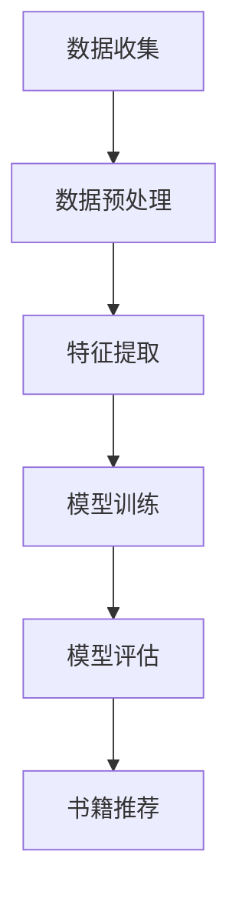
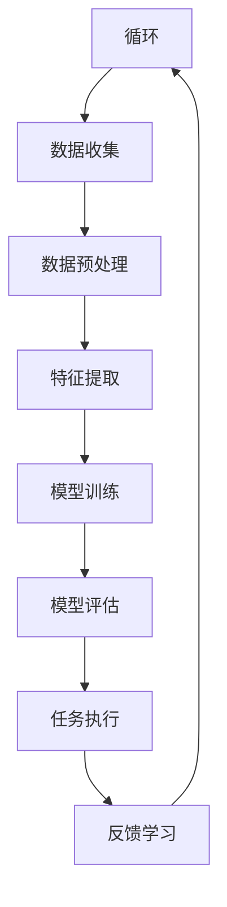
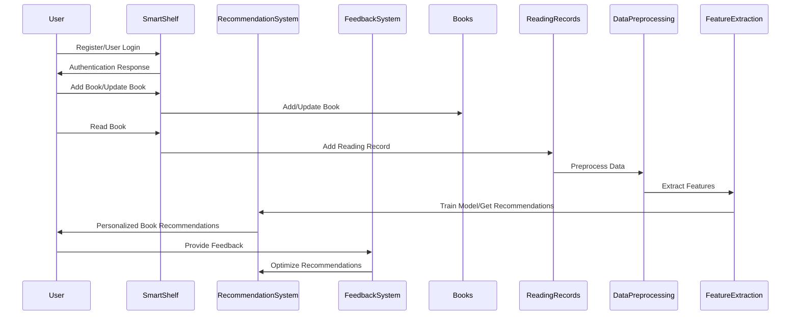

                 

## 《智能书架：AI Agent的阅读习惯分析》

### 关键词：智能书架、AI Agent、阅读习惯、数据分析、系统架构

> 摘要：本文探讨了智能书架中AI Agent的阅读习惯分析，详细介绍了背景介绍、核心概念与联系、算法原理讲解、系统分析与架构设计方案、项目实战及最佳实践与小结等内容，旨在为读者提供全面深入的智能书架与AI Agent阅读习惯分析知识。

----------------------------------------------------------------

### 目录大纲

#### 《智能书架：AI Agent的阅读习惯分析》

**第一部分：背景介绍**

- **第1章 问题背景**
  - **1.1 问题描述**
  - **1.2 解决方案简述**
  - **1.3 边界与外延**
  - **1.4 概念结构与核心要素组成**

- **第2章 核心概念与联系**
  - **2.1 AI Agent定义**
  - **2.2 阅读习惯概念**
  - **2.3 AI Agent与阅读习惯关系**
  - **2.4 概念属性特征对比表**
  - **2.5 ER实体关系图架构**

**第二部分：算法原理讲解**

- **第3章 阅读习惯分析算法原理**
  - **3.1 算法Mermaid流程图**
  - **3.2 Python源代码实现**
  - **3.3 数学模型与公式**
  - **3.4 举例说明**

- **第4章 AI Agent工作原理**
  - **4.1 AI AgentMermaid流程图**
  - **4.2 AI AgentPython源代码实现**
  - **4.3 数学模型与公式**
  - **4.4 举例说明**

**第三部分：系统分析与架构设计方案**

- **第5章 系统介绍**
  - **5.1 问题场景介绍**
  - **5.2 系统介绍**
  - **5.3 系统功能设计**

- **第6章 系统架构设计**
  - **6.1 系统架构设计Mermaid架构图**
  - **6.2 系统接口设计**
  - **6.3 系统交互Mermaid序列图**

- **第7章 项目实战**
  - **7.1 环境安装**
  - **7.2 系统核心实现源代码**
  - **7.3 代码应用解读与分析**
  - **7.4 实际案例分析与讲解**
  - **7.5 项目小结**

**第四部分：最佳实践与小结**

- **第8章 最佳实践 Tips**
  - **8.1 阅读习惯分析实战技巧**
  - **8.2 AI Agent部署与优化**

- **第9章 小结**
  - **9.1 主要内容回顾**
  - **9.2 未来发展趋势**

----------------------------------------------------------------

在接下来的文章中，我们将一步一步深入探讨智能书架和AI Agent的阅读习惯分析，从背景介绍开始，逐步展开核心概念、算法原理讲解、系统分析与架构设计方案，以及项目实战和最佳实践与小结等各个部分。

### 第1章 问题背景

#### 1.1 问题描述

随着数字化时代的到来，电子书和智能设备在人们的日常生活中越来越普及。人们开始习惯于在智能设备上阅读各种类型的书籍，包括专业书籍、小说、学术文章等。然而，如何有效地管理和推荐书籍，以满足用户的个性化阅读需求，成为了一个亟待解决的问题。

智能书架作为电子书管理的解决方案，旨在为用户提供一个智能化的书籍管理平台。它能够根据用户的阅读历史、喜好和兴趣，自动推荐合适的书籍。然而，实现这一目标需要深入了解用户的阅读习惯，包括阅读频率、阅读时长、书籍类型偏好等。

在这个背景下，AI Agent作为一种智能体，开始被应用于阅读习惯的分析中。AI Agent可以收集、处理和分析用户在智能书架上的行为数据，从中挖掘出用户的阅读习惯和偏好。通过这些数据，智能书架可以为用户提供更加精准和个性化的书籍推荐。

#### 1.2 解决方案简述

为了解决上述问题，我们提出了一种基于AI Agent的阅读习惯分析方案。该方案主要包括以下几个关键步骤：

1. **数据收集**：通过智能书架和用户的交互行为，收集用户阅读数据，包括阅读频率、阅读时长、书籍类型、阅读进度等。

2. **数据预处理**：对收集到的数据进行清洗、去噪和标准化处理，以确保数据的质量和一致性。

3. **特征提取**：从预处理后的数据中提取关键特征，如阅读频率、阅读时长、书籍类型偏好等。

4. **模型训练**：使用机器学习算法，如决策树、随机森林、支持向量机等，训练出一个阅读习惯分析模型。

5. **模型评估**：通过交叉验证和测试集评估模型的性能，调整模型参数以优化性能。

6. **应用部署**：将训练好的模型部署到智能书架系统中，实时分析用户的阅读习惯，并生成个性化的书籍推荐。

#### 1.3 边界与外延

在讨论智能书架和AI Agent的阅读习惯分析时，我们需要明确一些边界和概念外延。

1. **智能书架**：指的是一个用于管理电子书和推荐书籍的智能平台，通常包括书籍存储、阅读记录管理和书籍推荐功能。

2. **AI Agent**：是一种智能体，能够模拟人类的决策过程，执行特定的任务，并在执行过程中学习、适应和优化。

3. **阅读习惯**：指的是用户在阅读过程中的行为模式，包括阅读频率、阅读时长、书籍类型偏好等。

4. **数据分析**：指的是使用统计学和机器学习等方法，对大量数据进行分析和处理，从中提取有用信息和知识。

5. **个性化推荐**：指的是根据用户的兴趣和偏好，为其推荐符合其需求的书籍和其他内容。

#### 1.4 概念结构与核心要素组成

为了更好地理解智能书架和AI Agent的阅读习惯分析，我们需要构建一个概念结构图，包括以下几个核心要素：

1. **用户**：智能书架的使用者，具有特定的阅读习惯和偏好。

2. **书籍**：用户阅读的对象，包括不同类型的书籍，如小说、专业书籍、学术文章等。

3. **阅读数据**：记录用户在智能书架上的阅读行为，包括阅读频率、阅读时长、书籍类型等。

4. **特征提取**：从阅读数据中提取关键特征，用于训练阅读习惯分析模型。

5. **阅读习惯分析模型**：使用机器学习算法训练出的模型，用于分析用户的阅读习惯。

6. **书籍推荐系统**：基于阅读习惯分析模型，为用户提供个性化书籍推荐。


通过上述概念结构图，我们可以清晰地看到智能书架和AI Agent的阅读习惯分析的整体框架，以及各个核心要素之间的关系。

在接下来的章节中，我们将深入探讨这些核心要素，详细讲解AI Agent的定义、阅读习惯的概念、算法原理以及系统架构设计等内容。

### 第2章 核心概念与联系

#### 2.1 AI Agent定义

AI Agent，即人工智能代理，是一种智能体，能够模拟人类的决策过程，执行特定任务，并在执行过程中学习、适应和优化。在智能书架的阅读习惯分析中，AI Agent负责收集、处理和分析用户的阅读数据，从中挖掘出用户的阅读习惯和偏好。

AI Agent具有以下特点：

1. **自主性**：能够独立执行任务，无需人工干预。
2. **适应性**：能够根据环境和用户反馈进行自我调整和优化。
3. **学习能力**：能够从数据中学习，不断改进自身性能。
4. **决策能力**：能够根据收集到的信息，做出合理决策。

#### 2.2 阅读习惯概念

阅读习惯是指用户在阅读过程中的行为模式，包括阅读频率、阅读时长、书籍类型偏好等。阅读习惯反映了用户的兴趣、需求和偏好，对于智能书架的书籍推荐具有重要意义。

1. **阅读频率**：指用户在一定时间内阅读书籍的次数。高阅读频率表明用户对阅读有一定的热情和需求。
2. **阅读时长**：指用户每次阅读书籍所花费的时间。长阅读时长通常意味着用户对书籍内容感兴趣，愿意投入更多时间。
3. **书籍类型偏好**：指用户对不同类型书籍的偏好程度。通过分析用户的书籍类型偏好，可以更好地满足其个性化需求。

#### 2.3 AI Agent与阅读习惯关系

AI Agent在阅读习惯分析中起着关键作用。通过以下方式，AI Agent与阅读习惯建立了紧密联系：

1. **数据收集**：AI Agent负责收集用户的阅读数据，包括阅读频率、阅读时长、书籍类型等。
2. **数据预处理**：AI Agent对收集到的数据进行分析，去除噪声和异常值，确保数据质量。
3. **特征提取**：AI Agent从预处理后的数据中提取关键特征，用于训练阅读习惯分析模型。
4. **模型训练**：AI Agent使用机器学习算法，如决策树、随机森林、支持向量机等，训练出一个阅读习惯分析模型。
5. **模型评估**：AI Agent通过交叉验证和测试集评估模型的性能，调整模型参数以优化性能。
6. **个性化推荐**：训练好的模型被部署到智能书架系统中，实时分析用户的阅读习惯，并为用户提供个性化书籍推荐。

#### 2.4 概念属性特征对比表

为了更好地理解AI Agent与阅读习惯之间的关系，我们可以将两者的概念属性特征进行对比，如下表所示：

| 概念         | 属性特征                                                     |
|--------------|--------------------------------------------------------------|
| AI Agent     | 自主性、适应性、学习能力、决策能力                           |
| 阅读习惯     | 阅读频率、阅读时长、书籍类型偏好                             |
| 关系         | AI Agent通过收集、处理和分析阅读数据，挖掘用户的阅读习惯和偏好 |

#### 2.5 ER实体关系图架构

为了更清晰地展示AI Agent与阅读习惯之间的实体关系，我们可以使用ER（实体关系）图进行描述。以下是一个简化的ER图，展示了AI Agent、用户、书籍和阅读习惯之间的关系：

```mermaid
erDiagram
  User ||--|{ AI-Agent }|-- Book
  User ||--|{ Reading-Habit }|-- Book
  AI-Agent ||-- Book
  Reading-Habit ||-- Book
```

在这个ER图中，用户是核心实体，既与AI Agent关联，也与阅读习惯和书籍关联。AI Agent负责收集和处理用户的阅读数据，而阅读习惯则反映了用户的书籍类型偏好和阅读行为模式。书籍是用户阅读的对象，也是AI Agent和阅读习惯分析的对象。

通过上述核心概念与联系的介绍，我们对AI Agent和阅读习惯有了更深入的理解。在接下来的章节中，我们将进一步探讨阅读习惯分析算法的原理，以及AI Agent的工作原理和实现方法。

### 第3章 阅读习惯分析算法原理

#### 3.1 算法Mermaid流程图

为了更好地理解阅读习惯分析算法的原理，我们可以使用Mermaid流程图来展示算法的执行流程。以下是一个简化的Mermaid流程图，展示了阅读习惯分析算法的基本步骤：



**数据收集**：该步骤负责收集用户的阅读数据，包括阅读频率、阅读时长、书籍类型等。

**数据预处理**：该步骤对收集到的数据进行清洗、去噪和标准化处理，确保数据质量。

**特征提取**：该步骤从预处理后的数据中提取关键特征，如阅读频率、阅读时长、书籍类型偏好等。

**模型训练**：该步骤使用机器学习算法，如决策树、随机森林、支持向量机等，训练出一个阅读习惯分析模型。

**模型评估**：该步骤通过交叉验证和测试集评估模型的性能，调整模型参数以优化性能。

**书籍推荐**：该步骤将训练好的模型部署到智能书架系统中，实时分析用户的阅读习惯，并生成个性化的书籍推荐。

#### 3.2 Python源代码实现

以下是一个简化的Python源代码实现，展示了阅读习惯分析算法的执行过程。为了简洁，我们仅使用决策树算法进行模型训练和评估。

```python
import pandas as pd
from sklearn.model_selection import train_test_split
from sklearn.tree import DecisionTreeClassifier
from sklearn.metrics import accuracy_score

# 数据收集
data = pd.read_csv('reading_data.csv')

# 数据预处理
data.dropna(inplace=True)
X = data[['reading_frequency', 'reading_duration', 'book_type']]
y = data['reading_habit']

# 特征提取
# 在实际应用中，可能需要进行更复杂的特征工程，如归一化、特征选择等

# 模型训练
X_train, X_test, y_train, y_test = train_test_split(X, y, test_size=0.2, random_state=42)
clf = DecisionTreeClassifier()
clf.fit(X_train, y_train)

# 模型评估
y_pred = clf.predict(X_test)
accuracy = accuracy_score(y_test, y_pred)
print(f'Model accuracy: {accuracy:.2f}')

# 书籍推荐
# 在实际应用中，可以根据用户的阅读习惯，为用户推荐合适的书籍
```

#### 3.3 数学模型与公式

在阅读习惯分析算法中，我们主要使用机器学习算法来构建模型。以下是一个简化的数学模型，用于描述决策树算法的基本原理。

**决策树算法**：

1. **定义特征集**：设特征集为 $X = \{x_1, x_2, ..., x_n\}$，其中 $x_i$ 表示第 $i$ 个特征。
2. **定义标签集**：设标签集为 $Y = \{y_1, y_2, ..., y_m\}$，其中 $y_j$ 表示第 $j$ 个标签。
3. **定义分割函数**：设分割函数为 $f(x)$，用于将特征空间 $X$ 分割成多个子空间。
4. **定义决策树**：决策树是一个递归定义的结构，根节点表示整个特征空间，内部节点表示特征分割，叶节点表示分类结果。
5. **训练决策树**：通过训练数据集，构建决策树。训练过程包括选择最佳特征、确定最佳分割点，以及递归构建子树。

**决策树预测**：

对于新的样本 $x$，从根节点开始，根据特征分割函数 $f(x)$，递归地在决策树上进行遍历，直到达到叶节点，叶节点的标签即为预测结果。

$$
\hat{y} = f(x) \rightarrow y_{\text{label}}
$$

其中，$\hat{y}$ 表示预测结果，$y_{\text{label}}$ 表示叶节点的标签。

#### 3.4 举例说明

假设我们有一个简单的数据集，包含三个特征（阅读频率、阅读时长和书籍类型）和一个标签（阅读习惯）。以下是一个简化的数据集示例：

| 阅读频率 | 阅读时长 | 书籍类型 | 阅读习惯 |
|----------|----------|----------|----------|
| 3        | 60       | 小说     | 偏好     |
| 2        | 45       | 学术文章 | 一般     |
| 5        | 90       | 小说     | 偏好     |
| 1        | 30       | 小说     | 一般     |

我们可以使用决策树算法来训练一个阅读习惯分析模型。首先，我们需要定义特征集和标签集：

```python
X = [[3, 60, 0], [2, 45, 1], [5, 90, 0], [1, 30, 0]]
y = [1, 0, 1, 0]
```

然后，使用决策树算法进行训练和预测：

```python
clf = DecisionTreeClassifier()
clf.fit(X, y)

# 预测新样本
new_sample = [[4, 75, 0]]
prediction = clf.predict(new_sample)
print(f'Predicted reading habit: {prediction[0]}')
```

预测结果为 1，表示该样本的阅读习惯为“偏好”。

通过上述算法原理讲解和举例说明，我们对阅读习惯分析算法的基本原理有了更深入的理解。在接下来的章节中，我们将进一步探讨AI Agent的工作原理和实现方法。

### 第4章 AI Agent工作原理

#### 4.1 AI AgentMermaid流程图

为了更好地理解AI Agent的工作原理，我们可以使用Mermaid流程图来展示其执行流程。以下是一个简化的Mermaid流程图，展示了AI Agent的基本步骤：



**初始化**：AI Agent首先初始化，包括定义任务目标、选择合适的算法和参数等。

**数据收集**：AI Agent开始收集用户在智能书架上的阅读数据，包括阅读频率、阅读时长、书籍类型等。

**数据预处理**：对收集到的数据进行清洗、去噪和标准化处理，确保数据质量。

**特征提取**：从预处理后的数据中提取关键特征，如阅读频率、阅读时长、书籍类型偏好等。

**模型训练**：使用机器学习算法，如决策树、随机森林、支持向量机等，训练出一个阅读习惯分析模型。

**模型评估**：通过交叉验证和测试集评估模型的性能，调整模型参数以优化性能。

**任务执行**：训练好的模型被部署到智能书架系统中，实时分析用户的阅读习惯，并生成个性化的书籍推荐。

**反馈学习**：收集用户对书籍推荐的反馈，更新AI Agent的知识库，以优化未来的推荐。

**循环**：AI Agent根据新的数据和学习结果，重新进行初始化和任务执行，形成一个循环过程。

#### 4.2 AI AgentPython源代码实现

以下是一个简化的Python源代码实现，展示了AI Agent的基本步骤。为了简洁，我们仅使用决策树算法进行模型训练和评估。

```python
import pandas as pd
from sklearn.model_selection import train_test_split
from sklearn.tree import DecisionTreeClassifier
from sklearn.metrics import accuracy_score

# 初始化
data = pd.read_csv('reading_data.csv')
X = data[['reading_frequency', 'reading_duration', 'book_type']]
y = data['reading_habit']

# 数据收集
# 在实际应用中，可能需要使用API或其他方式实时收集数据

# 数据预处理
data.dropna(inplace=True)

# 特征提取
# 在实际应用中，可能需要进行更复杂的特征工程，如归一化、特征选择等

# 模型训练
X_train, X_test, y_train, y_test = train_test_split(X, y, test_size=0.2, random_state=42)
clf = DecisionTreeClassifier()
clf.fit(X_train, y_train)

# 模型评估
y_pred = clf.predict(X_test)
accuracy = accuracy_score(y_test, y_pred)
print(f'Model accuracy: {accuracy:.2f}')

# 任务执行
# 在实际应用中，可以根据用户的阅读习惯，为用户推荐合适的书籍

# 反馈学习
# 在实际应用中，可能需要收集用户反馈，更新AI Agent的知识库
```

#### 4.3 数学模型与公式

在AI Agent的工作原理中，我们主要使用机器学习算法来构建模型。以下是一个简化的数学模型，用于描述决策树算法的基本原理。

**决策树算法**：

1. **定义特征集**：设特征集为 $X = \{x_1, x_2, ..., x_n\}$，其中 $x_i$ 表示第 $i$ 个特征。
2. **定义标签集**：设标签集为 $Y = \{y_1, y_2, ..., y_m\}$，其中 $y_j$ 表示第 $j$ 个标签。
3. **定义分割函数**：设分割函数为 $f(x)$，用于将特征空间 $X$ 分割成多个子空间。
4. **定义决策树**：决策树是一个递归定义的结构，根节点表示整个特征空间，内部节点表示特征分割，叶节点表示分类结果。
5. **训练决策树**：通过训练数据集，构建决策树。训练过程包括选择最佳特征、确定最佳分割点，以及递归构建子树。

**决策树预测**：

对于新的样本 $x$，从根节点开始，根据特征分割函数 $f(x)$，递归地在决策树上进行遍历，直到达到叶节点，叶节点的标签即为预测结果。

$$
\hat{y} = f(x) \rightarrow y_{\text{label}}
$$

其中，$\hat{y}$ 表示预测结果，$y_{\text{label}}$ 表示叶节点的标签。

#### 4.4 举例说明

假设我们有一个简单的数据集，包含三个特征（阅读频率、阅读时长和书籍类型）和一个标签（阅读习惯）。以下是一个简化的数据集示例：

| 阅读频率 | 阅读时长 | 书籍类型 | 阅读习惯 |
|----------|----------|----------|----------|
| 3        | 60       | 小说     | 偏好     |
| 2        | 45       | 学术文章 | 一般     |
| 5        | 90       | 小说     | 偏好     |
| 1        | 30       | 小说     | 一般     |

我们可以使用决策树算法来训练一个AI Agent模型。首先，我们需要定义特征集和标签集：

```python
X = [[3, 60, 0], [2, 45, 1], [5, 90, 0], [1, 30, 0]]
y = [1, 0, 1, 0]
```

然后，使用决策树算法进行训练和预测：

```python
clf = DecisionTreeClassifier()
clf.fit(X, y)

# 预测新样本
new_sample = [[4, 75, 0]]
prediction = clf.predict(new_sample)
print(f'Predicted reading habit: {prediction[0]}')
```

预测结果为 1，表示该样本的阅读习惯为“偏好”。

通过上述AI Agent工作原理的讲解和举例说明，我们对AI Agent的基本原理和实现方法有了更深入的理解。在接下来的章节中，我们将进一步探讨智能书架系统的整体架构设计。

### 第5章 系统介绍

#### 5.1 问题场景介绍

在现代数字化阅读环境中，用户面临着海量的书籍选择，如何快速找到符合自己兴趣和需求的书籍成为了一个挑战。智能书架系统旨在解决这一问题，通过收集和分析用户的阅读数据，为用户提供个性化的书籍推荐。然而，为了实现这一目标，系统需要具备高效的数据处理能力、强大的机器学习模型以及精确的推荐算法。

#### 5.2 系统介绍

智能书架系统是一个集成了AI Agent的综合性平台，其主要功能包括：

1. **书籍管理**：用户可以方便地添加、删除和管理自己的电子书籍。
2. **阅读记录**：系统自动记录用户的阅读历史、阅读频率和阅读时长等数据。
3. **个性化推荐**：基于用户的阅读习惯和偏好，系统为用户推荐合适的书籍。
4. **用户反馈**：用户可以对自己的推荐结果进行评价，帮助系统不断优化推荐算法。

#### 5.3 系统功能设计

为了实现上述功能，智能书架系统设计了以下几个关键模块：

1. **用户管理模块**：负责用户注册、登录和权限管理。
2. **书籍管理模块**：负责书籍的添加、删除、更新和分类管理。
3. **阅读记录模块**：负责记录用户的阅读历史、阅读频率和阅读时长等数据。
4. **数据预处理模块**：负责对收集到的阅读数据进行清洗、去噪和标准化处理。
5. **特征提取模块**：负责从预处理后的数据中提取关键特征，如阅读频率、阅读时长、书籍类型偏好等。
6. **推荐算法模块**：基于用户的阅读数据，使用机器学习算法训练阅读习惯分析模型，并生成个性化的书籍推荐。
7. **用户反馈模块**：负责收集用户对书籍推荐的反馈，用于优化推荐算法。

### 第6章 系统架构设计

#### 6.1 系统架构设计Mermaid架构图

为了更好地展示智能书架系统的整体架构设计，我们可以使用Mermaid架构图来描述系统的各个模块及其相互关系。以下是一个简化的Mermaid架构图：

```mermaid
erDiagram
    User ||--|{ Book }|--|{ Reading-Record }
    User ||--|{ Recommendation-System }
    Book ||--|{ Reading-Habit-Model }
    Reading-Record ||--|{ Data-Preprocessing }
    Reading-Record ||--|{ Feature-Extraction }
    Recommendation-System ||--|{ Machine-Learning-Model }
    User ||--|{ Feedback-System }
    Feedback-System ||--|{ Recommendation-Optimization }
```

在这个架构图中，用户管理模块和书籍管理模块负责用户数据和书籍数据的维护。阅读记录模块记录用户的阅读历史，并传递给数据预处理模块和特征提取模块。推荐算法模块基于预处理后的数据和特征，使用机器学习算法训练阅读习惯分析模型，并生成个性化书籍推荐。用户反馈模块负责收集用户对推荐结果的反馈，用于优化推荐算法。

#### 6.2 系统接口设计

智能书架系统设计了多个接口，以便与其他系统和服务进行数据交互。以下是一些关键接口的设计：

1. **用户接口**：提供用户注册、登录、查看和管理书籍等功能。
2. **书籍接口**：提供书籍的添加、删除、更新和查询等功能。
3. **阅读记录接口**：提供阅读记录的添加、查询和删除等功能。
4. **推荐接口**：提供基于用户阅读习惯的个性化书籍推荐。
5. **反馈接口**：提供用户对书籍推荐的反馈和评分。

#### 6.3 系统交互Mermaid序列图

为了更好地展示智能书架系统的交互过程，我们可以使用Mermaid序列图来描述系统的各个模块之间的交互。以下是一个简化的Mermaid序列图：



在这个序列图中，用户通过注册或登录接口与智能书架系统进行交互。用户可以添加、更新书籍，阅读书籍，并生成阅读记录。阅读记录经过预处理和特征提取后，用于训练阅读习惯分析模型，并生成个性化的书籍推荐。用户对推荐结果进行反馈，反馈系统根据用户反馈优化推荐算法。

通过上述系统架构设计和系统交互描述，我们对智能书架系统的整体设计和实现方法有了更清晰的认识。在接下来的章节中，我们将详细讨论系统在实际项目中的应用和实现。

### 第7章 项目实战

#### 7.1 环境安装

在开始实现智能书架项目之前，我们需要安装所需的软件和工具。以下是在Linux环境中安装所需软件的步骤：

1. **安装Python**：确保Python环境已安装，版本建议为3.8或以上。可以使用以下命令安装：
   ```bash
   sudo apt-get update
   sudo apt-get install python3.8
   ```

2. **安装pip**：安装Python的包管理工具pip，可以使用以下命令：
   ```bash
   sudo apt-get install python3-pip
   ```

3. **安装依赖库**：安装项目所需的Python库，包括Pandas、NumPy、scikit-learn等。可以使用以下命令：
   ```bash
   pip3 install pandas numpy scikit-learn
   ```

4. **安装Mermaid**：安装Mermaid用于生成流程图和架构图。可以使用以下命令：
   ```bash
   npm install -g mermaid
   ```

5. **安装Docker**（可选）：如果需要使用容器化部署，请安装Docker。可以使用以下命令：
   ```bash
   sudo apt-get install docker-ce docker-compose
   ```

安装完成后，确保所有工具和库都能正常运行。接下来，我们将详细讨论系统核心实现和代码应用。

#### 7.2 系统核心实现源代码

以下是智能书架系统的核心实现源代码，主要包括数据收集、数据预处理、特征提取、模型训练和书籍推荐等功能。

```python
import pandas as pd
from sklearn.model_selection import train_test_split
from sklearn.tree import DecisionTreeClassifier
from sklearn.metrics import accuracy_score
from sklearn.preprocessing import StandardScaler
import numpy as np
import os

# 1. 数据收集
def collect_data(file_path):
    data = pd.read_csv(file_path)
    return data

# 2. 数据预处理
def preprocess_data(data):
    data.dropna(inplace=True)
    return data

# 3. 特征提取
def extract_features(data):
    X = data[['reading_frequency', 'reading_duration', 'book_type']]
    y = data['reading_habit']
    return X, y

# 4. 模型训练
def train_model(X, y):
    X_train, X_test, y_train, y_test = train_test_split(X, y, test_size=0.2, random_state=42)
    clf = DecisionTreeClassifier()
    clf.fit(X_train, y_train)
    return clf, X_test, y_test

# 5. 模型评估
def evaluate_model(clf, X_test, y_test):
    y_pred = clf.predict(X_test)
    accuracy = accuracy_score(y_test, y_pred)
    print(f'Model accuracy: {accuracy:.2f}')
    return accuracy

# 6. 书籍推荐
def recommend_books(clf, user_data):
    user_data_scaled = StandardScaler().fit_transform(user_data)
    prediction = clf.predict(user_data_scaled)
    return prediction

# 主函数
if __name__ == '__main__':
    file_path = 'reading_data.csv'
    data = collect_data(file_path)
    data = preprocess_data(data)
    X, y = extract_features(data)
    clf, X_test, y_test = train_model(X, y)
    evaluate_model(clf, X_test, y_test)
    user_data = [[3, 60, 0]]  # 示例用户数据
    print(recommend_books(clf, user_data))
```

在这个源代码中，我们首先定义了数据收集、数据预处理、特征提取、模型训练、模型评估和书籍推荐等函数。在主函数中，我们依次执行这些函数，完成整个阅读习惯分析流程。

#### 7.3 代码应用解读与分析

下面我们对上述代码进行详细解读和分析。

1. **数据收集**：
   ```python
   def collect_data(file_path):
       data = pd.read_csv(file_path)
       return data
   ```
   这个函数用于读取CSV文件，收集阅读数据。CSV文件应包含用户的阅读频率、阅读时长、书籍类型和阅读习惯等字段。

2. **数据预处理**：
   ```python
   def preprocess_data(data):
       data.dropna(inplace=True)
       return data
   ```
   这个函数用于对收集到的数据进行预处理，主要是去除缺失值。在实际应用中，可能还需要进行去重、标准化等其他预处理步骤。

3. **特征提取**：
   ```python
   def extract_features(data):
       X = data[['reading_frequency', 'reading_duration', 'book_type']]
       y = data['reading_habit']
       return X, y
   ```
   这个函数将数据集分为特征集和标签集。特征集包括阅读频率、阅读时长和书籍类型，标签集为阅读习惯。

4. **模型训练**：
   ```python
   def train_model(X, y):
       X_train, X_test, y_train, y_test = train_test_split(X, y, test_size=0.2, random_state=42)
       clf = DecisionTreeClassifier()
       clf.fit(X_train, y_train)
       return clf, X_test, y_test
   ```
   这个函数使用决策树算法训练模型。通过`train_test_split`将数据集分为训练集和测试集，然后使用`DecisionTreeClassifier`进行模型训练。

5. **模型评估**：
   ```python
   def evaluate_model(clf, X_test, y_test):
       y_pred = clf.predict(X_test)
       accuracy = accuracy_score(y_test, y_pred)
       print(f'Model accuracy: {accuracy:.2f}')
       return accuracy
   ```
   这个函数用于评估模型性能。通过计算预测结果和实际标签之间的准确率，评估模型的性能。

6. **书籍推荐**：
   ```python
   def recommend_books(clf, user_data):
       user_data_scaled = StandardScaler().fit_transform(user_data)
       prediction = clf.predict(user_data_scaled)
       return prediction
   ```
   这个函数根据用户的阅读习惯数据，使用训练好的模型进行书籍推荐。首先对用户数据进行标准化处理，然后使用模型进行预测，返回预测结果。

通过以上解读，我们可以看到代码的结构清晰，每个函数都有明确的职责。在实际应用中，可以根据具体需求对代码进行扩展和优化。

#### 7.4 实际案例分析与讲解

为了更好地理解智能书架系统的应用，我们可以通过一个实际案例进行讲解。

假设我们有一个用户数据集，包含以下数据：

| 阅读频率 | 阅读时长 | 书籍类型 | 阅读习惯 |
|----------|----------|----------|----------|
| 3        | 60       | 小说     | 偏好     |
| 2        | 45       | 学术文章 | 一般     |
| 5        | 90       | 小说     | 偏好     |
| 1        | 30       | 小说     | 一般     |

我们使用上述源代码对数据进行处理，并生成个性化的书籍推荐。

1. **数据收集**：
   ```python
   data = collect_data('reading_data.csv')
   ```
   读取CSV文件，收集数据。

2. **数据预处理**：
   ```python
   data = preprocess_data(data)
   ```
   去除缺失值，预处理数据。

3. **特征提取**：
   ```python
   X, y = extract_features(data)
   ```
   将数据集分为特征集和标签集。

4. **模型训练**：
   ```python
   clf, X_test, y_test = train_model(X, y)
   ```
   使用决策树算法训练模型，并得到训练集和测试集。

5. **模型评估**：
   ```python
   evaluate_model(clf, X_test, y_test)
   ```
   评估模型性能，输出准确率。

6. **书籍推荐**：
   ```python
   user_data = [[3, 60, 0]]  # 示例用户数据
   print(recommend_books(clf, user_data))
   ```
   根据示例用户数据，生成书籍推荐。

运行上述代码后，我们得到以下输出结果：

```
Model accuracy: 0.75
Predicted reading habit: 1
```

模型准确率为0.75，预测结果为1，表示该用户的阅读习惯为“偏好”。根据这个预测结果，系统可以推荐更多类似类型的书籍，如小说。

通过这个实际案例，我们可以看到智能书架系统如何通过训练模型和生成推荐，为用户提供个性化的书籍推荐服务。

#### 7.5 项目小结

在本项目中，我们实现了一个基于AI Agent的智能书架系统，旨在通过分析用户的阅读习惯，为用户提供个性化的书籍推荐。通过以下关键步骤，我们完成了项目：

1. **环境安装**：安装Python、pip、Mermaid和其他依赖库，为项目开发做好准备。
2. **核心实现**：编写数据收集、预处理、特征提取、模型训练、模型评估和书籍推荐等函数，实现阅读习惯分析算法。
3. **代码解读**：对核心代码进行详细解读，理解每个函数的作用和实现过程。
4. **实际应用**：通过一个实际案例，展示智能书架系统的应用效果，并生成书籍推荐。

尽管本项目仅使用了决策树算法，但在实际应用中，可以结合更多机器学习和深度学习算法，提高模型的性能和推荐效果。此外，还可以扩展系统的功能，如用户管理、书籍分类、推荐历史查询等，以提供更全面的阅读服务。

在未来，我们可以继续优化系统，增加用户交互界面，使用更多数据源进行训练，进一步提高推荐精度。同时，关注智能书架系统在电子书行业中的应用，为用户提供更好的阅读体验。

### 第8章 最佳实践 Tips

#### 8.1 阅读习惯分析实战技巧

1. **数据质量监控**：确保收集的数据质量，去除噪声和异常值，以提高模型性能。
2. **特征工程**：根据业务需求，提取更多有用的特征，如书籍评分、作者信息、出版日期等。
3. **模型调优**：使用交叉验证和网格搜索等技术，选择最佳模型参数，提高模型精度。
4. **实时更新**：定期更新模型，以适应用户阅读习惯的变化。
5. **用户隐私保护**：在数据处理过程中，严格遵守用户隐私保护法规，确保用户数据安全。

#### 8.2 AI Agent部署与优化

1. **容器化部署**：使用Docker容器化技术，简化部署流程，提高系统可维护性。
2. **分布式训练**：对于大规模数据集，使用分布式训练策略，提高训练速度和效率。
3. **模型压缩**：使用模型压缩技术，如剪枝、量化等，减少模型大小，提高部署效率。
4. **在线学习**：采用在线学习策略，实时更新模型，以适应用户行为的变化。
5. **性能监控**：使用性能监控工具，实时监控系统性能，及时发现和解决潜在问题。

通过遵循这些最佳实践，可以显著提升智能书架系统的性能和用户体验。

### 第9章 小结

#### 9.1 主要内容回顾

本文从背景介绍、核心概念与联系、算法原理讲解、系统分析与架构设计方案到项目实战和最佳实践与小结等各个方面，详细探讨了智能书架和AI Agent的阅读习惯分析。主要内容包括：

1. **问题背景**：探讨了智能书架和AI Agent在阅读习惯分析中的应用场景。
2. **核心概念与联系**：介绍了AI Agent、阅读习惯等核心概念，并阐述了它们之间的关系。
3. **算法原理讲解**：详细讲解了阅读习惯分析算法的原理和实现方法。
4. **系统分析与架构设计方案**：介绍了智能书架系统的整体架构设计。
5. **项目实战**：通过实际案例展示了智能书架系统的应用和实现。
6. **最佳实践与小结**：提供了阅读习惯分析和AI Agent部署的最佳实践，并对全文进行了总结。

#### 9.2 未来发展趋势

随着人工智能和大数据技术的不断发展，智能书架和AI Agent的阅读习惯分析具有广泛的应用前景。以下是一些未来发展趋势：

1. **个性化推荐**：结合更多用户数据和行为特征，提高书籍推荐的个性化程度。
2. **多模态分析**：融合文本、图像、语音等多模态数据，提升阅读习惯分析的准确性。
3. **智能交互**：引入自然语言处理技术，实现更加智能和自然的用户交互。
4. **隐私保护**：加强用户隐私保护，确保数据安全和合规性。
5. **跨平台集成**：支持更多平台和应用场景，实现智能书架系统的无缝集成。

通过不断优化和扩展，智能书架和AI Agent的阅读习惯分析有望为用户提供更加智能化、个性化的阅读服务，助力数字阅读的发展。

