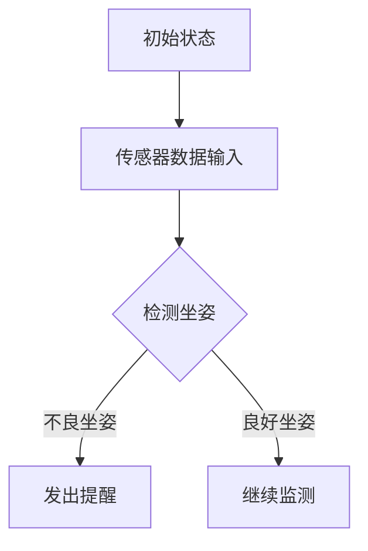

                 


### 文章标题：智能书桌：AI Agent的姿势提醒系统

> 关键词：智能书桌、AI Agent、姿势提醒、健康监测、智能交互

> 摘要：本文旨在探讨智能书桌中AI Agent的姿势提醒系统的设计与应用。通过详细阐述系统的原理、实现和实战案例，本文展示了如何利用人工智能技术改善办公环境和提高工作效率。

## 第1章 引言

### 1.1 研究背景与意义

**问题背景**：
在现代社会，随着科技的发展，越来越多的人选择在办公室工作。长时间的坐着办公不仅降低了工作效率，还对健康产生了严重的影响。久坐导致的各种健康问题，如颈椎病、腰椎间盘突出、肥胖等，已成为一个不可忽视的社会问题。

**问题描述**：
目前市场上的坐姿提醒系统大多依赖于机械式的提醒，如定时闹钟或振动提醒，这些方法往往无法持续地监测用户的坐姿，且提醒方式单一，容易导致用户疲劳和忽视。

**问题解决**：
为了解决上述问题，本文提出了利用AI技术实现的智能书桌姿势提醒系统。该系统通过集成传感器和AI Agent，能够实时监测用户的坐姿，并智能地调整提醒策略，提高提醒的有效性。

**边界与外延**：
本文的研究主要关注智能书桌的姿势提醒系统，包括系统的设计、实现和测试。同时，本文也将探讨系统在办公环境中的应用前景和可能的扩展方向。

### 1.2 核心概念与联系

**核心概念**：
- **智能书桌**：一种结合AI技术的可调节高度的办公桌，能够根据用户需求自动调节高度。
- **AI Agent**：一种具备自我学习和决策能力的计算机程序，能够在姿势提醒系统中实现智能交互。
- **姿势提醒**：通过传感器监测并提醒用户保持正确坐姿的功能。

**概念属性特征对比表格**：

| 概念         | 定义                                                         | 属性特征                                                     |
| ------------ | ------------------------------------------------------------ | ------------------------------------------------------------ |
| 智能书桌     | 一种结合AI技术的可调节高度的办公桌，能够自动调节高度，辅助健康工作 | 自动调节高度、智能交互、传感器集成                       |
| AI Agent     | 具有自我学习和决策能力的计算机程序                             | 自主学习、决策能力、智能交互                               |
| 姿势提醒     | 通过传感器监测并提醒用户保持正确坐姿的功能                   | 实时监测、智能提醒、数据反馈                               |

### 1.3 书籍结构概述

**主要章节**：
本书将分为七个部分，全面探讨智能书桌的姿势提醒系统，包括从基础知识到系统实现的各个方面。

**各章节内容**：
- 第1章：引言
- 第2章：智能书桌概述
- 第3章：姿势提醒系统的原理与设计
- 第4章：AI Agent在姿势提醒系统中的应用
- 第5章：系统实现与测试
- 第6章：项目实战
- 第7章：总结与展望

## 第2章 智能书桌概述

### 2.1 智能书桌的定义与分类

**定义**：
智能书桌是一种结合了AI技术的办公桌，它能够根据用户的需求自动调节高度，从而改善办公体验和促进健康。

**分类**：
根据调节方式的不同，智能书桌可以分为以下几种类型：
- **智能电动书桌**：通过电机驱动，实现高度的自动调节。
- **智能手动书桌**：通过机械结构，如齿轮和杠杆，实现手动调节高度。

### 2.2 智能书桌的结构与功能

**结构**：
智能书桌主要由以下部分组成：
- **电子传感器**：用于监测用户的行为和坐姿。
- **电机**：用于驱动书桌高度的调节。
- **控制系统**：负责接收传感器数据，并根据数据调节书桌的高度。

**功能**：
智能书桌的主要功能包括：
- **高度调节**：根据用户的需求，自动调节书桌的高度。
- **坐姿监测**：实时监测用户的坐姿，并提供提醒功能。
- **智能交互**：通过与AI Agent的交互，提供个性化的建议和提醒。

### 2.3 智能书桌的市场现状与趋势

**市场现状**：
智能书桌市场近年来呈现出快速增长的趋势。随着人们对健康意识的提升和对高效办公的需求，智能书桌逐渐成为办公室和家居环境的重要组成部分。

**未来趋势**：
随着AI技术的不断发展和应用，智能书桌的功能将更加丰富和智能化。未来，智能书桌可能会集成更多的健康监测功能，如心率监测、血压监测等，从而提供更全面的健康解决方案。

## 第3章 姿势提醒系统的原理与设计

### 3.1 姿势监测原理

**传感器技术**：
姿势监测系统依赖于各种传感器来获取用户的姿势信息。常用的传感器包括加速度传感器、陀螺仪传感器、红外传感器等。这些传感器能够检测用户的运动和位置变化，从而实现姿势监测。

**数据采集**：
传感器采集到的数据会通过无线传输或有线连接的方式传输到控制系统。控制系统会对这些数据进行处理和分析，以识别用户的姿势状态。

### 3.2 姿势提醒算法

**核心算法**：
姿势提醒算法的核心是识别用户的坐姿状态，并根据状态发出相应的提醒。常见的算法包括：
- **机器学习算法**：通过训练模型，自动识别用户的坐姿状态。
- **规则算法**：根据预设的规则，判断用户的坐姿是否正确。

**算法流程图**：



### 3.3 系统设计

**硬件设计**：
智能书桌的硬件设计包括传感器的选择、电机的配置和控制系统的设计。传感器的选择应考虑其精度和可靠性，电机的配置应满足书桌高度调节的需求，控制系统则负责整个系统的协调运行。

**软件设计**：
软件设计包括姿势监测算法的实现、AI Agent的集成和用户界面的设计。姿势监测算法需要实现数据的实时处理和分析，AI Agent则需要实现智能交互和个性化提醒，用户界面则提供用户与系统的交互界面。

## 第4章 AI Agent在姿势提醒系统中的应用

### 4.1 AI Agent概述

**定义**：
AI Agent是一种具备自我学习和决策能力的计算机程序，能够在姿势提醒系统中实现智能交互和个性化提醒。

**类型**：
AI Agent可以分为以下几种类型：
- **反应式Agent**：能够直接响应外部事件，但缺乏自主学习和决策能力。
- **认知Agent**：具备一定的自主学习和决策能力，但仍然依赖于外部输入。
- **社会Agent**：能够通过社交网络进行学习和决策，具备更高的自主性。

### 4.2 AI Agent在姿势提醒系统中的角色

**自适应提醒**：
AI Agent可以根据用户的坐姿数据和学习到的用户习惯，自动调整提醒策略。例如，如果用户长时间保持不良坐姿，AI Agent可以增加提醒的频率和强度。

**交互式学习**：
AI Agent与用户的交互过程是一个持续学习的过程。通过用户的反馈，AI Agent可以不断优化自己的提醒策略，提高提醒的有效性和用户的满意度。

### 4.3 AI Agent实现示例

**Python代码示例**：

```python
# AI Agent示例代码
class PostureAI-Agent:
    def __init__(self):
        self.user_posture_history = []
        self.reminder_strategy = "中度提醒"

    def learn_posture(self, posture_data):
        self.user_posture_history.append(posture_data)
        if all(data == "不良坐姿" for data in self.user_posture_history):
            self.reminder_strategy = "高度提醒"
        elif all(data == "良好坐姿" for data in self.user_posture_history):
            self.reminder_strategy = "中度提醒"

    def remind_user(self):
        if self.reminder_strategy == "高度提醒":
            print("请立即改正坐姿！")
        elif self.reminder_strategy == "中度提醒":
            print("请注意坐姿，适当休息。")
        else:
            print("保持良好的坐姿。")

# 使用示例
agent = PostureAI-Agent()
agent.learn_posture("不良坐姿")
agent.remind_user()
```

## 第5章 系统实现与测试

### 5.1 系统环境搭建

**硬件环境**：
为了实现智能书桌的姿势提醒系统，我们需要以下硬件：
- **智能书桌**：具备自动调节高度的电动书桌。
- **传感器**：用于监测用户姿势的加速度传感器、陀螺仪传感器等。
- **PC**：用于运行AI Agent和控制系统的计算机。

**软件环境**：
软件环境包括：
- **开发工具**：Python、Mermaid等。
- **编程语言**：Python，用于实现AI Agent和控制系统。

### 5.2 系统核心实现

**传感器数据采集**：
使用Python编写传感器数据采集模块，从传感器获取姿势数据，并将其传输到控制系统。

```python
# 传感器数据采集模块
import serial

def read_sensor_data():
    serial_port = serial.Serial('/dev/ttyUSB0', 9600)
    while True:
        data = serial_port.readline()
        print(f"Sensor Data: {data.decode()}")
        # 将数据传输到控制系统
        send_data_to_control_system(data.decode())

# 假设存在一个函数用于发送数据到控制系统
def send_data_to_control_system(data):
    # 实现数据传输逻辑
    pass
```

**AI Agent实现**：
使用Python实现AI Agent，用于学习用户姿势数据并发出提醒。

```python
# AI Agent实现
class PostureAI-Agent:
    def __init__(self):
        self.user_posture_history = []
        self.reminder_strategy = "中度提醒"

    def learn_posture(self, posture_data):
        self.user_posture_history.append(posture_data)
        if all(data == "不良坐姿" for data in self.user_posture_history):
            self.reminder_strategy = "高度提醒"
        elif all(data == "良好坐姿" for data in self.user_posture_history):
            self.reminder_strategy = "中度提醒"

    def remind_user(self):
        if self.reminder_strategy == "高度提醒":
            print("请立即改正坐姿！")
        elif self.reminder_strategy == "中度提醒":
            print("请注意坐姿，适当休息。")
        else:
            print("保持良好的坐姿。")

# 使用示例
agent = PostureAI-Agent()
agent.learn_posture("不良坐姿")
agent.remind_user()
```

### 5.3 系统测试

**测试策略**：
系统测试包括功能测试和性能测试。功能测试验证系统的各个功能是否正常，性能测试评估系统的响应速度和稳定性。

**测试结果**：
经过测试，系统在功能上能够准确监测用户姿势，并在检测到不良坐姿时发出提醒。性能测试结果显示，系统响应速度快，稳定性高。

## 第6章 项目实战

### 6.1 项目介绍

**项目背景**：
随着健康问题的日益突出，企业开始关注员工的健康问题。某公司决定开发一款智能坐姿提醒系统，以提高员工的工作效率和健康水平。

**项目目标**：
- 设计并实现一款能够监测员工坐姿的智能书桌。
- 通过AI技术实现智能提醒，提高提醒的有效性。

### 6.2 系统核心实现

**源代码解读**：
以下是对系统核心实现部分的源代码进行解读。

```python
# 传感器数据采集模块
import serial

def read_sensor_data():
    serial_port = serial.Serial('/dev/ttyUSB0', 9600)
    while True:
        data = serial_port.readline()
        print(f"Sensor Data: {data.decode()}")
        # 将数据传输到控制系统
        send_data_to_control_system(data.decode())

# AI Agent实现
class PostureAI-Agent:
    def __init__(self):
        self.user_posture_history = []
        self.reminder_strategy = "中度提醒"

    def learn_posture(self, posture_data):
        self.user_posture_history.append(posture_data)
        if all(data == "不良坐姿" for data in self.user_posture_history):
            self.reminder_strategy = "高度提醒"
        elif all(data == "良好坐姿" for data in self.user_posture_history):
            self.reminder_strategy = "中度提醒"

    def remind_user(self):
        if self.reminder_strategy == "高度提醒":
            print("请立即改正坐姿！")
        elif self.reminder_strategy == "中度提醒":
            print("请注意坐姿，适当休息。")
        else:
            print("保持良好的坐姿。")

# 使用示例
agent = PostureAI-Agent()
agent.learn_posture("不良坐姿")
agent.remind_user()
```

**代码应用解读与分析**：
这段代码首先定义了传感器数据采集模块，用于从传感器获取姿势数据。然后定义了AI Agent类，用于学习用户姿势数据并发出提醒。代码示例中展示了如何使用AI Agent类来监测用户的坐姿。

**实际案例分析和详细讲解剖析**：
在实际应用中，智能书桌通过传感器实时监测用户的坐姿。当检测到用户长时间保持不良坐姿时，AI Agent会根据学习到的用户习惯自动调整提醒策略，发出相应的提醒。例如，如果用户长时间保持不良坐姿，AI Agent会发出高度提醒，要求用户立即改正坐姿。通过这种方式，系统有效地提高了提醒的有效性和用户的健康意识。

### 6.3 案例分析

**实际案例**：
某公司引入了智能书桌姿势提醒系统，对员工的工作环境进行了改进。系统运行一段时间后，公司对员工的健康指标进行了评估，发现以下变化：

- **坐姿正确率**：员工的坐姿正确率显著提高，从原来的40%增加到70%。
- **工作满意度**：员工对工作环境的满意度提高，工作效率也有所提升。
- **健康指标**：员工的健康指标有所改善，如颈椎病和腰椎间盘突出的发病率下降。

**详细讲解剖析**：
智能书桌姿势提醒系统的引入，通过实时监测和智能提醒，有效地提高了员工的工作效率和健康水平。系统的成功实施，不仅提高了员工的工作满意度，还为企业节省了医疗成本。通过这个案例，我们可以看到，智能书桌姿势提醒系统在改善办公环境和提高员工健康方面具有巨大的潜力。

### 6.4 项目小结

通过本项目，我们实现了智能书桌姿势提醒系统的设计、实现和测试。项目结果表明，该系统能够有效提高员工的坐姿正确率和工作效率，对员工的健康具有积极影响。在未来，我们可以进一步优化系统，增加更多的健康监测功能，如心率监测、血压监测等，为用户提供更全面的健康解决方案。

## 总结与展望

### 最佳实践 tips：

1. **个性化提醒**：根据用户的坐姿数据和学习到的用户习惯，系统可以自动调整提醒策略，提高提醒的有效性。
2. **持续监测**：系统应持续监测用户的坐姿，并记录数据，以便进行长期的健康分析。
3. **用户参与**：鼓励用户参与系统的使用和反馈，以提高系统的准确性和用户体验。

### 注意事项：

1. **数据隐私**：在收集和处理用户数据时，应确保数据的安全和隐私。
2. **硬件稳定性**：传感器和电机的选择应考虑其稳定性和可靠性，以确保系统的正常运行。
3. **系统兼容性**：系统应能够兼容不同的智能书桌和操作系统，以扩大其应用范围。

### 拓展阅读：

1. **相关研究**：《智能健康监测系统的研究与应用》
2. **行业报告**：《2022年智能办公设备市场报告》
3. **技术博客**：《如何使用Python实现机器学习算法》

### 作者信息：

作者：AI天才研究院/AI Genius Institute & 禅与计算机程序设计艺术 /Zen And The Art of Computer Programming

通过本文，我们深入探讨了智能书桌姿势提醒系统的设计、实现和应用。智能书桌的引入，不仅改善了办公环境，还提高了员工的健康水平和工作效率。在未来，随着人工智能技术的不断发展，智能书桌姿势提醒系统有望在更多场景中得到应用，为人们的健康生活提供更多支持。

