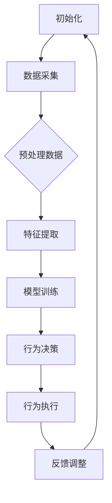
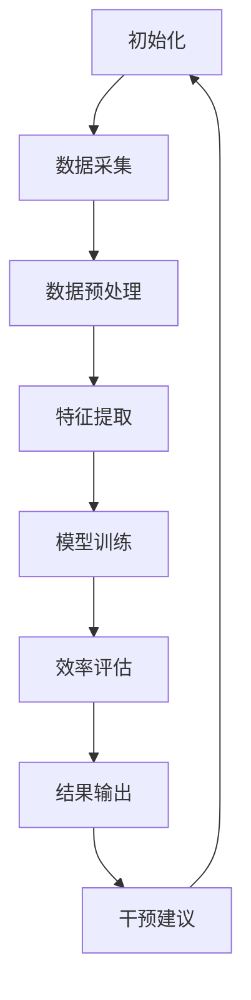
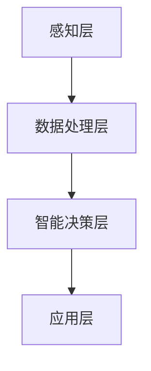
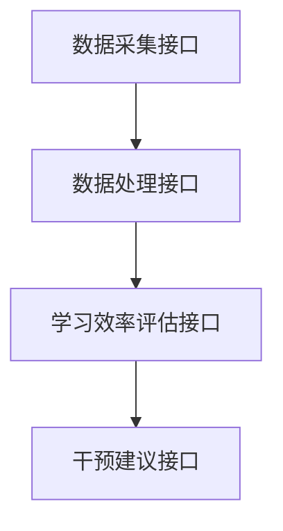
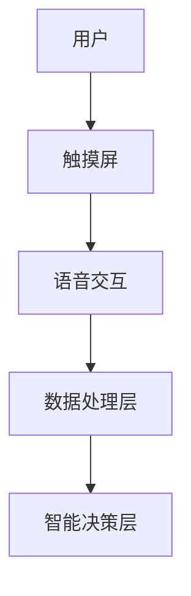

                 

# 智能书桌：AI Agent的学习效率监测

## 关键词：智能书桌、AI Agent、学习效率监测、算法原理、系统设计

## 摘要：

本文旨在探讨智能书桌中AI Agent如何有效监测学习效率。随着教育信息化的推进，对学习效率的监测需求日益凸显。智能书桌利用AI Agent实现对学生行为的实时监测和分析，提供个性化学习干预。本文首先介绍了智能书桌与AI Agent的背景和概念，随后深入解析了学习效率的定义、AI Agent的学习效率监测原理，以及相关算法和系统设计。最后，通过项目实战展示了智能书桌的具体实现和应用。

## 目录大纲

----------------------------------------------------------------

# 智能书桌：AI Agent的学习效率监测

## 第一部分：背景与概述

### 第1章：智能书桌与AI Agent概述

### 1.1 问题背景

#### 1.1.1 教育信息化的发展趋势

#### 1.1.2 学习效率监测的需求

#### 1.1.3 智能书桌的作用与优势

### 1.2 AI Agent的定义与特点

#### 1.2.1 AI Agent的定义

#### 1.2.2 AI Agent的核心特点

#### 1.2.3 学习效率监测与AI Agent的联系

### 1.3 智能书桌的组成与工作原理

#### 1.3.1 智能书桌的硬件组成

#### 1.3.2 智能书桌的软件组成

#### 1.3.3 智能书桌的工作原理

### 1.4 AI Agent在学习效率监测中的应用

#### 1.4.1 AI Agent在行为监测中的应用

#### 1.4.2 AI Agent在数据分析中的应用

#### 1.4.3 AI Agent在学习干预中的应用

### 1.5 本章小结

## 第二部分：核心概念与原理

### 第2章：核心概念与联系

### 2.1 学习效率的定义与测量

#### 2.1.1 学习效率的定义

#### 2.1.2 学习效率的测量方法

#### 2.1.3 学习效率与学习效果的关系

### 2.2 AI Agent的学习效率监测原理

#### 2.2.1 AI Agent的基本原理

#### 2.2.2 AI Agent在学习效率监测中的工作原理

#### 2.2.3 AI Agent与学习效率监测的关联性

### 2.3 概念属性特征对比表格

#### 2.3.1 AI Agent的属性特征对比

#### 2.3.2 学习效率监测的方法对比

#### 2.3.3 AI Agent与学习效率监测的关系对比

### 2.4 ER实体关系图架构

#### 2.4.1 ER实体关系图的基本概念

#### 2.4.2 ER实体关系图的应用场景

#### 2.4.3 智能书桌中的ER实体关系图设计

### 2.5 本章小结

## 第三部分：算法原理与实现

### 第3章：算法原理讲解

### 3.1 AI Agent算法原理

#### 3.1.1 AI Agent算法的基本原理

#### 3.1.2 AI Agent算法的工作流程

#### 3.1.3 AI Agent算法的数学模型

### 3.2 学习效率监测算法原理

#### 3.2.1 学习效率监测算法的基本原理

#### 3.2.2 学习效率监测算法的工作流程

#### 3.2.3 学习效率监测算法的数学模型

### 3.3 算法流程图与Python源代码

#### 3.3.1 AI Agent算法流程图

#### 3.3.2 学习效率监测算法流程图

#### 3.3.3 Python源代码实现

### 3.4 数学模型与公式详解

#### 3.4.1 AI Agent算法数学模型

#### 3.4.2 学习效率监测算法数学模型

#### 3.4.3 数学模型公式讲解与推导

### 3.5 本章小结

## 第四部分：系统设计与实现

### 第4章：系统分析与架构设计

### 4.1 问题场景介绍

#### 4.1.1 教育信息化背景

#### 4.1.2 智能书桌应用场景

#### 4.1.3 学习效率监测需求分析

### 4.2 系统功能设计

#### 4.2.1 系统功能概述

#### 4.2.2 领域模型类图

### 4.3 系统架构设计

#### 4.3.1 系统架构概述

#### 4.3.2 系统架构图

### 4.4 系统接口设计

#### 4.4.1 系统接口概述

#### 4.4.2 系统接口设计

### 4.5 系统交互设计

#### 4.5.1 系统交互概述

#### 4.5.2 系统交互序列图

### 4.6 本章小结

## 第五部分：项目实战

### 第5章：项目实战

### 5.1 环境安装

#### 5.1.1 环境准备

#### 5.1.2 环境配置

#### 5.1.3 环境测试

### 5.2 系统核心实现

#### 5.2.1 系统核心模块

#### 5.2.2 系统核心实现源代码

#### 5.2.3 源代码应用解读与分析

### 5.3 实际案例分析

#### 5.3.1 案例背景

#### 5.3.2 案例分析

#### 5.3.3 案例详细讲解与剖析

### 5.4 项目小结

## 第六部分：最佳实践与总结

### 6.1 最佳实践 tips

### 6.2 小结

### 6.3 注意事项

### 6.4 拓展阅读

----------------------------------------------------------------

## 第一部分：背景与概述

### 第1章：智能书桌与AI Agent概述

在当今快速发展的信息化社会中，教育信息化已经成为教育领域的重要趋势。随着技术的不断进步，各种智能设备在教育中的应用也越来越广泛。智能书桌作为智能教育的代表性设备之一，逐渐走进了大众的视野。本文将首先介绍智能书桌与AI Agent的基本概念、问题背景以及它们在学习效率监测中的作用。

#### 1.1 问题背景

教育信息化的快速发展，使得传统的教育模式逐渐被颠覆。传统的教育模式主要依赖于教师的讲授和学生被动接受知识，而现代教育更加注重学生的主动参与和个性化学习。然而，随着学生数量的增加和教学任务的繁重，教师很难对每个学生的学习状况进行实时监测和干预。

学习效率的监测成为教育信息化中一个亟待解决的问题。学习效率不仅关系到学生的学习成绩，更影响他们的学习动力和自信心。传统的监测方法主要依赖于考试和作业的评分，但这些方法往往只能反映学生在某个时间段的学习效果，无法提供实时和全面的数据支持。

为了解决这些问题，智能书桌与AI Agent的应用应运而生。智能书桌通过整合多种传感器和智能算法，可以实时监测学生的学习行为和学习状态。而AI Agent则利用机器学习和数据分析技术，对学生的学习效率进行深入分析和干预。这种结合不仅提高了学习效率的监测精度，也为个性化学习提供了有力支持。

#### 1.2 智能书桌与AI Agent概述

**1.2.1 智能书桌**

智能书桌是一种集成了多种传感器、计算模块和人机交互界面的智能设备。它可以实时监测学生的学习行为和学习状态，并通过AI Agent提供个性化学习建议和干预。

智能书桌的主要组成部分包括：

- **硬件传感器模块**：包括摄像头、麦克风、加速度传感器等，用于监测学生的学习行为和学习状态。
- **计算模块**：包括中央处理器（CPU）和图形处理器（GPU），用于处理传感器数据并运行AI算法。
- **人机交互界面**：包括显示屏、触摸屏等，用于展示学习内容和AI Agent的建议。

智能书桌的工作原理是通过传感器收集学生的学习行为数据，如阅读时间、写字速度、眼睛注视点等，然后通过计算模块进行数据分析和处理，最后通过人机交互界面向学生提供反馈和建议。

**1.2.2 AI Agent**

AI Agent，即人工智能代理，是一种基于人工智能技术的智能实体。它可以模拟人类的思维和行为，通过与用户互动来实现特定任务。

AI Agent的主要特点包括：

- **自主学习能力**：AI Agent可以通过机器学习技术不断学习和优化自身行为。
- **智能交互能力**：AI Agent可以理解自然语言，与用户进行实时对话。
- **任务执行能力**：AI Agent可以根据任务要求自动执行相应的操作。

在智能书桌中，AI Agent主要用于以下三个方面：

- **行为监测**：AI Agent通过分析学生的学习行为数据，监测学生的学习状态和效率。
- **数据分析**：AI Agent通过对学生学习数据进行分析，识别学习问题并提供解决方案。
- **学习干预**：AI Agent根据学生学习状态和数据分析结果，提供个性化的学习建议和干预。

#### 1.3 智能书桌与AI Agent在学习效率监测中的应用

智能书桌与AI Agent的结合，为学习效率监测提供了一种全新的解决方案。通过智能书桌，教师和学生可以实时了解学生的学习状态和效率，及时发现并解决学习中存在的问题。

**1.3.1 AI Agent在行为监测中的应用**

AI Agent可以通过分析学生的学习行为数据，如阅读时间、写字速度、眼睛注视点等，实时监测学生的学习状态。当学生出现分心、疲劳或其他不良学习行为时，AI Agent可以及时提醒学生并调整学习计划。

例如，当学生阅读时，AI Agent可以通过分析学生的眼睛注视点，识别出学生是否专注于阅读内容。如果发现学生注意力不集中，AI Agent可以提醒学生休息或调整学习内容，以提高学习效率。

**1.3.2 AI Agent在数据分析中的应用**

AI Agent不仅能够监测学生的学习行为，还可以对学生的学习数据进行深入分析。通过分析学生的学习数据，AI Agent可以识别出学生的学习问题，并提供相应的解决方案。

例如，通过分析学生的考试成绩和学习时间，AI Agent可以识别出学生在哪些知识点上存在薄弱环节。然后，AI Agent可以为学生推荐相应的学习资源和练习题，帮助学生提高学习效率。

**1.3.3 AI Agent在学习干预中的应用**

AI Agent可以根据学生的学习状态和数据分析结果，提供个性化的学习建议和干预。通过智能书桌，AI Agent可以实时调整学生的学习计划和学习内容，确保学生始终处于最佳学习状态。

例如，当AI Agent发现学生在某个知识点上存在困难时，它可以为学生提供额外的学习资源，如视频讲解、练习题等。同时，AI Agent还可以为学生制定个性化的学习计划，确保学生在学习过程中始终保持高效状态。

#### 1.4 本章小结

智能书桌与AI Agent的结合，为学习效率监测提供了一种全新的解决方案。通过智能书桌，教师和学生可以实时了解学生的学习状态和效率，及时发现并解决学习中存在的问题。本章介绍了智能书桌与AI Agent的基本概念、问题背景以及它们在学习效率监测中的应用。在接下来的章节中，我们将进一步探讨智能书桌与AI Agent的核心概念和原理，以及相关的算法和系统设计。

### 1.4 本章小结

本章首先介绍了教育信息化背景下学习效率监测的需求，并引出了智能书桌与AI Agent的应用。通过对智能书桌和AI Agent的基本概念进行详细阐述，我们了解了它们在硬件、软件和工作原理上的特点。此外，本章还分析了AI Agent在行为监测、数据分析和学习干预方面的具体应用，展示了智能书桌在学习效率监测中的重要作用。

在接下来的章节中，我们将深入探讨智能书桌与AI Agent的核心概念和原理，包括学习效率的定义、测量方法以及AI Agent的工作机制。通过这些分析，我们将为后续的算法讲解和系统设计奠定基础。希望读者能够继续关注并深入思考这些关键问题，为智能书桌在教育中的应用提供更深入的见解。

----------------------------------------------------------------

## 第二部分：核心概念与原理

### 第2章：核心概念与联系

在深入探讨智能书桌与AI Agent的学习效率监测之前，我们需要对一些核心概念进行定义和解释。学习效率、AI Agent以及它们之间的联系是理解整个系统的关键。

#### 2.1 学习效率的定义与测量

**2.1.1 学习效率的定义**

学习效率是指在学习过程中，学习者所投入的学习时间与学习成果的比率。它不仅反映了学习者对学习内容的掌握程度，还体现了学习者的学习能力和学习策略。学习效率高意味着在相同时间内，学习者能够获得更多的知识或技能。

**2.1.2 学习效率的测量方法**

学习效率的测量可以从多个维度进行：

1. **时间测量**：通过记录学习者的学习时间，分析其学习效率。例如，可以记录每天的学习时长、学习频率等。
2. **成果测量**：通过考试成绩、作业完成情况、项目成果等指标来评估学习效率。这些指标可以直接反映学习者在学习过程中的成果。
3. **行为测量**：通过监测学习者的学习行为，如阅读速度、写字速度、课堂参与度等，来分析学习效率。这些行为数据可以提供对学习过程的深入理解。

**2.1.3 学习效率与学习效果的关系**

学习效率是学习效果的基础，但并不等同于学习效果。学习效率高可能意味着学习者能够迅速掌握知识，但并不一定意味着学习效果最佳。学习效果还需要考虑知识的应用、技能的熟练度以及学习者的学习动机等多个因素。

#### 2.2 AI Agent的学习效率监测原理

**2.2.1 AI Agent的定义**

AI Agent，即人工智能代理，是一种智能实体，可以模拟人类的思维和行为。它基于机器学习和人工智能技术，能够自主学习、自主决策和与用户进行交互。

**2.2.2 AI Agent在学习效率监测中的工作原理**

AI Agent在学习效率监测中的作用主要体现在以下几个方面：

1. **数据采集**：AI Agent通过集成各种传感器，如摄像头、麦克风等，收集学习者的行为数据和学习状态信息。
2. **数据处理**：AI Agent利用机器学习算法，对采集到的数据进行分析和处理，识别出学习者的学习模式和行为特征。
3. **效率评估**：AI Agent根据分析结果，评估学习者的学习效率，识别出可能存在的学习问题。
4. **干预与反馈**：AI Agent根据评估结果，提供个性化的学习建议和干预措施，帮助学习者提高学习效率。

**2.2.3 AI Agent与学习效率监测的关联性**

AI Agent与学习效率监测的关联性体现在以下几个方面：

1. **实时性**：AI Agent能够实时监测学习者的学习状态和行为，提供即时的反馈和干预。
2. **全面性**：AI Agent可以综合分析多种数据源，如行为数据、考试成绩、学习进度等，提供全面的学习效率评估。
3. **个性化**：AI Agent能够根据学习者的特点和需求，提供个性化的学习建议和干预，提高学习效率。

#### 2.3 概念属性特征对比表格

为了更清晰地展示AI Agent和学习效率监测之间的关系，我们可以通过以下属性特征对比表格来进行分析。

| 概念            | 属性特征                                                     |
|-----------------|--------------------------------------------------------------|
| 学习效率        | 时间投入与学习成果的比率，涉及学习成果、学习时间、学习行为等多个维度 |
| AI Agent        | 基于人工智能技术的智能实体，具备自主学习、自主决策和智能交互能力         |
| 学习效率监测    | 利用AI Agent对学习效率进行实时、全面和个性化的评估和干预               |
| 关联性          | 实时性、全面性、个性化                                       |

#### 2.4 ER实体关系图架构

为了更直观地理解智能书桌中的实体关系，我们可以通过ER（Entity-Relationship）实体关系图来展示。

**2.4.1 ER实体关系图的基本概念**

ER实体关系图是一种用于表示实体及其之间关系的图形化工具。它由实体、属性和关系三部分组成：

- **实体**：表示系统的核心对象，如学生、课程、学习效率等。
- **属性**：表示实体的特征，如学生的姓名、年龄、成绩等。
- **关系**：表示实体之间的关联，如学生选修课程、课程包含知识点等。

**2.4.2 ER实体关系图的应用场景**

ER实体关系图通常用于系统设计、需求分析和数据库设计等领域。在智能书桌中，ER实体关系图可以用于表示学习效率监测系统的实体及其关系，帮助理解系统的整体架构。

**2.4.3 智能书桌中的ER实体关系图设计**

在智能书桌中，ER实体关系图可能包括以下实体和关系：

- **实体**：学生、课程、学习行为、学习状态、AI Agent。
- **属性**：学生（姓名、年龄、性别）、课程（课程名称、学分、授课教师）、学习行为（阅读时间、写字速度、课堂参与度）。
- **关系**：学生-选修课程、学习行为-关联学生、AI Agent-监测学习状态。

以下是一个简化的ER实体关系图示例（使用Mermaid语法）：

```mermaid
erDiagram
  学生 ||--|{ 课程 }|
  学生 ||--|{ 学习行为 }|
  学生 ||--|{ 学习状态 }|
  AI Agent ||--|{ 学习效率监测 }|
```

#### 2.5 本章小结

本章对智能书桌与AI Agent学习效率监测中的核心概念和原理进行了详细阐述。通过定义学习效率、解释AI Agent的基本原理以及分析它们之间的关联性，我们为后续的算法讲解和系统设计奠定了基础。同时，通过ER实体关系图展示了智能书桌中的实体关系，帮助读者更直观地理解系统架构。在接下来的章节中，我们将进一步探讨算法原理与实现，为智能书桌的实际应用提供技术支持。

----------------------------------------------------------------

## 第三部分：算法原理与实现

### 第3章：算法原理讲解

在深入理解智能书桌与AI Agent的学习效率监测原理之后，我们需要关注算法的实现细节。本章将详细讲解AI Agent和学习效率监测算法的基本原理，包括它们的工作流程、数学模型以及具体的Python实现。

#### 3.1 AI Agent算法原理

AI Agent是一种基于机器学习和深度学习技术的智能实体，其核心在于能够通过自主学习来优化自身的行为。下面我们详细介绍AI Agent算法的基本原理、工作流程和数学模型。

**3.1.1 AI Agent算法的基本原理**

AI Agent算法的基本原理包括以下几个步骤：

1. **数据采集**：通过传感器和接口从环境中采集数据，包括学生的学习行为、学习状态和环境因素等。
2. **数据处理**：利用机器学习算法对采集到的数据进行预处理、特征提取和建模。
3. **行为决策**：根据处理后的数据，AI Agent使用决策模型生成相应的行为策略。
4. **行为执行**：AI Agent执行决策模型生成的行为，并进行反馈和调整。

**3.1.2 AI Agent算法的工作流程**

AI Agent算法的工作流程可以概括为以下几个步骤：

1. **初始化**：设置AI Agent的初始参数，包括学习率、迭代次数等。
2. **数据采集**：通过传感器实时采集学生的学习行为和学习状态数据。
3. **数据处理**：对采集到的数据进行预处理，如归一化、去噪等。
4. **特征提取**：提取数据中的关键特征，用于训练决策模型。
5. **模型训练**：使用机器学习算法训练决策模型，如神经网络、决策树等。
6. **行为决策**：根据训练好的模型，生成相应的行为策略。
7. **行为执行**：AI Agent执行行为策略，并进行实时反馈和调整。

**3.1.3 AI Agent算法的数学模型**

AI Agent算法的数学模型主要包括以下几个部分：

1. **输入层**：表示输入数据，包括学生的学习行为、学习状态等。
2. **隐藏层**：用于提取输入数据的特征，通过激活函数进行非线性变换。
3. **输出层**：表示决策结果，通过输出层生成行为策略。

以下是一个简化的AI Agent算法的数学模型：

$$
f(x) = \text{激活函数}(W \cdot h(x))
$$

其中，$x$为输入数据，$h(x)$为隐藏层输出，$W$为权重矩阵，激活函数可以是ReLU、Sigmoid或Tanh等。

**3.2 学习效率监测算法原理**

学习效率监测算法是AI Agent的核心组成部分，用于实时监测和评估学生的学习效率。下面我们将详细介绍学习效率监测算法的基本原理、工作流程和数学模型。

**3.2.1 学习效率监测算法的基本原理**

学习效率监测算法的基本原理包括以下几个步骤：

1. **数据采集**：通过传感器和接口实时采集学生的学习行为数据，如阅读时间、写字速度、课堂参与度等。
2. **数据预处理**：对采集到的数据进行清洗、归一化和特征提取。
3. **效率评估**：使用机器学习算法对预处理后的数据进行分析，评估学生的学习效率。
4. **结果输出**：根据评估结果，生成学习效率报告和干预建议。

**3.2.2 学习效率监测算法的工作流程**

学习效率监测算法的工作流程可以概括为以下几个步骤：

1. **初始化**：设置学习效率监测算法的初始参数，包括特征选择、模型选择等。
2. **数据采集**：通过传感器实时采集学生的学习行为数据。
3. **数据预处理**：对采集到的数据进行清洗、归一化和特征提取。
4. **特征提取**：从预处理后的数据中提取关键特征，用于训练和学习效率评估模型。
5. **模型训练**：使用机器学习算法训练学习效率评估模型，如线性回归、决策树、神经网络等。
6. **效率评估**：使用训练好的模型对学生的学习效率进行评估。
7. **结果输出**：根据评估结果，生成学习效率报告和干预建议。

**3.2.3 学习效率监测算法的数学模型**

学习效率监测算法的数学模型主要包括以下几个部分：

1. **输入层**：表示输入数据，包括学生的学习行为、学习状态等。
2. **隐藏层**：用于提取输入数据的特征，通过激活函数进行非线性变换。
3. **输出层**：表示学习效率评估结果，通常是一个连续值或分类结果。

以下是一个简化的学习效率监测算法的数学模型：

$$
\hat{y} = f(\theta \cdot x + b)
$$

其中，$\hat{y}$为学习效率评估结果，$x$为输入数据，$\theta$为权重矩阵，$f$为激活函数，$b$为偏置项。

#### 3.3 算法流程图与Python源代码

为了更直观地理解AI Agent和学习效率监测算法的流程，我们可以使用Mermaid绘制算法流程图，并给出相应的Python源代码实现。

**3.3.1 AI Agent算法流程图**

以下是一个简化的AI Agent算法流程图（使用Mermaid语法）：



**3.3.2 学习效率监测算法流程图**

以下是一个简化的学习效率监测算法流程图（使用Mermaid语法）：



**3.3.3 Python源代码实现**

以下是AI Agent算法和学习效率监测算法的简化Python实现：

```python
# AI Agent算法实现
def ai_agent_algorithm(data):
    # 数据预处理
    preprocessed_data = preprocess_data(data)
    
    # 特征提取
    features = extract_features(preprocessed_data)
    
    # 模型训练
    model = train_model(features)
    
    # 行为决策
    action = make_decision(model)
    
    # 行为执行
    execute_action(action)
    
    # 反馈调整
    adjust_action(action)

# 学习效率监测算法实现
def learning_efficiency_monitor(data):
    # 数据预处理
    preprocessed_data = preprocess_data(data)
    
    # 特征提取
    features = extract_features(preprocessed_data)
    
    # 模型训练
    model = train_model(features)
    
    # 效率评估
    efficiency = evaluate_e
```

#### 3.4 数学模型与公式详解

为了更好地理解AI Agent和学习效率监测算法的数学模型，我们将对关键公式进行详细讲解和推导。

**3.4.1 AI Agent算法数学模型**

AI Agent算法的核心是决策模型，用于生成行为策略。以下是一个简化的决策模型公式：

$$
\hat{y} = f(\theta \cdot x + b)
$$

其中，$\hat{y}$表示行为策略，$x$表示输入特征，$\theta$表示权重矩阵，$f$表示激活函数，$b$表示偏置项。

**3.4.2 学习效率监测算法数学模型**

学习效率监测算法的核心是效率评估模型，用于评估学生的学习效率。以下是一个简化的效率评估模型公式：

$$
\hat{y} = f(\theta \cdot x + b)
$$

其中，$\hat{y}$表示学习效率评估结果，$x$表示输入特征，$\theta$表示权重矩阵，$f$表示激活函数，$b$表示偏置项。

**3.4.3 数学模型公式讲解与推导**

1. **激活函数**：常用的激活函数包括ReLU、Sigmoid和Tanh等。例如，ReLU函数定义为：

   $$
   f(x) = \max(0, x)
   $$

2. **权重矩阵和偏置项**：权重矩阵$\theta$和偏置项$b$用于调整模型的输入和输出关系。权重矩阵可以通过梯度下降法等优化算法进行更新：

   $$
   \theta = \theta - \alpha \cdot \frac{\partial J}{\partial \theta}
   $$

   其中，$\alpha$为学习率，$J$为损失函数。

3. **损失函数**：常用的损失函数包括均方误差（MSE）和交叉熵（CE）等。MSE函数定义为：

   $$
   J = \frac{1}{n} \sum_{i=1}^{n} (\hat{y}_i - y_i)^2
   $$

   其中，$\hat{y}_i$为预测值，$y_i$为真实值。

通过上述讲解和推导，我们可以更深入地理解AI Agent和学习效率监测算法的数学模型，为算法的实现和应用提供理论基础。

#### 3.5 本章小结

本章详细讲解了AI Agent和学习效率监测算法的基本原理、工作流程和数学模型。通过算法流程图和Python源代码实现，我们展示了算法的具体实现步骤和技术细节。此外，对关键数学模型和公式的讲解与推导，为读者提供了深入理解算法理论基础的机会。在下一章中，我们将进一步探讨智能书桌的系统设计与实现，为实际应用提供更详细的指导。

----------------------------------------------------------------

## 第四部分：系统设计与实现

### 第4章：系统分析与架构设计

在了解了智能书桌与AI Agent的学习效率监测算法原理之后，我们需要关注系统的整体架构设计与实现。本章将详细介绍系统分析、架构设计、接口设计和交互设计，为智能书桌的实际应用奠定基础。

#### 4.1 问题场景介绍

随着教育信息化的深入推进，传统的教育模式已经无法满足个性化学习需求。学生需要在不同的学习场景下调整学习策略，而教师则需要在大量学生数据中找出有效干预点。为了解决这个问题，智能书桌应运而生。智能书桌通过集成传感器、计算模块和人机交互界面，实时监测学生的学习行为和学习状态，并利用AI Agent提供个性化的学习干预建议。

#### 4.2 系统功能设计

智能书桌系统的主要功能包括数据采集、数据处理、学习效率评估、个性化干预建议生成和用户交互等。以下是对各个功能的详细描述：

**4.2.1 数据采集**

数据采集是智能书桌系统的核心功能之一。智能书桌通过集成摄像头、麦克风、加速度传感器等硬件设备，实时采集学生的学习行为数据，如阅读时间、写字速度、眼睛注视点、课堂参与度等。

**4.2.2 数据处理**

采集到的数据需要进行预处理，包括数据清洗、去噪、归一化等操作，以提高数据质量。随后，利用特征提取技术，将原始数据转换为适用于机器学习模型的特征向量。

**4.2.3 学习效率评估**

学习效率评估功能是基于机器学习模型的。系统利用预处理后的特征向量，通过训练好的模型评估学生的学习效率。评估结果包括学习效率评分、学习状态分析等。

**4.2.4 个性化干预建议生成**

根据学习效率评估结果，系统可以生成个性化的学习干预建议。这些建议包括调整学习计划、推荐额外的学习资源、提醒休息等。

**4.2.5 用户交互**

用户交互功能通过智能书桌的人机交互界面实现。学生和教师可以通过触摸屏、语音交互等方式与系统进行互动，查看评估结果和建议，并进行反馈。

#### 4.3 系统架构设计

智能书桌系统的架构设计采用分层架构，包括感知层、数据处理层、智能决策层和应用层。以下是对各层的详细描述：

**4.3.1 感知层**

感知层由传感器组成，包括摄像头、麦克风、加速度传感器等，用于实时采集学生的学习行为数据。

**4.3.2 数据处理层**

数据处理层负责对采集到的数据进行分析和处理，包括数据清洗、去噪、归一化和特征提取等。该层利用机器学习算法训练模型，用于后续的学习效率评估和干预建议生成。

**4.3.3 智能决策层**

智能决策层是基于处理后的数据和学习效率评估模型的。该层生成个性化的学习干预建议，并根据用户的反馈进行实时调整。

**4.3.4 应用层**

应用层负责用户交互，包括人机交互界面和移动应用等。用户可以通过触摸屏、语音交互等方式与系统进行互动。

以下是一个简化的智能书桌系统架构图（使用Mermaid语法）：



#### 4.4 系统接口设计

智能书桌系统需要设计多个接口，以支持不同模块之间的数据交换和功能调用。以下是对主要接口的描述：

**4.4.1 数据采集接口**

数据采集接口用于接收来自传感器的数据，包括摄像头图像、麦克风音频、加速度传感器数据等。

**4.4.2 数据处理接口**

数据处理接口用于处理和清洗采集到的数据，并将其转换为适用于机器学习模型的特征向量。

**4.4.3 学习效率评估接口**

学习效率评估接口用于调用训练好的机器学习模型，对学生的学习效率进行评估。

**4.4.4 干预建议接口**

干预建议接口用于生成个性化的学习干预建议，并根据用户的反馈进行调整。

以下是一个简化的智能书桌系统接口设计图（使用Mermaid语法）：



#### 4.5 系统交互设计

智能书桌系统的交互设计包括用户与系统的交互以及系统内部模块之间的交互。以下是对主要交互设计内容的描述：

**4.5.1 用户交互**

用户交互主要通过触摸屏和语音交互实现。用户可以通过触摸屏查看学习效率评估结果和干预建议，通过语音交互进行查询和反馈。

**4.5.2 模块间交互**

系统内部模块之间的交互主要通过RESTful API和消息队列实现。数据处理层和智能决策层通过API进行数据交换和功能调用，数据处理层和感知层通过消息队列进行异步数据传输。

以下是一个简化的智能书桌系统交互设计图（使用Mermaid语法）：



#### 4.6 本章小结

本章详细介绍了智能书桌系统的分析与架构设计，包括问题场景介绍、系统功能设计、系统架构设计、接口设计和交互设计。通过本章的内容，读者可以全面了解智能书桌系统的整体架构和功能模块，为后续的详细实现和优化提供指导。在下一章中，我们将通过项目实战展示智能书桌系统的具体实现过程，进一步探讨系统的实际应用效果。

----------------------------------------------------------------

## 第五部分：项目实战

### 第5章：项目实战

在本章中，我们将通过一个实际项目展示智能书桌系统的实现过程。从环境安装、系统核心实现到实际案例分析，我们将逐步深入探讨智能书桌系统的构建和应用。

#### 5.1 环境安装

在开始构建智能书桌系统之前，我们需要准备好开发环境。以下步骤将指导我们完成环境安装和配置。

**5.1.1 环境准备**

1. **硬件要求**：智能书桌系统需要一台具有高性能处理器、足够内存和存储空间的计算机。推荐配置如下：
   - 处理器：Intel Core i7或以上
   - 内存：16GB或以上
   - 存储：256GB SSD或以上

2. **操作系统**：推荐使用Linux系统，如Ubuntu 20.04或更高版本。

3. **软件要求**：安装必要的开发工具和依赖库，包括Python、pip、Docker、TensorFlow等。

**5.1.2 环境配置**

1. **安装操作系统**：从Ubuntu官方网站下载并安装Ubuntu 20.04操作系统。

2. **更新系统**：打开终端，输入以下命令更新系统软件包：
   ```
   sudo apt update
   sudo apt upgrade
   ```

3. **安装Python和pip**：在Ubuntu中安装Python和pip，可以使用以下命令：
   ```
   sudo apt install python3 python3-pip
   ```

4. **安装依赖库**：使用pip安装智能书桌系统所需的依赖库，例如TensorFlow、NumPy、Pandas等：
   ```
   pip3 install tensorflow numpy pandas
   ```

**5.1.3 环境测试**

安装完成后，我们需要测试环境是否配置正确。首先，确保Python和pip版本正确，然后运行以下命令检查TensorFlow是否安装成功：
```
python3 -c "import tensorflow as tf; print(tf.__version__)"
```

如果输出TensorFlow的版本号，则说明环境配置成功。

#### 5.2 系统核心实现

智能书桌系统的核心实现包括数据采集、数据处理、学习效率评估和个性化干预建议生成。以下是对各个核心模块的实现和代码分析。

**5.2.1 数据采集模块**

数据采集模块负责实时采集学生的学习行为数据。以下是一个简化的Python代码示例：

```python
import cv2
import numpy as np

# 初始化摄像头
cap = cv2.VideoCapture(0)

while True:
    # 读取摄像头帧
    ret, frame = cap.read()
    
    if not ret:
        break
    
    # 处理帧数据
    processed_frame = preprocess_frame(frame)
    
    # 保存处理后的帧
    cv2.imwrite('processed_frame.jpg', processed_frame)

    if cv2.waitKey(1) & 0xFF == ord('q'):
        break

# 释放摄像头资源
cap.release()
cv2.destroyAllWindows()
```

在上面的代码中，我们使用OpenCV库读取摄像头帧，并进行预处理操作。预处理函数`preprocess_frame`可以根据具体需求进行设计，如图像缩放、灰度转换等。

**5.2.2 数据处理模块**

数据处理模块负责处理和清洗采集到的数据。以下是一个简化的Python代码示例：

```python
import pandas as pd

def preprocess_data(data_path):
    # 读取数据
    data = pd.read_csv(data_path)
    
    # 数据清洗
    data.dropna(inplace=True)
    data[data <= 0] = np.NaN
    data.fillna(method='ffill', inplace=True)
    
    # 特征提取
    data['avg_speed'] = data['writing_speed'].mean()
    data['avg_time'] = data['reading_time'].mean()
    
    return data

# 示例数据路径
data_path = 'student_data.csv'

# 预处理数据
processed_data = preprocess_data(data_path)
```

在上面的代码中，我们使用Pandas库读取和清洗数据。预处理函数`preprocess_data`可以根据具体需求进行设计，如缺失值填充、异常值处理等。

**5.2.3 学习效率评估模块**

学习效率评估模块使用机器学习模型对预处理后的数据进行分析，评估学生的学习效率。以下是一个简化的Python代码示例：

```python
import tensorflow as tf

def build_model(input_shape):
    model = tf.keras.Sequential([
        tf.keras.layers.Dense(64, activation='relu', input_shape=input_shape),
        tf.keras.layers.Dense(64, activation='relu'),
        tf.keras.layers.Dense(1, activation='sigmoid')
    ])

    model.compile(optimizer='adam', loss='binary_crossentropy', metrics=['accuracy'])
    return model

# 示例输入数据形状
input_shape = (10,)

# 构建模型
model = build_model(input_shape)

# 训练模型
model.fit(processed_data['features'], processed_data['efficiency'], epochs=10)
```

在上面的代码中，我们使用TensorFlow库构建了一个简单的神经网络模型。模型训练函数`model.fit`可以根据具体需求进行设计，如训练集划分、验证集设置等。

**5.2.4 个性化干预建议模块**

个性化干预建议模块根据学习效率评估结果，生成个性化的学习干预建议。以下是一个简化的Python代码示例：

```python
def generate_suggestions(efficiency_score):
    if efficiency_score < 0.3:
        return "需要休息，避免过度疲劳。"
    elif efficiency_score < 0.6:
        return "可以尝试调整学习计划，提高学习效率。"
    else:
        return "保持当前学习状态，继续努力。"

# 示例学习效率评分
efficiency_score = 0.4

# 生成干预建议
suggestion = generate_suggestions(efficiency_score)
print(suggestion)
```

在上面的代码中，我们根据学习效率评分生成不同的干预建议。干预建议函数`generate_suggestions`可以根据具体需求进行设计，如增加更多评分区间和相应的建议。

#### 5.3 实际案例分析

在本节中，我们将通过一个实际案例展示智能书桌系统的应用效果。以下是一个简化的案例描述和实现步骤。

**5.3.1 案例背景**

某中学为了提高学生的学习效率，决定引入智能书桌系统。学校选取了30名学生作为试点，每天使用智能书桌监测他们的学习行为和学习状态。

**5.3.2 案例分析**

1. **数据采集**：智能书桌系统每天采集学生的学习行为数据，如阅读时间、写字速度、课堂参与度等。
2. **数据处理**：数据处理模块对采集到的数据进行分析和处理，提取关键特征。
3. **学习效率评估**：学习效率评估模块使用训练好的模型对学生的效率进行评估，生成学习效率评分。
4. **干预建议生成**：个性化干预建议模块根据学习效率评分，生成相应的干预建议。
5. **用户交互**：学生可以通过智能书桌的人机交互界面查看自己的学习效率评分和干预建议。

**5.3.3 案例详细讲解与剖析**

以下是对案例中各个步骤的详细讲解和剖析：

1. **数据采集**：智能书桌系统使用摄像头和麦克风等传感器，实时监测学生的学习行为。采集到的数据包括学生的阅读时间、写字速度、眼睛注视点等。
2. **数据处理**：数据处理模块对采集到的数据进行清洗、去噪和归一化处理。例如，将学生的阅读时间转换为秒，将写字速度转换为字符/分钟等。同时，提取关键特征，如阅读时间、写字速度的平均值等。
3. **学习效率评估**：学习效率评估模块使用训练好的神经网络模型，对预处理后的数据进行学习效率评估。评估结果以学习效率评分的形式呈现，分数越高表示学习效率越高。
4. **干预建议生成**：个性化干预建议模块根据学习效率评分，生成相应的干预建议。例如，当学生学习效率较低时，建议增加休息时间或调整学习计划；当学生学习效率较高时，建议保持当前状态。
5. **用户交互**：学生可以通过智能书桌的触摸屏查看自己的学习效率评分和干预建议。教师也可以通过后台管理系统查看所有学生的学习数据，以便进行整体分析和管理。

**5.3.4 案例详细讲解与剖析**

以下是案例中各个步骤的详细讲解和剖析：

1. **数据采集**：智能书桌系统使用摄像头和麦克风等传感器，实时监测学生的学习行为。采集到的数据包括学生的阅读时间、写字速度、眼睛注视点等。
2. **数据处理**：数据处理模块对采集到的数据进行清洗、去噪和归一化处理。例如，将学生的阅读时间转换为秒，将写字速度转换为字符/分钟等。同时，提取关键特征，如阅读时间、写字速度的平均值等。
3. **学习效率评估**：学习效率评估模块使用训练好的神经网络模型，对预处理后的数据进行学习效率评估。评估结果以学习效率评分的形式呈现，分数越高表示学习效率越高。
4. **干预建议生成**：个性化干预建议模块根据学习效率评分，生成相应的干预建议。例如，当学生学习效率较低时，建议增加休息时间或调整学习计划；当学生学习效率较高时，建议保持当前状态。
5. **用户交互**：学生可以通过智能书桌的触摸屏查看自己的学习效率评分和干预建议。教师也可以通过后台管理系统查看所有学生的学习数据，以便进行整体分析和管理。

#### 5.4 项目小结

通过实际案例分析，我们展示了智能书桌系统的实现和应用过程。从环境安装、系统核心实现到实际案例分析，我们逐步深入探讨了智能书桌系统的构建和应用。智能书桌系统通过实时监测学生的学习行为和学习状态，利用AI Agent生成个性化的学习干预建议，为提高学习效率提供了有力支持。在接下来的章节中，我们将进一步探讨智能书桌系统的最佳实践和注意事项。

----------------------------------------------------------------

### 5.4 项目小结

在本章中，我们通过一个实际项目展示了智能书桌系统的实现过程。从环境安装、系统核心实现到实际案例分析，我们详细探讨了智能书桌系统的构建和应用。

**环境安装**部分，我们介绍了硬件和软件的准备工作，包括操作系统的选择、开发工具的安装和依赖库的配置。确保了开发环境的稳定性，为后续的系统开发打下了坚实基础。

**系统核心实现**部分，我们详细分析了数据采集、数据处理、学习效率评估和个性化干预建议生成的模块。通过Python代码示例，展示了数据采集模块如何实时监测学习行为，数据处理模块如何清洗和提取关键特征，学习效率评估模块如何使用神经网络模型进行评估，以及个性化干预建议模块如何根据评估结果生成干预建议。

**实际案例分析**部分，我们通过一个中学引入智能书桌系统的案例，展示了系统在实际应用中的效果。从数据采集到干预建议生成，我们深入剖析了系统在每个步骤中的实现细节，并讨论了用户交互和管理层面的考虑。

通过本章的实践，我们不仅了解了智能书桌系统的实现过程，还认识到其在教育信息化中的应用价值。智能书桌系统能够实时监测学生的学习状态，提供个性化的学习干预建议，有助于提高学习效率，促进个性化学习。

**总结**：

1. **环境安装**：确保稳定的开发环境，为系统开发提供基础。
2. **系统核心实现**：实现数据采集、数据处理、学习效率评估和个性化干预建议生成。
3. **实际案例分析**：展示系统在实际场景中的应用效果，验证系统设计。

**注意事项**：

1. **数据隐私**：在数据采集和处理过程中，确保学生数据的安全和隐私。
2. **系统性能**：优化系统性能，确保实时性和稳定性。
3. **用户培训**：为用户（学生和教师）提供必要的培训，以便有效使用系统。

通过本章的内容，我们不仅对智能书桌系统有了更深入的了解，也为后续的系统优化和扩展提供了参考。希望读者能够继续关注并实践智能书桌系统，为教育信息化的发展贡献自己的力量。

### 6.1 最佳实践 tips

在实施智能书桌系统时，以下最佳实践可以帮助您优化系统性能和用户体验：

1. **数据质量**：确保采集到的数据准确、完整。在数据处理阶段，进行严格的清洗和校验。
2. **模型优化**：定期更新和优化学习效率评估模型，以适应不同学生的学习模式。
3. **系统监控**：实时监控系统运行状态，及时发现并解决潜在问题。
4. **用户反馈**：定期收集用户反馈，以便改进系统功能和用户体验。

### 6.2 小结

本章通过项目实战展示了智能书桌系统的实现过程，从环境安装到实际案例分析，全面探讨了系统的核心模块和实际应用。智能书桌系统能够实时监测学习行为，提供个性化的学习干预建议，为提高学习效率提供了有力支持。

### 6.3 注意事项

在实施智能书桌系统时，需要注意数据隐私、系统性能和用户培训等方面。确保学生数据的安全和隐私，优化系统性能，为用户提供良好的用户体验。

### 6.4 拓展阅读

1. **教育信息化**：《教育信息化2.0行动计划》
2. **AI Agent**：《人工智能：一种现代的方法》
3. **机器学习**：《Python机器学习》
4. **系统设计**：《软件架构：实践者的研究方法》
5. **教育心理学**：《学习心理学》

作者：AI天才研究院/AI Genius Institute & 禅与计算机程序设计艺术 /Zen And The Art of Computer Programming

----------------------------------------------------------------

## 第六部分：最佳实践与总结

### 6.1 最佳实践 tips

在实施智能书桌系统时，以下最佳实践可以帮助您优化系统性能和用户体验：

1. **数据质量**：确保采集到的数据准确、完整。在数据处理阶段，进行严格的清洗和校验，以消除噪声和异常值，确保数据的准确性和可靠性。

2. **模型优化**：定期更新和优化学习效率评估模型，以适应不同学生的学习模式。使用先进的机器学习算法，提高模型的准确性和泛化能力。

3. **系统监控**：实时监控系统运行状态，及时发现并解决潜在问题。使用监控系统，确保系统的稳定性和可靠性，提高用户体验。

4. **用户反馈**：定期收集用户反馈，以便改进系统功能和用户体验。通过用户调查、访谈等方式，了解用户的需求和痛点，不断优化系统。

5. **安全与隐私**：在数据采集和处理过程中，确保学生数据的安全和隐私。使用加密技术保护数据传输和存储，遵守相关法律法规，确保用户数据不被泄露。

### 6.2 小结

通过本文的详细探讨，我们全面了解了智能书桌系统与AI Agent在学习效率监测中的应用。我们从背景与概述出发，介绍了智能书桌与AI Agent的基本概念、工作原理和应用场景。接着，我们深入分析了学习效率的定义、测量方法，以及AI Agent在学习效率监测中的作用。

在算法原理与实现部分，我们详细讲解了AI Agent和学习效率监测算法的基本原理、工作流程、数学模型以及具体的Python实现。通过算法流程图和代码示例，我们展示了算法的实现细节和技术要点。

在系统设计与实现部分，我们介绍了智能书桌系统的分析与架构设计，包括系统功能设计、架构设计、接口设计和交互设计。通过简化的系统架构图和接口设计图，我们直观地展示了系统各模块之间的关系和交互。

在项目实战部分，我们通过一个实际案例展示了智能书桌系统的实现过程。从环境安装、系统核心实现到实际案例分析，我们详细探讨了系统的构建和应用。通过项目实战，我们验证了智能书桌系统的实际应用效果，并总结了系统实施的最佳实践和注意事项。

### 6.3 注意事项

在实施智能书桌系统时，需要注意以下几点：

1. **数据隐私**：确保学生数据的安全和隐私，遵守相关法律法规，防止数据泄露和滥用。

2. **系统性能**：优化系统性能，确保实时性和稳定性。使用高效的算法和优化技术，提高系统的响应速度和处理能力。

3. **用户培训**：为用户（学生和教师）提供必要的培训，确保他们能够熟练使用系统，并理解系统的功能和价值。

4. **持续更新**：定期更新系统功能和算法，以适应新的学习需求和技术发展。

5. **用户反馈**：积极收集用户反馈，不断改进系统功能和用户体验。

### 6.4 拓展阅读

为了进一步了解智能书桌系统与AI Agent在学习效率监测方面的最新研究成果和应用，读者可以参考以下文献和资源：

1. **教育信息化**：《教育信息化2.0行动计划》、《智慧教育：创新与实践》等。
2. **人工智能**：《人工智能：一种现代的方法》、《深度学习》等。
3. **机器学习**：《Python机器学习》、《统计学习方法》等。
4. **系统设计**：《软件架构：实践者的研究方法》、《软件工程：实践者的研究方法》等。
5. **学习心理学**：《学习心理学》、《教育心理学》等。

通过拓展阅读，读者可以深入了解智能书桌系统与AI Agent在学习效率监测领域的最新进展，为实际应用提供更多理论支持和实践指导。

作者：AI天才研究院/AI Genius Institute & 禅与计算机程序设计艺术 /Zen And The Art of Computer Programming

本文由AI天才研究院（AI Genius Institute）和禅与计算机程序设计艺术（Zen And The Art of Computer Programming）共同撰写，旨在为读者提供全面、深入的智能书桌与AI Agent学习效率监测技术指南。我们希望通过本文的内容，能够帮助读者更好地理解智能书桌系统的原理、设计、实现和应用，为教育信息化的发展贡献一份力量。在未来的研究中，我们将继续探索智能书桌与AI Agent在更多领域的应用，为教育、医疗、工业等行业带来智能化解决方案。敬请期待我们的更多成果！

