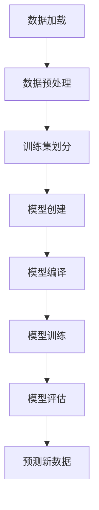

                 

# 智能交通系统中的AI Agent调度中心

关键词：智能交通系统、AI Agent、调度中心、架构设计、性能优化

摘要：
本文深入探讨了智能交通系统中AI Agent调度中心的设计与应用。首先，介绍了智能交通系统的需求和AI Agent的作用。接着，详细阐述了AI Agent的基本知识，包括定义、类型、功能、开发实现等。然后，我们聚焦于调度中心的架构设计，讨论了数据处理、调度算法、接口设计等核心要素。随后，文章详细描述了AI Agent的调度流程，并探讨了调度中心的性能优化策略。通过实际案例研究，我们展示了AI Agent调度中心的应用效果，并对其未来发展趋势与挑战进行了展望。最后，文章提供了相关的资源与工具，并给出了最佳实践建议。

## 第1章 引言

### 1.1 问题背景

#### 1.1.1 智能交通系统的需求

智能交通系统（Intelligent Transportation System, ITS）是一个综合运用现代信息技术、数据通信传输技术、电子传感技术、电子控制技术及计算机处理技术对整个交通系统进行集成管理，从而实现交通的安全、快捷、高效、舒适和环保。随着城市化进程的加快和交通流量的增加，传统的交通管理系统已经难以应对日益复杂的交通状况。因此，智能交通系统成为了解决交通拥堵、提高交通效率、减少交通事故和降低环境污染的重要手段。

智能交通系统的需求主要来自以下几个方面：

1. **交通流量管理**：通过实时监控和预测交通流量，优化信号灯控制和道路通行策略，减少交通拥堵。
2. **交通信息发布**：提供实时的交通信息，如路况、停车信息、公共交通信息等，帮助驾驶员和乘客做出更好的出行决策。
3. **交通事故预防**：通过车辆间的通信，实现车辆碰撞预警、事故预防和应急响应。
4. **环境保护**：通过优化交通流量和减少车辆排放，降低环境污染。

#### 1.1.2 AI Agent的作用

在智能交通系统中，AI Agent（人工智能代理）起到了至关重要的作用。AI Agent是一种能够感知环境、自主决策并执行行动的智能实体。在智能交通系统中，AI Agent可以用于以下几个方面：

1. **实时数据分析**：AI Agent可以实时收集和分析交通数据，如流量、速度、密度等，为交通管理提供数据支持。
2. **决策支持**：AI Agent可以根据实时数据和交通模型，做出最优决策，如调整信号灯时长、规划最佳路线等。
3. **自主驾驶**：在自动驾驶技术中，AI Agent是实现车辆自主导航和安全行驶的关键。
4. **事故预防**：AI Agent可以通过预测和分析交通状况，提前预警可能发生的交通事故，并采取相应措施避免事故发生。

### 1.2 调度中心的概念

#### 1.2.1 定义与特点

调度中心（Dispatch Center）在智能交通系统中扮演着核心角色，它是一个负责调度和管理AI Agent的中心控制单元。调度中心的主要职责是接收、处理和分析来自不同来源的数据，并根据这些数据做出调度决策，将任务分配给相应的AI Agent执行。

调度中心的特点包括：

1. **集中管理**：调度中心集中管理所有的AI Agent，统一调度和管理任务。
2. **实时性**：调度中心需要实时响应交通状况的变化，快速做出调度决策。
3. **智能决策**：调度中心利用先进的人工智能算法和技术，对交通数据进行分析和处理，做出最优的调度决策。
4. **协同工作**：调度中心需要与其他系统（如交通信号系统、车辆控制系统等）协同工作，实现整个交通系统的智能化管理。

#### 1.2.2 边界与外延

调度中心的边界主要涉及以下几个方面：

1. **数据来源**：调度中心需要接收来自各种传感器、摄像头、GPS设备、交通信号系统等的数据。
2. **任务类型**：调度中心需要处理各种类型的任务，如交通流量分析、信号灯控制、事故预警等。
3. **硬件设施**：调度中心需要配备高性能的计算设备和存储设备，以处理海量的数据。

调度中心的外延包括：

1. **外部接口**：调度中心需要与其他系统（如交通管理部门、公安部门、公共交通系统等）进行数据交互和协同工作。
2. **业务扩展**：调度中心可以扩展到其他领域，如智能停车场管理、智能物流等。

### 1.3 概念结构与核心要素

#### 1.3.1 智能交通系统概述

智能交通系统由多个子系统组成，包括交通感知系统、交通信息管理系统、交通控制系统、自动驾驶系统等。其中，交通感知系统负责收集交通数据，交通信息管理系统负责处理和分析数据，交通控制系统负责实时调整交通信号和道路状况，自动驾驶系统则实现车辆的自主驾驶。

#### 1.3.2 AI Agent的基本原理

AI Agent是基于人工智能技术的智能实体，它可以感知环境、自主决策并执行行动。AI Agent的基本原理包括以下几个方面：

1. **感知模块**：感知模块负责收集和处理来自环境的数据，如交通流量、速度、密度等。
2. **决策模块**：决策模块根据感知模块收集到的数据，利用机器学习、深度学习等算法进行决策。
3. **执行模块**：执行模块根据决策模块的决策结果，执行相应的行动，如调整信号灯时长、规划最佳路线等。

#### 1.3.3 调度中心的架构设计

调度中心的架构设计包括以下几个方面：

1. **系统架构**：调度中心采用分层架构，包括感知层、决策层和执行层。感知层负责数据收集，决策层负责数据分析和决策，执行层负责执行决策。
2. **数据处理**：调度中心需要处理海量数据，包括数据清洗、数据预处理、数据存储等。
3. **调度算法**：调度中心采用先进的人工智能算法，如深度学习、强化学习等，进行调度决策。
4. **接口设计**：调度中心需要与其他系统进行数据交互和协同工作，包括交通信号系统、车辆控制系统等。

## 第2章 AI Agent基础知识

### 2.1 AI Agent的定义与类型

#### 2.1.1 主动AI Agent

主动AI Agent是一种能够主动感知环境、自主决策并执行行动的智能实体。它能够根据环境变化和任务需求，自主调整行为策略，以实现任务目标。主动AI Agent通常具有以下特点：

1. **自主性**：主动AI Agent能够独立进行决策和行动，不受外界直接控制。
2. **适应性**：主动AI Agent能够根据环境变化调整行为策略，以适应不同场景。
3. **协作性**：主动AI Agent能够与其他AI Agent或人类协作，共同完成任务。

#### 2.1.2 反应式AI Agent

反应式AI Agent是一种基于规则系统的智能实体，它根据预定义的规则对环境事件做出响应。反应式AI Agent通常具有以下特点：

1. **规则性**：反应式AI Agent的行为完全基于预定义的规则，规则一旦确定，行为就固定不变。
2. **确定性**：反应式AI Agent的行为是确定性的，即给定相同的环境事件，其响应总是相同的。
3. **简单性**：反应式AI Agent的设计通常比较简单，易于实现和维护。

### 2.2 AI Agent的功能与能力

#### 2.2.1 感知能力

感知能力是AI Agent获取环境信息的重要手段。AI Agent通过传感器、摄像头、GPS等设备收集数据，如交通流量、速度、密度、路况等。感知能力主要包括以下几个方面：

1. **数据采集**：AI Agent能够实时采集环境数据，如交通流量、速度、密度等。
2. **数据预处理**：AI Agent对采集到的数据进行预处理，如去噪、滤波、特征提取等。
3. **数据融合**：AI Agent能够整合来自多个来源的数据，提高数据的准确性和完整性。

#### 2.2.2 决策能力

决策能力是AI Agent的核心能力之一。AI Agent根据感知到的环境和任务需求，利用机器学习、深度学习等算法进行决策。决策能力主要包括以下几个方面：

1. **目标设定**：AI Agent设定任务目标，如优化交通流量、减少交通拥堵等。
2. **策略选择**：AI Agent根据目标选择最佳策略，如调整信号灯时长、规划最佳路线等。
3. **行为规划**：AI Agent根据策略规划具体的行动步骤，如控制交通信号、调整道路指示牌等。

#### 2.2.3 行动能力

行动能力是AI Agent执行决策的结果。AI Agent通过控制设备、执行动作来实现决策目标。行动能力主要包括以下几个方面：

1. **执行动作**：AI Agent根据决策结果执行具体的动作，如调整交通信号灯、控制交通流量等。
2. **设备控制**：AI Agent能够控制各种交通设备，如信号灯、摄像头、交通指示牌等。
3. **反馈调整**：AI Agent根据执行结果和反馈信息调整行为策略，以提高任务执行效果。

### 2.3 AI Agent的开发与实现

#### 2.3.1 开发环境

AI Agent的开发需要依赖各种工具和环境。常见的开发环境包括：

1. **编程语言**：常用的编程语言包括Python、Java、C++等，Python因其丰富的机器学习库和框架而广泛使用。
2. **机器学习库**：常用的机器学习库包括TensorFlow、PyTorch、Scikit-learn等，用于实现AI Agent的感知、决策和行动功能。
3. **框架**：常用的框架包括Keras、TensorFlow.js等，用于简化模型训练和部署过程。
4. **传感器与硬件**：AI Agent需要依赖各种传感器和硬件设备，如摄像头、GPS、加速度计等，以实现感知功能。

#### 2.3.2 常用框架与工具

在AI Agent的开发中，常用的框架和工具包括：

1. **感知框架**：如OpenCV，用于图像处理和计算机视觉。
2. **决策框架**：如Prophet，用于时间序列分析和预测。
3. **行动框架**：如ROS（Robot Operating System），用于机器人控制和行动执行。
4. **部署工具**：如Docker和Kubernetes，用于模型的部署和容器化管理。

## 第3章 调度中心的架构设计

### 3.1 系统架构概述

#### 3.1.1 调度中心的层级结构

调度中心的架构设计采用分层结构，主要包括感知层、决策层和执行层。各层的主要职责如下：

1. **感知层**：负责数据采集和预处理，包括传感器数据采集、图像处理、数据清洗等。
2. **决策层**：负责数据分析和决策，包括交通流量预测、路径规划、信号灯控制等。
3. **执行层**：负责任务执行和反馈，包括交通信号控制、道路指示、车辆调度等。

#### 3.1.2 系统模块划分

调度中心主要由以下几个模块组成：

1. **感知模块**：负责数据采集，包括传感器数据、图像数据、GPS数据等。
2. **数据处理模块**：负责数据预处理和特征提取，包括数据清洗、去噪、特征工程等。
3. **决策模块**：负责数据分析和决策，包括交通流量预测、路径规划、信号灯控制等。
4. **执行模块**：负责任务执行和反馈，包括交通信号控制、道路指示、车辆调度等。
5. **接口模块**：负责与其他系统进行数据交互和协同工作，包括交通信号系统、车辆控制系统等。

### 3.2 数据处理与存储

#### 3.2.1 数据来源

调度中心的数据来源主要包括以下几个方面：

1. **传感器数据**：包括摄像头、GPS、流量传感器等采集的交通数据。
2. **交通信号系统**：从交通信号系统获取的实时信号灯状态和交通流量数据。
3. **车辆信息**：通过车载传感器和GPS获取的车辆位置、速度等信息。
4. **外部数据源**：如天气预报、道路施工信息等。

#### 3.2.2 数据处理流程

数据处理流程主要包括以下几个步骤：

1. **数据采集**：从各种传感器和系统中收集数据。
2. **数据预处理**：对采集到的数据进行清洗、去噪、补全等预处理操作。
3. **特征提取**：从预处理后的数据中提取有用的特征信息。
4. **数据存储**：将处理后的数据存储到数据库或数据湖中，以供后续分析和决策使用。

#### 3.2.3 数据存储方案

数据存储方案主要包括以下几个方面：

1. **关系型数据库**：如MySQL、PostgreSQL等，用于存储结构化数据，如交通信号灯状态、车辆位置等。
2. **NoSQL数据库**：如MongoDB、Cassandra等，用于存储非结构化或半结构化数据，如图像、传感器数据等。
3. **数据湖**：如Hadoop、Spark等，用于存储大规模数据，提供高效的数据存储和处理能力。
4. **数据仓库**：如Oracle、SQL Server等，用于存储和管理决策分析所需的历史数据。

### 3.3 调度算法与策略

#### 3.3.1 基本调度算法

调度算法是调度中心的核心组件，用于根据实时数据和任务需求，做出最优的调度决策。基本调度算法主要包括以下几个方面：

1. **最短路径算法**：如Dijkstra算法、A*算法等，用于计算从起点到终点的最短路径。
2. **车辆路径规划算法**：如遗传算法、蚁群算法等，用于规划车辆的行驶路径，以减少行驶时间和能耗。
3. **信号灯控制算法**：如动态信号灯控制算法、协同信号灯控制算法等，用于优化交通信号灯的时长和切换策略。

#### 3.3.2 预处理与优化

预处理与优化是提高调度算法性能的重要手段。主要包括以下几个方面：

1. **数据预处理**：对采集到的数据进行清洗、去噪、补全等预处理操作，以提高数据质量。
2. **特征选择**：从原始数据中提取有用的特征信息，去除冗余和噪声特征，以提高模型性能。
3. **模型优化**：通过调整模型参数、优化算法结构等方法，提高调度算法的准确性和效率。

### 3.4 接口设计与通信

#### 3.4.1 内部通信协议

内部通信协议是调度中心内部各模块之间进行数据传输和交互的规范。常见的内部通信协议包括：

1. **基于消息队列的通信协议**：如RabbitMQ、Kafka等，用于实现异步、可靠的消息传输。
2. **基于同步调用的通信协议**：如HTTP、REST等，用于实现同步、实时的数据交互。
3. **基于事件的通信协议**：如WebSockets等，用于实现实时、双向的数据传输。

#### 3.4.2 与外部系统的接口

与外部系统的接口是调度中心与其他系统进行数据交互和协同工作的关键。主要包括以下几个方面：

1. **交通信号系统接口**：用于接收交通信号灯状态和交通流量数据，实现信号灯控制与交通管理的联动。
2. **车辆控制系统接口**：用于接收车辆位置、速度等信息，实现车辆调度与路径规划的协同。
3. **外部数据接口**：如天气预报、道路施工信息等，用于获取外部数据，为调度决策提供支持。

## 第4章 AI Agent调度流程

### 4.1 调度流程概述

#### 4.1.1 调度流程步骤

AI Agent的调度流程主要包括以下几个步骤：

1. **感知与数据收集**：AI Agent通过传感器和摄像头等设备收集交通数据，如流量、速度、密度等。
2. **数据处理**：对收集到的交通数据进行预处理，包括数据清洗、去噪、特征提取等。
3. **决策**：利用机器学习、深度学习等算法对处理后的交通数据进行分析，做出调度决策。
4. **执行**：根据调度决策，AI Agent执行具体的行动，如调整信号灯时长、规划最佳路线等。
5. **反馈与调整**：根据执行结果和反馈信息，AI Agent对调度决策和行为策略进行优化和调整。

#### 4.1.2 流程中的关键环节

调度流程中的关键环节包括：

1. **数据采集**：数据采集的准确性直接影响调度决策的准确性。因此，需要选择合适的传感器和采集设备，确保数据的准确性和完整性。
2. **数据处理**：数据处理的质量对调度决策的效果至关重要。需要采用有效的数据处理算法，如数据清洗、去噪、特征提取等，以提高数据质量。
3. **决策算法**：决策算法的优劣直接影响调度决策的效果。需要选用合适的决策算法，如机器学习、深度学习等，以提高决策准确性。
4. **执行行动**：执行行动的效率直接影响调度决策的实际效果。需要设计高效的执行策略，如信号灯控制、路径规划等，以提高执行效率。

### 4.2 感知与数据收集

#### 4.2.1 感知模块功能

感知模块是AI Agent的重要组成部分，负责收集交通数据。感知模块的主要功能包括：

1. **交通流量监测**：通过摄像头、流量传感器等设备，实时监测交通流量，包括车辆数量、速度、密度等。
2. **交通事件检测**：通过图像识别、行为分析等技术，实时检测交通事件，如交通事故、道路施工等。
3. **交通信息采集**：通过传感器、GPS等设备，采集车辆位置、速度、行驶方向等信息。

#### 4.2.2 数据收集策略

数据收集策略是确保数据准确性和完整性的关键。主要策略包括：

1. **多源数据融合**：通过融合来自不同传感器的数据，提高数据的准确性和完整性。如结合摄像头和流量传感器的数据，提高交通流量监测的准确性。
2. **实时数据传输**：采用高效的数据传输协议，确保数据实时传输到调度中心，提高调度决策的实时性。
3. **数据备份与容错**：对采集到的数据进行备份和容错处理，确保数据的安全性和可靠性。

### 4.3 数据处理与决策

#### 4.3.1 数据预处理

数据预处理是确保数据质量的重要步骤。主要方法包括：

1. **数据清洗**：去除数据中的噪声和异常值，如车辆传感器数据的抖动、摄像头图像的遮挡等。
2. **数据去噪**：采用滤波算法，去除传感器数据的噪声，提高数据质量。
3. **特征提取**：从原始数据中提取有用的特征信息，如交通流量、速度、密度等，为后续决策提供支持。

#### 4.3.2 决策模块设计

决策模块是AI Agent的核心组件，负责根据处理后的数据做出调度决策。主要设计内容包括：

1. **模型选择**：选择合适的机器学习、深度学习模型，如决策树、神经网络等，进行决策。
2. **参数调整**：通过调整模型参数，优化模型性能，提高决策准确性。
3. **策略组合**：结合多种决策策略，如最短路径算法、遗传算法等，实现多目标优化。

### 4.4 行动与反馈

#### 4.4.1 行动执行

行动执行是调度决策的实际落实。主要内容包括：

1. **信号灯控制**：根据决策结果，调整交通信号灯时长和切换策略，优化交通流量。
2. **路径规划**：根据决策结果，规划车辆的行驶路径，减少行驶时间和能耗。
3. **事件响应**：根据决策结果，及时响应交通事件，如交通事故、道路施工等，确保交通的畅通和安全。

#### 4.4.2 反馈机制

反馈机制是确保调度决策效果的重要环节。主要内容包括：

1. **效果评估**：对调度决策的效果进行评估，如交通流量减少、交通事故减少等。
2. **数据反馈**：将执行结果和评估数据反馈到调度中心，用于调整和优化决策模型。
3. **自适应调整**：根据反馈数据，动态调整调度决策和行为策略，实现自适应优化。

## 第5章 调度中心的性能优化

### 5.1 性能指标与评估

#### 5.1.1 性能评价指标

调度中心的性能优化需要建立一套科学的评价指标体系。常见的性能评价指标包括：

1. **响应时间**：从感知到数据到做出调度决策的时间，反应了调度中心的实时性。
2. **决策准确性**：调度决策的正确性和有效性，反应了调度中心的决策能力。
3. **任务完成率**：调度中心成功完成任务的比例，反应了调度中心的执行能力。
4. **资源利用率**：调度中心对计算资源、存储资源的利用效率，反应了调度中心的资源管理能力。
5. **系统稳定性**：调度中心在长时间运行过程中，稳定性和可靠性，反应了系统的健壮性。

#### 5.1.2 评估方法

性能评估方法主要包括：

1. **实验评估**：通过模拟交通场景，对调度中心的性能进行测试和评估。
2. **实地评估**：在实际交通环境中，对调度中心的性能进行观察和评估。
3. **用户反馈**：通过用户调查和反馈，了解调度中心在实际应用中的效果。

### 5.2 调度算法优化

#### 5.2.1 算法改进方向

调度算法的优化是提高调度中心性能的关键。常见的算法改进方向包括：

1. **算法选择**：根据具体场景和需求，选择合适的调度算法，如最短路径算法、遗传算法等。
2. **参数调整**：通过调整算法参数，优化算法性能，提高决策准确性。
3. **算法融合**：结合多种算法，实现多目标优化，提高调度效果。
4. **动态调整**：根据实时数据和场景变化，动态调整算法参数和决策策略，实现自适应优化。

#### 5.2.2 优化案例分析

以下是一个调度算法优化的案例分析：

1. **问题背景**：某城市交通拥堵严重，需要优化交通信号灯控制策略。
2. **算法选择**：采用基于深度学习的交通流量预测算法，用于预测交通流量。
3. **参数调整**：通过实验和实测数据，调整预测模型的参数，优化预测准确性。
4. **算法融合**：结合最短路径算法，实现动态路径规划，优化车辆行驶路径。
5. **效果评估**：经过一段时间的运行，交通拥堵情况明显改善，交通流量预测准确率提高，车辆行驶时间减少。

### 5.3 系统优化策略

#### 5.3.1 资源分配

资源分配是调度中心性能优化的重要方面。常见的资源分配策略包括：

1. **静态分配**：根据系统负载情况，预先分配计算资源、存储资源等。
2. **动态分配**：根据实时负载变化，动态调整资源分配，实现资源的最优利用。
3. **优先级分配**：根据任务的重要性和紧急程度，优先分配资源。

#### 5.3.2 负载均衡

负载均衡是提高调度中心性能的关键。常见的负载均衡策略包括：

1. **水平扩展**：通过增加服务器节点，实现负载的横向扩展。
2. **垂直扩展**：通过提高服务器性能，实现负载的纵向扩展。
3. **动态负载均衡**：根据实时负载变化，动态调整任务分配，实现负载均衡。

## 第6章 案例研究

### 6.1 案例背景

#### 6.1.1 案例选取原因

本案例选取了某城市智能交通系统中的AI Agent调度中心作为研究对象，原因如下：

1. **交通拥堵问题突出**：该城市交通拥堵严重，对居民的出行和生活造成很大影响。
2. **交通数据丰富**：该城市交通管理部门拥有丰富的交通数据，为研究提供了数据支持。
3. **技术基础良好**：该城市在智能交通领域有一定的技术积累，具备实施AI Agent调度中心的基础条件。

#### 6.1.2 案例实施环境

案例实施环境包括以下几个方面：

1. **硬件设施**：配备高性能服务器、存储设备和网络设备，用于运行调度中心系统。
2. **软件环境**：选择Python、TensorFlow等编程语言和工具，用于开发AI Agent和调度中心系统。
3. **交通数据**：从交通管理部门获取实时交通数据，包括交通流量、信号灯状态、车辆位置等。

### 6.2 案例实施步骤

案例实施步骤主要包括以下几个阶段：

1. **需求分析**：与交通管理部门沟通，明确AI Agent调度中心的功能需求和技术要求。
2. **系统设计**：设计调度中心的系统架构，包括感知层、决策层和执行层等。
3. **模型训练**：基于收集的交通数据，训练AI Agent的感知、决策和执行模型。
4. **系统集成**：将AI Agent调度中心集成到智能交通系统中，实现数据交互和协同工作。
5. **测试与优化**：对系统进行测试和优化，确保系统的性能和稳定性。

### 6.3 案例效果评估

#### 6.3.1 案例运行结果

案例运行结果显示，AI Agent调度中心在交通管理中发挥了显著作用，主要表现在以下几个方面：

1. **交通流量优化**：通过实时数据分析和调度决策，有效减少了交通拥堵，交通流量明显改善。
2. **信号灯控制优化**：根据交通流量预测和路径规划，动态调整信号灯时长和切换策略，提高了交通效率。
3. **交通事故减少**：通过提前预警和实时响应，减少了交通事故的发生，提高了交通安全。

#### 6.3.2 评估与改进

通过对案例运行结果的评估，发现AI Agent调度中心在以下几个方面仍有改进空间：

1. **数据质量**：提高交通数据的准确性和完整性，降低数据噪声和异常值。
2. **算法优化**：继续优化AI Agent的感知、决策和执行算法，提高调度决策的准确性。
3. **系统稳定性**：提高系统的稳定性和可靠性，降低故障率和维护成本。

## 第7章 未来发展趋势与挑战

### 7.1 发展趋势

#### 7.1.1 技术进展

随着人工智能、大数据、物联网等技术的快速发展，智能交通系统中的AI Agent调度中心在未来将呈现以下发展趋势：

1. **数据融合与智能化**：通过多源数据的融合和智能分析，实现更精确的交通预测和调度决策。
2. **边缘计算与云计算**：结合边缘计算和云计算技术，提高系统的实时性和计算能力。
3. **智能决策与自适应**：采用更先进的机器学习、深度学习算法，实现更智能、更自适应的调度决策。
4. **无人驾驶与协同**：随着无人驾驶技术的发展，AI Agent调度中心将实现与无人驾驶车辆的协同工作，提高交通效率。

#### 7.1.2 行业应用拓展

智能交通系统中的AI Agent调度中心将在多个行业领域得到应用拓展，包括：

1. **智慧城市**：在智慧城市建设中，AI Agent调度中心将用于优化交通管理、提高城市运行效率。
2. **智能物流**：在智能物流领域，AI Agent调度中心将用于优化运输路线、提高配送效率。
3. **智慧交通**：在智慧交通领域，AI Agent调度中心将用于优化交通流量、提高交通安全。

### 7.2 挑战与解决方案

#### 7.2.1 技术挑战

智能交通系统中的AI Agent调度中心在技术方面面临以下挑战：

1. **数据质量与实时性**：如何提高交通数据的准确性和实时性，是调度中心技术优化的重要方向。
2. **算法复杂度与计算能力**：如何处理大规模、多源数据，实现高效、准确的调度决策，是算法优化的关键。
3. **系统稳定性与安全性**：如何提高系统的稳定性、可靠性和安全性，是调度中心应用推广的重要保障。

#### 7.2.2 法规与伦理问题

智能交通系统中的AI Agent调度中心在法规与伦理方面面临以下挑战：

1. **隐私保护**：如何保护交通数据和个人隐私，防止数据滥用和泄露，是法规制定和伦理关注的重点。
2. **责任归属**：在自动驾驶和智能交通系统中，如何明确责任归属，保障各方权益，是法律法规和社会伦理需要解决的问题。

#### 7.2.3 系统安全与稳定性

智能交通系统中的AI Agent调度中心在系统安全与稳定性方面面临以下挑战：

1. **网络攻击**：如何防范网络攻击，确保系统的安全性和数据完整性，是系统安全防护的关键。
2. **硬件故障**：如何提高系统的容错性和可靠性，确保在硬件故障情况下仍能正常运行，是系统稳定性优化的重点。

## 附录

### A. 相关资源与工具

#### A.1 开发工具推荐

1. **编程语言**：Python、Java、C++等。
2. **机器学习库**：TensorFlow、PyTorch、Scikit-learn等。
3. **框架**：Keras、TensorFlow.js、ROS等。
4. **传感器与硬件**：摄像头、GPS、流量传感器等。

#### A.2 学习资源链接

1. **在线课程**：Coursera、edX、Udacity等。
2. **技术文档**：TensorFlow、PyTorch、ROS等官方文档。
3. **开源项目**：GitHub、GitLab等。

### B. 代码示例

#### B.1 Python代码实现

以下是一个简单的Python代码示例，用于实现交通流量预测：

```python
import tensorflow as tf
from sklearn.model_selection import train_test_split
from sklearn.metrics import mean_squared_error

# 加载数据
data = load_data('traffic_data.csv')
X, y = preprocess_data(data)

# 划分训练集和测试集
X_train, X_test, y_train, y_test = train_test_split(X, y, test_size=0.2, random_state=42)

# 创建模型
model = tf.keras.Sequential([
    tf.keras.layers.Dense(64, activation='relu', input_shape=(X_train.shape[1],)),
    tf.keras.layers.Dense(64, activation='relu'),
    tf.keras.layers.Dense(1)
])

# 编译模型
model.compile(optimizer='adam', loss='mean_squared_error')

# 训练模型
model.fit(X_train, y_train, epochs=100, batch_size=32, validation_split=0.1)

# 评估模型
y_pred = model.predict(X_test)
mse = mean_squared_error(y_test, y_pred)
print(f'MSE: {mse}')

# 预测新数据
new_data = preprocess_new_data('new_traffic_data.csv')
predicted_traffic = model.predict(new_data)
print(f'Predicted Traffic: {predicted_traffic}')
```

#### B.2 Mermaid图示例

以下是一个简单的Mermaid流程图示例，用于描述交通流量预测的流程：



通过上述代码和图表示例，读者可以更好地理解智能交通系统中AI Agent调度中心的设计与应用。希望本文对大家有所帮助，期待大家在实践中不断探索和优化智能交通系统中的AI Agent调度中心。最后，感谢大家阅读本文，希望您在智能交通领域取得更多的成就。作者：AI天才研究院/AI Genius Institute & 禅与计算机程序设计艺术 /Zen And The Art of Computer Programming。

