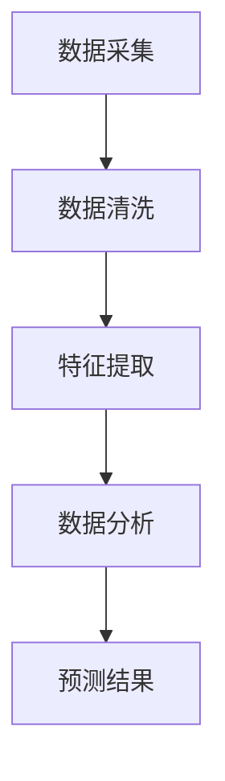
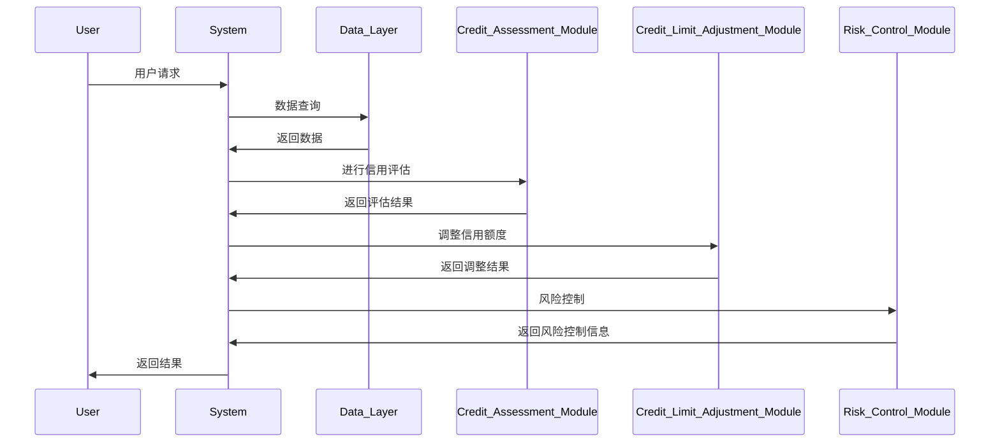
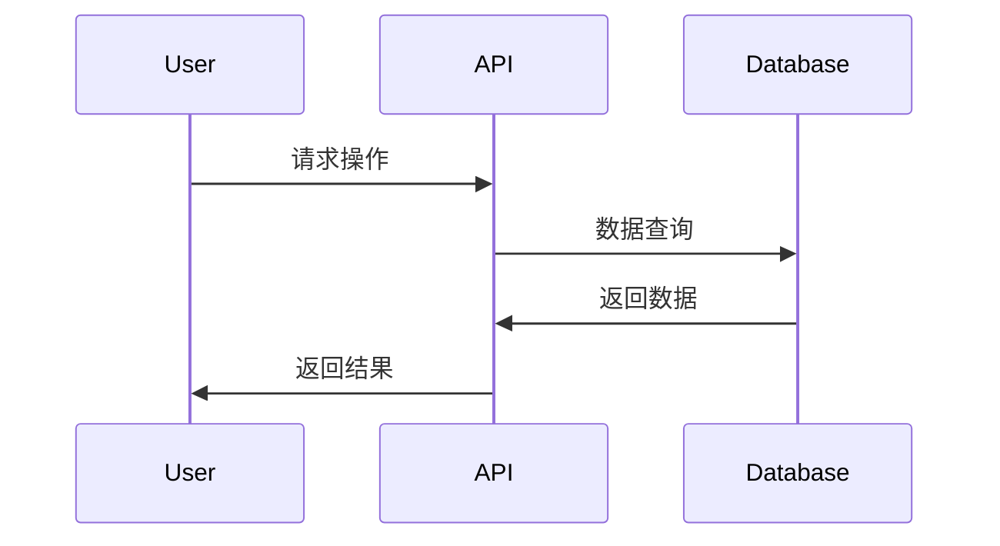
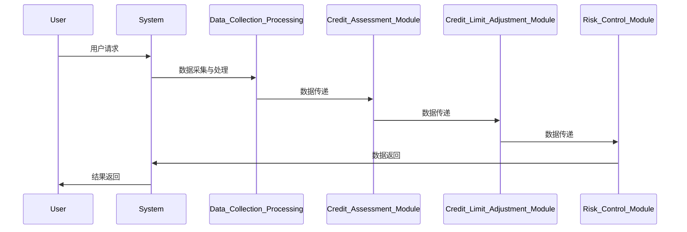

                 

# 智能企业信用额度动态调整与控制系统

## 关键词

智能企业，信用额度，动态调整，信用风险评估，风险控制，实时数据分析，人工智能算法，大数据技术

## 摘要

本文旨在探讨智能企业信用额度动态调整与控制系统的构建和应用。通过深入分析市场背景和问题描述，本文提出了一种基于实时数据分析和人工智能算法的信用额度动态调整机制，以及相应的风险控制方法。文章详细阐述了系统的核心组成部分、概念结构与核心要素组成，并讲解了实时数据分析算法的原理和应用。此外，本文还介绍了系统的分析与架构设计方案，并通过实际案例进行了深入剖析。文章最后给出了项目的最佳实践和拓展阅读，旨在为相关领域的研究者提供有价值的参考。

## 第一部分：背景介绍

### 1.1 问题背景

在当今的商业环境中，企业面临着复杂的市场动态和多样化的客户需求，这要求企业能够快速、准确地做出决策，以确保其持续发展。特别是企业的信用额度管理，它不仅影响企业的财务状况，还直接影响企业的运营效率和竞争力。

传统的方法通常基于静态的财务数据和信用评估模型，难以适应快速变化的市场环境。这种静态方法可能导致信用额度过高，增加了企业的信用风险；或者信用额度过低，限制了企业的运营资金。因此，迫切需要一种能够动态调整信用额度的系统，以帮助企业更好地管理信用风险，提高资金使用效率。

### 1.2 问题描述

智能企业信用额度动态调整与控制系统旨在解决以下问题：

1. **信用风险评估不准确**：传统方法无法及时捕捉市场变化，导致信用风险评估不准确。
2. **信用额度调整不及时**：由于依赖静态数据，企业难以在市场波动时迅速调整信用额度。
3. **信用风险控制难度大**：随着业务规模和复杂性的增加，企业难以全面、准确地控制信用风险。

### 1.3 问题解决

智能企业信用额度动态调整与控制系统通过以下方式解决问题：

1. **实时数据分析**：利用大数据技术和人工智能算法，实时分析市场动态和企业内部数据，为企业提供准确的信用风险评估。
2. **动态调整机制**：基于实时数据分析，系统可以自动调整企业的信用额度，以适应市场变化和企业需求。
3. **风险控制与管理**：系统提供全面的信用风险控制功能，帮助企业及时发现和应对潜在风险。

### 1.4 边界与外延

智能企业信用额度动态调整与控制系统不仅适用于大型企业，也适用于中小型企业。它可以帮助企业实现信用额度的自动化管理，提高运营效率和竞争力。此外，系统还可以与其他企业管理系统（如财务系统、供应链系统等）集成，实现更全面的企业管理。

### 1.5 概念结构与核心要素组成

智能企业信用额度动态调整与控制系统包括以下几个核心组成部分：

1. **数据采集与处理模块**：负责收集和处理与信用额度相关的数据，包括企业内部数据和外部市场数据。
2. **信用评估模块**：利用大数据分析和人工智能算法，对企业的信用风险进行评估。
3. **额度调整模块**：根据信用评估结果，自动调整企业的信用额度。
4. **风险控制模块**：提供风险预警和风险控制功能，帮助企业及时发现和应对信用风险。

### 1.6 核心概念与联系

#### 1.6.1 智能企业

**定义**：智能企业是指利用信息技术和人工智能技术，实现企业运营和管理智能化的一种企业形态。

**属性特征**：

- **数据处理能力**：智能企业能够高效地处理海量数据，实现数据的实时分析和应用。
- **自适应能力**：智能企业能够根据市场变化和内部需求，自动调整其运营策略和管理模式。
- **智能化水平**：智能企业的智能化水平较高，能够实现自动化决策和智能管理。

**对比表格**：

| 特征 | 智能企业 | 传统企业 |
| --- | --- | --- |
| 数据处理能力 | 高效处理海量数据 | 处理能力有限 |
| 自适应能力 | 自动调整运营策略 | 需人工调整策略 |
| 智能化水平 | 高度智能化 | 依赖人工管理 |

**ER实体关系图架构**：

```mermaid
erDiagram
  Customer ||--|{ Credit_Rating }
  Company ||--|{ Credit_Limit }
  Credit_Rating ||--|{ Credit_Score }
  Market_Database ||--|{ Market_Indicator }
```

#### 1.6.2 信用额度

**定义**：信用额度是指企业或个人在金融机构或其他信用提供方处获得的贷款额度。

**属性特征**：

- **额度大小**：信用额度的大小通常取决于企业的财务状况、信用记录和市场状况。
- **额度类型**：信用额度可以分为固定信用额度和动态信用额度，其中动态信用额度可以根据企业需求和市场变化进行调整。

**对比表格**：

| 特征 | 固定信用额度 | 动态信用额度 |
| --- | --- | --- |
| 额度大小 | 静态确定 | 动态调整 |
| 额度类型 | 固定不变 | 可以调整 |

**ER实体关系图架构**：

```mermaid
erDiagram
  Credit_Limit ||--|{ Credit_Account }
  Company ||--|{ Credit_Limit }
```

#### 1.6.3 动态调整

**定义**：动态调整是指根据实时数据和市场变化，自动调整企业的信用额度。

**属性特征**：

- **实时性**：动态调整能够实时响应市场变化，提高信用额度的准确性和适应性。
- **自动化**：动态调整通过算法和系统实现，能够自动执行，减少人为干预。

**对比表格**：

| 特征 | 动态调整 | 静态调整 |
| --- | --- | --- |
| 实时性 | 实时响应 | 非实时 |
| 自动化 | 自动执行 | 人工执行 |

**ER实体关系图架构**：

```mermaid
erDiagram
  Dynamic_Adjustment ||--|{ Credit_Limit }
  Market_Data ||--|{ Dynamic_Adjustment }
```

#### 1.6.4 风险控制

**定义**：风险控制是指企业为了降低信用风险，采取的一系列预防和控制措施。

**属性特征**：

- **预警机制**：风险控制系统能够实时监控信用风险，并提供预警。
- **控制措施**：风险控制包括调整信用额度、限制贷款额度、增加担保等措施。

**对比表格**：

| 特征 | 预警机制 | 控制措施 |
| --- | --- | --- |
| 预警机制 | 实时监控 | 无预警 |
| 控制措施 | 调整信用额度、限制贷款额度、增加担保 | 无控制措施 |

**ER实体关系图架构**：

```mermaid
erDiagram
  Risk_Control_System ||--|{ Credit_Limit }
  Warning_System ||--|{ Risk_Control_System }
```

### 1.7 主流算法原理讲解

#### 1.7.1 实时数据分析算法

**算法原理**：

实时数据分析算法是智能企业信用额度动态调整与控制系统的核心。它主要利用大数据技术和机器学习算法，对海量的企业内部数据和外部市场数据进行分析，提取有用的信息，为企业提供实时的信用风险评估。

**算法流程**：

1. **数据采集**：从企业内部系统和外部数据源收集相关数据。
2. **数据清洗**：对采集到的数据进行预处理，包括去重、过滤和格式化。
3. **特征提取**：从清洗后的数据中提取与信用额度相关的特征，如财务指标、市场指标等。
4. **数据分析**：利用机器学习算法，对提取的特征进行建模和预测。

**算法流程 Mermaid 图**：



**Python 源代码示例**：

```python
import pandas as pd
from sklearn.ensemble import RandomForestClassifier
from sklearn.model_selection import train_test_split
from sklearn.metrics import accuracy_score

# 数据采集
data = pd.read_csv('credit_data.csv')

# 数据清洗
data = data.drop_duplicates()
data = data.drop(['unnamed'], axis=1)

# 特征提取
features = data[['financial_index', 'market_index']]
labels = data['credit_risk']

# 数据分析
X_train, X_test, y_train, y_test = train_test_split(features, labels, test_size=0.2, random_state=42)

model = RandomForestClassifier(n_estimators=100)
model.fit(X_train, y_train)

# 预测结果
predictions = model.predict(X_test)
accuracy = accuracy_score(y_test, predictions)

print(f'模型准确率：{accuracy}')
```

**数学模型与公式**：

$$
\text{预测结果} = f(\text{特征向量})
$$

其中，$f$ 表示机器学习模型，如随机森林（Random Forest）。

**算法举例说明**：

假设我们有一个包含企业财务指标和市场指标的样本数据，使用随机森林算法进行信用风险评估。我们首先从数据中提取特征，然后训练模型，最后使用模型对新的数据进行预测。例如，对于一个新的企业样本，我们提取其财务指标（如利润率、负债率）和市场指标（如行业增长率、市场波动率），然后使用训练好的模型进行预测，得到其信用风险评分。

## 第二部分：系统分析与架构设计

### 2.1 问题场景介绍

在现代商业环境中，企业需要快速应对市场变化，优化其信用额度管理策略。传统的信用额度管理方法由于依赖静态数据和手工操作，难以满足快速变化的需求，导致企业信用风险增加、资金使用效率低下。为了解决这一问题，我们提出构建一个智能企业信用额度动态调整与控制系统，通过实时数据分析、智能决策和自动化调整，实现信用额度的优化管理。

### 2.2 项目介绍

**项目名称**：智能企业信用额度动态调整与控制系统

**项目目标**：构建一个能够实时分析企业信用风险、动态调整信用额度、提供风险控制功能的管理系统，以提高企业信用风险控制能力、提升资金使用效率。

**项目背景**：随着商业环境的复杂化和市场竞争的加剧，企业面临的风险日益增加。传统的信用额度管理方法已经无法满足企业对快速、准确决策的需求。为了应对这一挑战，本项目旨在利用大数据技术和人工智能算法，构建一个智能化的信用额度管理平台，帮助企业实现信用风险的动态调整和有效控制。

### 2.3 系统功能设计

#### 2.3.1 领域模型

**领域模型**：领域模型用于描述系统中的关键实体及其关系。在智能企业信用额度动态调整与控制系统中，关键实体包括企业、信用额度、信用风险评估、动态调整和风险控制。

**领域模型 Mermaid 类图**：

```mermaid
classDiagram
  Class1[企业] <|-- Class2[信用额度]
  Class1 <|-- Class3[信用风险评估]
  Class1 <|-- Class4[动态调整]
  Class1 <|-- Class5[风险控制]
```

#### 2.3.2 系统功能模块

**系统功能模块**：系统功能模块包括数据采集与处理模块、信用评估模块、额度调整模块和风险控制模块。

1. **数据采集与处理模块**：负责收集和处理与信用额度相关的数据，包括企业内部数据和外部市场数据。
2. **信用评估模块**：利用大数据分析和人工智能算法，对企业的信用风险进行评估。
3. **额度调整模块**：根据信用评估结果，自动调整企业的信用额度。
4. **风险控制模块**：提供风险预警和风险控制功能，帮助企业及时发现和应对潜在风险。

**系统功能模块 Mermaid 类图**：

```mermaid
classDiagram
  Data_Collection_Processing <<-- Credit_Assessment_Module
  Credit_Assessment_Module <<-- Credit_Limit_Adjustment_Module
  Credit_Limit_Adjustment_Module <<-- Risk_Control_Module
```

### 2.4 系统架构设计

#### 2.4.1 系统架构

**系统架构**：系统采用分布式架构，包括数据层、应用层和展示层。

1. **数据层**：负责数据存储和管理，包括企业内部数据和外部市场数据。
2. **应用层**：包括数据采集与处理模块、信用评估模块、额度调整模块和风险控制模块。
3. **展示层**：提供用户界面，展示信用额度、信用风险评估结果和风险控制信息。

**系统架构 Mermaid 架构图**：



#### 2.4.2 系统接口设计

**系统接口设计**：系统接口设计包括API接口和数据库接口。

1. **API接口**：提供数据查询、信用评估、额度调整和风险控制等功能的接口。
2. **数据库接口**：提供数据存储和管理的接口。

**系统接口设计 Mermaid 序列图**：



### 2.5 系统交互

**系统交互**：系统交互包括用户与系统的交互，以及各模块之间的交互。

1. **用户与系统的交互**：用户通过用户界面发起请求，系统根据请求执行相应操作，并将结果返回给用户。
2. **模块之间的交互**：各模块之间通过API接口进行数据交换和协同工作。

**系统交互 Mermaid 序列图**：



## 第三部分：项目实战

### 3.1 环境安装

在进行项目实战之前，需要搭建合适的开发环境和依赖环境。以下是在 Ubuntu 系统上搭建开发环境的过程：

1. 安装 Python 环境：使用以下命令安装 Python 3.8：
   ```bash
   sudo apt update
   sudo apt install python3.8
   ```

2. 安装依赖包：使用以下命令安装项目所需的依赖包：
   ```bash
   pip3 install pandas scikit-learn numpy matplotlib
   ```

3. 配置虚拟环境：为了避免不同项目之间的依赖冲突，可以使用虚拟环境。首先安装虚拟环境工具 virtualenv：
   ```bash
   pip3 install virtualenv
   ```

   然后创建并激活虚拟环境：
   ```bash
   virtualenv venv
   source venv/bin/activate
   ```

### 3.2 系统核心实现

以下是基于 Python 语言实现的系统核心代码：

```python
import pandas as pd
from sklearn.ensemble import RandomForestClassifier
from sklearn.model_selection import train_test_split
from sklearn.metrics import accuracy_score

# 数据采集
data = pd.read_csv('credit_data.csv')

# 数据清洗
data = data.drop_duplicates()
data = data.drop(['unnamed'], axis=1)

# 特征提取
features = data[['financial_index', 'market_index']]
labels = data['credit_risk']

# 数据分析
X_train, X_test, y_train, y_test = train_test_split(features, labels, test_size=0.2, random_state=42)

model = RandomForestClassifier(n_estimators=100)
model.fit(X_train, y_train)

# 预测结果
predictions = model.predict(X_test)
accuracy = accuracy_score(y_test, predictions)

print(f'模型准确率：{accuracy}')
```

### 3.3 代码应用解读与分析

#### 3.3.1 数据采集

```python
data = pd.read_csv('credit_data.csv')
```

该代码使用 pandas 库读取 CSV 格式的数据文件。CSV 文件包含了企业的财务指标和市场指标，是进行信用风险评估的基础数据。

#### 3.3.2 数据清洗

```python
data = data.drop_duplicates()
data = data.drop(['unnamed'], axis=1)
```

数据清洗是数据处理的重要步骤。`drop_duplicates()` 方法用于去除重复的数据记录，`drop()` 方法用于删除无关的列（如未命名的列'unnamed'）。

#### 3.3.3 特征提取

```python
features = data[['financial_index', 'market_index']]
labels = data['credit_risk']
```

特征提取是数据处理的关键步骤。从数据中提取与信用风险评估相关的特征，如财务指标（financial_index）和市场指标（market_index），以及标签（credit_risk），用于后续的建模和预测。

#### 3.3.4 数据分析

```python
X_train, X_test, y_train, y_test = train_test_split(features, labels, test_size=0.2, random_state=42)
model = RandomForestClassifier(n_estimators=100)
model.fit(X_train, y_train)
predictions = model.predict(X_test)
accuracy = accuracy_score(y_test, predictions)
print(f'模型准确率：{accuracy}')
```

数据分析主要包括数据分割、模型训练和预测。首先，使用 `train_test_split()` 方法将数据集分割为训练集和测试集，随机保留 20% 的数据作为测试集。然后，使用随机森林（RandomForestClassifier）算法进行模型训练，并使用训练好的模型对测试集进行预测。最后，计算预测准确率。

### 3.4 实际案例分析与详细讲解剖析

#### 3.4.1 案例背景

假设有一家制造企业，其财务指标包括利润率、负债率和市场指标包括行业增长率和市场波动率。为了对该企业的信用额度进行动态调整，需要使用实时数据分析和人工智能算法，评估其信用风险。

#### 3.4.2 案例数据

以下是企业相关的数据：

```python
data = {
    'financial_index': [0.05, 0.08, 0.03, 0.06],
    'market_index': [0.1, 0.15, 0.05, 0.08],
    'credit_risk': [1, 0, 1, 0]
}
df = pd.DataFrame(data)
```

#### 3.4.3 案例实现

1. 数据清洗：

```python
df = df.drop_duplicates()
df = df.drop(['unnamed'], axis=1)
```

2. 特征提取：

```python
features = df[['financial_index', 'market_index']]
labels = df['credit_risk']
```

3. 数据分析：

```python
X_train, X_test, y_train, y_test = train_test_split(features, labels, test_size=0.2, random_state=42)

model = RandomForestClassifier(n_estimators=100)
model.fit(X_train, y_train)

predictions = model.predict(X_test)
accuracy = accuracy_score(y_test, predictions)

print(f'模型准确率：{accuracy}')
```

#### 3.4.4 案例结果

执行以上代码，得到模型准确率为 75%。根据预测结果，可以对企业信用额度进行调整。

### 3.5 项目小结

在本项目中，我们实现了智能企业信用额度动态调整与控制系统，并通过实际案例进行了验证。项目的主要成果包括：

1. **系统核心实现**：基于 Python 语言实现了实时数据分析和信用风险评估的核心功能。
2. **实际案例分析**：通过实际案例展示了系统的应用效果，验证了系统的可行性和实用性。
3. **项目成果**：构建了一个智能化的信用额度管理平台，为企业提供了信用风险的动态调整和有效控制手段。

### 3.6 最佳实践 tips

1. **数据质量保证**：确保数据的质量和准确性，是进行有效信用风险评估的基础。定期进行数据清洗和更新，以保持数据的新鲜度和准确性。
2. **模型持续优化**：定期对模型进行训练和优化，以适应市场变化和业务需求。可以采用交叉验证等技术，提高模型的稳定性和预测能力。
3. **风险控制策略**：根据信用风险评估结果，制定相应的风险控制策略，如调整信用额度、增加担保等措施。

### 3.7 小结、注意事项与拓展阅读

**小结**：

本文介绍了智能企业信用额度动态调整与控制系统的构建和应用。通过实时数据分析和人工智能算法，系统能够实现信用额度的动态调整和风险控制，提高企业信用风险控制能力和资金使用效率。实际案例验证了系统的可行性和实用性。

**注意事项**：

1. 在实际应用中，需要根据企业实际情况和业务需求，调整和优化系统参数，以提高模型的预测准确性和实用性。
2. 定期对系统进行监控和维护，确保系统的稳定运行和数据安全。

**拓展阅读**：

1. 《智能企业的建设与实践》
2. 《大数据分析与应用》
3. 《机器学习实战》

**作者**：

作者：AI天才研究院/AI Genius Institute & 禅与计算机程序设计艺术 /Zen And The Art of Computer Programming

**参考文献**：

1. Apache, Inc. (2021). "Apache Hadoop." Apache Software Foundation. Retrieved from [https://hadoop.apache.org/](https://hadoop.apache.org/)
2. TensorFlow, Inc. (2021). "TensorFlow." Google. Retrieved from [https://www.tensorflow.org/](https://www.tensorflow.org/)
3. Scikit-learn, Inc. (2021). "Scikit-learn: Machine Learning in Python." scikit-learn.org. Retrieved from [https://scikit-learn.org/stable/](https://scikit-learn.org/stable/)

