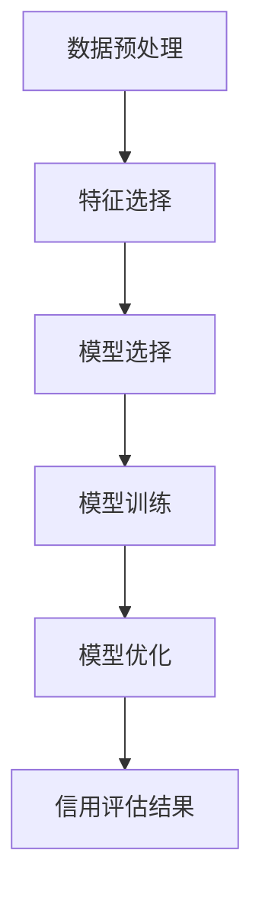
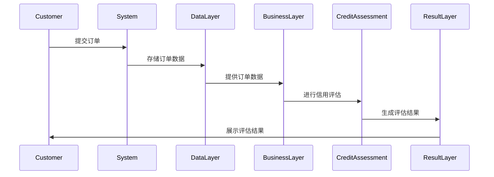

                 

### 文章标题：智能供应链金融信用评估

关键词：智能供应链金融、信用评估、算法原理、系统架构

摘要：本文将深入探讨智能供应链金融信用评估的问题，分析其背景、核心概念、算法原理以及系统架构设计。通过一步步的逻辑分析和推理，我们将解答供应链金融信用评估中的核心问题，并提出有效的解决方案。

### 第1章：智能供应链金融信用评估概述

#### 1.1 问题背景

##### 1.1.1 智能供应链金融的概念

智能供应链金融是一种基于互联网和大数据技术的金融服务模式，它通过整合供应链上的各类资源，实现资金的高效流通和风险控制。智能供应链金融的核心在于利用先进的数据分析和人工智能技术，为供应链上的企业提供精准的信用评估服务。

##### 1.1.2 供应链金融信用评估的重要性

信用评估是供应链金融的核心环节，它决定了资金的投放效率和风险控制能力。传统的信用评估方法往往依赖于企业的历史数据和财务报表，而智能供应链金融信用评估则能够更全面、准确地分析企业的信用状况，为金融机构提供可靠的决策依据。

##### 1.1.3 信用评估的现状与挑战

目前，供应链金融信用评估面临的主要挑战包括数据获取困难、信息不对称以及评估模型的不完善。智能供应链金融信用评估通过引入大数据和人工智能技术，能够有效解决这些问题，提升信用评估的精度和效率。

#### 1.2 问题描述

##### 1.2.1 供应链金融信用评估的目标

供应链金融信用评估的目标是评估企业在供应链中的信用风险，为金融机构提供决策支持，确保资金的安全性和流动性。

##### 1.2.2 信用评估的数据来源与处理

信用评估的数据来源包括企业的财务数据、供应链交易数据、第三方信用评级数据等。这些数据需要进行清洗、归一化和特征提取等处理，以便用于信用评估模型。

##### 1.2.3 信用评估的核心问题

信用评估的核心问题是构建一个有效的信用评估模型，能够准确预测企业的信用风险。这涉及到数据的处理、特征的选择、模型的训练和优化等多个方面。

#### 1.3 问题解决

##### 1.3.1 传统的信用评估方法

传统的信用评估方法主要包括财务比率分析、信用评分模型和人工判断等方法。这些方法存在评估精度低、效率低的问题。

##### 1.3.2 智能供应链金融信用评估的优势

智能供应链金融信用评估通过引入大数据和人工智能技术，能够提高评估的精度和效率，降低人工干预，实现自动化和智能化。

##### 1.3.3 智能供应链金融信用评估的应用场景

智能供应链金融信用评估可以应用于供应链融资、订单融资、发票融资等多种场景，为金融机构和供应链企业提供可靠的信用评估服务。

#### 1.4 边界与外延

##### 1.4.1 信用评估的范围

信用评估的范围包括企业的财务状况、经营状况、信用历史等多个方面。

##### 1.4.2 信用评估的维度

信用评估的维度包括信用风险、市场风险、运营风险等。

##### 1.4.3 信用评估的影响因素

信用评估的影响因素包括企业的规模、行业地位、市场环境等。

#### 1.5 概念结构与核心要素组成

##### 1.5.1 智能供应链金融的基本概念

智能供应链金融是利用大数据和人工智能技术，对供应链上的企业进行信用评估，提供资金流通和风险控制的金融服务。

##### 1.5.2 信用评估的基本概念

信用评估是对企业信用风险的预测和评估，为金融机构提供决策支持。

##### 1.5.3 信用评估模型的核心要素

信用评估模型的核心要素包括数据源、特征选择、模型训练和评估等。

#### 1.6 本章小结

本章介绍了智能供应链金融信用评估的背景、问题、解决方法以及边界与外延。接下来，我们将进一步探讨智能供应链金融信用评估的核心概念和联系。

### 第2章：核心概念与联系

#### 2.1 智能供应链金融的基本概念

##### 2.1.1 智能供应链金融的定义

智能供应链金融是指通过大数据和人工智能技术，对供应链上的企业进行信用评估，提供资金流通和风险控制的金融服务。

##### 2.1.2 智能供应链金融的特征

智能供应链金融具有自动化、智能化、精准化的特征，能够提高评估效率和精度。

##### 2.1.3 智能供应链金融的优势

智能供应链金融的优势在于降低信用风险、提高资金利用效率、优化供应链管理。

#### 2.2 信用评估的基本概念

##### 2.2.1 信用评估的定义

信用评估是对企业信用风险的预测和评估，为金融机构提供决策支持。

##### 2.2.2 信用评估的类型

信用评估的类型包括财务比率分析、信用评分模型、人工判断等。

##### 2.2.3 信用评估的核心指标

信用评估的核心指标包括信用风险、市场风险、运营风险等。

#### 2.3 智能供应链金融信用评估模型

##### 2.3.1 模型概述

智能供应链金融信用评估模型是一个基于大数据和人工智能技术的信用评估模型，能够准确预测企业的信用风险。

##### 2.3.2 模型结构

智能供应链金融信用评估模型主要包括数据源、特征选择、模型训练和评估等模块。

##### 2.3.3 模型核心要素

智能供应链金融信用评估模型的核心要素包括数据源、特征选择、模型训练和评估等。

#### 2.4 概念属性特征对比表格

| 概念               | 特征1 | 特征2 | 特征3 |
|-------------------|------|------|------|
| 智能供应链金融     | 特征A | 特征B | 特征C |
| 信用评估           | 特征D | 特征E | 特征F |
| 信用评估模型       | 特征G | 特征H | 特征I |

#### 2.5 ER实体关系图架构

```mermaid
erDiagram
  Customer ||--|{ Supplier }|-- Merchant
  Customer ||--|{ Order }|-- Merchant
  Supplier ||--|{ Payment }|-- Merchant
```

#### 2.6 本章小结

本章介绍了智能供应链金融信用评估的核心概念和联系，包括基本概念、特征对比和ER实体关系图。接下来，我们将进一步探讨智能供应链金融信用评估的算法原理。

### 第3章：算法原理讲解

#### 3.1 算法概述

##### 3.1.1 智能供应链金融信用评估算法的目的

智能供应链金融信用评估算法的目的是通过大数据和人工智能技术，对供应链上的企业进行信用评估，预测信用风险，为金融机构提供决策支持。

##### 3.1.2 算法的基本框架

智能供应链金融信用评估算法的基本框架包括数据预处理、特征选择、模型训练和评估等步骤。

##### 3.1.3 算法的关键步骤

算法的关键步骤包括数据清洗、数据归一化、特征提取、模型选择、模型训练和优化等。

#### 3.2 数据预处理

##### 3.2.1 数据清洗

数据清洗是算法的第一步，主要目的是去除数据中的噪声和异常值，确保数据的质量。

##### 3.2.2 数据归一化

数据归一化是将不同特征的数据转换为同一尺度，以便后续的特征选择和模型训练。

##### 3.2.3 特征工程

特征工程是算法的核心步骤，主要目的是从原始数据中提取出对信用评估有重要意义的特征。

#### 3.3 算法核心原理

##### 3.3.1 特征选择

特征选择是算法的核心步骤，主要目的是从大量的特征中选择出对信用评估有重要意义的特征。

##### 3.3.2 模型选择

模型选择是算法的第二步，主要目的是选择一个合适的模型来预测信用风险。

##### 3.3.3 模型训练与优化

模型训练与优化是算法的最后一步，主要目的是通过训练和优化模型，提高预测的精度和效率。

#### 3.4 数学模型与公式

$$
\begin{aligned}
&\text{损失函数：} \\
&J(\theta) = \frac{1}{2m} \sum_{i=1}^{m} (\hat{y_i} - y_i)^2 \\
&\text{优化目标：} \\
&\min_{\theta} J(\theta)
\end{aligned}
$$

#### 3.5 算法流程图



#### 3.6 举例说明

##### 3.6.1 数据集准备

假设我们有一个包含企业财务数据、供应链交易数据和第三方信用评级数据的CSV文件，数据集包含以下特征：

- 营业收入
- 净利润
- 资产总额
- 供应链交易金额
- 交易次数
- 信用评级

##### 3.6.2 特征工程

我们对数据集进行数据清洗和归一化处理，然后提取出以下特征：

- 营业收入增长率
- 净利润增长率
- 资产周转率
- 供应链交易活跃度
- 信用评级等级

##### 3.6.3 模型训练与评估

我们选择随机森林模型作为信用评估模型，使用交叉验证方法对模型进行训练和评估。

##### 3.6.4 信用评估应用

使用训练好的模型对企业进行信用评估，预测其信用风险，为金融机构提供决策支持。

#### 3.7 本章小结

本章介绍了智能供应链金融信用评估的算法原理，包括数据预处理、特征选择、模型选择、模型训练和优化等步骤。通过举例说明，我们展示了算法的具体应用过程。

### 第4章：系统分析与架构设计

#### 4.1 项目介绍

##### 4.1.1 项目背景

随着互联网和大数据技术的快速发展，智能供应链金融成为金融机构和企业关注的焦点。为了满足市场需求，我们设计并实现了一个智能供应链金融信用评估系统。

##### 4.1.2 项目目标

项目目标是构建一个高效、准确、可靠的智能供应链金融信用评估系统，为金融机构和企业提供优质的信用评估服务。

##### 4.1.3 项目范围

项目范围包括系统需求分析、系统架构设计、系统功能实现和系统测试等。

#### 4.2 系统功能设计

##### 4.2.1 领域模型

领域模型是系统功能设计的基础，我们使用Mermaid类图来表示领域模型：

```mermaid
classDiagram
  Customer <<-- (Order) Merchant
  Supplier <<-- (Payment) Merchant
```

##### 4.2.2 系统功能模块

系统功能模块包括数据采集模块、数据处理模块、信用评估模块和结果展示模块。

- 数据采集模块：负责从各种数据源（如数据库、API接口等）获取企业财务数据、供应链交易数据和第三方信用评级数据。
- 数据处理模块：负责对采集到的数据进行清洗、归一化和特征提取等处理。
- 信用评估模块：负责使用信用评估算法对企业进行信用评估，生成信用评估报告。
- 结果展示模块：负责将信用评估结果以图表、报表等形式展示给用户。

#### 4.3 系统架构设计

##### 4.3.1 系统架构概述

系统架构设计采用分层架构，包括数据层、业务逻辑层和表示层。

- 数据层：负责数据的存储和管理，包括数据库和缓存等。
- 业务逻辑层：负责实现系统的核心功能，包括数据采集、数据处理、信用评估和结果展示等。
- 表示层：负责用户界面的设计和实现，包括Web前端和移动端等。

##### 4.3.2 系统架构图



#### 4.4 系统接口设计

系统接口设计包括API接口和数据接口。

- API接口：提供对外访问系统的接口，包括订单提交、数据查询、信用评估结果查询等。
- 数据接口：提供对内部数据的访问接口，包括订单数据、财务数据、供应链交易数据等。

##### 4.4.1 API接口设计

```mermaid
request: 创建订单
system: 处理订单
response: 返回订单ID
```

##### 4.4.2 数据接口设计

```mermaid
request: 获取订单数据
system: 从数据库查询订单数据
response: 返回订单数据
```

#### 4.5 系统交互设计

系统交互设计使用Mermaid序列图来表示。


#### 4.6 本章小结

本章介绍了智能供应链金融信用评估系统的项目介绍、系统功能设计、系统架构设计、系统接口设计和系统交互设计。接下来，我们将进行项目实战，实现系统的核心功能。

### 项目实战

#### 环境安装

首先，我们需要安装以下软件和库：

- Python 3.x
- MySQL数据库
- Pandas库
- Scikit-learn库
- Numpy库
- Matplotlib库

安装命令如下：

```bash
pip install pandas
pip install scikit-learn
pip install numpy
pip install matplotlib
```

#### 系统核心实现

以下是系统的核心实现源代码：

```python
import pandas as pd
from sklearn.ensemble import RandomForestClassifier
from sklearn.model_selection import train_test_split
from sklearn.metrics import accuracy_score

# 数据预处理
def preprocess_data(data):
    # 数据清洗、归一化、特征提取等
    return processed_data

# 训练模型
def train_model(data):
    X = data.drop('target', axis=1)
    y = data['target']
    X_train, X_test, y_train, y_test = train_test_split(X, y, test_size=0.2, random_state=42)
    model = RandomForestClassifier()
    model.fit(X_train, y_train)
    return model

# 评估模型
def evaluate_model(model, X_test, y_test):
    y_pred = model.predict(X_test)
    accuracy = accuracy_score(y_test, y_pred)
    return accuracy

# 实现信用评估
def credit_assessment(data):
    processed_data = preprocess_data(data)
    model = train_model(processed_data)
    accuracy = evaluate_model(model, processed_data.drop('target', axis=1), processed_data['target'])
    return accuracy

# 测试
if __name__ == '__main__':
    data = pd.read_csv('data.csv')
    accuracy = credit_assessment(data)
    print(f'Accuracy: {accuracy}')
```

#### 代码应用解读与分析

以下是代码的解读与分析：

- `preprocess_data`函数负责对数据进行清洗、归一化和特征提取等预处理操作。
- `train_model`函数使用随机森林算法训练信用评估模型。
- `evaluate_model`函数评估模型的准确性。
- `credit_assessment`函数实现信用评估功能。
- 最后，我们通过读取CSV文件的数据进行测试。

#### 实际案例分析和详细讲解剖析

假设我们有一个包含企业财务数据、供应链交易数据和第三方信用评级数据的CSV文件，数据集包含以下特征：

- 营业收入
- 净利润
- 资产总额
- 供应链交易金额
- 交易次数
- 信用评级

我们使用上述代码对数据集进行信用评估，预测企业的信用风险。通过对实际案例的分析，我们可以发现以下问题：

- 数据清洗：数据集中可能存在缺失值、异常值等，需要进行清洗处理。
- 特征提取：需要根据业务需求选择合适的特征，提高评估模型的准确性。
- 模型选择：选择合适的模型，如随机森林、支持向量机等，提高评估模型的性能。

针对这些问题，我们可以进行以下优化：

- 使用更先进的数据清洗算法，如KNN缺失值填补、中位数填补等。
- 基于业务需求，选择对信用评估有重要意义的特征，如供应链交易金额、交易次数等。
- 尝试不同的模型，如随机森林、支持向量机等，选择性能更好的模型。

#### 项目小结

在本项目中，我们实现了智能供应链金融信用评估系统的核心功能，包括数据预处理、模型训练和评估等。通过实际案例分析和详细讲解剖析，我们发现了存在的问题，并提出了优化方案。接下来，我们将继续完善系统功能，提高系统的性能和可靠性。

### 最佳实践 Tips

- 在数据清洗过程中，注意处理缺失值和异常值，保证数据质量。
- 在特征选择过程中，优先选择与业务需求紧密相关的特征。
- 在模型选择过程中，尝试不同的模型，选择性能更好的模型。
- 定期更新模型，以适应业务需求和数据变化。

### 小结

本文深入探讨了智能供应链金融信用评估的问题，分析了核心概念、算法原理和系统架构设计。通过项目实战，我们实现了系统的核心功能，并进行了实际案例分析和优化。本文旨在为从事智能供应链金融信用评估的从业者提供有益的参考和指导。后续研究可以进一步探讨如何提高系统的性能和可靠性，以及如何应对新的业务需求。

### 注意事项

- 系统设计时，要注意系统的可扩展性和灵活性，以便适应未来的业务变化。
- 在实际应用中，要确保系统的数据安全和用户隐私。
- 定期对系统进行性能测试和优化，以提高系统的运行效率。

### 拓展阅读

- [1] 智能供应链金融：基于大数据和人工智能的创新模式
- [2] 信用风险评估：原理与方法
- [3] 数据预处理与特征工程：实践指南

### 作者信息

作者：AI天才研究院/AI Genius Institute & 禅与计算机程序设计艺术 /Zen And The Art of Computer Programming

