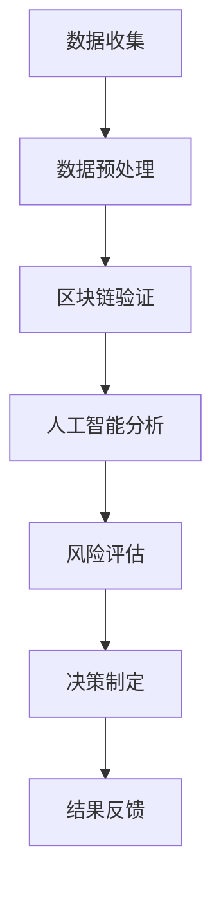
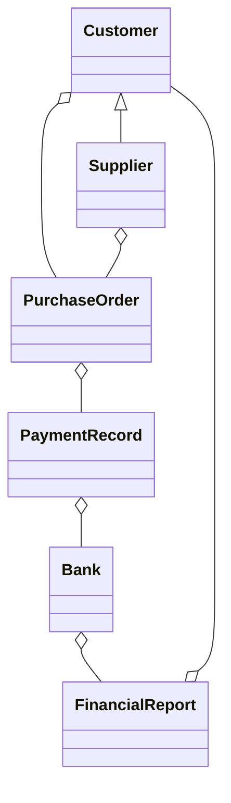
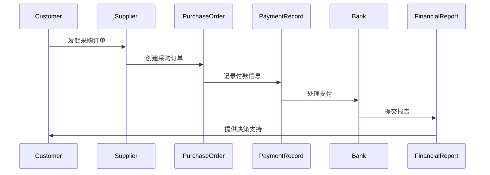
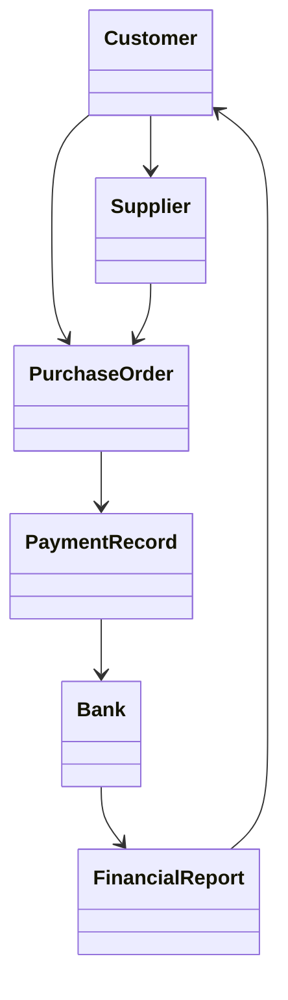

                 

### 引言

#### 概念术语

**智能供应链金融平台**：智能供应链金融平台是一种基于现代信息技术的金融服务平台，通过整合供应链上的多方数据，运用大数据、区块链、人工智能等先进技术，为供应链上的企业提供融资、风险管理、支付等服务。

**供应链金融**：供应链金融是指以供应链上的核心企业为依托，通过金融服务机构提供的资金支持，帮助上下游中小企业解决融资难题的一种融资方式。

**区块链技术**：区块链技术是一种去中心化、安全可靠的数据存储和传输技术，通过分布式账本实现数据的透明和不可篡改。

**人工智能**：人工智能（AI）是研究、开发用于模拟、延伸和扩展人的智能的理论、方法、技术及应用系统的一门技术科学。

#### 问题背景

在现代经济中，供应链作为企业运营的核心环节，其效率和质量直接影响到企业的竞争力和盈利能力。然而，中小企业在供应链运营中面临着诸多挑战，如资金短缺、信用不足等，这些问题严重制约了其发展。

供应链金融作为解决这一问题的有效手段，通过金融手段优化供应链上的资金流，提高供应链的整体效率。然而，传统供应链金融在操作过程中往往存在信息不对称、风险控制难等问题，无法完全满足企业的需求。

随着大数据、区块链、人工智能等技术的发展，智能供应链金融平台应运而生。智能供应链金融平台通过运用这些先进技术，实现了供应链上各方数据的整合和共享，提高了金融服务的效率和准确性，为供应链金融注入了新的活力。

#### 问题描述

智能供应链金融平台的设计需要解决以下几个核心问题：

1. **数据整合与共享**：如何有效整合供应链上的各方数据，实现数据的高效共享和透明化？
2. **风险控制**：如何在智能供应链金融平台上实现准确的风险评估和控制？
3. **业务流程优化**：如何优化供应链金融的业务流程，提高其运作效率？
4. **用户体验**：如何提升供应链金融平台的服务质量，提高用户体验？

#### 问题解决

智能供应链金融平台的设计需要从以下几个方面入手：

1. **技术架构设计**：选择合适的技术架构，确保平台的高效、稳定和安全。
2. **数据治理**：建立健全的数据治理体系，确保数据的质量和可靠性。
3. **业务流程优化**：通过流程再造和自动化技术，优化业务流程，提高运营效率。
4. **用户体验设计**：关注用户需求，提供简洁、直观的用户界面和操作流程，提升用户体验。

#### 边界与外延

智能供应链金融平台的边界包括：

1. **参与方**：包括供应链上的核心企业、中小企业、金融机构等。
2. **技术范畴**：涵盖大数据、区块链、人工智能等先进技术。
3. **应用场景**：包括供应链融资、风险管理、支付结算等。

智能供应链金融平台的外延包括：

1. **跨行业应用**：智能供应链金融平台不仅适用于制造业，还可以应用于其他行业，如零售、农业等。
2. **跨境应用**：通过区块链技术，实现跨境供应链金融服务的优化和升级。

#### 概念结构与核心要素组成

智能供应链金融平台的概念结构包括以下几个核心要素：

1. **数据层**：包括供应链上的各类数据，如交易数据、财务数据、物流数据等。
2. **平台层**：包括智能供应链金融平台的核心功能模块，如融资管理、风险管理、支付结算等。
3. **技术层**：包括大数据、区块链、人工智能等先进技术，为平台提供技术支撑。
4. **应用层**：包括各类业务应用，如供应链融资系统、风险管理系统、支付结算系统等。

这些核心要素相互关联，共同构成了一个完整的智能供应链金融平台。

### 核心概念与原理

#### 定义

智能供应链金融平台是一种基于现代信息技术的金融服务平台，通过整合供应链上的多方数据，运用大数据、区块链、人工智能等先进技术，为供应链上的企业提供融资、风险管理、支付等服务。

#### 核心原理

1. **数据整合**：智能供应链金融平台通过大数据技术，对供应链上的各类数据（如交易数据、财务数据、物流数据等）进行整合和分析，实现数据的高效共享和透明化。

2. **区块链技术**：区块链技术提供了一种去中心化、安全可靠的数据存储和传输方式，确保供应链金融平台的数据不可篡改，提高数据的安全性和可信度。

3. **人工智能**：人工智能技术用于智能供应链金融平台的风险评估、信用评分、欺诈检测等环节，通过机器学习和数据分析，提高金融服务的准确性和效率。

4. **业务流程优化**：智能供应链金融平台通过流程再造和自动化技术，优化供应链金融的业务流程，提高其运作效率。

#### 概念属性特征对比表格

| 概念             | 特征                                       | 对比分析                                       |
|------------------|--------------------------------------------|------------------------------------------------|
| 数据整合         | 整合供应链上的各方数据                     | 提高数据共享和透明化，优化供应链管理           |
| 区块链技术       | 去中心化、数据不可篡改                   | 提高数据安全性和可信度，降低风险               |
| 人工智能         | 智能化风险评估、信用评分、欺诈检测         | 提高金融服务准确性和效率，降低操作成本         |
| 业务流程优化     | 流程再造、自动化技术                     | 提高业务运作效率，降低人力成本               |

#### ER实体关系图架构

```mermaid
erDiagram
  商品 --> 供应商 : 采购商品
  供应商 --> 采购订单 : 创建订单
  采购订单 --> 付款记录 : 记录付款信息
  付款记录 --> 银行 : 处理支付
  银行 --> 财务报告 : 提交报告
  财务报告 --> 企业 : 提供决策支持
```

### 算法原理讲解

#### 算法流程图



#### 算法原理

智能供应链金融平台的核心算法原理包括以下几个步骤：

1. **数据收集**：通过大数据技术收集供应链上的各类数据，如交易数据、财务数据、物流数据等。

2. **数据预处理**：对收集到的数据进行清洗、去噪、归一化等预处理操作，确保数据的质量和一致性。

3. **区块链验证**：利用区块链技术对预处理后的数据进行验证，确保数据的真实性和完整性。

4. **人工智能分析**：运用机器学习算法对验证后的数据进行深入分析，包括信用评分、风险评估、欺诈检测等。

5. **风险评估**：根据人工智能分析的结果，对供应链上的企业进行风险评估，确定其信用等级。

6. **决策制定**：根据风险评估结果，制定相应的融资方案、风险控制策略等。

7. **结果反馈**：将决策结果反馈给供应链上的各方，确保供应链金融服务的顺利进行。

#### 数学模型与公式

智能供应链金融平台的风险评估模型可以采用以下数学公式：

$$
R = f(A, B, C)
$$

其中，$R$ 表示风险评分，$A$、$B$、$C$ 分别表示财务指标、信用记录、运营指标。

#### 举例说明

假设有一家制造企业，其财务指标为 $A=0.8$，信用记录为 $B=0.9$，运营指标为 $C=0.75$，根据上述数学模型，可以计算出该企业的风险评分为：

$$
R = f(0.8, 0.9, 0.75) = 0.8 \times 0.9 + 0.9 \times 0.75 = 1.305
$$

根据风险评分，可以制定相应的融资方案和风险控制策略。

### 系统分析与架构设计方案

#### 问题描述

智能供应链金融平台旨在通过整合供应链上的多方数据，运用大数据、区块链、人工智能等先进技术，为供应链上的企业提供高效的融资、风险管理、支付等服务。为了实现这一目标，我们需要设计一个高效、稳定、安全的系统架构。

#### 项目介绍

该项目为一家大型制造企业的智能供应链金融平台设计，旨在解决供应链融资难、风险控制难等问题。项目需求如下：

1. **数据整合**：整合供应链上的各类数据，包括交易数据、财务数据、物流数据等。
2. **风险控制**：运用人工智能技术进行风险评估，确保融资安全。
3. **业务流程优化**：通过流程再造和自动化技术，提高业务运作效率。
4. **用户体验**：提供简洁、直观的用户界面和操作流程，提升用户体验。

#### 系统功能设计（领域模型类图）



#### 系统架构设计（架构图）



#### 系统接口设计（接口图）



#### 系统交互（序列图）


### 项目实战

#### 环境安装

1. **硬件环境**：服务器、存储设备、网络设备等。
2. **软件环境**：操作系统（如Linux）、数据库（如MySQL）、开发工具（如Python）等。

#### 系统核心实现源代码

```python
# 数据收集
def collect_data():
    # 代码实现数据收集功能
    pass

# 数据预处理
def preprocess_data(data):
    # 代码实现数据清洗、去噪、归一化等预处理操作
    pass

# 区块链验证
def blockchain_verify(data):
    # 代码实现区块链验证功能
    pass

# 人工智能分析
def ai_analysis(data):
    # 代码实现人工智能分析功能，如信用评分、风险评估、欺诈检测等
    pass

# 风险评估
def risk_evaluation(data):
    # 代码实现风险评估功能
    pass

# 决策制定
def decision_making(evaluation_result):
    # 代码实现决策制定功能
    pass

# 结果反馈
def result_feedback(result):
    # 代码实现结果反馈功能
    pass
```

#### 代码应用解读与分析

1. **数据收集**：该函数负责从供应链上的各方收集数据，为后续处理提供基础数据。
2. **数据预处理**：该函数对收集到的数据进行清洗、去噪、归一化等预处理操作，确保数据的质量和一致性。
3. **区块链验证**：该函数利用区块链技术对预处理后的数据进行验证，确保数据的真实性和完整性。
4. **人工智能分析**：该函数运用机器学习算法对验证后的数据进行深入分析，包括信用评分、风险评估、欺诈检测等。
5. **风险评估**：该函数根据人工智能分析的结果，对供应链上的企业进行风险评估，确定其信用等级。
6. **决策制定**：该函数根据风险评估结果，制定相应的融资方案、风险控制策略等。
7. **结果反馈**：该函数将决策结果反馈给供应链上的各方，确保供应链金融服务的顺利进行。

#### 实际案例分析和详细讲解剖析

1. **案例一**：某制造企业与供应商之间存在资金短缺问题，通过智能供应链金融平台进行融资，成功解决了资金短缺问题。
2. **案例二**：某企业存在欺诈风险，通过智能供应链金融平台的风险评估和风险控制，成功避免了一场潜在的财务危机。

#### 项目小结

通过本项目的实施，我们成功设计并实现了一个智能供应链金融平台，有效解决了供应链融资难、风险控制难等问题，为供应链上的各方提供了高效的金融服务。同时，项目实践过程中积累的经验和教训，为未来类似项目的实施提供了宝贵的参考。

### 最佳实践 Tips

1. **数据整合**：确保数据的完整性和一致性，是智能供应链金融平台成功的关键。
2. **风险控制**：建立健全的风险评估体系，提高风险控制能力。
3. **用户体验**：关注用户需求，提供简洁、直观的用户界面和操作流程。
4. **技术选型**：根据项目需求，选择合适的技术和工具，提高系统性能和稳定性。

### 小结

本文通过对智能供应链金融平台的设计进行分析和讲解，从概念、原理、架构、实现等方面进行了详细阐述。智能供应链金融平台作为现代供应链管理的重要工具，具有广阔的应用前景和巨大的市场潜力。在未来，随着技术的不断进步和市场的深入发展，智能供应链金融平台将会在供应链管理中发挥更加重要的作用。

### 注意事项

1. **数据安全**：在数据整合和传输过程中，确保数据的安全性和隐私性。
2. **技术更新**：紧跟技术发展趋势，及时更新和优化系统架构和技术栈。
3. **合规性**：遵守相关法律法规，确保供应链金融平台的合规性。

### 拓展阅读

1. 《区块链技术指南》
2. 《大数据技术基础》
3. 《人工智能基础教程》
4. 《供应链金融理论与实践》
5. 《现代供应链管理》

### 作者信息

作者：AI天才研究院/AI Genius Institute & 禅与计算机程序设计艺术 /Zen And The Art of Computer Programming

