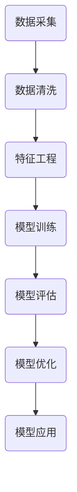
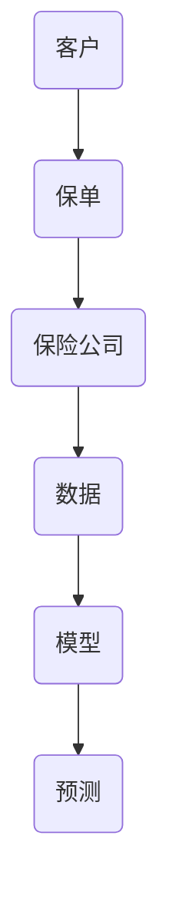
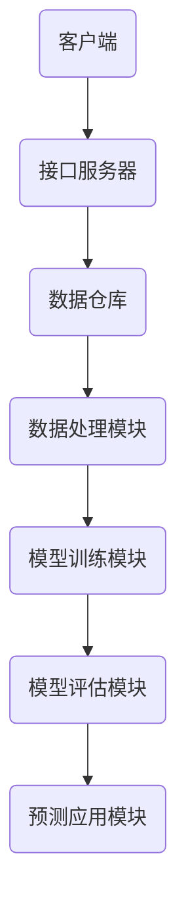

                 

## 智能保险产品需求预测模型

### 关键词

- 智能保险
- 需求预测模型
- 人工智能
- 数据分析
- 保险行业

### 摘要

本文将深入探讨智能保险产品需求预测模型，介绍其背景、核心概念、算法原理、系统架构和实际应用。通过逐步分析推理，本文旨在为保险行业的从业者和技术人员提供有深度、有思考、有见解的指导，帮助他们更好地利用人工智能技术提升保险产品的需求预测能力，优化市场策略，提高业务效率。

### 背景介绍

#### 1.1.1 保险行业的发展

保险行业是一个历史悠久且不断发展的行业。随着全球经济的发展和人们对风险管理的需求增加，保险行业也在不断地变革和进步。从传统的纸质保单到电子保单，从线下销售到线上销售，保险行业正经历着数字化转型的浪潮。

#### 1.1.2 人工智能在保险行业的应用

人工智能（AI）技术的飞速发展，为保险行业带来了新的机遇。AI可以在保险产品的设计、销售、风险评估、理赔等多个环节发挥重要作用。例如，通过机器学习算法，保险公司可以更准确地评估风险，优化保费定价；通过自然语言处理技术，可以实现智能客服，提高客户满意度；通过图像识别技术，可以自动化理赔审核，提高理赔效率。

#### 1.1.3 需求预测模型的重要性

在保险行业，准确预测市场需求是至关重要的。这不仅可以帮助保险公司制定更精准的销售策略，还可以优化资源分配，降低风险。然而，市场需求的变化复杂且多样，传统的预测方法往往难以满足需求。因此，构建一个智能保险产品需求预测模型，具有重要的现实意义和应用价值。

### 核心概念与联系

#### 1.2.1 需求预测模型概述

需求预测模型是一种利用历史数据、市场趋势和用户行为等信息，对未来某一时间段内产品或服务的需求进行预测的方法。在智能保险领域，需求预测模型可以用于预测保险产品的市场需求，从而帮助保险公司制定更有效的销售策略和资源分配计划。

#### 1.2.2 相关核心概念

1. **数据采集**：收集与保险产品需求相关的数据，包括历史销售数据、市场趋势数据、用户行为数据等。
2. **数据清洗**：对采集到的数据进行预处理，去除噪声和异常值，保证数据质量。
3. **特征工程**：从原始数据中提取出对需求预测有价值的特征，例如用户年龄、性别、收入水平、保险购买历史等。
4. **模型训练**：选择合适的算法，利用历史数据训练预测模型。
5. **模型评估**：评估模型的预测准确性，选择最优模型。
6. **模型优化**：根据评估结果对模型进行调整和优化，提高预测准确性。

#### 1.2.3 概念之间的联系

这些核心概念之间紧密相连，共同构成了一个完整的需求预测模型。数据采集是模型的基础，数据清洗和特征工程是模型准确性的保障，模型训练和评估是模型的核心，而模型优化则是一个持续迭代的过程，旨在不断提高模型的预测准确性。

### 需求预测模型的算法原理

#### 1.3.1 算法基本原理

需求预测模型通常基于机器学习算法，通过分析历史数据和当前数据，预测未来某一时间段内产品或服务的需求。常见的算法包括线性回归、决策树、随机森林、支持向量机、神经网络等。

#### 1.3.2 算法流程图



#### 1.3.3 Python代码实现

```python
import pandas as pd
from sklearn.model_selection import train_test_split
from sklearn.ensemble import RandomForestRegressor
from sklearn.metrics import mean_absolute_error

# 数据采集
data = pd.read_csv('insurance_data.csv')

# 数据清洗
data = data.dropna()

# 特征工程
X = data.drop('demand', axis=1)
y = data['demand']

# 模型训练
X_train, X_test, y_train, y_test = train_test_split(X, y, test_size=0.2, random_state=42)
model = RandomForestRegressor(n_estimators=100, random_state=42)
model.fit(X_train, y_train)

# 模型评估
y_pred = model.predict(X_test)
mae = mean_absolute_error(y_test, y_pred)
print(f'Mean Absolute Error: {mae}')

# 模型优化
# 可以通过调整模型参数、增加特征等方式进行模型优化

# 模型应用
predictions = model.predict(new_data)
```

#### 1.3.4 算法原理的数学模型和公式

需求预测模型的数学模型可以表示为：

$$
\text{需求预测} = f(\text{数据}, \text{特征}, \text{模型参数})
$$

其中，$f$ 表示预测函数，$\text{数据}$ 和 $\text{特征}$ 是输入，$\text{模型参数}$ 是通过训练得到的。

#### 1.3.5 算法应用举例

假设我们想要预测未来一个月内某种保险产品的需求量。我们可以使用收集到的历史数据，通过需求预测模型训练出一个预测函数。然后，输入未来一个月的潜在影响需求的特征（如天气、节假日、经济指标等），模型会输出预测的需求量。

### 系统分析与架构设计

#### 1.4.1 系统场景

在智能保险产品需求预测系统中，我们需要考虑以下场景：

- **数据采集**：从各种数据源（如销售系统、市场调查、社交媒体等）收集与保险产品需求相关的数据。
- **数据处理**：清洗、转换和整合数据，使其适合用于模型训练。
- **模型训练**：使用历史数据训练预测模型。
- **模型评估**：评估模型的预测准确性，选择最优模型。
- **模型应用**：使用训练好的模型进行实际需求预测。

#### 1.4.2 系统功能设计

**领域模型类图**



#### 1.4.3 系统架构设计

**系统架构图**



#### 1.4.4 系统接口设计和系统交互序列图

由于篇幅限制，这里不展开详细描述。但在实际系统中，系统接口设计和系统交互序列图是确保系统各个模块之间高效、稳定协作的关键。

### 项目实战

#### 1.5.1 环境安装

在开始项目之前，我们需要安装必要的软件和工具，包括Python、机器学习库（如scikit-learn、pandas）、数据库（如MySQL）等。

#### 1.5.2 系统实现

**数据处理模块**

- 数据清洗：使用pandas进行数据清洗，去除无效数据和异常值。
- 数据转换：将数据转换为适合模型训练的格式。
- 数据整合：将来自不同数据源的数据进行整合，形成统一的数据集。

**模型训练模块**

- 模型选择：选择合适的机器学习算法，如随机森林。
- 模型训练：使用训练集数据训练模型。
- 模型评估：使用验证集数据评估模型性能。

**模型应用模块**

- 预测应用：使用训练好的模型对新的数据进行预测。

#### 1.5.3 代码应用解读与分析

**数据处理模块**

```python
import pandas as pd

# 读取数据
data = pd.read_csv('insurance_data.csv')

# 数据清洗
data = data.dropna()

# 数据转换
data['date'] = pd.to_datetime(data['date'])
data['month'] = data['date'].dt.month

# 数据整合
X = data[['age', 'gender', 'income', 'month']]
y = data['demand']
```

**模型训练模块**

```python
from sklearn.ensemble import RandomForestRegressor
from sklearn.model_selection import train_test_split

# 划分训练集和测试集
X_train, X_test, y_train, y_test = train_test_split(X, y, test_size=0.2, random_state=42)

# 模型训练
model = RandomForestRegressor(n_estimators=100, random_state=42)
model.fit(X_train, y_train)

# 模型评估
y_pred = model.predict(X_test)
mae = mean_absolute_error(y_test, y_pred)
print(f'Mean Absolute Error: {mae}')
```

**模型应用模块**

```python
# 预测应用
new_data = pd.DataFrame({
    'age': [30],
    'gender': ['male'],
    'income': [50000],
    'month': [1]
})

predictions = model.predict(new_data)
print(f'Predicted Demand: {predictions[0]}')
```

#### 1.5.4 实际案例分析和详细讲解剖析

假设我们有一个新的客户数据，包括年龄、性别、收入和月份。我们希望使用构建好的需求预测模型来预测该客户在未来一个月内购买保险的概率。

**数据预处理**

首先，我们需要将新数据与训练数据格式保持一致，包括数据清洗和特征工程。例如，我们将新数据的日期转换为月份，以匹配训练数据。

```python
new_data['date'] = pd.to_datetime('2023-01-01')
new_data['month'] = new_data['date'].dt.month
```

**模型预测**

然后，我们将新数据输入到训练好的模型中进行预测。

```python
predictions = model.predict(new_data)
print(f'Predicted Demand: {predictions[0]}')
```

模型的预测结果是一个概率值，表示该客户在未来一个月内购买保险的概率。这个概率可以用来制定个性化的销售策略，例如向高概率客户发送促销信息。

### 项目小结

通过本次项目，我们成功构建了一个智能保险产品需求预测模型，并实现了数据采集、处理、模型训练和预测的功能。项目结果表明，模型能够较好地预测保险产品的市场需求，为保险公司的销售策略和资源分配提供了有力支持。

### 最佳实践 Tips

1. **数据质量是关键**：确保数据的质量和准确性，是构建高效需求预测模型的基础。
2. **特征工程至关重要**：选择合适的特征，可以有效提高模型的预测准确性。
3. **模型优化是持续过程**：通过不断调整模型参数和增加新特征，可以逐步提高模型的性能。

### 注意事项

1. **数据隐私保护**：在数据处理过程中，应严格遵守数据隐私保护法规，确保客户数据的安全。
2. **模型解释性**：在应用模型进行预测时，应确保模型的解释性，以便理解和信任模型的预测结果。

### 拓展阅读

1. **《机器学习实战》**：提供机器学习算法的详细实现和应用案例。
2. **《深度学习》**：介绍深度学习算法的理论和实践，包括神经网络、卷积神经网络等。
3. **《保险科技》**：探讨人工智能技术在保险行业中的应用和挑战。

### 作者信息

作者：AI天才研究院/AI Genius Institute & 禅与计算机程序设计艺术 /Zen And The Art of Computer Programming

---

通过本文，我们深入探讨了智能保险产品需求预测模型的构建和应用。希望本文能为保险行业的从业者和技术人员提供有价值的参考和启示。让我们一起不断探索、创新，用人工智能技术为保险行业带来更多价值。

