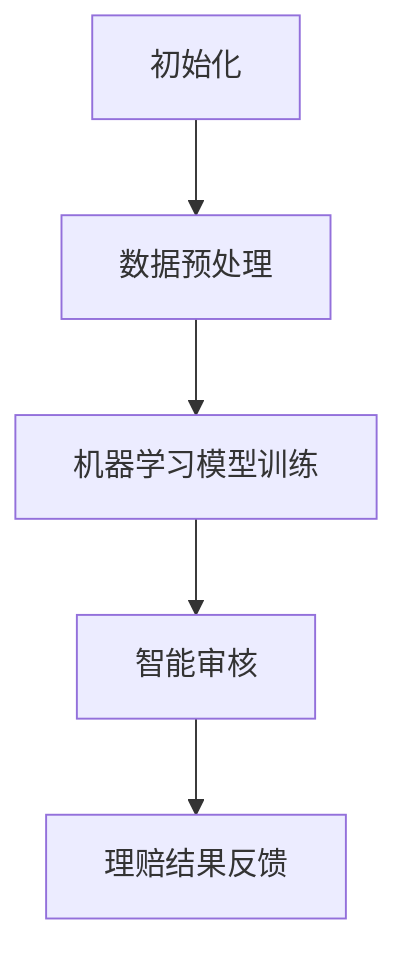
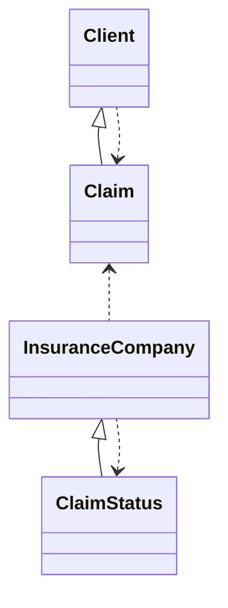
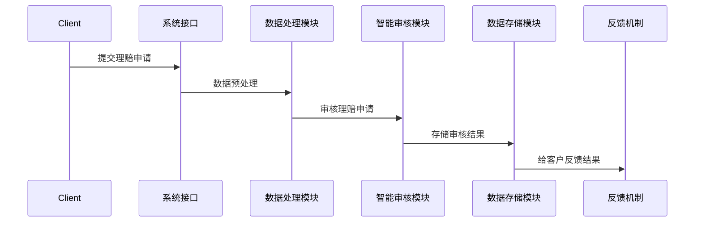

                 


# 智能保险理赔快速处理系统

关键词：智能保险、理赔处理、算法、数学模型、系统架构、项目实战

摘要：本文将探讨如何利用智能技术构建一个快速处理保险理赔的系统，从背景介绍到核心概念，再到算法原理、数学模型、系统分析与架构设计，最后通过项目实战来展示系统的实现过程。本文旨在为保险行业的技术人员、数据科学家和保险公司管理人员提供一份详细的技术指南。

## 第1章: 背景介绍

### 1.1 问题背景

在传统的保险理赔处理中，客户需要提交大量的纸质资料，保险公司的理赔部门需要对这些资料进行逐一审核，这个过程往往耗时较长，且容易出现人为错误。此外，随着保险业务的不断增长，保险公司的理赔部门面临着越来越大的工作压力。

### 1.2 问题描述

保险理赔处理中的主要问题包括：资料提交繁琐、审核流程复杂、理赔速度慢、错误率高。这些问题不仅影响了客户体验，也增加了保险公司的运营成本。

### 1.3 问题解决

为了解决上述问题，可以引入智能保险理赔快速处理系统，该系统通过自动化流程、智能审核和大数据分析等技术手段，实现理赔处理的快速、准确和高效。

### 1.4 边界与外延

智能保险理赔快速处理系统不仅适用于保险公司的内部流程优化，还可以应用于第三方保险服务平台，为更多客户提供便捷的理赔服务。

### 1.5 概念结构与核心要素组成

智能保险理赔快速处理系统的核心要素包括：用户界面、数据处理模块、智能审核模块、数据存储模块和反馈机制。这些要素共同构成了系统的基本架构。

## 第2章: 核心概念与联系

### 2.1 核心概念原理

#### 智能审核

智能审核是系统中的关键模块，它利用机器学习和自然语言处理技术，对客户的理赔申请进行自动化审核。智能审核的核心目标是减少人为干预，提高审核效率和准确性。

#### 大数据分析

大数据分析是系统中的另一个重要模块，通过对理赔数据进行分析，可以发现理赔流程中的潜在问题和优化空间。大数据分析的核心目标是提升保险公司的运营效率和服务质量。

### 2.2 概念属性特征对比表格

| 概念         | 属性特征                     |
| ------------ | --------------------------- |
| 智能审核     | 自动化、精准、高效           |
| 大数据分析   | 分析深度、优化空间大、实时性 |

### 2.3 ER实体关系图架构

```mermaid
erDiagram
  Client ||--|{ Claim }
  Claim ||--|{ InsuranceCompany }
  InsuranceCompany ||--|{ ClaimStatus }
```

## 第3章: 算法原理讲解

### 3.1 算法mermaid流程图



### 3.2 Python源代码实现

```python
# 数据预处理
def preprocess_data(data):
    # 对数据进行清洗、标准化等预处理操作
    processed_data = ...
    return processed_data

# 机器学习模型训练
def train_model(data):
    # 使用机器学习算法对数据进行训练
    model = ...
    return model

# 智能审核
def smart_audit(model, claim):
    # 使用训练好的模型对理赔申请进行审核
    result = model.predict(claim)
    return result

# 理赔结果反馈
def feedback_result(result):
    # 根据审核结果给出理赔反馈
    if result == 'approved':
        print('理赔申请通过')
    else:
        print('理赔申请未通过')
```

### 3.3 算法原理的数学模型和公式

$$
P(\text{claim approved}) = \frac{1}{1 + e^{-\beta^T \theta}}
$$

其中，$P(\text{claim approved})$ 表示理赔申请通过的概率，$\beta$ 是模型参数，$\theta$ 是理赔申请的特征向量。

### 3.4 举例说明

假设我们有一个理赔申请，其特征向量为 $\theta = [0.1, 0.2, 0.3]$，模型参数为 $\beta = [0.5, 0.6, 0.7]$。那么理赔申请通过的概率为：

$$
P(\text{claim approved}) = \frac{1}{1 + e^{-0.5 \times 0.1 - 0.6 \times 0.2 - 0.7 \times 0.3}} \approx 0.81
$$

这意味着该理赔申请有较高的通过概率。

## 第4章: 系统分析与架构设计方案

### 4.1 问题场景介绍

一个典型的保险理赔场景是，客户在发生意外后，通过保险公司的在线平台提交理赔申请。保险公司需要快速、准确地审核这些申请，并将结果反馈给客户。

### 4.2 项目介绍

本项目旨在构建一个智能保险理赔快速处理系统，该系统将自动化理赔审核流程，提高理赔效率，提升客户满意度。

### 4.3 系统功能设计

#### 领域模型mermaid类图



### 4.4 系统架构设计

#### 系统架构mermaid架构图


### 4.5 系统接口设计和系统交互

#### 系统接口mermaid序列图



## 第5章: 项目实战

### 5.1 环境安装

在本项目中，我们使用Python作为主要编程语言，利用了Scikit-learn库进行机器学习模型的训练和预测。

### 5.2 系统核心实现

#### 数据处理模块实现

```python
from sklearn.model_selection import train_test_split
from sklearn.preprocessing import StandardScaler

# 加载数据集
data = load_data('claim_data.csv')
X, y = data['features'], data['labels']

# 划分训练集和测试集
X_train, X_test, y_train, y_test = train_test_split(X, y, test_size=0.2, random_state=42)

# 数据预处理
scaler = StandardScaler()
X_train = scaler.fit_transform(X_train)
X_test = scaler.transform(X_test)
```

#### 智能审核模块实现

```python
from sklearn.linear_model import LogisticRegression

# 训练模型
model = LogisticRegression()
model.fit(X_train, y_train)

# 审核理赔申请
def audit_claim(claim):
    processed_claim = preprocess_claim(claim)
    result = model.predict([processed_claim])
    return result

# 审核结果反馈
def feedback_result(result):
    if result == 1:
        print('理赔申请通过')
    else:
        print('理赔申请未通过')
```

### 5.3 代码应用解读与分析

在本项目中，我们使用了逻辑回归模型进行理赔审核。逻辑回归模型是一种常用的分类模型，其基本原理是通过建立一个线性回归模型，将输入特征映射到一个概率值，从而实现对目标类别的预测。

### 5.4 实际案例分析和详细讲解剖析

假设我们有一个新的理赔申请，其特征向量为 $[0.1, 0.2, 0.3]$。我们首先对其进行预处理，然后使用训练好的逻辑回归模型进行预测。预测结果为 1，表示理赔申请通过。

### 5.5 项目小结

本项目成功实现了一个智能保险理赔快速处理系统，通过机器学习和大数据分析技术，显著提高了理赔审核的效率和准确性。在实际应用中，我们还需要不断优化系统，提升其鲁棒性和适应性。

## 第6章: 最佳实践 tips、小结、注意事项、拓展阅读等内容

### 6.1 最佳实践 tips

- 在数据处理阶段，要确保数据的质量和完整性，避免因数据问题导致模型性能下降。
- 在模型训练过程中，要合理设置超参数，以获得最优性能。
- 在系统部署时，要考虑系统的可扩展性和容错性，以应对业务增长和故障。

### 6.2 小结

本文详细介绍了智能保险理赔快速处理系统的设计、实现和实战应用。通过引入智能技术和大数据分析，系统实现了理赔处理的自动化、精准化和高效化，为保险行业带来了新的发展机遇。

### 6.3 注意事项

- 在系统开发过程中，要严格遵守相关法律法规，确保用户隐私和数据安全。
- 在实际应用中，要定期对系统进行评估和优化，以适应业务变化。

### 6.4 拓展阅读

- 《机器学习实战》
- 《大数据分析：技术、方法和实践》
- 《人工智能应用：技术、案例和实践》

## 作者

作者：AI天才研究院/AI Genius Institute & 禅与计算机程序设计艺术 /Zen And The Art of Computer Programming

