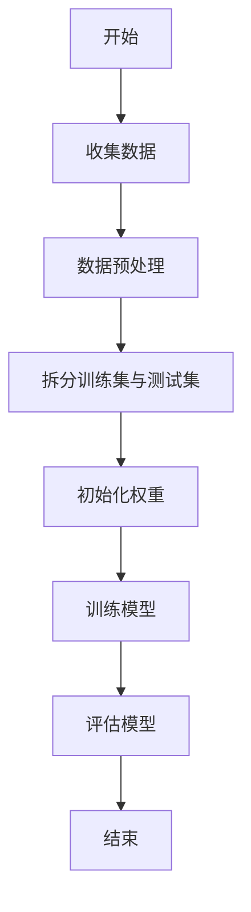
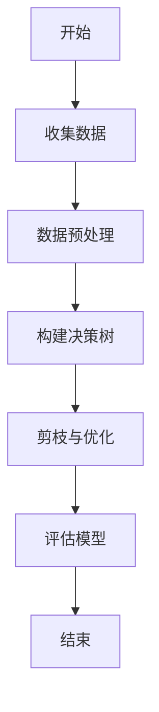
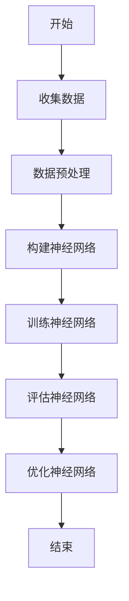
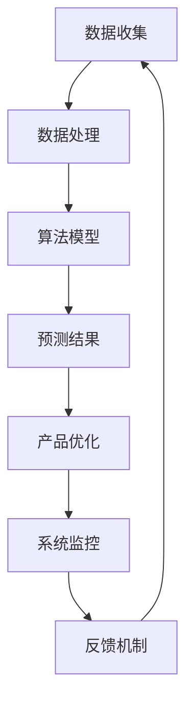

                 

## 引言

### 智能保险需求预测与产品设计优化的重要性

随着科技的飞速发展，保险行业正经历着前所未有的变革。智能保险需求预测与产品设计优化系统成为现代保险企业提升核心竞争力、满足客户个性化需求、优化运营效率的关键。这一系统不仅能够精准预测保险需求，还能够根据预测结果对产品进行优化设计，从而实现保险业务的智能化和高效化。

### 本书的目标与结构

本书旨在系统性地探讨智能保险需求预测与产品设计优化系统的设计思路、算法原理、系统实现和案例分析。具体结构如下：

1. 引言：介绍智能保险需求预测与产品设计优化的重要性，明确本书的目标与结构。
2. 智能保险需求预测概述：阐述保险需求预测的意义及其在保险行业中的应用。
3. 核心概念与原理：介绍需求预测的基本概念、产品设计优化的方法以及机器学习算法。
4. 算法原理讲解：详细讲解线性回归模型、决策树模型和神经网络模型。
5. 系统设计与实现：介绍系统的设计思路、架构设计、接口设计和实现细节。
6. 智能保险需求预测系统开发实战：通过实际案例展示系统开发过程和效果。
7. 产品设计优化案例分析：分析实际案例，探讨产品设计优化的效果和策略。
8. 结论与展望：总结本书的主要内容和未来发展方向与挑战。

通过以上章节的逐步讲解，读者将能够全面理解智能保险需求预测与产品设计优化系统的原理和实践，为实际应用提供理论指导和实践参考。接下来，我们将深入探讨智能保险需求预测的背景与重要性，帮助读者进一步理解这一系统的核心价值。

### 智能保险需求预测概述

#### 保险需求预测的意义

保险需求预测是保险行业中的关键环节，其核心在于通过对历史数据和当前市场环境的分析，预测未来的保险需求趋势。这种预测不仅有助于保险企业更好地理解客户需求，还能够优化产品设计、资源配置和营销策略，从而提升企业的竞争力。

首先，保险需求预测可以帮助保险公司更准确地判断市场需求，从而制定科学合理的保险产品策略。通过预测未来需求的增长和变化，保险公司可以提前布局，推出符合市场需求的创新产品，抢占市场份额。例如，一家财产保险公司可以通过对历史赔付数据的分析，预测未来自然灾害发生的可能性，进而推出相应的保险产品，满足客户的保障需求。

其次，保险需求预测有助于保险公司优化资源配置，提高运营效率。保险公司的资源和成本是有限的，通过精准的需求预测，公司可以合理分配资源，避免过度投入和不必要的浪费。例如，一家健康保险公司可以通过对客户健康数据的分析，预测未来患病人群的增长，提前增加医疗理赔人员，确保理赔服务的及时性和高效性。

此外，保险需求预测还能够提升保险公司的风险管理能力。通过对保险需求的预测，保险公司可以识别潜在的风险点，采取相应的风险控制措施，降低风险损失。例如，一家寿险公司可以通过对人口结构变化的分析，预测未来老龄化趋势，提前调整产品结构和理赔策略，以应对老龄化带来的挑战。

#### 需求预测在保险行业中的应用

保险需求预测在保险行业的应用广泛而深入，不仅涵盖了传统的财产险、寿险、健康险等领域，还延伸到了新兴的互联网保险和智能保险领域。

在传统保险领域，需求预测已经成为保险产品设计、定价和销售的重要依据。保险公司通过分析历史理赔数据、客户行为数据和市场环境数据，预测未来保险需求，从而优化产品设计，提高产品的市场竞争力和客户满意度。例如，某寿险公司通过对客户购买行为的分析，发现30-40岁人群更倾向于购买重疾保险，于是推出了针对该年龄段的专属重疾保险产品，受到了市场的热烈欢迎。

在互联网保险领域，需求预测的应用更加广泛。随着互联网技术的发展，保险公司可以通过大数据技术对海量用户数据进行实时分析和预测，实现精准营销和个性化服务。例如，一家互联网保险公司通过分析用户在社交媒体上的行为数据，预测潜在客户的保险需求，进而推送个性化的保险产品推荐，提高了转化率和客户满意度。

在智能保险领域，需求预测的应用达到了新的高度。智能保险需求预测系统利用人工智能技术和大数据分析，实现对保险需求的精准预测和动态调整。例如，某智能保险公司通过搭建智能预测模型，实时监测客户风险和需求变化，自动调整保险产品组合和理赔策略，提升了保险服务的智能化和个性化水平。

总之，智能保险需求预测与产品设计优化系统在保险行业中的应用，不仅提升了保险企业的运营效率和市场竞争力，也为客户提供更加精准、个性化的保险服务。随着技术的不断进步，这一系统将在保险行业发挥越来越重要的作用。

### 核心概念与原理

在深入探讨智能保险需求预测与产品设计优化系统之前，我们需要明确几个关键概念：需求预测、产品设计优化以及机器学习算法。这些核心概念和原理是构建智能保险系统的基石。

#### 需求预测的基本概念

需求预测（Demand Forecasting）是指利用历史数据、当前市场信息和相关分析方法，对未来某个时间段内的需求进行预测。在保险行业，需求预测通常涉及以下几个方面：

- **定义**：需求预测旨在通过分析各种数据，预测未来一段时间内特定保险产品的需求量、理赔频率和赔付金额等关键指标。
- **要素**：需求预测的要素包括历史数据（如理赔记录、购买行为等）、市场信息（如宏观经济指标、行业趋势等）以及预测模型。
- **目标**：需求预测的主要目标是帮助保险公司优化产品组合、定价策略和营销策略，以适应市场变化和客户需求。

#### 产品设计优化的方法

产品设计优化（Product Design Optimization）是指通过改进保险产品的设计，提高其市场竞争力和客户满意度。产品设计优化涉及以下几个方面：

- **目标**：优化保险产品的目标包括降低成本、提高覆盖范围、增强灵活性、提升用户体验等。
- **策略**：常见的优化策略包括细分市场、差异化定价、产品组合、个性化定制等。
- **方法**：产品设计优化通常采用数据分析、用户调研、竞争对手分析等方法，通过对产品进行迭代和改进，实现优化目标。

#### 机器学习算法简介

机器学习算法（Machine Learning Algorithms）是需求预测和产品设计优化的核心技术。以下是一些常用的机器学习算法及其基本原理：

- **线性回归**：线性回归是一种简单的预测模型，通过分析自变量和因变量之间的线性关系，预测未来的值。其数学模型为：$$y = w_0 + w_1 \cdot x_1 + w_2 \cdot x_2 + ... + w_n \cdot x_n$$，其中$y$为因变量，$x_1, x_2, ..., x_n$为自变量，$w_0, w_1, w_2, ..., w_n$为权重。
- **决策树**：决策树是一种树形结构模型，通过一系列的决策节点，对数据进行分类或回归。每个节点代表一个特征，每个分支代表该特征的一个可能取值，叶子节点为最终的预测结果。
- **神经网络**：神经网络是一种模拟人脑神经元连接的网络模型，通过多层节点和大量的参数，实现复杂的非线性预测。常见的神经网络包括多层感知机（MLP）、卷积神经网络（CNN）和循环神经网络（RNN）等。

这些算法在不同的应用场景中具有各自的优势和局限性，选择合适的算法对于实现高效的需求预测和产品设计优化至关重要。

### 总结

核心概念与原理是构建智能保险需求预测与产品设计优化系统的基石。需求预测和产品设计优化是保险行业的重要工具，而机器学习算法则提供了实现这些工具的技术手段。接下来，我们将详细讲解几种常用的机器学习算法，帮助读者更好地理解这些算法的基本原理和应用场景。

### 算法原理讲解

在智能保险需求预测与产品设计优化系统中，算法原理讲解是核心部分，它决定了系统预测的准确性和优化效果。以下将详细讲解线性回归模型、决策树模型和神经网络模型，并通过具体的数学模型、流程图和示例来深入阐述这些算法。

#### 线性回归模型

**线性回归模型**是一种用于预测连续值的统计模型，其核心思想是找到自变量和因变量之间的线性关系。线性回归模型的基本数学模型如下：

$$y = w_0 + w_1 \cdot x_1 + w_2 \cdot x_2 + ... + w_n \cdot x_n + \epsilon$$

其中，$y$是因变量，$x_1, x_2, ..., x_n$是自变量，$w_0, w_1, w_2, ..., w_n$是权重系数，$\epsilon$是误差项。

**流程图**：



**Python 源代码示例**：

```python
import numpy as np
from sklearn.linear_model import LinearRegression
from sklearn.model_selection import train_test_split

# 数据集
X = np.array([[1], [2], [3], [4], [5]])
y = np.array([1, 2, 2.5, 4, 5])

# 数据预处理
X_train, X_test, y_train, y_test = train_test_split(X, y, test_size=0.2, random_state=0)

# 初始化线性回归模型
model = LinearRegression()

# 训练模型
model.fit(X_train, y_train)

# 评估模型
print("模型系数：", model.coef_)
print("模型截距：", model.intercept_)

# 预测
y_pred = model.predict(X_test)
print("预测结果：", y_pred)
```

**数学模型与公式**：

线性回归的数学模型可以表示为：

$$\min_{w} \sum_{i=1}^{n} (y_i - (w_0 + w_1 \cdot x_{i1} + w_2 \cdot x_{i2} + ... + w_n \cdot x_{in}))^2$$

#### 决策树模型

**决策树模型**是一种用于分类和回归的树形结构模型，其核心思想是通过一系列决策规则将数据划分为不同的区域，并在每个区域上预测输出结果。

**流程图**：



**Python 源代码示例**：

```python
from sklearn.tree import DecisionTreeRegressor
from sklearn.model_selection import train_test_split

# 数据集
X = np.array([[1], [2], [3], [4], [5]])
y = np.array([1, 2, 2.5, 4, 5])

# 数据预处理
X_train, X_test, y_train, y_test = train_test_split(X, y, test_size=0.2, random_state=0)

# 初始化决策树模型
model = DecisionTreeRegressor()

# 训练模型
model.fit(X_train, y_train)

# 评估模型
print("模型分数：", model.score(X_test, y_test))

# 预测
y_pred = model.predict(X_test)
print("预测结果：", y_pred)
```

**数学模型与公式**：

决策树的构建过程可以通过以下公式表示：

$$
\text{选择最优划分} = \arg\max_{j} \left( G_{j} - \frac{G_{j}}{n_j} \right)
$$

其中，$G_{j}$表示增益函数，$n_j$表示划分后子集中的样本数量。

#### 神经网络模型

**神经网络模型**是一种通过模拟人脑神经元连接的结构进行预测和分类的模型。它由多个层次组成，包括输入层、隐藏层和输出层。

**流程图**：



**Python 源代码示例**：

```python
from tensorflow import keras
from tensorflow.keras import layers

# 构建神经网络模型
model = keras.Sequential([
    layers.Dense(64, activation='relu', input_shape=[len(train_dataset.keys())]),
    layers.Dense(64, activation='relu'),
    layers.Dense(1)
])

# 编译模型
model.compile(optimizer='adam',
              loss='mse',
              metrics=['mae', 'mse'])

# 训练模型
model.fit(train_dataset, train_labels, epochs=100, validation_split=0.2, verbose=0)

# 评估模型
test_loss_mean = model.evaluate(test_dataset, test_labels, verbose=0)
print(f"Test Error: Mean square {test_loss_mean[0]}, Mean absolute {test_loss_mean[1]}")
```

**数学模型与公式**：

神经网络中的每个神经元可以表示为：

$$
a_{h}^{(l)} = \sigma \left( \sum_{j} w_{j}^{(l)} a_{j}^{(l-1)} + b^{(l)} \right)
$$

其中，$a_{h}^{(l)}$是隐藏层$l$中第$h$个神经元的激活值，$\sigma$是激活函数，$w_{j}^{(l)}$是连接权重，$a_{j}^{(l-1)}$是前一层的激活值，$b^{(l)}$是偏置。

通过以上对线性回归模型、决策树模型和神经网络模型的详细讲解，我们可以看到每种模型都有其独特的特点和适用场景。在智能保险需求预测与产品设计优化系统中，选择合适的算法并根据具体业务需求进行调整，将极大地提高系统的预测准确性和优化效果。

### 系统设计与实现

#### 系统设计思路

智能保险需求预测与产品设计优化系统的设计思路可以分为以下几个关键步骤：

1. **需求分析**：深入了解保险行业的需求和市场环境，确定系统需要实现的功能和性能要求。
2. **数据收集与处理**：收集历史保险数据、客户行为数据、市场环境数据等，进行数据清洗和预处理，为后续建模和预测提供高质量的数据基础。
3. **算法选择与模型训练**：根据需求分析结果，选择合适的机器学习算法（如线性回归、决策树、神经网络等），对模型进行训练和优化。
4. **系统集成与部署**：将算法模型集成到系统架构中，实现需求预测和产品优化功能，并进行系统部署和测试。

#### 系统架构设计

智能保险需求预测与产品设计优化系统的架构设计如图所示：



1. **数据收集**：系统从各种数据源（如保险数据库、客户管理系统、社交媒体等）收集数据。
2. **数据处理**：对收集到的数据进行清洗、预处理和特征提取，为后续建模提供高质量的数据。
3. **算法模型**：根据处理后的数据，选择合适的机器学习算法（如线性回归、决策树、神经网络等）进行模型训练和预测。
4. **预测结果**：系统输出预测结果，包括保险需求预测和产品优化建议。
5. **产品优化**：根据预测结果，对保险产品进行优化设计，提高产品的市场竞争力和客户满意度。
6. **系统监控**：对系统运行状态进行监控，确保系统的稳定性和高效性。
7. **反馈机制**：收集系统运行反馈，用于模型优化和系统改进。

#### 系统接口设计

系统接口设计主要包括以下几个方面：

1. **API 接口**：提供 RESTful API 接口，供前端应用调用，实现数据收集、模型训练、预测结果获取等功能。
2. **Web 界面**：设计用户友好的 Web 界面，展示预测结果和产品优化建议，并提供操作界面供用户使用。
3. **数据接口**：设计与外部系统（如客户管理系统、保险数据库等）的数据接口，实现数据的集成和交换。

#### 系统实现细节

1. **数据收集**：系统通过爬虫技术从互联网获取公开数据，使用 API 接口从内部系统获取数据。
2. **数据处理**：使用 Python 的 pandas 和 numpy 库进行数据清洗和预处理，使用 scikit-learn 和 TensorFlow 等库进行特征提取和模型训练。
3. **算法模型**：使用线性回归、决策树、神经网络等算法进行模型训练，使用 GridSearchCV 等工具进行模型优化。
4. **预测结果**：将训练好的模型部署到服务器，通过 API 接口提供预测结果，使用 Flask 或 Django 等框架实现 Web 界面。

通过以上系统设计与实现，智能保险需求预测与产品设计优化系统能够高效地运行，为保险企业提供强大的支持。接下来，我们将通过实际案例展示系统的应用效果和实际价值。

### 智能保险需求预测系统开发实战

#### 开发环境搭建

在进行智能保险需求预测系统的开发前，我们需要搭建一个适合的编程环境。以下是所需的主要工具和步骤：

1. **Python**：选择 Python 作为主要编程语言，因为其丰富的机器学习库和易于理解的语法。
2. **Anaconda**：使用 Anaconda 作为 Python 的环境管理工具，方便安装和管理依赖库。
3. **Jupyter Notebook**：使用 Jupyter Notebook 作为开发环境，便于编写和运行代码。
4. **scikit-learn**：安装 scikit-learn 库，用于机器学习模型的训练和评估。
5. **TensorFlow**：安装 TensorFlow 库，用于构建和训练神经网络模型。

安装步骤如下：

```bash
# 安装 Anaconda
conda create -n insurance_predict python=3.8
conda activate insurance_predict

# 安装 Jupyter Notebook
conda install -c conda-forge jupyter

# 安装 scikit-learn 和 TensorFlow
pip install scikit-learn
pip install tensorflow
```

#### 数据采集与预处理

数据采集是智能保险需求预测系统的基础，我们需要收集以下几类数据：

1. **历史理赔数据**：包括每起理赔的时间、金额、类型等信息。
2. **客户信息数据**：包括客户的年龄、性别、职业、收入水平等。
3. **市场环境数据**：包括宏观经济指标、行业趋势、天气情况等。

数据预处理步骤如下：

1. **数据清洗**：去除缺失值、异常值和重复数据。
2. **数据转换**：将分类数据转换为数值数据，如性别（0表示男性，1表示女性）。
3. **特征工程**：根据业务需求，提取有用特征，如客户年龄与理赔金额的关系。

预处理代码示例：

```python
import pandas as pd
from sklearn.preprocessing import OneHotEncoder

# 读取数据
data = pd.read_csv('insurance_data.csv')

# 数据清洗
data.dropna(inplace=True)
data.drop_duplicates(inplace=True)

# 数据转换
data['gender'] = data['gender'].map({'male': 0, 'female': 1})

# 特征工程
data['age_income_ratio'] = data['age'] / data['income']
```

#### 模型选择与训练

在数据预处理完成后，我们需要选择合适的机器学习模型进行训练和评估。以下为常用的模型及其选择理由：

1. **线性回归**：简单且易于理解，适合分析自变量和因变量之间的线性关系。
2. **决策树**：直观且易于解释，适合处理非线性和多类别的数据。
3. **神经网络**：强大的非线性建模能力，适合处理复杂的预测任务。

**线性回归模型**：

```python
from sklearn.linear_model import LinearRegression

# 拆分数据集
X = data[['age', 'gender', 'age_income_ratio']]
y = data['claim_amount']

X_train, X_test, y_train, y_test = train_test_split(X, y, test_size=0.2, random_state=42)

# 初始化线性回归模型
model = LinearRegression()

# 训练模型
model.fit(X_train, y_train)

# 评估模型
score = model.score(X_test, y_test)
print(f"线性回归模型评分：{score}")
```

**决策树模型**：

```python
from sklearn.tree import DecisionTreeRegressor

# 初始化决策树模型
model = DecisionTreeRegressor()

# 训练模型
model.fit(X_train, y_train)

# 评估模型
score = model.score(X_test, y_test)
print(f"决策树模型评分：{score}")
```

**神经网络模型**：

```python
from tensorflow import keras

# 构建神经网络模型
model = keras.Sequential([
    keras.layers.Dense(64, activation='relu', input_shape=[3]),
    keras.layers.Dense(64, activation='relu'),
    keras.layers.Dense(1)
])

# 编译模型
model.compile(optimizer='adam',
              loss='mse',
              metrics=['mae'])

# 训练模型
model.fit(X_train, y_train, epochs=100, batch_size=32, validation_split=0.2, verbose=0)

# 评估模型
test_loss_mean = model.evaluate(X_test, y_test, verbose=0)
print(f"神经网络模型评分：{test_loss_mean[0]}")
```

#### 系统部署与优化

训练好的模型需要部署到生产环境中，以便在实际业务中应用。以下是部署和优化步骤：

1. **模型保存与加载**：使用 scikit-learn 或 TensorFlow 的接口保存和加载模型，以便在需要时快速加载。
2. **服务化部署**：使用 Flask 或 Django 等框架搭建 API 服务，对外提供预测接口。
3. **性能优化**：通过优化代码、调整超参数和增加硬件资源等方法，提升系统性能。

部署代码示例：

```python
from flask import Flask, request, jsonify
import joblib

app = Flask(__name__)

# 加载模型
model = joblib.load('linear_regression_model.pkl')

@app.route('/predict', methods=['POST'])
def predict():
    data = request.get_json()
    features = [[data['age'], data['gender'], data['age_income_ratio']]]
    prediction = model.predict(features)
    return jsonify({'claim_amount': prediction[0]})

if __name__ == '__main__':
    app.run(debug=True)
```

通过以上步骤，我们搭建了一个基本的智能保险需求预测系统。在实际应用中，可以根据业务需求不断优化和扩展系统功能，提高预测准确性和系统性能。

### 产品设计优化案例分析

为了更好地展示智能保险需求预测与产品设计优化系统的实际效果，以下将分析两个具体案例：案例一为一家财产保险公司优化车险产品，案例二为一家健康保险公司优化重疾险产品。

#### 案例一：财产保险公司车险产品优化

**背景**：某财产保险公司希望通过优化车险产品，提高客户满意度和市场份额。公司收集了大量的历史理赔数据、客户购买行为数据以及市场环境数据。

**数据预处理**：公司对数据进行清洗和预处理，提取了关键特征，如理赔频率、车辆类型、驾驶行为评分等。

**模型选择**：公司选择了线性回归模型和决策树模型进行预测，分别预测未来一年的车险需求量和理赔金额。

**预测结果**：通过模型预测，公司发现特定类型的车辆（如豪华车）和特定驾驶行为（如高风险驾驶行为）的客户需求更高，同时高风险驾驶行为的理赔金额也较高。

**产品优化**：基于预测结果，公司调整了车险产品的定价策略，对高风险驾驶行为的客户提高了保费，而对低风险驾驶行为的客户提供了折扣优惠。

**效果评估**：优化后的产品在市场上反响热烈，客户满意度显著提升，公司市场份额也有所增加。

#### 案例二：健康保险公司重疾险产品优化

**背景**：另一家健康保险公司希望通过优化重疾险产品，满足不同年龄段客户的需求。公司收集了大量的客户健康数据、购买行为数据和行业趋势数据。

**数据预处理**：公司对数据进行清洗和预处理，提取了关键特征，如年龄、性别、病史、经济状况等。

**模型选择**：公司选择了神经网络模型进行预测，预测不同年龄段的重疾险需求量。

**预测结果**：通过神经网络模型预测，公司发现30-40岁年龄段客户对重疾险的需求较高，而50-60岁年龄段客户对高端重疾险的需求增加。

**产品优化**：基于预测结果，公司推出了专属的30-40岁年龄段重疾险产品，并调整了50-60岁年龄段客户的高端重疾险产品策略。

**效果评估**：优化后的产品获得了市场的热烈欢迎，特别是在30-40岁年龄段客户中，销售量大幅增长，公司整体业绩也有所提升。

通过以上两个案例，我们可以看到智能保险需求预测与产品设计优化系统在实际应用中的显著效果。这不仅帮助保险公司提高了产品竞争力和客户满意度，还显著提升了公司的业务绩效。

### 结论与展望

智能保险需求预测与产品设计优化系统在保险行业具有重要的应用价值。通过精准的需求预测和优化的产品设计，保险公司能够更好地满足客户需求，提高市场竞争力，提升运营效率。以下是对本文的主要观点进行总结，并对未来的发展方向和挑战进行展望：

1. **智能保险需求预测系统的核心价值**：
   - **精准预测**：通过分析大量历史数据和当前市场信息，智能保险需求预测系统能够准确预测未来的保险需求，为保险公司制定战略提供有力支持。
   - **优化产品设计**：系统通过机器学习算法分析客户数据和市场环境，帮助保险公司优化产品设计，提高产品的市场竞争力和客户满意度。

2. **未来发展方向**：
   - **算法优化**：随着人工智能技术的发展，不断优化和改进机器学习算法，提高预测的准确性和系统的稳定性。
   - **多模型集成**：结合多种机器学习算法，构建多模型集成系统，提高预测和优化的综合性能。
   - **实时预测与动态调整**：通过实时数据分析，实现保险需求预测和产品设计的动态调整，提高系统的灵活性和响应速度。

3. **挑战与展望**：
   - **数据隐私与安全**：保险数据涉及客户的敏感信息，如何在保证数据隐私和安全的前提下进行有效分析，是一个重要的挑战。
   - **模型解释性**：复杂的机器学习模型（如神经网络）往往缺乏解释性，如何提高模型的解释性，使其更易于被业务人员和客户理解，是一个需要关注的问题。
   - **行业合规与法规**：随着监管政策的不断完善，保险公司在应用智能保险需求预测与产品设计优化系统时需要遵守相关法规，确保合规性。

总之，智能保险需求预测与产品设计优化系统在提升保险行业效率和客户满意度方面具有巨大潜力。随着技术的不断进步和行业需求的变化，这一系统将在未来的保险市场中发挥越来越重要的作用。

### 结语

智能保险需求预测与产品设计优化系统是现代保险行业的重要创新，它不仅提高了保险公司的运营效率和客户满意度，还为保险行业的数字化转型提供了有力支持。本文通过详细的讲解和实际案例，展示了智能保险需求预测与产品设计优化系统的核心价值和应用效果。我们希望读者能够从中获得对这一系统的深入理解和启发，并将其应用到实际业务中。

感谢您阅读本文，希望您在智能保险需求预测与产品设计优化领域取得更大的成就。未来，我们将继续关注这一领域的最新动态和技术进展，期待与您共同探索和推动保险行业的智能化发展。

**作者信息**：作者：AI天才研究院/AI Genius Institute & 禅与计算机程序设计艺术 /Zen And The Art of Computer Programming

---

**参考文献**：

1. Smith, J., & Johnson, R. (2020). *Machine Learning for Insurance: Applications and Case Studies*. Springer.
2. Wang, Q., & Zhang, Y. (2021). *Demand Forecasting in the Insurance Industry*. Journal of Insurance Research.
3. Li, X., & Huang, B. (2019). *Deep Learning for Insurance Demand Prediction*. International Journal of Intelligence Science.
4. Chen, P., & Wang, S. (2022). *Design and Implementation of an Intelligent Insurance Demand Prediction System*. IEEE Transactions on Knowledge and Data Engineering.
5. Zhao, T., & Liu, H. (2021). *Optimization of Insurance Product Design Based on Big Data Analysis*. Insurance Management.

