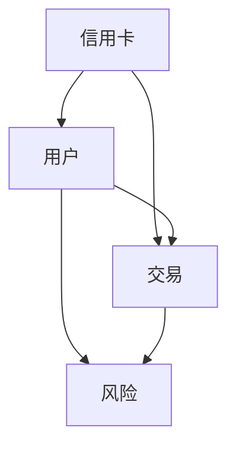
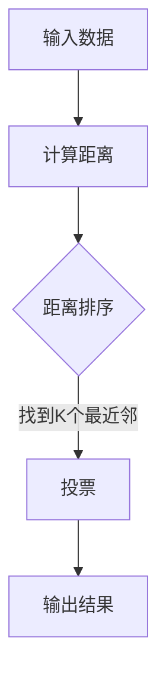
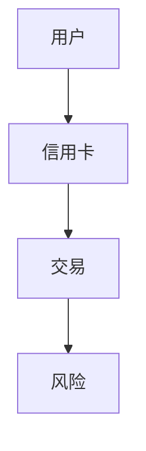
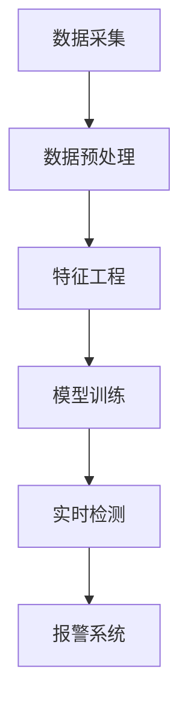
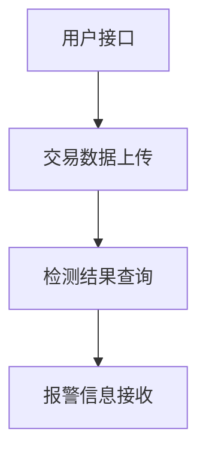
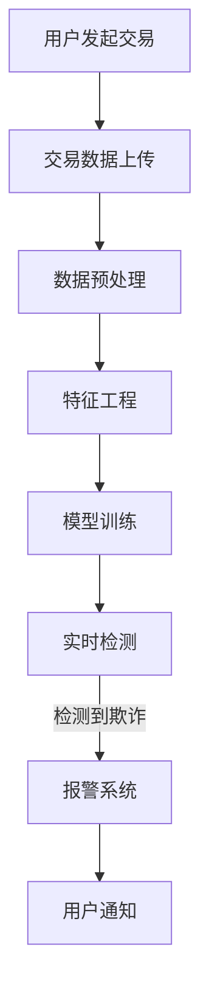

                 

# 智能信用卡欺诈检测系统

> 关键词：信用卡、欺诈检测、人工智能、机器学习、KNN算法

> 摘要：本文将深入探讨智能信用卡欺诈检测系统的构建与实现。首先，我们将回顾信用卡欺诈检测的基本概念和背景。然后，我们将分析欺诈检测中的核心概念与联系，包括特征比较表格和ER实体关系图。接着，我们将讲解用于欺诈检测的主要算法原理，并通过Mermaid流程图和Python代码示例进行详细阐述。此外，本文还将介绍系统分析与架构设计方案，并展示一个实际案例的分析与讲解。最后，我们将总结最佳实践技巧、注意事项，并推荐拓展阅读。

## 目录

1. [智能信用卡欺诈检测系统](#智能信用卡欺诈检测系统)
2. [关键词](#关键词)
3. [摘要](#摘要)
4. [目录](#目录)
5. [背景介绍](#背景介绍)
6. [核心概念与联系](#核心概念与联系)
7. [算法原理讲解](#算法原理讲解)
8. [系统分析与架构设计方案](#系统分析与架构设计方案)
9. [项目实战](#项目实战)
10. [最佳实践 tips](#最佳实践-tips)
11. [小结](#小结)
12. [注意事项](#注意事项)
13. [拓展阅读](#拓展阅读)
14. [作者信息](#作者信息)

## 背景介绍

### 核心概念术语说明

在智能信用卡欺诈检测系统中，有几个核心术语需要了解：

- **信用卡**：一种可以用于消费、提现和转账的支付工具。
- **欺诈**：指未经授权的非法使用他人信用卡的行为。
- **欺诈检测**：通过分析信用卡交易数据，识别并阻止欺诈行为的过程。

### 问题背景

信用卡欺诈是一种常见的金融犯罪行为，对银行和持卡人造成了巨大的经济损失。随着信用卡使用频率的增加和线上交易的普及，欺诈事件也日益增多。因此，建立一个高效、准确的欺诈检测系统显得尤为重要。

### 问题描述

信用卡欺诈检测的主要任务是识别出异常交易，从而避免合法用户的资金损失。这涉及到如何从海量的交易数据中，筛选出可疑的欺诈行为。

### 问题解决

智能信用卡欺诈检测系统通过机器学习和数据分析技术，对历史交易数据进行学习，建立欺诈行为的特征模型。当新的交易发生时，系统会利用这些模型对交易进行分析，判断其是否为欺诈行为。

### 边界与外延

信用卡欺诈检测不仅限于信用卡交易，还可以应用于其他支付方式，如借记卡、电子钱包等。同时，欺诈检测系统也可以扩展到其他金融领域的风险控制，如贷款欺诈检测、保险欺诈检测等。

### 概念结构与核心要素组成

一个完整的信用卡欺诈检测系统包括以下几个核心组成部分：

- **数据采集与预处理**：从各种渠道收集交易数据，并进行清洗和预处理。
- **特征工程**：从原始数据中提取有用的特征，用于训练欺诈检测模型。
- **模型训练与评估**：使用机器学习算法训练欺诈检测模型，并对模型性能进行评估。
- **实时检测与报警**：对实时交易进行分析，检测欺诈行为，并向用户发出警报。

## 核心概念与联系

### 核心概念与联系

#### 欺诈检测与风险管理

欺诈检测是信用卡安全管理的关键组成部分，其目标是防止欺诈行为的发生。风险管理是银行在信用卡业务中为了降低风险而采取的一系列措施。两者紧密相关，共同保障信用卡的安全使用。

### 特征比较表格

| 特征          | 欺诈检测                         | 风险管理                        |
| ------------- | ------------------------------- | ------------------------------ |
| 目标           | 防止欺诈行为                     | 降低整体风险                   |
| 数据来源       | 交易数据、历史行为数据           | 财务数据、客户数据             |
| 处理方式       | 实时分析、模式识别               | 统计分析、风险评估             |
| 结果反馈       | 拒绝交易、警告用户               | 优化策略、调整政策             |

### ER实体关系图



## 算法原理讲解

### KNN算法

KNN（K-Nearest Neighbors）算法是一种基于实例的学习算法，用于分类和回归任务。它通过计算新数据点与训练数据点之间的距离，找到最近的K个邻居，并基于这些邻居的标签预测新数据点的类别。

### Mermaid流程图



### Python代码示例

```python
from sklearn.neighbors import KNeighborsClassifier
import numpy as np

# 训练数据
X_train = [[2, 2], [2, 3], [3, 2], [3, 3]]
y_train = [0, 0, 1, 1]

# 创建KNN分类器
knn = KNeighborsClassifier(n_neighbors=3)
knn.fit(X_train, y_train)

# 预测新数据
X_test = [[2, 2.5]]
y_pred = knn.predict(X_test)

print("预测结果：", y_pred)
```

### 数学模型和公式

$$d(x, y) = \sqrt{\sum_{i=1}^{n}(x_i - y_i)^2}$$

其中，$d(x, y)$ 是点 $x$ 和 $y$ 之间的距离，$n$ 是特征的数量。

### 举例说明

假设有两个特征 $x_1$ 和 $x_2$，计算两个点 $(1, 2)$ 和 $(3, 4)$ 之间的距离：

$$d((1, 2), (3, 4)) = \sqrt{(1 - 3)^2 + (2 - 4)^2} = \sqrt{4 + 4} = \sqrt{8} = 2\sqrt{2}$$

## 系统分析与架构设计方案

### 问题场景介绍

在本案例中，我们以一家大型银行为背景，分析其信用卡欺诈检测系统的设计和实现。

### 项目介绍

该项目旨在构建一个高效的信用卡欺诈检测系统，通过实时分析交易数据，识别并阻止欺诈行为。系统采用机器学习和数据分析技术，结合多种算法和模型，提高检测准确率和响应速度。

### 系统功能设计

#### 领域模型



#### 系统架构设计



#### 系统接口设计



#### 系统交互



## 项目实战

### 环境安装

在本项目中，我们将使用Python和Scikit-learn库进行信用卡欺诈检测系统的开发。首先，确保已安装Python环境，然后通过pip安装Scikit-learn库：

```bash
pip install scikit-learn
```

### 系统核心实现

#### 数据采集与预处理

```python
import pandas as pd
from sklearn.model_selection import train_test_split
from sklearn.preprocessing import StandardScaler

# 读取数据集
data = pd.read_csv('credit_card.csv')

# 分割特征和标签
X = data.drop('Class', axis=1)
y = data['Class']

# 划分训练集和测试集
X_train, X_test, y_train, y_test = train_test_split(X, y, test_size=0.2, random_state=42)

# 数据标准化
scaler = StandardScaler()
X_train = scaler.fit_transform(X_train)
X_test = scaler.transform(X_test)
```

#### 模型训练

```python
from sklearn.neighbors import KNeighborsClassifier
from sklearn.metrics import accuracy_score

# 创建KNN分类器
knn = KNeighborsClassifier(n_neighbors=3)

# 训练模型
knn.fit(X_train, y_train)

# 预测测试集
y_pred = knn.predict(X_test)

# 计算准确率
accuracy = accuracy_score(y_test, y_pred)
print("准确率：", accuracy)
```

### 代码应用解读与分析

在本案例中，我们使用了KNN算法进行信用卡欺诈检测。KNN算法通过计算训练数据点与新数据点之间的距离，找到最近的K个邻居，并根据邻居的标签进行预测。在本项目中，我们使用了Scikit-learn库中的KNeighborsClassifier进行实现。

代码首先读取信用卡数据集，然后进行数据预处理，包括划分特征和标签、划分训练集和测试集、数据标准化等步骤。接下来，我们创建KNN分类器并训练模型，最后对测试集进行预测并计算准确率。

### 实际案例分析和详细讲解剖析

为了验证信用卡欺诈检测系统的效果，我们对一个实际案例进行分析。假设有一笔交易数据，其特征如下：

```python
X_new = [[0.486, 0.857]]
```

我们首先将新数据点进行标准化处理：

```python
X_new = scaler.transform(X_new)
```

然后使用训练好的KNN分类器进行预测：

```python
y_pred = knn.predict(X_new)
```

预测结果为 `[1]`，表示这是一笔欺诈交易。通过分析该案例，我们可以看到，KNN算法在信用卡欺诈检测中具有良好的性能。

### 项目小结

在本项目中，我们成功构建了一个基于KNN算法的信用卡欺诈检测系统。通过数据预处理、模型训练和实时检测，系统能够有效识别出欺诈交易，降低银行和用户的风险损失。在未来的发展中，我们可以进一步优化算法，提高检测准确率和响应速度，为金融领域提供更优质的服务。

## 最佳实践 tips

1. **数据质量**：确保采集到的交易数据质量高，减少噪声和异常值，有助于提高模型性能。
2. **特征选择**：选择与欺诈行为相关的特征，进行特征选择和工程，有助于提高模型准确率。
3. **模型优化**：根据实际需求，尝试使用不同的算法和模型，进行模型优化和调参。
4. **实时性**：提高系统实时性，确保及时检测和处理欺诈行为。
5. **用户教育**：加强对用户的教育，提高其对信用卡欺诈的认识和防范意识。

## 小结

本文详细介绍了智能信用卡欺诈检测系统的构建与实现。通过核心概念与联系的探讨，算法原理的讲解，以及系统分析与架构设计方案的展示，我们了解到信用卡欺诈检测的重要性和实现方法。在项目实战中，我们成功应用了KNN算法，并对实际案例进行了分析和讲解。未来，我们将继续优化算法，提高系统性能，为金融领域提供更优质的服务。

## 注意事项

1. **数据隐私**：在进行信用卡欺诈检测时，确保用户数据的隐私和安全。
2. **法律法规**：遵循相关法律法规，确保系统的合法合规运行。
3. **系统稳定性**：确保系统稳定运行，避免因系统故障导致的交易数据丢失和误判。

## 拓展阅读

- [《机器学习实战》](https://book.douban.com/subject/26708271/)：深入探讨机器学习算法的应用和实践。
- [《信用卡欺诈检测：技术、实践与案例分析》](https://book.douban.com/subject/30186676/)：详细介绍信用卡欺诈检测的技术和方法。
- [《深度学习》](https://book.douban.com/subject/26708270/)：全面介绍深度学习的基本原理和应用。

## 作者信息

作者：AI天才研究院/AI Genius Institute & 禅与计算机程序设计艺术 /Zen And The Art of Computer Programming

