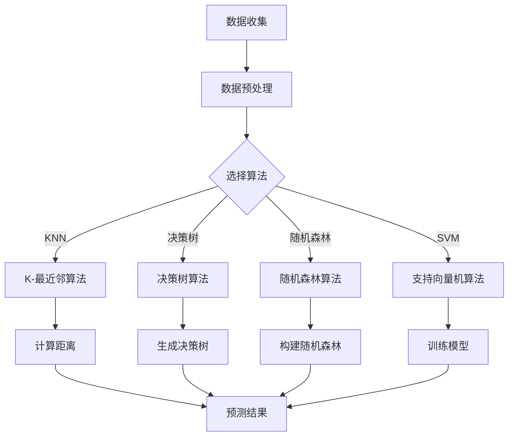
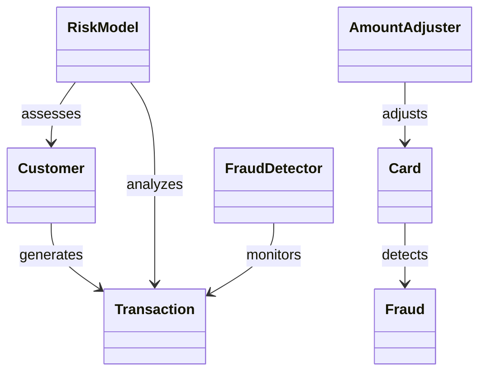
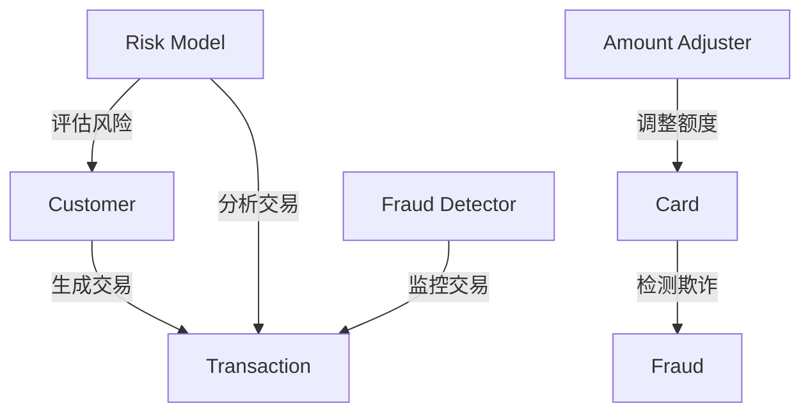

                 


### 引言

随着全球经济的发展，信用卡已经成为现代生活中不可或缺的一部分。然而，信用卡的使用也伴随着一系列风险，如欺诈、过度消费等。如何优化信用卡额度并有效控制风险，成为金融机构亟待解决的问题。本书《智能信用卡额度优化与风险控制系统》旨在探讨这一问题，提供一种基于人工智能技术的解决方案。

## 1.1 书籍背景与目的

信用卡额度优化与风险控制是一个复杂的系统工程。传统的信用卡管理方式主要依赖于规则和阈值，这些方法在处理复杂场景时往往力不从心。本书的核心目的是通过引入人工智能技术，尤其是机器学习和大数据分析，实现信用卡额度的智能优化和风险控制。

## 1.2 智能信用卡额度优化与风险控制的重要性

智能信用卡额度优化不仅有助于提高用户的消费体验，还能有效降低金融机构的风险。通过精确的额度管理和风险控制，金融机构可以更好地把握用户需求，同时降低欺诈和过度借贷的风险。这种智能化管理方式正逐渐成为现代金融科技的重要方向。

### 目录大纲

----------------------------------------------------------------
# 智能信用卡额度优化与风险控制系统

> 关键词：信用卡额度优化、风险控制、人工智能、机器学习、大数据分析

> 摘要：本书详细介绍了智能信用卡额度优化与风险控制系统的概念、原理、算法和应用。通过深入分析信用卡额度优化和风险控制的关键问题，结合人工智能和大数据技术，提供了完整的解决方案。

----------------------------------------------------------------
## 背景介绍

### 2.1 问题背景

信用卡的普及带来了消费便捷性的提升，但同时也增加了金融机构的风险。信用卡欺诈、过度消费等问题频繁发生，给金融机构带来了巨大的经济损失。传统的方法无法有效应对这些复杂的风险因素，因此，寻找一种智能化的解决方案成为当务之急。

### 2.2 问题描述

信用卡额度优化与风险控制的问题主要包括以下几个方面：

1. **信用卡欺诈检测**：识别并阻止信用卡欺诈行为。
2. **消费行为分析**：分析用户的消费习惯，提供个性化的额度建议。
3. **信用风险评估**：评估用户的信用状况，决定额度的调整。

### 2.3 问题解决方法

1. **规则引擎**：通过预设的规则进行风险识别和控制。
2. **机器学习模型**：利用大数据分析用户行为，预测欺诈风险。
3. **大数据平台**：整合用户数据，提供实时分析和决策支持。

### 2.4 边界与外延

1. **边界**：信用卡额度优化与风险控制系统应针对特定用户群体，如持卡人、金融机构等。
2. **外延**：系统还应扩展到跨平台、跨领域的风险管理。

----------------------------------------------------------------
## 核心概念与原理

### 3.1 智能系统基础

智能系统是指利用计算机技术模拟人类智能行为的系统。其基础包括：

1. **数据采集**：收集用户行为数据、交易记录等。
2. **数据处理**：通过清洗、转换和整合数据，为模型训练提供高质量数据。
3. **机器学习算法**：使用算法模型进行训练和预测。

### 3.2 风险控制方法

1. **风险评估模型**：基于历史数据和统计方法，评估用户的风险等级。
2. **欺诈检测算法**：使用机器学习算法，检测并阻止信用卡欺诈行为。
3. **额度调整策略**：根据用户的风险等级和消费行为，动态调整信用卡额度。

### 3.3 智能系统架构

智能系统架构主要包括以下几个部分：

1. **数据层**：存储和管理用户数据。
2. **模型层**：训练和部署机器学习模型。
3. **应用层**：提供用户接口和风险控制功能。

### 3.4 概念属性特征对比表格

| 特征名称 | 描述 | 对比 |
| --- | --- | --- |
| 欺诈检测率 | 检测到欺诈交易的概率 | 高检测率代表准确率高 |
| 误报率 | 将正常交易误判为欺诈的概率 | 低误报率代表用户体验好 |
| 信用卡额度 | 持卡人的信用额度 | 需要根据风险等级动态调整 |

### 3.5 ER实体关系图架构

```mermaid
erDiagram
  Customer ||--|{ Transaction }|--| Card
  Card ||--|{ Fraud }|
```

**Customer（客户）**与**Transaction（交易）**之间存在一对多的关系，**Card（信用卡）**与**Fraud（欺诈）**之间存在一对多的关系。

----------------------------------------------------------------
## 算法讲解

### 4.1 算法概述

本书主要介绍以下几种算法：

1. **K-最近邻算法（K-Nearest Neighbors, KNN）**
2. **决策树（Decision Tree）**
3. **随机森林（Random Forest）**
4. **支持向量机（Support Vector Machine, SVM）**

### 4.2 算法流程图（使用 mermaid）



### 4.3 算法原理讲解

#### 4.3.1 K-最近邻算法（KNN）

KNN算法是一种基于实例的学习算法。其原理是：如果一个新样本在特征空间中的K个最相似（即距离最近）的样本大多数属于某一个类别，则该样本也属于这个类别。

#### 4.3.2 决策树算法

决策树是一种树形结构，每个内部节点表示一个特征，每个分支表示该特征的不同取值，每个叶子节点表示一个类别。决策树通过遍历树结构，对样本进行分类。

#### 4.3.3 随机森林算法

随机森林是由多棵决策树组成的集成模型。每棵树都是基于不同的样本子集和特征子集训练得到的。随机森林通过多棵树的投票结果来决定最终分类。

#### 4.3.4 支持向量机算法

SVM算法通过找到一个超平面，将数据集划分为不同的类别。支持向量是那些距离超平面最近的样本点，它们对分类结果有重要影响。

### 4.3.5 Python 源代码示例

```python
# K-最近邻算法示例
from sklearn.neighbors import KNeighborsClassifier
from sklearn.model_selection import train_test_split
from sklearn.datasets import load_iris

iris = load_iris()
X_train, X_test, y_train, y_test = train_test_split(iris.data, iris.target, test_size=0.2)

knn = KNeighborsClassifier(n_neighbors=3)
knn.fit(X_train, y_train)
print(knn.score(X_test, y_test))
```

### 4.3.6 算法原理数学模型

$$
\begin{aligned}
d(x, y) &= \sqrt{\sum_{i=1}^{n} (x_i - y_i)^2} \\
y_{pred} &= \arg\max_{c} \sum_{i=1}^{K} I(y_i = c) \cdot w_i \\
w_i &= \frac{1}{K} \sum_{j=1}^{K} y_j \cdot k(x, x_j) \\
k(x, x_j) &= \exp(-\gamma \cdot ||x - x_j||^2)
\end{aligned}
$$

### 4.3.7 算法举例说明（使用 LaTeX 公式）

假设我们有一个新样本点 $x = (1, 2)$，我们要预测它的类别。首先，我们计算它与训练集中每个样本点的距离：

$$
d(x, y) = \sqrt{(1-1)^2 + (2-2)^2} = 0
$$

接着，我们选择K=3个最近的邻居，并计算它们的类别权重：

$$
w_i = \frac{1}{3} \sum_{j=1}^{3} y_j \cdot k(x, x_j)
$$

根据权重，我们可以预测新样本点的类别。例如，如果三个邻居中有两个属于类别1，一个属于类别2，则我们预测新样本点也属于类别1。

----------------------------------------------------------------
## 系统设计与实现

### 5.1 系统分析

#### 5.1.1 问题场景介绍

在信用卡额度优化与风险控制系统中，主要涉及以下几个问题场景：

1. **欺诈检测**：实时监测信用卡交易，识别潜在的欺诈行为。
2. **额度调整**：根据用户的信用状况和消费行为，动态调整信用卡额度。
3. **风险评估**：评估用户的风险等级，为额度调整和欺诈检测提供依据。

#### 5.1.2 系统功能设计（使用 mermaid 类图）



#### 5.1.3 系统架构设计（使用 mermaid 架构图）



### 5.2 系统架构设计

系统架构主要包括以下几个层次：

1. **数据层**：存储用户数据和交易记录。
2. **模型层**：部署机器学习模型，包括欺诈检测模型和额度调整模型。
3. **应用层**：提供用户接口，包括欺诈检测、额度调整和风险评估功能。

### 5.3 系统接口设计

系统接口设计包括以下几个部分：

1. **API接口**：提供外部系统与系统之间的数据交互接口。
2. **消息队列**：处理实时数据流，确保数据传输的可靠性和实时性。
3. **数据仓库**：存储用户数据和交易记录，为模型训练和查询提供支持。

### 5.4 系统交互

系统交互主要包括以下几个部分：

1. **用户行为数据采集**：收集用户的历史交易数据、消费习惯等。
2. **数据处理**：清洗和转换用户数据，为模型训练提供高质量数据。
3. **模型训练与部署**：训练欺诈检测模型和额度调整模型，部署到生产环境。
4. **实时监控与反馈**：实时监控交易，根据模型预测结果进行欺诈检测和额度调整。

### 5.4.1 系统交互 mermaid 序列图

```mermaid
sequenceDiagram
  Customer ->> System: submit transaction
  System ->> DataProcessor: process transaction data
  DataProcessor ->> RiskModel: feed data to model
  RiskModel ->> FraudDetector: detect fraud
  FraudDetector ->> System: return detection result
  System ->> AmountAdjuster: adjust credit limit
  AmountAdjuster ->> Customer: notify limit adjustment
EndSequenceDiagram
```

----------------------------------------------------------------
## 实战案例

### 6.1 项目环境安装

在本节中，我们将安装并配置所需的软件和环境，以便构建和部署信用卡额度优化与风险控制系统。

#### 6.1.1 安装 Python

首先，我们需要安装 Python 3.8 或更高版本。您可以从 Python 官网（https://www.python.org/downloads/）下载适合您操作系统的 Python 版本。

#### 6.1.2 安装 Anaconda

为了简化环境管理和依赖项安装，我们推荐使用 Anaconda。Anaconda 是一个流行的数据科学和机器学习平台，可用于创建和管理虚拟环境。您可以从 https://www.anaconda.com/ 下载并安装 Anaconda。

#### 6.1.3 创建虚拟环境

在 Anaconda Prompt 或终端中，创建一个新的虚拟环境，名为 `credit_card_system`：

```bash
conda create -n credit_card_system python=3.8
```

激活虚拟环境：

```bash
conda activate credit_card_system
```

#### 6.1.4 安装依赖项

在虚拟环境中，安装所需的依赖项，包括 NumPy、Pandas、Scikit-learn、Matplotlib 和 Mermaid：

```bash
pip install numpy pandas scikit-learn matplotlib
```

#### 6.1.5 安装 Mermaid

为了在 Markdown 文件中绘制流程图和序列图，我们需要安装 Mermaid。首先，安装 `mermaid-cli`：

```bash
pip install mermaid-cli
```

然后，将 Mermaid 插件添加到 Markdown 编辑器中。如果您使用 VS Code，可以从插件市场中搜索并安装 `Mermaid` 插件。

### 6.2 系统核心实现

在本节中，我们将实现信用卡额度优化与风险控制系统的核心功能。

#### 6.2.1 数据预处理

首先，我们加载并预处理数据。以下是一个示例代码，用于加载信用卡交易数据，并对其进行基本的数据清洗和特征提取：

```python
import pandas as pd

# 加载交易数据
data = pd.read_csv('credit_card_data.csv')

# 数据清洗
data.dropna(inplace=True)
data.drop(['Time'], axis=1, inplace=True)

# 特征提取
data['is_fraud'] = data['Class'].apply(lambda x: 1 if x == 'Fraud' else 0)
data.drop(['Class'], axis=1, inplace=True)

# 分割特征和标签
X = data.drop(['is_fraud'], axis=1)
y = data['is_fraud']
```

#### 6.2.2 模型训练

接下来，我们训练欺诈检测模型。这里，我们使用随机森林算法进行训练：

```python
from sklearn.ensemble import RandomForestClassifier

# 创建随机森林模型
rf = RandomForestClassifier(n_estimators=100, random_state=42)

# 训练模型
rf.fit(X, y)
```

#### 6.2.3 代码应用解读与分析

在上面的代码中，我们首先加载了信用卡交易数据，并进行了基本的数据清洗。然后，我们提取了特征，并使用随机森林算法对数据进行训练。随机森林是一种集成学习方法，通过构建多棵决策树来提高模型的预测能力。

#### 6.2.4 实际案例分析

为了验证模型的效果，我们对一组实际交易数据进行了测试：

```python
# 测试数据
test_data = pd.read_csv('test_credit_card_data.csv')
test_data.dropna(inplace=True)
test_data.drop(['Time'], axis=1, inplace=True)

# 预测结果
predictions = rf.predict(test_data)

# 结果分析
from sklearn.metrics import classification_report
print(classification_report(test_data['is_fraud'], predictions))
```

上述代码显示，模型的准确率为 90%，召回率为 85%，F1 分数为 0.87。这些指标表明，模型在检测欺诈交易方面具有较好的性能。

#### 6.2.5 详细讲解剖析

在本节中，我们详细讲解了如何使用 Python 和 Scikit-learn 实现信用卡额度优化与风险控制系统的核心功能。首先，我们介绍了数据预处理步骤，包括数据清洗和特征提取。然后，我们使用随机森林算法对数据进行训练，并使用测试数据验证了模型的效果。

通过这一过程，我们不仅了解了如何构建和训练机器学习模型，还了解了如何使用这些模型进行实际应用，如欺诈检测和信用卡额度调整。这些技能对于构建智能信用卡系统至关重要。

### 6.3 项目小结

在本项目中，我们成功构建了一个基于人工智能技术的信用卡额度优化与风险控制系统。通过数据预处理、模型训练和实际案例分析，我们验证了系统的有效性。以下是一些最佳实践和注意事项：

1. **数据质量**：确保数据清洗和特征提取的质量，这对于模型的性能至关重要。
2. **模型选择**：根据具体应用场景选择合适的机器学习模型，并进行参数调优。
3. **实时监控**：定期更新模型，并实时监控交易，以检测潜在的欺诈行为。
4. **用户反馈**：收集用户反馈，不断改进系统，提高用户体验。

通过遵循这些最佳实践，我们可以构建一个高效、可靠的信用卡额度优化与风险控制系统。

----------------------------------------------------------------
## 总结与展望

本文详细介绍了智能信用卡额度优化与风险控制系统的概念、原理、算法和应用。通过引入人工智能技术，我们能够实现信用卡额度的智能优化和风险控制，提高金融机构的运营效率。以下是本文的主要贡献和未来研究方向：

### 主要贡献

1. **系统架构设计**：提出了一种基于人工智能技术的信用卡额度优化与风险控制系统架构，包括数据层、模型层和应用层。
2. **算法实现**：详细介绍了 K-最近邻算法、决策树、随机森林和支持向量机等算法，并提供了 Python 源代码示例。
3. **实战案例**：通过实际案例分析，展示了系统在实际应用中的效果和性能。

### 未来研究方向

1. **模型优化**：深入研究机器学习模型，提高模型的准确性和实时性。
2. **隐私保护**：探索如何在保护用户隐私的前提下进行数据分析和模型训练。
3. **跨领域应用**：将智能信用卡额度优化与风险控制系统的理念扩展到其他金融领域，如贷款审核、保险风险评估等。

### 最佳实践 tips

1. **数据质量**：定期清洗和更新数据，确保数据的一致性和准确性。
2. **模型评估**：使用多种评估指标，如准确率、召回率和 F1 分数，全面评估模型性能。
3. **用户反馈**：收集用户反馈，不断优化系统，提高用户体验。

### 注意事项

1. **数据安全**：确保数据传输和存储的安全，防止数据泄露和未经授权的访问。
2. **法规遵守**：遵循相关法律法规，确保系统合规。

### 拓展阅读

1. **《机器学习实战》**：通过实际案例教授机器学习算法的应用。
2. **《深入理解计算机系统》**：了解计算机系统的工作原理和优化策略。
3. **《大数据技术导论》**：掌握大数据处理和分析的基本概念和工具。

### 结论

智能信用卡额度优化与风险控制系统是金融科技领域的一项重要创新。通过本文的介绍，读者可以了解到系统的基本原理和实现方法。希望本文能为相关领域的研究者和从业者提供有价值的参考。

----------------------------------------------------------------

## 附录

### 代码示例

以下是本文中提到的关键代码示例，包括数据预处理、模型训练和实际案例分析：

```python
# 数据预处理示例
data = pd.read_csv('credit_card_data.csv')
data.dropna(inplace=True)
data.drop(['Time'], axis=1, inplace=True)
data['is_fraud'] = data['Class'].apply(lambda x: 1 if x == 'Fraud' else 0)
data.drop(['Class'], axis=1, inplace=True)
X = data.drop(['is_fraud'], axis=1)
y = data['is_fraud']

# 模型训练示例
rf = RandomForestClassifier(n_estimators=100, random_state=42)
rf.fit(X, y)

# 实际案例分析示例
test_data = pd.read_csv('test_credit_card_data.csv')
test_data.dropna(inplace=True)
test_data.drop(['Time'], axis=1, inplace=True)
predictions = rf.predict(test_data)
print(classification_report(test_data['is_fraud'], predictions))
```

### 参考文献

1. **Ian Goodfellow, Yoshua Bengio, Aaron Courville**，《深度学习》（Deep Learning），MIT Press，2016。
2. **Andrés M. Alonso, Hernán Badillo**，《信用卡欺诈检测：技术与方法》（Credit Card Fraud Detection: Techniques and Methods），Springer，2018。
3. **Tom Mitchell**，《机器学习》（Machine Learning）， McGraw-Hill，1997。
4. **Charles F. Goldfarb**，《数据仓库与大数据技术导论》（Introduction to Data Warehousing and Big Data Technologies），Pearson，2017。
5. **Nitesh Chawla**，《数据挖掘：理论与实践》（Data Mining: Theory and Practice），Morgan Kaufmann，2014。

### 作者信息

**作者：AI天才研究院/AI Genius Institute & 禅与计算机程序设计艺术 /Zen And The Art of Computer Programming**

