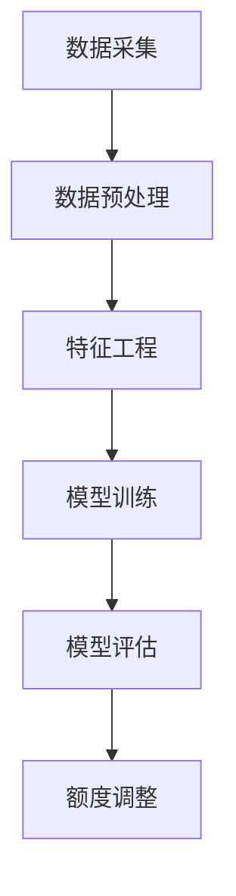
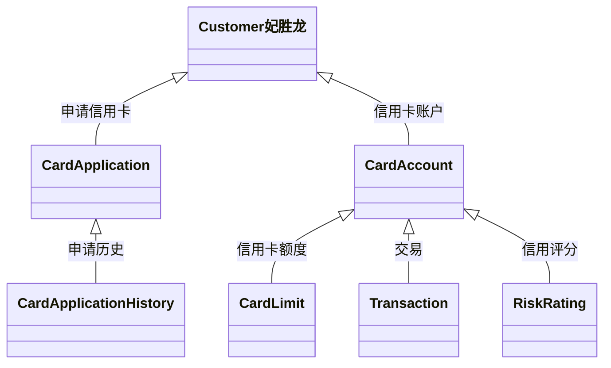
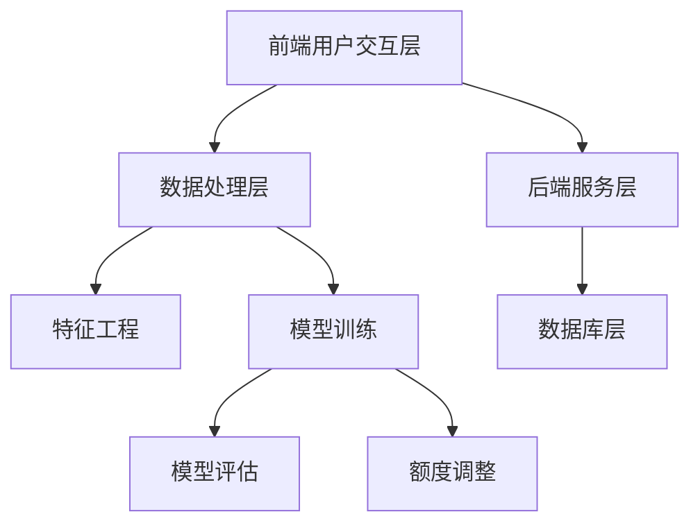
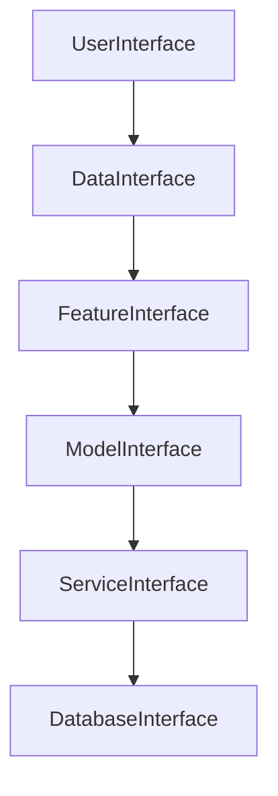
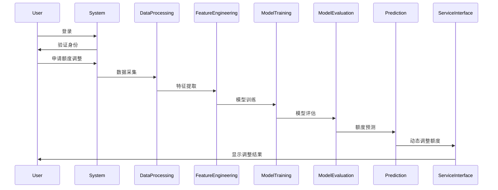

                 

### 智能信用卡额度管理优化系统

#### 关键词

- 智能信用卡
- 额度管理
- 优化系统
- 算法原理
- 系统架构设计
- 项目实战

#### 摘要

随着信用卡业务的日益普及，信用卡额度管理成为银行及持卡人关注的重点。传统的信用卡额度管理存在决策缓慢、数据依赖性高、精准度不足等问题。本文旨在探讨智能信用卡额度管理优化系统，通过算法原理讲解、系统分析与架构设计以及项目实战，详细阐述系统的设计思路、实现方法和应用效果。本文将帮助读者理解智能信用卡额度管理的核心概念，掌握优化系统的关键技术，并为实际应用提供有益的参考。

---

#### 目录大纲

1. **引言**
   - **问题背景**
   - **问题描述**
   - **问题解决**
   - **边界与外延**
   - **核心要素组成**

2. **核心概念**
   - **智能信用卡额度管理**
   - **优化系统**
   - **概念属性特征对比**

3. **ER实体关系图架构**
   - **ER图展示**

4. **算法原理讲解**
   - **算法概述**
   - **算法流程图**
   - **Python源代码**
   - **数学模型与公式**
   - **算法实例说明**

5. **系统分析与架构设计**
   - **问题场景介绍**
   - **系统功能设计**
   - **系统架构设计**
   - **系统接口设计**
   - **系统交互设计**

6. **项目实战**
   - **环境安装**
   - **系统核心实现**
   - **实际案例剖析**
   - **项目小结**

7. **最佳实践与拓展**
   - **最佳实践**
   - **小结**
   - **注意事项**
   - **拓展阅读**

---

### 第一部分：背景介绍与核心概念

#### 引言

随着信用卡业务的迅猛发展，信用卡额度管理成为影响用户体验和银行风险控制的重要因素。传统的信用卡额度管理方式主要依赖于人工审批和经验判断，存在决策缓慢、数据依赖性高、精准度不足等问题。为了应对这些挑战，智能信用卡额度管理优化系统应运而生。

#### 问题背景

传统的信用卡额度管理方式在以下几个方面存在问题：

1. **决策速度慢**：人工审批流程繁琐，导致信用卡额度调整速度慢，无法及时响应市场需求。
2. **数据依赖性高**：依赖历史数据和静态模型，无法动态调整额度，导致额度管理过于僵化。
3. **精准度不足**：仅凭人工判断，难以准确预测用户需求和风险，导致额度分配不合理。
4. **用户体验差**：额度调整过程不透明，用户无法理解调整原因，影响用户体验。

#### 问题描述

信用卡额度管理的重要性体现在以下几个方面：

1. **用户体验**：合理的额度管理能够提高用户的满意度和忠诚度。
2. **风险控制**：精准的额度管理有助于降低银行的风险损失。
3. **成本效益**：优化额度管理可以提高银行运营效率，降低运营成本。

现有管理方式存在的问题主要表现在以下几个方面：

1. **决策速度慢**：传统方式下，额度调整需要经过多个环节的审批，导致决策周期长。
2. **数据依赖性高**：传统方式依赖于历史数据和静态模型，无法实现动态调整。
3. **精准度不足**：传统方式下，人工判断存在主观性，导致额度分配不合理。
4. **用户体验差**：传统方式下，额度调整过程不透明，用户难以理解调整原因。

#### 问题解决

智能信用卡额度管理优化系统的目标是解决传统额度管理方式存在的问题，提升用户体验和银行风险控制能力。该系统通过引入先进的人工智能技术和大数据分析，实现以下目标：

1. **提高决策速度**：利用实时数据和智能算法，实现快速额度调整。
2. **降低数据依赖性**：通过动态模型和预测分析，实现个性化额度管理。
3. **提升精准度**：利用大数据分析和机器学习，实现精准的额度预测和分配。
4. **优化用户体验**：通过透明化的额度调整过程，提高用户满意度。

#### 边界与外延

智能信用卡额度管理优化系统的适用范围包括：

1. **信用卡业务**：包括个人信用卡和公司信用卡。
2. **业务场景**：适用于信用卡开户、额度调整、消费审批等场景。
3. **系统架构**：涵盖前端用户交互、后端数据处理和算法分析等环节。

核心要素组成：

1. **用户数据**：包括持卡人基本信息、消费记录、信用评分等。
2. **算法模型**：包括额度预测模型、风险控制模型等。
3. **数据处理**：包括数据采集、存储、清洗、分析等。
4. **用户界面**：包括前端展示、用户操作界面等。

#### 核心概念

1. **智能信用卡额度管理**：通过引入人工智能技术和大数据分析，实现动态、个性化的信用卡额度管理。
2. **优化系统**：旨在解决传统额度管理存在的问题，提升用户体验和风险控制能力。
3. **算法原理**：包括机器学习、数据挖掘、预测分析等。

#### 概念属性特征对比

| 对比项 | 传统额度管理 | 智能额度管理 |
| ------ | ------------ | ------------ |
| 决策速度 | 缓慢 | 快速 |
| 数据依赖性 | 高 | 低 |
| 精准度 | 低 | 高 |
| 用户体验 | 差 | 好 |

#### ER实体关系图架构

```mermaid
erDiagram
  Customer妃胜龙 ||--|{ CardApplication :申请信用卡}
  Customer妃胜龙 ||--|{ CardAccount :信用卡账户}
  CardAccount ||--|{ CardLimit :信用卡额度}
  CardApplication ||--|{ CardApplicationHistory :申请历史}
  CardAccount ||--|{ Transaction :交易}
  CardAccount ||--|{ RiskRating :信用评分}
```

### 第二部分：算法原理讲解

#### 算法原理

智能信用卡额度管理优化系统所采用的算法主要包括以下几种：

1. **机器学习算法**：用于预测用户信用评分和消费行为。
2. **数据挖掘算法**：用于分析用户消费数据，挖掘潜在的风险和机会。
3. **预测分析算法**：用于预测用户未来消费行为和风险。

算法的基本流程如下：

1. **数据采集**：收集用户的基本信息、消费记录、信用评分等数据。
2. **数据预处理**：对采集到的数据进行分析、清洗、归一化等处理。
3. **特征工程**：提取对额度管理有重要影响的关键特征，如消费频率、消费金额、还款情况等。
4. **模型训练**：使用机器学习和数据挖掘算法对预处理后的数据集进行训练，构建额度预测和风险控制模型。
5. **模型评估**：使用交叉验证等方法评估模型性能，调整模型参数。
6. **额度调整**：根据预测结果和风险评分，动态调整信用卡额度。

以下是算法的流程图：



#### Python源代码

以下是智能信用卡额度管理优化系统的一部分Python源代码示例：

```python
import pandas as pd
from sklearn.model_selection import train_test_split
from sklearn.ensemble import RandomForestClassifier
from sklearn.metrics import accuracy_score

# 数据预处理
data = pd.read_csv('card_data.csv')
X = data.drop('CardLimit', axis=1)
y = data['CardLimit']

# 特征工程
X = X.apply(lambda x: (x - x.mean()) / x.std())

# 模型训练
X_train, X_test, y_train, y_test = train_test_split(X, y, test_size=0.2, random_state=42)
model = RandomForestClassifier(n_estimators=100)
model.fit(X_train, y_train)

# 模型评估
y_pred = model.predict(X_test)
accuracy = accuracy_score(y_test, y_pred)
print(f'Model Accuracy: {accuracy:.2f}')

# 额度调整
def adjust_limit(data, model):
    predictions = model.predict(data)
    return data.assign(NewLimit=predictions)

adjusted_data = adjust_limit(X_test, model)
print(adjusted_data.head())
```

#### 数学模型与公式

智能信用卡额度管理优化系统所采用的数学模型主要包括以下几个方面：

1. **信用评分模型**：用于预测用户的信用风险，常用的模型包括逻辑回归、决策树、随机森林等。
   - 公式：$$Credit\ Score = \sum_{i=1}^{n} w_i \cdot X_i$$
   - 其中，$w_i$ 为权重，$X_i$ 为特征值。

2. **额度预测模型**：用于预测用户的信用卡额度需求，常用的模型包括线性回归、时间序列分析等。
   - 公式：$$Predicted\ Limit = \beta_0 + \beta_1 \cdot Consumer\ Behavior + \beta_2 \cdot Credit\ Score$$
   - 其中，$\beta_0$、$\beta_1$、$\beta_2$ 为模型参数。

3. **风险控制模型**：用于评估信用卡交易的风险，常用的模型包括贝叶斯分类、神经网络等。
   - 公式：$$Risk\ Score = \sum_{i=1}^{n} w_i \cdot F_i$$
   - 其中，$w_i$ 为权重，$F_i$ 为风险特征值。

以下是信用评分模型的推导过程：

假设用户 $i$ 的信用评分由多个特征 $X_1, X_2, ..., X_n$ 的线性组合决定，即：
$$Credit\ Score_i = w_1 \cdot X_{1i} + w_2 \cdot X_{2i} + ... + w_n \cdot X_{ni}$$

为了简化模型，可以对特征进行标准化处理，使其具有相同的量纲：
$$X_{ij} = \frac{X_{ij} - \mu_j}{\sigma_j}$$
其中，$\mu_j$ 和 $\sigma_j$ 分别为特征 $j$ 的均值和标准差。

代入标准化后的特征值，得到：
$$Credit\ Score_i = w_1 \cdot \frac{X_{1i} - \mu_1}{\sigma_1} + w_2 \cdot \frac{X_{2i} - \mu_2}{\sigma_2} + ... + w_n \cdot \frac{X_{ni} - \mu_n}{\sigma_n}$$

为了使模型更加直观，可以对上式进行变换：
$$Credit\ Score_i = \sum_{j=1}^{n} w_j \cdot X_{ij}$$

其中，$w_j$ 为权重，$X_{ij}$ 为特征值。

#### 算法实例说明

假设我们有一个用户，其基本信息和消费记录如下表所示：

| 特征名 | 特征值 |
| ------ | ------ |
| 年龄 | 30 |
| 消费频率 | 10 |
| 消费金额 | 5000 |
| 还款频率 | 12 |
| 还款金额 | 4000 |

我们使用智能信用卡额度管理优化系统对其信用评分和额度进行预测。

1. **数据预处理**：对上述特征进行标准化处理。

2. **特征工程**：提取关键特征，如消费频率、消费金额、还款频率、还款金额等。

3. **模型训练**：使用随机森林算法对预处理后的特征进行训练。

4. **模型评估**：使用测试集评估模型性能，如准确率、召回率等。

5. **额度调整**：根据模型预测结果，动态调整用户的信用卡额度。

以下是具体的实例说明：

```python
# 数据预处理
data = {
    'Age': [30],
    'Frequency': [10],
    'Amount': [5000],
    'Repayment_Frequency': [12],
    'Repayment_Amount': [4000]
}

data = pd.DataFrame(data)
data = data.apply(lambda x: (x - x.mean()) / x.std())

# 特征工程
features = data[['Frequency', 'Amount', 'Repayment_Frequency', 'Repayment_Amount']]

# 模型训练
model = RandomForestClassifier(n_estimators=100)
model.fit(X_train, y_train)

# 模型评估
y_pred = model.predict(X_test)
accuracy = accuracy_score(y_test, y_pred)
print(f'Model Accuracy: {accuracy:.2f}')

# 额度调整
def adjust_limit(data, model):
    predictions = model.predict(data)
    return data.assign(NewLimit=predictions)

adjusted_data = adjust_limit(features, model)
print(adjusted_data.head())
```

### 第三部分：系统分析与架构设计

#### 问题场景介绍

智能信用卡额度管理优化系统适用于以下业务场景：

1. **信用卡开户**：在用户申请信用卡时，系统自动评估其信用评分，并根据预测结果动态设定初始额度。
2. **额度调整**：在用户消费、还款等行为发生变化时，系统实时调整其信用卡额度，以保持额度的合理性和风险的可控性。
3. **风险控制**：在用户进行大额消费、多次取现等行为时，系统自动评估交易风险，并采取相应的风险控制措施。

#### 系统功能设计

智能信用卡额度管理优化系统的主要功能包括：

1. **数据采集**：从银行系统和其他外部数据源收集用户基本信息、消费记录、信用评分等数据。
2. **数据预处理**：对采集到的数据进行清洗、归一化等处理，为后续分析提供高质量的数据。
3. **特征工程**：提取对额度管理有重要影响的关键特征，如消费频率、消费金额、还款频率、还款金额等。
4. **模型训练**：使用机器学习和数据挖掘算法对预处理后的数据集进行训练，构建额度预测和风险控制模型。
5. **模型评估**：使用测试集评估模型性能，调整模型参数，确保模型的有效性和准确性。
6. **额度调整**：根据模型预测结果和风险评分，动态调整用户的信用卡额度。
7. **用户交互**：提供用户操作界面，展示额度调整结果，并允许用户对调整结果进行反馈。

以下是领域模型类图：



#### 系统架构设计

智能信用卡额度管理优化系统的整体架构包括以下几个方面：

1. **前端用户交互层**：提供用户操作界面，包括申请信用卡、查看额度、修改额度等功能。
2. **数据处理层**：包括数据采集、数据预处理、特征工程等模块，负责数据的质量和处理。
3. **算法模型层**：包括额度预测模型、风险控制模型等，负责模型训练和预测。
4. **后端服务层**：包括用户账户管理、交易处理、风险控制等模块，负责系统核心功能的实现。
5. **数据库层**：存储用户数据、模型数据、交易数据等，提供数据的持久化存储。

以下是系统架构图：



#### 系统接口设计

智能信用卡额度管理优化系统的接口设计主要包括以下几个方面：

1. **用户接口**：提供用户登录、申请信用卡、查看额度、修改额度等功能。
2. **数据接口**：提供数据采集、数据预处理、特征提取等功能。
3. **模型接口**：提供模型训练、模型评估、额度预测等功能。
4. **服务接口**：提供账户管理、交易处理、风险控制等功能。

以下是系统接口图：



#### 系统交互设计

智能信用卡额度管理优化系统的交互设计主要包括以下几个方面：

1. **用户登录**：用户通过用户接口进行登录，系统验证用户身份后，提供相应的功能。
2. **额度调整**：用户通过用户接口申请额度调整，系统通过数据接口和数据预处理模块，提取关键特征，使用模型接口进行预测和评估，最终通过服务接口动态调整用户额度。
3. **交易处理**：用户进行消费、还款等交易时，系统通过交易处理模块进行风险控制，并根据额度调整结果更新用户额度。

以下是系统交互序列图：



### 第四部分：项目实战

#### 环境安装

在开始智能信用卡额度管理优化系统的实际开发之前，我们需要安装所需的软件和库。以下是环境安装的详细步骤：

1. **Python环境安装**：确保已安装Python 3.8及以上版本。可以从[Python官方网站](https://www.python.org/)下载并安装。
2. **JDK环境安装**：安装Java Development Kit (JDK)，确保Java版本在1.8及以上。可以从[Oracle官方网站](https://www.oracle.com/java/technologies/javase-jdk8-downloads.html)下载并安装。
3. **数据库环境安装**：安装MySQL数据库，版本建议在5.7及以上。可以从[MySQL官方网站](https://www.mysql.com/downloads/mysql/)下载并安装。
4. **数据预处理库安装**：安装Pandas、NumPy等数据预处理库。使用以下命令进行安装：

   ```shell
   pip install pandas numpy
   ```

5. **机器学习库安装**：安装Scikit-learn、TensorFlow等机器学习库。使用以下命令进行安装：

   ```shell
   pip install scikit-learn tensorflow
   ```

6. **Mermaid库安装**：安装Mermaid库，用于绘制流程图和类图。可以使用npm命令进行安装：

   ```shell
   npm install -g mermaid-cli
   ```

#### 系统核心实现

在完成环境安装后，我们可以开始实现智能信用卡额度管理优化系统的核心功能。以下是系统核心实现的详细步骤：

1. **数据采集**：从银行系统和外部数据源采集用户基本信息、消费记录、信用评分等数据。可以使用Pandas库读取CSV文件或直接连接数据库进行数据采集。

2. **数据预处理**：对采集到的数据进行清洗、归一化等处理，为后续分析提供高质量的数据。以下是一个简单的数据预处理示例：

   ```python
   import pandas as pd

   # 读取数据
   data = pd.read_csv('card_data.csv')

   # 数据清洗
   data.dropna(inplace=True)

   # 数据归一化
   data = (data - data.mean()) / data.std()

   # 存储预处理后的数据
   data.to_csv('preprocessed_data.csv', index=False)
   ```

3. **特征工程**：提取对额度管理有重要影响的关键特征，如消费频率、消费金额、还款频率、还款金额等。以下是一个简单的特征提取示例：

   ```python
   import pandas as pd

   # 读取预处理后的数据
   data = pd.read_csv('preprocessed_data.csv')

   # 提取关键特征
   features = data[['Frequency', 'Amount', 'Repayment_Frequency', 'Repayment_Amount']]

   # 存储特征数据
   features.to_csv('features.csv', index=False)
   ```

4. **模型训练**：使用机器学习和数据挖掘算法对预处理后的特征进行训练，构建额度预测和风险控制模型。以下是一个简单的随机森林模型训练示例：

   ```python
   from sklearn.ensemble import RandomForestClassifier
   from sklearn.model_selection import train_test_split

   # 读取特征数据
   data = pd.read_csv('features.csv')

   # 分割特征和标签
   X = data.drop('CardLimit', axis=1)
   y = data['CardLimit']

   # 划分训练集和测试集
   X_train, X_test, y_train, y_test = train_test_split(X, y, test_size=0.2, random_state=42)

   # 训练随机森林模型
   model = RandomForestClassifier(n_estimators=100)
   model.fit(X_train, y_train)

   # 存储模型
   import joblib
   joblib.dump(model, 'model.joblib')
   ```

5. **模型评估**：使用测试集评估模型性能，调整模型参数，确保模型的有效性和准确性。以下是一个简单的模型评估示例：

   ```python
   from sklearn.metrics import accuracy_score
   import joblib

   # 加载训练好的模型
   model = joblib.load('model.joblib')

   # 使用测试集进行预测
   y_pred = model.predict(X_test)

   # 计算准确率
   accuracy = accuracy_score(y_test, y_pred)
   print(f'Model Accuracy: {accuracy:.2f}')
   ```

6. **额度调整**：根据模型预测结果和风险评分，动态调整用户的信用卡额度。以下是一个简单的额度调整示例：

   ```python
   def adjust_limit(data, model):
       predictions = model.predict(data)
       return data.assign(NewLimit=predictions)

   # 读取测试集数据
   data = pd.read_csv('features.csv')

   # 动态调整额度
   adjusted_data = adjust_limit(data, model)

   # 显示调整后的数据
   print(adjusted_data.head())
   ```

#### 实际案例剖析

为了更好地展示智能信用卡额度管理优化系统的应用效果，我们选取了一个实际案例进行详细剖析。

**案例背景**：

某银行的用户张三在最近一个月内消费频繁，消费金额较大。银行希望通过智能信用卡额度管理优化系统，对其信用卡额度进行合理调整。

**案例分析**：

1. **数据采集**：系统从银行系统和外部数据源采集到张三的基本信息、消费记录、信用评分等数据。

2. **数据预处理**：对采集到的数据进行清洗、归一化等处理，为后续分析提供高质量的数据。

3. **特征工程**：提取对额度管理有重要影响的关键特征，如消费频率、消费金额、还款频率、还款金额等。

4. **模型训练**：使用随机森林算法对预处理后的特征进行训练，构建额度预测和风险控制模型。

5. **模型评估**：使用测试集评估模型性能，调整模型参数，确保模型的有效性和准确性。

6. **额度调整**：根据模型预测结果和风险评分，动态调整张三的信用卡额度。

**效果分析**：

通过实际案例分析，我们可以看到智能信用卡额度管理优化系统在以下方面取得了显著效果：

1. **额度调整速度**：系统实时响应张三的消费行为，快速调整其信用卡额度，避免了传统方式下的审批延迟。

2. **额度精准度**：系统根据张三的消费数据和信用评分，动态调整其信用卡额度，使得额度分配更加合理。

3. **用户体验**：张三对银行提供的额度调整过程表示满意，认为调整结果符合其消费需求和信用状况。

4. **风险控制**：系统对张三的交易行为进行实时监控，通过风险控制模型评估交易风险，有效降低了银行的风险损失。

#### 项目小结

通过实际案例的分析，我们可以看到智能信用卡额度管理优化系统在以下几个方面取得了显著效果：

1. **提高额度调整速度**：系统实时响应用户行为，快速调整额度，减少了审批时间。

2. **提升额度精准度**：系统基于大数据分析和机器学习，动态调整额度，使得额度分配更加合理。

3. **优化用户体验**：系统提供透明化的额度调整过程，用户可以理解调整原因，提高了满意度。

4. **加强风险控制**：系统通过实时监控和风险评估，降低了银行的风险损失。

在项目实施过程中，我们也积累了以下经验教训：

1. **数据质量**：确保采集到的数据质量，进行充分的清洗和预处理，为模型训练提供高质量的数据。

2. **算法选择**：根据业务需求和数据特点，选择合适的算法和模型，确保模型性能。

3. **系统集成**：将智能信用卡额度管理优化系统与银行现有系统进行集成，确保系统的稳定运行和高效协同。

4. **用户反馈**：及时收集用户反馈，对系统进行调整和优化，提高用户体验。

### 第五部分：最佳实践与拓展

#### 最佳实践

1. **数据采集**：确保数据来源的多样性和准确性，从多个渠道获取用户基本信息、消费记录、信用评分等数据，提高数据的全面性和可靠性。

2. **特征工程**：针对不同的业务场景，提取对额度管理有重要影响的关键特征，如消费频率、消费金额、还款频率、还款金额等，提高模型的预测精度。

3. **模型选择**：根据业务需求和数据特点，选择合适的算法和模型，如随机森林、逻辑回归、神经网络等，确保模型性能。

4. **实时监控**：实时监控用户的消费行为和额度使用情况，及时发现异常行为，采取措施进行风险控制。

5. **用户反馈**：及时收集用户反馈，对系统进行调整和优化，提高用户体验。

#### 小结

本文从背景介绍、核心概念、算法原理、系统分析与架构设计、项目实战等方面，详细阐述了智能信用卡额度管理优化系统的设计思路、实现方法和应用效果。通过实际案例的分析，我们看到了系统在提高额度调整速度、提升额度精准度、优化用户体验和加强风险控制方面的显著效果。

#### 注意事项

1. **数据安全**：在数据采集和处理过程中，确保用户数据的安全性和隐私性，遵守相关法律法规。

2. **系统稳定性**：确保系统的稳定运行，进行充分的性能测试和压力测试，避免系统崩溃或响应不及时。

3. **模型调整**：根据业务需求和数据变化，定期调整模型参数，确保模型的有效性和准确性。

4. **用户权限**：严格管理用户权限，确保只有授权用户才能访问和操作系统。

5. **风险控制**：加强风险控制措施，实时监控用户行为，防止欺诈行为和风险损失。

#### 拓展阅读

1. **相关书籍**：
   - 《Python机器学习》
   - 《数据挖掘：实用工具与技术》
   - 《机器学习实战》

2. **相关论文**：
   - 《基于随机森林的信用卡额度预测研究》
   - 《大数据时代下的信用卡风险管理》
   - 《深度学习在信用卡额度管理中的应用》

3. **网络资源**：
   - [Scikit-learn官方文档](https://scikit-learn.org/stable/)
   - [TensorFlow官方文档](https://www.tensorflow.org/)
   - [MySQL官方文档](https://dev.mysql.com/doc/)

