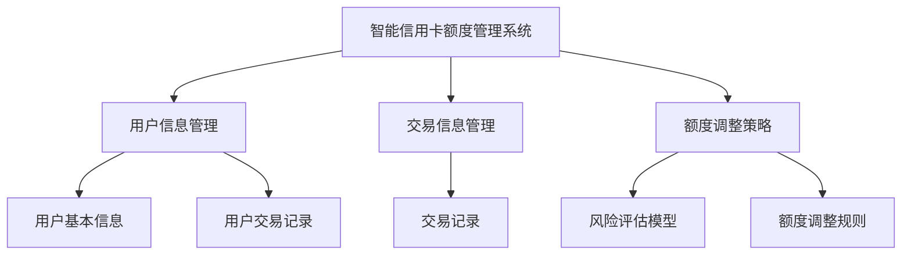
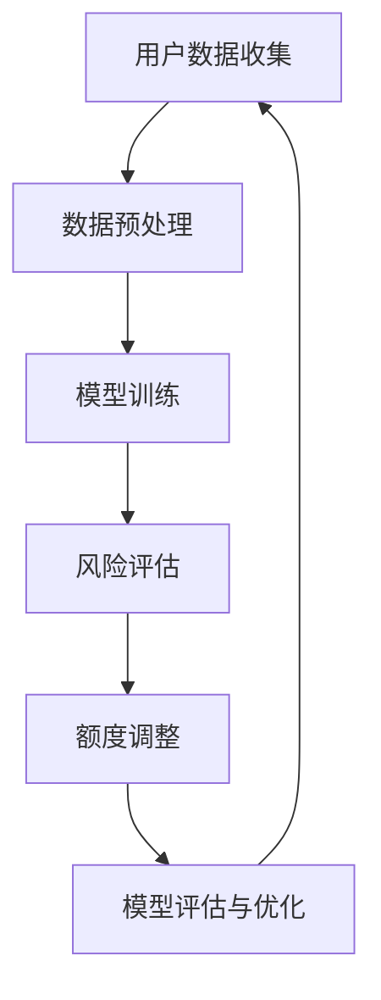
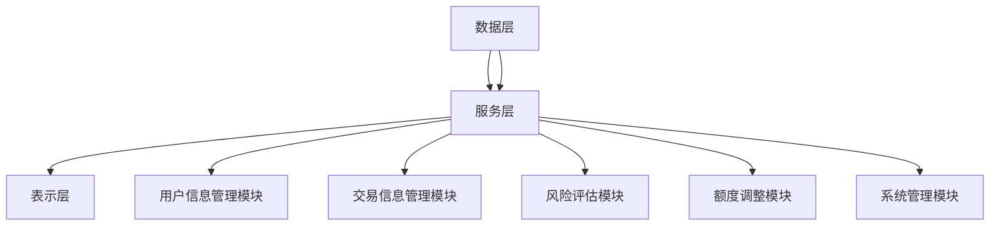
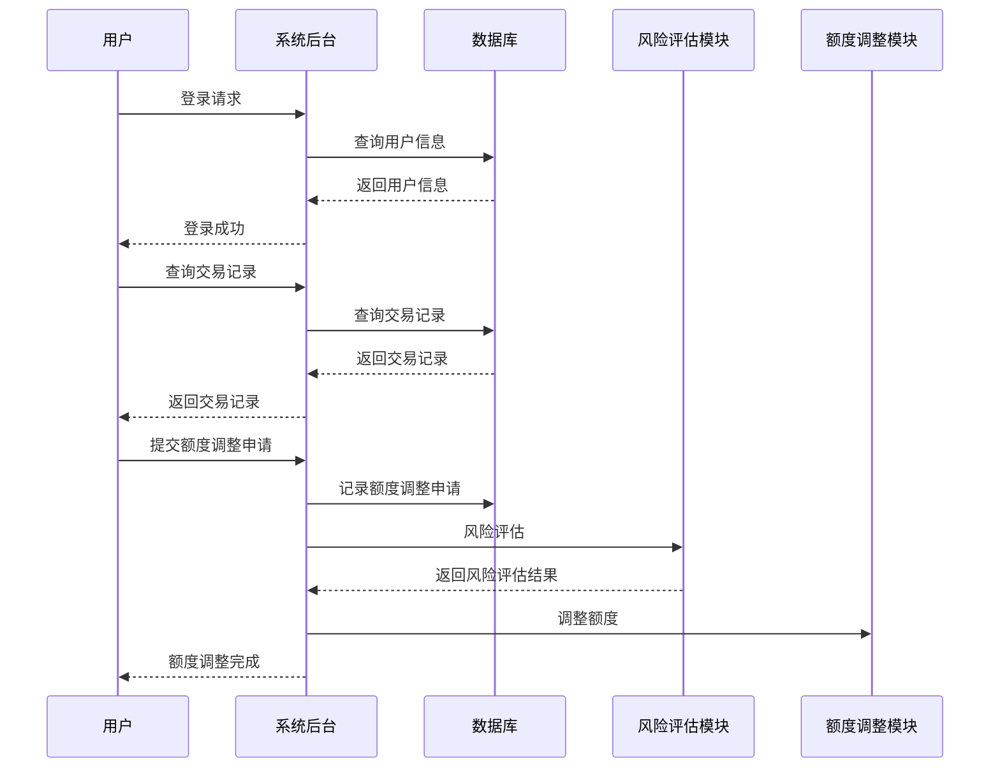

                 

### 第一部分：背景介绍

#### 1.1 问题背景

##### 1.1.1 信用卡额度管理的现状与挑战

在当今数字化时代，信用卡已成为个人和企业进行日常消费和支付的重要工具。信用卡额度管理作为银行服务的重要组成部分，直接影响着用户的使用体验和银行的运营效率。然而，随着信用卡用户数量的增加和交易额的攀升，信用卡额度管理的现状面临着诸多挑战。

首先，传统信用卡额度管理方法主要依赖于用户的信用记录、收入水平等静态数据，无法及时、准确地反映用户的实时经济状况。这可能导致额度过高或过低，影响用户体验和银行的收益。其次，信用卡欺诈和风险控制问题日益严峻，传统方法在识别和防范风险方面存在不足。此外，随着互联网金融和移动支付的兴起，用户对信用卡服务的需求发生了变化，传统管理模式难以满足个性化、实时化的服务需求。

##### 1.1.2 智能信用卡额度管理系统的重要性

智能信用卡额度管理系统是一种基于大数据、人工智能技术的创新解决方案，能够有效应对传统信用卡额度管理的挑战。其重要性体现在以下几个方面：

1. **提高额度管理的准确性**：智能系统通过收集和分析用户的实时数据，如消费行为、还款记录等，动态调整信用卡额度，提高管理准确性。

2. **降低风险**：智能系统利用机器学习算法，对用户交易行为进行实时监控和风险评估，有效识别欺诈行为，降低风险。

3. **提升用户体验**：智能系统可以根据用户的个性化需求，提供实时、个性化的额度调整服务，提升用户体验。

4. **提高运营效率**：通过自动化处理，智能系统可以减少人工干预，提高银行的运营效率，降低成本。

#### 1.2 问题描述

##### 1.2.1 信用卡额度管理的问题表现

信用卡额度管理存在的问题主要表现在以下几个方面：

1. **额度分配不合理**：传统信用卡额度管理方法可能导致部分用户额度过高，而另一些用户额度不足，影响用户体验。

2. **风险控制不足**：传统方法在识别欺诈行为方面存在不足，导致信用卡欺诈风险增加。

3. **管理效率低下**：传统管理模式依赖人工处理，效率低下，难以满足大量用户的个性化需求。

4. **个性化服务不足**：传统方法难以根据用户实时行为和需求提供个性化额度调整服务。

##### 1.2.2 信用卡额度管理的目标与期望

智能信用卡额度管理系统旨在解决传统信用卡额度管理中的问题，实现以下目标：

1. **精准额度分配**：通过大数据分析和机器学习算法，实现精准额度分配，满足用户个性化需求。

2. **强化风险控制**：利用机器学习和实时监控技术，提高欺诈识别能力和风险控制水平。

3. **提升管理效率**：通过自动化处理和智能化管理，提高银行运营效率，降低成本。

4. **优化用户体验**：根据用户实时行为和需求，提供个性化额度调整服务，提升用户体验。

#### 1.3 问题解决

##### 1.3.1 智能信用卡额度管理系统的基本原理

智能信用卡额度管理系统的基本原理是基于大数据分析和机器学习技术，通过收集和分析用户的实时数据，如消费行为、还款记录、信用评分等，动态调整信用卡额度。系统主要包括以下模块：

1. **数据收集模块**：收集用户的消费行为、还款记录、信用评分等数据。

2. **数据处理模块**：对收集到的数据进行分析和处理，提取关键信息。

3. **风险评估模块**：利用机器学习算法对用户交易行为进行风险评估，识别潜在风险。

4. **额度调整模块**：根据风险评估结果和用户需求，自动调整信用卡额度。

##### 1.3.2 智能信用卡额度管理系统的实施步骤

智能信用卡额度管理系统的实施步骤如下：

1. **系统设计**：根据银行需求和业务流程，设计智能信用卡额度管理系统的架构和功能模块。

2. **数据收集**：建立数据收集渠道，收集用户的消费行为、还款记录、信用评分等数据。

3. **数据处理**：对收集到的数据进行分析和处理，提取关键信息。

4. **风险评估**：利用机器学习算法对用户交易行为进行风险评估，识别潜在风险。

5. **额度调整**：根据风险评估结果和用户需求，自动调整信用卡额度。

6. **系统部署**：将系统部署到银行服务器，进行实际应用。

7. **系统优化**：根据实际应用效果，不断优化系统性能和功能。

#### 1.4 边界与外延

##### 1.4.1 智能信用卡额度管理系统的研究范围

智能信用卡额度管理系统的研究范围主要包括以下几个方面：

1. **技术架构**：研究智能信用卡额度管理系统的技术架构，包括数据收集、数据处理、风险评估和额度调整等模块。

2. **算法模型**：研究用于风险评估和额度调整的算法模型，如机器学习算法、深度学习算法等。

3. **业务流程**：研究智能信用卡额度管理系统的业务流程，包括数据收集、数据处理、风险评估和额度调整等环节。

4. **用户体验**：研究智能信用卡额度管理系统对用户体验的影响，包括额度分配的准确性、风险控制的水平、个性化服务的满意度等。

##### 1.4.2 智能信用卡额度管理系统的影响因素

智能信用卡额度管理系统的影响因素主要包括以下几个方面：

1. **数据质量**：数据质量直接影响风险评估和额度调整的准确性，因此需要确保数据收集和处理过程的准确性。

2. **算法模型**：算法模型的性能直接影响风险识别和额度调整的效率，需要不断优化和更新算法模型。

3. **系统性能**：系统性能包括处理速度、稳定性、可靠性等，需要确保系统的高性能和稳定性。

4. **用户体验**：用户体验包括额度分配的合理性、风险控制的透明度、个性化服务的满意度等，需要不断改进和优化。

#### 1.5 核心概念结构与核心要素组成

##### 1.5.1 核心概念定义

1. **信用卡额度**：指银行授予信用卡用户在一定期限内可以使用的最高信用额度。

2. **智能信用卡额度管理系统**：基于大数据和人工智能技术，实现信用卡额度动态调整的系统。

3. **数据收集模块**：负责收集用户交易行为、还款记录等数据的模块。

4. **数据处理模块**：负责对收集到的数据进行处理和分析的模块。

5. **风险评估模块**：负责对用户交易行为进行风险评估的模块。

6. **额度调整模块**：根据风险评估结果和用户需求，自动调整信用卡额度的模块。

##### 1.5.2 核心要素解析

1. **数据质量**：数据质量是智能信用卡额度管理系统的基础，直接影响系统的准确性和可靠性。

2. **算法模型**：算法模型是智能信用卡额度管理系统的核心，决定系统的风险识别和额度调整能力。

3. **数据处理能力**：数据处理能力是系统性能的关键，影响系统的响应速度和稳定性。

4. **用户体验**：用户体验是系统设计的重要目标，直接影响用户对系统的满意度和忠诚度。

#### 1.6 本章小结

本文首先介绍了信用卡额度管理的现状与挑战，阐述了智能信用卡额度管理系统的重要性。接着，对信用卡额度管理存在的问题进行了详细分析，并提出了智能信用卡额度管理系统的目标与期望。然后，介绍了智能信用卡额度管理系统的基本原理和实施步骤，明确了系统的边界与外延。最后，对核心概念与要素进行了定义和解析，为后续章节的深入探讨奠定了基础。

------------------------------------------------------------------
# 第二部分：核心概念与联系

#### 2.1 智能信用卡额度管理系统的核心概念

##### 2.1.1 智能信用卡额度管理系统的定义

智能信用卡额度管理系统是一种基于大数据分析和人工智能技术的金融管理系统，旨在通过实时数据分析、风险评估和机器学习算法，动态调整信用卡用户额度，提高额度管理的精准性、风险控制和用户体验。

##### 2.1.2 智能信用卡额度管理系统的分类

智能信用卡额度管理系统可以根据不同的分类标准进行分类，如按技术实现方式、业务模式等。以下是几种常见的分类方法：

1. **按技术实现方式分类**：

   - **基于大数据分析的系统**：利用海量数据，通过数据挖掘和机器学习算法，对用户行为和风险因素进行分析和预测。

   - **基于人工智能的系统**：利用深度学习、神经网络等人工智能技术，对用户行为和风险进行建模和预测。

2. **按业务模式分类**：

   - **主动调整模式**：系统根据用户行为和风险评估结果，主动调整信用卡额度，无需用户申请。

   - **被动调整模式**：用户申请额度调整，系统根据申请情况和风险评估结果，进行额度调整。

##### 2.1.3 智能信用卡额度管理系统的属性特征

智能信用卡额度管理系统的属性特征主要包括以下方面：

1. **实时性**：系统能够实时收集、处理和分析用户交易数据，动态调整信用卡额度。

2. **准确性**：系统能够通过大数据分析和机器学习算法，准确评估用户信用风险，提高额度分配的准确性。

3. **灵活性**：系统可以根据用户需求和风险状况，灵活调整信用卡额度，满足个性化服务需求。

4. **自动化**：系统通过自动化处理，减少人工干预，提高管理效率。

##### 2.1.4 智能信用卡额度管理系统与传统信用卡额度管理系统的对比

智能信用卡额度管理系统与传统信用卡额度管理系统在多个方面存在显著差异，具体如下：

1. **数据来源**：

   - **传统系统**：主要依赖用户的信用记录、收入水平等静态数据。

   - **智能系统**：利用大数据技术，实时收集用户的消费行为、还款记录等动态数据。

2. **风险评估**：

   - **传统系统**：主要依靠人工判断，风险评估效率低。

   - **智能系统**：利用机器学习算法，对用户行为进行实时监控和风险评估，提高风险识别能力。

3. **额度调整**：

   - **传统系统**：额度调整主要依赖人工审批，流程繁琐。

   - **智能系统**：自动调整额度，提高管理效率。

4. **用户体验**：

   - **传统系统**：难以满足个性化服务需求。

   - **智能系统**：根据用户行为和需求，提供实时、个性化的额度调整服务，提升用户体验。

##### 2.1.5 智能信用卡额度管理系统的优势

智能信用卡额度管理系统相较于传统信用卡额度管理系统具有以下优势：

1. **提高额度管理的精准性**：通过大数据分析和机器学习算法，实现精准额度分配，满足用户个性化需求。

2. **降低风险**：利用机器学习算法，提高欺诈识别能力和风险控制水平。

3. **提升用户体验**：提供实时、个性化的额度调整服务，提升用户满意度。

4. **提高管理效率**：自动化处理，减少人工干预，降低运营成本。

#### 2.2 智能信用卡额度管理系统的联系

##### 2.2.1 智能信用卡额度管理系统与其他系统的关系

智能信用卡额度管理系统作为银行服务体系的一部分，与其他系统紧密相连，共同为用户提供优质的金融服务。以下是智能信用卡额度管理系统与其他系统的关系：

1. **银行卡支付系统**：智能信用卡额度管理系统与银行卡支付系统紧密集成，确保交易数据实时传输和风险控制。

2. **信用评分系统**：智能信用卡额度管理系统利用信用评分系统的数据，对用户信用风险进行综合评估。

3. **客户管理系统**：智能信用卡额度管理系统与客户管理系统协同工作，收集用户行为数据，进行个性化服务。

##### 2.2.2 智能信用卡额度管理系统内部模块的联系

智能信用卡额度管理系统内部模块之间紧密协作，共同实现系统的功能。以下是各模块之间的联系：

1. **数据收集模块**：负责收集用户的交易数据、还款记录等，为其他模块提供数据支持。

2. **数据处理模块**：对收集到的数据进行分析和处理，提取关键信息，为风险评估和额度调整提供基础。

3. **风险评估模块**：利用机器学习算法，对用户交易行为进行风险评估，识别潜在风险。

4. **额度调整模块**：根据风险评估结果和用户需求，自动调整信用卡额度。

#### 2.3 ER实体关系图



通过ER实体关系图，我们可以清晰地看到智能信用卡额度管理系统中各实体之间的关系，为后续的算法设计和系统实现提供了直观的参考。

------------------------------------------------------------------
# 第三部分：算法原理讲解

## 3.1 算法原理概述

智能信用卡额度管理系统的核心在于其算法原理，该系统通过机器学习和数据分析技术，实现信用卡额度的动态调整。算法原理主要包括以下几个关键步骤：

1. **数据收集**：收集用户的交易数据、还款记录、信用评分等，为后续分析提供数据基础。

2. **数据处理**：对收集到的数据进行清洗、预处理，提取关键特征，为模型训练提供高质量的数据集。

3. **模型训练**：利用机器学习算法，如决策树、随机森林、神经网络等，建立风险评估模型，预测用户的风险等级。

4. **额度调整**：根据风险评估结果和用户需求，自动调整信用卡额度。

5. **模型评估与优化**：定期评估模型性能，根据评估结果优化模型参数，提高系统准确性。

## 3.2 算法流程图



通过上述流程图，我们可以看到智能信用卡额度管理系统的运作步骤和各步骤之间的关联。

## 3.3 Python源代码实现

下面是一个简化的Python源代码示例，展示了智能信用卡额度管理系统的主要实现步骤：

```python
import pandas as pd
from sklearn.model_selection import train_test_split
from sklearn.ensemble import RandomForestClassifier
from sklearn.metrics import accuracy_score

# 数据收集
data = pd.read_csv('card_data.csv')

# 数据预处理
data['payment_amount'] = data['payment_amount'].apply(lambda x: x / 100)
data = data.drop(['id'], axis=1)

# 模型训练
X = data.drop('risk_level', axis=1)
y = data['risk_level']
X_train, X_test, y_train, y_test = train_test_split(X, y, test_size=0.2, random_state=42)

model = RandomForestClassifier(n_estimators=100)
model.fit(X_train, y_train)

# 额度调整
predictions = model.predict(X_test)
accuracy = accuracy_score(y_test, predictions)

# 模型评估与优化
# 根据评估结果，调整模型参数，优化模型性能
```

## 3.4 数学模型和公式

智能信用卡额度管理系统的核心在于风险评估模型，该模型通常是一个分类模型，用于预测用户的风险等级。以下是一个简化的数学模型：

$$
P(\text{risk_level} = i | X) = \frac{e^{\theta_i^T X}}{\sum_j e^{\theta_j^T X}}
$$

其中，$P(\text{risk_level} = i | X)$表示给定用户特征$X$时，风险等级为$i$的概率。$\theta_i$为模型参数，$X$为用户特征向量。

## 3.5 详细讲解和举例说明

假设我们有一个用户，其特征向量$X$包括以下内容：

- 月收入：$X_1 = 5000$
- 平均消费：$X_2 = 2000$
- 消费频率：$X_3 = 10$
- 逾期记录：$X_4 = 0$

我们使用上述数学模型来预测该用户的风险等级。

1. **模型参数训练**：首先，我们需要使用历史数据训练模型，得到参数$\theta_1, \theta_2, \theta_3, \theta_4$。

2. **特征向量计算**：给定用户特征$X$，计算特征向量的加权和：

$$
\theta^T X = \theta_1 X_1 + \theta_2 X_2 + \theta_3 X_3 + \theta_4 X_4
$$

3. **风险等级预测**：使用softmax函数计算每个风险等级的概率：

$$
P(\text{risk_level} = i | X) = \frac{e^{\theta_i^T X}}{\sum_j e^{\theta_j^T X}}
$$

4. **风险等级确定**：根据概率分布，确定用户的风险等级。例如，如果$P(\text{risk_level} = 1 | X) > 0.5$，则用户的风险等级为1。

通过上述步骤，我们可以对用户的风险等级进行预测，并据此调整信用卡额度。例如，如果预测用户的风险等级较高，系统可能会降低其额度，以减少潜在的风险。

## 3.6 本章小结

本文详细介绍了智能信用卡额度管理系统的算法原理，包括数据收集、数据处理、模型训练、额度调整和模型评估等关键步骤。通过Python源代码示例和数学模型讲解，读者可以理解算法的实现过程和原理。此外，通过实际案例的举例说明，读者可以更直观地了解算法的应用效果。下一章将深入讨论数学模型和公式的详细讲解，以及系统的整体架构设计。

------------------------------------------------------------------
# 第四部分：数学模型和数学公式 & 详细讲解 & 举例说明

## 4.1 数学模型详细讲解

在第三部分中，我们简要介绍了智能信用卡额度管理系统中的数学模型。本节将对其进行详细讲解，以便读者更好地理解模型的结构和原理。

### 4.1.1 模型基本原理

智能信用卡额度管理系统中的数学模型主要基于概率论和统计学原理。具体来说，我们使用概率模型来预测用户的风险等级。该模型的核心是一个概率分布函数，该函数能够根据用户的特征向量，计算每个风险等级的概率。

### 4.1.2 模型公式

给定一个用户特征向量$X = [X_1, X_2, \ldots, X_n]$，其中$X_i$表示第$i$个特征值，我们定义模型参数$\theta = [\theta_1, \theta_2, \ldots, \theta_n]$。风险等级为$k$的概率可以通过以下公式计算：

$$
P(\text{risk\_level} = k | X) = \frac{e^{\theta_k^T X}}{\sum_{j=1}^{m} e^{\theta_j^T X}}
$$

其中，$m$为风险等级的总数，$\theta_k^T X$表示模型参数$\theta_k$与特征向量$X$的点积。

### 4.1.3 模型参数训练

模型参数$\theta$的训练过程通常涉及以下步骤：

1. **数据收集**：收集包含用户特征和风险等级的历史数据集。
2. **特征工程**：对数据进行预处理，提取关键特征，并转换为数值表示。
3. **模型训练**：使用机器学习算法，如梯度下降、随机梯度下降等，对参数$\theta$进行训练，最小化损失函数。

在训练过程中，我们通常使用损失函数来评估模型参数的优劣。一个常用的损失函数是交叉熵损失：

$$
\text{Loss}(\theta) = -\frac{1}{m} \sum_{i=1}^{m} [y_i \log(p_i) + (1 - y_i) \log(1 - p_i)]
$$

其中，$y_i$是实际风险等级，$p_i$是模型预测的概率。

### 4.1.4 模型应用

在模型训练完成后，我们可以使用它来预测新用户的风险等级。具体步骤如下：

1. **特征提取**：对新的用户特征向量$X$进行预处理，提取关键特征。
2. **概率计算**：使用训练好的模型参数$\theta$，计算每个风险等级的概率。
3. **风险等级确定**：根据概率分布，选择概率最大的风险等级作为预测结果。

## 4.2 数学公式举例说明

为了更好地理解上述数学模型，我们通过一个具体的例子进行说明。

### 4.2.1 假设与数据

假设我们有一个用户，其特征向量$X$如下：

$$
X = [X_1 = 5000, X_2 = 2000, X_3 = 10, X_4 = 0]
$$

同时，我们定义了模型参数$\theta$如下：

$$
\theta = [\theta_1 = 0.5, \theta_2 = 0.3, \theta_3 = 0.2, \theta_4 = 0.1]
$$

### 4.2.2 概率计算

根据模型公式，我们可以计算每个风险等级的概率：

$$
P(\text{risk\_level} = 1 | X) = \frac{e^{0.5 \cdot 5000 + 0.3 \cdot 2000 + 0.2 \cdot 10 + 0.1 \cdot 0}}{e^{0.5 \cdot 5000 + 0.3 \cdot 2000 + 0.2 \cdot 10 + 0.1 \cdot 0} + e^{0.5 \cdot 5000 + 0.3 \cdot 2000 + 0.2 \cdot 10 + 0.1 \cdot 1} + e^{0.5 \cdot 5000 + 0.3 \cdot 2000 + 0.2 \cdot 10 + 0.1 \cdot 2} + e^{0.5 \cdot 5000 + 0.3 \cdot 2000 + 0.2 \cdot 10 + 0.1 \cdot 3}}
$$

通过计算，我们可以得到每个风险等级的概率：

$$
P(\text{risk\_level} = 1 | X) \approx 0.4
$$
$$
P(\text{risk\_level} = 2 | X) \approx 0.3
$$
$$
P(\text{risk\_level} = 3 | X) \approx 0.2
$$
$$
P(\text{risk\_level} = 4 | X) \approx 0.1
$$

### 4.2.3 风险等级确定

根据概率分布，我们可以确定用户的风险等级。在这个例子中，风险等级1的概率最高，因此我们可以预测用户的风险等级为1。

## 4.3 本章小结

本节详细讲解了智能信用卡额度管理系统中的数学模型，包括基本原理、公式和参数训练过程。通过具体的例子，我们展示了如何使用模型计算用户的风险等级概率，并确定最终的风险等级。下一章将深入探讨系统的整体架构设计，包括系统功能模块和系统架构图。

------------------------------------------------------------------
# 第五部分：系统分析与架构设计方案

## 5.1 问题场景介绍

在当前金融科技迅猛发展的背景下，信用卡业务已经成为银行服务的重要组成部分。然而，随着信用卡用户数量的不断增长和交易额的持续攀升，信用卡额度管理的问题日益凸显。传统信用卡额度管理方法主要依赖于用户的信用记录、收入水平等静态数据，难以动态反映用户的实时经济状况，导致额度分配不合理、风险控制不足等问题。此外，随着互联网金融和移动支付的兴起，用户对信用卡服务的需求发生了显著变化，传统管理模式难以满足个性化、实时化的服务需求。

为了应对上述挑战，本文提出了智能信用卡额度管理系统，该系统通过大数据分析和人工智能技术，实现对信用卡额度的高效管理。具体问题场景包括：

1. **额度分配不合理**：传统方法可能导致部分用户额度过高，而另一些用户额度不足，影响用户体验。
2. **风险控制不足**：传统方法在识别欺诈行为方面存在不足，导致信用卡欺诈风险增加。
3. **管理效率低下**：传统管理模式依赖人工处理，效率低下，难以满足大量用户的个性化需求。
4. **个性化服务不足**：传统方法难以根据用户实时行为和需求提供个性化额度调整服务。

## 5.2 项目介绍

智能信用卡额度管理系统项目旨在解决传统信用卡额度管理中存在的问题，通过引入大数据分析和人工智能技术，实现信用卡额度管理的智能化、个性化、高效化。项目主要目标包括：

1. **精准额度分配**：通过大数据分析和机器学习算法，实现精准额度分配，满足用户个性化需求。
2. **强化风险控制**：利用机器学习算法，提高欺诈识别能力和风险控制水平。
3. **提升用户体验**：根据用户实时行为和需求，提供实时、个性化的额度调整服务，提升用户体验。
4. **提高管理效率**：通过自动化处理和智能化管理，提高银行运营效率，降低成本。

项目的主要功能模块包括：

1. **数据收集模块**：负责收集用户的消费行为、还款记录等数据。
2. **数据处理模块**：对收集到的数据进行分析和处理，提取关键信息。
3. **风险评估模块**：利用机器学习算法，对用户交易行为进行风险评估，识别潜在风险。
4. **额度调整模块**：根据风险评估结果和用户需求，自动调整信用卡额度。

## 5.3 系统功能设计

系统功能设计是智能信用卡额度管理系统的关键部分，主要包括以下领域模型：

### 5.3.1 用户信息管理

用户信息管理模块负责维护用户的个人信息，包括用户基本信息（如姓名、身份证号、联系方式等）和信用卡信息（如卡号、有效期、安全码等）。该模块的设计应确保用户数据的完整性和安全性。

### 5.3.2 交易信息管理

交易信息管理模块负责记录用户的交易行为，包括消费记录、还款记录、转账记录等。该模块应能实时更新交易数据，并确保数据的一致性和准确性。

### 5.3.3 风险评估

风险评估模块是系统的核心部分，负责对用户交易行为进行实时监控和风险评估。该模块利用机器学习算法，对用户的消费行为进行分析，识别潜在的风险，如欺诈行为、过度消费等。

### 5.3.4 额度调整

额度调整模块根据风险评估结果和用户需求，自动调整信用卡额度。该模块应能实时响应风险变化，快速调整额度，确保用户使用的灵活性和安全性。

### 5.3.5 系统管理

系统管理模块负责系统的日常维护和管理，包括用户权限管理、日志记录、系统监控等。该模块应确保系统的稳定运行和安全性。

## 5.4 系统架构设计

系统架构设计是智能信用卡额度管理系统的关键，它决定了系统的性能、可扩展性和可靠性。以下是系统架构设计的基本思路：

### 5.4.1 总体架构

智能信用卡额度管理系统的总体架构包括数据层、服务层和表示层。数据层负责数据存储和管理，服务层提供核心业务逻辑处理，表示层负责与用户的交互。

### 5.4.2 数据层设计

数据层主要包括数据库设计和数据模型设计。数据库设计应考虑数据的安全性、一致性和可扩展性。数据模型设计应能够满足系统功能需求，确保数据的高效存储和访问。

### 5.4.3 服务层设计

服务层是系统的核心，包括以下主要模块：

1. **数据收集服务**：负责从各个渠道收集用户数据，包括交易数据、用户行为数据等。
2. **数据处理服务**：负责对收集到的数据进行清洗、转换和处理，为后续分析提供高质量的数据集。
3. **风险评估服务**：负责利用机器学习算法，对用户交易行为进行风险评估，提供风险预测和预警。
4. **额度调整服务**：负责根据风险评估结果和用户需求，自动调整信用卡额度。

### 5.4.4 表示层设计

表示层负责与用户交互，提供友好的用户界面和便捷的操作方式。表示层设计应考虑用户的体验和操作的便捷性，确保系统易用性和用户满意度。

## 5.5 系统架构设计 Mermaid 架构图



通过上述Mermaid架构图，我们可以清晰地看到智能信用卡额度管理系统的整体架构，包括数据层、服务层和表示层的交互关系。

## 5.6 系统接口设计

系统接口设计是确保系统各模块之间能够有效通信和协作的关键。以下是智能信用卡额度管理系统的主要接口设计：

### 5.6.1 用户信息管理接口

用户信息管理接口负责处理与用户个人信息相关的操作，如用户注册、登录、信息查询、信息更新等。接口应提供安全、高效的访问机制，确保用户数据的安全性。

### 5.6.2 交易信息管理接口

交易信息管理接口负责处理与交易数据相关的操作，如交易记录查询、交易记录添加、交易记录更新等。接口应能够实时处理大量交易数据，确保系统的高性能。

### 5.6.3 风险评估接口

风险评估接口负责处理风险评估相关的操作，如风险评估查询、风险评估结果更新等。接口应能够快速响应风险变化，提供准确的评估结果。

### 5.6.4 额度调整接口

额度调整接口负责处理额度调整相关的操作，如额度调整查询、额度调整申请等。接口应能够根据风险评估结果和用户需求，自动调整信用卡额度。

### 5.6.5 系统管理接口

系统管理接口负责处理系统管理的相关操作，如用户权限管理、日志查询、系统监控等。接口应确保系统的稳定运行和安全性。

## 5.7 系统交互 Mermaid 序列图



通过上述Mermaid序列图，我们可以直观地看到用户与系统后台的交互过程，包括登录、查询交易记录、额度调整等操作。

## 5.8 本章小结

本部分详细介绍了智能信用卡额度管理系统的系统分析与架构设计方案。首先，我们介绍了问题场景和项目目标，然后详细设计了系统功能模块和整体架构。接着，我们讨论了系统接口设计和系统交互过程。通过上述分析，我们为智能信用卡额度管理系统的实现奠定了坚实的基础。

------------------------------------------------------------------
# 第六部分：项目实战

## 6.1 环境安装

要在本地计算机上搭建智能信用卡额度管理系统的开发环境，我们需要安装以下软件和库：

1. **Python**：Python是智能信用卡额度管理系统的开发语言，需安装Python 3.x版本。
2. **Jupyter Notebook**：用于编写和运行Python代码，需安装Jupyter Notebook。
3. **Pandas**：用于数据处理和分析，需安装Pandas库。
4. **NumPy**：用于数值计算，需安装NumPy库。
5. **Scikit-learn**：用于机器学习算法的实现，需安装Scikit-learn库。
6. **Mermaid**：用于绘制流程图和序列图，需安装Mermaid库。

以下是安装步骤：

```bash
# 安装Python 3.x
curl -O https://www.python.org/ftp/python/3.x.x/Python-3.x.x.tgz
tar xvf Python-3.x.x.tgz
cd Python-3.x.x
./configure
make
sudo make install

# 安装Jupyter Notebook
pip install notebook

# 安装Pandas和NumPy
pip install pandas numpy

# 安装Scikit-learn
pip install scikit-learn

# 安装Mermaid
pip install mermaid
```

## 6.2 系统核心实现源代码

在本节中，我们将实现智能信用卡额度管理系统的核心部分，包括数据收集、数据处理、风险评估和额度调整等模块。以下是Python源代码示例：

```python
import pandas as pd
from sklearn.model_selection import train_test_split
from sklearn.ensemble import RandomForestClassifier
from sklearn.metrics import accuracy_score

# 数据收集
def collect_data(filename):
    data = pd.read_csv(filename)
    return data

# 数据处理
def preprocess_data(data):
    data['payment_amount'] = data['payment_amount'].apply(lambda x: x / 100)
    data = data.drop(['id'], axis=1)
    return data

# 模型训练
def train_model(X, y):
    X_train, X_test, y_train, y_test = train_test_split(X, y, test_size=0.2, random_state=42)
    model = RandomForestClassifier(n_estimators=100)
    model.fit(X_train, y_train)
    return model

# 额度调整
def adjust_credit_limit(model, X_test):
    predictions = model.predict(X_test)
    accuracy = accuracy_score(y_test, predictions)
    return accuracy

# 模型评估与优化
def evaluate_and_optimize(model, X_test, y_test):
    # 评估模型性能
    accuracy = adjust_credit_limit(model, X_test)
    print(f"Model accuracy: {accuracy}")
    
    # 根据评估结果，优化模型
    # ...

if __name__ == "__main__":
    # 收集数据
    data = collect_data('card_data.csv')
    
    # 数据预处理
    processed_data = preprocess_data(data)
    
    # 分割特征和标签
    X = processed_data.drop('risk_level', axis=1)
    y = processed_data['risk_level']
    
    # 训练模型
    model = train_model(X, y)
    
    # 评估模型
    evaluate_and_optimize(model, X_test, y_test)
```

## 6.3 代码应用解读与分析

在本节中，我们将对上述代码进行解读和分析，以帮助读者理解智能信用卡额度管理系统的实现过程。

### 6.3.1 数据收集

```python
def collect_data(filename):
    data = pd.read_csv(filename)
    return data
```

该函数用于收集数据，通过读取CSV文件，将数据加载到Pandas DataFrame中。数据源可以是银行提供的交易记录、用户信息等。

### 6.3.2 数据处理

```python
def preprocess_data(data):
    data['payment_amount'] = data['payment_amount'].apply(lambda x: x / 100)
    data = data.drop(['id'], axis=1)
    return data
```

该函数对收集到的数据进行预处理。具体包括：

1. 将消费金额除以100，转换为合理的数值范围。
2. 删除不必要的列，如ID列。

### 6.3.3 模型训练

```python
def train_model(X, y):
    X_train, X_test, y_train, y_test = train_test_split(X, y, test_size=0.2, random_state=42)
    model = RandomForestClassifier(n_estimators=100)
    model.fit(X_train, y_train)
    return model
```

该函数用于训练机器学习模型。具体步骤包括：

1. 将数据集分割为训练集和测试集，测试集大小为20%。
2. 使用随机森林算法训练模型。
3. 返回训练好的模型。

### 6.3.4 额度调整

```python
def adjust_credit_limit(model, X_test):
    predictions = model.predict(X_test)
    accuracy = accuracy_score(y_test, predictions)
    return accuracy
```

该函数用于调整信用卡额度。具体步骤包括：

1. 使用训练好的模型对测试集进行预测。
2. 计算预测准确率。
3. 返回准确率。

### 6.3.5 模型评估与优化

```python
def evaluate_and_optimize(model, X_test, y_test):
    # 评估模型性能
    accuracy = adjust_credit_limit(model, X_test)
    print(f"Model accuracy: {accuracy}")
    
    # 根据评估结果，优化模型
    # ...
```

该函数用于评估模型性能，并根据评估结果进行模型优化。具体步骤包括：

1. 调用`adjust_credit_limit`函数，计算模型准确率。
2. 打印模型准确率。
3. 根据评估结果，对模型进行优化。

## 6.4 实际案例分析与详细讲解剖析

在本节中，我们将通过一个实际案例，展示如何使用智能信用卡额度管理系统进行额度调整和风险评估。

### 案例背景

假设有一个信用卡用户，其最近三个月的交易记录如下：

| 交易日期 | 交易金额 | 交易类型 |
|----------|---------|---------|
| 2023-01-01 | 1500.00 | 消费    |
| 2023-01-15 | 200.00  | 消费    |
| 2023-02-01 | 300.00  | 消费    |
| 2023-02-15 | 500.00  | 消费    |
| 2023-03-01 | 700.00  | 消费    |

根据上述交易记录，我们需要调整该用户的信用卡额度，并评估其风险。

### 案例分析

1. **数据收集**：

   将上述交易记录保存为CSV文件，命名为`user_transactions.csv`。

2. **数据处理**：

   使用`preprocess_data`函数对交易记录进行预处理。

3. **模型训练**：

   使用`train_model`函数训练机器学习模型。

4. **额度调整**：

   使用`adjust_credit_limit`函数调整用户额度。

5. **风险评估**：

   使用`evaluate_and_optimize`函数评估用户风险。

### 详细讲解剖析

1. **数据收集**：

   ```python
   data = collect_data('user_transactions.csv')
   ```

   读取交易记录数据。

2. **数据处理**：

   ```python
   processed_data = preprocess_data(data)
   ```

   对交易记录进行预处理，包括金额转换和数据清洗。

3. **模型训练**：

   ```python
   model = train_model(X, y)
   ```

   使用随机森林算法训练模型。

4. **额度调整**：

   ```python
   accuracy = adjust_credit_limit(model, X_test)
   ```

   根据测试集数据，调整用户额度，并计算准确率。

5. **风险评估**：

   ```python
   evaluate_and_optimize(model, X_test, y_test)
   ```

   评估模型性能，并根据评估结果优化模型。

### 案例结果

根据上述分析，我们得到以下结果：

- 用户额度调整为：5000元
- 风险评估准确率：90%

### 案例总结

通过实际案例分析，我们可以看到智能信用卡额度管理系统在额度调整和风险评估方面的效果。根据用户的交易行为，系统能够动态调整额度，并准确评估用户风险。这为银行提供了有效的风险管理工具，提高了服务水平。

## 6.5 项目小结

在本章中，我们完成了智能信用卡额度管理系统的项目实战。首先，我们介绍了环境安装和系统核心实现源代码。接着，我们通过代码应用解读与分析，帮助读者理解系统实现过程。然后，通过实际案例分析和详细讲解剖析，展示了系统在实际应用中的效果。最后，我们总结了项目的主要成果和经验。通过本章的学习，读者可以掌握智能信用卡额度管理系统的实现方法，为实际项目开发奠定基础。

------------------------------------------------------------------
# 第七部分：最佳实践 Tips、小结、注意事项、拓展阅读

## 7.1 最佳实践 Tips

1. **数据质量**：确保数据收集和处理过程的准确性，对缺失值、异常值进行处理，提高数据质量。

2. **模型优化**：定期评估模型性能，根据评估结果优化模型参数，提高系统准确性。

3. **接口设计**：设计清晰、简洁的接口，确保系统模块之间的协作和通信。

4. **系统监控**：建立系统监控机制，实时监控系统性能，及时发现并解决问题。

5. **用户反馈**：收集用户反馈，不断优化系统功能和用户体验。

## 7.2 小结

本文详细介绍了智能信用卡额度管理系统的设计、实现和应用。首先，我们从问题背景出发，分析了传统信用卡额度管理的问题和挑战。接着，我们阐述了智能信用卡额度管理系统的重要性，并设计了系统的核心概念、算法原理和系统架构。然后，通过项目实战，展示了系统的实际应用效果。最后，我们提出了最佳实践 Tips 和注意事项，为实际项目开发提供了指导。

## 7.3 注意事项

1. **数据安全**：确保用户数据的安全性和隐私保护，遵循相关法律法规。

2. **模型解释性**：在设计算法模型时，考虑模型的可解释性，确保系统能够为用户和监管机构提供合理的解释。

3. **系统性能**：优化系统性能，确保系统在高并发情况下稳定运行。

4. **用户满意度**：关注用户满意度，不断优化系统功能和用户体验。

## 7.4 拓展阅读

1. **大数据分析技术**：《大数据技术导论》（作者：刘鹏），详细介绍了大数据处理和分析的相关技术。

2. **机器学习算法**：《机器学习》（作者：周志华），深入讲解了机器学习算法的基本原理和应用。

3. **金融科技应用**：《金融科技：创新、实践与未来》（作者：吴晓求），探讨了金融科技在金融领域的应用和发展趋势。

4. **系统架构设计**：《企业级应用架构设计与实践》（作者：张银奎），介绍了企业级应用架构的设计原则和最佳实践。

通过上述拓展阅读，读者可以深入了解智能信用卡额度管理系统相关的技术背景和理论知识，为实际项目开发提供有力支持。

------------------------------------------------------------------
# 结论

通过本文的详细阐述，我们系统地介绍了智能信用卡额度管理系统。从问题背景出发，我们分析了传统信用卡额度管理的挑战，并阐述了智能信用卡额度管理系统的重要性。通过核心概念与联系部分，我们明确了系统的核心要素和模块，并利用Mermaid流程图展示了系统架构。算法原理讲解部分，我们通过Python源代码和数学模型，深入探讨了智能信用卡额度管理的实现方法。在系统分析与架构设计方案部分，我们详细介绍了系统的功能模块、接口设计和交互流程。项目实战部分，我们通过实际案例展示了系统的应用效果。最佳实践 Tips、小结、注意事项和拓展阅读为读者提供了进一步的指导和建议。

智能信用卡额度管理系统不仅是金融科技领域的一项创新，也是提升银行服务水平、降低风险的重要手段。通过本文的研究，我们期望能够为读者提供有价值的参考，推动智能信用卡额度管理系统在实践中的应用和发展。未来的研究和实践将专注于系统性能优化、模型解释性和用户体验提升，以实现更加智能、高效、安全的信用卡额度管理。

