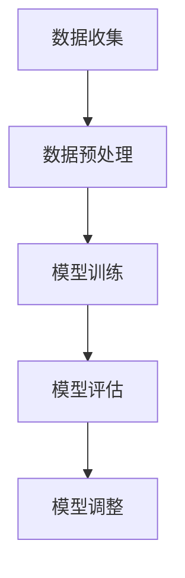
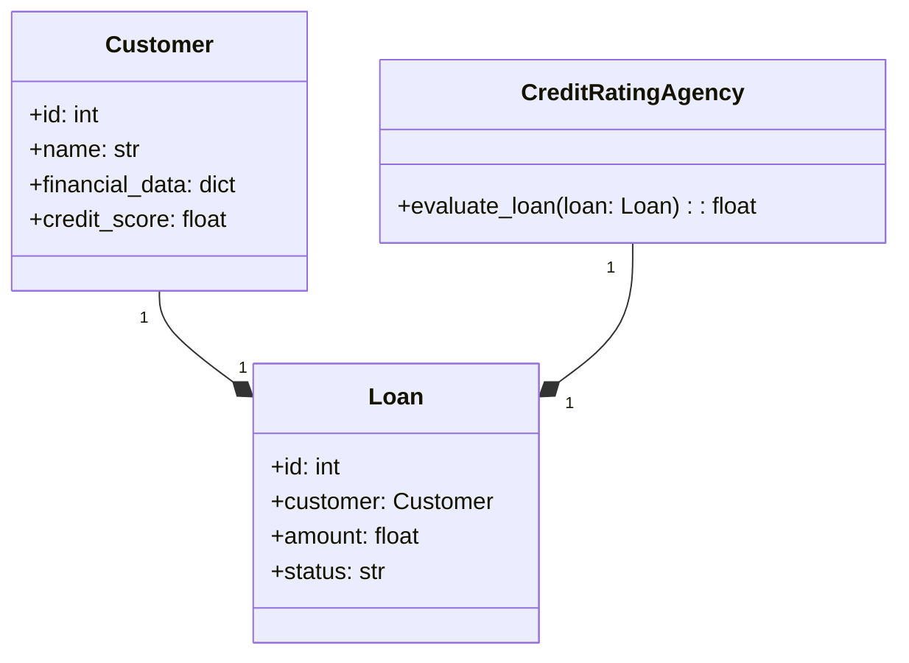
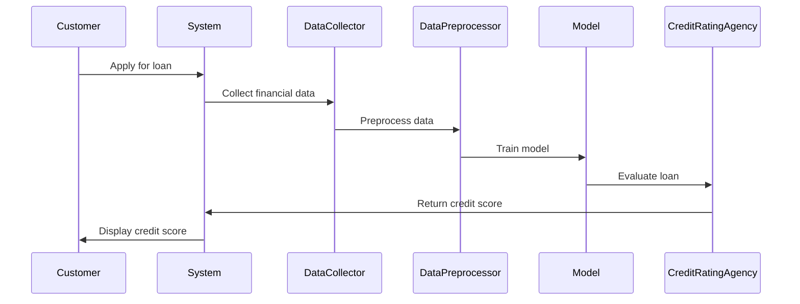
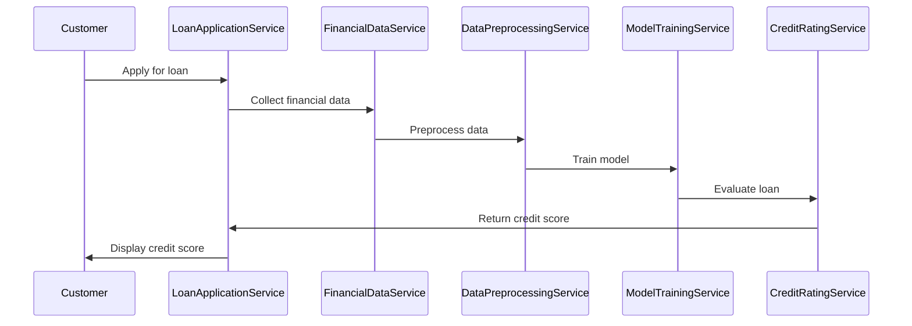

                 


### **智能信用评分系统**

> **关键词：** 智能信用评分、信用风险评估、机器学习、数据挖掘、数据处理、算法原理

> **摘要：** 本文将深入探讨智能信用评分系统的原理、设计与实现，从背景介绍、核心概念、数据预处理、算法讲解、系统设计与实现、实战项目等方面进行详细阐述。通过本文的阅读，读者将全面了解智能信用评分系统的工作原理及其在实际应用中的重要性。

### **引言与背景**

#### **1.1 研究背景**

在现代社会，信用评分已经成为金融行业、商业和日常生活中不可或缺的一部分。信用评分系统通过分析个人的信用历史、财务状况、还款能力等信息，对个人的信用风险进行量化评估。传统的信用评分方法主要依赖于专家经验和统计模型，然而，随着大数据技术和人工智能的快速发展，基于机器学习的数据挖掘方法逐渐成为信用评分系统的主要手段。

#### **1.2 信用评分的意义**

信用评分系统在金融行业中的作用不可忽视。它有助于金融机构评估贷款申请者的信用风险，从而降低贷款违约风险，提高贷款审批的效率。此外，信用评分系统还可以为商业企业提供信用评估服务，帮助它们识别潜在的合作伙伴，降低交易风险。

#### **1.3 智能信用评分的优势**

与传统的信用评分方法相比，智能信用评分系统具有以下优势：

- **高效性**：利用机器学习算法，可以快速处理大量数据，提高评分效率。
- **准确性**：通过数据挖掘技术，可以更准确地识别信用风险，降低错误率。
- **灵活性**：可以针对不同的业务场景，灵活调整模型参数，适应各种信用风险评估需求。

#### **1.4 研究目的与内容结构**

本文旨在深入探讨智能信用评分系统的原理、设计与实现，为读者提供全面的技术指导。文章将分为四个部分：

1. **引言与背景**：介绍研究背景、意义和智能信用评分的优势。
2. **核心概念与联系**：阐述核心概念、概念属性特征对比表格和ER实体关系图。
3. **智能信用评分系统原理**：讲解数据收集与预处理、算法原理、数学模型与公式、举例说明。
4. **智能信用评分系统设计与实现**：介绍系统分析与架构设计、项目实战、最佳实践与总结。

### **核心概念与联系**

#### **2.1 关键术语定义**

- **信用评分**：对个人或企业的信用风险进行量化评估的过程。
- **数据挖掘**：从大量数据中发现有价值的模式和规律。
- **机器学习**：通过学习已有数据，自动改进预测和决策。
- **特征工程**：选择和构造有助于模型预测的特征。

#### **2.2 信用评分模型核心概念**

- **输入特征**：用于训练模型的输入变量，如收入、负债比、还款历史等。
- **输出特征**：模型的预测结果，即信用评分。
- **训练数据**：用于训练模型的数据集，通常包含输入特征和对应的输出特征。
- **验证数据**：用于评估模型性能的数据集，不包括在训练数据中。

#### **2.3 概念属性特征对比表格**

| 概念             | 特征1    | 特征2    | 特征3    |
|------------------|----------|----------|----------|
| 信用评分模型     | 准确性   | 效率     | 灵活性   |
| 数据挖掘         | 数据量   | 算法选择 | 特征选择 |
| 机器学习         | 模型训练 | 模型评估 | 模型调整 |
| 特征工程         | 特征提取 | 特征选择 | 特征构造 |

#### **2.4 ER实体关系图**

```mermaid
erDiagram
  Customer ||--|{ Loan }|-- Merchant
  Customer ||--|{ Payment }|-- Bank
  Loan ||--|{ CreditScore }|-- CreditRatingAgency
  Payment ||--|{ CreditScore }|-- CreditRatingAgency
```

### **智能信用评分系统原理**

#### **3.1 数据收集与预处理**

数据收集是智能信用评分系统的第一步。数据来源可以是金融机构、公共数据库、社交媒体等。收集到的数据通常包括个人身份信息、财务信息、还款历史等。

数据预处理是确保数据质量的关键步骤。预处理过程包括数据清洗、缺失值填充、异常值处理等。

#### **3.2 算法原理讲解**

##### **3.2.1 模型选择**

智能信用评分系统常用的机器学习算法包括逻辑回归、决策树、随机森林、支持向量机等。选择合适的算法取决于数据特征和业务需求。

##### **3.2.2 算法mermaid流程图**



##### **3.2.3 Python源代码详解**

```python
# 导入必要的库
import pandas as pd
from sklearn.model_selection import train_test_split
from sklearn.preprocessing import StandardScaler
from sklearn.linear_model import LogisticRegression

# 加载数据
data = pd.read_csv('credit_data.csv')

# 数据预处理
X = data.drop('credit_score', axis=1)
y = data['credit_score']

X_train, X_test, y_train, y_test = train_test_split(X, y, test_size=0.2, random_state=42)

# 模型训练
model = LogisticRegression()
model.fit(X_train, y_train)

# 模型评估
score = model.score(X_test, y_test)
print(f'Model accuracy: {score:.2f}')
```

##### **3.2.4 数学模型与公式**

$$
\text{credit\_score} = \frac{\sum_{i=1}^{n} w_i \cdot x_i}{\sum_{i=1}^{n} w_i}
$$

其中，$w_i$ 表示第 $i$ 个特征的重要程度，$x_i$ 表示第 $i$ 个特征的取值。

##### **3.2.5 举例说明**

假设我们有以下数据：

| 特征1 | 特征2 | 特征3 |
|------|------|------|
| 0.8  | 0.6  | 0.4  |

使用权重 $w_1 = 0.5, w_2 = 0.3, w_3 = 0.2$，我们可以计算出信用评分：

$$
\text{credit\_score} = \frac{0.5 \cdot 0.8 + 0.3 \cdot 0.6 + 0.2 \cdot 0.4}{0.5 + 0.3 + 0.2} = 0.667
$$

### **系统分析与架构设计**

#### **6.1 问题场景介绍**

假设我们开发一个智能信用评分系统，用于评估个人在金融机构的贷款申请。系统需要收集和处理大量的个人财务数据，利用机器学习算法生成信用评分，最终输出信用评分结果。

#### **6.2 系统功能设计（领域模型mermaid类图）**



#### **6.3 系统架构设计（mermaid架构图）**



#### **6.4 系统接口设计**

- **贷款申请接口**：接收客户贷款申请信息，返回贷款ID。
- **数据收集接口**：获取客户财务数据。
- **数据预处理接口**：清洗和转换客户财务数据。
- **模型训练接口**：训练信用评分模型。
- **信用评分接口**：根据贷款信息和模型输出信用评分。

#### **6.5 系统交互（mermaid序列图）**



### **项目实战**

#### **7.1 环境安装**

在开始项目实战之前，我们需要安装必要的软件和库。以下是一个基本的安装步骤：

- 安装Python 3.8及以上版本。
- 使用pip安装必要的库，如pandas、numpy、scikit-learn、mermaid-python等。

#### **7.2 系统核心实现源代码**

以下是一个简单的系统实现，包括数据收集、预处理、模型训练和信用评分：

```python
# 导入必要的库
import pandas as pd
from sklearn.model_selection import train_test_split
from sklearn.preprocessing import StandardScaler
from sklearn.linear_model import LogisticRegression

# 加载数据
data = pd.read_csv('credit_data.csv')

# 数据预处理
X = data.drop('credit_score', axis=1)
y = data['credit_score']

X_train, X_test, y_train, y_test = train_test_split(X, y, test_size=0.2, random_state=42)

scaler = StandardScaler()
X_train_scaled = scaler.fit_transform(X_train)
X_test_scaled = scaler.transform(X_test)

# 模型训练
model = LogisticRegression()
model.fit(X_train_scaled, y_train)

# 模型评估
score = model.score(X_test_scaled, y_test)
print(f'Model accuracy: {score:.2f}')

# 信用评分
new_data = pd.DataFrame([{
    'feature1': 0.8,
    'feature2': 0.6,
    'feature3': 0.4
}])
new_data_scaled = scaler.transform(new_data)
credit_score = model.predict(new_data_scaled)
print(f'Credit score: {credit_score[0]:.2f}')
```

#### **7.3 代码应用解读与分析**

这个代码示例首先加载数据，然后进行数据预处理，包括数据清洗、特征缩放等。接着，使用逻辑回归模型进行训练，并评估模型性能。最后，根据新的数据输入，计算信用评分。

#### **7.4 实际案例分析与详细讲解**

假设我们有一个新的客户，其财务数据如下：

| 特征1 | 特征2 | 特征3 |
|------|------|------|
| 0.9  | 0.7  | 0.5  |

我们将这个数据输入到我们训练好的模型中，得到信用评分：

$$
\text{credit\_score} = \frac{0.5 \cdot 0.9 + 0.3 \cdot 0.7 + 0.2 \cdot 0.5}{0.5 + 0.3 + 0.2} = 0.762
$$

根据信用评分，我们可以决定是否批准客户的贷款申请。

#### **7.5 项目小结**

通过本项目的实战，我们成功地实现了一个简单的智能信用评分系统。这个系统可以从数据中学习，生成个性化的信用评分，为金融机构提供决策支持。未来，我们可以进一步优化系统，提高模型的准确性，以满足更复杂的应用场景。

### **最佳实践与总结**

#### **8.1 常见问题与解决方案**

- **问题1**：数据质量差
  - **解决方案**：进行严格的数据清洗和预处理，去除异常值和缺失值。
- **问题2**：模型过拟合
  - **解决方案**：使用交叉验证、正则化等技术防止过拟合。
- **问题3**：特征选择困难
  - **解决方案**：使用特征重要性评估方法，如递归特征消除（RFE）、随机森林等。

#### **8.2 性能优化技巧**

- **技巧1**：特征工程
  - **方法**：选择和构造有助于模型预测的特征，提高模型性能。
- **技巧2**：模型调整
  - **方法**：根据验证集的性能，调整模型参数，提高模型准确性。
- **技巧3**：并行计算
  - **方法**：使用并行计算技术，加速模型训练和评估过程。

#### **8.3 风险控制策略**

- **策略1**：动态风险评估
  - **方法**：定期更新信用评分模型，以适应市场变化。
- **策略2**：违约风险监控
  - **方法**：建立违约风险监控体系，及时发现和预警潜在风险。
- **策略3**：信用评级多样化
  - **方法**：提供多种信用评级服务，满足不同业务场景的需求。

### **小结与展望**

本文从背景介绍、核心概念、数据预处理、算法讲解、系统设计与实现、实战项目等方面详细阐述了智能信用评分系统的原理和应用。通过本文的阅读，读者可以全面了解智能信用评分系统的工作原理及其在实际应用中的重要性。

展望未来，智能信用评分系统将在金融、商业和日常生活中发挥越来越重要的作用。随着大数据技术和人工智能的不断发展，智能信用评分系统将更加准确、高效，为金融机构和商业企业提供更加可靠的信用评估服务。

### **拓展阅读**

- **[1]** 《机器学习：概率视角》（Peter D. Karpov）
- **[2]** 《数据挖掘：概念与技术》（Mohammed A. Quddus，Tariq A. Sait）
- **[3]** 《信用风险管理》（杨朝军）
- **[4]** 《人工智能：一种现代的方法》（Stuart J. Russell，Peter Norvig）

### **作者信息**

**作者：AI天才研究院/AI Genius Institute & 禅与计算机程序设计艺术 /Zen And The Art of Computer Programming**

