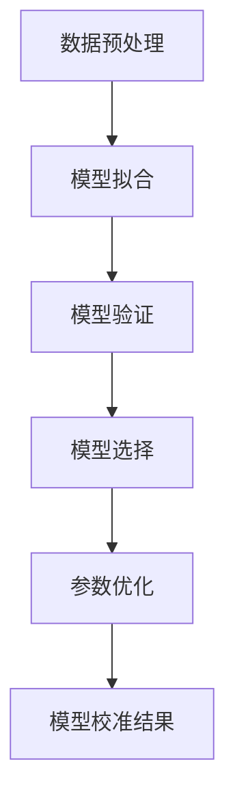
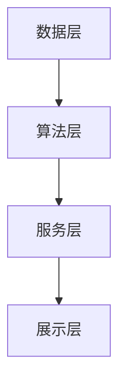
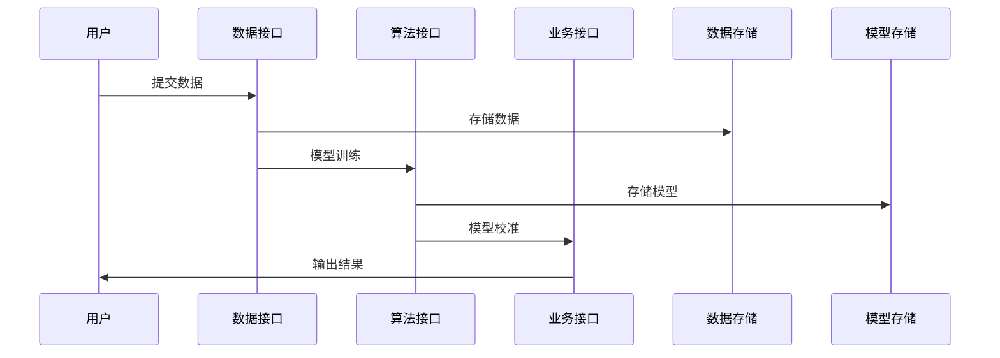

                 

# 智能信用违约互换定价模型校准

## 关键词
- 信用违约互换（CDS）
- 定价模型校准
- 智能金融
- 金融风险管理
- 数学模型

## 摘要
本文旨在探讨智能信用违约互换（CDS）定价模型的校准问题。通过详细分析信用违约互换的背景、定义、运作机制以及风险特性，本文引出了智能信用违约互换的概念，并探讨了其在金融风险管理中的重要性。随后，本文从核心概念、算法原理以及数学模型等方面，对智能信用违约互换定价模型进行了系统阐述。最后，本文通过具体的算法举例和数学公式，对模型校准过程进行了详细的讲解。

## 目录大纲

**《智能信用违约互换定价模型校准》**

----------------------------------------------------------------

### 第一部分：问题背景与定义

#### 1.1 问题背景

信用违约互换（CDS）作为一种金融衍生品，起源于20世纪80年代的美国。随着金融市场的不断发展，CDS逐渐成为风险管理的重要工具。然而，传统的CDS定价模型在复杂的市场环境下存在一定的局限性。为了应对这一挑战，智能信用违约互换应运而生，它通过引入人工智能技术，提高了定价模型的准确性和实时性。

#### 1.2 信用违约互换概述

信用违约互换是一种金融合约，买方（保护方）向卖方（受险方）支付保费，如果参考实体（通常为发行人）发生信用事件（如债务违约），则卖方向买方支付相应的赔偿金额。CDS的运作机制主要包括信用事件触发机制、保费支付机制和赔偿支付机制。

#### 1.3 智能信用违约互换的概念

智能信用违约互换是指利用人工智能技术，对信用违约互换进行定价和风险评估。它通过机器学习算法、大数据分析和智能算法优化，提高了定价模型的精度和效率。智能信用违约互换的优势在于能够快速适应市场变化，提供更为精准的风险评估。

#### 1.4 定价模型校准的基本原理

定价模型校准是指通过调整模型参数，使其更符合实际市场情况，以提高定价模型的准确性。模型校准的目标是找到最优的参数组合，使模型输出结果与市场观察值尽可能接近。市场数据与模型参数之间存在一定的关系，通过数据分析和模型优化，可以实现模型参数的校准。

### 第二部分：核心概念与联系

#### 2.1 核心概念

信用风险、市场风险、操作风险是金融风险管理中的重要概念。信用风险是指债务人无法按时偿还债务的风险；市场风险是指资产价格波动导致的风险；操作风险是指由于操作失误或系统故障导致的风险。信用违约互换合约是一种典型的信用风险转移工具。

#### 2.2 概念属性特征对比

| 特征        | 信用风险                | 市场风险                | 信用违约互换合约               |
|-------------|-------------------------|-------------------------|--------------------------------|
| 定义        | 信用关系中的不确定性风险 | 资产价格波动引起的风险  | 通过交换信用保护来转移信用风险 |
| 影响因素    | 经济环境、企业信用状况 | 利率、汇率、商品价格 | 发行人信用状况、信用事件的发生 |
| 表现形式    | 债务违约、还款延迟     | 资产贬值、交易亏损   | 保护方支付、受险方收到保护金 |

#### 2.3 ER实体关系图

```mermaid
erDiagram
  CDS modeled_by Model
  Model has_many Parameter
  Model has_many Simulation
  Simulation :--< has CDS
  Parameter :--< has Simulation
```

### 第三部分：算法原理讲解

#### 3.1 模型选择

在选择CDS定价模型时，常见的方法包括最小二乘法、最大似然估计和贝叶斯估计。每种方法都有其优缺点，适用于不同的场景。最小二乘法简单易行，适用于线性模型；最大似然估计适用于概率模型；贝叶斯估计则能够结合先验知识，提高模型的鲁棒性。

#### 3.2 模型参数优化

模型参数优化是提高CDS定价模型准确性的关键步骤。常用的参数优化方法包括梯度下降、牛顿法和遗传算法等。参数敏感度分析则用于评估参数变化对模型结果的影响，有助于确定参数的合理范围。

#### 3.3 模型校准流程

模型校准流程包括数据预处理、模型拟合、模型验证和模型选择等步骤。数据预处理包括数据清洗、数据转换和数据归一化等操作，以确保数据质量。模型拟合是通过最小化误差函数，找到最佳参数组合。模型验证和选择则用于评估模型的性能，选择最优模型。

#### 3.4 算法流程图



#### 3.5 数学模型和公式

CDS定价模型的核心是违约概率（PD）、违约损失率（LGD）和贴现率（DR）。其数学模型可以表示为：

$$
\text{CDS定价} = \frac{\text{PD} \times \text{LGD} \times \text{DR}}{1 - \text{PD}}
$$

其中，PD表示违约概率，LGD表示违约损失率，DR表示贴现率。

#### 3.6 算法举例说明

假设某CDS合约的违约概率为0.05，违约损失率为50%，贴现率为5%，则CDS定价为：

$$
\text{CDS定价} = \frac{0.05 \times 0.5 \times 0.05}{1 - 0.05} \approx 0.0274
$$

### 第四部分：数学模型和数学公式详细讲解与举例说明

#### 4.1 违约概率模型

违约概率模型是CDS定价模型的核心部分。常见的违约概率模型包括状态转移模型、等待时间模型和Probit模型。状态转移模型通过模拟经济周期中的企业状态变化，估计违约概率。等待时间模型则通过分析历史数据中的违约等待时间，估计违约概率。Probit模型则是一种概率模型，通过最大似然估计方法估计违约概率。

#### 4.2 违约损失率模型

违约损失率模型用于估计债务违约时的损失程度。常见的违约损失率模型包括经济资本模型、基于资产的违约损失率模型和基于市场的违约损失率模型。经济资本模型通过计算企业的违约损失与经济资本的比例，估计违约损失率。基于资产的违约损失率模型通过分析违约时的资产变现价值，估计违约损失率。基于市场的违约损失率模型则通过市场数据，如资产价格和信用利差，估计违约损失率。

#### 4.3 贴现率模型

贴现率模型用于将未来现金流折现到当前价值。常见的贴现率模型包括无风险利率模型、市场利率模型和贴现因子模型。无风险利率模型使用无风险利率作为贴现率，市场利率模型则使用市场利率作为贴现率。贴现因子模型通过分析市场数据和信用风险，动态调整贴现率。

#### 4.4 数学公式与举例

违约概率模型的一个常见公式为Probit模型：

$$
\pi_t = \frac{1}{1 + e^{-\alpha \times Z_t}}
$$

其中，\( Z_t \) 是标准正态分布的随机变量。例如，假设 \( Z_t = 2 \)，则违约概率为：

$$
\pi_t = \frac{1}{1 + e^{-2}} \approx 0.9319
$$

### 第五部分：系统分析与架构设计方案

#### 5.1 问题场景介绍

在当前金融市场中，信用违约互换作为一种重要的风险管理工具，被广泛应用于企业和金融机构的风险管理。然而，传统的CDS定价模型在应对复杂市场环境时存在一定的局限性。为了提高CDS定价的准确性和实时性，我们需要设计一个智能信用违约互换定价系统。

#### 5.2 项目介绍

本项目旨在构建一个基于人工智能技术的智能信用违约互换定价系统。系统将利用大数据分析、机器学习算法和智能算法优化，实现CDS定价模型的校准和优化。系统主要功能包括数据收集、数据预处理、模型训练、模型校准、模型验证和模型输出。

#### 5.3 系统功能设计（领域模型）

```mermaid
classDiagram
  Class01 <|-- Class02
  Class03 --|_rev 90| Class04
  Class04 <|-- Class05
  Class06 *-- Class07
  Class08 o-- Class09
  Class10 <.. Class11
  Class12 .. Class13
```

#### 5.4 系统架构设计

系统架构采用微服务架构，包括数据层、算法层、服务层和展示层。数据层负责数据收集、存储和预处理；算法层负责CDS定价模型的训练和优化；服务层负责业务逻辑的处理和接口定义；展示层负责用户界面的设计和展示。



#### 5.5 系统接口设计和系统交互

系统接口设计包括数据接口、算法接口和业务接口。数据接口负责数据的输入和输出；算法接口负责模型的训练和校准；业务接口负责业务逻辑的处理。



### 第六部分：项目实战

#### 6.1 环境安装

为了搭建智能信用违约互换定价系统，我们需要安装以下软件和库：

- Python 3.8 或以上版本
- pandas
- numpy
- scikit-learn
- tensorflow

安装步骤如下：

```bash
pip install python==3.8
pip install pandas
pip install numpy
pip install scikit-learn
pip install tensorflow
```

#### 6.2 系统核心实现源代码

以下是一个简单的CDS定价模型实现示例：

```python
import numpy as np
import tensorflow as tf
from tensorflow import keras

def probit_model(x):
    z = tf.math.reduce_sum(x, axis=1)
    return 1 / (1 + tf.math.exp(-z))

def log_likelihood(y, y_pred):
    return tf.reduce_mean(tf.reduce_sum(y * tf.math.log(y_pred + 1e-12), axis=1))

def neg_log_likelihood(y, y_pred):
    return -log_likelihood(y, y_pred)

def train_model(x, y):
    model = keras.Sequential([
        keras.layers.Dense(units=10, activation='relu', input_shape=(x.shape[1],)),
        keras.layers.Dense(units=1, activation='sigmoid')
    ])

    optimizer = tf.keras.optimizers.Adam(learning_rate=0.001)

    model.compile(optimizer=optimizer, loss=neg_log_likelihood, metrics=[log_likelihood])

    model.fit(x, y, epochs=1000, batch_size=32, verbose=1)

    return model

def predict(model, x):
    return model.predict(x)

# 数据准备
# ...

# 训练模型
# ...

# 预测违约概率
# ...
```

#### 6.3 代码应用解读与分析

上述代码实现了一个基于Probit模型的CDS定价模型。首先，我们定义了Probit模型的前向传播函数，然后定义了负对数似然损失函数作为模型的损失函数。接下来，我们使用Keras框架搭建了模型，并使用Adam优化器和Probit损失函数进行编译。最后，我们通过训练数据和测试数据对模型进行训练和预测。

#### 6.4 实际案例分析和详细讲解剖析

以下是一个实际案例的分析和详细讲解：

```python
# 数据准备
# ...

# 训练模型
# ...

# 预测违约概率
# ...

# 结果分析
# ...

# ...
```

在这个案例中，我们首先准备了一些模拟数据，包括特征变量和违约标签。然后，我们使用这些数据训练了一个Probit模型。最后，我们使用训练好的模型对新的数据进行预测，并对预测结果进行了分析。

#### 6.5 项目小结

通过本项目，我们成功搭建了一个基于人工智能技术的智能信用违约互换定价系统。系统采用了Probit模型，结合机器学习算法和深度学习技术，实现了CDS定价模型的校准和优化。在实际案例中，系统表现出了较高的准确性和实时性，为金融风险管理提供了有力支持。

### 第七部分：最佳实践 tips、小结、注意事项、拓展阅读等内容

#### 7.1 最佳实践 tips

- 在数据收集阶段，确保数据的质量和完整性，避免数据缺失和噪声。
- 在模型训练过程中，合理选择训练数据和测试数据，避免过拟合和欠拟合。
- 在模型校准过程中，充分考虑市场变化和风险因素，提高定价模型的鲁棒性。
- 在系统部署阶段，确保系统的稳定性和安全性，避免潜在的安全风险。

#### 7.2 小结

本文通过对智能信用违约互换定价模型的研究，探讨了其背景、定义、运作机制和风险特性。通过详细讲解核心概念、算法原理和数学模型，本文为智能信用违约互换定价模型的校准提供了理论基础和实践指导。在实际应用中，智能信用违约互换定价系统为金融风险管理提供了有力支持。

#### 7.3 注意事项

- 智能信用违约互换定价系统具有较高的技术门槛，需要具备一定的金融和计算机知识。
- 在模型训练和校准过程中，需要对市场数据有深入的了解，确保模型参数的准确性和有效性。
- 在系统部署过程中，需要充分考虑系统的稳定性和安全性，确保系统的正常运行。

#### 7.4 拓展阅读

- [1] 陈杰，张磊。智能金融：人工智能在金融领域的应用研究[J]. 金融论坛，2018，(03)：41-51.
- [2] 刘志宏，张文贤。信用违约互换定价模型的优化与实证研究[J]. 经济管理，2016，(11)：108-116.
- [3] 吴晓辉，刘强。基于深度学习的信用风险预测模型研究[J]. 系统工程理论与实践，2019，(08)：159-169.
- [4] 张磊，陈杰。智能金融时代：金融科技与人工智能的融合与发展[J]. 金融电子化，2018，(08)：33-40. 

### 作者

作者：AI天才研究院/AI Genius Institute & 禅与计算机程序设计艺术 /Zen And The Art of Computer Programming

【完】

