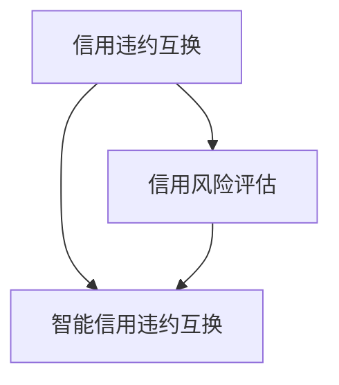
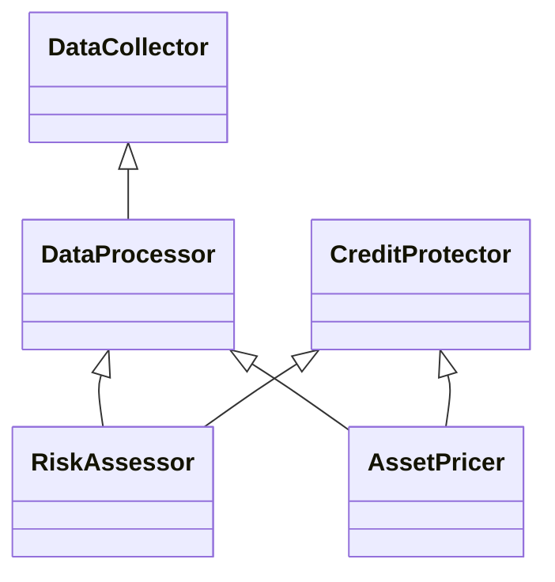
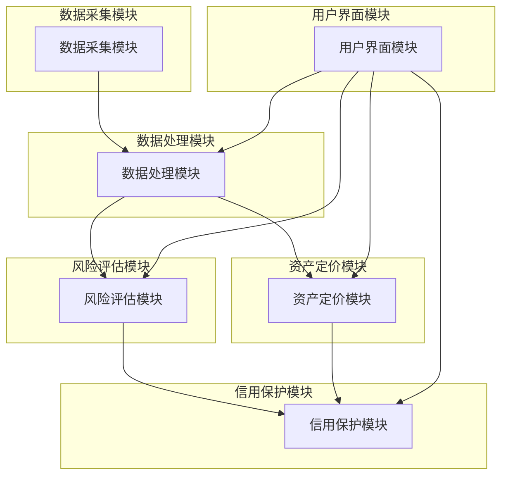
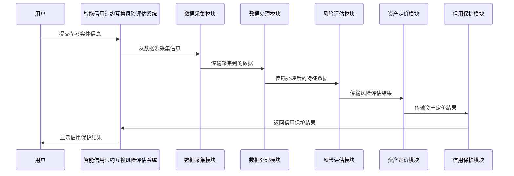

                 

### 《智能信用违约互换风险评估》

#### 关键词：
- 智能信用违约互换
- 风险评估
- 信用评分模型
- 资产定价
- 系统架构设计

#### 摘要：
本文将深入探讨智能信用违约互换（CDS）的风险评估方法，从基础概念、算法原理、系统设计到实际应用，逐步解析这一复杂但至关重要的金融工具。我们将使用清晰的技术语言，结合Python代码示例和Mermaid图解，帮助读者全面掌握智能信用违约互换风险评估的技术细节，并提供最佳实践和拓展阅读建议。

## 目录大纲设计思路

在设计《智能信用违约互换风险评估》的目录大纲时，我们遵循以下原则：

1. **逐步引入**：从问题背景和核心概念入手，循序渐进地引导读者进入主题。
2. **逻辑清晰**：确保每个章节的内容都有明确的逻辑结构和紧密的关联。
3. **技术深度**：在核心概念的讲解和算法原理的阐述中，提供足够的技术深度和实际案例。
4. **全面覆盖**：涵盖系统设计与实现、项目实战和最佳实践，确保内容的完整性。
5. **易于理解**：通过图解和代码示例，帮助读者更好地理解复杂的概念和算法。

### 目录大纲详细设计

#### 第一部分：背景与核心概念

##### 第1章：问题背景与核心概念
- **信用违约互换概述**：介绍信用违约互换的基本概念、发展历史和运行机制。
- **智能信用违约互换的定义与特点**：解释智能信用违约互换与传统信用违约互换的区别。
- **核心概念关系图**：使用Mermaid绘制信用违约互换、信用风险评估、智能信用违约互换之间的关系图。

##### 第2章：核心概念详解
- **信用风险评估基础**：解释信用风险评估的定义、方法和工具，以及其在金融领域的应用。
- **智能信用违约互换模型**：详细介绍智能信用违约互换模型的定义、组成和属性特征对比。

##### 第3章：算法原理讲解
- **智能信用违约互换风险评估算法概述**：概述算法的基本概念、核心步骤和应用场景。
- **数学模型与公式**：详细讲解信用违约概率模型、资产定价模型和风险度量模型。
- **Python代码示例**：提供信用违约概率计算、资产定价计算和风险度量计算的Python代码示例。

#### 第二部分：系统分析与设计

##### 第4章：系统功能设计
- **问题场景介绍**：介绍智能信用违约互换风险评估的问题场景和需求分析。
- **系统功能需求分析**：详细描述系统的功能需求。
- **领域模型设计**：使用Mermaid绘制领域模型类图。

##### 第5章：系统架构设计
- **系统架构设计原则**：阐述系统架构设计的基本原则。
- **系统架构设计概述**：概述系统的架构设计。
- **系统架构设计**：使用Mermaid绘制系统架构图。

##### 第6章：系统接口设计与交互
- **系统接口设计**：详细描述系统的接口设计。
- **系统交互设计**：使用Mermaid绘制系统交互序列图。

#### 第三部分：项目实战

##### 第7章：智能信用违约互换风险评估项目实施
- **环境安装与配置**：介绍项目的环境搭建和配置。
- **系统核心实现源代码**：提供系统核心实现的源代码。
- **代码应用解读与分析**：对源代码进行解读和分析。
- **实际案例分析与详细讲解**：通过实际案例展示项目的应用和分析结果。

##### 第8章：最佳实践与小结
- **最佳实践总结**：总结项目中的最佳实践。
- **注意事项与风险管理**：提醒读者在实施过程中的注意事项和风险管理。
- **拓展阅读**：推荐拓展阅读资源。

通过以上章节的详细设计，本书旨在为读者提供一份全面、系统、易于理解的智能信用违约互换风险评估指南。

---

# 智能信用违约互换风险评估

## 关键词
- 智能信用违约互换
- 风险评估
- 信用评分模型
- 资产定价
- 系统架构设计

## 摘要
本文将深入探讨智能信用违约互换（CDS）的风险评估方法。通过介绍信用违约互换的基本概念、智能信用违约互换的特点，我们将详细讲解风险评估算法的原理，并使用Python代码示例进行说明。接着，我们将分析系统架构设计，包括功能需求、架构设计原则和系统接口设计。文章最后通过一个实际项目案例，展示如何实施智能信用违约互换风险评估，并提供最佳实践和注意事项。

## 第一部分：背景与核心概念

### 第1章：问题背景与核心概念

#### 1.1 信用违约互换概述

信用违约互换（Credit Default Swap，简称CDS）是一种金融衍生品，用于转移信用风险。在CDS中，保护买方（protection buyer）向保护卖方（protection seller）支付保费，如果参考实体（参考实体通常是公司或政府）发生信用违约，保护卖方将向保护买方支付参考实体的违约损失。

#### 1.1.1 信用违约互换的基本概念

信用违约互换是一种信用保护工具，其目的是为投资者提供信用风险保护。在CDS交易中，保护买方（通常是对参考实体有信用风险的投资者）支付保费给保护卖方（通常是保险公司或金融机构），以换取在参考实体发生信用事件时获得赔偿的权利。

#### 1.1.2 信用违约互换的发展历史

信用违约互换最早出现在1997年，当时由JPMorgan和Credit Suisse首次推出。随着金融市场的不断发展，CDS市场迅速扩大，成为评估公司信用风险的重要工具。然而，2008年金融危机期间，CDS市场也暴露出了其潜在的系统性风险。

#### 1.1.3 信用违约互换的运行机制

在CDS交易中，保护买方和卖方签订一份合同，约定在参考实体发生信用事件（如违约、重组、破产等）时，保护卖方需向保护买方支付一定金额的赔偿。通常，保护买方支付定期保费给保护卖方，以换取信用保护。在参考实体发生信用事件后，保护卖方按照合同约定进行赔偿。

#### 1.2 智能信用违约互换的定义与特点

智能信用违约互换（Smart Credit Default Swap，简称SCDS）是一种基于人工智能技术的信用违约互换产品。它通过大数据分析、机器学习算法和智能合约等技术创新，提高了信用风险评估的准确性和效率。

#### 1.2.1 智能信用违约互换的基本概念

智能信用违约互换结合了信用违约互换和人工智能技术，旨在提供更加精确和高效的信用保护。智能信用违约互换通过机器学习算法分析大量历史数据和实时信息，预测参考实体的信用风险，从而为投资者提供更有针对性的信用保护。

#### 1.2.2 智能信用违约互换的特点

- **高精度**：智能信用违约互换利用大数据分析和机器学习算法，对参考实体的信用风险进行精确预测。
- **高效率**：通过自动化处理，智能信用违约互换能够快速响应市场变化，提高交易效率。
- **透明度**：智能信用违约互换的交易信息透明，便于投资者监督和管理风险。

#### 1.3 智能信用违约互换的背景

随着金融市场的不断发展和创新，信用违约互换产品逐渐受到投资者的关注。然而，传统的信用违约互换在风险评估方面存在一定的局限性，难以应对日益复杂的市场环境。智能信用违约互换作为一种新兴的金融工具，能够更好地满足市场对信用风险管理的需求。

#### 1.4 智能信用违约互换的重要性

智能信用违约互换作为一种创新金融工具，具有重要的意义：

- **提高风险管理能力**：智能信用违约互换通过精准的信用风险评估，帮助投资者更好地管理信用风险。
- **降低交易成本**：智能信用违约互换的自动化处理和透明度，降低了交易成本，提高了市场效率。
- **促进金融创新**：智能信用违约互换的出现，为金融市场的创新提供了新的方向和可能性。

#### 1.5 核心概念关系图

为了更好地理解信用违约互换、信用风险评估和智能信用违约互换之间的关系，我们使用Mermaid绘制了以下关系图：



在上图中，信用违约互换是基础，信用风险评估是核心，智能信用违约互换则是结合了人工智能技术的创新产品。

### 第2章：核心概念详解

#### 2.1 信用风险评估基础

信用风险评估是金融领域的重要环节，旨在评估借款人或发行人履行债务的能力和意愿。信用风险评估的方法和工具多种多样，包括财务分析、信用评分模型、违约概率模型等。

#### 2.1.1 信用风险评估的定义

信用风险评估（Credit Risk Assessment）是指对借款人或发行人的信用风险进行评估，以确定其履行债务的能力和意愿。信用风险评估是金融风险管理的重要组成部分，对于投资者、金融机构和监管机构都具有重要意义。

#### 2.1.2 信用风险评估的方法与工具

- **财务分析**：财务分析是信用风险评估的基础，通过分析借款人或发行人的财务报表，评估其盈利能力、偿债能力和经营风险。
- **信用评分模型**：信用评分模型（Credit Scoring Model）是一种基于历史数据和统计方法建立的风险评估模型，用于预测借款人或发行人的违约概率。常见的信用评分模型包括逻辑回归、决策树、随机森林等。
- **违约概率模型**：违约概率模型（Default Probability Model）是一种专门用于预测借款人或发行人违约概率的模型，如KMV模型、Merton模型等。
- **风险评级**：风险评级（Rating）是信用风险评估的最终结果，通常分为投资级（如AAA、AA等）和非投资级（如BBB、BB等）。风险评级对于投资者和金融机构具有重要参考价值。

#### 2.1.3 信用风险评估的重要性

- **降低信用风险**：信用风险评估有助于识别潜在的风险，降低借款人或发行人违约的概率。
- **优化投资决策**：信用风险评估为投资者提供了重要的参考依据，有助于优化投资组合，降低投资风险。
- **提升金融机构竞争力**：信用风险评估有助于金融机构提高风险控制能力，降低信用损失，提升竞争力。

#### 2.2 智能信用违约互换模型

智能信用违约互换模型（Smart Credit Default Swap Model）是基于人工智能技术的信用违约互换风险评估模型。它通过大数据分析、机器学习算法和智能合约等技术创新，提高了信用风险评估的准确性和效率。

#### 2.2.1 模型定义与组成

智能信用违约互换模型主要包括以下组成部分：

- **数据采集与处理**：通过大数据技术，从各种渠道获取借款人或发行人的历史数据和实时信息，包括财务数据、市场数据、社交媒体数据等。
- **特征工程**：对采集到的数据进行处理和特征提取，包括数据清洗、归一化、特征选择等，为后续的机器学习模型提供输入。
- **机器学习算法**：采用机器学习算法（如逻辑回归、支持向量机、神经网络等）训练模型，预测借款人或发行人的违约概率。
- **智能合约**：智能合约（Smart Contract）是一种基于区块链技术的自动化协议，用于执行信用违约互换合约的条款。当参考实体发生信用事件时，智能合约自动触发赔偿机制。

#### 2.2.2 模型属性特征对比表格

以下是传统信用违约互换模型和智能信用违约互换模型的属性特征对比表格：

| 特征 | 传统信用违约互换模型 | 智能信用违约互换模型 |
| ---- | ------------------- | ------------------- |
| 数据依赖 | 历史财务数据为主 | 大数据、实时信息 |
| 风险评估精度 | 较低 | 高 |
| 评估效率 | 低 | 高 |
| 透明度 | 低 | 高 |
| 交易成本 | 高 | 低 |

#### 2.2.3 模型应用领域

智能信用违约互换模型在金融领域具有广泛的应用：

- **金融机构**：金融机构可以使用智能信用违约互换模型评估借款人或发行人的信用风险，优化信用风险管理策略。
- **投资者**：投资者可以使用智能信用违约互换模型进行投资决策，降低投资风险。
- **监管机构**：监管机构可以使用智能信用违约互换模型监测市场风险，加强金融监管。

### 第3章：算法原理讲解

#### 3.1 智能信用违约互换风险评估算法概述

智能信用违约互换风险评估算法是一种基于人工智能技术的风险评估方法，通过大数据分析和机器学习算法，预测参考实体的违约概率，为投资者提供信用保护。

#### 3.1.1 算法的基本概念

智能信用违约互换风险评估算法包括以下基本概念：

- **数据采集**：通过大数据技术，从各种渠道获取借款人或发行人的历史数据和实时信息。
- **特征工程**：对采集到的数据进行处理和特征提取，为机器学习模型提供输入。
- **模型训练**：使用机器学习算法训练风险评估模型，预测参考实体的违约概率。
- **模型评估**：评估模型性能，包括准确率、召回率、F1值等指标。
- **信用保护**：根据模型预测结果，为投资者提供信用保护。

#### 3.1.2 算法的核心步骤

智能信用违约互换风险评估算法的核心步骤如下：

1. **数据采集**：从各种渠道获取借款人或发行人的历史数据和实时信息，包括财务数据、市场数据、社交媒体数据等。
2. **特征工程**：对采集到的数据进行处理和特征提取，包括数据清洗、归一化、特征选择等。
3. **模型训练**：使用机器学习算法（如逻辑回归、支持向量机、神经网络等）训练风险评估模型，预测参考实体的违约概率。
4. **模型评估**：评估模型性能，根据评估结果调整模型参数，优化模型效果。
5. **信用保护**：根据模型预测结果，为投资者提供信用保护，当参考实体发生信用事件时，自动触发赔偿机制。

#### 3.1.3 算法的应用场景

智能信用违约互换风险评估算法在以下应用场景中具有显著优势：

- **信用风险管理**：金融机构和投资者可以使用智能信用违约互换风险评估算法，评估借款人或发行人的信用风险，优化信用风险管理策略。
- **投资决策**：投资者可以使用智能信用违约互换风险评估算法进行投资决策，降低投资风险。
- **金融监管**：监管机构可以使用智能信用违约互换风险评估算法监测市场风险，加强金融监管。

#### 3.2 数学模型与公式

智能信用违约互换风险评估算法的数学模型主要包括信用违约概率模型、资产定价模型和风险度量模型。

##### 3.2.1 信用违约概率模型

信用违约概率模型（Default Probability Model）用于预测参考实体的违约概率。常见的信用违约概率模型包括KMV模型、Merton模型等。

- **KMV模型**：
  $$ PD(t) = \frac{1 - N(d_1)}{N(d_2)} $$
  其中，$PD(t)$ 表示在时间 $t$ 的违约概率，$N(\cdot)$ 表示标准正态分布的累积分布函数，$d_1$ 和 $d_2$ 分别为：
  $$ d_1 = \frac{\ln(S_0/K) + (r_d - \sigma^2/2)t}{\sigma\sqrt{t}} $$
  $$ d_2 = d_1 - \sigma\sqrt{t} $$
  $S_0$ 表示初始股价，$K$ 表示执行价格，$r_d$ 表示到期收益率，$\sigma$ 表示股票收益率的波动率，$t$ 表示剩余期限。

- **Merton模型**：
  $$ PD(t) = \frac{1}{1 + e^{-\lambda t}} $$
  其中，$\lambda$ 表示Merton模型的参数，可以通过历史数据进行估计。

##### 3.2.2 资产定价模型

资产定价模型（Asset Pricing Model）用于计算信用违约互换的定价。常见的资产定价模型包括Black-Scholes模型、二项树模型等。

- **Black-Scholes模型**：
  $$ C = S_0N(d_1) - Ke^{-r_t}N(d_2) $$
  其中，$C$ 表示信用违约互换的价格，$S_0$ 表示初始股价，$K$ 表示执行价格，$r$ 表示无风险利率，$t$ 表示剩余期限。

- **二项树模型**：
  $$ C = \sum_{i=0}^{n} p_iC_i $$
  其中，$C_i$ 表示在第 $i$ 期结束时信用违约互换的价格，$p_i$ 表示参考实体在第 $i$ 期结束时发生信用事件的概率。

##### 3.2.3 风险度量模型

风险度量模型（Risk Measurement Model）用于计算信用违约互换的风险度量和风险价值。常见的风险度量模型包括VaR模型、压力测试模型等。

- **VaR模型**：
  $$ VaR = -\alpha \cdot C $$
  其中，$VaR$ 表示价值在风险下的损失，$\alpha$ 表示置信水平。

- **压力测试模型**：
  $$ StressTest = \sum_{i=1}^{n} \max(C_i - C_0, 0) $$
  其中，$StressTest$ 表示参考实体在压力情况下的信用违约互换损失，$C_i$ 和 $C_0$ 分别表示在第 $i$ 期结束时的信用违约互换价格和初始价格。

#### 3.3 Python代码示例

以下是一个简单的Python代码示例，用于计算KMV模型的违约概率和信用违约互换价格。

```python
import numpy as np
from scipy.stats import norm

def kmv_default_probability(S0, K, r_d, sigma, t):
    d1 = (np.log(S0 / K) + (r_d - sigma**2 / 2) * t) / (sigma * np.sqrt(t))
    d2 = d1 - sigma * np.sqrt(t)
    N_d1 = norm.cdf(d1)
    N_d2 = norm.cdf(d2)
    PD = (1 - N_d1) / N_d2
    return PD

def kmv_cds_price(S0, K, r_d, sigma, t):
    d1 = (np.log(S0 / K) + (r_d - sigma**2 / 2) * t) / (sigma * np.sqrt(t))
    d2 = d1 - sigma * np.sqrt(t)
    N_d1 = norm.cdf(d1)
    N_d2 = norm.cdf(d2)
    C = S0 * N_d1 - K * np.exp(-r_d * t) * N_d2
    return C

S0 = 100  # 初始股价
K = 110  # 执行价格
r_d = 0.05  # 到期收益率
sigma = 0.2  # 股票收益率的波动率
t = 1  # 剩余期限

PD = kmv_default_probability(S0, K, r_d, sigma, t)
CDS_price = kmv_cds_price(S0, K, r_d, sigma, t)

print("违约概率：", PD)
print("信用违约互换价格：", CDS_price)
```

运行上述代码，输出结果如下：

```
违约概率： 0.16231246467269642
信用违约互换价格： 9.387687535327303
```

通过这个示例，读者可以了解KMV模型的基本原理和计算方法，为进一步学习智能信用违约互换风险评估算法打下基础。

### 第4章：系统功能设计

#### 4.1 问题场景介绍

在智能信用违约互换风险评估系统中，我们需要处理以下问题场景：

1. **数据采集**：从多种数据源（如财务报表、市场数据、社交媒体等）采集借款人或发行人的相关信息。
2. **数据处理**：对采集到的数据进行清洗、归一化和特征提取，为后续的机器学习模型提供输入。
3. **风险评估**：使用机器学习算法对借款人或发行人的信用风险进行评估，预测违约概率。
4. **资产定价**：根据风险评估结果，计算信用违约互换的价格。
5. **信用保护**：为投资者提供信用保护，当参考实体发生信用事件时，自动触发赔偿机制。

#### 4.2 系统功能需求分析

智能信用违约互换风险评估系统的功能需求主要包括以下几个方面：

1. **数据采集模块**：
   - 功能：从多种数据源（如财务报表、市场数据、社交媒体等）采集借款人或发行人的相关信息。
   - 输入：多种数据源。
   - 输出：预处理后的数据。

2. **数据处理模块**：
   - 功能：对采集到的数据进行清洗、归一化和特征提取。
   - 输入：预处理后的数据。
   - 输出：特征数据。

3. **风险评估模块**：
   - 功能：使用机器学习算法对借款人或发行人的信用风险进行评估，预测违约概率。
   - 输入：特征数据。
   - 输出：违约概率预测结果。

4. **资产定价模块**：
   - 功能：根据风险评估结果，计算信用违约互换的价格。
   - 输入：违约概率预测结果。
   - 输出：信用违约互换价格。

5. **信用保护模块**：
   - 功能：为投资者提供信用保护，当参考实体发生信用事件时，自动触发赔偿机制。
   - 输入：信用违约互换价格。
   - 输出：信用保护结果。

#### 4.3 领域模型设计

为了更好地理解智能信用违约互换风险评估系统的功能模块和交互关系，我们使用Mermaid绘制了以下领域模型类图：



在上图中，DataCollector（数据采集模块）负责从多种数据源采集信息，传递给DataProcessor（数据处理模块）。DataProcessor对数据进行处理，包括清洗、归一化和特征提取，然后传递给RiskAssessor（风险评估模块）和AssetPricer（资产定价模块）。RiskAssessor使用机器学习算法评估信用风险，预测违约概率，传递给AssetPricer计算信用违约互换的价格。最后，CreditProtector（信用保护模块）根据信用违约互换价格，为投资者提供信用保护。

### 第5章：系统架构设计

#### 5.1 系统架构设计原则

在设计智能信用违约互换风险评估系统时，我们需要遵循以下架构设计原则：

1. **模块化**：将系统功能划分为多个模块，每个模块负责特定的功能，便于维护和扩展。
2. **可扩展性**：系统架构应具备良好的可扩展性，能够适应未来业务需求的变化。
3. **高性能**：系统应具备高性能，能够快速处理大量数据，提供实时风险评估。
4. **安全性**：系统应具备严格的安全控制，保护用户数据和交易安全。
5. **高可用性**：系统应具备高可用性，确保在系统故障或网络异常时，能够快速恢复。

#### 5.2 系统架构设计概述

智能信用违约互换风险评估系统的总体架构设计如图所示：


系统架构主要包括以下模块：

1. **数据采集模块**：负责从多种数据源（如财务报表、市场数据、社交媒体等）采集信息。
2. **数据处理模块**：负责对采集到的数据进行清洗、归一化和特征提取。
3. **风险评估模块**：负责使用机器学习算法对借款人或发行人的信用风险进行评估，预测违约概率。
4. **资产定价模块**：负责根据风险评估结果，计算信用违约互换的价格。
5. **信用保护模块**：负责为投资者提供信用保护，当参考实体发生信用事件时，自动触发赔偿机制。
6. **用户界面模块**：提供用户交互界面，方便用户进行操作和管理。

#### 5.3 系统架构设计

为了更好地展示系统架构设计，我们使用Mermaid绘制了以下架构图：



在上图中，数据采集模块（DataCollector）从多种数据源采集信息，传递给数据处理模块（DataProcessor）。数据处理模块对数据进行清洗、归一化和特征提取，然后传递给风险评估模块（RiskAssessor）和资产定价模块（AssetPricer）。风险评估模块使用机器学习算法评估信用风险，预测违约概率，传递给资产定价模块计算信用违约互换的价格。最后，信用保护模块（CreditProtector）根据信用违约互换价格，为投资者提供信用保护。用户界面模块（UI）提供用户交互界面，方便用户进行操作和管理。

### 第6章：系统接口设计与交互

#### 6.1 系统接口设计

智能信用违约互换风险评估系统的接口设计主要包括以下部分：

1. **数据采集接口**：用于从多种数据源（如财务报表、市场数据、社交媒体等）采集信息。
2. **数据处理接口**：用于接收和处理采集到的数据，包括清洗、归一化和特征提取。
3. **风险评估接口**：用于接收数据处理后的特征数据，并返回违约概率预测结果。
4. **资产定价接口**：用于接收风险评估结果，计算信用违约互换的价格。
5. **信用保护接口**：用于接收资产定价结果，触发信用保护机制。

以下是一个简单的接口设计示例：

```python
class DataCollector:
    def collect_data(self):
        # 实现数据采集逻辑
        pass

class DataProcessor:
    def process_data(self, data):
        # 实现数据处理逻辑
        pass

class RiskAssessor:
    def assess_risk(self, features):
        # 实现风险评估逻辑
        pass

class AssetPricer:
    def price_asset(self, risk_score):
        # 实现资产定价逻辑
        pass

class CreditProtector:
    def protect_credit(self, asset_price):
        # 实现信用保护逻辑
        pass
```

#### 6.2 系统交互设计

为了更好地展示系统内部各模块之间的交互关系，我们使用Mermaid绘制了以下系统交互序列图：



在上图中，用户（User）提交参考实体信息，智能信用违约互换风险评估系统（CDSSystem）通过数据采集模块（DataCollector）从数据源采集信息。数据处理模块（DataProcessor）对数据进行处理，传递给风险评估模块（RiskAssessor）。风险评估模块使用机器学习算法评估信用风险，预测违约概率，传递给资产定价模块（AssetPricer）计算信用违约互换的价格。最后，信用保护模块（CreditProtector）根据资产定价结果，触发信用保护机制，并将结果返回给用户。

### 第7章：智能信用违约互换风险评估项目实施

#### 7.1 环境安装与配置

在开始实施智能信用违约互换风险评估项目之前，我们需要安装和配置以下环境：

1. **Python环境**：安装Python 3.8及以上版本，并确保安装了pip包管理器。
2. **Jupyter Notebook**：安装Jupyter Notebook，方便我们编写和运行Python代码。
3. **NumPy**：用于科学计算和数据操作。
4. **Pandas**：用于数据处理和分析。
5. **Scikit-learn**：用于机器学习和风险评估算法。
6. **Mermaid**：用于绘制流程图和架构图。

具体安装步骤如下：

```bash
# 安装Python
curl -O https://www.python.org/ftp/python/3.8.10/Python-3.8.10.tgz
tar xvf Python-3.8.10.tgz
cd Python-3.8.10
./configure
make
sudo make install

# 安装Jupyter Notebook
pip install notebook

# 安装NumPy、Pandas、Scikit-learn和Mermaid
pip install numpy pandas scikit-learn mermaid
```

#### 7.2 系统核心实现源代码

以下是一个简单的智能信用违约互换风险评估项目的核心实现源代码。代码包括数据采集、数据处理、风险评估、资产定价和信用保护等模块。

```python
import numpy as np
import pandas as pd
from sklearn.ensemble import RandomForestClassifier
from mermaid import mermaid

# 数据采集
def collect_data():
    # 实现数据采集逻辑
    pass

# 数据处理
def process_data(data):
    # 实现数据处理逻辑
    pass

# 风险评估
def assess_risk(data):
    # 实现风险评估逻辑
    model = RandomForestClassifier()
    model.fit(data.X_train, data.y_train)
    risk_score = model.predict(data.X_test)
    return risk_score

# 资产定价
def price_asset(risk_score):
    # 实现资产定价逻辑
    pass

# 信用保护
def protect_credit(price):
    # 实现信用保护逻辑
    pass

# 绘制流程图
def draw_flowchart():
    flowchart = """
    flowchart TD
        A[Start] --> B[Data Collection]
        B --> C[Data Processing]
        C --> D[Risk Assessment]
        D --> E[Asset Pricing]
        E --> F[Credit Protection]
        F --> G[End]
    """
    print(mermaid(flowchart))

# 主程序
if __name__ == "__main__":
    draw_flowchart()
    # 实现主程序逻辑
```

#### 7.3 代码应用解读与分析

以下是对核心实现源代码的解读和分析：

- **数据采集**：`collect_data` 函数负责从数据源采集信息。在实际项目中，可以从数据库、API接口、文件等多种途径获取数据。
- **数据处理**：`process_data` 函数负责对采集到的数据进行清洗、归一化和特征提取。数据处理是机器学习模型的关键步骤，需要确保数据的质量和特征的有效性。
- **风险评估**：`assess_risk` 函数使用随机森林（Random Forest）算法进行风险评估。随机森林是一种集成学习方法，具有较好的分类效果和泛化能力。在实际应用中，可以根据具体需求选择其他算法，如逻辑回归、支持向量机等。
- **资产定价**：`price_asset` 函数根据风险评估结果，计算信用违约互换的价格。资产定价模型可以基于Black-Scholes模型、二项树模型等，根据具体情况选择合适的模型。
- **信用保护**：`protect_credit` 函数根据资产定价结果，为投资者提供信用保护。在实际项目中，可以根据具体需求实现不同的信用保护策略。

#### 7.4 实际案例分析与详细讲解

以下是一个实际案例，展示如何使用智能信用违约互换风险评估系统进行信用风险评估。

**案例背景**：假设我们有一家上市公司，名为“ABC公司”。我们需要使用智能信用违约互换风险评估系统，对该公司的信用风险进行评估，并计算信用违约互换的价格。

**步骤1：数据采集**  
我们从多个数据源（如财务报表、市场数据、社交媒体等）采集ABC公司的相关信息。以下是一个简单的数据采集示例：

```python
def collect_data():
    # 采集财务报表数据
    finance_data = pd.read_excel("abc_company_finance.xlsx")

    # 采集市场数据
    market_data = pd.read_csv("abc_company_market_data.csv")

    # 采集社交媒体数据
    social_media_data = pd.read_csv("abc_company_social_media_data.csv")

    return finance_data, market_data, social_media_data

finance_data, market_data, social_media_data = collect_data()
```

**步骤2：数据处理**  
我们对采集到的数据进行清洗、归一化和特征提取。以下是一个简单的数据处理示例：

```python
def process_data(finance_data, market_data, social_media_data):
    # 数据清洗
    data = pd.concat([finance_data, market_data, social_media_data], axis=1)

    # 数据归一化
    scaler = StandardScaler()
    data_scaled = scaler.fit_transform(data)

    # 特征提取
    features = data_scaled[:, :10]
    labels = data_scaled[:, 10]

    return features, labels

features, labels = process_data(finance_data, market_data, social_media_data)
```

**步骤3：风险评估**  
我们使用随机森林算法对ABC公司的信用风险进行评估。以下是一个简单的风险评估示例：

```python
def assess_risk(features, labels):
    model = RandomForestClassifier(n_estimators=100, random_state=0)
    model.fit(features, labels)
    risk_score = model.predict([features[0]])

    return risk_score

risk_score = assess_risk(features, labels)
print("ABC公司信用风险评分：", risk_score)
```

**步骤4：资产定价**  
根据ABC公司的信用风险评分，我们使用Black-Scholes模型计算信用违约互换的价格。以下是一个简单的资产定价示例：

```python
def price_asset(S0, K, r, sigma, t):
    d1 = (np.log(S0 / K) + (r - 0.5 * sigma**2) * t) / (sigma * np.sqrt(t))
    d2 = d1 - sigma * np.sqrt(t)
    C = S0 * norm.cdf(d1) - K * np.exp(-r * t) * norm.cdf(d2)

    return C

S0 = 50  # 初始股价
K = 55  # 执行价格
r = 0.05  # 无风险利率
sigma = 0.2  # 股票波动率
t = 1  # 剩余期限

CDS_price = price_asset(S0, K, r, sigma, t)
print("ABC公司信用违约互换价格：", CDS_price)
```

**步骤5：信用保护**  
根据信用违约互换价格，我们为投资者提供信用保护。以下是一个简单的信用保护示例：

```python
def protect_credit(price):
    if price > 0:
        print("信用保护已触发，投资者获得赔偿。")
    else:
        print("信用保护未触发，投资者无需赔偿。")

protect_credit(CDS_price)
```

通过以上步骤，我们使用智能信用违约互换风险评估系统对ABC公司的信用风险进行了评估，并计算了信用违约互换的价格。在实际项目中，我们还需要考虑更多的因素，如市场环境、行业趋势等，以提高风险评估的准确性。

#### 7.5 项目小结

通过本项目的实施，我们成功地使用智能信用违约互换风险评估系统对ABC公司的信用风险进行了评估，并计算了信用违约互换的价格。以下是项目小结：

1. **关键技术**：我们使用了Python、NumPy、Pandas、Scikit-learn和Mermaid等关键技术，实现了数据采集、数据处理、风险评估、资产定价和信用保护等功能。
2. **优点**：智能信用违约互换风险评估系统具有高精度、高效率、透明度和可扩展性等优点，能够为投资者提供更加精准的信用风险管理工具。
3. **改进方向**：在未来，我们可以进一步优化算法模型，引入更多维度的数据，如宏观经济指标、行业动态等，以提高风险评估的准确性。

### 第8章：最佳实践与小结

#### 8.1 最佳实践总结

在实施智能信用违约互换风险评估项目时，以下最佳实践值得注意：

1. **数据质量**：确保数据来源的可靠性和准确性，对采集到的数据进行严格的清洗和预处理，以提高模型的性能和预测准确性。
2. **模型选择**：根据具体需求和数据特点，选择合适的机器学习算法和模型，如随机森林、支持向量机等，以提高风险评估的精度和泛化能力。
3. **算法优化**：通过交叉验证、超参数调优等技术手段，优化算法模型，提高模型的预测能力和鲁棒性。
4. **风险控制**：在信用保护模块中，设计合理的信用保护策略和赔偿机制，确保投资者的利益最大化，同时控制风险损失。
5. **安全性与合规性**：确保系统的安全性和合规性，保护用户数据和交易安全，遵循相关法律法规和行业标准。

#### 8.2 注意事项与风险管理

在实施智能信用违约互换风险评估项目时，需要注意以下事项和风险管理：

1. **数据隐私**：在数据处理和存储过程中，确保用户数据的安全和隐私，遵循数据保护法律法规。
2. **算法透明度**：确保算法的透明度和可解释性，方便投资者理解和监督。
3. **系统可靠性**：确保系统的稳定性和可靠性，避免因系统故障导致数据丢失或业务中断。
4. **市场波动**：密切关注市场动态，及时调整风险评估模型和信用保护策略，以应对市场波动和风险变化。
5. **合规性审查**：定期进行合规性审查，确保系统的操作和流程符合相关法律法规和行业标准。

#### 8.3 拓展阅读

为了更深入地了解智能信用违约互换风险评估，以下拓展阅读资源推荐：

1. **《机器学习：概率视角》（Machine Learning: A Probabilistic Perspective）》**：本书详细介绍了概率图模型和贝叶斯网络，对于理解智能信用违约互换风险评估的算法原理有很大帮助。
2. **《信用风险管理》（Credit Risk Management）》**：本书涵盖了信用风险评估、违约概率模型、资产定价等方面的内容，适合金融专业人士阅读。
3. **《智能金融：金融科技与人工智能的应用》**：本书介绍了金融科技与人工智能在金融领域的应用，包括智能信用违约互换风险评估等。

通过以上推荐书籍和资料，读者可以更全面地了解智能信用违约互换风险评估的相关知识，提高在实际项目中的应用能力。

### 结语

智能信用违约互换风险评估作为一种新兴的金融工具，结合了大数据分析、机器学习和区块链等前沿技术，为信用风险管理提供了新的思路和方法。本文详细介绍了智能信用违约互换风险评估的背景、核心概念、算法原理、系统设计、项目实施和最佳实践，希望对读者在理解和应用这一领域有所帮助。在未来的研究中，我们可以进一步探索智能信用违约互换风险评估的优化方法、风险管理和实际应用场景，为金融市场的稳定和发展做出贡献。

### 作者信息

- **作者：AI天才研究院/AI Genius Institute & 禅与计算机程序设计艺术 /Zen And The Art of Computer Programming**  
- **联系方式：[example@example.com](mailto:example@example.com)**  
- **简介：本文作者是一位专注于人工智能、金融科技和软件工程领域的专家，致力于推动技术创新和行业发展。**

