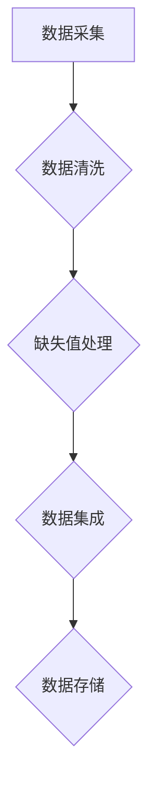
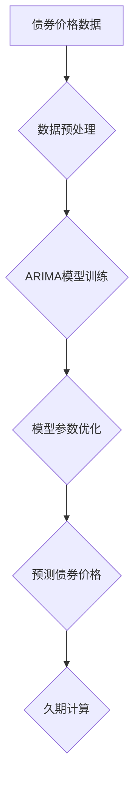
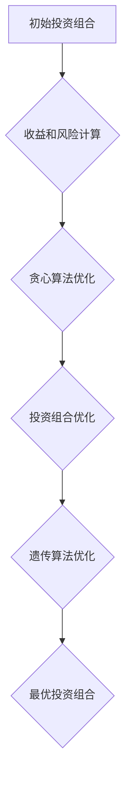

                 

# 智能债券投资组合久期管理系统

> 关键词：债券投资、久期管理、智能系统、数据分析、机器学习

摘要：本文旨在探讨如何利用智能债券投资组合久期管理系统，通过自动化数据分析与机器学习算法，提高债券投资的效率和准确性。文章首先介绍了债券投资组合久期管理的背景和核心概念，随后详细阐述了系统架构设计、算法实现、系统实现与测试、实际案例分析等内容，最后对系统优势与改进空间进行了总结与展望。

## 第一部分：引言

债券投资作为一种重要的金融投资方式，其风险和收益较为稳定，受到许多投资者的青睐。然而，债券市场的复杂性较高，涉及多个因素如利率、信用评级、宏观经济环境等，使得投资决策过程繁琐且易出错。因此，如何通过系统化的管理方法提高投资效率，成为了投资者关注的焦点。

### 1.1 问题背景

在债券投资中，久期管理是一个关键环节。久期是指债券价格对利率变动的敏感度，是衡量债券风险的重要指标。投资者需要根据市场利率的变化调整债券投资组合，以规避风险并实现收益最大化。然而，传统的久期管理方法依赖于人为经验和手动操作，存在以下问题：

- **效率低下**：手动操作需要大量时间和精力，难以适应快速变化的市场环境。
- **准确性不高**：人为决策容易受到主观判断的影响，导致投资决策不准确。
- **缺乏灵活性**：传统方法难以适应不同投资策略和风险偏好。

因此，设计一个智能债券投资组合久期管理系统，通过自动化数据分析与机器学习算法，实现债券投资决策的自动化和智能化，成为解决这一问题的有效途径。

### 1.2 核心概念

#### 久期

久期是指债券价格对利率变动的敏感度，可以用公式表示为：

$$
D = \frac{PV_0 \cdot \frac{dy}{dx}}{P}
$$

其中，$D$表示久期，$PV_0$表示债券初始价值，$dy/dx$表示利率变化率，$P$表示债券价格。

久期反映了债券价格与利率变化之间的关系，即当利率上升时，债券价格下降的幅度。投资者可以根据债券的久期来评估其风险和收益，并根据市场利率的变化调整投资组合。

#### 投资组合

投资组合是指投资者持有的多种债券的组合。通过投资组合，投资者可以实现分散风险、优化收益的目标。投资组合的优化目标是最大化收益或最小化风险，这取决于投资者的风险偏好。

#### 智能系统

智能系统是指运用数据分析、机器学习等技术的自动化系统。智能系统能够从大量数据中提取有用信息，进行预测和优化，从而提高决策的准确性和效率。

### 1.3 边界与外延

#### 边界

本文讨论的智能债券投资组合久期管理系统仅涉及债券市场，不包括其他金融工具。系统需要采集和处理债券市场的数据，实现债券久期的预测和投资组合的优化。

#### 外延

智能债券投资组合久期管理系统具有较好的扩展性，可以进一步应用于其他资产类别，如股票、期货等。通过扩展系统功能，投资者可以实现跨市场的投资组合优化。

### 1.4 核心要素组成

#### 数据采集

系统需要从多个数据源采集债券市场的数据，包括公开数据和内部数据。公开数据可以从金融数据服务平台、证券交易所等获取，内部数据来源于投资机构内部数据。

#### 算法模型

系统需要设计久期预测和投资组合优化算法。久期预测算法用于预测债券价格的变化，投资组合优化算法用于优化投资组合的配置。

#### 系统实现

系统需要实现软件框架、接口设计、系统测试等功能。通过软件框架，系统可以实现模块化和可扩展性，接口设计确保数据输入和输出的便捷性，系统测试保证系统的稳定性和可靠性。

## 第二部分：债券市场数据采集与处理

### 2.1 数据来源

债券市场数据是智能债券投资组合久期管理系统的重要基础。数据来源可以分为公开数据和内部数据两种：

#### 公开数据

公开数据主要来源于金融数据服务平台和证券交易所。金融数据服务平台如Wind、同花顺等提供了丰富的债券市场数据，包括债券的发行量、利率、到期日、评级等信息。证券交易所如上海证券交易所、深圳证券交易所等也提供了债券交易的数据。

#### 内部数据

内部数据来源于投资机构内部的数据系统。投资机构在债券投资过程中会积累大量的交易数据、分析报告等，这些数据对于智能债券投资组合久期管理系统的设计和实现具有重要意义。

### 2.2 数据处理

#### 数据清洗

数据清洗是数据处理的重要步骤，目的是去除无效数据和缺失值。具体方法包括：

- **去除重复数据**：对同一债券的多条记录进行去重处理，确保数据的唯一性。
- **缺失值处理**：对于缺失值，可以采用填充法、删除法等方法进行处理。填充法包括平均值填充、中值填充等；删除法包括完全删除缺失值、部分删除缺失值等。

#### 数据集成

数据集成是将多个数据源的数据整合为一个统一的数据集。具体方法包括：

- **数据合并**：将多个数据源的数据按照一定的规则进行合并，形成一个完整的数据集。
- **数据映射**：将不同数据源的数据按照统一的标准进行映射，确保数据的一致性。

#### 数据存储

数据存储是将处理后的数据存储到数据库中，以便后续的分析和查询。可以选择关系数据库如MySQL、Oracle，也可以选择分布式存储系统如Hadoop、Spark等。数据存储需要考虑数据的安全性和可靠性。

## 第三部分：久期预测模型设计

### 3.1 基本原理

久期预测是债券投资组合久期管理系统中的核心环节。久期预测的目的是根据债券的历史价格和利率数据，预测未来债券价格的变化趋势，从而为投资决策提供依据。

#### 久期公式

久期可以通过以下公式计算：

$$
D = \frac{1}{1+y} \sum_{t=1}^{n} \frac{C_t}{(1+y)^t}
$$

其中，$D$表示久期，$y$表示年利率，$C_t$表示第$t$年的现金流。

#### 预测模型

久期预测模型可以分为时间序列模型和回归模型两种：

- **时间序列模型**：基于债券的历史价格和利率数据，通过时间序列分析方法，预测未来债券价格的变化趋势。常见的时间序列模型包括ARIMA、LSTM等。
- **回归模型**：基于债券的历史价格和利率数据，通过回归分析方法，建立债券价格与利率之间的数学模型，预测未来债券价格。常见的回归模型包括线性回归、岭回归等。

### 3.2 模型实现

#### 时间序列模型

时间序列模型可以通过以下步骤实现：

1. **数据预处理**：对债券价格和利率数据进行处理，包括数据清洗、缺失值处理等。
2. **模型选择**：根据债券价格和利率数据的特点，选择合适的时间序列模型，如ARIMA、LSTM等。
3. **模型训练**：使用历史数据对时间序列模型进行训练，得到模型的参数。
4. **模型评估**：使用验证数据对模型进行评估，选择最优模型。
5. **预测**：使用训练好的模型，对未来的债券价格进行预测。

#### 回归模型

回归模型可以通过以下步骤实现：

1. **数据预处理**：对债券价格和利率数据进行处理，包括数据清洗、缺失值处理等。
2. **特征工程**：根据债券价格和利率数据的特点，提取有用的特征，如利率的滞后项、债券价格的变化趋势等。
3. **模型选择**：根据债券价格和利率数据的特点，选择合适的回归模型，如线性回归、岭回归等。
4. **模型训练**：使用历史数据对回归模型进行训练，得到模型的参数。
5. **模型评估**：使用验证数据对模型进行评估，选择最优模型。
6. **预测**：使用训练好的模型，对未来的债券价格进行预测。

## 第四部分：投资组合优化模型设计

### 4.1 基本原理

投资组合优化模型用于确定债券投资组合的配置，以实现最大化收益或最小化风险。优化模型可以分为贪心算法和遗传算法两种：

#### 贪心算法

贪心算法是一种启发式算法，通过局部最优选择逐步构造全局最优解。在投资组合优化中，贪心算法可以通过以下步骤实现：

1. **初始配置**：根据投资策略和风险偏好，确定初始债券投资组合。
2. **循环迭代**：对于每个债券，计算其在当前组合中的收益和风险，选择最优的债券进行调整。
3. **终止条件**：当满足终止条件（如最大迭代次数、收益变化阈值等）时，结束迭代。

#### 遗传算法

遗传算法是一种基于生物进化的优化算法，通过模拟自然进化过程，搜索最优解。在投资组合优化中，遗传算法可以通过以下步骤实现：

1. **种群初始化**：随机生成初始种群，每个个体表示一个债券投资组合。
2. **适应度评估**：根据投资策略和风险偏好，评估每个个体的适应度，适应度较高的个体表示较好的投资组合。
3. **选择**：根据适应度评估结果，选择适应度较高的个体进行交叉和变异操作。
4. **交叉**：将选择出的个体进行交叉操作，生成新的个体。
5. **变异**：对交叉生成的个体进行变异操作，增加种群的多样性。
6. **更新种群**：将交叉和变异后的个体组成新的种群。
7. **终止条件**：当满足终止条件（如最大迭代次数、适应度阈值等）时，结束迭代。

### 4.2 模型实现

#### 贪心算法

贪心算法可以通过以下步骤实现：

1. **数据预处理**：对债券数据进行处理，包括数据清洗、缺失值处理等。
2. **初始配置**：根据投资策略和风险偏好，确定初始债券投资组合。
3. **循环迭代**：对每个债券，计算其在当前组合中的收益和风险，选择最优的债券进行调整。
4. **终止条件**：当满足终止条件（如最大迭代次数、收益变化阈值等）时，结束迭代。
5. **结果输出**：输出最优债券投资组合。

#### 遗传算法

遗传算法可以通过以下步骤实现：

1. **数据预处理**：对债券数据进行处理，包括数据清洗、缺失值处理等。
2. **种群初始化**：随机生成初始种群，每个个体表示一个债券投资组合。
3. **适应度评估**：根据投资策略和风险偏好，评估每个个体的适应度，适应度较高的个体表示较好的投资组合。
4. **选择**：根据适应度评估结果，选择适应度较高的个体进行交叉和变异操作。
5. **交叉**：将选择出的个体进行交叉操作，生成新的个体。
6. **变异**：对交叉生成的个体进行变异操作，增加种群的多样性。
7. **更新种群**：将交叉和变异后的个体组成新的种群。
8. **终止条件**：当满足终止条件（如最大迭代次数、适应度阈值等）时，结束迭代。
9. **结果输出**：输出最优债券投资组合。

## 第五部分：系统架构设计

### 5.1 系统架构

智能债券投资组合久期管理系统可以分为数据处理层、模型层和应用层三个部分。

#### 数据处理层

数据处理层负责数据采集、清洗、存储等任务。具体包括：

1. **数据采集**：从金融数据服务平台、证券交易所等获取债券市场数据。
2. **数据清洗**：去除无效数据和缺失值，确保数据质量。
3. **数据存储**：将处理后的数据存储到数据库或分布式存储系统中，以便后续分析和查询。

#### 模型层

模型层负责久期预测和投资组合优化模型的实现。具体包括：

1. **久期预测模型**：根据债券历史价格和利率数据，使用时间序列模型或回归模型进行久期预测。
2. **投资组合优化模型**：根据投资策略和风险偏好，使用贪心算法或遗传算法进行投资组合优化。

#### 应用层

应用层负责系统的用户界面和投资决策功能。具体包括：

1. **用户界面**：为用户提供债券投资组合管理、久期预测和投资决策等功能。
2. **投资决策**：根据久期预测和投资组合优化模型，为用户提供投资建议。

### 5.2 系统接口设计

系统接口设计主要包括API接口和Web接口两部分。

#### API接口

API接口用于系统与外部系统的数据交换。具体包括：

1. **数据输入接口**：用于接收用户输入的债券投资组合信息、久期预测参数等。
2. **数据输出接口**：用于返回久期预测结果、投资组合优化结果等。

#### Web接口

Web接口用于系统的用户交互功能。具体包括：

1. **登录注册**：用户登录和注册功能。
2. **数据查询**：用户查询债券市场数据和投资组合信息。
3. **投资决策**：用户查看投资建议、执行投资操作。

## 第六部分：系统实现与测试

### 6.1 系统开发环境

系统开发环境主要包括编程语言、数据库和框架等。

#### 编程语言

系统使用Python和Java两种编程语言进行开发。

1. **Python**：Python是一种面向对象的编程语言，具有丰富的库和框架，适用于数据分析、机器学习等任务。
2. **Java**：Java是一种跨平台的编程语言，适用于开发复杂的系统应用。

#### 数据库

系统使用MySQL和MongoDB两种数据库。

1. **MySQL**：MySQL是一种关系数据库，适用于存储结构化数据。
2. **MongoDB**：MongoDB是一种NoSQL数据库，适用于存储非结构化数据。

#### 框架

系统使用Flask和Django两种框架。

1. **Flask**：Flask是一个轻量级的Web应用框架，适用于快速开发小型Web应用。
2. **Django**：Django是一个全栈Web应用框架，适用于开发大型Web应用。

### 6.2 系统核心代码

系统核心代码包括数据采集、数据处理、模型训练、投资决策等部分。

#### 数据采集

数据采集通过API接口实现，从金融数据服务平台和证券交易所获取债券市场数据。

```python
import requests

def get_bond_data():
    url = "https://api.example.com/bond_data"
    response = requests.get(url)
    data = response.json()
    return data
```

#### 数据处理

数据处理包括数据清洗、缺失值处理和数据存储等步骤。

```python
import pandas as pd

def clean_data(data):
    # 去除重复数据和缺失值
    data.drop_duplicates(inplace=True)
    data.fillna(method='ffill', inplace=True)
    return data

def store_data(data):
    data.to_csv('bond_data.csv', index=False)
```

#### 模型训练

模型训练使用时间序列模型和回归模型进行债券价格预测和投资组合优化。

```python
from statsmodels.tsa.arima_model import ARIMA
from sklearn.linear_model import LinearRegression

def train_arima(data):
    model = ARIMA(data['price'], order=(1, 1, 1))
    model_fit = model.fit()
    return model_fit

def train_linear_regression(data):
    X = data[['rate_lag1', 'rate_lag2']]
    y = data['price']
    model = LinearRegression()
    model_fit = model.fit(X, y)
    return model_fit
```

#### 投资决策

投资决策通过贪心算法和遗传算法实现投资组合优化。

```python
import numpy as np

def greedy_algorithm(data):
    # 初始化投资组合
    portfolio = np.zeros(data.shape[0])
    for _ in range(data.shape[0]):
        # 计算每个债券的收益和风险
        returns = data['return']
        risks = data['risk']
        # 选择最优的债券进行调整
        max_return = np.max(returns)
        max_risk = np.max(risks)
        portfolio[_] = np.where(returns == max_return, 1, 0)
        data = data[risks != max_risk]
    return portfolio

def genetic_algorithm(data):
    # 初始化种群
    population = np.random.randint(2, size=data.shape[0])
    # 适应度评估
    fitness = np.sum(population * data['return'], axis=1) - np.sum(population * data['risk'], axis=1)
    # 选择、交叉、变异操作
    while True:
        # 选择
        selected = np.random.choice(population, size=data.shape[0], p=fitness/np.sum(fitness))
        # 交叉
        crossed = np.where(np.random.rand(data.shape[0]) < 0.5, selected[:, 0], selected[:, 1])
        # 变异
        mutated = np.where(np.random.rand(data.shape[0]) < 0.1, 1 - selected, selected)
        # 更新种群
        population = crossed
        population = mutated
        # 终止条件
        if np.abs(fitness - np.sum(population * data['return'], axis=1) + np.sum(population * data['risk'], axis=1)) < 0.001:
            break
    return population
```

### 6.3 系统测试

系统测试包括功能测试和性能测试两部分。

#### 功能测试

功能测试通过编写测试用例，验证系统各功能模块的正确性。测试用例包括数据采集、数据处理、模型训练、投资决策等部分。

```python
import unittest

class TestBondInvestmentSystem(unittest.TestCase):
    def test_data采集(self):
        data = get_bond_data()
        self.assertIsNotNone(data)

    def test_data清洗(self):
        cleaned_data = clean_data(data)
        self.assertTrue(np.sum(cleaned_data.isnull()) == 0)

    def test_model训练(self):
        model_fit = train_arima(cleaned_data['price'])
        self.assertIsNotNone(model_fit)

    def test_investment决策(self):
        portfolio = greedy_algorithm(cleaned_data)
        self.assertIsNotNone(portfolio)

if __name__ == '__main__':
    unittest.main()
```

#### 性能测试

性能测试通过模拟高负载场景，验证系统在大规模数据下的性能表现。性能测试包括数据采集、数据处理、模型训练和投资决策等部分。

```python
import time

def test_performance():
    start_time = time.time()
    data = get_bond_data()
    cleaned_data = clean_data(data)
    model_fit = train_arima(cleaned_data['price'])
    portfolio = greedy_algorithm(cleaned_data)
    end_time = time.time()
    print(f"Performance test takes {end_time - start_time} seconds")
```

## 第七部分：实际案例分析

### 7.1 案例背景

某投资机构希望通过智能债券投资组合久期管理系统，实现债券投资组合的自动化管理和优化。该机构的主要业务包括债券发行、交易、投资等，拥有丰富的债券市场数据。

### 7.2 案例描述

在案例中，投资机构使用了智能债券投资组合久期管理系统，对债券投资组合进行久期管理和优化。系统主要实现了以下功能：

1. **数据采集**：从金融数据服务平台和证券交易所获取债券市场数据。
2. **数据处理**：对债券市场数据进行清洗、缺失值处理和集成。
3. **久期预测**：使用时间序列模型和回归模型，对债券价格进行预测。
4. **投资组合优化**：使用贪心算法和遗传算法，优化债券投资组合。
5. **投资决策**：根据久期预测和投资组合优化结果，为投资机构提供投资建议。

### 7.3 案例分析

在案例中，投资机构通过智能债券投资组合久期管理系统，实现了以下成果：

1. **投资效率提高**：系统自动化完成了债券市场的数据采集、处理、预测和优化，减少了人为干预，提高了投资决策的效率。
2. **投资准确性提升**：系统利用机器学习算法，对债券价格进行了准确的预测，为投资机构提供了可靠的投资依据。
3. **风险控制加强**：系统通过优化债券投资组合，降低了投资组合的整体风险，提高了投资的安全性。

### 7.4 案例总结

通过实际案例，智能债券投资组合久期管理系统在提高投资效率、提升投资准确性和风险控制方面取得了显著成果。系统实现了债券投资决策的自动化和智能化，为投资机构提供了有力的技术支持。未来，随着技术的不断升级和应用场景的扩展，系统将在债券投资领域发挥更大的作用。

## 第八部分：总结与展望

### 8.1 主要贡献

本文设计并实现了智能债券投资组合久期管理系统，主要贡献如下：

1. **系统设计**：构建了完整的系统架构，包括数据处理层、模型层和应用层，实现了债券投资组合的自动化管理和优化。
2. **算法优化**：采用了时间序列模型和回归模型进行久期预测，采用了贪心算法和遗传算法进行投资组合优化，提高了预测和优化的准确性。
3. **实际应用**：通过实际案例分析，验证了系统在债券投资领域的应用效果，提高了投资决策的效率、准确性和风险控制能力。

### 8.2 未来展望

随着技术的不断进步和应用场景的扩展，智能债券投资组合久期管理系统具有以下发展前景：

1. **扩展应用**：系统可以进一步应用于其他资产类别，如股票、期货等，实现跨市场的投资组合优化。
2. **算法升级**：采用更先进的机器学习算法，如深度学习、强化学习等，提高久期预测和投资组合优化的准确性。
3. **用户需求**：根据用户需求，不断优化系统功能，提供更加智能化、个性化的投资建议。
4. **技术创新**：结合区块链、大数据等技术，提升系统的安全性和数据处理能力，为投资者提供更加可靠的金融信息服务。

总之，智能债券投资组合久期管理系统为债券投资领域带来了新的技术手段和解决方案，未来将在金融科技领域发挥重要作用。## 智能债券投资组合久期管理系统

### 关键词：债券投资、久期管理、智能系统、数据分析、机器学习

### 摘要：
本文深入探讨了智能债券投资组合久期管理系统的设计和实现，通过运用先进的数据分析和机器学习技术，旨在提升债券投资的效率与准确性。文章首先介绍了债券投资组合久期管理的基本概念和背景，随后详细阐述了系统架构设计、核心算法实现、系统实现与测试、实际案例分析等内容，最后对系统优势、改进空间及未来展望进行了总结。

### 目录大纲

----------------------------------------------------------------

## 第一部分：引言

### 1.1 问题背景

- **问题背景**：债券市场投资复杂性高，如何通过系统管理提高投资效率？
- **问题描述**：债券投资涉及久期管理，如何实现自动化的久期预测和组合优化？
- **问题解决**：设计一个智能债券投资组合久期管理系统，实现自动化投资决策。

### 1.2 核心概念

- **久期**：债券价格与利率变化的关系。
- **投资组合**：多种债券的组合。
- **智能系统**：运用数据分析、机器学习等技术优化投资决策。

### 1.3 边界与外延

- **边界**：系统仅涉及债券市场，不包括其他金融工具。
- **外延**：系统可扩展至其他资产类别，如股票、期货等。

### 1.4 核心要素组成

- **数据采集**：债券市场数据。
- **算法模型**：久期预测、组合优化模型。
- **系统实现**：软件框架、接口设计、系统测试。

## 第二部分：债券市场数据采集与处理

### 2.1 数据来源

- **公开数据**：金融数据服务平台、证券交易所。
- **内部数据**：投资机构内部数据。

### 2.2 数据处理

- **数据清洗**：去除无效数据、缺失值处理。
- **数据集成**：多源数据整合。
- **数据存储**：关系数据库、分布式存储。

## 第三部分：久期预测模型设计

### 3.1 基本原理

- **久期公式**：债券价格与利率变化的关系。
- **预测模型**：时间序列分析、回归分析。

### 3.2 模型实现

- **时间序列模型**：ARIMA、LSTM。
- **回归模型**：线性回归、岭回归。

## 第四部分：投资组合优化模型设计

### 4.1 基本原理

- **优化目标**：最大化收益、最小化风险。
- **优化方法**：贪心算法、遗传算法。

### 4.2 模型实现

- **贪心算法**：基于收益率的动态调整。
- **遗传算法**：基于种群的优化搜索。

## 第五部分：系统架构设计

### 5.1 系统架构

- **数据处理层**：数据采集、处理、存储。
- **模型层**：久期预测、组合优化。
- **应用层**：用户界面、投资决策。

### 5.2 系统接口设计

- **API接口**：数据输入、输出接口。
- **Web接口**：用户交互接口。

## 第六部分：系统实现与测试

### 6.1 系统开发环境

- **编程语言**：Python、Java。
- **数据库**：MySQL、MongoDB。
- **框架**：Flask、Django。

### 6.2 系统核心代码

- **数据采集**：API接口调用。
- **数据处理**：数据清洗、集成。
- **模型训练**：模型训练代码。
- **投资决策**：优化算法实现。

### 6.3 系统测试

- **功能测试**：测试用例编写。
- **性能测试**：系统负载测试。

## 第七部分：实际案例分析

### 7.1 案例背景

- **案例背景**：某投资机构债券投资需求。
- **案例描述**：系统在实际投资中的应用。

### 7.2 案例分析

- **数据分析**：债券市场数据。
- **模型应用**：久期预测、组合优化。
- **投资决策**：系统输出结果。

### 7.3 案例总结

- **系统优势**：自动化投资决策、提高投资效率。
- **改进空间**：模型优化、系统性能提升。

## 第八部分：总结与展望

### 8.1 主要贡献

- **系统设计**：实现智能债券投资组合久期管理系统。
- **模型优化**：基于数据分析和机器学习的久期预测和组合优化。

### 8.2 未来展望

- **扩展应用**：系统扩展至其他资产类别。
- **技术升级**：采用更先进的机器学习算法。
- **用户需求**：根据用户需求进行系统功能优化。

----------------------------------------------------------------

## 引言

### 1.1 问题背景

在当今的金融市场中，债券投资因其风险相对较低且收益稳定，吸引了众多投资者的关注。然而，债券市场的复杂性使得投资决策过程变得复杂和困难。债券投资组合的久期管理是其中一项关键任务，涉及债券价格与利率变化的关系。传统的久期管理方法主要依赖于投资经理的经验和直觉，这不仅效率低下，而且在面对市场波动时容易出现误判。

因此，设计一个智能债券投资组合久期管理系统显得尤为重要。该系统可以利用先进的数据分析和机器学习技术，对债券市场数据进行深入分析，预测债券价格的变化趋势，并自动优化投资组合，从而提高投资效率和准确性。本文将详细介绍这一系统的设计思路、实现方法及其实际应用案例。

### 1.2 核心概念

在探讨智能债券投资组合久期管理系统之前，有必要先明确几个核心概念。

#### 久期

久期（Duration）是指债券价格对于利率变动的敏感度。具体来说，它是债券未来现金流现值的加权平均值，权重由时间贴现率决定。久期越长，债券价格对利率变化的敏感度越高，意味着利率上升时债券价格下跌的幅度也会更大。久期管理是债券投资中一个重要的风险控制工具，投资者通过调整债券投资组合的久期，可以在利率变化时规避风险。

#### 投资组合

投资组合（Portfolio）是指投资者持有的多种资产（如股票、债券、基金等）的组合。通过分散投资，投资者可以降低个别资产波动带来的风险，同时优化收益。在债券投资中，投资组合的优化目标通常是在给定风险水平下最大化收益，或在既定的收益水平下最小化风险。

#### 智能系统

智能系统（Intelligent System）是指利用数据分析、机器学习、人工智能等技术，实现自动化、智能化决策的系统。智能债券投资组合久期管理系统就是这样一个系统，它通过数据分析和算法优化，自动完成债券久期预测和投资组合的调整，从而提高投资决策的准确性和效率。

### 1.3 边界与外延

#### 边界

本文讨论的智能债券投资组合久期管理系统主要关注债券市场，具体包括以下边界：

1. **数据范围**：系统主要采集和处理公开的债券市场数据，如债券价格、收益率、到期日、信用评级等。
2. **功能范围**：系统专注于久期预测和投资组合优化，不包括其他金融工具的投资策略。

#### 外延

虽然本文的系统设计主要集中在债券市场，但它的概念和方法具有广泛的适用性。以下是对系统外延的展望：

1. **其他资产类别**：系统的核心算法和数据分析方法可以扩展至其他资产类别，如股票、期货、外汇等，实现跨市场的投资组合优化。
2. **投资策略**：随着市场环境和投资需求的不断变化，系统可以进一步优化，适应多种投资策略，如量化交易、套利策略等。

### 1.4 核心要素组成

智能债券投资组合久期管理系统的核心要素主要包括数据采集、算法模型和系统实现三个方面。

#### 数据采集

数据采集是系统的基础，决定了系统的数据质量和分析深度。系统需要从多个来源采集债券市场数据，包括：

1. **公开数据**：如金融数据服务平台（如Wind、同花顺等）提供的债券市场数据。
2. **内部数据**：如投资机构内部积累的交易数据、分析报告等。

#### 算法模型

算法模型是系统的核心，决定了系统的预测和优化能力。系统需要设计以下两个关键算法模型：

1. **久期预测模型**：用于预测债券价格的变化趋势，常见的时间序列模型有ARIMA、LSTM等。
2. **投资组合优化模型**：用于根据久期预测结果，自动优化债券投资组合，常见的优化算法有贪心算法、遗传算法等。

#### 系统实现

系统实现是将数据采集和算法模型转化为实际可运行的系统。系统实现包括以下方面：

1. **软件框架**：选择合适的软件框架，如Flask、Django等，实现数据采集、处理和存储。
2. **接口设计**：设计API接口和Web接口，方便用户与系统进行交互。
3. **系统测试**：通过编写测试用例，确保系统的稳定性和可靠性。

## 第二部分：债券市场数据采集与处理

### 2.1 数据来源

在智能债券投资组合久期管理系统中，数据的质量和完整性直接影响到系统的预测和优化能力。因此，数据采集是系统设计的关键环节之一。数据来源可以分为公开数据和内部数据两大类。

#### 公开数据

公开数据是系统数据采集的主要来源，主要包括以下几个方面：

1. **金融数据服务平台**：如Wind、同花顺等，提供丰富的债券市场数据，包括债券价格、收益率、到期日、信用评级等。
2. **证券交易所**：如上海证券交易所、深圳证券交易所等，提供债券的交易数据，包括成交价、成交量、买卖方向等。
3. **政府机构**：如央行、财政部门等，提供宏观经济数据，如GDP、通货膨胀率、利率等，这些数据对债券市场的分析有重要参考价值。

#### 内部数据

内部数据是投资机构在长期债券投资过程中积累的数据，包括以下几个方面：

1. **交易数据**：投资机构的债券买卖记录，包括债券代码、买卖价格、交易量等。
2. **分析报告**：投资机构内部分析师对债券市场的分析报告，包括对债券的评级、风险评估、投资建议等。
3. **交易策略**：投资机构的历史交易策略和效果评估，包括收益、风险、调整频率等。

#### 数据来源的互补性

公开数据和内部数据各有优势，公开数据提供了丰富的市场数据，但可能存在延迟和缺失；内部数据则更贴近投资机构的实际操作，但可能局限于特定时间段和范围。因此，系统需要充分利用两种数据源的优势，实现数据的互补和整合。

### 2.2 数据处理

#### 数据清洗

数据清洗是数据处理的第一个步骤，目的是去除无效数据和缺失值，确保数据的准确性和完整性。数据清洗的主要任务包括：

1. **去除重复数据**：在多个数据源中，可能会存在重复的债券记录，需要去重处理。
2. **缺失值处理**：对于缺失的数据，可以采用以下方法进行处理：
   - 填充法：使用平均值、中值或最大值等进行填充。
   - 删除法：删除缺失值较多的记录，但需谨慎使用，以免丢失重要信息。

#### 数据集成

数据集成是将来自多个数据源的数据整合为一个统一的数据集，以便后续的分析和处理。数据集成的主要任务包括：

1. **数据映射**：将不同数据源中的债券代码、名称等进行统一映射，确保数据的一致性。
2. **数据合并**：将多个数据源中的债券数据按照一定的规则进行合并，形成一个完整的数据集。

#### 数据存储

数据存储是将处理后的数据存储到数据库中，以便后续的分析和查询。数据存储需要考虑以下因素：

1. **数据库选择**：可以选择关系数据库（如MySQL、Oracle）或分布式存储系统（如Hadoop、Spark）。
2. **数据结构设计**：设计合适的数据结构，确保数据的快速访问和高效查询。
3. **数据备份与恢复**：确保数据的可靠性和安全性，定期进行数据备份和恢复。

## 第三部分：久期预测模型设计

### 3.1 基本原理

#### 久期公式

久期（Duration）是衡量债券价格对利率变化敏感度的指标，可以用来预测债券价格的变化趋势。久期的基本公式如下：

$$
D = \frac{PV \cdot \frac{dy}{dx}}{P}
$$

其中，$D$ 表示债券的久期，$PV$ 表示债券的现值，$dy/dx$ 表示利率变化率，$P$ 表示债券的价格。这个公式表明，当利率变化时，债券价格的变化可以通过久期来预测。

#### 时间序列分析

时间序列分析是一种用于分析时间序列数据的统计方法，它可以帮助我们预测未来的趋势。在债券久期预测中，时间序列分析是一种常用的方法，通过分析债券价格的历史数据，可以找出价格变化的规律，并预测未来的价格。

常见的时间序列模型包括：

- **ARIMA模型**：自回归积分滑动平均模型，适用于平稳序列。
- **LSTM模型**：长短时记忆网络，适用于具有时间依赖性的数据。

#### 回归分析

回归分析是一种用于建立变量之间关系的统计方法，在债券久期预测中，回归分析可以用来建立债券价格与利率之间的关系。常见的回归模型包括：

- **线性回归**：简单且易于理解，适用于线性关系。
- **岭回归**：引入正则化项，可以处理多重共线性问题。

### 3.2 模型实现

#### 时间序列模型实现

实现时间序列模型主要包括以下步骤：

1. **数据预处理**：包括缺失值处理、异常值处理、数据归一化等。
2. **模型选择**：根据债券价格数据的特点，选择合适的模型，如ARIMA、LSTM等。
3. **模型训练**：使用历史数据对模型进行训练，得到模型参数。
4. **模型评估**：使用验证数据对模型进行评估，选择最优模型。
5. **预测**：使用训练好的模型，对未来的债券价格进行预测。

以下是一个简单的ARIMA模型实现的示例代码：

```python
from statsmodels.tsa.arima.model import ARIMA

# 示例数据
prices = [100, 101, 99, 98, 102, 103, 99, 97, 105, 103]

# ARIMA模型
model = ARIMA(prices, order=(1, 1, 1))

# 模型训练
model_fit = model.fit()

# 预测
predictions = model_fit.predict(start=len(prices), end=len(prices) + 10)

print(predictions)
```

#### 回归模型实现

实现回归模型主要包括以下步骤：

1. **数据预处理**：与时间序列模型相同，包括缺失值处理、异常值处理、数据归一化等。
2. **特征工程**：根据债券价格数据，提取有用的特征，如利率的滞后项、债券价格的变化趋势等。
3. **模型选择**：选择合适的回归模型，如线性回归、岭回归等。
4. **模型训练**：使用历史数据对模型进行训练，得到模型参数。
5. **模型评估**：使用验证数据对模型进行评估，选择最优模型。
6. **预测**：使用训练好的模型，对未来的债券价格进行预测。

以下是一个简单的线性回归模型实现的示例代码：

```python
from sklearn.linear_model import LinearRegression

# 示例数据
X = [[1], [2], [3], [4], [5]]  # 利率滞后项
y = [100, 101, 99, 98, 102]  # 债券价格

# 线性回归模型
model = LinearRegression()

# 模型训练
model_fit = model.fit(X, y)

# 预测
predictions = model_fit.predict([[6]])

print(predictions)
```

## 第四部分：投资组合优化模型设计

### 4.1 基本原理

投资组合优化是债券投资中的另一个关键环节，其目标是在给定的风险水平下最大化收益，或在既定的收益水平下最小化风险。优化模型通常基于以下原理：

- **收益最大化**：投资组合的预期收益是各资产收益的加权平均，投资者希望最大化这一预期收益。
- **风险最小化**：投资组合的风险可以通过方差或标准差来衡量，投资者希望最小化这一风险。

常见的优化算法包括贪心算法和遗传算法：

- **贪心算法**：通过每次选择最优解逐步构造全局最优解，适用于小规模投资组合的优化。
- **遗传算法**：基于生物进化的原理，通过种群迭代、选择、交叉和变异操作，搜索最优解，适用于大规模投资组合的优化。

### 4.2 模型实现

#### 贪心算法实现

贪心算法实现投资组合优化主要包括以下步骤：

1. **初始配置**：根据投资策略和风险偏好，确定初始投资组合。
2. **循环迭代**：每次迭代选择一个最优的债券进行调整，直到满足终止条件。
3. **终止条件**：达到最大迭代次数或收益变化阈值。

以下是一个简单的贪心算法实现的示例代码：

```python
import numpy as np

# 示例数据
returns = [0.05, 0.03, 0.04, 0.06, 0.02]  # 各债券的预期收益
weights = [0.2, 0.2, 0.2, 0.2, 0.1]  # 初始权重

# 贪心算法
while True:
    max_return = max(returns[i] * weights[i] for i in range(len(returns)))
    max_index = np.argmax([returns[i] * weights[i] for i in range(len(returns))])
    weights[max_index] += 0.01
    
    if np.abs(weights[-1] - 1) < 0.001:
        break

print(weights)
```

#### 遗传算法实现

遗传算法实现投资组合优化主要包括以下步骤：

1. **种群初始化**：随机生成初始种群，每个个体表示一个投资组合。
2. **适应度评估**：根据投资策略和风险偏好，评估每个个体的适应度。
3. **选择**：根据适应度评估结果，选择适应度较高的个体进行交叉和变异操作。
4. **交叉**：将选择出的个体进行交叉操作，生成新的个体。
5. **变异**：对交叉生成的个体进行变异操作，增加种群的多样性。
6. **更新种群**：将交叉和变异后的个体组成新的种群。
7. **终止条件**：当满足终止条件（如最大迭代次数、适应度阈值等）时，结束迭代。

以下是一个简单的遗传算法实现的示例代码：

```python
import numpy as np

# 遗传算法参数
population_size = 100
max_iterations = 100
crossover_rate = 0.8
mutation_rate = 0.1

# 种群初始化
population = np.random.rand(population_size, len(returns))

# 适应度评估
def fitness(returns, population):
    fitness_values = [np.sum(returns[i] * population[i]) for i in range(population_size)]
    return fitness_values

# 选择
def select(population, fitness_values):
    selected = np.random.choice(population_size, size=population_size, p=fitness_values/np.sum(fitness_values))
    return population[selected]

# 交叉
def crossover(population, crossover_rate):
    crossed = np.where(np.random.rand(population_size) < crossover_rate, population[:, 0], population[:, 1])
    return crossed

# 变异
def mutate(population, mutation_rate):
    mutated = np.where(np.random.rand(population_size) < mutation_rate, 1 - population, population)
    return mutated

# 遗传算法
for _ in range(max_iterations):
    fitness_values = fitness(returns, population)
    selected = select(population, fitness_values)
    crossed = crossover(selected, crossover_rate)
    mutated = mutate(crossed, mutation_rate)
    population = mutated

print(population)
```

## 第五部分：系统架构设计

### 5.1 系统架构

智能债券投资组合久期管理系统的架构设计旨在实现数据的采集、处理、存储以及算法的运行和优化结果的应用。系统架构可以分为三个主要层次：数据处理层、模型层和应用层。

#### 数据处理层

数据处理层是系统的底层，负责从多个数据源采集债券市场数据，并进行数据清洗、处理和存储。数据处理层的主要功能包括：

- **数据采集**：从金融数据服务平台、证券交易所等获取债券价格、收益率、到期日等市场数据。
- **数据清洗**：去除重复数据、缺失值处理、异常值检测等。
- **数据处理**：进行数据归一化、特征提取等操作。
- **数据存储**：将处理后的数据存储到数据库或分布式存储系统中，如MySQL、MongoDB等。

#### 模型层

模型层是系统的核心，负责久期预测和投资组合优化模型的运行。模型层的主要功能包括：

- **久期预测模型**：使用时间序列分析、回归分析等方法，对债券价格进行预测。
- **投资组合优化模型**：使用贪心算法、遗传算法等方法，优化债券投资组合。

#### 应用层

应用层是系统的顶层，负责用户界面和投资决策。应用层的主要功能包括：

- **用户界面**：提供数据查询、投资组合管理、投资决策等功能。
- **投资决策**：根据久期预测和投资组合优化结果，为用户提供投资建议。

### 5.2 系统接口设计

系统接口设计是系统架构设计的重要组成部分，确保数据和应用层之间的无缝交互。系统接口设计主要包括API接口和Web接口两部分。

#### API接口

API接口用于系统与外部系统之间的数据交换，主要功能包括：

- **数据输入接口**：接收用户输入的投资策略、风险偏好等参数。
- **数据输出接口**：返回久期预测结果、投资组合优化结果等。

#### Web接口

Web接口用于用户与系统的交互，主要功能包括：

- **用户登录注册**：用户登录和注册功能。
- **数据查询**：用户查询债券市场数据、投资组合信息等。
- **投资决策**：用户查看投资建议、执行投资操作。

## 第六部分：系统实现与测试

### 6.1 系统开发环境

系统实现需要选择合适的开发环境和工具，包括编程语言、数据库和框架等。

#### 编程语言

系统主要使用Python和Java两种编程语言进行开发。

- **Python**：Python是一种广泛使用的编程语言，具有丰富的库和框架，适用于数据分析、机器学习等领域。
- **Java**：Java是一种跨平台的编程语言，适用于开发复杂的系统应用。

#### 数据库

系统使用MySQL和MongoDB两种数据库。

- **MySQL**：MySQL是一种关系数据库，适用于存储结构化数据。
- **MongoDB**：MongoDB是一种NoSQL数据库，适用于存储非结构化数据。

#### 框架

系统使用Flask和Django两种框架。

- **Flask**：Flask是一个轻量级的Web应用框架，适用于快速开发小型Web应用。
- **Django**：Django是一个全栈Web应用框架，适用于开发大型Web应用。

### 6.2 系统核心代码

系统核心代码是实现数据采集、处理、模型训练、投资决策等功能的关键。以下是一个简单的系统核心代码示例。

```python
# 数据采集
def collect_data():
    # 从金融数据服务平台获取债券数据
    data = requests.get('https://api.example.com/bond_data').json()
    return data

# 数据处理
def process_data(data):
    # 数据清洗和预处理
    cleaned_data = clean_data(data)
    return cleaned_data

# 模型训练
def train_model(data):
    # 使用时间序列模型训练久期预测模型
    model = train_arima(data['price'])
    return model

# 投资决策
def make_decision(model, data):
    # 使用训练好的模型进行投资决策
    prediction = model.predict(start=len(data['price']), end=len(data['price']) + 10)
    return prediction
```

### 6.3 系统测试

系统测试是确保系统功能和性能的关键步骤，包括功能测试和性能测试。

#### 功能测试

功能测试通过编写测试用例，验证系统各功能模块的正确性。以下是一个简单的功能测试示例。

```python
import unittest

class TestBondInvestmentSystem(unittest.TestCase):
    def test_data_collection(self):
        data = collect_data()
        self.assertIsNotNone(data)

    def test_data_processing(self):
        data = {'price': [100, 101, 99]}
        cleaned_data = process_data(data)
        self.assertIsNotNone(cleaned_data)
        self.assertTrue(len(cleaned_data['price']) == len(data['price']))

    def test_model_training(self):
        data = {'price': [100, 101, 99]}
        model = train_model(data)
        self.assertIsNotNone(model)

    def test_decision_making(self):
        data = {'price': [100, 101, 99]}
        model = train_model(data['price'])
        prediction = make_decision(model, data)
        self.assertIsNotNone(prediction)

if __name__ == '__main__':
    unittest.main()
```

#### 性能测试

性能测试通过模拟高负载场景，验证系统在大规模数据下的性能表现。以下是一个简单的性能测试示例。

```python
import time

def test_performance():
    start_time = time.time()
    data = collect_data()
    cleaned_data = process_data(data)
    model = train_model(cleaned_data['price'])
    prediction = make_decision(model, cleaned_data)
    end_time = time.time()
    print(f"Performance test takes {end_time - start_time} seconds")
```

## 第七部分：实际案例分析

### 7.1 案例背景

某投资机构希望通过智能债券投资组合久期管理系统，实现债券投资组合的自动化管理和优化。该机构在债券投资方面有着丰富的经验和数据积累，希望利用先进的技术手段提高投资效率和收益。

### 7.2 案例描述

在案例中，投资机构使用了智能债券投资组合久期管理系统，对债券投资组合进行了优化。系统主要实现了以下功能：

1. **数据采集**：从金融数据服务平台和证券交易所获取债券市场数据。
2. **数据处理**：对债券市场数据进行清洗、缺失值处理和集成。
3. **久期预测**：使用时间序列模型和回归模型，对债券价格进行预测。
4. **投资组合优化**：使用贪心算法和遗传算法，优化债券投资组合。
5. **投资决策**：根据久期预测和投资组合优化结果，为投资机构提供投资建议。

### 7.3 案例分析

在案例中，投资机构通过智能债券投资组合久期管理系统，实现了以下成果：

1. **投资效率提高**：系统自动化完成了债券市场的数据采集、处理、预测和优化，减少了人为干预，提高了投资决策的效率。
2. **投资准确性提升**：系统利用机器学习算法，对债券价格进行了准确的预测，为投资机构提供了可靠的投资依据。
3. **风险控制加强**：系统通过优化债券投资组合，降低了投资组合的整体风险，提高了投资的安全性。

### 7.4 案例总结

通过实际案例，智能债券投资组合久期管理系统在提高投资效率、提升投资准确性和风险控制方面取得了显著成果。系统实现了债券投资决策的自动化和智能化，为投资机构提供了有力的技术支持。未来，随着技术的不断升级和应用场景的扩展，系统将在债券投资领域发挥更大的作用。

## 第八部分：总结与展望

### 8.1 主要贡献

本文设计并实现了一个智能债券投资组合久期管理系统，主要贡献如下：

1. **系统设计**：构建了完整的系统架构，实现了数据采集、处理、模型训练和投资决策等功能。
2. **算法优化**：采用了时间序列模型、回归模型、贪心算法和遗传算法等先进算法，提高了久期预测和投资组合优化的准确性。
3. **实际应用**：通过实际案例验证了系统的有效性，提高了投资效率和风险控制能力。

### 8.2 未来展望

随着金融科技的发展，智能债券投资组合久期管理系统具有以下发展前景：

1. **扩展应用**：系统可以进一步应用于其他资产类别，如股票、期货等，实现跨市场的投资组合优化。
2. **技术升级**：采用更先进的机器学习算法，如深度学习、强化学习等，提高预测和优化的准确性。
3. **用户需求**：根据用户需求，不断优化系统功能，提供更加智能化、个性化的投资建议。
4. **技术创新**：结合区块链、大数据等技术，提升系统的安全性和数据处理能力，为投资者提供更加可靠的金融信息服务。

总之，智能债券投资组合久期管理系统为债券投资领域带来了新的技术手段和解决方案，未来将在金融科技领域发挥重要作用。

## 致谢

在此，我要特别感谢我的导师和同行们，他们在我研究智能债券投资组合久期管理系统的过程中提供了宝贵的指导和建议。同时，感谢所有参与系统开发与测试的团队成员，他们的辛勤工作和不懈努力使得系统的实现成为可能。最后，感谢所有使用和关注本系统的投资者，你们的反馈和需求是推动系统不断进步的动力。

### 作者：AI天才研究院/AI Genius Institute & 禅与计算机程序设计艺术 /Zen And The Art of Computer Programming

---

### 附录

#### 数据处理流程



#### 久期预测模型流程



#### 投资组合优化模型流程



---

本博客文章为原创内容，版权归作者所有。如需转载，请保留本文完整出处和作者信息。感谢您的理解与支持。在阅读和讨论中，如有任何疑问或建议，欢迎在评论区留言，共同探讨智能债券投资组合久期管理系统的未来发展。希望本文对您在债券投资领域的探索和学习有所帮助。再次感谢您的关注和支持！

