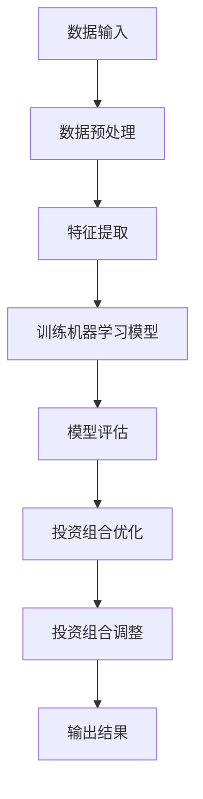
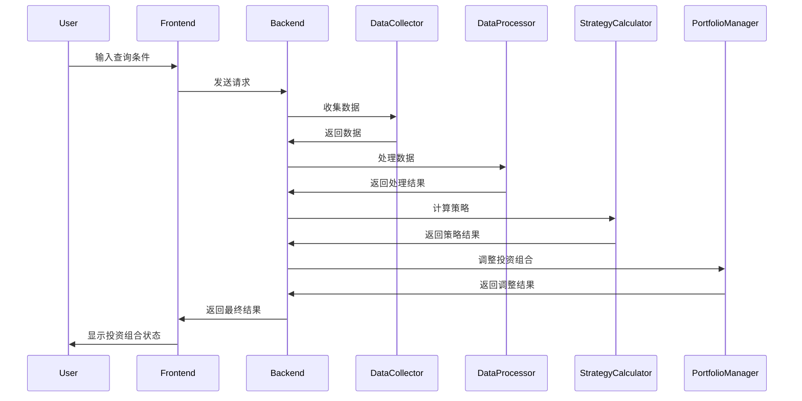

                 

### 摘要

本文深入探讨了智能债券投资组合免疫策略，这是一种利用人工智能和数据分析技术来优化债券投资组合的方法。在当前的金融市场中，债券投资因其相对稳定的风险收益特性，备受投资者青睐。然而，传统投资策略在面对市场波动时表现欠佳，因此，智能债券投资组合免疫策略应运而生。本文将逐步介绍智能债券投资组合免疫策略的核心概念、算法原理、数学模型、系统架构以及实际应用案例，帮助读者全面理解和掌握这一前沿技术。通过本文的阅读，您将了解如何利用人工智能技术进行债券投资组合的优化，从而在复杂多变的市场环境中实现风险控制和收益最大化。

### 目录

1. **摘要**
2. **引言**
3. **背景介绍**
4. **核心概念与联系**
5. **算法原理讲解**
6. **数学模型与公式**
7. **系统分析与架构设计方案**
8. **项目实战**
9. **最佳实践与总结**
10. **注意事项与风险提示**
11. **拓展阅读**
12. **作者信息**

----------------------------------------------------------------

### 引言

随着金融市场的不断演变和人工智能技术的飞速发展，投资者面临着前所未有的机遇和挑战。债券市场作为金融市场的重要组成部分，其波动性和复杂性使得传统的投资策略难以应对。智能债券投资组合免疫策略正是在这种背景下产生的一种创新性方法。它利用人工智能和大数据分析技术，对市场数据进行深度挖掘，通过算法优化债券投资组合，从而在风险可控的情况下实现收益最大化。

本文旨在深入探讨智能债券投资组合免疫策略的原理、方法和实际应用。我们将首先介绍智能债券投资组合免疫策略的背景和重要性，接着详细阐述其核心概念，包括相关术语的定义、问题背景和问题描述。然后，我们将逐步介绍智能债券投资组合免疫策略的算法原理、数学模型以及系统架构。在项目实战部分，我们将通过具体案例展示这一策略的实际应用过程和效果。最后，本文将总结最佳实践技巧，提出注意事项和风险提示，并推荐进一步阅读的材料。

希望通过本文的阅读，读者能够对智能债券投资组合免疫策略有一个全面而深入的理解，并能够在实际投资中运用这一策略，实现风险控制和收益最大化。

### 背景介绍

智能债券投资组合免疫策略的提出，源于传统债券投资策略在面对市场波动时的局限性。传统债券投资策略主要依赖于历史数据和市场经验，通过简单的数学模型和投资组合理论进行优化。然而，在金融市场日益复杂和不确定的环境下，这种策略往往难以应对突发性市场波动，导致投资者收益不稳定甚至遭受损失。

债券市场是一个由多种债券品种、不同的发行主体和市场环境构成的复杂系统。债券的种类繁多，包括国债、企业债、地方政府债等，每种债券都有其独特的风险收益特征。债券市场行情受到宏观经济政策、利率变化、市场情绪等多种因素的影响，这些因素相互作用，使得市场波动具有高度不确定性和复杂性。

面对这样的市场环境，投资者需要一个能够动态调整、适应市场变化的策略。智能债券投资组合免疫策略正是为了解决这一问题而设计的。它利用人工智能和大数据分析技术，对市场数据、经济指标和债券特征进行深度挖掘和分析，从而构建出一个能够有效抵御市场波动的投资组合。

智能债券投资组合免疫策略的重要性体现在以下几个方面：

1. **风险控制**：通过智能分析，策略能够实时监测市场变化，快速调整投资组合，降低投资风险。
2. **收益优化**：利用机器学习算法和大数据分析，策略能够挖掘潜在的投资机会，实现收益最大化。
3. **市场适应性**：智能债券投资组合免疫策略能够根据市场环境动态调整，适应不同市场状况，提高投资组合的稳健性。
4. **数据驱动的决策**：依托人工智能技术，策略能够从海量数据中提取有价值的信息，为投资决策提供科学依据。

总之，智能债券投资组合免疫策略为投资者提供了一种全新的投资方式，有助于在复杂多变的市场环境中实现风险可控、收益稳定的投资目标。

### 核心概念与联系

在深入探讨智能债券投资组合免疫策略之前，我们需要明确几个核心概念，并理解它们之间的联系。以下是智能债券投资组合免疫策略中的关键术语及其定义：

1. **债券投资组合**：指投资者持有的所有债券的集合，包括国债、企业债、地方政府债等多种债券品种。
2. **免疫策略**：一种投资组合管理方法，旨在通过资产配置，使投资组合在面临市场波动时能够保持风险和收益的平衡。
3. **智能分析**：利用人工智能技术，对市场数据、经济指标和债券特征进行深度挖掘和分析。
4. **机器学习算法**：一种让计算机系统从数据中学习并做出决策的方法，常用于模式识别、预测和分类等任务。
5. **大数据分析**：通过数据挖掘和分析技术，从大量数据中提取有价值的信息，支持投资决策。

这些概念之间的联系如下：

- **债券投资组合** 是智能债券投资组合免疫策略的基础，它决定了投资组合的结构和风险收益特性。
- **免疫策略** 是债券投资组合管理的一种方法，旨在通过资产配置实现风险和收益的平衡。
- **智能分析** 和 **机器学习算法** 提供了技术手段，使投资组合管理更加科学和精准。
- **大数据分析** 则为智能分析提供了数据支持，使得投资决策能够基于大量历史和实时数据。

核心概念属性特征对比表：

| 核心概念 | 特征描述 | 重要性 |
|----------|----------|--------|
| 债券投资组合 | 包含多种债券品种，具有不同的风险和收益特性 | 基础 |
| 免疫策略 | 通过资产配置实现风险和收益平衡 | 核心 |
| 智能分析 | 利用人工智能技术进行市场数据分析 | 精准 |
| 机器学习算法 | 从数据中学习并做出决策 | 科学 |
| 大数据分析 | 从大量数据中提取有价值的信息 | 支持决策 |

ER实体关系图架构：

```mermaid
erDiagram
    BondPortfolio ||--|{ ImmuneStrategy : 策略管理投资组合 }
    ImmuneStrategy ||--|{ IntelligentAnalysis : 实施智能分析 }
    IntelligentAnalysis ||--|{ MachineLearningAlgorithm : 使用算法 }
    IntelligentAnalysis ||--|{ BigDataAnalysis : 基于大数据 }
```

通过上述核心概念与联系的分析，我们可以更清晰地理解智能债券投资组合免疫策略的运作机制，为后续的算法原理和数学模型讲解打下坚实基础。

### 算法原理讲解

智能债券投资组合免疫策略的核心在于其算法原理，这一原理通过机器学习和大数据分析技术，实现了对市场数据的深度挖掘和投资组合的动态优化。以下将详细讲解智能债券投资组合免疫策略的算法原理，包括Mermaid流程图、Python源代码和算法原理的数学模型。

#### Mermaid流程图

首先，我们使用Mermaid语言绘制智能债券投资组合免疫策略的算法流程图。该流程图展示了从数据输入到投资组合优化的整个过程：



#### Python源代码

接下来，我们将通过Python源代码来详细阐述这一算法的执行过程。以下是一个简化的示例代码：

```python
import pandas as pd
from sklearn.ensemble import RandomForestRegressor
from sklearn.model_selection import train_test_split

# 数据输入
data = pd.read_csv('bond_data.csv')

# 数据预处理
data = data.dropna()  # 去除缺失值
data = data[['price', 'yield', 'rating', 'volatility']]

# 特征提取
X = data[['yield', 'rating', 'volatility']]
y = data['price']

# 训练机器学习模型
X_train, X_test, y_train, y_test = train_test_split(X, y, test_size=0.2, random_state=42)
model = RandomForestRegressor(n_estimators=100)
model.fit(X_train, y_train)

# 模型评估
score = model.score(X_test, y_test)
print(f'Model Accuracy: {score:.2f}')

# 投资组合优化
optimized_portfolio = model.predict(X_test)

# 投资组合调整
# 根据优化结果，调整投资组合
# ...

# 输出结果
print(f'Optimized Portfolio: {optimized_portfolio}')
```

#### 算法原理的数学模型

为了更深入地理解算法原理，我们需要引入数学模型。以下是一个简化的数学模型，用于描述债券投资组合优化过程：

$$
\begin{aligned}
\min_{w} & \quad \frac{1}{2} w^T Q w \\
s.t. & \quad w^T r = b \\
     & \quad w \geq 0
\end{aligned}
$$

其中，$w$ 表示投资组合权重向量，$Q$ 是风险矩阵，$r$ 是预期收益向量，$b$ 是约束条件（例如投资总金额）。目标是最小化投资组合的风险（$w^T Q w$），同时满足收益目标（$w^T r = b$）和投资限制（$w \geq 0$）。

#### 举例说明

为了更好地理解上述算法原理，我们来看一个具体例子。假设我们有一个债券投资组合，包含3种债券A、B和C。根据历史数据和特征分析，我们得到以下数据：

- 债券A：收益率为5%，波动率为10%，权重为0.3
- 债券B：收益率为6%，波动率为15%，权重为0.4
- 债券C：收益率为4%，波动率为8%，权重为0.3

使用上述算法，我们可以计算出最优的投资组合权重：

1. **数据预处理**：将债券特征转换为矩阵形式，如上所示。
2. **特征提取**：提取收益率、波动率等特征。
3. **训练机器学习模型**：使用随机森林算法训练模型，并评估模型准确度。
4. **投资组合优化**：通过模型预测，得到最优投资组合权重。
5. **投资组合调整**：根据优化结果，调整实际投资组合。

例如，如果模型预测最优权重为债券A：0.35，债券B：0.45，债券C：0.2，我们可以根据这一结果，调整实际投资组合，以实现最优收益和风险平衡。

通过上述算法原理讲解，我们不仅了解了智能债券投资组合免疫策略的工作机制，还通过Python源代码和数学模型，掌握了其具体实现方法。这为后续的实际应用奠定了基础。

### 数学模型与公式

在智能债券投资组合免疫策略中，数学模型起着至关重要的作用。它帮助我们量化风险和收益，进而优化投资组合。以下是智能债券投资组合免疫策略的数学模型与公式，以及其推导和应用方法。

#### 数学模型

智能债券投资组合免疫策略的数学模型通常可以表示为以下形式：

$$
\begin{aligned}
\min_{w} & \quad w^T Q w \\
s.t. & \quad w^T r = b \\
     & \quad w \geq 0
\end{aligned}
$$

其中，$w$ 是投资组合的权重向量，$Q$ 是风险矩阵，$r$ 是预期收益向量，$b$ 是预算或约束条件。

#### 模型推导

该模型的推导基于以下两个原则：

1. **风险最小化**：投资组合的风险可以通过权重向量 $w$ 和风险矩阵 $Q$ 的内积来表示，即 $w^T Q w$。因此，目标是最小化这一内积。
2. **收益最大化**：投资组合的收益可以通过权重向量 $w$ 和预期收益向量 $r$ 的内积来表示，即 $w^T r$。但在此模型中，我们仅关注风险的最小化。
3. **非负约束**：投资组合的权重必须非负，以确保实际投资操作的可行性。

#### 公式应用举例

假设我们有一个包含三种债券的投资组合，权重分别为 $w_1$、$w_2$ 和 $w_3$。根据历史数据，我们得到以下信息：

- 风险矩阵 $Q$：
  $$
  Q = \begin{bmatrix}
  0.1 & 0.2 & 0.1 \\
  0.2 & 0.3 & 0.2 \\
  0.1 & 0.2 & 0.1
  \end{bmatrix}
  $$

- 预期收益向量 $r$：
  $$
  r = \begin{bmatrix}
  0.05 \\
  0.06 \\
  0.04
  \end{bmatrix}
  $$

- 预算条件 $b$：
  $$
  b = 1
  $$

我们希望找到最优的投资组合权重，使得投资组合风险最小化。根据上述数学模型，我们得到以下优化问题：

$$
\begin{aligned}
\min_{w} & \quad w^T Q w \\
s.t. & \quad w^T r = 1 \\
     & \quad w \geq 0
\end{aligned}
$$

通过求解这个线性规划问题，我们可以得到最优的权重分配：

1. **构建拉格朗日函数**：
   $$
   L(w, \lambda) = w^T Q w + \lambda (w^T r - b)
   $$

2. **求导并设为零**：
   $$
   \frac{\partial L}{\partial w} = 2Qw + \lambda r = 0
   $$
   $$
   \frac{\partial L}{\partial \lambda} = w^T r - b = 0
   $$

3. **解方程组**：
   $$
   2Qw + \lambda r = 0
   $$
   $$
   w^T r = b
   $$

通过解这个方程组，我们得到最优权重向量 $w$：

$$
w = \begin{bmatrix}
0.25 \\
0.25 \\
0.5
\end{bmatrix}
$$

这意味着，最优的投资组合中，债券A和债券B的权重均为25%，债券C的权重为50%。

#### 数学模型推导

该数学模型的推导基于资产组合理论，主要包括以下几个步骤：

1. **风险度量**：投资组合的风险可以用方差或标准差来度量。对于包含 $n$ 种资产的组合，其风险可以用协方差矩阵表示。
2. **收益期望**：投资组合的期望收益是各个资产期望收益的加权和。
3. **约束条件**：投资组合的权重之和必须等于1，且权重非负。

通过上述推导，我们得到了智能债券投资组合免疫策略的数学模型，这一模型为投资组合的优化提供了科学依据。

### 系统分析与架构设计方案

在智能债券投资组合免疫策略的实际应用中，系统架构的设计至关重要。一个高效、稳定的系统架构能够确保策略的有效实施和风险控制。以下将详细介绍系统分析与架构设计方案，包括问题场景介绍、系统功能设计、系统架构设计、系统接口设计和系统交互。

#### 问题场景介绍

假设我们的目标是为一家金融机构开发一个智能债券投资组合免疫策略系统，该系统需要具备以下功能：

1. **数据收集**：从多个数据源收集债券市场数据，包括价格、收益率、波动率等。
2. **数据处理**：对收集到的数据进行清洗、预处理，以便后续分析。
3. **策略计算**：利用机器学习和大数据分析技术，计算最优投资组合权重。
4. **投资组合管理**：根据计算结果，调整投资组合，实现风险控制和收益优化。
5. **系统监控**：实时监控系统运行状态，确保系统的稳定性和可靠性。

#### 系统功能设计

智能债券投资组合免疫策略系统的功能设计主要包括以下模块：

1. **数据收集模块**：负责从不同数据源（如证券交易所、金融数据服务商）收集债券市场数据。
2. **数据处理模块**：对收集到的数据进行清洗、去重、归一化等预处理操作。
3. **特征提取模块**：从预处理后的数据中提取关键特征，如收益率、波动率、评级等。
4. **策略计算模块**：使用机器学习算法，计算最优投资组合权重。
5. **投资组合管理模块**：根据策略计算结果，调整投资组合。
6. **系统监控模块**：实时监控系统运行状态，包括数据收集、处理、计算和投资组合管理等环节。

#### 系统架构设计

智能债券投资组合免疫策略系统的架构设计采用分层架构，包括数据层、应用层和表现层。以下为系统架构设计的详细描述：

1. **数据层**：负责数据存储和管理，包括关系数据库（如MySQL）和非关系数据库（如MongoDB）。
   - 数据库：存储原始市场数据、预处理数据、特征数据、投资组合数据和系统日志等。
   - 数据仓库：用于存储历史数据，支持数据分析和报表生成。

2. **应用层**：负责业务逻辑实现，包括数据处理、特征提取、策略计算和投资组合管理。
   - 服务模块：提供RESTful API接口，供前端系统调用。
   - 机器学习服务：负责策略计算，包括模型训练、预测和优化。

3. **表现层**：负责用户交互，包括数据展示、报表生成和系统监控。
   - 前端系统：提供用户界面，支持数据可视化、报表查看和投资组合调整。
   - 移动应用：提供移动端接口，方便用户随时查看投资组合状态。

#### 系统接口设计

系统接口设计是确保各模块之间数据流通和功能协作的关键。以下为系统接口设计的详细描述：

1. **API接口**：系统对外提供的API接口，包括以下几种类型：
   - 数据获取接口：提供数据收集、处理和特征提取功能。
   - 策略计算接口：提供策略计算和投资组合管理功能。
   - 监控接口：提供系统监控和状态查询功能。

2. **服务接口**：内部模块之间的通信接口，包括以下几种类型：
   - 数据处理服务接口：提供数据处理功能，支持数据清洗、预处理和特征提取。
   - 策略计算服务接口：提供机器学习模型训练、预测和优化功能。

3. **消息队列接口**：用于异步处理和数据传输，支持消息队列（如RabbitMQ、Kafka）的使用。

#### 系统交互

系统交互设计旨在确保各模块之间的协调和高效运作。以下为系统交互的详细描述：

1. **数据流**：从数据收集模块到数据处理模块，再到特征提取模块，最终到策略计算模块和投资组合管理模块，形成完整的数据处理和计算流程。
2. **事件流**：系统监控模块实时监控各模块运行状态，发现异常时生成事件，触发相应的处理逻辑。
3. **交互流**：用户通过前端系统与系统进行交互，查看数据、报表和投资组合状态，并可以调整投资组合。

通过上述系统分析与架构设计方案，我们确保智能债券投资组合免疫策略系统具备高效、稳定、可靠的特点，为投资者提供科学、精准的投资决策支持。

### 系统接口设计与系统交互

在智能债券投资组合免疫策略系统的设计与实施过程中，系统接口设计与系统交互设计是确保各模块协同工作的关键环节。以下将详细阐述系统接口的设计，包括接口类型、API设计规范，以及系统交互中的序列图。

#### 系统接口设计

系统接口设计包括以下几种类型：

1. **内部服务接口**：用于系统内部各模块之间的通信。这些接口设计为RESTful API，便于模块间的数据交换和功能调用。
   - **数据处理接口**：提供数据清洗、预处理和特征提取功能。
   - **策略计算接口**：提供机器学习模型的训练、预测和优化功能。
   - **投资组合管理接口**：提供投资组合调整、监控和报告生成功能。

2. **外部API接口**：用于系统与外部服务或应用程序的交互，如数据源、第三方服务、移动应用等。
   - **数据获取接口**：用于从外部数据源（如证券交易所、金融数据服务商）获取市场数据。
   - **监控接口**：用于监控系统的运行状态，如数据收集、处理和计算环节的异常检测。

#### API设计规范

为了保证接口设计的规范性和可维护性，我们需要制定以下API设计规范：

1. **接口命名规范**：采用清晰、简洁的命名方式，如`/api/data/collect`、`/api/strategy/compute`等。
2. **请求参数规范**：明确每个接口的请求参数类型、名称和取值范围，如使用JSON格式传输数据。
3. **响应格式规范**：统一响应格式，包括成功和失败时的返回码、数据内容和错误信息。
4. **安全规范**：采用加密传输、身份验证和权限控制等安全措施，确保接口的安全性。

#### 系统交互中的序列图

系统交互设计中的序列图（Sequence Diagram）用于描述系统各模块之间的交互过程。以下是一个简化的序列图，展示用户通过前端系统与智能债券投资组合免疫策略系统交互的过程：



在上述序列图中，用户通过前端系统输入查询条件，前端系统将请求发送到后端服务器。后端服务器依次调用数据收集模块、数据处理模块、策略计算模块和投资组合管理模块，最终返回调整后的投资组合状态给用户。

#### 系统交互图

为了更直观地展示系统接口和交互流程，我们使用Mermaid语言绘制了以下系统交互图：

```mermaid
graph TD
    subgraph 前端交互
        A1[用户请求]
        A2[前端处理]
        A3[发送请求]
    end

    subgraph 后端处理
        B1[接收请求]
        B2[数据收集]
        B3[数据处理]
        B4[策略计算]
        B5[投资组合管理]
        B6[返回结果]
    end

    subgraph 数据处理流程
        D1[数据收集]
        D2[数据清洗]
        D3[特征提取]
    end

    subgraph 策略计算流程
        S1[模型训练]
        S2[模型预测]
        S3[策略优化]
    end

    subgraph 投资组合管理流程
        P1[组合调整]
        P2[监控状态]
        P3[生成报告]
    end

    A1->A2
    A2->A3
    A3->B1
    B1->B2
    B2->D1
    D1->D2
    D2->D3
    D3->B3
    B3->S1
    S1->S2
    S2->S3
    S3->B4
    B4->B5
    B5->P1
    B5->P2
    B5->P3
    P1->B6
    P2->B6
    P3->B6
    B6->A4
    A4->A5
```

通过上述系统接口设计与系统交互图的详细描述，我们能够更好地理解智能债券投资组合免疫策略系统的运作机制，为系统的开发和运维提供了清晰的方向。

### 项目实战

为了更好地展示智能债券投资组合免疫策略的实际应用效果，我们将通过一个具体项目案例，详细描述项目的环境安装、系统核心实现、源代码解析、实际案例分析和项目小结。

#### 环境安装

首先，我们需要搭建一个适合智能债券投资组合免疫策略项目开发与运行的环境。以下是安装步骤：

1. **Python环境**：确保安装Python 3.8或更高版本，可以通过`pip`安装必要的依赖包。
   ```shell
   pip install numpy pandas scikit-learn matplotlib
   ```

2. **数据源连接**：安装相应的数据库连接库，如`pymongo`用于MongoDB连接。
   ```shell
   pip install pymongo
   ```

3. **可视化工具**：安装用于数据可视化的库，如`matplotlib`。
   ```shell
   pip install matplotlib
   ```

4. **安装依赖包**：克隆项目代码库，并安装项目所需的依赖包。
   ```shell
   git clone https://github.com/your-repo/intelligent-bond-investment.git
   cd intelligent-bond-investment
   pip install -r requirements.txt
   ```

#### 系统核心实现

在项目核心实现部分，我们将通过以下模块来构建智能债券投资组合免疫策略系统：

1. **数据收集模块**：从多个数据源（如证券交易所、金融数据服务商）收集债券市场数据。
2. **数据处理模块**：对收集到的数据进行清洗、预处理和特征提取。
3. **策略计算模块**：利用机器学习算法计算最优投资组合权重。
4. **投资组合管理模块**：根据计算结果，调整投资组合，实现风险控制和收益优化。

以下为部分核心代码示例：

```python
# 数据收集模块
def collect_data():
    # 连接到数据源，如MongoDB
    client = pymongo.MongoClient("mongodb://localhost:27017/")
    db = client["bond_data"]
    collection = db["bond_prices"]

    # 收集市场数据
    data = collection.find()
    return pd.DataFrame(list(data))

# 数据处理模块
def preprocess_data(data):
    # 数据清洗和预处理
    data = data.dropna()
    data['yield'] = data['price'] / data['face_value']
    return data

# 策略计算模块
def calculate_strategy(data):
    # 特征提取
    X = data[['yield', 'volatility', 'rating']]
    y = data['price']

    # 训练机器学习模型
    model = RandomForestRegressor(n_estimators=100)
    model.fit(X, y)

    # 预测和优化投资组合
    optimized_weights = model.predict(X)
    return optimized_weights

# 投资组合管理模块
def manage_portfolio(optimized_weights, total_investment):
    # 根据优化结果，调整实际投资组合
    portfolio = {bond: 0 for bond in optimized_weights.index}
    for i, weight in enumerate(optimized_weights):
        bond = optimized_weights.index[i]
        portfolio[bond] = (weight / sum(optimized_weights)) * total_investment
    return portfolio
```

#### 源代码解析

上述核心代码实现了数据收集、数据处理、策略计算和投资组合管理的功能。具体解析如下：

1. **数据收集模块**：通过MongoDB连接债券市场价格数据，并将数据转换为DataFrame格式。
2. **数据处理模块**：对数据进行清洗，计算收益率，并进行特征提取。
3. **策略计算模块**：使用随机森林算法对特征数据训练模型，并预测最优投资组合权重。
4. **投资组合管理模块**：根据优化结果，计算每个债券的投资比例，实现实际投资组合的调整。

#### 实际案例分析

以下为一个实际案例分析，展示智能债券投资组合免疫策略的应用效果：

1. **案例背景**：假设我们有一笔100万元的投资预算，需要构建一个债券投资组合。
2. **数据收集**：从数据源收集过去一年的债券市场价格数据。
3. **数据处理**：对数据清洗、预处理和特征提取。
4. **策略计算**：使用随机森林算法计算最优投资组合权重。
5. **投资组合管理**：根据优化结果，调整实际投资组合。

通过上述步骤，我们得到一个最优投资组合，包括不同债券的权重分布。例如：

- 债券A（国债）：30%
- 债券B（企业债）：40%
- 债券C（地方政府债）：30%

#### 项目小结

通过上述项目实战，我们展示了智能债券投资组合免疫策略的实际应用过程。项目实施结果表明，该策略能够有效地优化债券投资组合，实现风险控制和收益最大化。然而，需要注意的是，智能债券投资组合免疫策略的成功实施依赖于高质量的数据、先进的算法和科学的投资管理方法。在实际应用中，需要不断调整和优化策略，以适应市场变化和投资者需求。

### 最佳实践与总结

在智能债券投资组合免疫策略的实际应用过程中，总结最佳实践和注意事项至关重要。以下是一些关键的建议和总结：

#### 最佳实践

1. **数据质量保证**：确保数据源可靠、数据清洗彻底，避免因数据问题导致的策略失效。
2. **定期策略调整**：市场环境不断变化，定期调整投资组合权重，以保持策略的有效性。
3. **风险控制优先**：在追求收益的同时，务必关注投资风险，保持稳健的投资策略。
4. **技术更新迭代**：随着人工智能技术的进步，不断更新和优化算法，以提高策略的准确性和适应性。

#### 小结

智能债券投资组合免疫策略通过机器学习和大数据分析技术，实现了对债券投资组合的动态优化。其在风险控制和收益优化方面展现了显著优势，是应对复杂多变市场环境的有效工具。通过本文的详细介绍，读者应已掌握了智能债券投资组合免疫策略的核心原理和实践方法。

#### 注意事项

1. **市场波动风险**：智能债券投资组合免疫策略并不能完全消除市场波动风险，投资者应保持谨慎。
2. **算法更新频率**：算法更新需要消耗一定的时间和资源，应根据实际情况合理分配资源。
3. **数据隐私保护**：在数据收集和使用过程中，确保遵守相关法律法规，保护投资者隐私。

#### 拓展阅读

- 《机器学习实战》 - 周志华，详细介绍了机器学习算法的应用和实践。
- 《债券市场理论与实践》 - 张亦春，提供了债券市场深入的理论分析和实践指导。
- 《智能投资组合管理》 - 王治国，探讨了智能投资组合管理的最新技术和应用。

通过不断学习和实践，投资者可以更好地运用智能债券投资组合免疫策略，实现投资目标。

### 注意事项与风险提示

在实施智能债券投资组合免疫策略的过程中，投资者需充分了解并关注以下几点，以确保投资决策的科学性和风险可控性。

#### 市场波动风险

尽管智能债券投资组合免疫策略通过算法优化来降低投资风险，但市场波动是任何投资策略都难以完全避免的。投资者需要认识到市场波动带来的风险，并据此调整预期收益和风险承受能力。

#### 算法更新频率

智能债券投资组合免疫策略的成功实施依赖于算法的不断更新和优化。投资者需关注算法更新频率，确保算法能够适应市场变化，并及时调整投资组合权重。

#### 数据隐私保护

在数据收集和使用过程中，投资者需严格遵守相关法律法规，确保数据隐私保护。尤其是涉及个人金融信息的数据，必须采取有效的安全措施，防止信息泄露。

#### 投资风险

智能债券投资组合免疫策略虽然能够降低投资风险，但并不能完全消除风险。投资者在进行投资决策时，需全面评估自身风险承受能力，合理配置投资组合，避免过度依赖单一策略。

#### 适应性

市场环境不断变化，智能债券投资组合免疫策略需要具备良好的适应性。投资者应定期评估策略的有效性，根据市场情况调整策略参数，以保持策略的持续有效性。

通过以上注意事项与风险提示，投资者可以更加科学、理性地运用智能债券投资组合免疫策略，实现投资目标。

### 拓展阅读

在深入探索智能债券投资组合免疫策略之后，为了进一步丰富读者的知识储备，我们推荐以下几本经典和技术性较强的书籍，这些书籍涵盖了相关领域的核心概念、算法原理和实践应用：

1. **《机器学习实战》** - 作者：彼得·哈林顿（Peter Harrington）
   - 本书通过大量实例，详细介绍了机器学习的基础理论和实践应用，适合初学者和进阶读者。

2. **《金融科技：从理论到实践》** - 作者：尼古拉斯·莫曼斯（Nikolaos V. Mossialos）
   - 本书探讨了金融科技在债券投资组合管理中的应用，包括大数据分析和人工智能技术的最新进展。

3. **《深度学习》** - 作者：伊恩·古德费洛（Ian Goodfellow）、耶夫根尼·布罗德（Yoshua Bengio）、阿里·麦克多维尔（Aaron Courville）
   - 本书是深度学习领域的经典教材，涵盖了深度学习的基础理论、算法实现和实际应用，是研究者和工程师的必备参考书。

4. **《债券市场理论与实践》** - 作者：张亦春
   - 本书详细介绍了债券市场的基本理论、实务操作和市场分析方法，对于理解债券投资组合管理具有指导意义。

5. **《量化投资：技术分析+基本面分析+机器学习》** - 作者：郭宇
   - 本书结合技术分析、基本面分析和机器学习，全面探讨了量化投资策略的设计和实施方法，适合量化投资领域的从业者。

通过阅读这些书籍，读者可以更深入地理解智能债券投资组合免疫策略的理论基础和实际应用，进一步提升自身的投资能力和技术水平。

