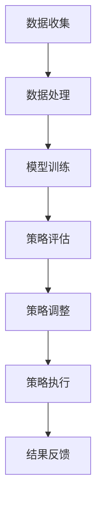

                 

### 1.1.2 债券投资组合免疫策略的核心原理

债券投资组合免疫策略的核心原理是通过构建一个多元化的债券投资组合，使其能够在不同市场环境下保持稳定的表现。具体来说，免疫策略主要包括以下三个方面：

1. **久期管理**：久期是指债券价格对利率变动的敏感度。通过调整债券投资组合的久期，投资者可以减少利率波动带来的影响。例如，当预期利率上升时，投资者可以降低组合的久期，以减少债券价格下跌的风险。

   $$\text{久期} = \frac{1+\text{利率}}{\text{当前收益率}}$$

2. **债券多样化**：通过投资不同到期日、不同信用等级和不同行业的债券，投资者可以分散风险。多样化债券投资组合可以降低单一债券风险对整个投资组合的影响。

3. **再投资风险管理**：债券到期后，投资者需要将回笼资金重新投资。由于市场利率的变化，再投资可能无法获得原投资时的收益率。通过合理的债券组合设计和再投资策略，可以最大限度地降低再投资风险。

### 1.1.3 债券投资组合免疫策略的应用场景

债券投资组合免疫策略主要应用于以下几种场景：

1. **固定收益投资**：对于追求稳定收益的投资者，免疫策略可以帮助他们在不同市场环境下保持投资组合的稳定性和收益。

2. **风险规避**：投资者可以通过免疫策略来规避利率风险、信用风险和市场风险。

3. **资产配置**：在投资者的整体资产配置中，债券投资组合免疫策略可以作为一种风险分散的工具，与股票、房地产等其他资产进行搭配，以实现资产多样化和风险控制。

### 1.1.4 概念结构与核心要素组成

债券投资组合免疫策略由以下核心要素组成：

- **债券种类**：不同到期日、不同信用等级和不同行业的债券。
- **久期**：衡量债券价格对利率变动的敏感度。
- **再投资策略**：债券到期后的再投资决策。
- **风险管理**：通过多样化的债券投资来分散风险。

### 1.1.5 边界与外延

债券投资组合免疫策略的边界在于市场环境的变化和投资者风险偏好。在实际应用中，投资者需要根据市场环境和个人风险承受能力，动态调整投资策略。

### 1.1.6 概念属性特征对比表格

| 概念       | 特征                             |
|------------|----------------------------------|
| 久期       | 衡量债券价格对利率变动的敏感度。 |
| 债券多样化 | 分散单一债券风险。               |
| 再投资策略 | 债券到期后的再投资决策。         |
| 风险管理   | 通过多样化债券投资来分散风险。   |

### 1.1.7 ER实体关系图架构

```mermaid
erDiagram
  bond_pool ||--o{ Investor : holds }
  bond ||--o{ bond_pool : contains }
  bond --> Rate : affects
  bond --> Credit : rated
  bond --> Market : traded
```

在这个ER图中，`Investor` 持有 `bond_pool`，而 `bond_pool` 包含多个 `bond`。每个 `bond` 都受 `Rate`、`Credit` 和 `Market` 的影响。

### 1.1.8 动态优化算法原理

动态优化算法是债券投资组合免疫策略的重要组成部分。其原理是利用机器学习和数据分析技术，根据市场环境变化实时调整债券投资组合，以实现最优收益和最低风险。

#### 动态优化算法流程图



1. **数据收集**：收集市场数据，包括债券价格、利率、信用评级等。
2. **数据处理**：清洗和预处理数据，为模型训练做准备。
3. **模型训练**：使用机器学习算法训练模型，以预测债券市场的变化。
4. **策略评估**：评估当前投资策略的有效性。
5. **策略调整**：根据模型预测和市场变化，调整债券投资组合。
6. **策略执行**：执行调整后的投资策略。
7. **结果反馈**：记录和评估策略执行的结果，为下一步调整提供依据。

### 1.1.9 数学模型与公式

动态优化算法的数学模型主要包括以下公式：

$$
\text{收益最大化} = \max \sum_{i=1}^{n} r_i \cdot w_i
$$

$$
\text{风险最小化} = \min \sum_{i=1}^{n} \sigma_i^2 \cdot w_i
$$

其中，$r_i$ 是第 $i$ 只债券的预期收益率，$w_i$ 是第 $i$ 只债券的投资权重，$\sigma_i$ 是第 $i$ 只债券的风险。

### 1.1.10 举例说明

假设有一个债券投资组合，包含3只债券A、B、C，投资权重分别为40%、30%、30%。根据市场数据，预计债券A的收益率为5%，债券B为4%，债券C为6%。同时，债券A的风险为10%，债券B为8%，债券C为12%。

使用动态优化算法，我们可以计算出最优的投资策略：

$$
\text{最优权重} = \text{模型预测结果}
$$

根据模型预测，债券C的收益最高，风险适中，因此将其权重调整为35%，债券A和B的权重分别调整为25%。

这样，通过动态优化，我们可以在控制风险的同时，实现投资组合的最大化收益。

### 1.1.11 结论

债券投资组合免疫策略是一种有效的风险控制方法，通过动态优化算法，投资者可以更好地应对市场变化，实现投资组合的稳定性和收益性。在接下来的章节中，我们将进一步探讨免疫策略的数学模型、系统架构和应用案例。让我们继续深入探讨这一有趣且实用的金融技术。

