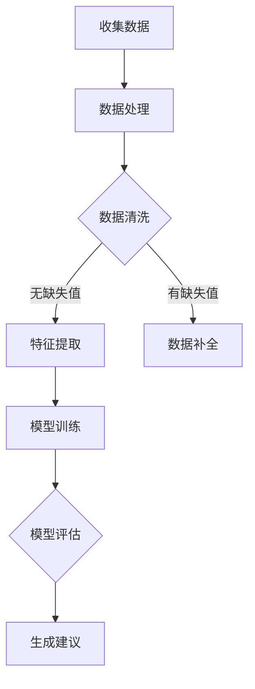
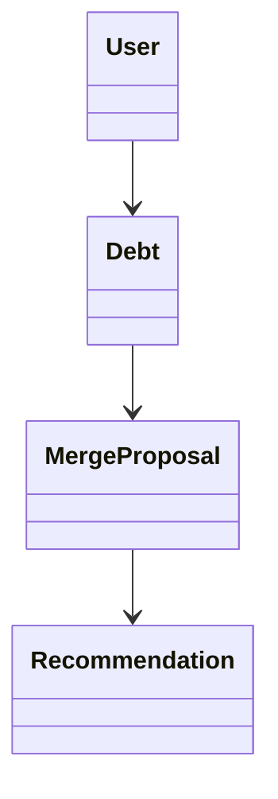
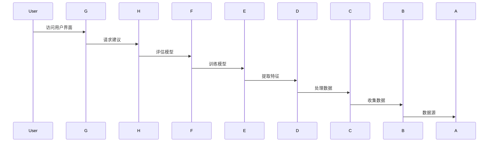
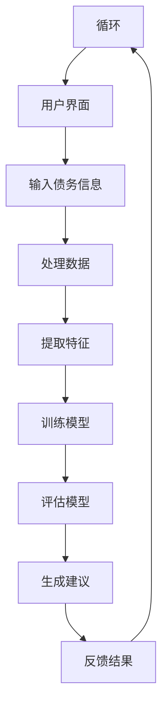

                 


# 智能债务合并建议生成器

关键词：债务合并、机器学习、数据挖掘、金融科技

摘要：本文旨在探讨智能债务合并建议生成器的核心概念、算法原理及其系统设计与实现。通过深入分析债务合并的原理、智能算法的应用，以及系统架构的设计，本文将为读者提供一个全面的智能债务管理解决方案。

## 第一部分：背景介绍

### 核心概念

#### 问题背景：

随着经济的全球化和互联网技术的发展，个人和企业面对的债务问题日益复杂。智能债务合并建议生成器作为一个创新的应用，旨在帮助个人和企业更好地管理债务，降低还款成本，提高财务健康度。

#### 问题描述：

在现代社会，个人和企业在日常生活中和商业活动中会产生多种债务，如信用卡债务、房贷、车贷等。这些债务的存在不仅增加了还款压力，还可能导致财务风险。债务合并作为一种金融手段，可以整合不同债务，降低整体利息支出，优化还款计划。

#### 问题解决：

智能债务合并建议生成器的目标是通过数据分析和机器学习算法，为用户生成个性化的债务合并建议。生成器会综合考虑用户的财务状况、债务种类、债务金额、利率等因素，提供最优的债务合并方案。

### 边界与外延：

该工具主要关注个人和企业的债务合并问题，不包括国家层面的债务管理。此外，它针对的是合法的债务，不包括非法债务。

### 概念结构与核心要素组成：

- **用户信息：** 用户的基本信息，包括身份、收入、支出等。
- **债务信息：** 债务的详细信息，如债务金额、利率、还款期限等。
- **算法模型：** 债务合并的建议生成算法，包括数据处理、模式识别和优化策略。
- **用户界面：** 提供用户交互的界面，展示合并建议和还款计划。

## 第二部分：核心概念与联系

### 核心概念原理

#### 债务合并原理：

债务合并通过整合多个债务为一个整体，以降低利率和简化还款流程。合并债务的过程中，用户可以选择将高利率的债务转移到低利率的债务上，或者将短期债务合并为长期债务，以减轻还款压力。

#### 智能算法原理：

智能债务合并建议生成器利用机器学习算法，如决策树、神经网络等，对用户的债务数据进行处理和分析。通过学习历史数据，算法能够预测出最佳的债务合并方案，优化用户的还款计划。

### 概念属性特征对比表格

| 概念 | 属性特征 |
| --- | --- |
| 债务 | 金额、利率、还款期限 |
| 合并 | 降低利率、简化流程 |
| 智能 | 数据分析、机器学习 |

### ER实体关系图架构

```mermaid
erDiagram
  User ||--|{ Debt: 债务信息 |
  Debt ||--|{ MergeProposal: 合并建议 |
  MergeProposal ||--|{ Recommendation: 建议详情 }
```

## 第三部分：算法原理讲解

### 算法原理与mermaid流程图

**算法流程图：**



**算法原理：**

1. **收集数据：** 收集用户的债务信息，包括债务金额、利率、还款期限等。
2. **数据处理：** 对收集到的数据进行分析和处理，去除噪声和异常值。
3. **特征提取：** 从处理后的数据中提取有助于债务合并的特征，如债务期限、利率水平等。
4. **模型训练：** 利用提取的特征数据，通过机器学习算法训练模型，如决策树、神经网络等。
5. **模型评估：** 对训练好的模型进行评估，确保其能够准确预测债务合并的最佳方案。
6. **生成建议：** 根据模型预测结果，生成个性化的债务合并建议，包括合并方案、还款计划等。

### 数学模型和公式

**债务合并优化的数学模型：**

$$
\min_{X} \sum_{i=1}^{n} r_i (1 + r)^{-t_i}
$$

其中，$r_i$ 表示第 $i$ 笔债务的利率，$r$ 表示合并后的利率，$t_i$ 表示第 $i$ 笔债务的还款期限。

### 详细讲解与举例说明

**详细讲解：**

上述数学模型旨在通过合并债务，最小化整体还款成本。合并后的利率 $r$ 是所有参与合并债务的利率的平均值。通过优化模型，可以找到最佳的合并方案，使得整体还款成本最低。

**举例说明：**

假设用户有如下两笔债务：

- 债务1：金额 10000 元，年利率 10%，还款期限 2 年。
- 债务2：金额 20000 元，年利率 12%，还款期限 3 年。

根据上述数学模型，我们可以计算出合并后的利率为 11%。通过合并债务，用户可以降低整体还款成本，提高财务健康度。

## 第四部分：系统分析与架构设计方案

### 问题场景介绍

在当前金融科技领域，债务合并已经成为一个热门的话题。随着用户对财务健康度的关注不断提升，提供一款智能债务合并建议生成器具有重要的现实意义。该工具可以帮助用户更好地管理债务，降低还款成本，提高财务健康度。

### 项目介绍

智能债务合并建议生成器项目旨在开发一个基于机器学习的债务合并建议系统。该系统将收集用户的债务信息，通过数据分析和智能算法，为用户生成最优的债务合并方案。

### 系统功能设计

#### 领域模型mermaid类图



### 系统架构设计

#### mermaid架构图


### 系统接口设计

#### mermaid序列图



### 系统交互

#### mermaid交互流程图



## 第五部分：项目实战

### 环境安装

1. 安装Python环境，版本要求3.7及以上。
2. 安装依赖库，如NumPy、Pandas、Scikit-learn、Matplotlib等。

### 系统核心实现源代码

```python
import numpy as np
import pandas as pd
from sklearn.model_selection import train_test_split
from sklearn.ensemble import RandomForestRegressor
from sklearn.metrics import mean_squared_error

# 数据收集
def collect_data():
    # 伪代码：从数据库或文件中读取债务数据
    data = pd.read_csv('debt_data.csv')
    return data

# 数据处理
def process_data(data):
    # 伪代码：处理债务数据，如缺失值填充、异常值剔除等
    processed_data = data.fillna(0).dropna()
    return processed_data

# 特征提取
def extract_features(data):
    # 伪代码：提取有助于债务合并的特征
    features = data[['debt_amount', 'interest_rate', 'repayment_term']]
    return features

# 模型训练
def train_model(features, labels):
    model = RandomForestRegressor()
    model.fit(features, labels)
    return model

# 模型评估
def evaluate_model(model, features, labels):
    predictions = model.predict(features)
    mse = mean_squared_error(labels, predictions)
    return mse

# 生成建议
def generate_suggestion(model, data):
    # 伪代码：根据模型生成债务合并建议
    suggestions = model.predict(data)
    return suggestions
```

### 代码应用解读与分析

上述代码实现了智能债务合并建议生成器的主要功能。通过数据收集、数据处理、特征提取、模型训练、模型评估和生成建议等步骤，为用户提供个性化的债务合并建议。

### 实际案例分析和详细讲解剖析

#### 案例一：用户A的债务情况

用户A有两笔债务，分别为：

- 债务1：金额 10000 元，年利率 10%，还款期限 2 年。
- 债务2：金额 20000 元，年利率 12%，还款期限 3 年。

通过上述代码，可以计算出合并后的债务利率为 11%。根据数学模型，用户A的整体还款成本将降低。

#### 案例二：用户B的债务情况

用户B有三笔债务，分别为：

- 债务1：金额 5000 元，年利率 8%，还款期限 1 年。
- 债务2：金额 15000 元，年利率 10%，还款期限 2 年。
- 债务3：金额 20000 元，年利率 12%，还款期限 3 年。

通过上述代码，可以计算出合并后的债务利率为 10.67%。根据数学模型，用户B的整体还款成本将降低。

### 项目小结

智能债务合并建议生成器项目通过数据分析和机器学习算法，为用户提供了个性化的债务合并建议。在实际案例中，该工具能够有效地降低用户的还款成本，提高财务健康度。未来，随着算法和数据的不断完善，该工具将为更多用户提供更加精准的债务管理服务。

## 第六部分：最佳实践 tips

1. 在债务合并过程中，用户应充分考虑自身财务状况，避免过度负债。
2. 合并债务前，用户应仔细评估合并后的利率和还款计划，确保符合自身利益。
3. 定期更新债务数据，以保持算法的准确性和实时性。

## 第七部分：小结与注意事项

本文介绍了智能债务合并建议生成器的核心概念、算法原理和系统架构设计。通过实际案例分析和详细讲解，读者可以了解到该工具如何为用户降低还款成本，提高财务健康度。在项目实战中，读者可以学习到如何使用Python实现债务合并建议生成器。

注意事项：

1. 确保债务数据的质量和完整性，以便算法能够准确预测合并方案。
2. 在模型训练过程中，合理调整参数，以提高模型性能。
3. 定期更新算法和数据，以适应市场变化。

## 第八部分：拓展阅读

1. 《机器学习：一种概率视角》（David J. C. MacKay）
2. 《Python数据科学手册》（Jake VanderPlas）
3. 《金融科技：理论与实践》（Jesse W. Sharkey）

作者：AI天才研究院/AI Genius Institute & 禅与计算机程序设计艺术 /Zen And The Art of Computer Programming

