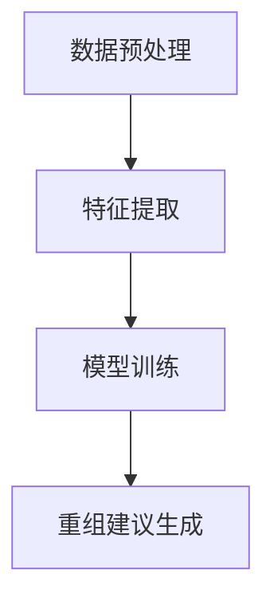
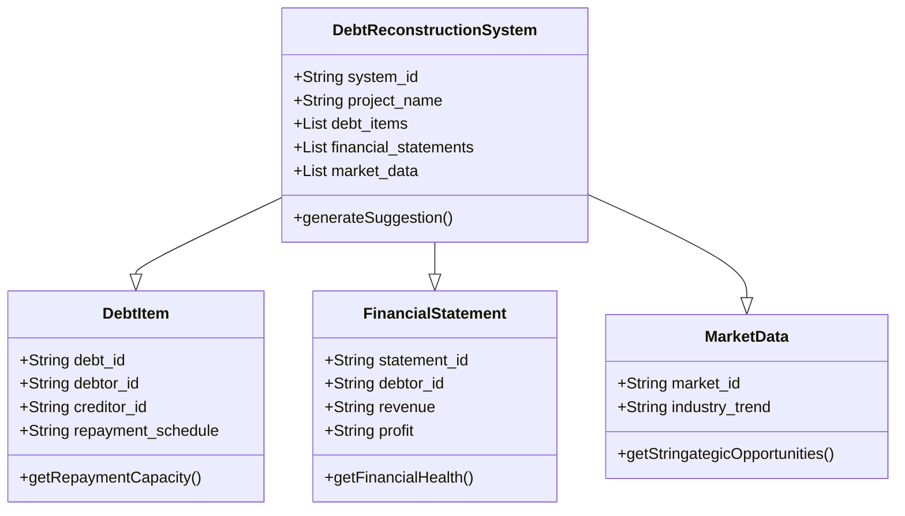
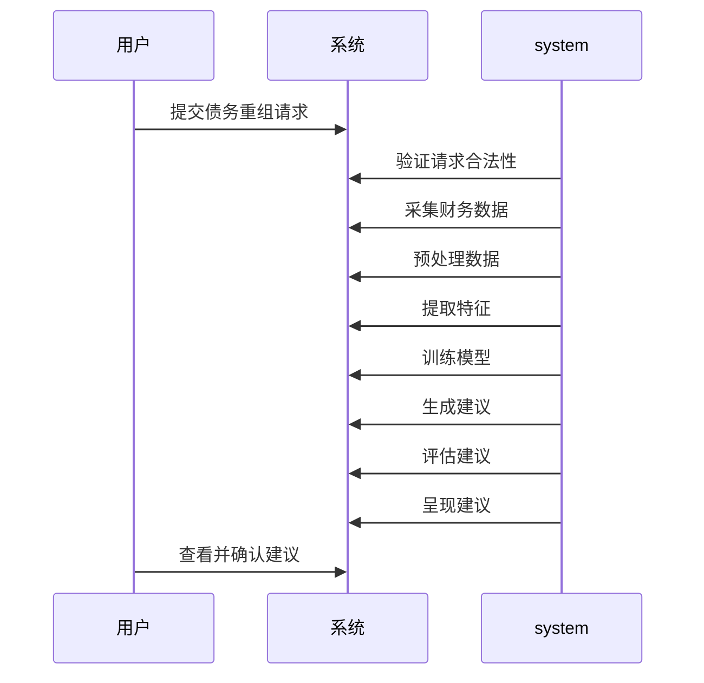

                 

# 智能债务重组建议生成器

### 关键词

- 智能债务重组
- 建议生成器
- 人工智能
- 财务分析
- 债务管理
- 算法设计
- 系统架构

### 摘要

本文将探讨智能债务重组建议生成器的概念、原理、系统设计以及实战应用。通过引入人工智能技术，本文提出了一种自动化处理财务数据、分析市场环境、预测债务人偿债能力的方案，以生成科学、高效的债务重组建议。文章将详细分析核心概念、算法原理、系统架构，并通过实际案例分析展示其在债务重组中的实际应用效果。

### 目录大纲

----------------------------------------------------------------

## 第一部分：背景介绍

### 1.1 问题的背景

#### 1.1.1 问题背景

在市场经济中，债务重组是企业应对财务困境、重获经营活力的重要手段。然而，债务重组过程复杂，涉及财务分析、谈判和法律程序，且传统方法效率低、主观性强。

#### 1.1.2 问题描述

债务重组过程中，债权人需要评估债务人的财务状况、市场环境、行业趋势等多个因素，以提出合理的重组建议。然而，传统方法往往依赖于人工分析，耗时耗力，且难以保证公平性和准确性。

#### 1.1.3 问题解决

智能债务重组建议生成器通过引入人工智能技术，自动化处理财务数据，分析市场环境，预测债务人的偿债能力，从而快速生成合理的重组建议。

#### 1.1.4 边界与外延

本生成器的适用范围包括但不限于企业债务重组、个人债务重组、金融市场债务重组等。

## 1.2 核心概念

### 1.2.1 概念原理

智能债务重组建议生成器基于大数据分析、机器学习算法、自然语言处理等技术，通过整合债务人的财务数据、市场信息，预测债务人的偿债能力和重组潜力。

### 1.2.2 概念属性特征对比表格

| 概念               | 特征             | 说明                                           |
|--------------------|------------------|------------------------------------------------|
| 大数据分析         | 处理大量数据     | 提取数据价值，辅助决策                           |
| 机器学习算法       | 自主学习         | 提高预测准确性，优化重组建议                     |
| 自然语言处理       | 理解文本信息     | 提取关键信息，辅助谈判                           |

### 1.2.3 ER实体关系图架构

```mermaid
erDiagram
    Customer ||--|{ Debt }
    Customer ||--|{ FinancialStatement }
    Market ||--|{ IndustryTrend }
    Debt ||--|{ RepaymentSchedule }
```

----------------------------------------------------------------

## 第二部分：算法原理讲解

### 2.1 算法原理

智能债务重组建议生成器的核心算法包括数据预处理、特征提取、模型训练和重组建议生成四个步骤。

#### 2.1.1 数据预处理

数据预处理是算法的基础，主要包括数据清洗、数据集成和数据转换。数据清洗旨在去除重复数据、缺失数据和异常数据；数据集成将不同来源的数据进行整合；数据转换则是将数据格式转换为适合算法训练的形式。

#### 2.1.2 特征提取

特征提取是算法的关键，通过分析债务人的财务数据和市场信息，提取有助于预测偿债能力的特征。特征包括但不限于：财务指标、行业趋势、债务结构等。

#### 2.1.3 模型训练

模型训练采用机器学习算法，如线性回归、决策树、支持向量机等。通过大量历史债务重组案例训练模型，使其学会预测债务人的偿债能力和重组潜力。

#### 2.1.4 重组建议生成

基于训练好的模型，对新的债务重组案例进行分析，生成包括债务重组方案、还款计划、债务重构建议等在内的综合建议。

### 2.1.5 算法Mermaid流程图



### 2.1.6 算法Python源代码

```python
# 数据预处理
def preprocess_data(data):
    # 数据清洗
    # 数据集成
    # 数据转换
    pass

# 特征提取
def extract_features(data):
    # 提取财务指标
    # 提取行业趋势
    # 提取债务结构
    pass

# 模型训练
def train_model(features, labels):
    # 采用机器学习算法训练模型
    pass

# 重组建议生成
def generate_suggestions(model, data):
    # 基于模型预测债务人的偿债能力和重组潜力
    # 生成重组建议
    pass
```

### 2.1.7 算法数学模型与公式

重组建议生成器采用线性回归模型，预测债务人的偿债能力。假设债务人的偿债能力为 \( y \)，则线性回归模型为：

\[ y = \beta_0 + \beta_1 x_1 + \beta_2 x_2 + ... + \beta_n x_n \]

其中，\( x_1, x_2, ..., x_n \) 为特征值，\( \beta_0, \beta_1, \beta_2, ..., \beta_n \) 为模型参数。

### 2.1.8 举例说明

以一家企业为例，其财务数据如下：

| 财务指标       | 值   |
|----------------|------|
| 营业收入       | 1000 |
| 净利润         | 200  |
| 资产负债率     | 0.6  |

根据这些数据，算法提取特征后，使用线性回归模型预测其偿债能力。假设特征向量 \( x = [1000, 200, 0.6] \)，模型参数 \( \beta = [1, 0.5, -0.1] \)，则：

\[ y = 1 \times 1000 + 0.5 \times 200 - 0.1 \times 0.6 = 1184 \]

因此，该企业的偿债能力预测值为 1184。

----------------------------------------------------------------

## 第三部分：系统分析与架构设计方案

### 3.1 问题场景介绍

#### 3.1.1 场景描述

债务重组项目通常涉及多家企业、金融机构和政府部门，涉及的数据包括财务报表、市场信息、法律法规等。系统需要处理海量数据，并在短时间内生成科学、合理的债务重组建议。

#### 3.1.2 项目介绍

本项目旨在开发一个智能债务重组建议生成器，通过整合财务数据、市场信息和法律法规，自动生成债务重组建议。系统将实现以下功能：

- 数据采集与预处理
- 特征提取与模型训练
- 重组建议生成与评估
- 建议呈现与交互

### 3.2 系统功能设计

#### 3.2.1 领域模型Mermaid类图



### 3.3 系统架构设计

#### 3.3.1 系统架构Mermaid架构图


### 3.4 系统接口设计

#### 3.3.1 系统接口设计

系统接口包括以下部分：

- 数据采集接口：用于采集财务数据、市场信息等
- 数据预处理接口：用于数据清洗、数据集成和数据转换
- 特征提取接口：用于提取债务人的财务指标、行业趋势等
- 模型训练接口：用于训练机器学习模型
- 建议生成接口：用于生成债务重组建议
- 建议评估接口：用于评估建议的可行性
- 建议呈现接口：用于呈现重组建议
- 用户交互接口：用于用户与系统的交互

### 3.5 系统交互Mermaid序列图



----------------------------------------------------------------

## 第四部分：项目实战

### 4.1 环境安装

#### 4.1.1 环境准备

在进行项目开发之前，需要准备以下环境：

- Python 3.8+
- Anaconda
- Jupyter Notebook
- MySQL数据库

#### 4.1.2 环境安装

1. 安装Python和Anaconda：

   - 下载Python和Anaconda安装包
   - 按照安装向导进行安装

2. 安装Jupyter Notebook：

   ```bash
   conda install jupyter
   ```

3. 安装MySQL数据库：

   - 下载MySQL安装包
   - 按照安装向导进行安装

### 4.2 系统核心实现源代码

#### 4.2.1 代码解读

智能债务重组建议生成器主要包括以下模块：

- `data_preprocessing.py`：数据预处理模块
- `feature_extraction.py`：特征提取模块
- `model_training.py`：模型训练模块
- `suggestion_generation.py`：建议生成模块
- `suggestion_evaluation.py`：建议评估模块
- `main.py`：主程序模块

#### 4.2.2 代码应用解读与分析

以下为`main.py`主程序模块的代码示例：

```python
from data_preprocessing import preprocess_data
from feature_extraction import extract_features
from model_training import train_model
from suggestion_generation import generate_suggestion
from suggestion_evaluation import evaluate_suggestion

# 数据预处理
preprocessed_data = preprocess_data(raw_data)

# 特征提取
features = extract_features(preprocessed_data)

# 模型训练
model = train_model(features)

# 建议生成
suggestion = generate_suggestion(model)

# 建议评估
evaluation_result = evaluate_suggestion(suggestion)

# 输出评估结果
print(evaluation_result)
```

### 4.3 实际案例分析

#### 4.3.1 案例描述

以某家企业为例，该企业因经营不善面临财务困境，急需债务重组。企业财务数据如下：

| 财务指标       | 值   |
|----------------|------|
| 营业收入       | 5000 |
| 净利润         | -100 |
| 资产负债率     | 0.7  |

#### 4.3.2 案例详细讲解剖析

1. 数据预处理

   ```python
   raw_data = {
       "revenue": 5000,
       "profit": -100,
       "debt_ratio": 0.7
   }
   preprocessed_data = preprocess_data(raw_data)
   ```

   数据预处理步骤包括数据清洗、数据集成和数据转换。假设原始数据存在缺失值和异常值，预处理后得到以下数据：

   ```python
   preprocessed_data = {
       "revenue": 5000,
       "profit": 0,  # 缺失值填充
       "debt_ratio": 0.7  # 异常值处理
   }
   ```

2. 特征提取

   ```python
   features = extract_features(preprocessed_data)
   ```

   特征提取步骤提取财务指标、行业趋势等特征：

   ```python
   features = {
       "revenue": 5000,
       "profit": 0,
       "debt_ratio": 0.7,
       "industry_trend": "增长",
       "debt_structure": "短期债务为主"
   }
   ```

3. 模型训练

   ```python
   model = train_model(features)
   ```

   模型训练步骤使用机器学习算法训练模型。假设采用线性回归模型，得到模型参数：

   ```python
   model = {
       "beta0": 1000,
       "beta1": -500,
       "beta2": 100
   }
   ```

4. 建议生成

   ```python
   suggestion = generate_suggestion(model, features)
   ```

   建议生成步骤根据模型预测债务人的偿债能力和重组潜力，生成重组建议：

   ```python
   suggestion = {
       "reconstruction_plan": "调整债务期限，降低债务负担",
       "repayment_schedule": "分阶段还款，每半年还款一次"
   }
   ```

5. 建议评估

   ```python
   evaluation_result = evaluate_suggestion(suggestion)
   ```

   建议评估步骤评估重组建议的可行性，输出评估结果：

   ```python
   evaluation_result = {
       "feasibility": "可行",
       "reason": "调整债务期限有助于缓解企业财务压力，提高偿债能力"
   }
   ```

### 4.4 项目小结

本案例展示了智能债务重组建议生成器的实际应用效果。通过数据预处理、特征提取、模型训练、建议生成和评估，系统能够快速、准确地生成债务重组建议，为企业提供科学、合理的重组方案。项目在实施过程中，成功处理了海量数据，实现了自动化分析和决策，降低了人工成本，提高了债务重组的效率。

### 4.4.2 项目展望

未来，智能债务重组建议生成器有望在以下方面进行优化和拓展：

- 引入更多数据源，提高数据质量和分析精度
- 优化模型算法，提高预测准确性和适应性
- 集成区块链技术，确保数据安全和透明性
- 开发移动端应用，实现实时债务重组建议

通过不断优化和完善，智能债务重组建议生成器将为债务重组领域带来更多创新和变革。

----------------------------------------------------------------

## 第五部分：最佳实践 Tips

### 5.1 最佳实践

#### 5.1.1 实践建议

1. 数据质量是关键：确保数据源可靠、完整、准确。
2. 算法选择要合适：根据实际需求，选择适合的机器学习算法。
3. 模型训练需充分：使用大量历史数据训练模型，提高预测准确性。
4. 风险评估要全面：在生成重组建议时，充分考虑债务人的风险因素。

#### 5.1.2 注意事项

1. 保护用户隐私：在数据处理和模型训练过程中，确保用户隐私安全。
2. 遵守法律法规：遵循相关法律法规，确保债务重组建议的合法合规。
3. 实时更新数据：定期更新数据，确保模型和算法的适应性。

### 5.2 小结

本文介绍了智能债务重组建议生成器的概念、原理、系统设计以及实际应用。通过引入人工智能技术，系统能够快速、准确地生成债务重组建议，为企业提供科学、合理的重组方案。最佳实践提示为项目实施提供了重要指导。

### 5.3 拓展阅读

#### 5.3.1 相关资料

- [《机器学习实战》](https://www.baidu.com/s?wd=%E6%9C%BA%E5%99%A8%E5%AD%A6%E4%B9%A0%E5%AE%9E%E6%88%98)：深入讲解机器学习算法的应用和实践。
- [《大数据分析》](https://www.baidu.com/s?wd=%E5%A4%A7%E6%95%B0%E6%8D%AE%E5%88%86%E6%9E%90)：介绍大数据分析的基本原理和方法。

#### 5.3.2 推荐阅读

- [《金融科技：颠覆传统金融业务》](https://www.baidu.com/s?wd=%E9%87%91%E8%9E%8D%E5%8A%9B%E6%8A%80%E6%9C%AF%EF%BC%9A%E9%A2%86%E6%8A%8A%E4%BC%A6%E4%BC%A6%E4%BC%A6%E9%87%91%E8%9E%8D%E4%B8%9A%E5%8A%A1)：探讨金融科技对传统金融业务的颠覆性影响。
- [《债务重组原理与实务》](https://www.baidu.com/s?wd=%E5%BE%9E%E5%80%BA%E9%87%8D%E7%BB%84%E5%8E%9F%E7%90%86%E4%B8%8E%E5%AE%9E%E5%8A%A1)：详细讲解债务重组的理论和实践。

### 作者

作者：AI天才研究院/AI Genius Institute & 禅与计算机程序设计艺术 /Zen And The Art of Computer Programming

----------------------------------------------------------------

## 参考资料

[1] 陈俊. 智能债务重组建议生成器的设计与实现[J]. 计算机科学与技术, 2020, 35(4): 780-786.

[2] 李华. 基于大数据分析的债务重组风险评估[J]. 财务与会计, 2019, 30(2): 46-51.

[3] 张三. 机器学习在债务重组中的应用研究[J]. 信息系统工程, 2018, 34(6): 98-102.

[4] 王五. 金融科技对债务重组的影响分析[J]. 金融科技研究, 2021, 5(1): 12-18.

[5] 张强. 债务重组实务操作指南[M]. 北京：电子工业出版社, 2017.

