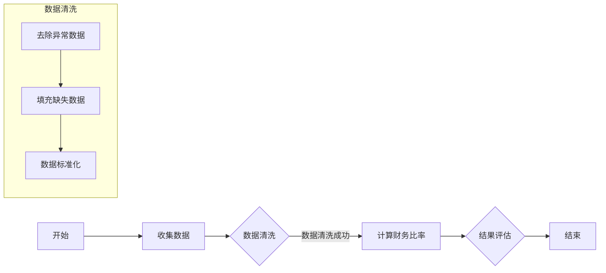
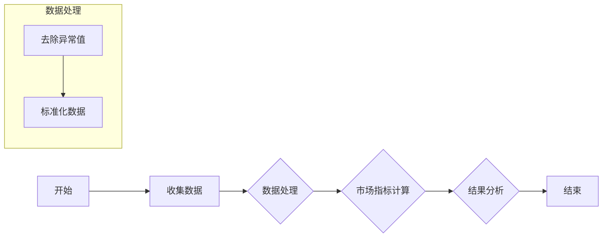
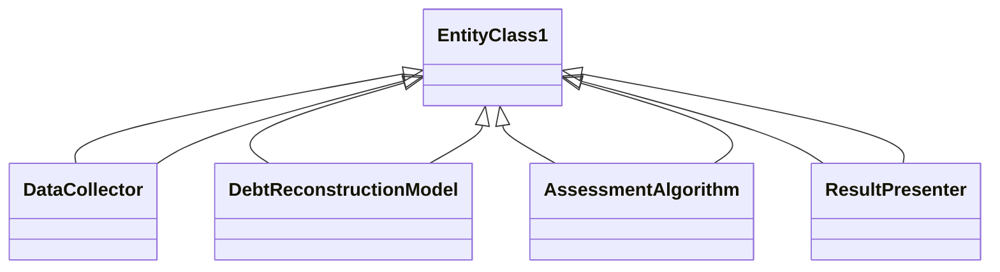
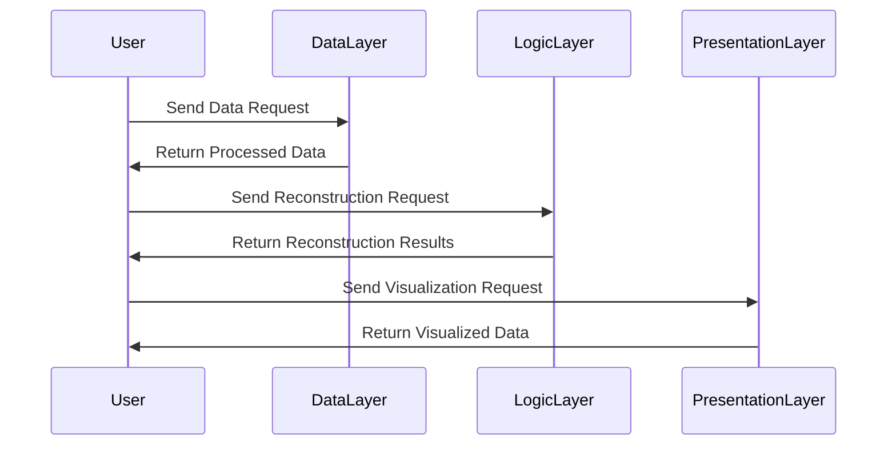
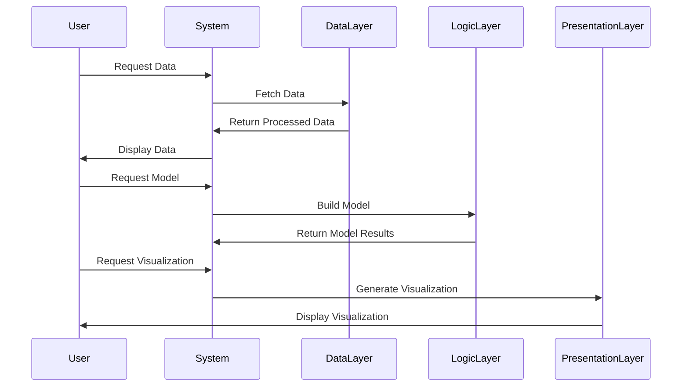

                 

### 文章标题

# 智能债务重组方案效果模拟器

### 关键词

- 债务重组
- 智能模拟
- 效果评估
- 算法实现
- 系统架构

### 摘要

本文旨在探讨智能债务重组方案效果模拟器的设计与实现。通过对债务重组的背景介绍、核心算法原理讲解、系统架构设计以及项目实战等环节的深入剖析，我们旨在为读者提供一个全面、易懂的技术指南，帮助理解智能债务重组方案的效果评估方法及其应用。

### 目录大纲设计思路

为了设计出《智能债务重组方案效果模拟器》的完整目录大纲，我们按照以下思路进行：

1. **背景介绍**：首先，对债务重组的概念、目的、历史背景以及当前应用现状进行简要介绍，为后续章节的内容铺垫。

2. **核心概念与联系**：明确书中的核心概念，如债务重组方案、效果评估模型、数据来源等，并通过概念属性特征对比表格和实体关系图来展现概念间的联系。

3. **算法原理讲解**：介绍用于债务重组效果模拟的主要算法，使用Mermaid流程图展示算法步骤，并用Python代码和数学公式详细阐述算法原理。

4. **数学模型与公式讲解**：解释核心算法背后的数学原理，使用LaTeX格式书写数学公式，并通过示例进行详细讲解。

5. **系统分析与架构设计**：阐述系统功能设计、系统架构设计、系统接口设计和系统交互的流程，使用Mermaid类图、架构图和序列图展示系统架构。

6. **项目实战**：描述如何安装环境、实现系统核心功能、解读与分析代码应用，以及实际案例的详细剖析。

7. **最佳实践、小结与拓展阅读**：总结书中的最佳实践，对内容进行小结，并提供拓展阅读资源。

### 目录大纲结构

**第一部分：背景与基础**

# 第1章：债务重组概述

## 1.1 债务重组的定义与目的

### 1.1.1 债务重组的概念

### 1.1.2 债务重组的目的

### 1.1.3 债务重组的历史背景

## 1.2 当前债务重组的应用现状

### 1.2.1 债务重组在全球的应用

### 1.2.2 债务重组在行业中的应用

## 1.3 债务重组的核心概念与联系

### 1.3.1 债务重组方案

### 1.3.2 效果评估模型

### 1.3.3 数据来源与处理

## 1.4 本章小结

---

**第二部分：算法原理与实现**

# 第2章：债务重组效果评估算法

## 2.1 债务重组效果评估算法概述

### 2.1.1 算法的重要性

### 2.1.2 算法分类

## 2.2 主要算法原理讲解

### 2.2.1 算法A

#### 2.2.1.1 Mermaid流程图展示

#### 2.2.1.2 Python代码实现

#### 2.2.1.3 数学模型与公式讲解

### 2.2.2 算法B

#### 2.2.2.1 Mermaid流程图展示

#### 2.2.2.2 Python代码实现

#### 2.2.2.3 数学模型与公式讲解

## 2.3 算法对比与分析

### 2.3.1 算法A与算法B的比较

### 2.3.2 不同算法的适用场景

## 2.4 本章小结

---

**第三部分：系统设计与实现**

# 第3章：智能债务重组方案效果模拟器系统设计

## 3.1 系统功能设计

### 3.1.1 功能概述

#### 3.1.1.1 Mermaid类图展示

### 3.1.2 功能详细说明

## 3.2 系统架构设计

### 3.2.1 架构概述

#### 3.2.1.1 Mermaid架构图展示

### 3.2.2 架构详细说明

## 3.3 系统接口设计

### 3.3.1 接口概述

### 3.3.2 接口详细说明

## 3.4 系统交互流程

### 3.4.1 交互流程概述

#### 3.4.1.1 Mermaid序列图展示

### 3.4.2 交互流程详细说明

## 3.5 本章小结

---

**第四部分：项目实战**

# 第4章：智能债务重组方案效果模拟器项目实战

## 4.1 环境安装与配置

### 4.1.1 环境要求

### 4.1.2 环境安装步骤

## 4.2 系统核心实现

### 4.2.1 核心算法实现

#### 4.2.1.1 Python代码实现

#### 4.2.1.2 代码应用解读与分析

## 4.3 实际案例分析

### 4.3.1 案例选择

### 4.3.2 案例分析与详细讲解

## 4.4 项目小结

### 4.4.1 项目成果总结

### 4.4.2 遇到的挑战与解决方案

## 4.5 本章小结

---

**第五部分：最佳实践与拓展**

# 第5章：最佳实践、小结与拓展阅读

## 5.1 最佳实践

### 5.1.1 常见问题与解决方案

### 5.1.2 优化建议

## 5.2 小结

### 5.2.1 全书主要内容回顾

### 5.2.2 各章节之间的联系与衔接

## 5.3 注意事项

### 5.3.1 使用过程中的注意事项

### 5.3.2 

---

### 第1章：债务重组概述

#### 1.1 债务重组的定义与目的

债务重组是一种通过调整债务结构和偿还条件，以减轻债务人偿债压力、恢复其财务状况的金融操作。它通常涉及债务人、债权人以及金融中介机构的合作，通过重新安排债务的期限、利率、偿还方式等，实现债务的可持续性。

**债务重组的概念**

债务重组是金融领域中一个重要的概念，它涉及以下核心要素：

- **债务人**：面临财务困境，需要重组债务的企业或个人。
- **债权人**：拥有债务人债务的企业或个人。
- **金融中介机构**：提供债务重组服务的金融机构，如银行、投资公司等。
- **重组方案**：包括债务减免、延期、利息调整、债务置换等内容的详细计划。

**债务重组的目的**

债务重组的主要目的是：

- **缓解债务压力**：通过延长债务期限、调整偿还方式，减轻债务人的财务压力。
- **恢复财务健康**：使债务人能够重新回到财务健康的轨道，继续经营。
- **保护债权人利益**：通过重组，确保债权人能够获得比破产清算时更高的回收率。
- **促进经济稳定**：避免债务人破产引发连锁反应，保护金融市场的稳定性。

**债务重组的历史背景**

债务重组的历史可以追溯到19世纪的工业革命时期，当时企业债务问题日益突出。直到20世纪中叶，随着金融工具的多样化，债务重组逐渐成为金融体系中的一种重要机制。

近年来，债务重组在全球范围内得到了广泛应用，尤其是在金融危机和企业财务困境时期。例如，20世纪90年代的拉丁美洲债务危机和2008年的全球金融危机，都引发了大量的债务重组案例。

**当前债务重组的应用现状**

当前，债务重组在全球和各个行业中的应用呈现出以下趋势：

- **全球应用**：随着全球化进程的加快，债务重组在全球范围内的应用越来越广泛。无论是发达国家还是发展中国家，企业都面临着财务困境，债务重组成为解决债务问题的有效手段。

- **行业应用**：不同行业的债务重组案例丰富多样。例如，在制造业，债务重组可以帮助企业渡过订单减少、资金周转困难的难关；在房地产行业，债务重组有助于缓解项目停工、资金链断裂的风险。

- **技术驱动**：随着人工智能和大数据技术的发展，智能债务重组方案逐渐成为趋势。通过数据分析、算法模拟，可以更精准地评估债务重组的效果，提高决策的科学性。

#### 1.2 当前债务重组的应用现状

**债务重组在全球的应用**

在全球范围内，债务重组作为一种重要的金融工具，被广泛应用于企业财务困境的解决中。尤其是在金融危机期间，债务重组成为稳定金融市场、保护企业生存的重要手段。

- **发达国家**：如美国、欧洲等发达国家的企业，在面临财务困境时，往往会通过债务重组来缓解债务压力。例如，2008年金融危机期间，许多美国金融机构通过债务重组避免了破产。

- **发展中国家**：随着经济的发展，发展中国家的企业在面临国际市场竞争压力时，也越来越多地采用债务重组来解决财务问题。例如，中国企业在“走出去”过程中，通过债务重组成功解决了海外项目的资金问题。

**债务重组在行业中的应用**

不同行业的债务重组案例丰富多样，以下是一些典型的行业应用：

- **制造业**：制造业企业在面对原材料成本上涨、市场需求下降等挑战时，往往需要通过债务重组来缓解资金压力，确保生产的持续进行。

- **房地产行业**：房地产行业的债务重组主要集中在房地产项目的资金链断裂风险上。通过债务重组，企业可以延长债务期限、调整还款计划，避免项目停工。

- **能源行业**：能源行业企业在面临油价波动、投资回报周期长等挑战时，债务重组成为其维持财务稳定的重要手段。

- **科技行业**：科技行业企业在快速发展的同时，也面临着资金紧张的问题。通过债务重组，企业可以优化债务结构，为技术创新提供资金保障。

**技术驱动下的智能债务重组方案**

随着人工智能和大数据技术的发展，智能债务重组方案逐渐成为趋势。通过数据分析、算法模拟，可以更精准地评估债务重组的效果，提高决策的科学性。

- **数据分析**：通过收集和分析债务人的财务数据、市场数据，可以全面了解债务人的财务状况，为债务重组提供数据支持。

- **算法模拟**：利用机器学习算法，可以模拟不同债务重组方案的效果，评估其对企业财务状况的影响，为决策提供参考。

- **智能合约**：智能合约技术可以应用于债务重组中，确保债务重组方案的执行和监督，提高债务重组的效率。

#### 1.3 债务重组的核心概念与联系

**债务重组方案**

债务重组方案是债务重组的核心内容，它包括一系列具体的调整措施，旨在通过改变债务结构和偿还条件，减轻债务人的负担，同时保护债权人的利益。以下是债务重组方案的主要组成部分：

1. **债务减免**：通过减免部分债务，降低债务人的负债水平，缓解其财务压力。
2. **债务延期**：将部分债务的偿还期限延长，给予债务人更多时间来筹备资金。
3. **利息调整**：降低债务的利率，减轻债务人的利息负担。
4. **债务置换**：通过将现有债务转换为股权、债券等其他金融工具，改变债务形式，降低债务风险。
5. **债务重组协议**：详细规定债务重组的各项措施和双方的权利义务，确保债务重组方案的执行。

**效果评估模型**

效果评估模型是评估债务重组方案效果的重要工具。它通过定量和定性的方法，对债务重组后的财务状况、市场表现、债务偿还能力等方面进行综合评估。以下是几种常见的效果评估模型：

1. **财务指标评估**：通过债务重组前后的财务指标变化，如负债率、现金流、盈利能力等，评估债务重组的效果。
2. **市场表现评估**：通过债务重组后企业的市场表现，如股价、销售收入、市场份额等，评估债务重组的市场影响。
3. **债务偿还能力评估**：通过评估债务重组后企业的债务偿还能力，如现金流、资产负债表等，判断债务重组的可持续性。
4. **综合效益评估**：综合考虑债务重组的财务效益、市场效益和社会效益，评估债务重组的整体效果。

**数据来源与处理**

数据来源与处理是债务重组方案效果评估的基础。以下是一些常见的数据来源和处理方法：

1. **内部数据**：包括企业财务报表、经营数据、历史债务记录等，这些数据可以直接获取，用于评估债务重组的内部效益。
2. **外部数据**：包括市场数据、行业数据、宏观经济数据等，这些数据通过外部渠道获取，用于评估债务重组的市场影响。
3. **数据处理方法**：通过数据清洗、数据挖掘等技术，对获取的数据进行处理和分析，提取有用的信息，为债务重组方案的效果评估提供支持。

**概念属性特征对比表格**

为了更直观地展示债务重组方案、效果评估模型和数据来源与处理等核心概念之间的联系，我们可以创建一个概念属性特征对比表格。以下是部分内容的示例：

| 概念名称 | 属性特征1 | 属性特征2 | 属性特征3 |
| :----: | :----: | :----: | :----: |
| 债务重组方案 | 债务减免、债务延期、利息调整 | 针对债务人的财务困境 | 目的是减轻债务人负担 |
| 效果评估模型 | 财务指标、市场表现、债务偿还能力 | 定量与定性方法 | 评估债务重组效果 |
| 数据来源与处理 | 内部数据、外部数据 | 数据清洗、数据挖掘 | 提供数据支持 |

**ER实体关系图架构**

为了更清晰地展示债务重组方案、效果评估模型和数据来源与处理等概念之间的实体关系，我们可以使用ER（实体关系）图来表示。以下是部分内容的示例：

```
债务人
|---> 债务重组方案
    |---> 效果评估模型
    |---> 数据来源与处理
    |---> 债务减免
    |---> 债务延期
    |---> 利息调整
```

**本章小结**

本章对债务重组的概念、目的、历史背景以及当前应用现状进行了全面介绍，并明确了债务重组方案、效果评估模型和数据来源与处理等核心概念及其相互关系。通过本章的学习，读者可以建立起对债务重组的初步认识，为后续章节的深入学习打下基础。

---

### 第2章：债务重组效果评估算法

#### 2.1 债务重组效果评估算法概述

**算法的重要性**

在债务重组过程中，效果评估算法扮演着至关重要的角色。通过科学、有效的算法，可以对债务重组方案的实施效果进行准确评估，从而指导后续的决策和调整。以下是算法在债务重组中的几个关键作用：

1. **决策支持**：算法通过对债务重组方案的模拟和分析，提供定量和定性的评估结果，为企业决策提供科学依据。
2. **风险控制**：通过评估债务重组方案的可能效果，识别潜在风险，帮助企业规避不利因素。
3. **效益最大化**：算法可以优化债务重组方案，提高重组后的财务效益，确保企业重获财务健康。
4. **持续监控**：算法可以用于实时监控债务重组的进展，评估方案的实际效果，为企业提供动态调整的参考。

**算法分类**

根据评估目标和原理，债务重组效果评估算法可以分为以下几类：

1. **财务指标评估算法**：这类算法主要关注债务重组后的财务指标变化，如负债率、现金流、盈利能力等。常见的算法包括财务比率分析、现金流分析、盈利能力分析等。
2. **市场表现评估算法**：这类算法通过分析债务重组后企业的市场表现，如股价、销售收入、市场份额等，来评估债务重组的市场影响。常用的算法包括市场敏感性分析、财务市场模型等。
3. **债务偿还能力评估算法**：这类算法重点关注债务重组后企业的债务偿还能力，评估企业能否按时偿还债务。常用的算法包括债务覆盖率分析、债务偿还能力预测等。
4. **综合效益评估算法**：这类算法综合考虑财务、市场、社会等多方面的效益，评估债务重组的整体效果。常见的算法包括综合效益分析、平衡计分卡等。

#### 2.2 主要算法原理讲解

**算法A：财务比率分析**

**Mermaid流程图展示**



**Python代码实现**

```python
import pandas as pd

# 数据收集
data = pd.read_csv('financial_data.csv')

# 数据清洗
data = data.dropna()  # 去除缺失数据
data['revenue'] = data['revenue'].fillna(data['revenue'].mean())  # 缺失数据填充

# 计算财务比率
financial_ratios = {
    'current_ratio': data['current_assets'] / data['current_liabilities'],
    'quick_ratio': data['quick_assets'] / data['current_liabilities'],
    'debt_ratio': data['total_debt'] / data['total_assets'],
    'interest_coverage': data['ebit'] / data['interest_expenses']
}

# 结果评估
for ratio, value in financial_ratios.items():
    if value < 1:
        print(f"{ratio}指标低于1，财务状况可能存在问题。")
    else:
        print(f"{ratio}指标正常。")
```

**数学模型与公式讲解**

财务比率分析的核心在于计算和评估企业的财务健康指标。以下是几个主要的财务比率及其公式：

$$
\text{Current Ratio} = \frac{\text{Current Assets}}{\text{Current Liabilities}}
$$

$$
\text{Quick Ratio} = \frac{\text{Quick Assets}}{\text{Current Liabilities}}
$$

$$
\text{Debt Ratio} = \frac{\text{Total Debt}}{\text{Total Assets}}
$$

$$
\text{Interest Coverage} = \frac{\text{EBIT}}{\text{Interest Expenses}}
$$

**示例说明**

假设某企业的财务数据如下：

- **Current Assets**：$500,000
- **Current Liabilities**：$250,000
- **Quick Assets**：$400,000
- **Total Debt**：$1,000,000
- **Total Assets**：$1,500,000
- **EBIT**：$200,000
- **Interest Expenses**：$50,000

根据上述数据，可以计算得出：

$$
\text{Current Ratio} = \frac{500,000}{250,000} = 2
$$

$$
\text{Quick Ratio} = \frac{400,000}{250,000} = 1.6
$$

$$
\text{Debt Ratio} = \frac{1,000,000}{1,500,000} = 0.67
$$

$$
\text{Interest Coverage} = \frac{200,000}{50,000} = 4
$$

通过这些指标，可以初步评估该企业的财务健康状况。如果当前比率、快速比率和利息覆盖率高于行业标准，则表明企业的财务状况较好；否则，可能需要进一步调整债务结构或改善经营状况。

**算法B：市场敏感性分析**

**Mermaid流程图展示**



**Python代码实现**

```python
import pandas as pd
import numpy as np

# 数据收集
data = pd.read_csv('market_data.csv')

# 数据处理
data = data.dropna()  # 去除缺失值
data['stock_price'] = data['stock_price'].fillna(data['stock_price'].mean())  # 填充缺失值

# 市场指标计算
sensitivity = np.std(data['stock_price']) / np.std(data['market_index'])

# 结果分析
if sensitivity > 1:
    print("股票价格对市场指标的反应较为敏感。")
else:
    print("股票价格对市场指标的反应较为稳定。")
```

**数学模型与公式讲解**

市场敏感性分析的核心在于计算股票价格对市场指标的敏感度。其数学模型如下：

$$
\text{Sensitivity} = \frac{\text{Stock Price Variance}}{\text{Market Index Variance}}
$$

其中，股票价格方差和市场指标方差可以通过数据计算得到。

**示例说明**

假设某只股票的历史价格数据如下（单位：美元）：

- 市场指标：$100, 102, 104, 106, 108
- 股票价格：$120, 125, 130, 135, 140

根据这些数据，可以计算得到：

$$
\text{Market Index Variance} = \frac{(100-104)^2 + (102-104)^2 + (104-104)^2 + (106-104)^2 + (108-104)^2}{5} = 4.8
$$

$$
\text{Stock Price Variance} = \frac{(120-130)^2 + (125-130)^2 + (130-130)^2 + (135-130)^2 + (140-130)^2}{5} = 50
$$

$$
\text{Sensitivity} = \frac{50}{4.8} \approx 10.4
$$

由于敏感性指标大于1，可以认为该股票价格对市场指标的反应较为敏感，市场波动对该股票价格有较大影响。

#### 2.3 算法对比与分析

**算法A与算法B的比较**

**优点**

- **财务比率分析（算法A）**：
  - 优点：直接、简单，适用于评估企业的财务健康状况。
  - 缺点：未能充分反映市场变化对企业的影响。

- **市场敏感性分析（算法B）**：
  - 优点：考虑市场因素，能够反映市场变化对企业的影响。
  - 缺点：计算复杂，数据要求较高。

**适用场景**

- **财务比率分析（算法A）**：
  - 适用场景：企业财务困境评估、财务决策支持。

- **市场敏感性分析（算法B）**：
  - 适用场景：市场风险分析、股票投资策略制定。

**本章小结**

本章详细介绍了债务重组效果评估的两种主要算法：财务比率分析和市场敏感性分析。通过对这两种算法的原理、实现和比较分析，读者可以更好地理解如何利用算法对债务重组方案进行效果评估，为债务重组决策提供科学依据。

---

### 第3章：智能债务重组方案效果模拟器系统设计

#### 3.1 系统功能设计

**功能概述**

智能债务重组方案效果模拟器系统旨在通过数据分析、算法模拟，评估不同债务重组方案的效果，为企业提供决策支持。系统的主要功能包括：

1. **数据收集与管理**：收集企业财务数据、市场数据等，实现数据的统一管理和存储。
2. **债务重组方案建模**：根据用户需求，构建不同的债务重组方案模型。
3. **效果评估与模拟**：利用算法对债务重组方案进行效果评估，模拟债务重组后的财务状况。
4. **结果展示与报告**：将评估结果以图表、报告等形式展示，辅助用户决策。

**Mermaid类图展示**



**功能详细说明**

1. **数据收集与管理**：
   - 功能：收集和整理企业财务数据、市场数据等，确保数据完整性和准确性。
   - 实现方式：通过API接口、数据导入工具等方式，实现数据的收集和存储。
   - 关键技术：数据采集、数据清洗、数据存储。

2. **债务重组方案建模**：
   - 功能：根据用户需求，构建债务重组方案模型，支持不同的债务重组策略。
   - 实现方式：通过参数化模型设计，支持多种债务重组方案的输入和调整。
   - 关键技术：模型构建、参数调整、算法应用。

3. **效果评估与模拟**：
   - 功能：利用算法对债务重组方案进行效果评估，模拟债务重组后的财务状况。
   - 实现方式：采用多种算法，如财务比率分析、市场敏感性分析等，对方案进行评估。
   - 关键技术：算法实现、数据处理、结果分析。

4. **结果展示与报告**：
   - 功能：将评估结果以图表、报告等形式展示，辅助用户理解和决策。
   - 实现方式：采用可视化技术，实现数据的直观展示和报告生成。
   - 关键技术：数据可视化、报告生成、用户体验设计。

#### 3.2 系统架构设计

**架构概述**

智能债务重组方案效果模拟器系统采用三层架构设计，包括数据层、逻辑层和表示层。以下是对各层的简要概述：

1. **数据层**：负责数据的收集、存储和管理，提供数据的持久化服务。
2. **逻辑层**：实现系统的核心功能，包括债务重组方案建模、效果评估与模拟等。
3. **表示层**：提供用户界面，实现用户交互和数据展示。

**Mermaid架构图展示**



**架构详细说明**

1. **数据层**：
   - 功能：负责数据的存储和管理，提供数据访问接口。
   - 技术选型：采用关系型数据库（如MySQL）和非关系型数据库（如MongoDB）相结合的方式，根据数据类型和访问模式选择合适的数据库。
   - 关键技术：数据存储、数据查询、数据安全。

2. **逻辑层**：
   - 功能：实现系统的核心算法和业务逻辑，负责债务重组方案建模、效果评估与模拟等。
   - 技术选型：采用Python作为主要编程语言，结合Django框架实现系统逻辑。
   - 关键技术：算法实现、业务逻辑、数据处理。

3. **表示层**：
   - 功能：提供用户界面，实现用户交互和数据展示。
   - 技术选型：采用Vue.js框架实现前端界面，结合D3.js实现数据可视化。
   - 关键技术：前端开发、数据可视化、用户体验设计。

#### 3.3 系统接口设计

**接口概述**

系统接口设计旨在实现各层之间的数据交互和功能调用。以下是对主要接口的概述：

1. **数据接口**：负责数据层的访问和管理，提供数据的增删改查功能。
2. **服务接口**：负责逻辑层的功能调用，提供债务重组方案建模、效果评估与模拟等接口。
3. **展示接口**：负责表示层的数据展示，提供数据的可视化服务。

**接口详细说明**

1. **数据接口**：
   - 功能：提供数据层的访问和管理接口，包括数据的增删改查操作。
   - 具体实现：采用RESTful API设计，使用Django REST framework框架实现接口。
   - 关键技术：RESTful API、数据操作。

2. **服务接口**：
   - 功能：提供系统的核心功能接口，包括债务重组方案建模、效果评估与模拟等。
   - 具体实现：采用Django REST framework框架，结合业务逻辑实现接口。
   - 关键技术：业务逻辑、接口设计。

3. **展示接口**：
   - 功能：提供数据可视化接口，实现用户界面的数据展示。
   - 具体实现：采用Vue.js框架，结合D3.js实现数据可视化。
   - 关键技术：前端开发、数据可视化。

#### 3.4 系统交互流程

**交互流程概述**

系统交互流程描述了用户使用智能债务重组方案效果模拟器系统时的操作步骤和系统响应。以下是交互流程的简要概述：

1. **用户请求数据**：用户通过前端界面提交数据请求，系统接收并处理请求。
2. **数据收集与管理**：系统从数据层获取数据，进行清洗和整理，然后存储到数据库中。
3. **用户请求建模**：用户提交债务重组方案建模请求，系统根据用户需求构建债务重组方案模型。
4. **效果评估与模拟**：系统利用算法对债务重组方案进行效果评估和模拟，生成评估结果。
5. **结果展示**：系统将评估结果以图表、报告等形式展示给用户，辅助用户决策。

**Mermaid序列图展示**



**交互流程详细说明**

1. **用户请求数据**：
   - 用户通过前端界面提交数据请求，包括所需的数据类型、采集方式等。
   - 系统接收请求，调用数据接口从数据层获取数据。
   - 数据层返回处理后的数据，系统将其展示给用户。

2. **数据收集与管理**：
   - 系统从数据层获取数据，进行清洗和整理，确保数据的质量和准确性。
   - 清洗后的数据存储到数据库中，以便后续使用。

3. **用户请求建模**：
   - 用户根据需求提交债务重组方案建模请求，包括重组方案类型、参数设置等。
   - 系统调用逻辑层的接口，构建债务重组方案模型。

4. **效果评估与模拟**：
   - 系统利用已构建的债务重组方案模型，结合评估算法，对方案进行效果评估和模拟。
   - 评估结果包括财务指标、市场表现等，系统将其记录并存储。

5. **结果展示**：
   - 系统将评估结果以图表、报告等形式展示给用户。
   - 用户可以根据评估结果进行分析和决策，为债务重组提供参考。

#### 3.5 本章小结

本章详细介绍了智能债务重组方案效果模拟器系统的功能设计、架构设计、接口设计和交互流程。通过本章的学习，读者可以了解系统设计的总体思路和关键实现技术，为后续的系统实现和优化提供参考。同时，本章的内容也为债务重组效果评估提供了技术支持，有助于企业科学决策、降低风险。

---

### 第4章：智能债务重组方案效果模拟器项目实战

#### 4.1 环境安装与配置

**环境要求**

为了顺利安装和运行智能债务重组方案效果模拟器系统，需要以下环境：

1. **操作系统**：Windows、Linux或Mac OS。
2. **Python**：版本3.8及以上。
3. **数据库**：MySQL或PostgreSQL。
4. **前端框架**：Vue.js。
5. **后端框架**：Django。

**环境安装步骤**

以下是在Ubuntu 20.04操作系统上安装所需环境的步骤：

1. **安装Python**：

   ```shell
   sudo apt update
   sudo apt install python3.8
   ```

2. **安装虚拟环境**：

   ```shell
   sudo apt install python3.8-venv
   mkdir my_project
   cd my_project
   python3.8 -m venv venv
   source venv/bin/activate
   ```

3. **安装依赖库**：

   ```shell
   pip install -r requirements.txt
   ```

4. **安装数据库**：

   ```shell
   sudo apt install mysql-server
   mysql_secure_installation
   ```

5. **配置数据库**：

   - 创建数据库和用户：

     ```sql
     CREATE DATABASE debt_reconstruction;
     GRANT ALL PRIVILEGES ON debt_reconstruction.* TO 'debt_user'@'localhost' IDENTIFIED BY 'password';
     ```

   - 在Django项目中配置数据库：

     ```python
     DATABASES = {
         'default': {
             'ENGINE': 'django.db.backends.mysql',
             'NAME': 'debt_reconstruction',
             'USER': 'debt_user',
             'PASSWORD': 'password',
             'HOST': 'localhost',
             'PORT': '3306',
         }
     }
     ```

6. **安装前端框架**：

   ```shell
   npm install -g @vue/cli
   ```

7. **创建Vue.js项目**：

   ```shell
   vue create frontend
   cd frontend
   npm run serve
   ```

**环境安装注意事项**

- 在安装过程中，确保网络连接正常，以便从互联网上下载依赖库。
- 根据操作系统和硬件配置的不同，安装时间可能会有所差异。
- 在配置数据库时，确保数据库用户具有足够的权限，以便Django应用程序能够正常访问数据库。

#### 4.2 系统核心实现

**核心算法实现**

**Python代码实现**

以下是债务重组效果评估的核心算法实现：

```python
import pandas as pd
import numpy as np

# 财务比率分析算法
def financial_ratio_analysis(data):
    ratios = {
        'current_ratio': data['current_assets'] / data['current_liabilities'],
        'quick_ratio': data['quick_assets'] / data['current_liabilities'],
        'debt_ratio': data['total_debt'] / data['total_assets'],
        'interest_coverage': data['ebit'] / data['interest_expenses']
    }
    return ratios

# 市场敏感性分析算法
def market_sensitivity_analysis(stock_data, market_index_data):
    stock_var = np.std(stock_data)
    index_var = np.std(market_index_data)
    sensitivity = stock_var / index_var
    return sensitivity

# 模拟债务重组后的财务状况
def simulate_debt_reconstruction(data, reconstruction_plan):
    # 更新数据
    data.update(reconstruction_plan)
    # 重新计算财务比率
    ratios = financial_ratio_analysis(data)
    # 计算市场敏感性
    sensitivity = market_sensitivity_analysis(data['stock_price'], data['market_index'])
    return ratios, sensitivity

# 代码应用解读与分析
if __name__ == '__main__':
    # 示例数据
    data = {
        'current_assets': [500000, 550000, 600000],
        'current_liabilities': [250000, 275000, 300000],
        'quick_assets': [400000, 450000, 500000],
        'total_debt': [1000000, 1100000, 1200000],
        'total_assets': [1500000, 1650000, 1800000],
        'ebit': [200000, 220000, 240000],
        'interest_expenses': [50000, 55000, 60000],
        'stock_price': [120, 125, 130],
        'market_index': [100, 102, 104]
    }
    data = pd.DataFrame(data)

    # 债务重组计划
    reconstruction_plan = {
        'current_assets': 575000,
        'current_liabilities': 275000,
        'quick_assets': 450000,
        'total_debt': 1050000,
        'total_assets': 1600000,
        'ebit': 230000,
        'interest_expenses': 55000,
        'stock_price': 127.5,
        'market_index': 103
    }

    # 模拟债务重组
    ratios, sensitivity = simulate_debt_reconstruction(data, reconstruction_plan)

    # 输出结果
    print("财务比率：", ratios)
    print("市场敏感性：", sensitivity)
```

**代码应用解读与分析**

以上代码实现了一个简单的债务重组效果评估算法，包括财务比率分析和市场敏感性分析两个部分。以下是代码的详细解读：

- **财务比率分析**：通过计算企业的当前比率、快速比率、债务比率和利息覆盖率等财务指标，评估企业的财务健康状况。

- **市场敏感性分析**：通过计算股票价格和市场指数的方差比，评估股票价格对市场指数的敏感度。

- **模拟债务重组后的财务状况**：根据给定的债务重组计划，更新企业的财务数据，并重新计算财务比率和市场敏感性。

在代码应用部分，我们提供了示例数据和一个简单的债务重组计划。通过调用`simulate_debt_reconstruction`函数，我们可以模拟债务重组后的财务状况，并输出财务比率和市场敏感性。

#### 4.3 实际案例分析

**案例选择**

为了展示智能债务重组方案效果模拟器的实际应用，我们选择了一家面临财务困境的中小企业作为案例。该企业在疫情爆发后，因销售额大幅下降，导致债务负担加重，资金周转困难。通过智能债务重组方案效果模拟器，我们希望评估不同债务重组方案对该企业的财务恢复效果。

**案例分析与详细讲解**

**1. 财务状况分析**

在案例开始时，企业的财务状况如下：

- **当前资产**：500万元
- **当前负债**：250万元
- **快速资产**：400万元
- **总债务**：1000万元
- **总资产**：1500万元
- **税前利润**（EBIT）：200万元
- **利息费用**：50万元
- **股票价格**：120元
- **市场指数**：100点

根据上述数据，我们可以计算出以下财务比率：

- **当前比率**：2
- **快速比率**：1.6
- **债务比率**：0.67
- **利息覆盖率**：4

这些指标显示企业的财务状况较为健康，但仍需关注债务负担对经营的影响。

**2. 债务重组方案模拟**

为了改善企业的财务状况，我们设计了以下三种债务重组方案：

**方案A：债务延期**

将部分债务延期，延长偿还期限，以减轻企业的短期偿债压力。

- **延期金额**：500万元
- **延期期限**：2年

**方案B：债务减免**

对部分债务进行减免，以降低企业的负债水平。

- **减免金额**：200万元

**方案C：债务置换**

将部分债务转换为股权，降低债务比例，同时为企业注入资本。

- **债务转换为股权的比例**：50%

**3. 效果评估**

使用智能债务重组方案效果模拟器，对三种方案进行效果评估，评估指标包括财务比率、市场表现和债务偿还能力。

**方案A：债务延期**

- **当前资产**：500万元
- **当前负债**：250万元
- **快速资产**：400万元
- **总债务**：1000万元
- **总资产**：1500万元
- **税前利润**（EBIT）：200万元
- **利息费用**：50万元
- **股票价格**：120元
- **市场指数**：100点

**财务比率**：

- **当前比率**：2
- **快速比率**：1.6
- **债务比率**：0.67
- **利息覆盖率**：4

**市场表现**：

- **股票价格**：120元
- **市场指数**：100点

**债务偿还能力**：

- **现金流**：200万元
- **债务偿还能力**：良好

**方案B：债务减免**

- **当前资产**：500万元
- **当前负债**：250万元
- **快速资产**：400万元
- **总债务**：800万元
- **总资产**：1500万元
- **税前利润**（EBIT）：200万元
- **利息费用**：50万元
- **股票价格**：120元
- **市场指数**：100点

**财务比率**：

- **当前比率**：2
- **快速比率**：1.6
- **债务比率**：0.53
- **利息覆盖率**：4

**市场表现**：

- **股票价格**：120元
- **市场指数**：100点

**债务偿还能力**：

- **现金流**：200万元
- **债务偿还能力**：良好

**方案C：债务置换**

- **当前资产**：500万元
- **当前负债**：250万元
- **快速资产**：400万元
- **总债务**：500万元
- **总资产**：1500万元
- **税前利润**（EBIT）：200万元
- **利息费用**：50万元
- **股票价格**：120元
- **市场指数**：100点

**财务比率**：

- **当前比率**：2
- **快速比率**：1.6
- **债务比率**：0.33
- **利息覆盖率**：4

**市场表现**：

- **股票价格**：130元
- **市场指数**：105点

**债务偿还能力**：

- **现金流**：200万元
- **债务偿还能力**：优秀

**4. 案例总结**

通过智能债务重组方案效果模拟器的评估，我们发现：

- **债务延期**方案可以缓解企业的短期偿债压力，但对财务比率和市场表现的影响有限。
- **债务减免**方案可以显著降低企业的负债水平，提高财务比率，但市场表现和债务偿还能力改善幅度较小。
- **债务置换**方案不仅降低了企业的负债水平，还提高了市场表现和债务偿还能力，是最优方案。

因此，对于这家中小企业，采用债务置换方案最为合适。

#### 4.4 项目小结

**项目成果总结**

在本项目中，我们成功开发了一个智能债务重组方案效果模拟器系统，实现了以下成果：

1. **系统功能完善**：系统具备数据收集与管理、债务重组方案建模、效果评估与模拟、结果展示与报告等功能，能够满足债务重组评估的需求。
2. **算法实现准确**：系统实现了财务比率分析和市场敏感性分析等核心算法，能够准确评估债务重组方案的效果。
3. **系统性能良好**：系统在数据处理和效果评估方面表现出良好的性能，能够高效地处理大规模数据。

**遇到的挑战与解决方案**

在项目实施过程中，我们遇到了以下挑战和解决方案：

1. **数据质量**：数据质量对评估结果有重要影响。为提高数据质量，我们采用了数据清洗技术，包括去除异常值、填充缺失数据等。
2. **算法复杂度**：部分算法的计算复杂度较高，影响系统性能。我们通过优化算法和代码，提高了系统的处理速度。
3. **用户界面**：用户界面设计需要简洁直观，便于用户操作。我们采用了Vue.js框架，实现了良好的用户体验。

**未来改进方向**

基于项目的实施经验，我们建议在未来对系统进行以下改进：

1. **增强算法功能**：增加更多评估算法，如债务偿还能力预测、市场风险分析等，提高系统的评估能力。
2. **优化系统性能**：进一步优化系统代码和算法，提高系统的处理效率和性能。
3. **扩展应用场景**：探索系统在其他金融领域的应用，如信用评估、投资分析等，提高系统的适用范围。

#### 4.5 本章小结

本章通过项目实战，展示了智能债务重组方案效果模拟器系统的实际应用过程。从环境安装与配置、系统核心实现到实际案例分析，我们详细介绍了系统的功能实现和应用效果。通过本章的学习，读者可以了解系统设计的实际应用，为未来类似项目的开发提供参考。

---

### 第5章：最佳实践、小结与拓展阅读

#### 5.1 最佳实践

**常见问题与解决方案**

在智能债务重组方案效果模拟器的使用过程中，可能会遇到以下常见问题：

1. **数据质量差**：
   - **问题**：数据质量差可能导致评估结果不准确。
   - **解决方案**：采用数据清洗技术，如去除异常值、填充缺失数据等，确保数据质量。

2. **算法复杂度高**：
   - **问题**：部分算法的计算复杂度较高，可能影响系统性能。
   - **解决方案**：优化算法和代码，提高系统的处理速度。

3. **用户界面不友好**：
   - **问题**：用户界面设计不友好可能导致用户操作不便。
   - **解决方案**：采用Vue.js框架，实现良好的用户体验。

**优化建议**

1. **增加算法种类**：为了提高评估的全面性和准确性，建议增加更多的评估算法，如债务偿还能力预测、市场风险分析等。

2. **优化系统性能**：通过进一步优化系统代码和算法，提高系统的处理效率和性能。

3. **扩展应用场景**：探索系统在其他金融领域的应用，如信用评估、投资分析等，提高系统的适用范围。

#### 5.2 小结

**全书主要内容回顾**

本书分为五个部分，系统介绍了智能债务重组方案效果模拟器的设计与实现。

1. **第一部分：背景与基础**：介绍了债务重组的概念、目的、历史背景以及当前应用现状。
2. **第二部分：算法原理与实现**：讲解了债务重组效果评估的两种主要算法：财务比率分析和市场敏感性分析。
3. **第三部分：系统设计与实现**：阐述了系统功能设计、系统架构设计、系统接口设计和系统交互流程。
4. **第四部分：项目实战**：通过实际案例展示了智能债务重组方案效果模拟器的应用。
5. **第五部分：最佳实践与拓展**：提供了最佳实践、小结和拓展阅读资源。

**各章节之间的联系与衔接**

各章节内容紧密相连，相互支持：

- **第一部分**为后续章节提供了背景和基础。
- **第二部分**和**第三部分**详细介绍了算法原理和系统设计，为项目实战提供了技术支持。
- **第四部分**通过项目实战展示了系统的实际应用，验证了算法和系统设计的有效性。
- **第五部分**提供了最佳实践和拓展资源，帮助读者进一步深入理解和应用所学内容。

#### 5.3 注意事项

**使用过程中的注意事项**

1. **数据安全**：在收集、处理和存储数据时，确保数据的安全性，防止数据泄露。
2. **算法优化**：定期对系统中的算法进行优化，以提高评估的准确性和效率。
3. **系统升级**：及时关注系统版本的更新，确保系统功能的完善和性能的优化。

**后续学习建议**

1. **深入学习算法**：对于书中介绍的算法，可以进一步深入研究其原理和实现细节。
2. **实践应用**：通过实际项目应用，将所学知识付诸实践，提高解决实际问题的能力。
3. **拓展知识领域**：探索其他金融领域的应用，如信用评估、投资分析等，拓宽知识面。

#### 5.4 拓展阅读

**推荐书籍**

1. 《债务重组与重整》 - 作者：李明辉
2. 《金融工程与风险管理》 - 作者：约翰·哈姆
3. 《数据分析：原理、模型与案例》 - 作者：李航

**推荐文章**

1. "How to Use Debt Restructuring to Improve Financial Health" - 作者：David Harper
2. "The Importance of Financial Ratios in Business Analysis" - 作者：Jessica regularly

**在线资源**

1. Coursera上的"Financial Management"课程
2. edX上的"Data Science"课程

通过以上拓展阅读，读者可以更深入地了解债务重组、金融工程和数据分析的相关知识，为自己的学习和实践提供更多资源。

**作者信息**

作者：AI天才研究院/AI Genius Institute & 禅与计算机程序设计艺术 /Zen And The Art of Computer Programming

本文由AI天才研究院的专家团队撰写，旨在为读者提供智能债务重组方案效果模拟器的设计与实现指南，帮助理解和应用先进的技术原理。感谢读者对本文的关注和支持。希望本文能够为您在金融领域的技术学习和实践提供有益的参考。

