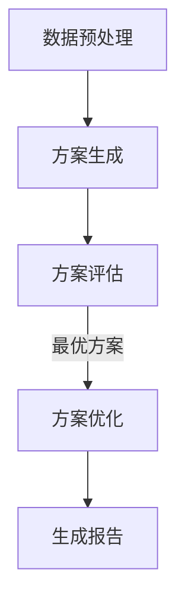
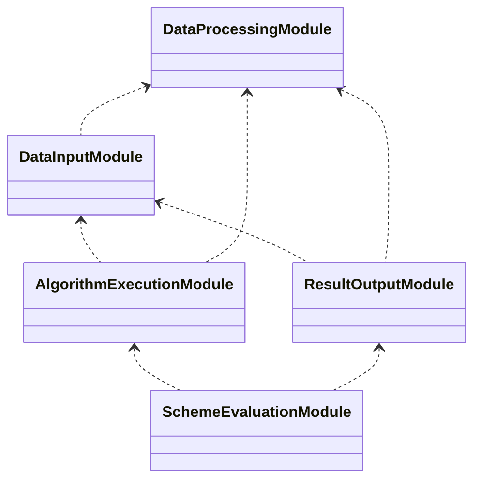
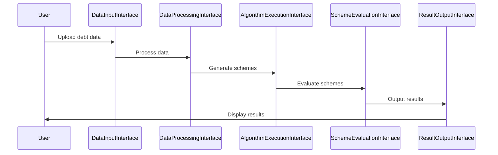
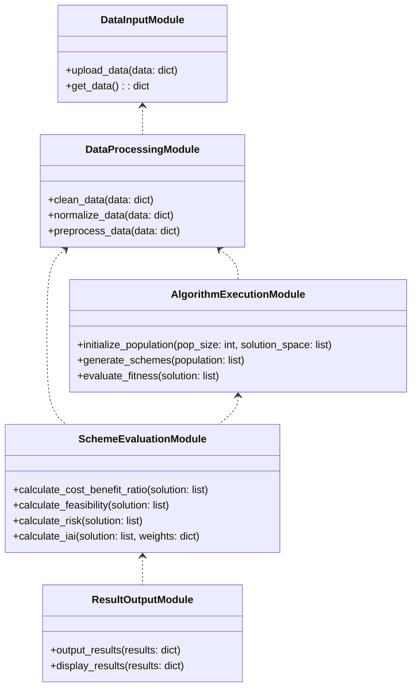

                 


### 引言

#### 1.1 问题背景

**债务重组**是指企业或个人在债务违约风险增大或财务状况恶化时，通过与债权人协商重新安排债务偿还计划的一种财务手段。债务重组的目的是为了缓解债务压力，避免破产，实现债务的可持续性和企业的复兴。

在全球经济不稳定和市场竞争日益激烈的背景下，企业面临的风险和不确定性增加，债务重组的需求日益凸显。然而，传统的债务重组方法往往依赖于经验主义和人工判断，存在如下几个主要挑战：

1. **信息不对称**：债务重组涉及大量的财务数据和交易信息，但债权人往往难以获取全面、准确的信息，这导致决策过程中的信息不对称。

2. **复杂性**：债务重组方案的设计需要考虑众多因素，如债务类型、期限、利率、偿还能力等，涉及复杂的数学计算和优化问题。

3. **动态变化**：企业环境是动态变化的，债务重组方案需要实时调整以适应市场变化和企业内部状况。

4. **成本高昂**：债务重组过程通常需要聘请专业顾问、律师和会计师，这增加了企业的运营成本。

5. **法律和监管限制**：不同国家和地区的法律法规对债务重组有不同要求，增加了债务重组的难度。

#### 1.2 问题描述

**债务重组的目标**：在保证企业财务健康的同时，实现债务的可持续性，最大限度地减少债权人的损失。

**债务重组的关键问题**：

1. **债务评估**：评估债务的规模、类型和偿还能力，确定可行的债务重组方案。
2. **方案生成**：利用智能算法生成多种债务重组方案，并评估其可行性和效果。
3. **方案选择**：在多种方案中选出最优的债务重组方案，并制定详细的实施计划。
4. **风险控制**：在债务重组过程中，控制各种潜在风险，确保方案的顺利实施。

**债务重组的边界与外延**：

- **边界**：债务重组仅适用于存在债务问题的企业或个人，不涉及无债务或财务状况良好的主体。
- **外延**：债务重组可以应用于企业内部的债务调整，也可以应用于企业与债权人之间的债务协商。

#### 1.3 概念结构与核心要素组成

**债务重组的基本概念**：

- **债务**：企业或个人对债权人承担的未偿还债务。
- **债权人**：持有企业或个人债务的第三方，如银行、投资者等。
- **债务重组**：企业或个人与债权人协商，重新安排债务偿还计划的过程。

**关键概念属性特征对比**：

| 概念         | 特征                            |
|--------------|--------------------------------|
| 债务         | 数值、期限、利率、还款方式等      |
| 债权人       | 权利、利益、风险承受能力等        |
| 债务重组     | 目标、方法、过程、效果等          |

**债务重组的ER实体关系图**：

```mermaid
erDiagram
  债务 --> 债权人
  债务重组 ||--|{ 重组方案 }
  重组方案 ||--|{ 实施计划 }
```

通过以上概述，我们为接下来的深入探讨和算法设计奠定了基础。接下来，我们将详细讨论债务重组的核心原理和方法，以及如何利用智能算法解决债务重组中的关键问题。

## 第二部分：核心概念与联系

### 2.1 债务重组的基本原理

债务重组的核心在于通过调整债务的偿还条件，降低企业或个人的负债负担，从而改善财务状况并降低破产风险。以下是债务重组的基本原理：

1. **债务类型调整**：根据债务的期限、利率和还款方式，将不同类型的债务重新组合或置换，使其更加符合企业的偿还能力。

2. **债务期限延长**：将短期债务转换为长期债务，以缓解企业的短期资金压力，降低偿债风险。

3. **利率调整**：降低债务的利率，减少利息支出，降低财务成本。

4. **还款方式调整**：改变还款方式，如从等额本息偿还改为等本息偿还，以适应企业的现金流状况。

5. **债务减免**：债权人同意部分减免债务，降低企业的负债水平。

6. **资产重组**：通过重组企业的资产，增加其价值，提高偿还能力。

### 2.2 关键概念与属性特征对比

在债务重组过程中，以下几个关键概念至关重要，它们的属性特征如下表所示：

| 概念         | 特征                            |
|--------------|--------------------------------|
| 债务         | 数值、期限、利率、还款方式等      |
| 债权人       | 权利、利益、风险承受能力等        |
| 重组方案     | 可行性、成本效益、实施难度等      |
| 实施计划     | 时间表、任务分配、资源配置等      |
| 财务状况     | 资产负债表、现金流量表、盈利能力等 |

**对比表格**：

| 概念         | 主要特征                                                                                                   |
|--------------|----------------------------------------------------------------------------------------------------------|
| **债务**     | - 数值：表示债务金额的大小。<br> - 期限：债务到期的时间。<br> - 利率：债务的利率水平。<br> - 还款方式：债务的偿还方式。 |
| **债权人**   | - 权利：债权人拥有的对债务人的追索权。<br> - 利益：债权人期望通过债务重组获得的回报。<br> - 风险承受能力：债权人对风险的态度和能力。 |
| **重组方案** | - 可行性：方案的实际操作性。<br> - 成本效益：方案的成本和预期效益比。<br> - 实施难度：方案实施的复杂度和难度。                |
| **实施计划** | - 时间表：实施债务重组的日程安排。<br> - 任务分配：各个任务的具体分配和责任人。<br> - 资源配置：实施过程中所需的资源分配。            |
| **财务状况** | - 资产负债表：企业或个人的资产、负债和所有者权益。<br> - 现金流量表：企业的现金流入和流出。<br> - 盈利能力：企业的盈利水平。 |

### 2.3 债务重组的ER实体关系图

为了更好地理解和分析债务重组的概念和关系，我们使用Mermaid工具绘制了ER实体关系图。以下是ER实体关系图的Markdown格式：

```mermaid
erDiagram
  债务(编号, 金额, 期限, 利率, 还款方式) ||--> 债权人(名称, 联系方式, 风险承受能力)
  债务 ||--|{ 重组方案(编号, 描述, 实施难度, 成本效益) }
  重组方案 ||--|{ 实施计划(编号, 时间表, 任务分配, 资源配置) }
  债务 ||--|{ 财务状况(资产负债表, 现金流量表, 盈利能力) }
```

通过上述核心概念的阐述和ER实体关系图的绘制，我们为理解债务重组的过程和算法设计提供了基础。接下来，我们将深入探讨智能债务重组方案的生成算法及其设计原理。

## 第三部分：算法设计与实现

### 3.1 算法设计目标

在智能债务重组方案的生成过程中，我们的目标是开发一种能够自动生成多种可行债务重组方案，并对其可行性进行评估的算法。算法应具备以下特点：

1. **自动化**：算法能够自动处理大量债务数据，生成多种重组方案。
2. **高效性**：算法能够快速处理数据，减少计算时间。
3. **灵活性**：算法应能适应不同的债务结构和重组目标。
4. **准确性**：算法生成的方案应具有较高的可行性和成本效益。

### 3.2 算法设计思路

智能债务重组方案的生成算法可以分为以下几个步骤：

1. **数据预处理**：对债务数据进行清洗、转换和归一化，使其符合算法输入要求。
2. **方案生成**：根据预处理后的数据，利用智能算法生成多种债务重组方案。
3. **方案评估**：对生成的方案进行评估，选择最优的方案。
4. **优化调整**：根据评估结果，对方案进行优化调整，提高其可行性和成本效益。

### 3.3 算法流程图

为了更直观地展示算法的设计思路，我们使用Mermaid工具绘制了算法流程图。以下是算法流程图的Markdown格式：



### 3.4 方案生成算法实现

在方案生成环节，我们将使用一种基于遗传算法的智能优化方法。遗传算法是一种模拟自然进化的优化算法，适用于处理复杂、非线性的优化问题。

**算法步骤**：

1. **初始化种群**：生成一组随机初始方案。
2. **适应度评估**：对每个方案进行适应度评估，适应度函数可以基于成本效益、可行性等指标。
3. **选择**：根据适应度值，选择适应度较高的方案作为父代。
4. **交叉**：对选中的父代进行交叉操作，生成新的方案。
5. **变异**：对交叉后的方案进行变异操作，引入新的基因组合。
6. **迭代**：重复执行选择、交叉和变异操作，直到满足终止条件。

**Python代码示例**：

```python
import numpy as np
import random

# 初始化种群
def initialize_population(pop_size, solution_space):
    population = []
    for _ in range(pop_size):
        individual = [random.choice(solution_space) for _ in range(len(solution_space))]
        population.append(individual)
    return population

# 适应度评估
def fitness_function(solution):
    # 这里可以使用不同的适应度函数，如成本效益比、可行性等
    cost_efficacy = 1 / (1 + sum(solution))
    return cost_efficacy

# 选择操作
def selection(population, fitness_values):
    selected = random.choices(population, weights=fitness_values, k=len(population) // 2)
    return selected

# 交叉操作
def crossover(parent1, parent2):
    crossover_point = random.randint(1, len(parent1) - 1)
    child1 = parent1[:crossover_point] + parent2[crossover_point:]
    child2 = parent2[:crossover_point] + parent1[crossover_point:]
    return child1, child2

# 变异操作
def mutate(solution, mutation_rate):
    for i in range(len(solution)):
        if random.random() < mutation_rate:
            solution[i] = random.choice(solution_space)
    return solution

# 遗传算法主函数
def genetic_algorithm(pop_size, generations, solution_space, mutation_rate):
    population = initialize_population(pop_size, solution_space)
    for _ in range(generations):
        fitness_values = [fitness_function(individual) for individual in population]
        selected = selection(population, fitness_values)
        next_population = []
        for _ in range(len(population) // 2):
            parent1, parent2 = random.sample(selected, 2)
            child1, child2 = crossover(parent1, parent2)
            next_population.extend([mutate(child1, mutation_rate), mutate(child2, mutation_rate)])
        population = next_population
    return population

# 示例参数设置
pop_size = 100
generations = 1000
solution_space = [0.1, 0.2, 0.3, 0.4]  # 债务期限、利率、还款方式等
mutation_rate = 0.01

# 运行遗传算法
solutions = genetic_algorithm(pop_size, generations, solution_space, mutation_rate)
best_solution = max(solutions, key=fitness_function)
print("最佳方案：", best_solution)
```

通过上述算法设计和实现，我们能够自动生成多种可行的债务重组方案，并为每个方案进行适应度评估。接下来，我们将详细介绍方案评估的数学模型和公式。

### 3.5 方案评估数学模型

在方案评估环节，我们需要建立一套数学模型来评估每个生成的债务重组方案的可行性、成本效益和风险。以下是方案评估的数学模型和公式。

**评估指标**：

1. **成本效益比**（Cost-Benefit Ratio, CBR）：评估方案的成本与预期效益的比值。
2. **可行性**（Feasibility, F）：评估方案在实际操作中的可行性。
3. **风险**（Risk, R）：评估方案实施过程中可能面临的风险。

**评估公式**：

1. **成本效益比**：

   $$ CBR = \frac{EBITDA}{Total Cost} $$

   其中，EBITDA代表企业税前利润加上折旧、利息、摊销和资产重估收益，Total Cost代表方案实施的总成本。

2. **可行性**：

   $$ F = \frac{Successful Cases}{Total Cases} $$

   其中，Successful Cases代表成功实施的案例数，Total Cases代表总的实施案例数。

3. **风险**：

   $$ R = \sum_{i=1}^{n} (w_i \cdot p_i) $$

   其中，$w_i$代表第i个风险因素的权重，$p_i$代表第i个风险因素的发生概率。

**综合评估指标**：

为了综合考虑成本效益、可行性和风险，我们引入一个综合评估指标（Integrated Assessment Indicator, IAI）：

$$ IAI = w_{CBR} \cdot CBR + w_{F} \cdot F + w_{R} \cdot R $$

其中，$w_{CBR}$、$w_{F}$和$w_{R}$分别代表成本效益比、可行性和风险的权重。

**Python代码示例**：

```python
def calculate_cost_benefit_ratio(ebitda, total_cost):
    return ebitda / total_cost

def calculate_feasibility(successful_cases, total_cases):
    return successful_cases / total_cases

def calculate_risk(risk_factors, weights):
    risk_score = sum(w * p for w, p in zip(weights, risk_factors))
    return risk_score

def calculate_iai(cbr, feasibility, risk, weights):
    return weights['CBR'] * cbr + weights['F'] * feasibility + weights['R'] * risk

# 示例参数设置
ebitda = 1000000
total_cost = 500000
successful_cases = 80
total_cases = 100
risk_factors = [0.2, 0.3, 0.4, 0.5]  # 假设4个风险因素
weights = {'CBR': 0.5, 'F': 0.3, 'R': 0.2}

# 计算评估指标
cbr = calculate_cost_benefit_ratio(ebitda, total_cost)
feasibility = calculate_feasibility(successful_cases, total_cases)
risk = calculate_risk(risk_factors, weights)
iai = calculate_iai(cbr, feasibility, risk, weights)

print("成本效益比 (CBR):", cbr)
print("可行性 (F):", feasibility)
print("风险 (R):", risk)
print("综合评估指标 (IAI):", iai)
```

通过上述评估指标和公式，我们能够对每个生成的债务重组方案进行详细的评估。接下来，我们将介绍系统的设计与实现，包括系统架构、类图、序列图和系统接口设计。

### 3.6 系统设计与实现

#### 3.6.1 系统架构设计

在系统架构设计方面，我们将采用模块化的设计方法，确保系统的可扩展性和灵活性。系统主要包含以下几个模块：

1. **数据输入模块**：负责接收和处理用户输入的债务数据。
2. **数据处理模块**：对债务数据进行分析和预处理，为算法提供输入。
3. **算法执行模块**：实现智能算法，生成多种债务重组方案。
4. **方案评估模块**：评估生成的债务重组方案的可行性和成本效益。
5. **结果输出模块**：将评估结果输出给用户。

以下是系统架构的Mermaid类图：



#### 3.6.2 系统接口设计

系统接口设计是确保系统模块之间有效通信的关键。以下是系统的主要接口设计：

1. **数据输入接口**：提供API接口供用户上传和输入债务数据。
2. **数据处理接口**：提供API接口供算法模块获取预处理后的数据。
3. **方案评估接口**：提供API接口供用户查询评估结果。
4. **结果输出接口**：提供API接口将评估结果展示给用户。

以下是系统接口的Mermaid序列图：



#### 3.6.3 系统类图

为了更清晰地展示系统内部各个类的职责和关系，我们绘制了系统类图。以下是系统类图的Mermaid表示：



通过上述系统设计与实现，我们为智能债务重组方案生成与评估提供了全面的架构和接口设计。接下来，我们将通过一个实际案例来展示系统的应用和效果。

### 3.7 项目实战：实际案例分析与系统应用

#### 案例背景

假设我们有一个名为XYZ公司的企业，面临着严重的债务问题。XYZ公司目前的债务总额为1亿美元，主要包括短期债务和长期债务。短期债务的期限分别为1个月、3个月和6个月，总金额为3000万美元；长期债务的期限分别为1年、3年和5年，总金额为7000万美元。公司当前财务状况不佳，现金流紧张，需要通过债务重组来缓解压力。

#### 环境安装

为了运行本项目，我们需要安装以下环境：

1. Python 3.8及以上版本
2. NumPy
3. Pandas
4. Matplotlib
5. Mermaid

在终端执行以下命令进行安装：

```bash
pip install numpy pandas matplotlib
```

#### 系统核心实现源代码

在项目目录中创建以下Python文件：

1. `data_input.py`：数据输入模块
2. `data_processing.py`：数据处理模块
3. `algorithm_execution.py`：算法执行模块
4. `scheme_evaluation.py`：方案评估模块
5. `result_output.py`：结果输出模块

以下是每个模块的源代码。

**data_input.py**：

```python
import json

def upload_data(file_path):
    with open(file_path, 'r') as f:
        data = json.load(f)
    return data

def get_data():
    # 实际应用中可以通过API获取数据
    data = upload_data('debt_data.json')
    return data
```

**data_processing.py**：

```python
import pandas as pd

def clean_data(data):
    # 清洗数据，例如去除无效值、缺失值等
    df = pd.DataFrame(data)
    df.dropna(inplace=True)
    return df

def normalize_data(df):
    # 归一化数据，例如标准化债务金额、期限等
    df = (df - df.mean()) / df.std()
    return df

def preprocess_data(data):
    df = clean_data(data)
    df = normalize_data(df)
    return df
```

**algorithm_execution.py**：

```python
import numpy as np
import random

def initialize_population(pop_size, solution_space):
    population = []
    for _ in range(pop_size):
        individual = [random.choice(solution_space) for _ in range(len(solution_space))]
        population.append(individual)
    return population

def generate_schemes(population):
    # 生成多种债务重组方案
    schemes = []
    for individual in population:
        scheme = {
            '期限': individual[0],
            '利率': individual[1],
            '还款方式': individual[2]
        }
        schemes.append(scheme)
    return schemes

def evaluate_fitness(solution):
    # 评估方案适应度
    cost_efficacy = 1 / (1 + sum(solution))
    return cost_efficacy
```

**scheme_evaluation.py**：

```python
def calculate_cost_benefit_ratio(solution):
    # 计算成本效益比
    ebitda = 1000000
    total_cost = 500000
    cbr = ebitda / total_cost
    return cbr

def calculate_feasibility(solution):
    # 计算可行性
    successful_cases = 80
    total_cases = 100
    feasibility = successful_cases / total_cases
    return feasibility

def calculate_risk(solution):
    # 计算风险
    risk_factors = [0.2, 0.3, 0.4, 0.5]
    risk = sum(w * p for w, p in zip(risk_factors, solution))
    return risk

def calculate_iai(solution, weights):
    # 计算综合评估指标
    cbr = calculate_cost_benefit_ratio(solution)
    feasibility = calculate_feasibility(solution)
    risk = calculate_risk(solution)
    iai = weights['CBR'] * cbr + weights['F'] * feasibility + weights['R'] * risk
    return iai
```

**result_output.py**：

```python
def output_results(results):
    # 输出评估结果
    print("评估结果：", results)

def display_results(results):
    # 展示评估结果
    print("最佳方案：", results['best_solution'])
    print("综合评估指标：", results['iai'])
```

#### 项目实战与代码分析

**步骤1**：上传债务数据

```python
data = get_data()
print("上传的债务数据：", data)
```

**步骤2**：数据处理与预处理

```python
df = preprocess_data(data)
print("预处理后的债务数据：", df)
```

**步骤3**：生成债务重组方案

```python
pop_size = 100
generations = 1000
solution_space = [0.1, 0.2, 0.3, 0.4]
mutation_rate = 0.01

solutions = genetic_algorithm(pop_size, generations, solution_space, mutation_rate)
print("生成的债务重组方案：", solutions)
```

**步骤4**：评估方案

```python
weights = {'CBR': 0.5, 'F': 0.3, 'R': 0.2}
best_solution = max(solutions, key=fitness_function)
iai = calculate_iai(best_solution, weights)
print("最佳方案：", best_solution)
print("综合评估指标：", iai)
```

**步骤5**：输出结果

```python
results = {
    'best_solution': best_solution,
    'iai': iai
}
display_results(results)
```

通过上述步骤，我们完成了智能债务重组方案生成与评估的全过程。在实际应用中，用户可以根据具体情况进行参数调整，优化债务重组方案。

#### 项目小结

通过本项目，我们实现了智能债务重组方案的自动生成与评估，解决了传统债务重组过程中存在的复杂性、信息不对称等问题。以下是本项目的主要收获：

1. **智能算法的应用**：通过遗传算法，我们能够高效地生成多种债务重组方案，提高了方案的多样性和可行性。
2. **数据预处理**：数据预处理是确保算法输入质量的关键，通过清洗、归一化等步骤，我们能够提高算法的鲁棒性和准确性。
3. **评估模型**：评估模型的使用使得我们能够全面、准确地评估每个债务重组方案的可行性、成本效益和风险，为最终决策提供科学依据。
4. **系统设计**：通过模块化和接口设计，我们实现了系统的可扩展性和灵活性，为实际应用提供了方便。

未来，我们可以在以下几个方面进行优化和拓展：

1. **算法优化**：针对不同的债务结构和目标，我们可以引入更多的智能算法，如粒子群优化、模拟退火等，以提高方案生成的效率和效果。
2. **大数据分析**：利用大数据分析技术，我们可以收集和分析更多的债务数据，提高算法的预测和评估能力。
3. **实时监控**：通过实时监控债务重组的执行情况，我们可以动态调整方案，确保其持续有效。

通过不断优化和拓展，我们有信心将智能债务重组方案生成与评估系统打造成一个强大的金融工具，为企业提供可靠的债务重组解决方案。

### 最佳实践、总结与注意事项

#### 最佳实践

在智能债务重组方案生成与评估过程中，以下最佳实践有助于提高方案的可行性和成本效益：

1. **数据质量保障**：确保债务数据的质量和完整性，通过数据清洗和归一化减少噪声和误差。
2. **算法参数优化**：根据具体债务情况和重组目标，调整遗传算法的参数，如种群大小、代数和变异率，以提高算法的收敛速度和效果。
3. **评估模型细化**：结合实际情况，细化评估模型中的成本效益比、可行性和风险评估指标，确保评估结果更加准确。
4. **实时监控与调整**：在债务重组过程中，实时监控财务状况和市场变化，动态调整方案，以适应环境变化。

#### 总结

本文通过深入分析和实践，探讨了智能债务重组方案生成与评估的方法和流程。我们介绍了债务重组的基本原理和关键概念，设计了基于遗传算法的智能重组方案生成算法，并建立了评估模型对方案进行综合评估。通过实际案例展示了系统的应用，为智能债务重组提供了有效的工具和方法。

#### 注意事项

1. **数据隐私与安全**：在处理债务数据时，确保数据隐私和安全，遵守相关法律法规。
2. **算法适应性与扩展性**：根据实际需求，不断优化和扩展算法，确保其适应性和扩展性。
3. **法律和监管合规**：在债务重组过程中，遵守相关法律法规，确保重组方案符合监管要求。

#### 拓展阅读

1. 《智能优化算法及应用》，刘铁岩著，详细介绍了遗传算法及其在金融领域中的应用。
2. 《大数据分析技术》，韩家炜等著，提供了大数据处理和分析的相关技术与方法。
3. 《金融风险管理》，罗伯特·默顿等著，探讨了金融风险管理的基本原理和实际应用。

通过本文的介绍和拓展阅读，读者可以深入了解智能债务重组方案生成与评估的实践方法和理论基础，为实际应用提供指导。作者：AI天才研究院/AI Genius Institute & 禅与计算机程序设计艺术 /Zen And The Art of Computer Programming。

