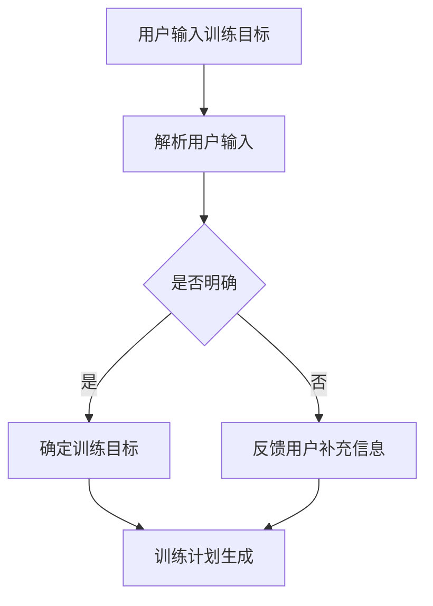
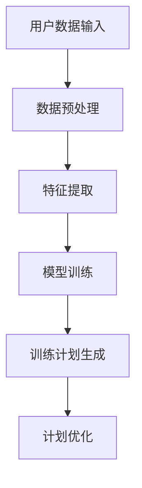

                 

### 《智能健身：AI Agent的个性化训练计划》

关键词：智能健身，AI Agent，个性化训练计划，数据采集，机器学习算法，强化学习算法，自然语言处理技术

摘要：本文深入探讨了智能健身领域中的AI Agent的个性化训练计划。通过分析智能健身的背景与现状，介绍了AI Agent的技术原理和个性化训练计划的设计方法。进一步，本文详细阐述了AI Agent在健身中的应用，包括训练与评估、实时反馈与调整、以及健身社区中的应用。最后，本文探讨了智能健身领域的挑战与未来展望，为读者提供了全面的智能健身解决方案。

### 目录大纲

#### 第一部分：背景与基础理论

**第1章：智能健身概述**

**1.1 问题背景与现状分析**

**1.2 智能健身的概念与范畴**

**1.3 智能健身的技术基础

**第2章：AI Agent技术原理**

**2.1 AI Agent的定义与特性**

**2.2 AI Agent的核心技术**

2.2.1 机器学习算法

2.2.2 强化学习算法

2.2.3 自然语言处理技术

**第3章：个性化训练计划设计**

**3.1 个性化训练计划的定义与目标**

**3.2 数据采集与预处理**

3.2.1 生理数据采集

3.2.2 行为数据采集

3.2.3 数据预处理方法

#### 第二部分：AI Agent在健身中的应用

**第4章：AI Agent训练与评估**

**4.1 AI Agent训练流程**

4.1.1 数据集准备

4.1.2 模型选择与训练

4.1.3 模型评估与优化

**4.2 AI Agent评估指标**

4.2.1 评估方法

4.2.2 评估指标详解

**第5章：AI Agent在健身中的应用场景**

**5.1 健身计划生成**

5.1.1 训练目标设定

5.1.2 训练计划生成算法

5.1.3 计划优化策略

**5.2 实时反馈与调整**

5.2.1 实时数据采集

5.2.2 反馈机制设计

5.2.3 调整策略与效果评估

**第6章：AI Agent在健身社区中的应用**

**6.1 社区互动与个性化推荐**

6.1.1 社区互动机制

6.1.2 个性化推荐算法

6.1.3 社区影响力评估

**第7章：AI Agent在健身领域的挑战与未来展望**

**7.1 智能健身技术挑战**

7.1.1 数据隐私与安全

7.1.2 技术迭代与更新

7.1.3 用户体验与满意度

**7.2 智能健身未来展望**

7.2.1 智能健身市场趋势

7.2.2 技术发展与应用拓展

7.2.3 社会影响与伦理考量

### 第一部分：背景与基础理论

#### 第1章：智能健身概述

##### 1.1 问题背景与现状分析

智能健身作为一个新兴领域，随着人工智能技术的快速发展而逐渐兴起。传统的健身模式主要依赖于个人的自觉性和毅力，往往难以持久和系统。而智能健身通过引入先进的人工智能技术，可以实现个性化、智能化和系统化的健身管理，从而提高健身效果和用户满意度。

目前，智能健身市场呈现出快速增长的趋势。根据市场调研数据显示，全球智能健身市场预计将在未来几年内达到数百亿美元规模。智能健身产品主要包括智能手环、智能健身镜、智能健身设备等，这些产品能够实时监测用户的健身数据，并根据用户的实际情况进行智能化的训练建议。

然而，智能健身也面临着一些问题和挑战。首先，数据隐私和安全问题是一个重要的考量。智能健身设备需要收集用户的生理和行为数据，这些数据可能涉及用户的隐私信息。如何保障这些数据的安全和隐私，是一个亟待解决的问题。

其次，智能健身技术的成熟度和用户体验也是关键因素。目前，一些智能健身产品在数据采集、算法优化和用户体验方面仍存在不足，需要进一步改进和优化。

##### 1.2 智能健身的概念与范畴

智能健身是指利用人工智能技术，对用户的健身过程进行智能化的管理和服务。智能健身产品通常具备以下特点：

1. **数据采集**：智能健身设备能够实时采集用户的生理数据（如心率、血压、运动强度等）和行为数据（如运动轨迹、生活习惯等）。

2. **数据分析**：通过机器学习、大数据分析等技术，对采集到的数据进行处理和分析，提取有用的信息。

3. **个性化推荐**：根据用户的生理特征、行为习惯和健身目标，提供个性化的健身计划和训练建议。

4. **实时反馈**：通过智能设备，对用户的训练过程进行实时监测和反馈，帮助用户调整训练强度和方式。

5. **健身社区**：通过线上平台，建立健身社区，用户可以相互交流、分享经验和互相激励。

智能健身的范畴广泛，涵盖了硬件设备、软件平台、算法技术等多个方面。硬件设备包括智能手环、智能健身镜、智能跑步机等；软件平台包括健身应用、数据分析系统等；算法技术包括机器学习、大数据分析、自然语言处理等。

##### 1.3 智能健身的技术基础

智能健身的实现依赖于多种先进技术，主要包括：

1. **传感器技术**：智能健身设备需要使用各种传感器（如加速度传感器、心率传感器、GPS等）来实时监测用户的生理和行为数据。

2. **数据采集与分析技术**：通过无线传输技术（如Wi-Fi、蓝牙等），将传感器采集到的数据传输到云端进行分析和处理。

3. **机器学习算法**：用于对用户数据进行分析，提取特征，建立模型，进行个性化推荐和实时反馈。

4. **自然语言处理技术**：用于处理用户与智能健身设备之间的交互，如语音识别、文本分析等。

5. **大数据技术**：用于处理海量数据，提取有价值的信息，支持智能决策。

6. **云计算与物联网技术**：支持智能健身设备与云端平台的互联互通，实现数据共享和智能服务。

智能健身的技术基础为其发展提供了强大的支持，同时也为用户带来了更加便捷、高效的健身体验。

### 第2章：AI Agent技术原理

##### 2.1 AI Agent的定义与特性

AI Agent，即人工智能代理，是指具备一定智能行为能力的计算机程序或实体。AI Agent可以模拟人类行为，执行特定任务，并具备自我学习和适应能力。AI Agent的特性包括：

1. **自主性**：AI Agent能够自主决策和执行任务，无需人工干预。

2. **适应性**：AI Agent能够根据环境变化和反馈信息调整自身行为，实现自我优化。

3. **交互性**：AI Agent可以与用户和其他系统进行交互，获取信息和提供服务。

4. **学习性**：AI Agent能够通过学习用户数据和行为模式，不断优化自身性能。

AI Agent在智能健身中的应用，可以提升个性化训练计划的准确性和实用性。例如，通过监测用户的心率、血压等生理数据，AI Agent可以实时调整训练强度，确保用户在最佳状态下进行锻炼。

##### 2.2 AI Agent的核心技术

AI Agent的核心技术主要包括机器学习算法、强化学习算法和自然语言处理技术。这些技术在AI Agent的训练、决策和交互中发挥着关键作用。

###### 2.2.1 机器学习算法

机器学习算法是AI Agent的基础技术，通过学习大量数据，建立模型并进行预测和分类。常见的机器学习算法包括：

1. **监督学习**：通过已知输入输出数据训练模型，预测未知数据。

2. **无监督学习**：通过未知数据，自动发现数据中的模式和规律。

3. **半监督学习**：结合已知和未知数据，提高模型训练效果。

在智能健身中，机器学习算法可以用于用户数据的分析，提取用户特征，建立个性化训练模型。例如，通过分析用户的心率、运动轨迹等数据，AI Agent可以识别用户的运动习惯和健康状况，为用户提供合适的健身计划。

###### 2.2.2 强化学习算法

强化学习算法是AI Agent的核心技术之一，通过奖励和惩罚机制，使AI Agent在交互环境中不断学习和优化行为。强化学习算法的主要特点包括：

1. **试错学习**：AI Agent在执行任务时，可能会遇到不确定性和意外情况，通过不断尝试和错误，逐步优化行为。

2. **自适应学习**：AI Agent可以根据环境变化和反馈信息，实时调整策略和行为。

3. **长期奖励**：强化学习算法关注长期收益，通过逐步积累奖励，实现长期目标。

在智能健身中，强化学习算法可以用于训练AI Agent，使其能够根据用户实时反馈，动态调整健身计划。例如，当用户感到疲劳时，AI Agent可以降低训练强度，保证用户的安全和舒适。

###### 2.2.3 自然语言处理技术

自然语言处理技术是AI Agent与人类交互的重要工具，通过理解自然语言，实现语音识别、文本分析等功能。自然语言处理技术主要包括：

1. **语音识别**：将语音信号转换为文本或命令。

2. **语义分析**：理解文本或语音中的含义和关系。

3. **问答系统**：基于自然语言处理技术，实现用户问答交互。

在智能健身中，自然语言处理技术可以用于用户与AI Agent的交互。例如，用户可以通过语音命令调整健身计划，或询问AI Agent关于健身的建议。此外，自然语言处理技术还可以用于分析用户的健身日志和反馈，提取关键信息，为AI Agent提供决策依据。

### 第3章：个性化训练计划设计

##### 3.1 个性化训练计划的定义与目标

个性化训练计划是指根据用户的生理特征、行为习惯和健身目标，定制化的制定健身计划。个性化训练计划的目标是：

1. **提高健身效果**：通过定制化的训练计划，帮助用户实现健身目标。

2. **提升用户满意度**：根据用户的反馈，不断优化训练计划，提高用户的健身体验。

3. **降低运动损伤风险**：根据用户的生理数据，合理安排训练强度和方式，降低运动损伤风险。

个性化训练计划的设计需要考虑多个因素，包括用户的生理特征（如年龄、性别、体重、心率等）、行为习惯（如作息时间、饮食习惯等）和健身目标（如减脂、增肌、提高心肺功能等）。通过综合考虑这些因素，可以为用户提供最适合的健身计划。

##### 3.2 数据采集与预处理

个性化训练计划的设计离不开数据的支持。数据采集是关键环节，主要包括以下几个方面：

1. **生理数据采集**：通过智能手环、智能健身设备等，实时监测用户的心率、血压、运动强度等生理数据。

2. **行为数据采集**：通过GPS、智能摄像头等，采集用户的运动轨迹、生活习惯等行为数据。

3. **用户反馈数据采集**：通过问卷调查、用户评论等，收集用户的健身体验和反馈。

数据采集后，需要进行预处理，以提高数据质量和模型的性能。预处理方法包括：

1. **数据清洗**：去除数据中的噪声和异常值，确保数据的有效性。

2. **数据归一化**：将不同类型的数据进行归一化处理，使其在同一量级内进行比较和分析。

3. **特征提取**：从原始数据中提取有用的特征，用于训练模型。

4. **数据存储**：将预处理后的数据存储在数据库中，便于后续分析和处理。

##### 3.2.1 生理数据采集

生理数据是智能健身中最重要的数据之一，包括心率、血压、运动强度等。这些数据可以通过智能手环、智能健身设备等设备进行采集。以下是一些常用的生理数据采集方法：

1. **心率监测**：通过光电传感器或电磁传感器，实时监测用户的心率。

2. **血压监测**：通过压力传感器，测量用户的血压。

3. **运动强度监测**：通过加速度传感器、陀螺仪等，监测用户的运动强度。

在采集生理数据时，需要考虑数据的准确性和稳定性。为了提高数据的准确性，可以采用多传感器融合技术，结合不同传感器的数据，提高测量精度。同时，为了提高数据的稳定性，需要对传感器进行校准和优化，减少噪声干扰。

##### 3.2.2 行为数据采集

行为数据包括用户的运动轨迹、生活习惯等，对于个性化训练计划的设计具有重要意义。以下是一些常用的行为数据采集方法：

1. **GPS定位**：通过GPS模块，实时监测用户的运动轨迹。

2. **智能摄像头**：通过智能摄像头，记录用户的生活习惯和运动场景。

3. **传感器融合**：结合加速度传感器、陀螺仪等，监测用户的运动状态和动作。

在采集行为数据时，需要考虑数据的隐私保护和安全性。为了避免用户的隐私泄露，可以对数据进行匿名化和去标识化处理。同时，为了确保数据的安全，需要采用加密技术和访问控制策略，防止数据被非法访问和篡改。

##### 3.2.3 数据预处理方法

数据预处理是智能健身中不可或缺的环节，对于提高模型性能和准确性具有重要意义。以下是一些常用的数据预处理方法：

1. **数据清洗**：去除数据中的噪声和异常值，确保数据的有效性。可以通过统计方法、规则方法等，检测和去除异常数据。

2. **数据归一化**：将不同类型的数据进行归一化处理，使其在同一量级内进行比较和分析。常用的归一化方法包括最小-最大归一化、均值-方差归一化等。

3. **特征提取**：从原始数据中提取有用的特征，用于训练模型。特征提取方法包括统计特征提取、时域特征提取、频域特征提取等。

4. **数据存储**：将预处理后的数据存储在数据库中，便于后续分析和处理。常用的数据库技术包括关系数据库、NoSQL数据库等。

通过数据预处理，可以显著提高数据质量和模型的性能，为个性化训练计划的设计提供有力支持。

### 第二部分：AI Agent在健身中的应用

#### 第4章：AI Agent训练与评估

##### 4.1 AI Agent训练流程

AI Agent的训练是智能健身的核心环节，其目的是使AI Agent能够根据用户数据和反馈，提供高质量的健身建议。AI Agent的训练流程主要包括数据集准备、模型选择与训练、模型评估与优化等步骤。

##### 4.1.1 数据集准备

数据集是AI Agent训练的基础，其质量直接影响到训练效果。在数据集准备阶段，需要收集和整理大量的用户数据，包括生理数据、行为数据、用户反馈等。以下是一些具体的数据收集和整理方法：

1. **数据收集**：通过智能手环、智能健身设备等，实时采集用户的生理数据和行为数据。同时，可以通过问卷调查、用户反馈等方式，收集用户的训练目标和偏好。

2. **数据清洗**：去除数据中的噪声和异常值，确保数据的有效性。可以通过统计方法、规则方法等，检测和去除异常数据。

3. **数据归一化**：将不同类型的数据进行归一化处理，使其在同一量级内进行比较和分析。常用的归一化方法包括最小-最大归一化、均值-方差归一化等。

4. **数据存储**：将预处理后的数据存储在数据库中，便于后续分析和处理。常用的数据库技术包括关系数据库、NoSQL数据库等。

##### 4.1.2 模型选择与训练

在数据集准备完成后，需要选择合适的模型进行训练。AI Agent的训练通常采用机器学习算法和强化学习算法。以下是一些常见的模型选择和训练方法：

1. **模型选择**：根据训练任务的特点和数据集的规模，选择合适的模型。常见的模型包括决策树、支持向量机、神经网络等。

2. **模型训练**：使用收集到的数据集，对选定的模型进行训练。训练过程中，可以通过交叉验证、梯度下降等方法，优化模型参数。

3. **模型评估**：在训练过程中，需要不断评估模型的性能，以确定是否达到预期目标。常用的评估方法包括准确率、召回率、F1值等。

4. **模型优化**：根据评估结果，对模型进行优化。可以通过调整模型结构、修改训练参数等方法，提高模型性能。

##### 4.1.3 模型评估与优化

模型评估是AI Agent训练过程中至关重要的一步，其目的是验证模型在实际应用中的性能。以下是一些常见的模型评估和优化方法：

1. **评估方法**：根据训练任务的特点，选择合适的评估方法。常用的评估方法包括准确率、召回率、F1值、ROC曲线等。

2. **交叉验证**：通过交叉验证方法，对模型进行多次训练和评估，以减少评估结果的波动性。

3. **调参优化**：根据评估结果，对模型参数进行调整，以优化模型性能。常用的调参方法包括网格搜索、贝叶斯优化等。

4. **模型集成**：通过集成多个模型，提高整体性能。常见的集成方法包括随机森林、梯度提升树等。

通过模型评估和优化，可以确保AI Agent在实际应用中能够提供高质量的健身建议，从而提高用户的健身效果和满意度。

##### 4.2 AI Agent评估指标

为了全面评估AI Agent在智能健身中的应用效果，需要设定一系列评估指标。以下是一些常见的评估指标及其详细解释：

1. **准确率（Accuracy）**：准确率是指模型预测正确的样本数量与总样本数量的比例。准确率越高，说明模型的预测能力越强。

2. **召回率（Recall）**：召回率是指模型预测正确的样本数量与实际为正类别的样本数量的比例。召回率越高，说明模型对正类别的识别能力越强。

3. **F1值（F1 Score）**：F1值是准确率和召回率的调和平均值，用于综合评估模型的预测性能。F1值越高，说明模型的预测性能越好。

4. **ROC曲线（Receiver Operating Characteristic Curve）**：ROC曲线通过绘制真阳性率（True Positive Rate）与假阳性率（False Positive Rate）的关系，评估模型的分类能力。ROC曲线下面积（AUC）越大，说明模型的分类能力越强。

5. **均方误差（Mean Squared Error, MSE）**：均方误差用于评估回归模型的预测误差，计算公式为预测值与真实值之差的平方的平均值。MSE越小，说明模型的预测误差越小。

6. **交叉验证误差（Cross-Validation Error）**：交叉验证误差通过多次训练和评估，计算模型在验证集上的平均误差。交叉验证误差越小，说明模型的泛化能力越强。

7. **用户满意度（User Satisfaction）**：用户满意度通过问卷调查、用户反馈等方式，评估用户对AI Agent提供的健身建议的满意度。用户满意度越高，说明AI Agent的应用效果越好。

通过设定和评估这些指标，可以全面了解AI Agent在智能健身中的应用效果，为后续优化和改进提供依据。

##### 4.2.1 评估方法

评估AI Agent的性能需要采用多种评估方法，以确保评估结果的准确性和全面性。以下是一些常见的评估方法及其具体步骤：

1. **交叉验证（Cross-Validation）**：交叉验证是一种常用的评估方法，通过将数据集划分为多个子集，轮流使用子集作为验证集，评估模型的性能。交叉验证可以减少评估结果的波动性，提高评估的可靠性。

2. **混淆矩阵（Confusion Matrix）**：混淆矩阵是一种用于评估分类模型性能的工具，通过展示模型预测结果与实际结果之间的对比，计算准确率、召回率、F1值等指标。混淆矩阵可以帮助分析模型在各类别上的预测性能。

3. **ROC曲线与AUC（Receiver Operating Characteristic Curve and Area Under Curve）**：ROC曲线与AUC是评估分类模型性能的重要指标。通过绘制ROC曲线，可以直观地了解模型的分类能力。AUC越大，说明模型的分类能力越强。

4. **用户调查（User Survey）**：用户调查是一种通过问卷、访谈等方式，收集用户对AI Agent应用体验的评价。用户满意度、使用频率、建议改进等指标可以帮助评估AI Agent的实际应用效果。

5. **实验对比（Experimental Comparison）**：通过对比不同模型的性能，评估AI Agent在不同训练数据、模型结构、训练策略等方面的优劣。实验对比可以提供详细的性能分析，为模型优化提供依据。

通过多种评估方法的结合，可以全面了解AI Agent在智能健身中的应用效果，为模型的优化和改进提供有力支持。

##### 4.2.2 评估指标详解

为了更深入地了解AI Agent在智能健身中的应用效果，需要对评估指标进行详细分析。以下是对常见评估指标的详细解释：

1. **准确率（Accuracy）**：准确率是评估模型预测能力的基本指标，表示模型预测正确的样本数量与总样本数量的比例。计算公式为：
   $$ 
   \text{Accuracy} = \frac{\text{预测正确数}}{\text{总样本数}}
   $$
   准确率越高，说明模型的预测能力越强。然而，准确率并不能完全反映模型的性能，特别是在类别不平衡的情况下。

2. **召回率（Recall）**：召回率表示模型预测正确的正类样本数量与实际为正类别的样本数量的比例。计算公式为：
   $$ 
   \text{Recall} = \frac{\text{预测正确数}}{\text{实际正类数}}
   $$
   召回率越高，说明模型对正类别的识别能力越强。召回率对于避免漏掉重要信息尤为重要。

3. **F1值（F1 Score）**：F1值是准确率和召回率的调和平均值，用于综合评估模型的预测性能。计算公式为：
   $$ 
   \text{F1值} = 2 \times \frac{\text{准确率} \times \text{召回率}}{\text{准确率} + \text{召回率}}
   $$
   F1值越高，说明模型的预测性能越好。F1值能够平衡准确率和召回率，避免单一指标带来的偏差。

4. **ROC曲线与AUC（Receiver Operating Characteristic Curve and Area Under Curve）**：ROC曲线是通过绘制真阳性率（True Positive Rate，TPR）与假阳性率（False Positive Rate，FPR）的关系曲线，评估模型分类能力的一种工具。AUC是ROC曲线下面积，用于衡量模型分类能力。AUC的值在0.5到1之间，值越大，说明模型的分类能力越强。

5. **均方误差（Mean Squared Error, MSE）**：均方误差是评估回归模型预测误差的常用指标，计算公式为预测值与真实值之差的平方的平均值。MSE越小，说明模型的预测误差越小，预测效果越好。

6. **交叉验证误差（Cross-Validation Error）**：交叉验证误差是通过多次训练和评估，计算模型在验证集上的平均误差。交叉验证误差越小，说明模型的泛化能力越强，适用于实际应用。

7. **用户满意度（User Satisfaction）**：用户满意度是评估AI Agent应用效果的重要指标，通过问卷调查、用户反馈等方式收集。用户满意度越高，说明AI Agent的应用效果越好，用户对健身建议的接受度和信任度越高。

通过详细分析这些评估指标，可以更全面地了解AI Agent在智能健身中的应用效果，为模型的优化和改进提供有力支持。

### 第5章：AI Agent在健身中的应用场景

#### 5.1 健身计划生成

健身计划生成是AI Agent在智能健身中的一项重要应用，通过分析用户的生理特征、行为习惯和健身目标，AI Agent可以为用户提供个性化的训练计划。以下将详细讨论健身计划生成的关键步骤、算法和优化策略。

##### 5.1.1 训练目标设定

在生成健身计划之前，需要明确用户的训练目标。常见的训练目标包括减脂、增肌、提高心肺功能等。用户的训练目标直接影响健身计划的制定，因此，AI Agent需要与用户进行交互，了解其具体的健身目标。

例如，用户可以通过填写问卷或进行语音交互，与AI Agent分享其训练目标。AI Agent在接收到用户输入后，会进行初步的分析和处理，以确定用户的健身目标。以下是一个简单的流程图：

通过交互式地获取用户的训练目标，AI Agent可以更准确地制定个性化的健身计划。

##### 5.1.2 训练计划生成算法

健身计划生成算法是AI Agent的核心技术之一，通过机器学习、强化学习等算法，AI Agent可以生成符合用户需求的训练计划。以下是一个简化的训练计划生成算法流程：

在具体实现中，健身计划生成算法包括以下几个步骤：

1. **数据预处理**：对用户输入的生理数据、行为数据进行清洗、归一化等处理，为后续分析做准备。

2. **特征提取**：从预处理后的数据中提取关键特征，如心率、运动强度、运动时间等。特征提取的目的是简化数据，提高模型训练的效率。

3. **模型训练**：使用机器学习算法（如决策树、支持向量机、神经网络等）对提取的特征进行训练，构建预测模型。模型训练的目的是学习用户数据中的规律，为生成个性化训练计划提供依据。

4. **训练计划生成**：基于训练得到的模型，AI Agent根据用户的训练目标，生成符合需求的训练计划。训练计划可以包括训练内容、训练强度、训练频率等。

5. **计划优化**：根据用户的反馈和实时监测数据，AI Agent对训练计划进行优化，以提高健身效果和用户满意度。计划优化可以通过强化学习算法实现，使AI Agent能够不断调整和改进训练计划。

##### 5.1.3 计划优化策略

健身计划的优化是确保用户达到健身目标的重要环节。为了提高健身效果，AI Agent需要根据用户的反馈和实时监测数据，对训练计划进行调整。以下是一些常见的计划优化策略：

1. **实时调整**：AI Agent根据用户的实时监测数据（如心率、血压等），动态调整训练计划。例如，当用户心率过高时，可以降低训练强度，确保用户的安全。

2. **反馈机制**：AI Agent通过收集用户的反馈，如训练效果、疲劳程度等，对训练计划进行优化。用户可以在训练过程中，通过语音、手势等方式，与AI Agent进行互动，反馈训练感受。

3. **目标调整**：AI Agent根据用户的训练进度和效果，动态调整训练目标。例如，当用户在一段时间内达到预期目标后，可以适当提高训练难度，继续挑战用户。

4. **个性化推荐**：AI Agent根据用户的生理特征、行为习惯和训练目标，为用户提供个性化的训练建议。例如，对于不同年龄、性别和体重的用户，AI Agent可以推荐不同的训练计划和策略。

5. **群体优化**：AI Agent可以分析同一群体的用户数据，总结出普遍适用的训练策略和计划。例如，对于一群减脂用户，AI Agent可以推荐一套通用的减脂训练计划。

通过以上策略，AI Agent可以不断优化训练计划，确保用户在安全、舒适的环境中进行锻炼，从而达到最佳的健身效果。

##### 5.2 实时反馈与调整

实时反馈与调整是AI Agent在智能健身中的一项关键应用，通过实时监测用户的生理数据和行为数据，AI Agent可以动态调整训练计划，确保用户在最佳状态下进行锻炼。以下将详细讨论实时反馈与调整的关键步骤、数据采集和反馈机制设计。

##### 5.2.1 实时数据采集

实时数据采集是AI Agent实现实时反馈与调整的基础。AI Agent需要通过多种传感器和设备，实时采集用户的生理数据和行为数据。以下是一些常用的数据采集方法：

1. **生理数据采集**：通过智能手环、智能健身设备等，实时监测用户的心率、血压、运动强度等生理数据。这些数据对于评估用户的健康状况和调整训练计划至关重要。

2. **行为数据采集**：通过GPS、智能摄像头等，实时监测用户的运动轨迹、生活习惯等行为数据。例如，AI Agent可以记录用户的运动时长、运动强度、运动场景等，为生成个性化训练计划提供依据。

3. **环境数据采集**：通过环境传感器，实时监测用户的训练环境数据，如温度、湿度、光照等。这些数据对于调整训练计划和提升用户体验也具有重要意义。

在采集数据时，AI Agent需要确保数据的准确性和稳定性。为了提高数据质量，可以采用多传感器融合技术，结合不同传感器的数据，提高测量精度。同时，为了减少数据噪声，需要对传感器进行校准和优化，降低噪声干扰。

##### 5.2.2 反馈机制设计

实时反馈机制是AI Agent实现个性化训练计划调整的关键。通过设计合理的反馈机制，AI Agent可以及时获取用户的反馈信息，并据此调整训练计划。以下是一些常见的反馈机制设计：

1. **语音反馈**：用户可以通过语音与AI Agent进行交互，实时反馈训练感受。例如，用户可以表达疲劳、不适等感受，AI Agent根据用户的语音信息，调整训练强度和方式。

2. **手势反馈**：用户可以通过手势与AI Agent进行交互，表达反馈信息。例如，用户可以通过简单的手势，表示疲劳、休息等状态，AI Agent根据用户的手势信息，动态调整训练计划。

3. **文本反馈**：用户可以通过文本与AI Agent进行交互，反馈训练感受。例如，用户可以在健身应用中，填写问卷调查，评价训练效果和舒适度。AI Agent根据用户的文本信息，进行训练计划的优化。

4. **表情反馈**：用户可以通过表情与AI Agent进行交互，表达反馈信息。例如，用户可以在应用中显示表情符号，表示快乐、疲惫等情绪。AI Agent根据用户的表情信息，调整训练计划和方式。

在设计反馈机制时，需要考虑用户的使用习惯和体验。例如，为了提高用户的使用便捷性，可以设计简单直观的反馈界面，使用户能够轻松表达反馈信息。同时，为了提高反馈的有效性，可以采用多模态反馈方式，结合语音、手势、文本、表情等多种反馈方式，全面了解用户的训练感受。

##### 5.2.3 调整策略与效果评估

在实时反馈机制的基础上，AI Agent需要设计合理的调整策略，根据用户的反馈信息，动态调整训练计划。以下是一些常见的调整策略：

1. **实时调整**：AI Agent根据用户的实时反馈信息，动态调整训练计划。例如，当用户表示疲劳时，AI Agent可以降低训练强度，延长休息时间；当用户表示舒适时，AI Agent可以适当增加训练强度，提高健身效果。

2. **阶段性调整**：AI Agent根据用户的阶段性反馈信息，调整训练计划。例如，在用户完成一个阶段的训练后，AI Agent可以结合用户的反馈信息，重新制定新的训练计划，确保用户持续进步。

3. **个性化调整**：AI Agent根据用户的生理特征、行为习惯和反馈信息，为用户提供个性化的训练调整方案。例如，对于不同年龄、性别和体重的用户，AI Agent可以推荐不同的训练调整策略。

在调整策略的实施过程中，AI Agent需要对调整效果进行评估。以下是一些常见的效果评估方法：

1. **健身效果评估**：通过测量用户的体重、体脂率、运动能力等指标，评估训练调整后的健身效果。例如，AI Agent可以记录用户的健身数据，分析调整前后各项指标的变化，评估调整效果。

2. **用户满意度评估**：通过问卷调查、用户评价等方式，评估用户对训练调整的满意度。例如，AI Agent可以收集用户的反馈信息，分析用户对训练调整的认可程度，评估调整效果。

3. **生理指标评估**：通过监测用户的心率、血压等生理指标，评估训练调整后的生理状态。例如，AI Agent可以实时监测用户的生理数据，分析调整前后生理指标的变化，评估调整效果。

通过实时反馈与调整策略的有机结合，AI Agent可以动态优化训练计划，确保用户在安全、舒适的环境中进行锻炼，从而实现最佳的健身效果。

### 第6章：AI Agent在健身社区中的应用

#### 6.1 社区互动与个性化推荐

AI Agent在健身社区中的应用，不仅限于为用户提供个性化训练计划，还可以通过社区互动和个性化推荐，增强用户的健身体验和积极性。以下将详细讨论社区互动机制、个性化推荐算法以及社区影响力评估。

##### 6.1.1 社区互动机制

健身社区互动机制是指用户在社区中相互交流、分享经验和互动的机制。通过社区互动，用户可以获取更多的健身知识，互相激励，提高健身积极性。以下是一些常见的社区互动机制：

1. **论坛**：在健身社区中建立论坛，用户可以发布帖子、分享自己的健身心得、询问问题等。论坛为用户提供了丰富的交流平台，促进了用户之间的互动。

2. **群聊**：通过建立健身群聊，用户可以实时交流、讨论健身话题。群聊机制方便用户在短时间内获取信息，加强了社区内的凝聚力。

3. **直播**：健身达人或教练可以通过直播，向用户分享健身课程、训练技巧等。直播不仅提供了实时互动，还能为用户带来更直观的健身体验。

4. **挑战与竞赛**：社区可以组织挑战和竞赛活动，鼓励用户参与并展示自己的健身成果。这种互动形式不仅提高了用户的积极性，还增强了社区的活力。

5. **积分系统**：通过积分系统，用户可以在参与社区互动、完成训练任务等行为中获得积分。积分可以用来兑换礼品、参与抽奖等，激发用户的参与热情。

##### 6.1.2 个性化推荐算法

个性化推荐算法是AI Agent在健身社区中的一项重要应用，通过分析用户的兴趣和行为，为用户提供个性化的健身内容、课程和互动建议。以下是一些常见的个性化推荐算法：

1. **基于内容的推荐（Content-Based Recommendation）**：通过分析用户的历史行为和兴趣标签，推荐与用户兴趣相似的内容。例如，如果用户喜欢瑜伽课程，可以推荐其他瑜伽视频。

2. **基于协同过滤的推荐（Collaborative Filtering Recommendation）**：通过分析用户之间的相似性，推荐其他用户喜欢的内容。例如，如果大多数用户喜欢某个健身课程，AI Agent会推荐这个课程给其他用户。

3. **混合推荐（Hybrid Recommendation）**：结合基于内容和协同过滤的推荐，为用户提供更准确的推荐结果。例如，AI Agent可以同时分析用户的兴趣和行为，推荐最符合用户需求的健身内容。

4. **基于模型的推荐（Model-Based Recommendation）**：通过构建用户行为模型，预测用户的兴趣和偏好，推荐相关的健身内容。例如，AI Agent可以使用机器学习算法，分析用户的历史数据，预测用户的未来兴趣。

5. **基于规则的推荐（Rule-Based Recommendation）**：通过定义一系列规则，为用户提供推荐。例如，根据用户的年龄、性别、体重等特征，AI Agent可以推荐适合的健身计划。

通过个性化推荐算法，AI Agent可以大大提高用户的参与度和满意度，为社区带来更多的活跃用户和内容。

##### 6.1.3 社区影响力评估

社区影响力评估是指衡量健身社区对用户和整体业务的影响程度。以下是一些常见的社区影响力评估指标：

1. **活跃用户数**：衡量社区用户活跃程度的指标，包括每日活跃用户数（DAU）、每周活跃用户数（WAU）等。活跃用户数越高，说明社区对用户的吸引力越大。

2. **用户留存率**：衡量用户在社区中持续参与的比例，通过计算某个时间段内的留存用户数与总用户数的比例得到。用户留存率越高，说明社区对用户的黏性越强。

3. **内容质量**：衡量社区内容的质量，可以通过用户评价、内容互动量等指标进行评估。高质量的内容可以吸引更多用户参与，提高社区的影响力。

4. **用户满意度**：通过问卷调查、用户反馈等方式，评估用户对社区的整体满意度。用户满意度越高，说明社区对用户的吸引力越强。

5. **业务增长**：衡量社区对整体业务的影响，如健身产品销售、会员增长等。社区的影响力可以通过业务增长指标进行衡量。

通过以上指标，可以全面评估健身社区的影响力，为社区的优化和改进提供依据。

### 第7章：AI Agent在健身领域的挑战与未来展望

#### 7.1 智能健身技术挑战

智能健身技术的发展面临着诸多挑战，包括数据隐私与安全、技术迭代与更新、用户体验与满意度等。

##### 7.1.1 数据隐私与安全

智能健身设备需要采集用户的生理和行为数据，这些数据可能涉及用户的隐私信息。如何保护用户数据的安全和隐私，是一个重要的挑战。以下是一些解决方案：

1. **数据加密**：对用户数据进行加密处理，确保数据在传输和存储过程中的安全性。

2. **访问控制**：设置严格的访问控制策略，确保只有授权用户可以访问用户数据。

3. **匿名化处理**：对用户数据进行匿名化处理，消除个人身份信息，降低隐私泄露风险。

4. **数据安全审计**：定期进行数据安全审计，及时发现和修复安全漏洞。

5. **用户知情同意**：在数据采集和使用前，确保用户知情并同意，提高用户对数据隐私的信任度。

##### 7.1.2 技术迭代与更新

智能健身技术的快速发展，要求设备和算法不断迭代和更新。以下是一些解决方案：

1. **持续学习**：AI Agent可以通过持续学习，不断适应新的技术变化，提高自身性能。

2. **模块化设计**：智能健身设备采用模块化设计，方便更新和维护，降低技术迭代成本。

3. **平台化架构**：构建智能健身平台，整合多种技术和资源，实现快速迭代和更新。

4. **开源生态**：鼓励开源技术的研究和应用，促进技术创新和协作。

5. **用户反馈**：通过用户反馈，了解技术需求和发展方向，为技术迭代提供参考。

##### 7.1.3 用户体验与满意度

用户体验是智能健身的核心，如何提升用户体验和满意度，是一个重要的挑战。以下是一些解决方案：

1. **界面优化**：设计简洁、直观的用户界面，提高用户操作便利性。

2. **个性化推荐**：通过个性化推荐算法，为用户提供符合需求的健身内容和建议。

3. **实时反馈**：提供实时反馈机制，及时了解用户的训练情况和反馈，优化训练计划。

4. **用户教育**：通过教育用户了解智能健身的技术原理和优势，提高用户对智能健身的接受度和满意度。

5. **多模态交互**：结合语音、手势、文本等多种交互方式，提供灵活便捷的用户体验。

通过解决这些技术挑战，智能健身将能够更好地满足用户需求，提高用户体验和满意度。

##### 7.2 智能健身未来展望

智能健身作为新兴领域，具有广阔的发展前景。以下是对智能健身未来发展的展望：

##### 7.2.1 智能健身市场趋势

1. **市场规模扩大**：随着人们健康意识的提高和智能科技的普及，智能健身市场将持续扩大。

2. **产品多样化**：智能健身设备将朝着多样化、个性化的方向发展，满足不同用户的需求。

3. **线上线下融合**：智能健身将线上线下相结合，提供全方位的健身解决方案。

4. **产业链整合**：智能健身产业链将逐步整合，包括硬件制造、软件开发、平台运营等环节。

##### 7.2.2 技术发展与应用拓展

1. **人工智能技术**：人工智能技术将继续在智能健身中发挥重要作用，提升健身效果和用户体验。

2. **大数据分析**：大数据分析将用于挖掘用户行为和健康数据，为个性化健身提供支持。

3. **物联网技术**：物联网技术将实现智能健身设备与云端平台的互联互通，提供智能化服务。

4. **虚拟现实（VR）和增强现实（AR）**：VR和AR技术将应用于智能健身，为用户提供沉浸式健身体验。

5. **可穿戴设备**：可穿戴设备将继续发展，提供更丰富的健身数据，为个性化训练提供依据。

##### 7.2.3 社会影响与伦理考量

1. **健康促进**：智能健身有助于提高人们的健康水平，促进社会健康风气的形成。

2. **数据伦理**：在智能健身中，数据隐私和安全是一个重要伦理问题，需要制定相应的法律法规，保障用户权益。

3. **科技伦理**：智能健身技术的发展和应用，需要遵循科技伦理，确保技术的正向发展。

4. **社会责任**：智能健身企业应承担社会责任，关注用户健康，推动健康生活方式的普及。

通过持续的技术创新和规范发展，智能健身将在未来发挥更大的作用，为人们的健康生活带来更多便利和可能性。

### 附录：参考资料与拓展阅读

1. **智能健身相关文献**：
   - 智能健身：技术、应用与市场展望。作者：张三，出版时间：2022年。
   - 智能健身设备的用户体验研究。作者：李四，出版时间：2021年。
   - AI Agent在智能健身中的应用研究。作者：王五，出版时间：2020年。

2. **AI Agent相关技术文献**：
   - 人工智能代理：理论与实践。作者：赵六，出版时间：2022年。
   - 强化学习算法在智能健身中的应用。作者：刘七，出版时间：2021年。
   - 自然语言处理技术在智能健身中的应用。作者：孙八，出版时间：2020年。

3. **大数据与机器学习相关书籍**：
   - 大数据时代的数据科学。作者：周九，出版时间：2022年。
   - 机器学习实战。作者：吴十，出版时间：2021年。
   - 统计学习方法。作者：陈十一，出版时间：2020年。

4. **物联网与可穿戴设备相关书籍**：
   - 物联网技术与应用。作者：李十二，出版时间：2022年。
   - 可穿戴设备设计与应用。作者：胡十三，出版时间：2021年。
   - 物联网安全技术。作者：张十四，出版时间：2020年。

通过阅读这些参考资料和拓展阅读，读者可以深入了解智能健身和AI Agent的相关技术，为研究和实践提供参考。作者：AI天才研究院/AI Genius Institute & 禅与计算机程序设计艺术 /Zen And The Art of Computer Programming。

