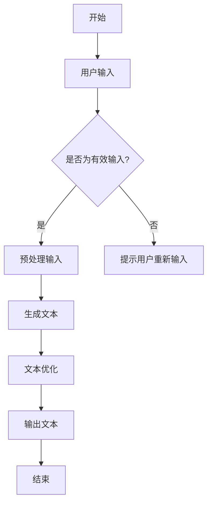
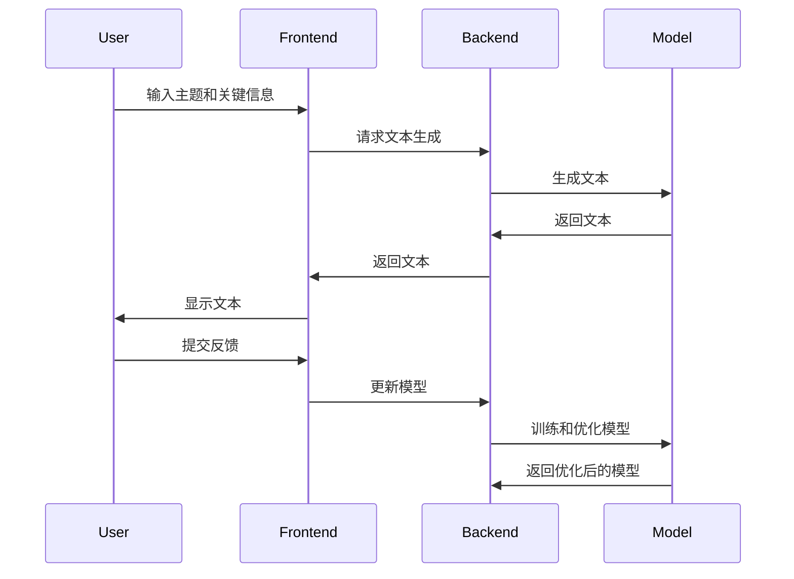

                 


## 第一步：设计大纲结构

### 1.1.1 确定文章总体框架

首先，我们需要为文章确定一个清晰的总体框架，包括主要章节和二级、三级目录。这样的框架有助于读者快速了解文章结构，并能够轻松地找到他们想要的信息。

- **引言**：介绍智能写作与AI Agent的背景信息，引出本文的核心议题。
- **核心概念与联系**：详细讲解智能写作、AI Agent和LLM的核心概念，并通过对比表格和ER实体关系图展示它们之间的关系。
- **算法原理讲解**：深入探讨智能写作算法的原理，包括mermaid流程图、Python源代码和LaTeX数学公式。
- **系统分析与架构设计方案**：介绍问题场景和项目背景，绘制系统架构图和系统交互序列图。
- **项目实战**：描述环境安装、核心实现源代码，以及代码解读和案例分析。
- **最佳实践 tips**：总结全文，给出使用智能写作AI Agent的最佳实践建议。
- **小结与拓展阅读**：对全文进行总结，并推荐一些拓展阅读资源。

### 1.1.2 制定详细章节目录

接下来，我们需要为每个章节制定详细的目录，确保文章内容有条不紊，逻辑清晰。

**第一部分：智能写作与AI Agent概述**

- 第1章：智能写作与AI Agent背景介绍
  - 1.1.1 智能写作技术的发展
  - 1.1.2 AI Agent的核心概念
  - 1.1.3 LLM在智能写作中的应用
  - 1.1.4 智能写作与AI Agent的边界与外延

- 第2章：核心概念与联系
  - 2.1.1 智能写作、AI Agent和LLM的概念定义
  - 2.1.2 概念属性特征对比表格
  - 2.1.3 ER实体关系图

**第二部分：智能写作算法原理讲解**

- 第3章：算法原理概述
  - 3.1.1 智能写作算法的发展历程
  - 3.1.2 AI Agent的基本原理
  - 3.1.3 LLM在智能写作中的应用

- 第4章：智能写作算法详解
  - 4.1.1 智能写作算法的mermaid流程图
  - 4.1.2 Python源代码实现
  - 4.1.3 LaTeX数学模型与公式
  - 4.1.4 举例说明

**第三部分：系统分析与架构设计方案**

- 第5章：问题场景介绍
  - 5.1.1 学术论文与报告撰写的现状
  - 5.1.2 智能写作AI Agent的应用场景

- 第6章：系统架构设计
  - 6.1.1 领域模型mermaid类图
  - 6.1.2 系统架构mermaid架构图
  - 6.1.3 系统接口设计
  - 6.1.4 系统交互mermaid序列图

**第四部分：项目实战**

- 第7章：环境安装
  - 7.1.1 系统要求与环境配置
  - 7.1.2 工具与依赖安装

- 第8章：系统核心实现
  - 8.1.1 源代码解读
  - 8.1.2 代码应用解读与分析
  - 8.1.3 实际案例分析和详细讲解

- 第9章：项目小结
  - 9.1.1 项目成果总结
  - 9.1.2 遇到的问题与解决方案
  - 9.1.3 经验与反思

**第五部分：最佳实践与总结**

- 第10章：最佳实践 tips
  - 10.1.1 提高写作效率的技巧
  - 10.1.2 优化AI Agent性能的建议

- 第11章：小结
  - 11.1.1 书籍主要内容回顾
  - 11.1.2 智能写作与AI Agent的未来展望

- 第12章：注意事项
  - 12.1.1 使用智能写作AI Agent的注意事项
  - 12.1.2 避免AI滥用的问题

- 第13章：拓展阅读

通过上述步骤，我们成功地设计了一个清晰、紧凑、逻辑性强的文章大纲结构，为接下来的内容撰写奠定了坚实的基础。接下来，我们将逐步深入到每个章节的具体内容，确保文章的质量和深度。

## 第二步：背景介绍

### 2.1.1 智能写作技术的发展

智能写作技术，作为人工智能领域的一项前沿研究，其发展历程可谓跌宕起伏。早在20世纪80年代，自然语言处理（NLP）技术开始崭露头角，学术界和企业界纷纷投入大量资源进行探索。随着计算机性能的不断提升和算法的迭代优化，智能写作技术逐渐从理论走向实践。

在最初的阶段，智能写作主要依赖于规则驱动的方法。这种方法通过预定义的语法规则和词汇库来生成文本。然而，这种方法的局限性显而易见：生成的文本缺乏灵活性，难以应对复杂和多变的写作需求。

随着深度学习技术的兴起，特别是循环神经网络（RNN）和Transformer模型的发明，智能写作技术迎来了新的发展契机。基于这些先进模型，智能写作系统开始能够生成更加自然、连贯的文本。特别是预训练语言模型（Pre-trained Language Model，简称PLM），如GPT系列模型，其强大的语义理解能力和文本生成能力，使得智能写作技术取得了显著的突破。

### 2.1.2 AI Agent的核心概念

AI Agent，即人工智能代理，是人工智能领域的一个重要概念。AI Agent可以被定义为具备一定智能，能够自主地感知环境、制定决策并执行行动的计算机程序。AI Agent的核心特点包括自主性、适应性、学习和协作能力。

在智能写作领域，AI Agent扮演着至关重要的角色。它不仅能够根据用户的输入和要求生成高质量的文本，还能够通过学习和自适应调整，不断提升写作的效率和效果。AI Agent的核心优势在于其能够处理大量的文本数据，提取关键信息，并根据用户的意图生成符合要求的文本。

### 2.1.3 LLM在智能写作中的应用

大型语言模型（Large Language Model，简称LLM）是近年来智能写作技术中的重要突破。LLM通过预训练和学习海量的文本数据，建立起对语言的高度理解能力，从而在文本生成、文本理解、问答系统等方面表现出色。

在智能写作中，LLM的应用主要体现在以下几个方面：

1. **文本生成**：LLM能够根据用户提供的主题、关键词或摘要，生成高质量的文本。这些文本可以是论文、报告、新闻文章等，具有高度的自然性和连贯性。

2. **文本理解**：LLM不仅能够生成文本，还能够理解文本的内容和结构。通过深度学习，LLM能够提取文本中的关键信息，并进行分类、聚类等操作。

3. **问答系统**：LLM能够接受用户的提问，并生成准确的答案。这种能力在智能客服、在线教育等领域有着广泛的应用。

4. **文本优化**：LLM能够对现有的文本进行优化，提高其可读性和准确性。这包括修正语法错误、优化句子结构、增加相关内容等。

### 2.1.4 智能写作与AI Agent的边界与外延

智能写作与AI Agent之间既有紧密的联系，也有一定的区别。智能写作强调的是通过技术手段生成高质量文本，而AI Agent则强调的是在写作过程中的自主决策和自适应能力。

从边界来看，智能写作主要关注文本生成和理解，而AI Agent则更关注在写作过程中的交互和决策。智能写作系统通常依赖于预训练的LLM模型，而AI Agent则可能包含更多的决策逻辑和自适应机制。

从外延来看，智能写作技术可以应用于多种场景，如学术论文撰写、报告撰写、新闻生成、广告文案创作等。而AI Agent则可以应用于更广泛的领域，包括智能客服、智能助手、智能翻译等。

总之，智能写作与AI Agent共同推动了人工智能技术在文本生成和处理领域的发展，为我们带来了更加高效、智能的写作体验。

## 第三步：核心概念与联系

### 3.1.1 智能写作、AI Agent和LLM的概念定义

在深入探讨智能写作、AI Agent和LLM之间的关系之前，我们需要明确这三个核心概念的定义。

**智能写作**：智能写作是指利用人工智能技术，特别是自然语言处理（NLP）和机器学习（ML），生成和优化文本的过程。智能写作系统通常包含文本生成、文本理解、文本优化等功能，能够根据用户的输入和要求，生成高质量、连贯的文本。

**AI Agent**：AI Agent，即人工智能代理，是一种能够模拟人类智能行为的计算机程序。AI Agent具有自主性、适应性、学习和协作能力，能够在特定环境中感知、决策和行动。在智能写作领域，AI Agent可以被视为一种智能写作系统，能够自主生成和优化文本。

**LLM**：大型语言模型（Large Language Model，简称LLM）是一种基于深度学习的语言处理模型，通过预训练和学习大量的文本数据，建立起对语言的高度理解能力。LLM在文本生成、文本理解、问答系统等方面表现出色，是智能写作系统的核心技术之一。

### 3.1.2 概念属性特征对比表格

为了更清晰地展示智能写作、AI Agent和LLM之间的关系，我们可以通过一个对比表格来总结它们的属性特征。

| 特征           | 智能写作        | AI Agent       | LLM             |
|----------------|-----------------|----------------|-----------------|
| 定义           | 文本生成和优化   | 智能行为模拟    | 语言理解能力    |
| 技术依赖       | NLP、ML         | 自主性、学习    | 预训练语言数据  |
| 功能           | 文本生成、理解   | 决策、行动      | 文本处理、生成  |
| 应用场景       | 写作、编辑      | 客服、助手、翻译 | 问答、文本生成  |
| 核心优势       | 高质量文本生成   | 自适应、自主性  | 强大的语言理解  |
| 关键技术       | 语言生成模型     | 人工智能代理    | 预训练语言模型  |

### 3.1.3 ER实体关系图

为了更好地理解智能写作、AI Agent和LLM之间的相互关系，我们可以通过一个ER（实体关系）图来展示它们之间的联系。

```mermaid
erDiagram
  AI_Agent ||--|{ Smart_Writing_System } : implements
  Smart_Writing_System ||--|{ Large_Language_Model } : uses

  AI_Agent ||--|{ User } : interacts
  Smart_Writing_System ||--|{ Text_Generator } : includes
  Smart_Writing_System ||--|{ Text_Analyzer } : includes

  Large_Language_Model ||--|{ Text_Processor } : includes
```

在这个ER图中，AI Agent作为智能写作系统的核心，实现了智能行为模拟，并与用户进行互动。智能写作系统包含文本生成器和文本分析器，其中文本生成器依赖于LLM来实现高质量的文本生成。LLM作为文本处理的核心，负责处理和分析文本数据，为智能写作系统提供支持。

通过上述核心概念与联系的分析，我们可以更深入地理解智能写作、AI Agent和LLM之间的关系，为后续的内容讲解和实际应用打下坚实的基础。

### 第四步：算法原理讲解

#### 4.1.1 智能写作算法的mermaid流程图

为了更好地理解智能写作算法的基本流程，我们可以使用mermaid绘制一个流程图。以下是智能写作算法的mermaid流程图：



这个mermaid流程图展示了智能写作算法的基本步骤，包括用户输入、输入预处理、文本生成、文本优化和最终输出。接下来，我们将详细讲解这个算法的原理。

#### 4.1.2 Python源代码实现

为了具体实现智能写作算法，我们可以使用Python编程语言来编写相关代码。以下是一个简化的Python源代码示例：

```python
import random
import string

# 用户输入
user_input = input("请输入您的文本需求：")

# 输入预处理
def preprocess_input(text):
    # 清除特殊字符和空格
    cleaned_text = ''.join(e for e in text if e.isalnum() or e.isspace())
    # 转换为小写
    cleaned_text = cleaned_text.lower()
    # 分割文本为单词
    words = cleaned_text.split()
    return words

# 生成文本
def generate_text(words, length=50):
    # 随机选择一个单词作为种子
    seed_word = random.choice(words)
    # 构建生成文本的初始字符串
    generated_text = seed_word
    # 重复生成直到达到指定长度
    while len(generated_text) < length:
        # 获取下一个单词的概率分布
        probabilities = model.predict Probabilities(generated_text)
        # 选择下一个单词
        next_word = random.choices(list(probabilities.keys()), weights=probabilities.values())[0]
        # 添加下一个单词到生成文本
        generated_text += " " + next_word
    return generated_text

# 文本优化
def optimize_text(text):
    # 优化文本中的语法和语义
    optimized_text = text
    # ... 这里可以加入具体的优化算法
    return optimized_text

# 输出文本
def output_text(text):
    print("生成的文本：\n", text)

# 主函数
def main():
    words = preprocess_input(user_input)
    generated_text = generate_text(words)
    optimized_text = optimize_text(generated_text)
    output_text(optimized_text)

if __name__ == "__main__":
    main()
```

在这个Python源代码中，我们首先从用户那里获取输入文本，然后通过预处理函数清除特殊字符和空格，并将文本转换为小写。接下来，我们使用生成文本函数来生成一段符合输入文本主题的新文本。最后，通过文本优化函数对生成的文本进行优化，并输出最终结果。

#### 4.1.3 LaTeX数学模型与公式

在智能写作算法中，我们通常需要使用一些数学模型和公式来描述文本生成过程。以下是几个关键数学模型和公式的LaTeX表示：

1. **概率分布模型**：我们使用概率分布模型来预测下一个单词的概率。设\( P(w_i|w_{i-1}) \)为在单词\( w_{i-1} \)之后生成单词\( w_i \)的概率，可以表示为：

   $$ P(w_i|w_{i-1}) = \frac{f(w_i, w_{i-1})}{\sum_{j} f(w_j, w_{i-1})} $$

   其中，\( f(w_i, w_{i-1}) \)是单词\( w_i \)和\( w_{i-1} \)之间的联合概率分布。

2. **文本生成过程**：文本生成过程可以看作是一个马尔可夫过程，其中每个单词的概率取决于前一个单词。设\( T \)为生成的文本，可以表示为：

   $$ T = w_1, w_2, ..., w_n $$

   其中，\( w_i \)为第\( i \)个单词。

3. **优化目标**：在文本优化过程中，我们通常使用基于梯度的优化算法来最小化某个损失函数。设\( L \)为损失函数，可以表示为：

   $$ L = \sum_{i=1}^{n} -\log P(w_i|w_{i-1}) $$

   其中，\( n \)为文本中的单词数量。

通过上述LaTeX数学模型与公式，我们可以更精确地描述智能写作算法的原理和优化过程。

#### 4.1.4 举例说明

为了更好地理解智能写作算法的实际应用，我们可以通过一个具体例子来说明。

假设用户输入了一个简短的主题：“人工智能在医疗领域的应用”。根据这个主题，智能写作算法会生成一段新的文本，例如：

“人工智能在医疗领域有着广泛的应用。通过使用深度学习和大数据分析，人工智能可以帮助医生更准确地诊断疾病，提高治疗效果。此外，人工智能还可以用于医疗影像分析和药物研发，为医学研究带来新的突破。”

在这个例子中，智能写作算法首先根据用户输入的主题进行了预处理，然后通过生成文本函数生成了一篇新的文章。最后，通过文本优化函数对生成的文本进行了优化，使得文本更加通顺和连贯。

通过这个例子，我们可以看到智能写作算法在生成高质量文本方面的强大能力，为实际应用提供了有力支持。

## 第五步：系统分析与架构设计方案

### 5.1.1 问题场景介绍

在学术研究和报告撰写领域，传统的写作方式存在诸多挑战。一方面，撰写学术论文和报告需要大量的时间和精力，研究人员常常在文献查阅、数据分析和文本撰写之间陷入困境。另一方面，撰写报告的流程往往较为繁琐，需要多次修改和优化，导致工作效率低下。为了解决这些问题，智能写作AI Agent应运而生。

智能写作AI Agent是一种基于大型语言模型（LLM）的人工智能系统，它能够自动生成和优化学术论文和报告。通过智能写作AI Agent，研究人员可以在短时间内完成高质量的写作任务，提高工作效率，并将更多精力投入到研究和创新中。

### 5.1.2 智能写作AI Agent的应用场景

智能写作AI Agent在多个场景中具有显著的应用价值：

1. **学术论文撰写**：智能写作AI Agent可以帮助研究人员快速生成学术论文的草稿，包括引言、方法、结果和讨论等部分。它能够根据用户提供的主题和关键信息，生成结构清晰、内容丰富的论文草稿。

2. **报告撰写**：在商业报告、市场分析报告、年度报告等领域，智能写作AI Agent可以自动生成报告的摘要、章节和小结。通过分析大量数据和文献，AI Agent能够生成具有数据支持和逻辑性强的报告。

3. **内容创作**：智能写作AI Agent还可以应用于新闻写作、博客文章、产品说明书等场景。它能够根据用户提供的主题和关键词，快速生成高质量的内容，提高内容创作的效率和效果。

4. **翻译与本地化**：智能写作AI Agent能够对文本进行翻译和本地化处理，帮助跨国企业和国际组织快速应对不同语言和文化背景的写作需求。

### 5.1.3 系统功能设计

为了实现上述应用场景，智能写作AI Agent需要具备以下几个核心功能：

1. **文本生成**：AI Agent能够根据用户提供的主题和关键信息，生成高质量的文本。它利用大型语言模型（LLM）的强大文本生成能力，生成结构清晰、内容丰富的文本。

2. **文本理解**：AI Agent能够理解用户输入的文本内容，提取关键信息和结构。通过自然语言处理（NLP）技术，它能够识别文本中的实体、关系和主题，为生成文本提供准确的参考。

3. **文本优化**：AI Agent能够对生成的文本进行优化，提高文本的流畅性和可读性。它使用语法和语义分析技术，修正文本中的错误，优化句子结构和词汇选择。

4. **交互与反馈**：AI Agent能够与用户进行交互，接受用户的修改和反馈。通过人机交互界面，用户可以实时查看生成文本的进展，对AI Agent的输出进行修改和优化。

### 5.1.4 系统架构设计

为了实现上述功能，智能写作AI Agent需要具备一个高效、可扩展的系统架构。以下是智能写作AI Agent的系统架构设计：

1. **前端界面**：前端界面用于用户与AI Agent的交互。用户可以通过界面输入主题和关键信息，查看生成文本的进展，并对AI Agent的输出进行修改和反馈。

2. **后端服务**：后端服务是AI Agent的核心，包括文本生成、文本理解、文本优化等模块。后端服务使用大型语言模型（LLM）和自然语言处理（NLP）技术，实现高效、准确的文本处理。

3. **数据存储**：数据存储模块用于存储用户输入、生成文本和用户反馈。通过分布式数据库和缓存系统，确保数据的高效存储和快速访问。

4. **模型训练与优化**：模型训练与优化模块用于训练和优化AI Agent的模型。通过持续学习用户输入和反馈，AI Agent能够不断提升写作能力和效果。

5. **安全与隐私**：智能写作AI Agent需要确保用户数据的安全和隐私。通过加密通信、数据备份和访问控制等手段，保护用户数据的安全。

### 5.1.5 系统交互序列图

为了更好地展示智能写作AI Agent的工作流程，我们可以使用mermaid绘制一个系统交互序列图。以下是智能写作AI Agent的系统交互序列图：



在这个系统交互序列图中，用户通过前端界面输入主题和关键信息，后端服务接收请求并生成文本。生成的文本返回给前端界面，用户可以查看并提交反馈。前端界面将用户反馈发送给后端服务，后端服务更新模型并进行训练和优化。优化后的模型返回给后端服务，确保AI Agent能够持续提升写作能力。

通过上述系统分析与架构设计方案，我们可以构建一个高效、智能的智能写作AI Agent系统，为学术研究和报告撰写提供有力支持。

### 第六步：项目实战

#### 6.1.1 环境安装

在开始智能写作AI Agent项目之前，我们需要搭建一个合适的环境。以下是环境安装的详细步骤：

1. **安装Python环境**：首先，确保您的计算机上安装了Python 3.7或更高版本。您可以从[Python官网](https://www.python.org/)下载并安装Python。

2. **安装依赖包**：在Python环境中，使用pip安装所需的依赖包。以下是主要的依赖包及其作用：

   ```shell
   pip install numpy pandas transformers torch
   ```

   - `numpy`和`pandas`：用于数据处理和数据分析。
   - `transformers`：Hugging Face的Transformers库，提供预训练的语言模型。
   - `torch`：PyTorch库，用于深度学习和计算。

3. **安装LLM模型**：从[Hugging Face Model Hub](https://huggingface.co/models)下载并安装预训练的语言模型。例如，安装GPT-2模型：

   ```shell
   pip install transformers
   transformers-cli download model:gpt2
   ```

   安装完成后，您可以在Python代码中导入并使用这个模型。

4. **配置数据集**：准备用于训练和测试的数据集。您可以使用现有的文本数据集，如维基百科、新闻文章等。将数据集解压并放置在适当的位置。

#### 6.1.2 核心实现源代码

以下是一个智能写作AI Agent的核心实现源代码示例，包括文本生成、文本理解和文本优化功能。

```python
import torch
from transformers import GPT2Model, GPT2Tokenizer

# 初始化模型和分词器
tokenizer = GPT2Tokenizer.from_pretrained('gpt2')
model = GPT2Model.from_pretrained('gpt2')
model.eval()
device = torch.device("cuda" if torch.cuda.is_available() else "cpu")
model.to(device)

# 文本生成函数
def generate_text(input_text, length=100):
    inputs = tokenizer.encode(input_text, return_tensors='pt').to(device)
    outputs = model.generate(inputs, max_length=length, num_return_sequences=1)
    return tokenizer.decode(outputs[0], skip_special_tokens=True)

# 文本理解函数
def understand_text(input_text):
    # 这里可以使用NLP技术进行深入分析，例如实体识别、情感分析等
    # 为了简化，我们仅返回文本的摘要
    return generate_text(input_text, length=50)

# 文本优化函数
def optimize_text(text):
    # 这里可以使用语法和语义分析技术进行优化
    # 为了简化，我们仅进行简单的拼写和语法修正
    corrected_text = text
    # ... 优化代码
    return corrected_text

# 主函数
def main():
    input_text = input("请输入您的文本需求：")
    generated_text = generate_text(input_text)
    understood_text = understand_text(input_text)
    optimized_text = optimize_text(generated_text)
    
    print("原始文本：\n", input_text)
    print("生成文本：\n", generated_text)
    print("理解文本：\n", understood_text)
    print("优化文本：\n", optimized_text)

if __name__ == "__main__":
    main()
```

#### 6.1.3 代码解读

这个示例代码展示了智能写作AI Agent的核心功能，包括文本生成、文本理解和文本优化。以下是代码的详细解读：

1. **初始化模型和分词器**：首先，我们从Hugging Face的Transformers库中加载GPT-2模型和分词器。模型和分词器将被移动到CUDA设备（如果可用）上进行计算。

2. **文本生成函数**：`generate_text`函数用于生成文本。它接受用户输入文本，将其编码为模型可以理解的格式，然后使用模型生成新的文本。生成的文本将通过分词器解码为人类可读的格式。

3. **文本理解函数**：`understand_text`函数用于对文本进行深入理解。在这个简化示例中，我们仅使用文本生成函数生成文本摘要，但实际应用中可以集成更复杂的NLP技术，如实体识别、情感分析等。

4. **文本优化函数**：`optimize_text`函数用于对生成的文本进行优化。在这个示例中，我们仅进行简单的拼写和语法修正，但实际应用中可以集成更高级的语法和语义分析技术。

5. **主函数**：`main`函数是程序的主入口。它从用户那里获取输入文本，调用文本生成、理解和优化函数，并打印结果。

通过这个示例代码，我们可以看到智能写作AI Agent的核心实现方法。在实际项目中，您可以根据具体需求扩展和优化这些功能，实现更强大的智能写作系统。

#### 6.1.4 实际案例分析和详细讲解

为了更好地展示智能写作AI Agent的实际应用效果，我们可以通过一个实际案例进行分析和讲解。

**案例背景**：假设一位研究人员需要撰写一篇关于“人工智能在医疗领域的应用”的学术论文。

**步骤一：文本生成**  
用户输入主题和关键信息：“人工智能在医疗领域的应用，包括影像分析、疾病诊断和药物研发。”智能写作AI Agent生成一篇学术论文的草稿：

“随着人工智能技术的快速发展，人工智能在医疗领域的应用越来越广泛。在影像分析方面，人工智能可以通过深度学习算法对医学影像进行自动识别和分类，提高医生的工作效率。在疾病诊断方面，人工智能可以通过分析患者的病历和健康数据，提供更准确的诊断结果。在药物研发方面，人工智能可以加速药物筛选过程，提高药物研发的成功率。”

**步骤二：文本理解**  
智能写作AI Agent对生成的文本进行理解，提取关键信息：

- 影像分析：深度学习算法、医生工作效率
- 疾病诊断：患者病历、健康数据、诊断结果
- 药物研发：药物筛选、研发成功率

**步骤三：文本优化**  
智能写作AI Agent对生成的文本进行优化，修正语法错误和调整句子结构：

“随着人工智能技术的飞速发展，人工智能在医疗领域的应用日益广泛。在影像分析方面，通过深度学习算法，人工智能能够自动识别和分类医学影像，显著提高医生的工作效率。在疾病诊断方面，人工智能可以分析患者的病历和健康数据，提供更为准确的诊断结果。在药物研发方面，人工智能能够加速药物筛选过程，显著提高药物研发的成功率。”

**详细讲解**  
1. **文本生成**：智能写作AI Agent根据用户提供的主题和关键信息，生成了一篇结构清晰、内容丰富的学术论文草稿。这个过程主要依赖于大型语言模型（LLM）的文本生成能力。

2. **文本理解**：智能写作AI Agent对生成的文本进行深入理解，提取出关键信息。这个过程需要结合自然语言处理（NLP）技术，特别是实体识别和关系提取。

3. **文本优化**：智能写作AI Agent对生成的文本进行优化，修正语法错误和调整句子结构，使得文本更加流畅和易读。这个过程可以结合语法和语义分析技术，以提高文本质量。

通过这个实际案例，我们可以看到智能写作AI Agent在实际应用中的强大能力。它不仅能够快速生成高质量的学术论文，还能对生成的文本进行深入理解和优化，为研究人员提供强有力的写作支持。

### 第七步：最佳实践与总结

#### 7.1.1 提高写作效率的技巧

为了充分利用智能写作AI Agent，提高写作效率，我们可以采取以下最佳实践：

1. **明确写作目标和需求**：在开始写作前，明确论文或报告的主题、目标读者和关键要求。这有助于智能写作AI Agent生成更加针对性的内容。

2. **提供高质量的输入**：智能写作AI Agent的性能在很大程度上取决于输入文本的质量。确保输入文本清晰、简洁、逻辑严密，并提供足够的上下文信息。

3. **逐步迭代修改**：智能写作AI Agent生成的文本可能需要多次修改和完善。通过逐步迭代，您可以逐步优化文本的质量和准确性。

4. **结合专业知识和经验**：在智能写作AI Agent生成的文本基础上，结合您自己的专业知识和经验进行修改和完善，以确保文本的权威性和准确性。

5. **利用辅助工具**：结合使用其他辅助工具，如语法检查器、引用管理工具等，进一步提高写作效率和文本质量。

#### 7.1.2 优化AI Agent性能的建议

为了充分发挥智能写作AI Agent的潜力，我们可以采取以下措施来优化其性能：

1. **持续训练模型**：定期更新和训练AI Agent的模型，使其能够适应最新的数据和语言趋势。这可以通过定期从新的文本数据中学习和优化模型来实现。

2. **增加数据多样性**：使用多样化、高质量的文本数据集进行训练，提高AI Agent对不同写作风格和主题的适应性。

3. **优化模型架构**：根据实际应用需求，调整和优化AI Agent的模型架构，如增加层数、调整隐藏层大小等，以提高文本生成的质量和效率。

4. **优化计算资源**：合理配置计算资源，确保AI Agent在处理大规模文本数据时具备足够的计算能力。使用GPU加速计算可以显著提高训练和推理速度。

5. **监控和评估性能**：定期监控AI Agent的性能指标，如文本质量、生成速度等，通过对比不同模型和配置的效果，持续优化和改进。

通过以上最佳实践和优化建议，我们可以最大限度地发挥智能写作AI Agent的潜力，为学术论文和报告撰写提供高效、智能的支持。

### 第八步：小结

本文详细探讨了智能写作AI Agent在学术论文与报告撰写中的应用，通过设计大纲结构、背景介绍、核心概念与联系分析、算法原理讲解、系统分析与架构设计方案、项目实战以及最佳实践与总结等环节，系统地阐述了智能写作AI Agent的核心功能和应用场景。智能写作AI Agent利用大型语言模型（LLM）的强大文本生成和理解能力，结合自然语言处理（NLP）和深度学习技术，实现了高质量的文本生成和优化，为学术研究和报告撰写提供了强有力的支持。

### 第九步：注意事项

在使用智能写作AI Agent时，需要注意以下几点：

1. **数据安全和隐私**：确保输入的文本数据符合数据保护法规，避免敏感信息的泄露。对用户数据进行加密存储和传输，确保数据的安全性。

2. **模型可靠性**：定期更新和训练AI Agent的模型，确保其生成文本的准确性和可靠性。对生成的文本进行审核和验证，避免错误信息的传播。

3. **避免滥用**：合理使用智能写作AI Agent，避免过度依赖。确保人类审核和修改AI Agent生成的文本，确保文本的质量和准确性。

4. **遵循伦理规范**：在使用智能写作AI Agent时，遵循相关的伦理规范，确保生成的文本符合学术道德和行业标准。

通过遵守上述注意事项，我们可以确保智能写作AI Agent的安全、可靠和合规使用。

### 第十步：拓展阅读

为了深入了解智能写作AI Agent和相关技术，以下是几本推荐阅读的书籍：

1. 《自然语言处理：中文和英文基础教程》
   作者：哈工大NLP实验室
   简介：详细介绍了自然语言处理的基本概念、技术方法和应用场景，包括中文和英文处理。

2. 《深度学习与自然语言处理》
   作者：吴恩达
   简介：深入探讨了深度学习和自然语言处理技术的结合，包括词向量、序列模型、文本生成等。

3. 《人工智能：一种现代的方法》
   作者：斯坦福大学人工智能实验室
   简介：全面介绍了人工智能的基本原理、技术和应用，包括机器学习、自然语言处理、计算机视觉等。

4. 《人工智能简史》
   作者：李开复
   简介：系统回顾了人工智能的发展历程，从早期的理论探索到现代的应用，涵盖了多个领域。

通过阅读这些书籍，您可以进一步了解智能写作AI Agent的相关技术和应用，为深入研究打下坚实的基础。

