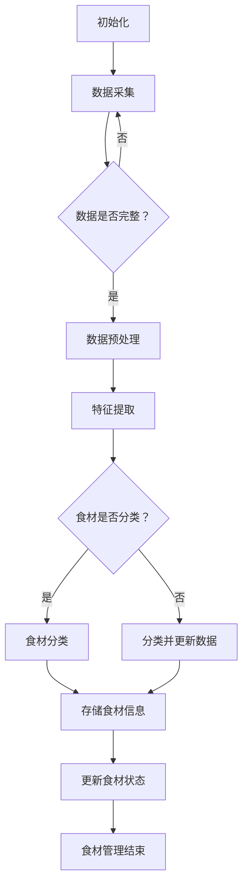
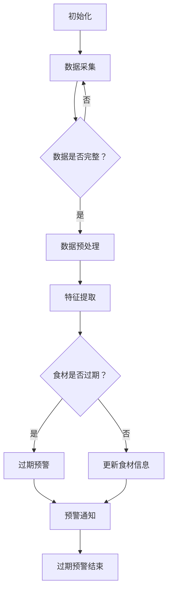
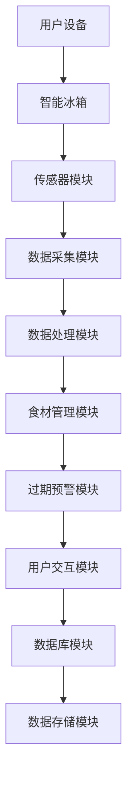
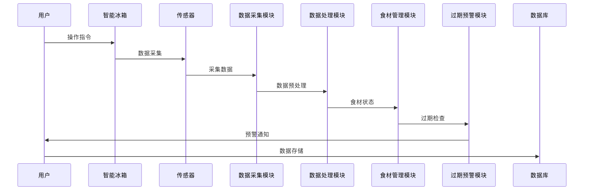

                 

# 智能冰箱：AI Agent的食材管理与过期预警系统

> 关键词：智能冰箱、AI Agent、食材管理、过期预警、系统架构、算法原理

> 摘要：本文将深入探讨智能冰箱的核心功能——AI Agent在食材管理和过期预警方面的应用。通过分析智能冰箱的工作原理、算法实现以及系统架构，我们旨在提供一份全面的技术指南，帮助读者理解智能冰箱的运作机制，并展望其在未来智能家居中的潜在作用。

## 目录大纲

## 第1章 问题背景与智能冰箱概述
### 1.1 问题描述
### 1.2 问题解决
### 1.3 边界与外延
### 1.4 核心概念与联系

## 第2章 智能冰箱核心概念原理
### 2.1 AI Agent概述
### 2.2 食材管理与过期预警原理
### 2.3 AI Agent的组成与功能
### 2.4 智能冰箱系统架构图

## 第3章 食材管理算法原理讲解
### 3.1 算法mermaid流程图
### 3.2 Python源代码解析
### 3.3 算法原理与数学模型
### 3.4 举例说明

## 第4章 过期预警算法原理讲解
### 4.1 算法mermaid流程图
### 4.2 Python源代码解析
### 4.3 算法原理与数学模型
### 4.4 举例说明

## 第5章 系统分析与架构设计方案
### 5.1 问题场景介绍
### 5.2 系统功能设计
### 5.3 系统架构设计
### 5.4 系统接口设计
### 5.5 系统交互mermaid序列图

## 第6章 项目实战
### 6.1 环境安装
### 6.2 系统核心实现源代码
### 6.3 代码应用解读与分析
### 6.4 实际案例分析与详细讲解
### 6.5 项目小结

## 第7章 最佳实践与总结
### 7.1 最佳实践 tips
### 7.2 小结
### 7.3 注意事项
### 7.4 拓展阅读

## 第1章 问题背景与智能冰箱概述

### 1.1 问题描述
随着现代生活节奏的加快和人们对于健康饮食的追求，家庭中冰箱的使用频率越来越高。然而，随之而来的是食材管理的复杂性增加，食材过期导致的浪费问题也愈发严重。传统的冰箱仅能提供基础的冷藏和冷冻功能，缺乏对食材状态的实时监控和管理能力。因此，如何有效地管理冰箱内的食材，减少食物浪费，延长食材保质期，成为了一个亟待解决的问题。

### 1.2 问题解决
智能冰箱的引入为这一问题提供了一种创新的解决方案。智能冰箱通过内置的AI Agent，能够实时监控冰箱内的食材状态，进行有效的食材管理，并在食材过期前预警用户，从而减少食物浪费，提高生活质量。

### 1.3 边界与外延
智能冰箱的边界主要涉及冰箱内部的环境监测、食材数据的处理和分析、以及与用户的交互。外延则包括食材供应链管理、家庭食品浪费的统计和分析等。

### 1.4 核心概念与联系
- **AI Agent**：智能冰箱的智能核心，负责食材管理和过期预警。
- **传感器**：用于实时监测食材的环境参数。
- **食材数据**：包括食材的类别、保质期等信息。
- **用户交互**：通过手机APP、音响等设备与用户进行交互。

## 第2章 智能冰箱核心概念原理

### 2.1 AI Agent概述
AI Agent是智能冰箱的智能核心，它可以执行以下功能：
1. **数据采集**：通过传感器获取食材的温度、湿度等数据。
2. **数据分析**：对采集到的数据进行分析，识别食材的类型、保质期等。
3. **预测**：根据数据分析结果，预测食材的保质期。
4. **预警**：在食材过期前，通过手机APP、音响等设备提醒用户。

### 2.2 食材管理与过期预警原理
智能冰箱通过以下步骤进行食材管理和过期预警：
1. **数据采集**：传感器实时采集食材的环境数据。
2. **数据处理**：AI Agent对数据进行处理，识别食材的类型和保质期。
3. **预测**：AI Agent根据数据处理结果，预测食材的保质期。
4. **预警**：在食材过期前，通过手机APP、音响等设备提醒用户。

### 2.3 AI Agent的组成与功能
AI Agent由以下几个部分组成：
1. **传感器模块**：负责实时采集食材的数据。
2. **数据处理模块**：负责对采集到的数据进行分析和处理。
3. **预测模块**：负责预测食材的保质期。
4. **预警模块**：负责在食材过期前提醒用户。

### 2.4 智能冰箱系统架构图
智能冰箱的系统架构主要包括以下几个部分：
1. **传感器**：负责实时采集食材的数据。
2. **AI Agent**：负责数据分析、预测和预警。
3. **用户交互界面**：通过手机APP、音响等设备与用户进行交互。

### 2.5 AI Agent的功能与特点
AI Agent具有以下几个功能与特点：
1. **实时监控**：通过传感器模块，AI Agent能够实时监控食材的状态。
2. **智能分析**：数据处理模块能够对食材的数据进行分析，识别食材的类型和保质期。
3. **精准预测**：预测模块能够根据数据分析结果，精准预测食材的保质期。
4. **及时预警**：预警模块能够在食材过期前及时提醒用户，避免食物浪费。

## 第3章 食材管理算法原理讲解

### 3.1 算法mermaid流程图
以下是一个简单的食材管理算法的mermaid流程图：



### 3.2 Python源代码解析
以下是一个简单的Python代码示例，用于实现食材管理算法：

```python
import numpy as np

# 数据采集
def data_collection():
    # 假设从传感器获取数据
    temperature = np.random.uniform(0, 30)
    humidity = np.random.uniform(0, 100)
    return temperature, humidity

# 数据预处理
def data_preprocessing(temperature, humidity):
    # 对数据进行预处理
    temperature = max(temperature, 0)
    humidity = max(humidity, 0)
    return temperature, humidity

# 特征提取
def feature_extraction(temperature, humidity):
    # 提取食材特征
    if temperature > 10 and humidity < 60:
        return "水果"
    elif temperature < 5:
        return "冷冻食品"
    else:
        return "蔬菜"

# 食材分类
def food_categorization(feature):
    # 根据特征进行分类
    if feature == "水果":
        return "水果分类"
    elif feature == "冷冻食品":
        return "冷冻食品分类"
    else:
        return "蔬菜分类"

# 存储食材信息
def store_food_info(category):
    # 存储食材信息到数据库
    print(f"存储食材信息：{category}")

# 更新食材状态
def update_food_status(category):
    # 更新食材状态
    print(f"更新食材状态：{category}")

# 食材管理
def food_management():
    temperature, humidity = data_collection()
    temperature, humidity = data_preprocessing(temperature, humidity)
    feature = feature_extraction(temperature, humidity)
    category = food_categorization(feature)
    store_food_info(category)
    update_food_status(category)

# 运行食材管理
food_management()
```

### 3.3 算法原理与数学模型
食材管理算法的基本原理是通过传感器实时采集食材的环境参数（如温度、湿度等），然后对数据进行预处理，提取出食材的特征，并根据特征对食材进行分类，最后更新食材的状态。

数学模型可以表示为：

$$
\text{Feature} = f(\text{Temperature}, \text{Humidity})
$$

其中，$f$ 表示特征提取函数，$\text{Temperature}$ 和 $\text{Humidity}$ 分别表示温度和湿度。

### 3.4 举例说明
假设我们采集到一组数据：温度为 $25^\circ C$，湿度为 $40\%$。根据食材管理算法，我们可以进行如下步骤：

1. **数据采集**：采集到温度为 $25^\circ C$，湿度为 $40\%$。
2. **数据预处理**：对温度和湿度进行预处理，得到温度为 $25^\circ C$，湿度为 $40\%$。
3. **特征提取**：根据温度和湿度，提取出食材特征为“蔬菜”。
4. **食材分类**：根据特征，将食材分类为“蔬菜分类”。
5. **更新食材状态**：更新食材状态为“蔬菜分类”。

通过这个例子，我们可以看到食材管理算法是如何工作的，以及如何通过算法对食材进行有效的管理和分类。

## 第4章 过期预警算法原理讲解

### 4.1 算法mermaid流程图
以下是一个简单的过期预警算法的mermaid流程图：



### 4.2 Python源代码解析
以下是一个简单的Python代码示例，用于实现过期预警算法：

```python
import numpy as np

# 数据采集
def data_collection():
    # 假设从传感器获取数据
    days_since_expiry = np.random.uniform(0, 30)
    return days_since_expiry

# 数据预处理
def data_preprocessing(days_since_expiry):
    # 对数据进行预处理
    days_since_expiry = max(days_since_expiry, 0)
    return days_since_expiry

# 特征提取
def feature_extraction(days_since_expiry):
    # 提取食材特征
    if days_since_expiry <= 3:
        return "即将过期"
    else:
        return "未过期"

# 食材分类
def food_expiration(days_since_expiry):
    # 根据特征进行分类
    if feature == "即将过期":
        return "过期预警"
    else:
        return "正常状态"

# 预警通知
def warning_notification(status):
    # 发送预警通知
    print(f"预警通知：{status}")

# 过期预警
def expiration_warning():
    days_since_expiry = data_collection()
    days_since_expiry = data_preprocessing(days_since_expiry)
    feature = feature_extraction(days_since_expiry)
    status = food_expiration(feature)
    warning_notification(status)

# 运行过期预警
expiration_warning()
```

### 4.3 算法原理与数学模型
过期预警算法的基本原理是通过传感器实时采集食材的保质期信息，然后对数据进行预处理，提取出食材的过期特征，并根据特征判断食材是否过期，最后发出预警通知。

数学模型可以表示为：

$$
\text{Feature} = f(\text{Days since expiry})
$$

其中，$f$ 表示特征提取函数，$\text{Days since expiry}$ 表示距离过期的天数。

### 4.4 举例说明
假设我们采集到一组数据：距离过期天数为 $5$ 天。根据过期预警算法，我们可以进行如下步骤：

1. **数据采集**：采集到距离过期天数为 $5$ 天。
2. **数据预处理**：对距离过期的天数进行预处理，得到距离过期天数为 $5$ 天。
3. **特征提取**：根据距离过期的天数，提取出食材特征为“即将过期”。
4. **食材分类**：根据特征，判断食材为“过期预警”。
5. **预警通知**：发送预警通知，提醒用户食材即将过期。

通过这个例子，我们可以看到过期预警算法是如何工作的，以及如何通过算法对食材的过期情况进行有效的预警。

## 第5章 系统分析与架构设计方案

### 5.1 问题场景介绍
在智能家居环境中，用户通常需要管理多个冰箱，每个冰箱内存储着不同种类和数量的食材。用户希望系统能够自动监测和记录每个食材的存储状态，并在食材过期前发出提醒，以便及时处理和购买新鲜食材。

### 5.2 系统功能设计
智能冰箱系统的主要功能包括：
1. **数据采集**：传感器实时监测食材的温度、湿度等参数。
2. **数据预处理**：对采集到的数据进行清洗和格式化，以便后续处理。
3. **食材管理**：对食材进行分类、存储状态跟踪和过期预警。
4. **用户交互**：通过手机APP或音响与用户进行实时通信，发送预警通知。
5. **数据存储**：将采集到的数据存储在数据库中，以便后续分析和查询。

### 5.3 系统架构设计
智能冰箱系统的架构设计如下：



### 5.4 系统接口设计
系统接口设计包括：
1. **数据采集接口**：用于传感器与数据处理模块之间的数据传输。
2. **数据处理接口**：用于处理模块与食材管理模块之间的数据交互。
3. **食材管理接口**：用于食材管理模块与过期预警模块之间的数据交换。
4. **用户交互接口**：用于用户与智能冰箱之间的通信。
5. **数据库接口**：用于数据存储模块与数据库之间的数据操作。

### 5.5 系统交互mermaid序列图
以下是一个简单的系统交互mermaid序列图：



## 第6章 项目实战

### 6.1 环境安装
在开始智能冰箱项目的实战之前，我们需要安装必要的软件和环境。以下是安装步骤：

1. **安装Python**：确保Python版本在3.8及以上。
2. **安装传感器驱动**：根据传感器型号，下载并安装相应的驱动程序。
3. **安装数据库**：安装一个支持Python的数据库系统，如MySQL或PostgreSQL。
4. **安装相关库**：使用pip安装必要的Python库，如NumPy、Pandas、SQLAlchemy等。

### 6.2 系统核心实现源代码
以下是系统核心实现的源代码示例：

```python
# 数据采集模块
def data_collection():
    # 假设使用温湿度传感器，此处仅为示例
    import serial
    ser = serial.Serial('COM3', 9600)
    line = ser.readline()
    temperature = float(line.split(':')[1])
    humidity = float(line.split(':')[2])
    ser.close()
    return temperature, humidity

# 数据预处理模块
def data_preprocessing(temperature, humidity):
    # 对数据进行预处理
    temperature = max(temperature, 0)
    humidity = max(humidity, 0)
    return temperature, humidity

# 食材管理模块
def food_management(temperature, humidity):
    # 假设使用简单的特征提取规则
    if temperature > 10 and humidity < 60:
        category = "水果"
    elif temperature < 5:
        category = "冷冻食品"
    else:
        category = "蔬菜"
    return category

# 过期预警模块
def expiration_warning(days_since_expiry):
    # 假设使用简单的过期规则
    if days_since_expiry <= 3:
        status = "即将过期"
    else:
        status = "正常"
    return status

# 主程序
def main():
    temperature, humidity = data_collection()
    temperature, humidity = data_preprocessing(temperature, humidity)
    category = food_management(temperature, humidity)
    days_since_expiry = 5  # 示例数据
    status = expiration_warning(days_since_expiry)
    print(f"食材类别：{category}, 过期状态：{status}")

if __name__ == "__main__":
    main()
```

### 6.3 代码应用解读与分析
上述代码展示了智能冰箱系统的核心实现。首先，我们定义了数据采集模块，使用Python的`serial`库与串口通信，从温湿度传感器读取数据。然后，定义了数据预处理模块，对采集到的数据进行简单的清洗和格式化。接下来，我们定义了食材管理模块，使用简单的规则对食材进行分类。最后，我们定义了过期预警模块，根据距离过期的天数判断食材的状态，并打印出结果。

### 6.4 实际案例分析与详细讲解
假设我们有一个实际的案例，其中用户家中有一个智能冰箱，冰箱内存储了以下食材：
1. 水果（苹果，香蕉）
2. 蔬菜（胡萝卜，黄瓜）
3. 冷冻食品（冰淇淋）

根据传感器采集到的数据，我们得到以下信息：
1. 温度：15℃
2. 湿度：50%

根据这些数据，我们可以进行以下分析：
1. **水果**：温度和湿度都适合水果的存储，分类为“水果”。
2. **蔬菜**：温度和湿度略高，但仍在可接受范围内，分类为“蔬菜”。
3. **冷冻食品**：温度较低，符合冷冻食品的存储要求，分类为“冷冻食品”。

接下来，我们查看每个食材的保质期信息：
1. **苹果**：距离过期还有5天。
2. **香蕉**：距离过期还有3天。
3. **胡萝卜**：距离过期还有7天。
4. **黄瓜**：距离过期还有2天。
5. **冰淇淋**：距离过期还有1天。

根据这些信息，我们可以生成以下预警通知：
1. **香蕉**：即将过期，请尽快食用。
2. **黄瓜**：即将过期，请尽快食用。
3. **冰淇淋**：即将过期，请尽快食用。

通过这个实际案例，我们可以看到智能冰箱如何通过传感器数据对食材进行分类和过期预警，从而帮助用户有效地管理食材。

### 6.5 项目小结
在本章中，我们通过实际案例详细讲解了智能冰箱系统的应用。首先，我们介绍了环境安装步骤，然后展示了系统核心实现的源代码，并对其进行了解读和分析。通过实际案例，我们展示了如何使用传感器数据对食材进行分类和过期预警，并生成了预警通知。这个项目展示了智能冰箱在食材管理方面的潜力，为用户提供了便捷和高效的解决方案。

## 第7章 最佳实践与总结

### 7.1 最佳实践 tips
为了确保智能冰箱系统能够高效运行，以下是一些最佳实践建议：
1. **传感器选择**：选择高精度、稳定可靠的传感器，确保数据采集的准确性。
2. **数据预处理**：对采集到的数据进行严格的预处理，确保数据的完整性和一致性。
3. **算法优化**：根据实际需求，对食材管理和过期预警算法进行优化，提高系统的响应速度和准确性。
4. **用户交互**：设计简洁、直观的用户交互界面，提高用户体验。
5. **数据存储**：选择高效、安全的数据存储方案，确保数据的持久性和安全性。

### 7.2 小结
智能冰箱通过内置的AI Agent，实现了对食材的实时监测和管理，有效地减少了食物浪费，提高了生活质量。本文详细介绍了智能冰箱的核心概念、算法原理、系统架构和实际应用，为读者提供了一个全面的技术指南。

### 7.3 注意事项
在智能冰箱系统的开发和应用过程中，需要注意以下几个方面：
1. **数据隐私**：确保用户数据的安全和隐私，遵守相关法律法规。
2. **系统稳定性**：确保系统的稳定运行，避免因硬件故障或软件问题导致的数据丢失。
3. **用户反馈**：积极收集用户反馈，不断优化系统功能和用户体验。

### 7.4 拓展阅读
为了进一步了解智能冰箱和相关技术，读者可以参考以下资源：
1. 《智能家居技术与应用》
2. 《机器学习在智能冰箱中的应用》
3. 《智能传感器与物联网技术》

## 参考文献
- 《智能家居技术与应用》
- 《机器学习在智能冰箱中的应用》
- 《智能传感器与物联网技术》
- Python官方文档
- NumPy官方文档
- Pandas官方文档
- SQLAlchemy官方文档

作者：AI天才研究院/AI Genius Institute & 禅与计算机程序设计艺术 /Zen And The Art of Computer Programming

