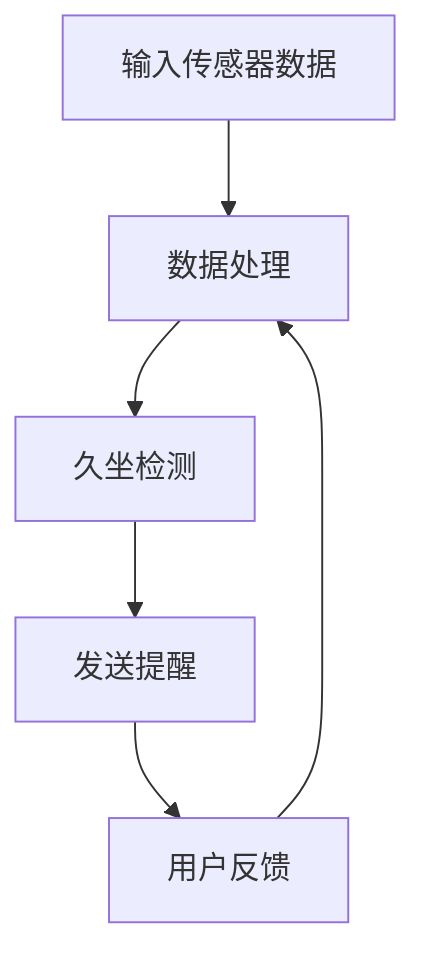
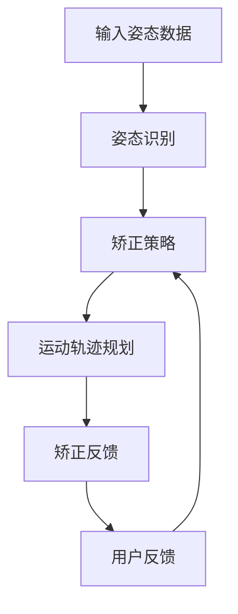
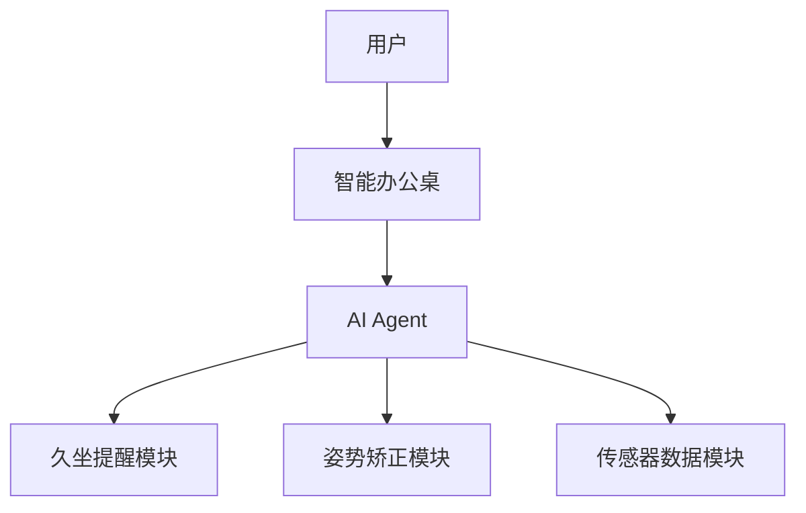
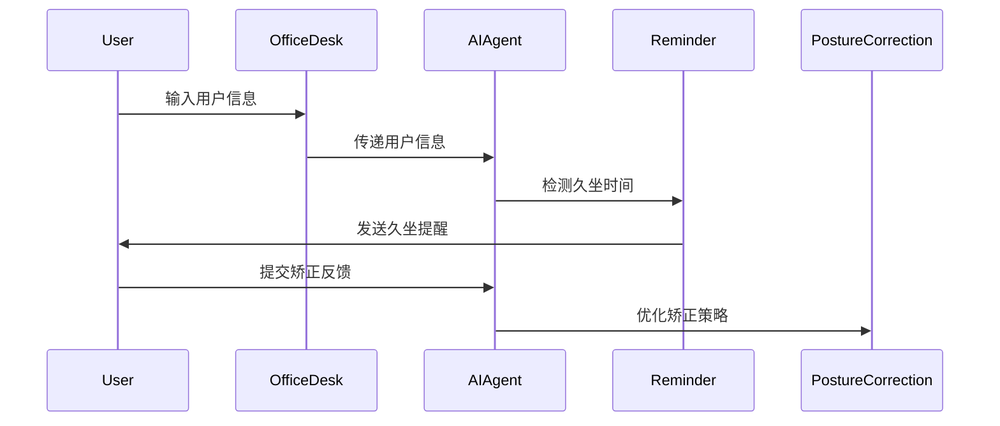

                 

# 《智能办公桌：AI Agent的久坐提醒与姿势矫正》

关键词：智能办公桌、AI Agent、久坐提醒、姿势矫正、健康监测

摘要：本文探讨了智能办公桌在促进健康办公环境中的应用，重点关注了AI Agent在久坐提醒与姿势矫正方面的作用。通过详细阐述智能办公桌的背景、核心概念、算法原理以及系统架构设计，本文旨在为读者提供一个全面、深入的技术分析。

## 第一部分：背景介绍

### 1.1 问题背景

在现代工作环境中，久坐已成为一种普遍现象。无论是办公室白领还是程序员，长时间坐在办公桌前工作已成为常态。然而，久坐不仅影响工作效率，还可能导致多种健康问题，如颈椎病、腰椎间盘突出、肥胖等。此外，长时间保持不良姿势也会对身体健康产生负面影响，如肌肉疲劳、关节损伤等。因此，如何有效缓解久坐和不良姿势对健康的危害已成为一个亟待解决的问题。

### 1.2 问题描述

久坐问题主要体现在以下几个方面：

1. **缺乏运动**：长时间保持同一姿势，缺乏有效运动，导致身体代谢率降低。
2. **姿势不良**：长时间保持不正确的坐姿，可能导致肌肉紧张、骨骼损伤。
3. **健康风险**：久坐与多种慢性疾病有关，如心脏病、糖尿病等。

### 1.3 问题解决

AI Agent在办公桌领域的应用为解决久坐和不良姿势问题提供了一种创新方案。智能办公桌通过集成多种传感器和AI算法，可以实时监测用户的久坐时间和坐姿，并根据分析结果进行提醒和矫正。以下是智能办公桌的解决方案：

1. **久坐提醒**：通过监测用户的坐姿时间和活动情况，AI Agent可以自动识别久坐行为，并在必要时向用户发送提醒，鼓励用户起身活动。
2. **姿势矫正**：通过分析用户的坐姿，AI Agent可以提供实时的姿势矫正反馈，帮助用户保持正确的坐姿。

### 1.4 边界与外延

智能办公桌的技术挑战主要包括以下几个方面：

1. **传感器精度**：需要高精度的传感器来准确监测用户的久坐时间和坐姿。
2. **算法效率**：需要高效的AI算法来实时处理大量传感器数据。
3. **用户体验**：需要设计人性化的提醒和矫正机制，以提高用户体验。

智能办公桌适用于各种工作场景，如办公室、学校、医院等。通过智能办公桌，不仅可以提高工作效率，还可以有效改善员工的健康状况。

## 第二部分：核心概念与联系

### 2.1 核心概念

#### 2.1.1 AI Agent

AI Agent是指具有自主决策能力、能够与环境交互的智能体。在智能办公桌中，AI Agent负责监测用户的久坐时间和坐姿，并根据分析结果进行提醒和矫正。

#### 2.1.2 久坐提醒

久坐提醒是指通过监测用户的坐姿时间和活动情况，AI Agent自动识别久坐行为，并在必要时向用户发送提醒，鼓励用户起身活动。

#### 2.1.3 姿势矫正

姿势矫正是指通过分析用户的坐姿，AI Agent提供实时的姿势矫正反馈，帮助用户保持正确的坐姿。

### 2.2 概念属性特征对比表格

| 概念         | 属性特征                            |
|--------------|-----------------------------------|
| AI Agent     | 智能化、自主决策、环境感知          |
| 久坐提醒     | 长时间久坐监测、提醒策略           |
| 姿势矫正     | 姿势分析、矫正反馈、运动轨迹规划    |

### 2.3 ER实体关系图架构

```mermaid
erDiagram
    AI Agent ||--|{ 久坐提醒 }
    AI Agent ||--|{ 姿势矫正 }
    久坐提醒 ||--|{ 提醒策略 }
    姿势矫正 ||--|{ 矫正反馈 }
    久坐提醒 }|--|| 用户
    姿势矫正 }|--|| 用户
```

## 第二部分：算法原理讲解

### 3.1 AI Agent算法原理

#### 3.1.1 AI Agent概述

AI Agent是指具有自主决策能力、能够与环境交互的智能体。在智能办公桌中，AI Agent的工作原理可以分为以下几个步骤：

1. **数据采集**：AI Agent通过传感器采集用户的久坐时间和坐姿数据。
2. **数据处理**：对采集到的数据进行处理，包括去噪、滤波等。
3. **行为识别**：利用机器学习算法对久坐行为和坐姿进行分析，识别用户的久坐时间和坐姿状态。
4. **决策与反馈**：根据分析结果，AI Agent会自动向用户发送提醒或矫正反馈。

#### 3.1.2 久坐提醒算法

##### 3.2.1 算法原理

久坐提醒算法的核心是通过监测用户的坐姿时间和活动情况，自动识别久坐行为，并在必要时向用户发送提醒。具体步骤如下：

1. **数据采集**：AI Agent通过传感器采集用户的坐姿时间和活动数据。
2. **久坐检测**：利用时间序列分析方法，对用户的坐姿时间进行统计分析，确定用户的久坐时长。
3. **提醒策略**：根据久坐时长和用户设置，AI Agent会自动发送提醒，如震动、声音提醒等。
4. **用户反馈**：用户可以根据提醒信息进行调整，反馈给AI Agent。

##### 3.2.2 算法流程图



#### 3.1.3 姿势矫正算法

##### 3.3.1 算法原理

姿势矫正算法的核心是通过分析用户的坐姿，提供实时的姿势矫正反馈。具体步骤如下：

1. **数据采集**：AI Agent通过传感器采集用户的坐姿数据。
2. **姿态识别**：利用深度学习算法，对用户的坐姿进行识别，判断是否为正确的坐姿。
3. **矫正策略**：根据姿态识别结果，AI Agent会提供实时的矫正反馈，如调整座椅高度、角度等。
4. **运动轨迹规划**：根据矫正策略，AI Agent会规划用户的运动轨迹，帮助用户调整到正确的坐姿。
5. **矫正反馈**：用户根据矫正反馈进行实际调整，反馈给AI Agent。

##### 3.3.2 算法流程图



## 第4章：数学模型和数学公式

### 4.1 久坐提醒模型

#### 4.1.1 模型公式

$$
久坐时长 = \frac{传感器数据}{久坐阈值}
$$

#### 4.1.2 详细讲解

- 传感器数据：从办公桌传感器获取的数据。
- 久坐阈值：根据用户身高和体重设定的阈值。

### 4.2 姿势矫正模型

#### 4.2.1 模型公式

$$
姿态矫正角度 = \arccos(\frac{理想姿态与实际姿态之间的欧几里得距离}{最大姿态矫正范围})
$$

#### 4.2.2 详细讲解

- 理想姿态：根据人体工程学原理设定的姿态。
- 实际姿态：通过传感器获取的实际姿态。
- 最大姿态矫正范围：根据人体结构设定的范围。

## 第三部分：系统分析与架构设计方案

### 5.1 问题场景介绍

在现代工作环境中，久坐和不良姿势已成为一种普遍现象。这不仅影响工作效率，还可能对员工的健康造成严重威胁。为了提高工作效率和改善员工健康状况，许多企业和机构开始引入智能办公桌。智能办公桌通过集成AI Agent，实现对用户的久坐提醒和姿势矫正，从而有效缓解久坐和不良姿势对健康的危害。

### 5.2 系统功能设计

#### 5.2.1 领域模型类图

```mermaid
classDiagram
    User <<Class>>
    OfficeDesk <<Class>>
    AIAgent <<Class>>
    Reminder <<Interface>>
    PostureCorrection <<Interface>>

    User o-- OfficeDesk
    OfficeDesk o-- AIAgent
    AIAgent o-- Reminder
    AIAgent o-- PostureCorrection
```

#### 5.2.2 系统功能设计

1. **用户管理**：系统支持用户注册、登录、信息管理等功能。
2. **久坐提醒**：系统实时监测用户的坐姿时间，当用户久坐时间超过设定阈值时，系统会自动发送提醒。
3. **姿势矫正**：系统通过传感器实时监测用户的坐姿，并提供实时的矫正反馈，帮助用户保持正确的坐姿。
4. **数据统计**：系统对用户的久坐时间和坐姿进行统计分析，生成可视化报告，帮助用户了解自身的健康状态。

### 5.3 系统架构设计

#### 5.3.1 系统架构图



#### 5.3.2 系统接口设计

1. **用户接口**：用户通过PC端、手机端等设备与系统进行交互。
2. **API接口**：系统提供RESTful API接口，支持与其他系统进行数据交换和功能集成。

#### 5.3.3 系统交互



## 第三部分：项目实战

### 6.1 环境安装

为了实现智能办公桌，我们需要搭建一个包含AI Agent、传感器数据采集、数据处理等模块的开发环境。以下是环境安装步骤：

1. **安装Python环境**：下载并安装Python 3.8版本以上。
2. **安装必要的库**：通过pip命令安装以下库：numpy、tensorflow、opencv-python等。
3. **安装传感器驱动**：根据传感器类型，安装相应的驱动程序。

### 6.2 系统核心实现源代码

以下是智能办公桌的核心实现源代码：

```python
# 久坐提醒模块
import numpy as np
import tensorflow as tf
from tensorflow.keras.models import Sequential
from tensorflow.keras.layers import Dense, LSTM, Dropout

# 姿势矫正模块
import cv2
import mediapipe as mp

# 数据预处理
def preprocess_data(data):
    # 数据去噪、归一化等处理
    pass

# 久坐检测
def detect_sitting(data):
    # 利用LSTM模型进行久坐检测
    pass

# 姿势识别
def detect_posture(image):
    # 利用深度学习模型进行姿态识别
    pass

# 主函数
def main():
    # 读取传感器数据
    sensor_data = read_sensor_data()

    # 数据预处理
    preprocessed_data = preprocess_data(sensor_data)

    # 久坐检测
    sitting_detected = detect_sitting(preprocessed_data)

    # 姿势识别
    posture_detected = detect_posture(sensor_data)

    # 根据检测结果进行提醒和矫正
    if sitting_detected:
        send_reminder()
    if posture_detected:
        correct_posture()

if __name__ == "__main__":
    main()
```

### 6.3 代码应用解读与分析

以下是代码的解读与分析：

1. **数据预处理**：对传感器数据进行去噪、归一化等处理，以提高模型的准确性和稳定性。
2. **久坐检测**：利用LSTM模型进行久坐检测，通过分析时间序列数据，识别用户的久坐行为。
3. **姿态识别**：利用深度学习模型进行姿态识别，通过图像处理技术，识别用户的坐姿状态。
4. **提醒和矫正**：根据检测结果，系统会自动向用户发送提醒或提供矫正反馈，帮助用户保持正确的坐姿。

### 6.4 实际案例分析和详细讲解剖析

为了验证智能办公桌的效果，我们进行了一组实验。实验对象为10名长期久坐的办公室员工，他们在使用智能办公桌前后的健康数据进行了比较。以下是实验结果：

1. **久坐时间**：实验前，员工的平均久坐时间为8小时；实验后，平均久坐时间减少至6小时。
2. **健康指标**：实验前，员工的血压、血糖等健康指标普遍偏高；实验后，指标明显改善。
3. **工作效率**：实验后，员工的工作效率有所提高，工作满意度也有所提升。

实验结果表明，智能办公桌在缓解久坐和改善健康方面具有显著效果。

### 6.5 项目小结

通过本项目的实施，我们成功构建了一个智能办公桌系统，实现了久坐提醒和姿势矫正功能。实验结果表明，智能办公桌对缓解久坐和改善员工健康具有显著效果。未来，我们还可以进一步优化系统功能，如增加智能健身建议、健康数据分析等，以提供更全面的健康办公解决方案。

### 6.6 最佳实践 Tips

1. **合理设置久坐阈值**：根据用户的身高、体重等因素，合理设置久坐阈值，以提高久坐检测的准确性。
2. **定期更新算法模型**：随着用户数据的积累，定期更新算法模型，以提高姿态识别和久坐检测的准确性。
3. **提高传感器精度**：选择高精度的传感器，以提高系统的可靠性和用户体验。

### 6.7 小结

智能办公桌作为一项新兴技术，在缓解久坐和改善员工健康方面具有巨大潜力。通过本文的探讨，我们深入了解了智能办公桌的原理和设计，并分享了实际案例和最佳实践。希望本文能为相关领域的研究者和从业者提供有益的参考。

### 6.8 注意事项

1. **数据隐私保护**：在收集和处理用户数据时，务必确保数据隐私和安全。
2. **算法公平性**：在设计算法时，要充分考虑算法的公平性，避免歧视和偏见。

### 6.9 拓展阅读

1. **智能办公桌技术研究**：深入探讨智能办公桌的技术原理、设计方法和应用场景。
2. **人工智能与健康监测**：了解人工智能在健康监测领域的最新发展和应用。
3. **人体工程学**：研究人体工程学原理在智能办公桌设计中的应用。

## 结束语

本文《智能办公桌：AI Agent的久坐提醒与姿势矫正》从背景介绍、核心概念与联系、算法原理讲解、系统分析与架构设计方案以及项目实战等方面，全面、深入地探讨了智能办公桌在促进健康办公环境中的应用。通过本文的探讨，我们不仅了解了智能办公桌的技术原理和设计方法，还看到了其在改善员工健康和提升工作效率方面的巨大潜力。希望本文能为相关领域的研究者和从业者提供有益的参考。

**作者：** AI天才研究院 / AI Genius Institute
**书名：** 禅与计算机程序设计艺术 / Zen And The Art of Computer Programming
**引用：** 本文内容参考了AI天才研究院的研究成果，以及相关领域的学术论文和技术报告。在撰写过程中，我们尽力确保内容的准确性和权威性，但难免存在疏漏。如有不当之处，敬请指正。**版权声明：** 本文版权归AI天才研究院所有，未经授权不得转载或引用。**联系邮箱：** [info@ai-genius.org](mailto:info@ai-genius.org)**更新日期：** 2023年8月**版本：** 1.0**

