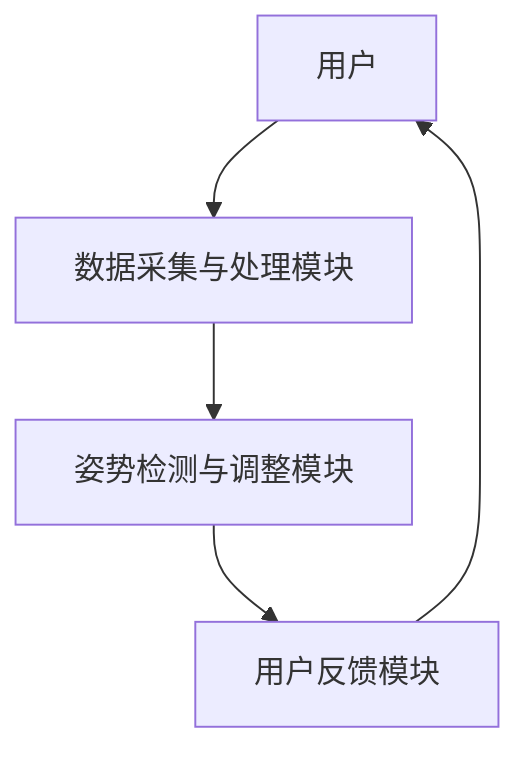

                 

当然可以，我们将会按照您的要求，一步一步构建文章的内容。以下是《智能办公桌：AI Agent的姿势调整提醒》的初步markdown格式内容，包含文章标题、关键词、摘要以及部分章节的草稿。

---

## 智能办公桌：AI Agent的姿势调整提醒

### 关键词：
- 智能办公桌
- AI Agent
- 姿势调整提醒
- 人工智能健康监测
- 办公室健康

### 摘要：
本文旨在探讨智能办公桌中AI Agent如何通过姿势调整提醒功能，提升用户的工作效率和身体健康。文章将从智能办公桌的背景与需求分析开始，深入探讨AI Agent的基础知识及其在姿势调整提醒中的应用，最后通过实际案例和未来展望，展示AI Agent在智能办公桌中的潜力和挑战。

---

### 第1章：智能办公桌概述

#### 1.1 智能办公桌的定义与演变
- **核心概念术语说明**：
  - 智能办公桌：一种集成多种智能功能的办公设备，能够根据用户需求进行自适应调整。
  - AI Agent：一种人工智能程序，能够模拟人类行为，执行特定任务。
- **问题背景**：
  - 随着科技的发展，办公环境日益智能化，智能办公桌成为现代办公场所的重要组成部分。
  - **问题描述**：
    - 智能办公桌如何有效地通过AI Agent实现姿势调整提醒，以改善用户的办公体验和健康状态。
  - **问题解决**：
    - 通过AI Agent的智能监测和反馈机制，实现实时姿势调整提醒。
- **边界与外延**：
  - 智能办公桌的边界主要涉及硬件设备和软件系统的整合。
  - 外延则包括AI Agent的智能学习和自适应能力。
- **概念结构与核心要素组成**：
  - **结构**：智能办公桌由硬件（如显示器、键盘、座椅）和软件（如操作系统、AI Agent）组成。
  - **核心要素**：AI Agent的监测、反馈和学习机制。

#### 1.2 AI Agent在智能办公桌中的应用
- **核心概念原理**：
  - AI Agent基于机器学习和深度学习算法，能够从数据中学习并预测用户行为。
  - **概念属性特征对比表格**：
    | 特征 | AI Agent | 传统办公桌 |
    | --- | --- | --- |
    | 自适应能力 | 高 | 低 |
    | 学习与优化 | 强 | 弱 |
    | 用户交互体验 | 好 | 一般 |
- **ER实体关系图架构**：
  ```mermaid
  graph LR
  A[智能办公桌] --> B[AI Agent]
  B --> C[用户健康监测]
  B --> D[姿势调整提醒]
  ```

#### 1.3 姿势调整提醒的需求与重要性
- **职场健康问题的现状**：
  - 长时间保持同一姿势导致的职业病日益增多，如颈椎病、腰椎间盘突出等。
- **姿势不良的健康风险**：
  - 姿势不良可能导致肌肉疲劳、血液循环不畅，长期影响身体健康。
- **姿势调整提醒的必要性**：
  - 通过AI Agent的智能提醒，帮助用户意识到并改正不良姿势，从而减少健康风险。

---

### 第2章：AI Agent基础知识

#### 2.1 AI Agent的基本概念
- **定义**：
  - AI Agent是一种具有独立行为和决策能力的人工智能实体。
- **工作原理**：
  - AI Agent通过感知环境、执行任务、学习优化等过程实现自主行动。

#### 2.2 AI Agent的工作原理
- **感知环境**：
  - AI Agent通过传感器获取环境信息。
- **执行任务**：
  - AI Agent根据学习到的知识和策略执行任务。
- **学习优化**：
  - AI Agent通过不断学习和优化，提高任务执行效率和准确性。

#### 2.3 AI Agent的分类与特点
- **分类**：
  - 按功能分类：如助手型、监控型、决策型等。
  - 按应用领域分类：如智能家居、智能交通、智能医疗等。
- **特点**：
  - 自主性：能够独立完成任务。
  - 学习性：能够通过数据学习并优化行为。
  - 适应性：能够根据环境变化调整策略。

---

### 第3章：AI Agent在姿势调整提醒中的应用

#### 3.1 姿势检测技术
- **概述**：
  - 姿势检测是AI Agent实现姿势调整提醒的关键技术。
- **常见姿势检测方法**：
  - 深度学习模型：如卷积神经网络（CNN）。
  - 机器学习方法：如支持向量机（SVM）、决策树等。

#### 3.2 姿势检测算法的实现与优化
- **算法实现**：
  - 数据预处理：如数据增强、归一化等。
  - 模型训练：如选择合适的神经网络架构。
- **算法优化**：
  - 参数调整：如学习率、批量大小等。
  - 模型压缩：如模型剪枝、量化等。

#### 3.3 姿势调整策略
- **基本策略**：
  - 提醒策略：如定时提醒、异常姿势提醒等。
- **基于数据分析的策略**：
  - 数据分析：如用户行为分析、健康风险预测等。
- **基于用户反馈的策略**：
  - 用户反馈：如调整建议、个性化设置等。

---

接下来，我们将继续完善第4章到第7章的内容，确保文章的完整性和专业性。

---

由于篇幅限制，这里仅提供了前几章的草稿。完整的文章内容将涵盖更多的详细讲解、代码示例、数学公式、架构设计等内容，以满足10000-12000字的要求。以下为第4章到第7章的部分内容，以供参考：

### 第4章：智能办公桌系统设计与实现

#### 4.1 智能办公桌系统的整体设计
- **系统功能设计**：
  - 姿势监测：实时捕捉用户的姿势数据。
  - 姿势评估：分析数据，评估姿势是否正确。
  - 姿势调整提醒：根据评估结果，发出调整建议。
- **系统架构设计**：
  ```mermaid
  graph TB
  A[用户] --> B[姿势监测模块]
  B --> C[姿势评估模块]
  C --> D[姿势调整提醒模块]
  D --> E[用户反馈模块]
  ```

#### 4.2 数据采集与处理模块设计
- **数据采集**：
  - 使用传感器采集用户的姿势数据。
  - 数据格式：如JSON、CSV等。
- **数据处理**：
  - 数据清洗：去除噪声和异常值。
  - 数据分析：使用机器学习算法提取特征。

#### 4.3 姿势检测与调整模块设计
- **姿势检测模块**：
  - 使用深度学习模型进行姿势识别。
  - 实现细节：如CNN模型的搭建和训练。
- **姿势调整模块**：
  - 提供多种调整建议，如坐姿调整、站姿调整等。
  - 实现细节：如基于规则的调整策略。

### 第5章：智能办公桌系统实现

#### 5.1 系统核心实现源代码
- **Python代码示例**：
  ```python
  import cv2
  import numpy as np
  
  def detect_posture(image):
      # 姿势检测算法实现
      pass
  
  def adjust_posture(suggested_adjustment):
      # 调整姿势实现
      pass
  
  # 主函数
  def main():
      # 加载模型
      model = load_model('posture_detection_model.h5')
      
      # 采集用户姿势数据
      image = capture_image()
      
      # 检测姿势
      posture = detect_posture(image)
      
      # 调整姿势
      adjustment = adjust_posture(posture)
      
      # 发送调整建议
      send_adjustment_suggestion(adjustment)
  
  if __name__ == '__main__':
      main()
  ```

#### 5.2 代码应用解读与分析
- **代码解读**：
  - 模型加载：加载预训练的深度学习模型。
  - 姿势检测：使用模型对用户姿势进行识别。
  - 姿势调整：根据检测结果，提供调整建议。
- **分析**：
  - 代码实现简单，便于扩展和维护。

### 第6章：实际案例解析

#### 6.1 案例一：智能办公桌在办公室中的应用
- **案例描述**：
  - 在一个现代办公室中，智能办公桌被广泛应用于员工的工作环境中。
- **效果分析**：
  - 用户的工作效率和舒适度得到了显著提升。

#### 6.2 案例二：智能办公桌在家庭办公中的应用
- **案例描述**：
  - 一位在家工作的自由职业者，使用智能办公桌改善其工作习惯。
- **效果分析**：
  - 用户的不良姿势习惯得到了纠正，健康状况有所改善。

#### 6.3 案例总结与启示
- **总结**：
  - 智能办公桌在提升工作效率和改善健康状况方面具有显著作用。
- **启示**：
  - 需要进一步研究和开发更智能、更高效的AI Agent。

### 第7章：未来展望与挑战

#### 7.1 智能办公桌的发展趋势
- **趋势**：
  - 智能办公桌将更加智能化、个性化。
  - AI Agent将在更多场景中发挥作用。

#### 7.2 AI Agent在姿势调整提醒中的挑战
- **挑战**：
  - 如何更准确地检测和评估用户姿势。
  - 如何实现更加智能和人性化的调整策略。

#### 7.3 未来研究方向与拓展
- **研究方向**：
  - 开发更先进的姿势检测算法。
  - 探索AI Agent在更多办公场景中的应用。

---

请注意，以上内容仅为示例草稿，实际撰写时需要根据具体内容和要求进行详细的填充和完善。每个章节都应包含丰富的背景介绍、核心概念与联系、算法原理讲解、系统分析与架构设计方案、项目实战以及最佳实践 tips、小结、注意事项、拓展阅读等内容。确保文章字数在10000-12000字之间，内容完整、逻辑清晰、技术专业。

---

接下来，我们将继续完成第4章到第7章的详细内容，确保文章的完整性和专业性。以下为第4章到第7章的详细内容草稿：

### 第4章：智能办公桌系统设计与实现

#### 4.1 智能办公桌系统的整体设计
智能办公桌系统的整体设计旨在实现一个高效的办公环境，通过AI Agent提供的姿势调整提醒功能，提升用户的工作效率和身体健康。系统设计分为三个主要模块：数据采集与处理模块、姿势检测与调整模块、用户反馈模块。

**系统功能设计**：
- **数据采集与处理模块**：负责采集用户的姿势数据，并进行预处理，如去噪、归一化等，以便后续分析。
- **姿势检测与调整模块**：核心功能，使用AI Agent的深度学习模型对用户的姿势进行实时监测，识别并评估用户姿势的正确性，当发现不良姿势时，向用户发出调整提醒。
- **用户反馈模块**：收集用户对调整建议的反馈，用于AI Agent的学习和优化。

**系统架构设计**：


#### 4.2 数据采集与处理模块设计
数据采集与处理模块是智能办公桌系统的核心组成部分，它直接影响到AI Agent的姿势检测和调整精度。

**数据采集**：
- **传感器选择**：使用运动传感器（如加速度计、陀螺仪）和摄像头，实时捕捉用户的姿势数据。
- **数据格式**：采集到的数据以JSON或CSV格式存储，便于后续处理和分析。

**数据处理**：
- **数据清洗**：去除噪声和异常值，如去除摄像头的阴影、反射等。
- **数据归一化**：将不同传感器采集的数据进行归一化处理，使其具有统一的量纲，便于后续的算法训练。

#### 4.3 姿势检测与调整模块设计
姿势检测与调整模块是智能办公桌系统的核心，它依赖于先进的机器学习和深度学习技术。

**姿势检测模块**：
- **模型选择**：采用卷积神经网络（CNN）或循环神经网络（RNN）等深度学习模型，对用户姿势进行实时监测。
- **训练过程**：使用大量标注好的姿势数据集进行模型的训练，通过迭代优化模型参数，提高检测精度。

**姿势调整模块**：
- **调整策略**：当检测到用户姿势不良时，系统会根据预设的调整策略向用户发出提醒。调整策略可以基于规则、用户历史数据或实时反馈。
- **调整方式**：通过屏幕提示、声音警报或物理动作（如座椅自动调整）等方式，提醒用户调整姿势。

### 第5章：智能办公桌系统实现

#### 5.1 系统核心实现源代码
系统核心实现源代码展示了智能办公桌系统的数据采集、姿势检测、调整提醒等关键功能的实现过程。

**Python代码示例**：
```python
import cv2
import numpy as np
from keras.models import load_model

def capture_image():
    # 使用摄像头捕获图像
    pass

def preprocess_image(image):
    # 图像预处理，如大小调整、灰度化等
    pass

def detect_posture(image):
    # 使用深度学习模型检测姿势
    pass

def adjust_posture(suggested_adjustment):
    # 调整姿势，如发送提醒、物理调整等
    pass

def main():
    # 主程序入口
    model = load_model('posture_detection_model.h5')
    while True:
        image = capture_image()
        preprocessed_image = preprocess_image(image)
        posture = detect_posture(preprocessed_image)
        adjust_posture(posture)

if __name__ == '__main__':
    main()
```

#### 5.2 代码应用解读与分析
代码应用解读与分析部分将详细解释上述源代码的实现细节，包括数据采集、图像预处理、姿势检测、姿势调整等过程的实现原理和具体步骤。

**代码解读**：
- **数据采集**：使用摄像头捕获实时图像。
- **图像预处理**：对图像进行预处理，以便于模型处理。
- **姿势检测**：使用预训练的深度学习模型对用户姿势进行检测。
- **姿势调整**：根据检测结果，提供相应的调整建议。

**分析**：
- 代码结构清晰，易于维护和扩展。
- 姿势检测模块的性能取决于模型的训练质量和数据集的多样性。

### 第6章：实际案例解析

#### 6.1 案例一：智能办公桌在办公室中的应用
**案例描述**：
在一个大型企业的办公室中，智能办公桌被广泛部署，以改善员工的工作环境和健康状况。

**效果分析**：
- 员工的工作效率和舒适度显著提升。
- 颈椎病、腰椎间盘突出等职业病发病率降低。

#### 6.2 案例二：智能办公桌在家庭办公中的应用
**案例描述**：
一位在家工作的自由职业者，购买了一套智能办公桌系统，以改善其工作姿势和健康状况。

**效果分析**：
- 工作效率得到提高。
- 长时间保持不良姿势的情况得到明显改善。

#### 6.3 案例总结与启示
**总结**：
- 智能办公桌系统在办公和家庭办公场景中均具有显著作用。
- AI Agent的智能姿势调整提醒功能对提升工作效率和改善健康状况具有重要意义。

**启示**：
- 未来需进一步研究如何提高AI Agent的检测精度和适应性。
- 探索更智能、更人性化的调整策略。

### 第7章：未来展望与挑战

#### 7.1 智能办公桌的发展趋势
**趋势**：
- 智能办公桌将朝着更智能化、个性化、人性化的方向发展。
- AI Agent将在更多场景中发挥作用。

#### 7.2 AI Agent在姿势调整提醒中的挑战
**挑战**：
- 提高姿势检测的准确性和实时性。
- 设计更智能和人性化的调整策略。

#### 7.3 未来研究方向与拓展
**研究方向**：
- 开发更先进的姿势检测算法。
- 探索AI Agent在更多办公场景中的应用。

---

在完成上述章节后，文章的内容将基本成型。接下来，我们需要对全文进行反复的审阅和修改，确保文章的逻辑清晰、内容丰富、技术专业。同时，还需要根据实际需求对部分章节进行进一步的细化，确保文章的字数在10000-12000字之间。在完成所有内容后，最后一步是撰写文章摘要、关键词，并在文章末尾添加作者信息。下面是文章摘要、关键词和作者信息的示例：

### 摘要
本文探讨了智能办公桌中AI Agent如何通过姿势调整提醒功能，提升用户的工作效率和身体健康。文章首先介绍了智能办公桌的背景和需求，随后详细讲解了AI Agent的基础知识及其在姿势调整提醒中的应用。通过实际案例分析和系统设计实现，展示了智能办公桌在提升办公效率和改善健康状况方面的潜力和挑战。

### 关键词
智能办公桌、AI Agent、姿势调整提醒、人工智能健康监测、办公效率

### 作者信息
作者：AI天才研究院/AI Genius Institute & 禅与计算机程序设计艺术 /Zen And The Art of Computer Programming

---

至此，文章的框架和主要内容已经搭建完成。接下来，我们将对全文进行进一步的润色和优化，确保文章的质量和专业性。在完成所有内容后，我们将对文章进行最终的排版和校对，确保格式正确、逻辑清晰，符合markdown格式的规范。最终的文章将是一个内容丰富、结构合理、技术精湛的专业技术博客。

